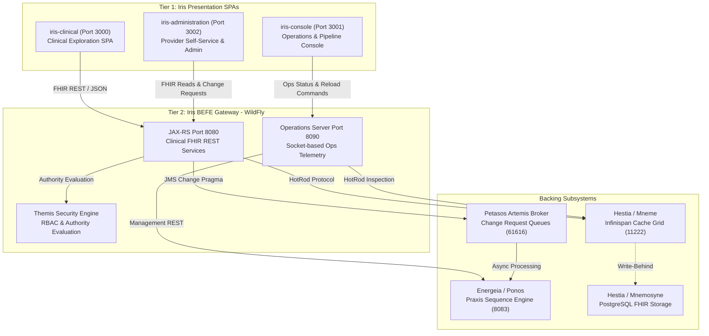

# Requirements

### Overview & Goals
The primary objective of this initiative is to expand the authoritative Harmonia ArchiMate 3.2 Technical Architecture Specification by adding a dedicated, production-grade appendix (**Appendix G: Iris Presentation Tier and User Interfaces Specification & User Guide**). 

By providing thorough, code-grounded architectural documentation, interface contracts, and practical operational examples for the three distinct Iris web applications (`iris-clinical`, `iris-console`, and `iris-administration`) and the underlying `iris-befe` gateway, this update maximizes the utility of the platform documentation for clinicians, system operators, directory administrators, and integration engineers.

### Scope
- **In Scope**:
  - Authoring `docs/latex/chapters/appendix-iris-user-interfaces.tex` (Appendix G) covering all Iris presentation submodules.
  - Creating `docs/latex/diagrams/fig-iris-architecture.tex` (ArchiMate 3.2 TikZ diagram of the Iris 3-UI + BEFE ecosystem).
  - Updating `docs/latex/main.tex` to register the new appendix.
  - Updating `docs/latex/chapters/00-frontmatter.tex` (Executive Summary) to summarize Appendix G.
  - Updating `docs/latex/chapters/03-application-layer.tex` to cross-reference Appendix G.
  - Verifying end-to-end LaTeX compilation via the project's `Makefile`.
- **Out of Scope**:
  - Modifying existing Vue 3 frontend source code or Java/WildFly backend source code in `iris/`.
  - Re-architecting existing BEFE REST APIs or security policies.

### User Stories
- **As a Clinician / Care Coordinator**, I want comprehensive documentation on the `iris-clinical` portal so that I can efficiently query patient demographics, navigate location and healthcare service hierarchies, track care team groups, and review audit provenance with minimal cognitive load.
- **As a Systems / Operations Engineer**, I want detailed runbooks and telemetry specifications for `iris-console` so that I can inspect broker queue depths, monitor Infinispan cache topologies, diagnose failed `Pragma` task pipelines, and trigger dynamic `Praxis` sequence reloads safely.
- **As a Healthcare Provider / Directory Administrator**, I want clear workflow guides for `iris-administration` so that I can navigate self-service profile change requests, departmental review work queues, and referential integrity validations under the governed change model.
- **As an Integration Developer / Architect**, I want formal interface catalogs and data flow models for `iris-befe` (covering dual ports 8080 and 8090) so that I understand request routing, caching policies, and Themis RBAC security enforcement.

### Functional Requirements
1. **Multi-Portal Architecture & Topology**:
   - Document the structure and boundaries of all three TypeScript / Vue 3 SPAs and their integration with the `iris-befe` WildFly microprofile container.
2. **BEFE Dual-Port Contract**:
   - Specify Port 8080 (Clinical FHIR R5 REST API mediated via `FhirCacheService` and HotRod) and Port 8090 (Dedicated `OperationsServerManager` socket server for sequence inspection and queue telemetry).
3. **Clinical Portal Guide (`iris-clinical`)**:
   - Document all 12 views: Dashboard, Person, Practitioner, Organization, Location Hierarchy, Healthcare Service, Group Management, Provenance, AuditEvent, Consent, Task, and Communication.
4. **Operations Console Guide (`iris-console`)**:
   - Document Operations Dashboard, Task Sequence List/Detail, Operations Data, Messaging Queues, and Cache Cluster views, including sequence reload mechanics.
5. **Provider Directory Administration Guide (`iris-administration`)**:
   - Document the Self-Service portal (My Details, My Roles, My Requests, Request Change) and Departmental Admin portal (Work Queue, Provider Search, Entity Admin, Data Quality, Themis Security, Audit Governance).
6. **Concrete Operational Examples**:
   - Provide concrete, reproducible JSON payloads, Vue component patterns, Pinia store interactions, and step-by-step user interaction scenarios.

### Non-Functional Requirements
- **Consistency**: Adhere strictly to the established LaTeX styling macros, table layouts (`tabularx`), color palettes (`harmoniablue`, `archimate-app`), and code formatting (`listings`).
- **Compilation Integrity**: The master document must compile cleanly with `latexmk` / `pdflatex` with zero undefined references or missing figure errors.
- **Clarity & Utility**: Maximize technical precision and readability, eliminating ambiguity in operator and developer procedures.

# Technical Design

### Current Implementation & Context
The Harmonia repository contains four Maven modules under `iris/`:
1. `iris-befe`: Jakarta EE 10 / WildFly container providing dual-port REST services. Port 8080 serves clinical FHIR resources via JAX-RS (`JaxRsActivator`, `FhirCacheService`, `HotRodClientProducer`), while Port 8090 runs a dedicated, lightweight `OperationsServerManager` socket server for operational telemetry and sequence control.
2. `iris-clinical`: Vue 3 + TypeScript SPA (Port 3000) for clinical data exploration and longitudinal patient record review.
3. `iris-console`: Vue 3 + TypeScript SPA (Port 3001) for systems engineers to inspect ActiveMQ Artemis queues, Infinispan cache clusters, and dynamic Praxis workflow sequences.
4. `iris-administration`: Vue 3 + TypeScript SPA (Port 3002) implementing a dual-portal interface: a Provider Self-Service portal for profile/role change requests and an Administrator portal for work queue triage, directory CRUD, and referential data quality audits.

Existing appendices in `docs/latex/chapters/` cover Paradeigma (App A), MLLP Services (App B), Ergon Modules (App C), Praxis Workflow (App D), Provider Registry (App E), and PHI-Aware Logging (App F). The presentation layer is briefly outlined in Chapter 3, but lacks a dedicated, in-depth architectural and operational manual.

### Key Decisions
1. **Dedicated Appendix Identifier & Placement**: Create Appendix G in `docs/latex/chapters/appendix-iris-user-interfaces.tex` labeled `\chapter{Iris Presentation Tier and User Interfaces Specification \& Guide}` with label `\label{app:iris_interfaces}`.
2. **ArchiMate 3.2 Diagram**: Author a dedicated TikZ diagram (`docs/latex/diagrams/fig-iris-architecture.tex`) modeling all three SPAs, the dual-port BEFE gateway, the Themis security boundary, and data-grid/relational storage paths.
3. **Code-Grounded Content**: Embed concrete TypeScript interfaces, Pinia store excerpts, JSON payloads (FHIR R5 and Operations DTOs), and step-by-step workflow interactions.
4. **Governed Change Alignment**: Emphasize how `iris-administration` interacts with the asynchronous `ProviderRegistryChangePragma` pipeline and Themis authorization model.

### Architecture Diagram

### Outline of Appendix G Sections
- **G.1: Presentation Tier Overview & Architectural Principles**:
  - High-availability web architecture, client-side state management (Pinia), and responsive UX principles.
  - 3-SPA domain separation (Clinical, Operations, Governance/Administration).
- **G.2: Iris BEFE Dual-Port Gateway Specification**:
  - JAX-RS Clinical Gateway (Port 8080) and HotRod cache integration (`FhirCacheService`).
  - Dedicated Operations Server (Port 8090, `OperationsServerManager`) for telemetry isolation.
  - CORS policies, exception mapping, and structured `OperationOutcome` responses.
- **G.3: Iris Clinical Portal (`iris-clinical`) Specification & User Guide**:
  - UI Component topology (Topbar, Sidebar, SecurityBadge, Router views).
  - Detailed view breakdown (Person, Practitioner, Location Hierarchy, Group, Task, Provenance, etc.).
  - Clinical workflow scenarios: longitudinal history inspection and care team discovery.
- **G.4: Iris Operations Console (`iris-console`) Specification & User Guide**:
  - Dashboard telemetry, broker queue monitoring (ActiveMQ Artemis), and cache cluster health (Infinispan).
  - Dynamic sequence management: inspecting step-by-step Ergon execution and triggering online sequence reloads.
- **G.5: Iris Provider Administration (`iris-administration`) Specification & User Guide**:
  - Self-Service portal: profile inspection, credential review, and asynchronous change request submission.
  - Departmental Admin portal: work queue triage, search, entity CRUD, and referential data quality auditing.
- **G.6: Themis Security & RBAC Integration**:
  - Granular authorities (`provider.read`, `provider.change.submit`, `provider.admin`, `themis.admin`).
  - Client-side navigation guards, UI component conditional rendering, and security badges.
- **G.7: End-to-End Walkthroughs & Concrete Examples**:
  - Example 1: Clinician discovering on-call specialist and clinic endpoint.
  - Example 2: Operator diagnosing a jammed queue and triggering sequence reload.
  - Example 3: Practitioner submitting a workplace address change request and administrator approving it via work queue.

### Affected Files
1. `docs/latex/chapters/appendix-iris-user-interfaces.tex` (New file)
2. `docs/latex/diagrams/fig-iris-architecture.tex` (New file)
3. `docs/latex/main.tex` (Add `\input{chapters/appendix-iris-user-interfaces.tex}`)
4. `docs/latex/chapters/00-frontmatter.tex` (Add Appendix G entry to Executive Summary)
5. `docs/latex/chapters/03-application-layer.tex` (Update Section 3.1 with Appendix G references)

# Testing

### Validation Approach
Verification of the LaTeX documentation update will be executed automatically using local compilation tools (`pdflatex` and `latexmk` via the project `Makefile`).

### Key Scenarios
1. **Compilation Cleanliness**:
   - Execute `make pdf` inside `docs/latex/` to ensure zero compilation errors, missing file warnings, or unresolved cross-references (`\ref{app:iris_interfaces}`, `\ref{fig:iris_architecture}`, etc.).
2. **Structural & Visual Formatting**:
   - Verify that all tables use proper `tabularx` column specifications and fit within standard A4 margins without horizontal overflow.
   - Verify that TikZ code in `fig-iris-architecture.tex` compiles without syntax issues and respects the `harmonia-archimate` layer color schema.
   - Ensure all listings and code blocks use proper syntax highlighting and escaping for LaTeX special characters (`_`, `^`, `{`, `}`, `&`, `%`, `$`).
3. **Master Document Alignment**:
   - Confirm Table of Contents (TOC), List of Figures (LOF), and List of Tables (LOT) properly generate with Appendix G entries and accurate roman/arabic page numbering.
   - Verify that cross-references in `00-frontmatter.tex` and `03-application-layer.tex` accurately point to Appendix G.

### Regression Prevention
- Clean compilation artifacts before and after (`make clean && make pdf`) to confirm reproducibility.
- Ensure no existing diagrams or chapter inputs are displaced or modified improperly.

# Delivery Steps

### ✓ Step 1: Design and implement ArchiMate 3.2 TikZ architecture diagram for Iris Presentation Tier
Create the ArchiMate 3.2 TikZ component and interaction diagram visualizing the complete Iris Presentation Tier architecture.

- Define nodes for all three frontend SPAs: `iris-clinical` (Port 3000), `iris-console` (Port 3001), and `iris-administration` (Port 3002).
- Model the dual-port Jakarta EE Backend-For-Frontend gateway (`iris-befe`) isolating Clinical FHIR API (Port 8080) and Operations Management HTTP server (Port 8090).
- Diagram the serving and data access relationships connecting BEFE to `Mneme` Infinispan cache grid, `Mnemosyne` PostgreSQL persistence, and `Themis` security policy evaluation.
- Save the diagram in `docs/latex/diagrams/fig-iris-architecture.tex` following the existing styling palette in `harmonia-archimate.sty`.

### ✓ Step 2: Author comprehensive Iris User Interfaces specification and guide appendix
Draft the complete, production-grade technical specification and functional user guide for all Iris user interfaces and the BEFE gateway in `docs/latex/chapters/appendix-iris-user-interfaces.tex`.

- Author Section G.1: Architectural Overview, Design Principles, and Multi-Portal Topology.
- Author Section G.2: `iris-befe` Dual-Port Gateway Specification (JAX-RS Port 8080 clinical endpoints, custom java.net socket Port 8090 operations server, HotRod cache integration, and CORS filters).
- Author Section G.3: `iris-clinical` Single-Page Application (Vue 3/TypeScript/Pinia architecture, navigation structure, and 12+ clinical resource exploration views including Person, Practitioner, Location, HealthcareService, Task, and Provenance).
- Author Section G.4: `iris-console` Operations & Workflow Console (Vue 3 architecture, ActiveMQ Artemis queue monitoring, Infinispan cache cluster inspection, dynamic Praxis sequence reloading, and Pragma pipeline debugging).
- Author Section G.5: `iris-administration` Provider Registry Administration & Self-Service Portal (Practitioner self-service profile updates, governed change request lifecycle, departmental admin work queue approval workflows, and data quality checks).
- Author Section G.6: Themis Security & RBAC Enforcement (Bearer token propagation, authority-based view routing guards, and UI visual security badges).
- Author Section G.7: Concrete Operational Examples & Step-by-Step User Walkthroughs (Clinician patient chart exploration, systems engineer queue drain and sequence reload, provider address change request, and admin change approval).

### ✓ Step 3: Integrate Appendix G into master LaTeX document, update frontmatter, and verify compilation
Wire the new Appendix G into the master LaTeX document hierarchy, update cross-references across core chapters, and verify flawless PDF compilation.

- Update `docs/latex/main.tex` to include `\input{chapters/appendix-iris-user-interfaces.tex}` under the Appendices section.
- Update `docs/latex/chapters/00-frontmatter.tex` to document Appendix G in the Executive Summary system feature index.
- Update `docs/latex/chapters/03-application-layer.tex` Section 3.1 with explicit cross-references to Appendix G (`\ref{app:iris_interfaces}`).
- Execute LaTeX compilation via `make pdf` or `pdflatex` to verify clean compilation with zero undefined references, balanced tables, and proper page numbering.