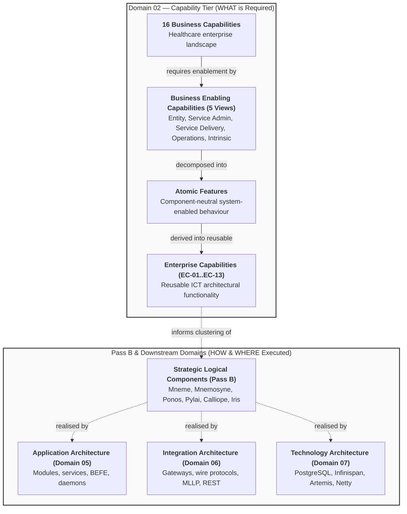

# Requirements

### Overview & Goals

The objective of this task is to perform a tightly bounded corrective reconciliation of Authoring Pass A for Domain 02 Strategy in the Harmonia Health Integration Environment (HIE). This represents **Authoring Pass A.1 — Canonical Capability & Feature Reconciliation**.

While Authoring Pass A successfully established the correct Domain 02 document structure and overall multi-tier framework under `docs/markdown/02-strategy/`, human architectural review identified that portions of `business-capabilities.md` and `business-enabling-capabilities.md` contain:
1. **Component Leakage**: Direct references to Harmonia subsystems (Mneme, Mnemosyne, Ponos, Pylai, Calliope, Iris, Themis, Agora, Erga, Petasos, Pragma, Paradeigma, Kleio) used to define or justify business capabilities and enabling features.
2. **Premature Component Allocation**: Statements asserting which component performs a behavior rather than stating what system-enabled behavior is required.
3. **Implementation-Derived Feature Inflation**: Speculative or overly granular features introduced during Pass A that reflect internal implementation mechanisms, downstream architecture patterns, or integration invariants (such as dual-write safety or BEFE gateway mediation) rather than agreed business-enabling capabilities.

The goal of Pass A.1 is **NOT** to redesign the capability model or discover new capabilities. The goal is to make the authored canonical documentation faithfully represent the capability model and feature decomposition already agreed during the capability analysis work.

This task strictly preserves the established top-down strategic progression:
```text
Business Capability
    ↓
Business Enabling Capability
    ↓
Feature
    ↓
Enterprise Capability (derivation)
    ↓
Strategic Logical Component Boundary (informs)
    ↓
Architecture Domains
```

---

### Scope

#### In Scope (Authoring Pass A.1)
1. **Business Capabilities Reconciliation (`capabilities/business-capabilities.md`)**:
   - Preserve all 16 agreed L1 Business Capabilities across the four natural regions.
   - Preserve capability quality rules CM-R01 through CM-R05.
   - Preserve the agreed Harmonia relevance taxonomy (Reference, Adjacent, Harmonia-Relevant, Harmonia-Core) and all existing capability classifications.
   - Eliminate all component-derived justification and subsystem names (Mneme, Mnemosyne, Pylai, Ponos, Themis, Petasos, Calliope, Iris, Kleio, Paradeigma) from capability definitions and enabling role summaries.
   - Express Harmonia enabling roles in terms of platform responsibilities assumed or enabled, not the components that implement them.
2. **Business Enabling Capabilities & Feature Reconciliation (`capabilities/business-enabling-capabilities.md`)**:
   - Preserve the five agreed contextual views (Entity Management, Service Administration, Service Delivery, Health Service Operations, Intrinsic / Shared Enablement) and their L1/L2/L3 hierarchies.
   - Apply the **Component-Neutral Feature Test** to every feature beneath Harmonia-Relevant and Harmonia-Core L3 capabilities.
   - Eliminate all premature component allocations (e.g., active state via Mneme, durable history via Mnemosyne, policy via Themis, collaboration via Agora, execution via Ponos/Erga, presentation via Iris, schemas via Calliope).
   - Evaluate and reconcile inflated or implementation-derived features (including the 10 specific examples identified during human review) against the A–F disposition framework.
   - Re-establish agreed domain semantics across all five views (order closed loop, technical vs. business ACK, operational event-to-activity progression, service context rule, LHR as a governed clinical view, collaboration as LHR-aware communication, workflow work units).
   - Recognize that the Pass A count of 139 features is not a target; adjust feature counts purely to reflect agreed capability analysis fidelity.
   - Maintain the Harmonia 1.x/2.x scope sufficiency statement and 3.x candidate EMPI roadmap boundary.
3. **Pass A Consistency Review**:
   - Review `README.md`, `capabilities/index.md`, `capabilities/enterprise-capabilities.md`, `capabilities/ict-foundation-lenses.md`, `capability-maps/index.md`, and `capability-maps/capability-tier-model.md` to ensure terminology, cross-links, and summary counts match the reconciled capability model.
4. **Completion Reporting**:
   - Author `.junie/reports/2026-10-05-strategy-authoring-pass-a1-reconciliation.md` satisfying all 11 required sections.

#### Out of Scope & Explicitly Deferred
- **Authoring Pass B**: Strategic Resources, Courses of Action, and the detailed Strategic Logical Component responsibility model remain strictly deferred.
- **Authoring Pass C**: The strategic Clinical Value Stream and motivation traceability matrices remain strictly deferred.
- **New Capabilities or Taxonomy Redesign**: No new Business Capabilities, Enabling Capabilities, or Enterprise Capabilities may be invented.
- **Downstream Artifacts**: No modifications to LaTeX source files (`docs/latex/`), ODT documents, or production code.

---

### User Stories

- **As an Enterprise Architect**, I want Business Capabilities and Business Enabling Capabilities to express pure healthcare enterprise and system-enabled behaviors without mentioning software subsystems so that the architecture remains robust, vendor-neutral, and enduring regardless of future component refactorings.
- **As a Systems Engineer**, I want atomic features to reflect genuine clinical and operational requirements rather than internal integration plumbing (such as dual-write safety or BEFE gateways) so that component allocations can be derived cleanly during downstream architectural passes.
- **As an Autonomous Agent**, I want an authoritative and reconciled Domain 02 baseline free of component conflation so that subsequent authoring passes (Pass B and Pass C) build on unambiguous capability definitions.

---

### Functional Requirements

- **FR-1: Component-Neutral Business Capability Profiles (`business-capabilities.md`)**:
  - Remove all component references from the descriptions and enabling role justifications across all 16 Business Capabilities (specifically in capabilities 03, 09, 10, 11, 12, 13, and 16).
  - Define Harmonia's enabling role strictly in terms of clinical, operational, and integration responsibilities (e.g., longitudinal record assembly, multi-protocol boundary mediation, default-deny policy enforcement, deterministic identity resolution).
  - Retain all 16 capability names, regional groupings, quality rules (CM-R01..05), and relevance classifications without modification.
- **FR-2: Component-Neutral Feature Test Enforcement (`business-enabling-capabilities.md`)**:
  - Every feature must satisfy the test: *"Could this Feature still be stated exactly as a required behaviour if every current Harmonia component were renamed or replaced?"*
  - Eliminate all mentions of Mneme, Mnemosyne, Ponos, Pylai, Calliope, Iris, Themis, Agora, Erga, Petasos, Pragma, Paradeigma, Kleio, REC-001, and REC-002 from feature titles, identifiers, and descriptions.
- **FR-3: Resolution of Implementation-Derived Feature Inflation**:
  - Systematically evaluate each identified inflated feature against the A–F disposition framework:
    - `FEAT-SA-04 (Referral Triage & Routing)`: Reconcile clinical triage logic back to agreed referral supporting information and outcome communication.
    - `FEAT-SA-17 (Critical Diagnostic Result Notification)`: Reconcile clinical decision alert detection back to agreed Diagnostic Report Distribution.
    - `FEAT-SD-12 (Medication Safety Alert Distribution)`: Reconcile CDS alert distribution back to agreed medication therapy provisioning and monitoring context.
    - `FEAT-HSO-03 (Ward Census Synchronization)`: Reconcile database census sync back to agreed Ward Operations / Patient Flow and Bed Status coordination.
    - `FEAT-HSO-28 (Multidisciplinary Discharge Clearance)`: Reconcile clinical clearance sign-offs back to agreed Discharge Readiness, Coordination, and Progress oversight.
    - `FEAT-ISE-11 (Inbound Dual-Write Safety)`: Remove from Business Enabling tier as an internal architectural invariant / EC-12 assurance mechanism.
    - `FEAT-ISE-12 (Default-Deny Policy Evaluation)`: Remove or reword from security enforcement mechanism to agreed Health Information Control (Consent, Authority, Access Control).
    - `FEAT-ISE-17 (Clinical Collaboration Space Lifecycle)`: Reconcile Matrix/Agora chat room management back to agreed Clinical Collaboration (Clinical Messaging, Discussion, Care-Team Collaboration).
    - `FEAT-ISE-27 (Decoupled Gateway Mediation)`: Remove from Business Enabling tier as an Application Architecture BEFE pattern / EC-11 mechanism; reframe Presentation Services around contextual display.
    - `FEAT-ISE-29 (Canonical Data Model Publication)`: Remove or reword from Calliope schema publishing to agreed Information Design Governance (Standards, Review, Authority).
- **FR-4: Preserved Domain Semantics across Entity Management & Service Administration**:
  - Preserve agreed Entity Management semantics (person identity, demographics, identifier resolution, practitioner roles, provider directory, location/bed definition vs. status, healthcare service relationships, device associations). Maintain 1.x/2.x correlation/federation scope without EMPI merges.
  - Preserve agreed Service Administration semantics (referral supporting info and outcome, patient location assignment, closed-loop order progression destination $\to$ route $\to$ deliver $\to$ acknowledge $\to$ progress $\to$ complete $\to$ outcome, technical delivery ACK $\neq$ business ACK, diagnostic report distribution, document administration, clinical communication distribution).
- **FR-5: Preserved Domain Semantics across Service Delivery, Operations & Intrinsic Enablement**:
  - Service Delivery: Preserve pattern (provide context $\to$ receive clinical outcome $\to$ correlate $\to$ preserve provenance $\to$ make available $\to$ enable next activity) across agreed Relevant areas (Primary Care, Acute, Emergency, Inpatient, Diagnostic, Medication Therapy, Screening/Immunisation, Community, Outreach, Remote Monitoring). Zero clinical decision-making or medical practice claimed.
  - Health Service Operations: Preserve operational progression (Event $\to$ Entity Context $\to$ Required Activity $\to$ Assignment $\to$ Dispatch $\to$ ACK $\to$ Progress $\to$ Outcome $\to$ Entity State Change $\to$ Next Activity). Enforce healthcare service context rule. Zero mentions of Ponos or Digital Twins.
  - Intrinsic / Shared Enablement: Preserve LHR as a governed patient-centred view (not a database); HIE modes (Submission, Retrieval, Distribution, Syndication); bounded Health Information Access; Health Information Control without Themis allocation; Clinical Collaboration as LHR-aware multidisciplinary exchange without EMR authoring or Agora allocation; Workflow work units (Work Order = human doing, To Do = human deciding/approving, Task = non-human executable); Presentation Services consuming context without owning auth or clinical state; Information Design Governance without Calliope allocation.
- **FR-6: Consistency Across Strategy Documents**:
  - Ensure `README.md`, `capabilities/index.md`, `capabilities/enterprise-capabilities.md`, `capabilities/ict-foundation-lenses.md`, `capability-maps/index.md`, and `capability-maps/capability-tier-model.md` maintain consistent terminology, cross-references, and updated feature descriptions.
- **FR-7: Preserved Roadmap Demarcation**:
  - Re-affirm Harmonia 1.x/2.x capability sufficiency and explicit isolation of authoritative master-patient EMPI reconciliation as an uncommitted 3.x roadmap candidate.
- **FR-8: Authoring Pass A.1 Completion Report**:
  - Compile `.junie/reports/2026-10-05-strategy-authoring-pass-a1-reconciliation.md` with all 11 required sections.

---

### Non-Functional Requirements

- **Strict Technology & Component Decoupling**: Zero mentions of Harmonia subsystem names or external software products in capability definitions or feature specifications.
- **Markdown Authority**: All edits confined strictly to Markdown files in `docs/markdown/02-strategy/` and reports in `.junie/reports/`; LaTeX and ODT remain untouched.
- **Hyperlink & Anchor Integrity**: All relative links across Strategy documents must resolve cleanly after reconciliation.
- **Boundary Preservation**: Strict containment within Pass A.1 scope; no leakage into Pass B (Resources, Courses of Action, Component Seams) or Pass C (Value Stream).

# Technical Design

### Current Implementation & Reconciliation Findings

Pass A established the canonical directory structure and delivered initial content across 8 Markdown files in `docs/markdown/02-strategy/`. However, inspection reveals specific areas of architectural deviation:

1. **Subsystem Leakage in `business-capabilities.md`**:
   - Capability 03: Mentions Themis policy gates.
   - Capability 09: Mentions Mnemosyne (durable) and Mneme (active).
   - Capability 10: Mentions Calliope schemas.
   - Capability 11: Mentions Pylai gateways, Petasos queuing, and Ponos orchestration.
   - Capability 12: Mentions Themis evaluation and Kleio audit logs.
   - Capability 13: Mentions Paradeigma simulation environments.
   - Capability 16: Mentions internal implementation constructs ("charging pragmas").
2. **Subsystem Leakage in `business-enabling-capabilities.md`**:
   - Features explicitly allocate behaviors to subsystems: `FEAT-ISE-02` (Mneme), `FEAT-ISE-03` (Mnemosyne), `FEAT-ISE-10` (Pylai), `FEAT-ISE-12` (Themis), `FEAT-ISE-14` (Kleio), `FEAT-ISE-17` (Agora), `FEAT-ISE-27` (Iris BEFE), `FEAT-ISE-28` (Iris SPAs), `FEAT-ISE-29` (Calliope).
   - Presentation section notes explicitly assign component ownership ("Themis owns this", "Mnemosyne owns durable truth").
3. **Implementation-Derived Feature Inflation**:
   - Features were introduced that reflect low-level integration invariants (`FEAT-ISE-11` Inbound Dual-Write Safety / REC-001), application architecture patterns (`FEAT-ISE-27` Decoupled Gateway Mediation), or security mechanisms (`FEAT-ISE-12` Default-Deny Policy Evaluation) rather than healthcare business-enabling capabilities.
   - Clinical decision support behaviors were incorrectly attributed to Harmonia features (`FEAT-SA-17` Critical Result Notification alerts, `FEAT-SD-12` CDS Medication Safety alerts).

---

### Key Decisions

1. **Component-Neutral Feature Test as Absolute Gate**:
   - Any feature whose definition requires naming a Harmonia subsystem fails the test and must be rewritten or removed. Component allocation is strictly a downstream activity (Pass B).
2. **Feature Disposition Framework (Categories A through F)**:
   - For every flagged feature:
     - **Category A (Agreed Feature under Different Wording)**: Restore the agreed capability-analysis wording.
     - **Category B (Enterprise Capability Concern)**: Remove from Business Enabling tier; verify it is appropriately captured under EC-01..EC-13.
     - **Category C (ICT Foundation Concern)**: Relegate to ICT Foundation lenses or Domain 07.
     - **Category D (Downstream Architecture Concern)**: Relegate to Application (Domain 05), Integration (Domain 06), or Security (Domain 08).
     - **Category E (Implementation Mechanism)**: Remove entirely from Strategy.
     - **Category F (Newly Invented Speculative Feature)**: Remove from the canonical model.
3. **Decoupling Feature Count from Numerical Targets**:
   - The number 139 reported in Pass A was an observational count, not an architectural target. Eliminating implementation plumbing and restoring genuine capability features will result in a natural, reconciled count. Fidelity takes precedence over count preservation.
4. **Preservation of Core Healthcare Principles**:
   - Harmonia enables clinical and operational services; Harmonia does not perform medical judgment, diagnostic triage, or clinical practice.
   - Operational context rule: Healthcare service context must be explicitly associated with activity, not merely inferred.
   - Exchange acknowledgments: Technical transport delivery ACK is strictly differentiated from business acknowledgment.

---

### Proposed Changes & Document Remediation Plan

#### 1. `docs/markdown/02-strategy/capabilities/business-capabilities.md`
- Revise the `Harmonia Enabling Role` sections for capabilities 03, 09, 10, 11, 12, 13, and 16 to remove all component names (`Themis`, `Mnemosyne`, `Mneme`, `Calliope`, `Pylai`, `Petasos`, `Ponos`, `Kleio`, `Paradeigma`) and internal implementation terms (`pragmas`).
- Express enabling roles in pure functional capability terms:
  - *Capability 03*: Evaluates patient consent directives at integration boundaries and provides immutable audit trails of record access for consumer transparency.
  - *Capability 09*: Provides vendor-neutral longitudinal clinical record assembly, durable historical state preservation, and active distributed access to managed clinical information.
  - *Capability 10*: Maintains canonical data models, bidirectional healthcare format transformations, and directory profile conformance rules.
  - *Capability 11*: Delivers multi-protocol boundary adaptation, resilient message distribution, and asynchronous activity coordination across enterprise boundaries.
  - *Capability 12*: Enforces default-deny policy evaluation, propagates immutable security context, generates tamper-evident compliance audit records, and ensures isolation of protected health information.
  - *Capability 13*: Supplies governed, de-identified clinical extracts and isolated synthetic testbed environments without hosting clinical trials.
  - *Capability 16*: Integrates with patient administration and financial systems to exchange clinical activity summaries and charging records without managing enterprise ERP functions.
- Update the summary matrix to ensure enabling responsibility descriptions contain zero component names.

#### 2. `docs/markdown/02-strategy/capabilities/business-enabling-capabilities.md`
- **Entity Management (View 1)**:
  - Remove all component references.
  - Ensure features represent agreed behaviors: person identity, demographics, identifier resolution, identity associations, healthcare subject associations, privacy handling, practitioner identity/roles, provider directory, organization hierarchies, location/bed definition vs. status, healthcare service provision, and device associations.
- **Service Administration (View 2)**:
  - Reconcile `FEAT-SA-04 (Referral Triage & Routing)`: Reframe to focus on referral supporting information and routing to designated receiving providers, removing clinical triage decision assertions.
  - Reconcile `FEAT-SA-17 (Critical Diagnostic Result Notification)`: Reframe to focus on Diagnostic Report Distribution and priority report routing, removing clinical decision alert generation.
  - Ensure closed-loop order progression semantics (`destination` $\to$ `route` $\to$ `deliver` $\to$ `acknowledge` $\to$ `progress` $\to$ `complete` $\to$ `outcome`) and technical ACK $\neq$ business ACK distinctions are preserved.
- **Service Delivery (View 3)**:
  - Reconcile `FEAT-SD-12 (Medication Safety Alert Distribution)`: Reframe to focus on distributing medication therapy records and administration status, removing clinical decision support alert engine claims.
  - Retain agreed feature decompositions for Primary Care Coordination, Acute Care Monitoring, Emergency Care Progression, Multidisciplinary Inpatient Care, Diagnostic Services, Medication Therapy Provision and Monitoring, Screening/Immunisation, Community Care Coordination, Outreach Care Continuity, and Remote Patient Monitoring.
  - Ensure the standard pattern is preserved: provide context $\to$ receive clinical outcome $\to$ correlate $\to$ preserve provenance $\to$ make available $\to$ enable next clinical activity.
- **Health Service Operations (View 4)**:
  - Reconcile `FEAT-HSO-03 (Ward Census Synchronization)`: Reframe as Ward Operations / Patient Flow Coordination and bed occupancy tracking, removing database synchronization mechanics.
  - Reconcile `FEAT-HSO-28 (Multidisciplinary Discharge Clearance)`: Reframe as tracking multidisciplinary discharge readiness and coordination milestones, removing clinical clearance sign-off assertions.
  - Preserve operational progression: Event $\to$ Entity Context $\to$ Required Activity $\to$ Assignment $\to$ Dispatch $\to$ ACK $\to$ Progress $\to$ Outcome $\to$ Entity State Change $\to$ Next Activity.
  - Enforce healthcare service context rule. Ensure zero mentions of Ponos or Digital Twins.
- **Intrinsic / Shared Enablement (View 5)**:
  - Reconcile `FEAT-ISE-02` & `FEAT-ISE-03`: Express active clinical record access and durable historical record preservation without naming Mneme or Mnemosyne.
  - Reconcile `FEAT-ISE-10`: Express multi-protocol boundary adaptation without naming Pylai.
  - Remove `FEAT-ISE-11 (Inbound Dual-Write Safety)`: Relegate to EC-12 / Invariant 4; replace with agreed message ingestion and receipt acknowledgment behavior.
  - Reconcile `FEAT-ISE-12 (Default-Deny Policy Evaluation)`: Reframe as Health Information Control (evaluating consent, authority, and access policies) without naming Themis or claiming security engine ownership.
  - Reconcile `FEAT-ISE-14`: Express immutable compliance auditing without naming Kleio.
  - Reconcile `FEAT-ISE-17`: Reframe as Clinical Collaboration space coordination (Clinical Messaging, Care-Team Collaboration) without naming Agora or Matrix.
  - Remove `FEAT-ISE-27 (Decoupled Gateway Mediation)`: Relegate to Application Architecture; reframe Presentation Services around contextual rendering of clinical timelines and administrative views without naming Iris.
  - Reconcile `FEAT-ISE-29 (Canonical Data Model Publication)`: Reframe as Information Design Governance (standards review, profile governance, and authoritative model definition) without naming Calliope.
  - Clean up Presentation boundary notes to remove parenthetical component allocations ("Themis owns this", "Mnemosyne owns durable truth").

#### 3. Cross-Document Alignment
- Review `docs/markdown/02-strategy/README.md`, `capabilities/index.md`, `capabilities/enterprise-capabilities.md`, `capabilities/ict-foundation-lenses.md`, `capability-maps/index.md`, and `capability-maps/capability-tier-model.md` to ensure any references to feature counts or component mentions in descriptions are aligned with the reconciled capabilities.

---

### Feature Reconciliation & Disposition Table

| Feature in Pass A | Identified Problem | Disposition Category | Reconciled Action & Resulting Formulation |
| :--- | :--- | :---: | :--- |
| `FEAT-SA-04: Referral Triage & Routing` | Asserts automated clinical triage based on eligibility rules. | **A / D** | Reconciled to agreed **Referral Supporting Information & Routing**: Route structured referral documents and associated clinical context to nominated receiving services based on directory endpoints. |
| `FEAT-SA-17: Critical Diagnostic Result Notification` | Claims clinical alerting and abnormal test detection (clinical CDS/EMR). | **A / D** | Reconciled to agreed **Diagnostic Report Distribution**: Deliver finalized laboratory and diagnostic imaging reports to ordering clinicians and nominated care teams with priority transport handling. |
| `FEAT-SD-12: Medication Safety Alert Distribution` | Claims allergy and drug-drug interaction alert distribution (clinical CDS). | **A / D** | Reconciled to agreed **Medication Therapy Administration Tracking**: Distribute medication therapy orders, dispensing updates, and administration records across clinical care boundaries. |
| `FEAT-HSO-03: Ward Census Synchronization` | Phrased as database synchronization rather than operational enablement. | **A / E** | Reconciled to agreed **Ward Patient Flow Coordination**: Coordinate real-time inpatient ward occupancy, care-place allocation, and patient bed status across care facilities. |
| `FEAT-HSO-28: Multidisciplinary Discharge Clearance` | Asserts multidisciplinary clinical sign-off authority and clearance gating. | **A / D** | Reconciled to agreed **Discharge Readiness & Coordination Oversight**: Track and aggregate multidisciplinary discharge milestones, home care confirmations, and transit readiness across care teams. |
| `FEAT-ISE-11: Inbound Dual-Write Safety` | Integration invariant (`REC-001`) and EC-12 assurance concern, not business enabling. | **B / E** | **Removed from Business Enabling Tier**. Relegated to Enterprise Capability `EC-12 Operational Assurance` and Invariant 4. |
| `FEAT-ISE-12: Default-Deny Policy Evaluation` | Security engine mechanism and EC-06 concern; component-coupled to Themis. | **A / B** | Reconciled to agreed **Health Information Access & Consent Enforcement**: Enforce patient consent preferences, practitioner authority boundaries, and statutory access policies for managed clinical records. |
| `FEAT-ISE-17: Clinical Collaboration Space Lifecycle` | Chat room/channel lifecycle management; component-coupled to Agora/Matrix. | **A / D** | Reconciled to agreed **Care-Team Clinical Collaboration Coordination**: Establish and coordinate secure multidisciplinary communication sessions bound to patient encounters and clinical topics. |
| `FEAT-ISE-27: Decoupled Gateway Mediation` | Application architecture pattern (BEFE) and Invariant 3, not a business enabling feature. | **C / D** | **Removed from Business Enabling Tier**. Relegated to Application Architecture (Domain 05) and `EC-11 Interaction & Experience`. |
| `FEAT-ISE-29: Canonical Data Model Publication` | Schema publication mechanism; component-coupled to Calliope. | **A / B** | Reconciled to agreed **Information Standards & Semantic Governance**: Govern canonical clinical data definitions, terminology bindings, and exchange profiles across regional systems. |
| `FEAT-ISE-02 / 03: Active / Durable Record Access` | Component-coupled to Mneme and Mnemosyne. | **A** | Rewritten in component-neutral terms: **Active Longitudinal Record Access** and **Durable Longitudinal Record Preservation**. |
| `FEAT-ISE-10: Multi-Protocol Boundary Ingress/Egress` | Component-coupled to Pylai. | **A** | Rewritten in component-neutral terms: **Standards-Based Boundary Exchange**. |
| `FEAT-ISE-14: Non-PHI Compliance Auditing` | Component-coupled to Kleio. | **A** | Rewritten in component-neutral terms: **Tamper-Evident Compliance & Security Auditing**. |
| `FEAT-ISE-28: Clinical & Administrative View Rendering` | Component-coupled to Iris SPAs. | **A** | Rewritten in component-neutral terms: **Longitudinal Clinical & Operational Presentation**. |

---

### Boundaries & Preserved Semantics Across the 5 Views



---

### Affected Files

```text
docs/markdown/02-strategy/capabilities/
├── business-capabilities.md                     [RECONCILED]
└── business-enabling-capabilities.md            [RECONCILED]

docs/markdown/02-strategy/
├── README.md                                    [CONSISTENCY CHECK]
├── capabilities/
│   ├── index.md                                 [CONSISTENCY CHECK]
│   ├── enterprise-capabilities.md               [CONSISTENCY CHECK]
│   └── ict-foundation-lenses.md                 [CONSISTENCY CHECK]
└── capability-maps/
    ├── index.md                                 [CONSISTENCY CHECK]
    └── capability-tier-model.md                 [CONSISTENCY CHECK]

.junie/reports/
└── 2026-10-05-strategy-authoring-pass-a1-reconciliation.md [NEW]
```

---

### Risks & Mitigations

- **Risk: Accidentally Changing Business Capability Relevance Classifications**: In removing component language, an author might inadvertently reclassify a capability.
  - *Mitigation*: Strictly lock all 16 relevance classifications to their approved values (01 Relevant, 02 Relevant, 03 Adjacent, 04 Relevant, 05 Reference, 06 Relevant, 07 Reference, 08 Adjacent, 09 Core, 10 Core, 11 Core, 12 Core, 13 Adjacent, 14 Reference, 15 Relevant, 16 Reference).
- **Risk: Breaking Downstream Derivation Examples**: Rewording features in `business-enabling-capabilities.md` might break examples in `capability-tier-model.md` or `enterprise-capabilities.md`.
  - *Mitigation*: Verify that derivation examples (Person Identifier Resolution, Order Closed Loop, Work Allocation & Dispatch) reference the reconciled component-neutral behaviors.
- **Risk: Loss of Authentic Healthcare Operational Context**: Stripping implementation details could inadvertently over-abstract clinical workflows.
  - *Mitigation*: Preserve the concrete healthcare domain progressions (Order lifecycle, Event $\to$ Activity $\to$ Dispatch, Healthcare service context rule, LHR clinical view).

# Testing

### Validation Approach

Validation will be performed by verifying text conformance, link integrity, and architectural boundary compliance across all authored Markdown files.

---

### Key Scenarios

1. **Business Capability Purity Check**:
   - Verify that all 16 Business Capabilities remain present in `business-capabilities.md`.
   - Verify that no Harmonia component names (Mneme, Mnemosyne, Ponos, Pylai, Calliope, Iris, Themis, Agora, Erga, Petasos, Pragma, Paradeigma, Kleio) appear in `business-capabilities.md`.
   - Confirm all 16 relevance classifications match the agreed baseline exactly.
2. **Business Enabling Capability & Feature Neutrality Check**:
   - Verify that all 5 contextual views and their full L1/L2/L3 hierarchy remain present in `business-enabling-capabilities.md`.
   - Verify zero occurrences of Harmonia subsystem names across all feature titles and descriptions.
   - Confirm that the 10 identified inflated features have been reconciled or removed according to the A–F disposition table.
   - Confirm that no integration plumbing mechanisms (e.g. dual-write safety, BEFE gateway proxying) remain as business-enabling features.
3. **Preserved Healthcare Progression Verification**:
   - Verify that Order closed-loop progression preserves the distinct steps: destination $\to$ route $\to$ deliver $\to$ acknowledge $\to$ progress $\to$ complete $\to$ outcome.
   - Verify that technical delivery ACK $\neq$ business ACK distinction is explicitly preserved.
   - Verify that operational progression preserves Event $\to$ Entity Context $\to$ Activity $\to$ Assignment $\to$ Dispatch $\to$ ACK $\to$ Progress $\to$ Outcome $\to$ Entity State Change $\to$ Next Activity.
   - Verify that the healthcare service context rule is maintained.
4. **Link & Consistency Check**:
   - Verify that all relative Markdown links across Domain 02 resolve without broken references or invalid headers.
   - Verify that no contradictory feature counts or references remain in `README.md` or `capabilities/index.md`.
5. **Pass A.1 Report Completeness Check**:
   - Confirm that `.junie/reports/2026-10-05-strategy-authoring-pass-a1-reconciliation.md` satisfies all 11 required sections.
6. **Invariance & Scope Boundary Check**:
   - Confirm via `git status` that no files outside `docs/markdown/02-strategy/` and `.junie/reports/` were touched.
   - Confirm that Strategic Resources, Courses of Action, Strategic Logical Components, and Clinical Value Stream remain strictly deferred.

# Delivery Steps

### ✓ Step 1: Reconcile Business Capability Model (business-capabilities.md)
The 16 Business Capabilities are purged of component leakage and implementation justification while preserving all classifications, regions, and quality rules.

- Edit `docs/markdown/02-strategy/capabilities/business-capabilities.md` to remove all subsystem names (Themis, Mneme, Mnemosyne, Calliope, Pylai, Petasos, Ponos, Kleio, Paradeigma) and implementation terms (pragmas) from capability descriptions and enabling role justifications.
- Re-articulate Harmonia's enabling roles in pure functional capability terms across capabilities 03, 09, 10, 11, 12, 13, and 16.
- Update the summary matrix to ensure zero component leakage in enabling responsibility summaries.
- Confirm all 16 relevance classifications remain locked to approved values.

### ✓ Step 2: Reconcile Entity Management & Service Administration Features (business-enabling-capabilities.md)
Features across Entity Management and Service Administration are cleansed of component allocations and implementation-derived inflation.

- Apply the Component-Neutral Feature Test across all Entity Management features, removing component mentions and preserving agreed identity correlation, provider directory, location/bed definition vs. status, and device association semantics without introducing full EMPI merges.
- Reconcile `FEAT-SA-04 (Referral Triage & Routing)` to focus on referral supporting information and routing, removing automated clinical triage assertions.
- Reconcile `FEAT-SA-17 (Critical Diagnostic Result Notification)` to focus on Diagnostic Report Distribution and priority routing, removing clinical decision alert detection.
- Reconcile closed-loop order progression features, strictly preserving the 7-stage order progression and the distinction between technical delivery ACK and business ACK.
- Ensure all L3 capabilities and features in Entity Management and Service Administration use component-neutral language.

### ✓ Step 3: Reconcile Service Delivery, Health Service Operations, and Intrinsic / Shared Enablement Features (business-enabling-capabilities.md)
Features across Service Delivery, Health Service Operations, and Intrinsic / Shared Enablement are cleansed of component allocations, CDS claims, and integration plumbing.

- Reconcile Service Delivery features, reframing `FEAT-SD-12` around medication administration tracking rather than CDS alert engines, and confirming that Harmonia enables context without performing medical practice.
- Reconcile Health Service Operations features, reframing `FEAT-HSO-03` (Ward Census) around operational patient flow and `FEAT-HSO-28` (Discharge Clearance) around multidisciplinary readiness tracking, enforcing the operational progression pattern and healthcare service context rule without mentioning Ponos or Digital Twins.
- Reconcile Intrinsic / Shared Enablement features: remove `FEAT-ISE-11` (Dual-Write Safety) and `FEAT-ISE-27` (Decoupled BEFE Gateway) as internal mechanisms; reframe `FEAT-ISE-02/03` (Active/Durable access), `FEAT-ISE-10` (Boundary Exchange), `FEAT-ISE-12` (Consent/Policy Control), `FEAT-ISE-14` (Compliance Audit), `FEAT-ISE-17` (Clinical Collaboration), `FEAT-ISE-28` (Clinical Presentation), and `FEAT-ISE-29` (Semantic Governance) in component-neutral terms without naming Mneme, Mnemosyne, Pylai, Themis, Kleio, Agora, Iris, or Calliope.
- Clean up Presentation boundary notes and ensure the Harmonia 1.x/2.x sufficiency statement and 3.x candidate EMPI roadmap position are prominently preserved.

### ✓ Step 4: Align Strategy Foundation Documents and Remove Cross-Document Inconsistencies
Remaining Pass A documents are updated to ensure terminology, cross-links, and feature count references align with the reconciled capability catalogues.

- Review `docs/markdown/02-strategy/README.md` and `docs/markdown/02-strategy/capabilities/index.md` to remove any obsolete feature count claims (e.g. 139) or component-capability conflations.
- Check `docs/markdown/02-strategy/capabilities/enterprise-capabilities.md` and `docs/markdown/02-strategy/capabilities/ict-foundation-lenses.md` to confirm alignment with reconciled features.
- Review `docs/markdown/02-strategy/capability-maps/capability-tier-model.md` and `capability-maps/index.md` to verify that derivation examples (Person Identifier Resolution, Order Closed Loop, Work Allocation & Dispatch) match the reconciled feature terminology.
- Verify relative Markdown hyperlink integrity across all 8 files in `docs/markdown/02-strategy/`.

### ✓ Step 5: Validate Documentation Integrity and Generate Pass A.1 Reconciliation Report
Comprehensive validation is conducted and the formal Pass A.1 completion report is authored.

- Execute validation checks asserting zero component mentions in Business Capability and Business Enabling Capability definitions, full retention of 16 L1s and 5 views, correct order and operational progression semantics, and preservation of 1.x/2.x scope boundaries.
- Verify repository invariance via `git status`, ensuring no modifications outside `docs/markdown/02-strategy/` and `.junie/reports/`, and zero modifications to LaTeX or ODT files.
- Author `.junie/reports/2026-10-05-strategy-authoring-pass-a1-reconciliation.md` detailing executive summary, files reviewed and modified, capability and feature corrections, features removed and reworded, component leakage eliminated, relevance classification confirmations, validation outcomes, and genuine issues requiring human review.
- Confirm stopping at the Authoring Pass A.1 boundary without commencing Pass B.