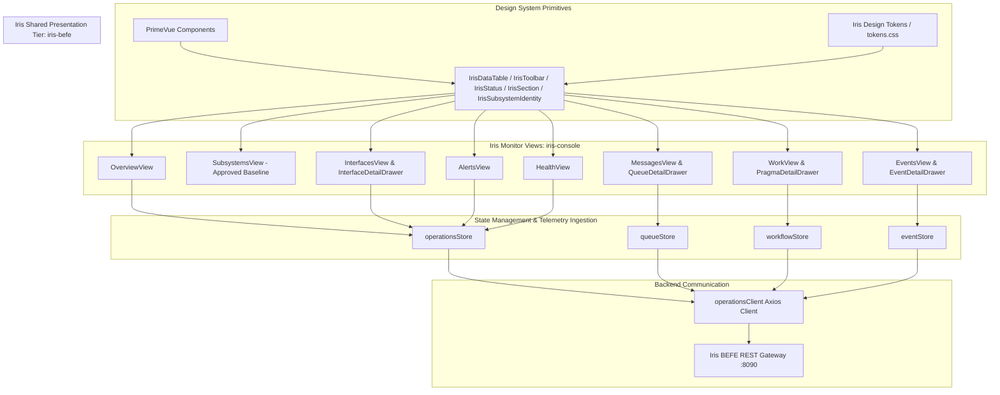

# Requirements

### Overview & Goals

Following the approval of Checkpoint 2 (Subsystems page and application shell), the remaining operational perspectives of `iris-monitor` (`iris-console`) must be migrated to the established Iris Design System. Currently, views like Interfaces, Overview, Messages, Work, Events, and Alerts contain legacy ad-hoc HTML controls, fragmented typography, giant KPI cards, and weak information density that create unnecessary cognitive friction for operators.

The primary objective is to maximize operational utility and cognitive clarity across the platform by establishing uniform visual hierarchy, consistent component usage (`@harmonia/iris-befe` and PrimeVue), high-density data tables, and structured secondary disclosure. The approved Subsystems view serves as the canonical reference implementation.

### Scope

#### In Scope
- **Platform Overview (`OverviewView.vue`)**: Restrained operational summary sections answering core operational questions, architectural area summary with Iris table/status conventions, and direct drill-downs.
- **Interfaces (`InterfacesView.vue`)**: Pylai identity header, compact operational metrics (no giant KPI cards), Iris/PrimeVue toolbar with search and direction filters, high-density `IrisDataTable`, and slide-over `InterfaceDetailDrawer.vue` for secondary telemetry.
- **Messages (`MessagesView.vue`)**: Petasos messaging identity, ActiveMQ Artemis broker topology, operational summary, high-density `IrisDataTable` in `QueueTable.vue`, and refined `QueueDetailDrawer.vue`. Deprecate legacy `MessagingQueuesView.vue`.
- **Work (`WorkView.vue`)**: Energeia execution hierarchy (Ponos, Ergon, Praxis, Pragma), high-density `IrisDataTable` in `WorkflowTable.vue`, and checkpoint visualization in `PragmaDetailDrawer.vue`.
- **Events (`EventsView.vue`)**: Chronological operational activity, `IrisToolbar` search/filtering with preserved test IDs, high-density table in `EventTimeline.vue`, and correlation tracing drawer.
- **Alerts (`AlertsView.vue`)**: Exception triage, high-density `IrisDataTable` in `AlertTable.vue`, severity tab filtering with count badges in `AlertSeverityTabs.vue`, and acknowledgment workflows.
- **Health (`HealthView.vue`)**: Dedicated architecture-oriented health and dependency matrix at `/health` (replacing redirect to `/alerts`) without duplicating the Subsystems tree.
- **Legacy Cleanup**: Removal of superseded custom CSS, raw HTML controls, and obsolete components across `iris-console`.

#### Out of Scope
- Major architectural changes or redesigns of the approved `SubsystemsView.vue` (only minor consistency fixes permitted).
- Redesign or modification of `iris-clinical` or `iris-administration`.
- Backend modifications to WildFly BEFE Java endpoints, Mnemosyne JPA, or Petasos Artemis brokers.
- Fabrication of telemetry data (adherence to `IRIS-API-GAP` tracking).

### User Stories

- **As a System Operator**, I want to scan all interface gateways, queues, and task workflows in compact, high-density tables so that I can immediately identify degraded components, message build-ups, or failing task sequences without endless scrolling.
- **As an Integration Engineer**, I want secondary interface details (such as Petasos target queues, management ports, and compliance rules) accessible via inspection drawers rather than bloated table rows, so that the primary table remains clean and easy to scan.
- **As a Site Reliability Engineer (SRE)**, I want the Overview page to directly answer "Is Harmonia healthy?", "Is work moving?", and "Are messages backing up?" with honest telemetry indicators, so that operational decisions are based on genuine metrics rather than misleading placeholders.
- **As an Incident Responder**, I want operational events and active alerts structured with standardized severity indicators and correlation IDs, so that I can trace errors across subsystem boundaries while preserving Zero-PHI guarantees.

### Functional Requirements

1. **Visual and Interaction Consistency**:
   - All monitor pages must share the same application shell, typography (`Inter` / `JetBrains Mono`), background colors, surface borders (`--iris-border-default`), and button treatments.
   - Statuses across all tables must use `IrisStatus` with standardized pulse dots, labels, and stale detection.
   - All toolbars must use `IrisToolbar` with standardized search inputs, refresh buttons, and action slots.

2. **Interfaces (Pylai Gateways)**:
   - Header must feature `Pylai — Interface Gateways` identity with status and description.
   - Compact operational summary strip: Configured Interfaces (4), Inbound (1), Outbound (2), Active Listeners (4).
   - High-density `IrisDataTable` displaying: Interface Name, Direction (Inbound/Outbound badge), Protocol (HL7 v2/MLLP, FHIR R5/REST), Port, Status, Throughput/Activity, and Error State.
   - Secondary information (target queue, REC-001 dual-write invariant, management port, API gap notice) accessible via `InterfaceDetailDrawer.vue`.
   - Direction filter toolbar (All, Inbound, Outbound) and live text search.

3. **Overview**:
   - Operational triage sections for the three core questions using `IrisSection`.
   - Architectural area summary table displaying all 6 Harmonia areas, included subsystems with live status pills, active component counts, and throughput rates.
   - Recent alerts summary banner linking to `/alerts`.
   - Metric pills for platform-wide counts (Subsystems Up/Degraded, Active Queues, Executing Tasks, Alerts).

4. **Messages (Petasos Messaging)**:
   - Header presenting `Petasos — Messaging & Transport`.
   - ActiveMQ Artemis broker status panel (Cluster status, Port 61616, Protocol CORE/OpenWire).
   - High-density `IrisDataTable` for queues displaying Queue Name, Address, Status, Depth, Consumers, Producers, Enqueue Rate, Dequeue Rate, and DLQ depth.
   - Slide-over `QueueDetailDrawer.vue` for selected queue metrics and depth history.

5. **Work (Energeia Execution Engine)**:
   - Presentation organized by Harmonia execution model: Energeia -> Ponos -> Ergon -> Praxis -> Pragma.
   - Level 1 view: High-density `IrisDataTable` of Praxis sequences (Active Executions, Queued Work, Completed, Failed, Retrying, Processing Rate, P95 Duration, Failure Rate).
   - Level 2 drill-down: Pragma instances executing within selected sequence.
   - `PragmaDetailDrawer.vue` displaying Erga checkpoints and state progression.

6. **Events**:
   - High-density chronological event log using `IrisDataTable` or high-density timeline.
   - `IrisToolbar` search and filter controls supporting correlation ID, subsystem selection, event status, and advanced filters (causation, message ID, pragma ID).
   - `EventDetailDrawer.vue` for inspecting causality and Zero-PHI boundary tags.

7. **Alerts**:
   - Severity tab filter buttons (All, Critical, Warning, Information) with count badges.
   - High-density `IrisDataTable` displaying Severity icon, Subsystem, Component, Condition, First/Last Observed, Status, and Acknowledge action.
   - Acknowledge alert workflow updating operational store state.

8. **Health**:
   - Dedicated architecture-wide health & dependency view at `/health`.
   - High-density matrix displaying each subsystem's availability percentage, P95 latency, restart count, failed operations count, and upstream/downstream dependency status.
   - Direct link to inspect detailed subsystem instances in `/subsystems/{id}`.

### Non-Functional Requirements

- **Telemetry Honesty (Rule 9)**: Where APIs do not provide live throughput, explicit placeholders (`Telemetry initializing`, `No live telemetry`) and documented gaps (`IRIS-API-GAP-001`, `IRIS-API-GAP-002`) must be displayed. Fabricating telemetry is strictly prohibited.
- **High-Density Scanning**: Interfaces and tables must prioritize vertical compact layout, concise columns, and monospaced numerical formatting to maximize scanning efficiency for operators.
- **Zero-PHI Compliance (Invariant 7)**: No patient names, MRNs, DOBs, or clinical contents may appear in tables, toolbars, or detail drawers; only opaque correlation IDs, transaction UUIDs, and system codes are permitted.
- **Accessibility & Keyboard Navigation**: Full keyboard accessibility (focus indicators, Tab order, Escape key to dismiss drawers) and standard ARIA attributes (`role="table"`, `aria-label`, `aria-expanded`).
- **Responsive Layout**: Resilient layout from desktop down to tablet resolutions without breaking toolbar layouts or creating unintended horizontal page scrollbars.

# Technical Design

### Current Implementation

The current `iris-console` codebase has achieved Checkpoint 2 by migrating the outer application shell and `SubsystemsView.vue` to `@harmonia/iris-befe` components and PrimeVue tokens. However, the remaining views exhibit significant architectural and visual debt:
- `InterfacesView.vue`: Renders raw HTML `<table>` elements with inline card styling, bulky rows, and mixed font treatments. Secondary information (e.g. Petasos queue names and management ports) is crammed directly into the primary grid.
- `OverviewView.vue`: Uses ad-hoc cards and raw `<table>` tags with hardcoded Tailwind utility classes (`bg-slate-50`, `border-slate-200`) instead of semantic `IrisSection` or `IrisDataTable` primitives.
- `QueueTable.vue` & `WorkflowTable.vue`: Render raw `<table>` markup with inconsistent cell padding, raw CSS hover styles, and lack PrimeVue sorting or pagination integration.
- `EventSearchFilter.vue`: Uses native HTML `<select>` and `<input>` controls styled with bespoke CSS rather than Iris/PrimeVue form controls.
- `style.css`: Contains legacy utility classes (`.card`, `.kpi-card`, `.stat-value`) that compete with the Iris Design System tokens in `@harmonia/iris-befe/src/theme/tokens.css`.
- `/health` route: Currently configured as a simple redirect to `/alerts` in `router/index.ts`, lacking a dedicated architectural health perspective.

### Key Decisions

1. **Standardize on `IrisDataTable` across all tabular views**:
   - *Decision*: Replace all raw HTML `<table>` implementations in `InterfacesView.vue`, `QueueTable.vue`, `WorkflowTable.vue`, and `AlertTable.vue` with `IrisDataTable`.
   - *Rationale*: Maximizes utility and scanning speed by providing consistent column alignment, row hover states, empty/loading states, and PrimeVue's accessible table foundation.

2. **Drawer-Based Progressive Disclosure for Secondary Telemetry**:
   - *Decision*: Implement `InterfaceDetailDrawer.vue` for secondary Pylai metadata and retain slide-over drawers for Queues, Pragmas, and Events.
   - *Rationale*: Keeps primary table rows compact and scannable while allowing deep operational investigation without page navigation or vertical bloating.

3. **Strict Adherence to Telemetry Honesty (`IRIS-API-GAP`)**:
   - *Decision*: Display honest placeholders (`Telemetry initializing`, `No live telemetry`) for Pylai gateway throughput and missing queue metrics.
   - *Rationale*: Prevents false confidence during clinical operations, where fabricated metrics could mislead engineers during production incidents.

4. **Dedicated Architecture-Wide Health Perspective**:
   - *Decision*: Introduce `HealthView.vue` mapped to `/health` instead of redirecting to `/alerts`.
   - *Rationale*: Distinctly provides a consolidated matrix of health probes, availability percentages, P95 latencies, and upstream/downstream dependencies across all 9 subsystems without duplicating the master-detail tree in `SubsystemsView.vue`.

5. **Harmonia Greek Conceptual Taxonomy for Work**:
   - *Decision*: Structure `WorkView.vue` strictly around `Energeia` (Subsystem), `Ponos` (Execution Engine), `Ergon` (Activity Units), `Praxis` (Task Sequence Definitions), and `Pragma` (Runtime Task Instances).
   - *Rationale*: Eliminates generic "job queue" terminology and directly reinforces the platform's execution model.

6. **Preserve DOM Element IDs for Automated Testing**:
   - *Decision*: Maintain established input IDs (e.g., `#event-search-correlation`, `#event-search-subsystem`) in migrated components.
   - *Rationale*: Guarantees zero regression across existing unit test suites (`eventsPerspective.spec.ts`, `interfacesPerspective.spec.ts`).

### Proposed Changes

#### 1. Overview (`OverviewView.vue`)
- Wrap operational triage questions in `IrisSection` containers.
- Render platform operational status strip using `IrisStatus` and font-mono metric pills.
- Replace raw HTML area summary table with `IrisDataTable` presenting:
  - Architectural Area (Name & English Title)
  - Subsystems Included (interactive status pills linking to `/subsystems/{id}`)
  - Area Status (`IrisStatus`)
  - Active Components count
  - Throughput / Rates (with honest fallback)
- Retain recent alerts ribbon with direct inspection link to `/alerts`.

#### 2. Interfaces (`InterfacesView.vue` & `InterfaceDetailDrawer.vue`)
- Page header using `IrisSubsystemIdentity` (Pylai, "Interface Gateways", status, description, and compliance badges).
- Compact operational metric strip: Configured Interfaces (4), Inbound (1), Outbound (2), Active Listeners (4).
- `IrisToolbar` with search input, direction filter buttons (All, Inbound, Outbound), and manual refresh.
- `IrisDataTable` with columns:
  - Gateway Interface (`name` and subtitle)
  - Direction (`INBOUND` / `OUTBOUND` badge)
  - Protocol (`HL7 v2 / MLLP` / `FHIR R5 / REST`)
  - Port (`:2575`, `:8087`, etc.)
  - Status (`IrisStatus`)
  - Throughput (`Telemetry initializing` or live rate)
  - Actions (Inspect button opening drawer)
- `InterfaceDetailDrawer.vue`:
  - Target Petasos Queue (`petasos.queue.pylai.mllp.in`, etc.)
  - Architectural Invariant (REC-001 Dual-Write Safety details)
  - Management & Telemetry Ports
  - Full interface description and IRIS-API-GAP-001 documentation.

#### 3. Messages (`MessagesView.vue`, `QueueTable.vue`, `QueueDetailDrawer.vue`)
- Header identity: `Petasos — Messaging & Transport`.
- Operational summary cards/strip: Total Queues, Messages in Flight, Active Consumers, DLQ Depth.
- ActiveMQ Artemis Broker information banner.
- `QueueTable.vue` refactored to `IrisDataTable`:
  - Queue Name & Address
  - Status (`IrisStatus`)
  - Message Depth
  - Consumer & Producer Counts
  - Enqueue & Dequeue Rates (msg/s)
  - DLQ Depth & Redelivery Count
  - Action button to open `QueueDetailDrawer.vue`.
- Clean up `MessagingQueuesView.vue` (remove or alias cleanly to `MessagesView.vue`).

#### 4. Work (`WorkView.vue`, `WorkflowTable.vue`, `PragmaDetailDrawer.vue`)
- Header identity: `Energeia — Workflow Services & Task Processing`.
- Operational metrics: Active Executions, Queued Tasks, Completed Work, Failed Work, Processing Rate.
- `WorkflowTable.vue` refactored to `IrisDataTable`:
  - Praxis Sequence Name & ID
  - Active Executions & Queued Work
  - Completed & Failed Counts
  - Processing Rate (tasks/s)
  - P95 Duration (ms) & Failure Rate (%)
  - Action to view active/queued Pragma instances.
- Pragma instances table & `PragmaDetailDrawer.vue` displaying Erga sequence checkpoints.

#### 5. Events (`EventsView.vue`, `EventTimeline.vue`, `EventSearchFilter.vue`, `EventDetailDrawer.vue`)
- `EventSearchFilter.vue`: Refactor to use `IrisToolbar` while keeping `<input id="event-search-correlation">`, `<select id="event-search-subsystem">`, `<select id="event-search-status">`.
- `EventTimeline.vue`: Migrate to `IrisDataTable` or high-density structured list displaying Timestamp, Subsystem badge, Event Type, Operation, Status (`IrisStatus`), Duration, and Correlation ID.
- `EventDetailDrawer.vue`: Retain slide-over inspection of correlation, causation, and execution details.

#### 6. Alerts (`AlertsView.vue`, `AlertTable.vue`, `AlertSeverityTabs.vue`)
- `AlertSeverityTabs.vue`: Refactor using Iris button group styling with count pills for All, Critical, Warning, and Info.
- `AlertTable.vue`: Migrate to `IrisDataTable`:
  - Severity badge with icon (`AlertOctagon`, `AlertTriangle`, `Info`)
  - Subsystem & Component
  - Condition summary
  - First & Last Observed timestamps
  - Status (`ACTIVE`, `ACKNOWLEDGED`, `RESOLVED`)
  - Action button to Acknowledge or Inspect.

#### 7. Health (`HealthView.vue`)
- Add new view `HealthView.vue` and update `/health` route in `router/index.ts`.
- Fetch all subsystems via `operationsStore.fetchSubsystems()` and probe health via `operationsStore.fetchHealth(id)`.
- High-density matrix displaying:
  - Subsystem Name & Architectural Area
  - Current State (`IrisStatus`)
  - Availability Percentage (`availabilityPercent%`)
  - P95 Latency (`p95LatencyMs` ms)
  - Failed Operations & Restart Count
  - Dependencies Summary
  - Link to Subsystem Workstation (`/subsystems/{id}`).

### Components & Domain Boundaries

| Component | Layer / Owner | Responsibility |
| :--- | :--- | :--- |
| `IrisDataTable` | `@harmonia/iris-befe` | Reusable PrimeVue table wrapper with consistent density, sort, and empty states. |
| `IrisToolbar` | `@harmonia/iris-befe` | Standard action toolbar with search, filters, time window, and refresh. |
| `IrisStatus` | `@harmonia/iris-befe` | Authoritative status indicator with pulsing dots and stale detection. |
| `IrisSection` | `@harmonia/iris-befe` | Structured content surface with title, description, and collapse capability. |
| `IrisSubsystemIdentity` | `@harmonia/iris-befe` | Standardized header displaying Greek name, subtitle, and compliance tags. |
| `OverviewView.vue` | `iris-console` (Monitor) | Platform overview telemetry, health triage, and area summary. |
| `InterfacesView.vue` | `iris-console` (Monitor) | Pylai gateway telemetry, MLLP/REST endpoints, and dual-write tracking. |
| `InterfaceDetailDrawer.vue`| `iris-console` (Monitor) | Slide-over inspection of Pylai gateway technical parameters. |
| `QueueTable.vue` | `iris-console` (Monitor) | Petasos Artemis queue telemetry and rate monitoring. |
| `QueueDetailDrawer.vue` | `iris-console` (Monitor) | Petasos queue depth history and configuration inspection. |
| `WorkflowTable.vue` | `iris-console` (Monitor) | Energeia Praxis sequence execution metrics and failure rates. |
| `PragmaDetailDrawer.vue` | `iris-console` (Monitor) | Ponos Pragma task instance checkpoint progression. |
| `EventTimeline.vue` | `iris-console` (Monitor) | High-density chronological event log with correlation IDs. |
| `AlertTable.vue` | `iris-console` (Monitor) | Exception triage and alert acknowledgment workstation. |
| `HealthView.vue` | `iris-console` (Monitor) | Architecture-oriented health and dependency matrix. |

### Architecture Diagram



### Risks & Mitigations

- **Risk: Unit test regressions due to DOM changes**
  - *Mitigation*: Carefully retain existing text markers and input IDs (such as `#event-search-correlation`, `#event-search-subsystem`, `petasos.queue.pylai.mllp.in`) in migrated components so that Vitest specs continue passing without breaking assertions.
- **Risk: Inadvertent modification of SubsystemsView**
  - *Mitigation*: The approved Subsystems view is strictly preserved as the reference implementation. Only minor global consistency tweaks (if any) are permitted.
- **Risk: Information overflow in high-density tables on smaller screens**
  - *Mitigation*: Utilize `overflow-x-auto` wrappers and responsive column display (collapsing secondary metrics into the detail drawers on narrow viewports).

# Testing

### Validation Approach

Validation will follow a rigorous multi-tier approach ensuring visual fidelity, operational utility, component consistency, and automated test coverage. Since this task is a frontend visual migration, verification combines automated unit tests, TypeScript type checking, bundle compilation checks, and live browser rendering.

### Key Scenarios

1. **Subsystems Page Invariance (Regression Protection)**:
   - Navigate to `/subsystems` and verify that the approved reference view remains visually and operationally intact.
   - Verify tree navigation, tab switching (Runtime Instances, Health & Dependencies, Telemetry Statistics, All Sections), and instance detail drawer.

2. **Overview Page Verification (`/overview`)**:
   - Verify top toolbar with platform title, last refreshed timestamp, and manual refresh button.
   - Verify platform status strip displaying `IrisStatus` and metric counts (Subsystems Up/Degraded, Active Queues, Executing Tasks, Alerts).
   - Check the 3 core questions ("Is Harmonia healthy?", "Is work moving?", "Are messages backing up?") rendered in `IrisSection` containers.
   - Verify the 6 architectural areas in the area summary table with interactive status pills linking to `/subsystems/{id}`.
   - Verify honest telemetry placeholders (`No live telemetry`, `Telemetry initializing`) when background telemetry is unpopulated.

3. **Interfaces Page Verification (`/interfaces`)**:
   - Verify Pylai identity header with Greek title, description, and REC-001 / IRIS-API-GAP-001 badges.
   - Verify compact operational metric strip (Configured: 4, Inbound: 1, Outbound: 2, Active Listeners: 4).
   - Verify filtering by direction (All, Inbound, Outbound) and live text search in `IrisToolbar`.
   - Verify that clicking "Inspect" on any gateway row slides open `InterfaceDetailDrawer.vue` displaying target Petasos queues, management ports, and dual-write invariant details.

4. **Messages Page Verification (`/messages`)**:
   - Verify Petasos identity header and ActiveMQ Artemis broker status panel.
   - Verify operational summary strip (Total Queues, Messages in Flight, Active Consumers, DLQ Depth).
   - Verify queue table rendered with `IrisDataTable`, sorting by name/depth, and status badges.
   - Verify clicking a queue opens `QueueDetailDrawer.vue` with message depth history.

5. **Work Page Verification (`/work`)**:
   - Verify Energeia identity and Harmonia conceptual execution hierarchy (Ponos, Ergon, Praxis, Pragma).
   - Verify Praxis sequence table rendered via `IrisDataTable` with active executions, completed work, failed work, and rate metrics.
   - Verify drill-down to Pragma task instances and checkpoint drawer.

6. **Events Page Verification (`/events`)**:
   - Verify chronological operational event stream rendered in high-density layout.
   - Verify search by correlation ID and filtering by subsystem and status in `IrisToolbar`.
   - Verify `EventDetailDrawer.vue` displays event causation and timing without exposing PHI.

7. **Alerts Page Verification (`/alerts`)**:
   - Verify severity tab switching (All, Critical, Warning, Information) with count pills.
   - Verify `AlertTable.vue` rendered via `IrisDataTable` with severity icons and timestamps.
   - Verify alert acknowledgment action updates local and store state.

8. **Health Page Verification (`/health`)**:
   - Verify direct navigation to `/health` loads dedicated `HealthView.vue`.
   - Verify all 9 subsystems are displayed in an architecture-wide matrix with availability percentages, latencies, and dependency statuses.
   - Verify clicking a subsystem row navigates to `/subsystems/{id}`.

### Edge Cases

- **Zero / Empty Data States**: Verify that every view properly displays `IrisEmptyState` or clean empty table placeholders when API returns an empty list.
- **Initial Telemetry State**: Verify that when rates are 0 or telemetry has not yet recorded traffic, tables display `Telemetry initializing` rather than misleading zero rates or fabricated values.
- **Long Text Strings**: Ensure long queue names (`petasos.queue.mllp.outbound.his`), condition strings, or correlation IDs are truncated with ellipsis and available in full within detail drawers.
- **Keyboard Navigation & Esc Key**: Verify that pressing `Esc` cleanly closes `InterfaceDetailDrawer`, `QueueDetailDrawer`, `PragmaDetailDrawer`, and `EventDetailDrawer`.

### Test Suite Execution

- Execute `iris-console` Vitest test suite:
  ```bash
  cd iris/iris-console && npm test
  ```
- Execute `iris-befe` frontend Vitest test suite:
  ```bash
  cd iris/iris-befe/frontend && npm test
  ```
- Verify TypeScript compilation and production build:
  ```bash
  cd iris/iris-console && npm run build
  ```
- Verify Harmonia ArchUnit architecture tests:
  ```bash
  mvn test -pl paradeigma/paradeigma-test -am -Dtest="*ArchitectureTest" -Dsurefire.failIfNoSpecifiedTests=false
  ```

# Delivery Steps

### ✓ Step 1: Migrate Platform Overview and Interfaces (Pylai Gateways)
Platform Overview and Interfaces views are fully aligned with the Iris Design System, delivering high-density scanning and honest telemetry disclosure.

- Refactor `OverviewView.vue` to replace custom border cards with `IrisSection`, `IrisStatus`, and `IrisDataTable`:
  - Retain the three core operational triage questions ("Is Harmonia healthy?", "Is work moving?", "Are messages backing up?") within restrained Iris operational summary sections.
  - Present the architectural area summary using high-density `IrisDataTable` with direct navigation links into detailed views.
  - Preserve honest telemetry fallbacks (`No live telemetry`, `Telemetry initializing`) to avoid fabricating metrics.
- Refactor `InterfacesView.vue` to provide authoritative Pylai identity via `IrisSubsystemIdentity` and operational summary metrics (Configured Interfaces, Inbound, Outbound, Active Listeners):
  - Replace the unstructured card/table markup with an `IrisDataTable` displaying primary operational columns: Interface Name, Direction badge, Protocol, Port, Status, Throughput/Activity, and Error State.
  - Build `InterfaceDetailDrawer.vue` (patterned after `InstanceDetailDrawer.vue`) to slide open secondary telemetry, including Petasos target queue, applicable invariants (REC-001), management port, and IRIS-API-GAP-001 documentation without cluttering the primary table.
  - Integrate `IrisToolbar` with unified search, direction filters (All, Inbound, Outbound), and manual refresh.
- Run and update `overviewPerspective.spec.ts` and `interfacesPerspective.spec.ts` to ensure full test suite compliance.

### ✓ Step 2: Migrate Petasos Messages and Energeia Work Views
Petasos messaging and Energeia workflow views are migrated to high-density Iris tables and Greek mythological domain hierarchies.

- Refactor `MessagesView.vue` and `QueueTable.vue` to represent Petasos messaging semantics:
  - Establish clear visual hierarchy: `Petasos — Messaging & Transport` identity header, operational summary strip, ActiveMQ Artemis broker status panel, and high-density `IrisDataTable` for queues and addresses.
  - Migrate `QueueTable.vue` from raw HTML table markup to `IrisDataTable`, featuring sortable columns for Queue Name, Address, Status (`IrisStatus`), Message Depth, Consumers, Producers, Enqueue/Dequeue rates, and DLQ depth.
  - Refine `QueueDetailDrawer.vue` with Iris design tokens and depth history telemetry visualization.
  - Deprecate and remove obsolete `MessagingQueuesView.vue` while verifying `QueuesView.vue` alias routing.
- Refactor `WorkView.vue` and `WorkflowTable.vue` to reflect Energeia domain semantics:
  - Structure hierarchy according to Harmonia execution concepts: `Energeia` (Subsystem) -> `Ponos` (Execution Engine & Worker Pools) -> `Ergon` (Discrete Activities) -> `Praxis` (Task Sequence Definitions) -> `Pragma` (Runtime Task Instances & State Progression).
  - Migrate `WorkflowTable.vue` to `IrisDataTable`, providing scanning for active executions, queued work, completed/failed counts, processing rate, and P95 latency.
  - Enhance `PragmaDetailDrawer.vue` with Iris timeline styling to visualize checkpoints (`IngressValidationErgon`, `PatientResolutionErgon`, fan-out dispatch) and execution duration.
- Run and verify `queuesPerspective.spec.ts` and `workflowsPerspective.spec.ts`.

### ✓ Step 3: Migrate Operational Events and Alerts Views
Operational events and alert views provide high-density triage and Zero-PHI correlation tracking using standard Iris components.

- Refactor `EventsView.vue`, `EventTimeline.vue`, and `EventSearchFilter.vue`:
  - Replace custom filter layout in `EventSearchFilter.vue` with `IrisToolbar`, incorporating PrimeVue inputs and selects while preserving DOM IDs (`#event-search-correlation`, `#event-search-subsystem`, `#event-search-status`) for test compatibility.
  - Migrate `EventTimeline.vue` to an Iris-styled high-density table with timestamp, subsystem badge, event type, operation name, status badge, and Zero-PHI correlation IDs.
  - Refine `EventDetailDrawer.vue` to display causation chains, duration breakdown, and payload metadata without exposing PHI.
- Refactor `AlertsView.vue`, `AlertTable.vue`, and `AlertSeverityTabs.vue`:
  - Replace raw HTML table in `AlertTable.vue` with `IrisDataTable`, displaying Severity badge, Subsystem, Component, Condition, First/Last Observed, Status, and Action.
  - Update `AlertSeverityTabs.vue` to use Iris tab styling or PrimeVue `SelectButton` with active count badges (Critical, Warning, Information).
  - Ensure alert acknowledgment action cleanly updates store state and refreshes table telemetry.
- Run and verify `eventsPerspective.spec.ts` and `alertsPerspective.spec.ts`.

### ✓ Step 4: Establish Dedicated Health View, Purge Legacy CSS & Complete Final Verification
A dedicated architecture-wide Health view is established, legacy presentation artifacts are purged, and the entire application is verified in a browser.

- Implement dedicated `HealthView.vue` and map it to `/health` in `router/index.ts` (replacing the temporary redirect to `/alerts`):
  - Provide an architecture-wide health & dependency matrix covering all 9 Harmonia subsystems (`Themis`, `Calliope`, `Hestia`, `Petasos`, `Energeia`, `Pylai`, `Iris`, `Agora`, `Paradeigma`).
  - Display availability percentages, P95 latency, restart counts, failed operations, and upstream/downstream dependency statuses without duplicating the master-detail tree in `SubsystemsView.vue`.
  - Provide direct inspection links from health rows to their respective subsystem details.
- Clean up legacy styling and presentation code:
  - Purge superseded CSS rules in `style.css` and individual SFC `<style>` blocks that duplicate Iris tokens.
  - Remove deprecated components and obsolete raw HTML controls.
- Conduct comprehensive build, test, and visual verification:
  - Run full test suite (`npm test`) across `iris-console` and `iris-befe`.
  - Run production build (`npm run build`) to ensure TypeScript compilation (`vue-tsc`) and bundle integrity.
  - Verify layout responsiveness, absence of horizontal overflow, keyboard focus accessibility, and browser console cleanliness.