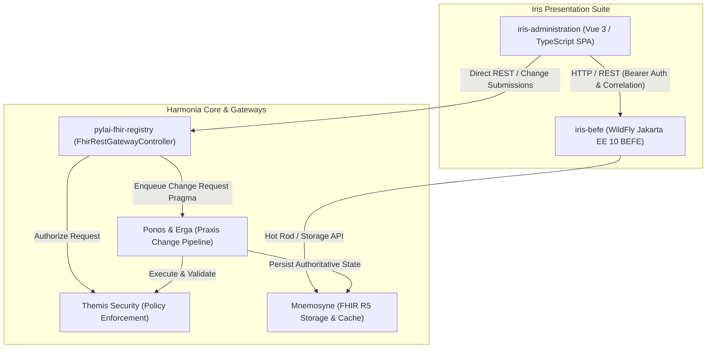

# Requirements

### Overview & Goals
The goal is to create `iris-administration`, a dedicated, standalone Harmonia user-interface module within the `iris` presentation suite. It provides:
1. **Provider Self-Service**: Allowing healthcare providers to review their credentials, professional roles, affiliated organizations, locations, healthcare services, and endpoints, and submit governed change requests through standard asynchronous review workflows.
2. **Departmental Provider Registry Administration**: Providing administrative officers with comprehensive search, entity management, work queue processing, validation outcome reviews, approval/rejection actions, and data-quality oversight.
3. **Harmonia Administration UI Foundation**: Serving as the broader administrative console for Harmonia, designed to accommodate future administrative capabilities beyond the Provider Registry without architectural redesign.

### Scope
- **In Scope**:
  - Independent Maven module `iris/iris-administration` built as a Vue 3 + TypeScript Single Page Application (matching `iris-clinical` and `iris-console`).
  - Integration with `iris-befe` and Pylai FHIR REST endpoints (`/api/fhir` and `/fhir`).
  - Strict client/consumer boundary: `iris-administration` delegates all authoritative validation, state transitions, business rules, and persistence to the Provider Registry, Themis, Ponos, and Mnemosyne.
  - Role-driven workspace adaptation based on Themis security context (`provider.read`, `provider.search`, `provider.resource.*`, `provider.admin`).
  - Presentation of FHIR R5 resources (`Practitioner`, `PractitionerRole`, `Organization`, `Location`, `HealthcareService`, `Endpoint`, `Group`, `Task`, `OperationOutcome`).
  - Change request lifecycle tracking (`ACCEPTED` -> `IN_PROGRESS` / `VALIDATING` -> `COMPLETED` / `REJECTED` / `FAILED`).
  - Human-friendly presentation models and OperationOutcome diagnostic rendering.
  - Strict PHI logging compliance (zero PHI or secrets in browser logs) and correlation ID propagation (`X-Correlation-Id`, `X-Source-System`, `X-Requester`).
- **Out of Scope**:
  - Modifying or implementing Provider Registry business rules, persistence logic, or state machines inside the frontend.
  - Direct database access or bypass of Themis security authorization policies.
  - Modifying clinical workflows in `iris-clinical` or technical monitoring in `iris-console`.

### User Stories
- **As a Healthcare Provider**, I want to view my practitioner profile, active roles, affiliated organizations, and endpoints, and submit change requests so that my registry data remains accurate without bypassing institutional governance.
- **As a Healthcare Provider**, I want to track the status and review outcomes/reasons for my submitted change requests so that I understand if additional information is required or when changes are committed.
- **As a Departmental Administrative Officer**, I want to search providers, inspect relationship graphs, manage organizations/locations/services/groups, and process pending change requests in a unified work queue to ensure master data quality and compliance.
- **As an Administrator**, I want navigation that cleanly organizes provider administration today and accommodates future administrative domains seamlessly.

### Functional Requirements
- **FR-1: Role-Driven Navigation & Workspace**:
  - Detect authenticated user authorities from Themis security context.
  - Render Self-Service workspace for users with `provider.read` / provider identity.
  - Render Departmental Administration workspace for users with `provider.search` / `provider.admin`.
  - Provide combined navigation for multi-role users.
- **FR-2: Provider Self-Service Read Experience**:
  - "My Provider Details": Practitioner demographics, identifiers, active status, qualifications.
  - "My Roles": Associated PractitionerRole entries, specialty codes, available healthcare services.
  - "My Organisations": Associated Organization records, contacts, hierarchies.
  - "My Locations & Services": Physical locations and service delivery sites.
  - "My Endpoints": Electronic communication endpoints and digital channels.
- **FR-3: Governed Change Request Submission**:
  - Request changes against authorized resources with client-side format assistance.
  - Submit asynchronous requests (`POST`/`PUT`) returning HTTP 202 Accepted and a tracking `Task` resource.
- **FR-4: Request Status & History Tracking**:
  - View "My Requests" showing submission timestamp, target resource, current lifecycle stage, and completion status.
  - Display validation feedback and rejection explanations.
- **FR-5: Departmental Provider Search & Management**:
  - Multi-parameter search across `Practitioner`, `Organization`, `Location`, `HealthcareService`, `Endpoint`, and `Group`.
  - Detailed resource inspector with friendly presentation and optional raw FHIR view for technical officers.
- **FR-6: Administrative Work Queue**:
  - Display queue of change requests by status (`received`, `validating`, `awaiting review`, `approved`, `rejected`, `committing`, `completed`, `failed`).
  - Present diff view between requested payload and existing registry state.
  - Authorize approval/rejection where supported by underlying APIs.
- **FR-7: Validation & OperationOutcome Presentation**:
  - Parse FHIR `OperationOutcome` and map `PR-VAL-*` error codes (`PR-VAL-001` through `PR-VAL-010`) into actionable UI banners and field-level annotations.

### Non-Functional Requirements
- **Security & Authorization**: UI visibility is not a security boundary; all mutations and queries are enforced server-side by Themis policies (`ProviderRegistryReadPolicy`, `ProviderRegistryPersistPolicy`, `ProviderRegistryProcessPolicy`).
- **Privacy & PHI Logging**: Browser console logging must strictly exclude PHI, tokens, passwords, and sensitive payload data.
- **Correlation Propagation**: Propagate `X-Correlation-Id`, `X-Source-System`, and `X-Requester` headers across all HTTP client requests.
- **Deployment & Modularity**: Standalone Vite/Vue 3 build packaged via Maven `frontend-maven-plugin` and Docker/Nginx image, independently deployable.

# Technical Design

### Current Implementation
- **Presentation Architecture**: Harmonia's `iris` module currently contains:
  - `iris-befe`: WildFly Jakarta EE 10 backend-for-frontend exposing RESTful FHIR endpoints (`/api/fhir/*`) with Infinispan Hot Rod caching.
  - `iris-clinical`: Vue 3 + TypeScript SPA for clinical resource exploration.
  - `iris-console`: Vue 3 + TypeScript SPA for technical operations monitoring.
- **Provider Registry Public Boundary**: Exposed via `pylai-fhir-registry` (`FhirRestGatewayController`) and `iris-befe`, backed by HAPI FHIR R5 models, `Pragma` change pipelines, and Mnemosyne storage.
- **Themis Security Policies**: `ProviderRegistryReadPolicy` (`provider.read`, `provider.search`, `provider.admin`), `ProviderRegistryPersistPolicy` (`provider.resource.create`, `provider.resource.update`, `provider.resource.delete`), and `ProviderRegistryProcessPolicy` (`provider.change.process`).

### Key Decisions
1. **Independent Vue 3 SPA Module**: `iris-administration` is established as an independent module under `iris/` with its own `pom.xml`, `package.json`, Vite configuration, and Dockerfile, avoiding coupling to `iris-clinical` or `iris-console`.
2. **Pure Client/Consumer Boundary**: `iris-administration` interacts exclusively via standard REST/FHIR APIs. It contains zero persistence logic, zero authoritative validation logic, and zero workflow state machines.
3. **Four-Tier Extensible Navigation Structure**:
   - `Self Service` (My Details, My Roles, My Organizations, My Locations/Services, My Endpoints, My Requests, Request a Change)
   - `Provider Administration` (Dashboard, Work Queue, Provider Search, Practitioners, Roles, Organizations, Locations, Services, Endpoints, Groups, Data Quality)
   - `Administrative Services` (Placeholder section for future Harmonia administrative capabilities)
   - `Administration` (Reference data and system preferences)
4. **Asynchronous Change Request Model**: Provider self-service actions submit change requests yielding HTTP 202 Accepted and a `Task` resource, querying status via `/Task/{id}` or `Pragma` cache.
5. **Presentation vs Domain Model Separation**: UI view models (`ProviderSummaryView`, `ProviderRoleView`, `ChangeRequestSummaryView`, `AdministrationQueueItemView`) transform FHIR R5 resources for display without duplicating domain entities.
6. **Zero-PHI Browser Logging**: Safe logging utility wrapping console calls to ensure no PHI, JWTs, or clinical payloads reach the browser developer console.

### Architecture Diagram



### Module File Structure
```
iris/
├── iris-befe/
├── iris-clinical/
├── iris-console/
├── iris-administration/
│   ├── Dockerfile
│   ├── nginx.conf
│   ├── package.json
│   ├── pom.xml
│   ├── tsconfig.json
│   ├── tsconfig.node.json
│   ├── vite.config.ts
│   ├── index.html
│   └── src/
│       ├── App.vue
│       ├── main.ts
│       ├── style.css
│       ├── vite-env.d.ts
│       ├── api/
│       │   ├── client.ts
│       │   ├── providerRegistryClient.ts
│       │   ├── providerChangeRequestClient.ts
│       │   └── providerSearchClient.ts
│       ├── components/
│       │   ├── Navbar.vue
│       │   ├── Sidebar.vue
│       │   ├── Topbar.vue
│       │   ├── SecurityBadge.vue
│       │   ├── StatusBadge.vue
│       │   ├── ValidationAlert.vue
│       │   ├���─ ChangeRequestModal.vue
│       │   └── RecordHistoryModal.vue
│       ├── models/
│       │   ├── fhir.ts
│       │   ├── provider.ts
│       │   ├── themis.ts
│       │   └── operationOutcome.ts
│       ├── router/
│       │   └── index.ts
│       ├── stores/
│       │   ├── securityStore.ts
│       │   ├── selfServiceStore.ts
│       │   └── providerAdminStore.ts
│       ├── utils/
│       │   ├── safeLogger.ts
│       │   └── fhirMapper.ts
│       └── views/
│           ├── self-service/
│           │   ├── MyDetailsView.vue
│           │   ├── MyRolesView.vue
│           │   ├── MyOrganizationsView.vue
│           │   ├── MyLocationsServicesView.vue
│           │   ├── MyEndpointsView.vue
│           │   ├── MyRequestsView.vue
│           │   └── RequestChangeView.vue
│           └── admin/
│               ├── AdminDashboardView.vue
│               ├── WorkQueueView.vue
│               ├── ProviderSearchView.vue
│               ├── PractitionerAdminView.vue
│               ├── PractitionerRoleAdminView.vue
│               ├── OrganizationAdminView.vue
│               ├── LocationAdminView.vue
│               ├── HealthcareServiceAdminView.vue
│               ├── EndpointAdminView.vue
│               ├── GroupAdminView.vue
│               └── DataQualityView.vue
└── pom.xml
```

### Data Models & Contracts
```typescript
// View models for presentation mapping
export interface ProviderSummaryView {
  id: string;
  name: string;
  identifier: string;
  gender: string;
  active: boolean;
  qualifications: string[];
  rolesCount: number;
  lastUpdated?: string;
}

export interface ProviderRoleView {
  id: string;
  practitionerId: string;
  organizationId: string;
  organizationName: string;
  code: string;
  specialty: string[];
  active: boolean;
  telecom: { system: string; value: string; use?: string }[];
}

export interface ChangeRequestSummaryView {
  taskId: string;
  pragmaId?: string;
  correlationId: string;
  resourceType: string;
  resourceId?: string;
  operation: 'CREATE' | 'UPDATE';
  status: 'ACCEPTED' | 'IN_PROGRESS' | 'COMPLETED' | 'REJECTED' | 'FAILED';
  submittedAt: string;
  requester: string;
  diagnostics?: string;
  outcomeIssues?: ValidationIssue[];
}

export interface ValidationIssue {
  severity: 'fatal' | 'error' | 'warning' | 'information';
  code: string;
  details: string;
  expression?: string[];
}
```

### Risks & Mitigations
- **Risk 1: Accidental UI security bypass**: Mitigated by strictly relying on backend Themis policies (`ProviderRegistryReadPolicy`, `ProviderRegistryPersistPolicy`); unauthorized API requests fail with 403 Forbidden regardless of UI manipulation.
- **Risk 2: PHI leakage into browser console**: Mitigated by providing a centralized `safeLogger` that filters payloads and strips identifier/sensitive attributes.
- **Risk 3: Frontend state diverging from asynchronous pipeline**: Mitigated by polling the standard `/Task/{id}` endpoint with exponential backoff and rendering the authoritative pipeline status.

# Testing & Quality Assurance

### Validation Approach
Verification of `iris-administration` ensures independent build capability, correct integration with `iris-befe` and Provider Registry contracts, strict server-side authorization enforcement, and UI responsiveness.

### Key Scenarios & Test Matrix
1. **Module & Build Isolation**:
   - `iris-administration` compiles, type-checks (`vue-tsc`), and builds (`vite build`) via Maven `frontend-maven-plugin`.
   - `iris/pom.xml` builds all child modules (`iris-befe`, `iris-clinical`, `iris-console`, `iris-administration`) cleanly.
2. **Security & Role Gating**:
   - Unauthenticated users are redirected to login/authentication challenge.
   - Users with Provider role receive Self-Service navigation and cannot access departmental admin routes.
   - Users with Departmental Officer role (`provider.admin` / `provider.search`) access Work Queue and Provider Search.
   - Multi-role users receive aggregated navigation seamlessly.
   - Server-side simulated 403 Forbidden responses render clean Access Denied feedback.
3. **Provider Self-Service Flow**:
   - Fetching and rendering authorized Practitioner details and associated PractitionerRoles.
   - Submitting a change request (HTTP 202 Accepted with tracking `Task` location header).
   - Tracking change request progression (`ACCEPTED` -> `IN_PROGRESS` -> `COMPLETED`).
   - OperationOutcome error presentation when validation fails (e.g., duplicate identifier `PR-VAL-003`).
4. **Departmental Administration Flow**:
   - Multi-criteria provider search returning FHIR `Bundle` and mapping to `ProviderSummaryView`.
   - Administrative work queue list filtering by status.
   - Viewing change request diffs and inspecting validation reports.
5. **Privacy & Logging Checks**:
   - Verifying browser developer console logs contain zero PHI, access tokens, or raw resource payloads.
   - Verifying `X-Correlation-Id` is propagated on all outgoing REST calls.

### Architecture & Dependency Enforcement
- Verify no downstream dependency cycles: `pylai`, `themis`, `energeia`, and `iris-befe` MUST NOT depend on `iris-administration`.
- Existing unit and integration tests across `iris-befe`, `pylai-fhir-registry`, `themis-core`, and `paradeigma` continue to pass without regression.

# Delivery Steps

### ✓ Step 1: Scaffold iris-administration Module and Build Pipeline
Scaffold the `iris-administration` module inside the `iris` parent POM and configure the frontend build pipeline with Vite, Vue 3, TypeScript, and Pinia.

- Add `<module>iris-administration</module>` to `/iris/pom.xml`.
- Create `/iris/iris-administration/pom.xml` configured with `frontend-maven-plugin` (matching `iris-clinical` node and npm execution phases).
- Create `/iris/iris-administration/package.json` with Vue 3 (`^3.4.21`), Vue Router (`^4.3.0`), Pinia (`^2.1.7`), Axios (`^1.6.8`), and `lucide-vue-next` (`^0.363.0`).
- Create `/iris/iris-administration/vite.config.ts`, `tsconfig.json`, `tsconfig.node.json`, `index.html`, `Dockerfile`, and `nginx.conf`.
- Configure base CSS in `src/style.css` and main entry point `src/main.ts` with Pinia and Vue Router.

### ✓ Step 2: Implement Themis Security Context and Role-Driven Shell
Set up the application shell, Themis authentication and security context store, and the role-driven extensible navigation layout.

- Create `src/models/themis.ts` defining `ThemisPrincipal`, `ThemisAuthority`, and user security context representation.
- Create `src/stores/securityStore.ts` to manage user identity, active authorities (`provider.read`, `provider.search`, `provider.resource.create`, `provider.resource.update`, `provider.change.process`, `provider.admin`), and role detection.
- Implement `src/components/Topbar.vue` and `src/components/Sidebar.vue` providing an extensible 4-tier navigation model (Self Service, Provider Administration, Administrative Services, Administration) that dynamically adapts based on security authorities.
- Create `src/App.vue` housing the responsive application shell with collapsible sidebar, top navigation, and security status badge.
- Configure `src/router/index.ts` with role-aware route navigation guards and access denied handling.

### ✓ Step 3: Implement Provider Registry API Clients and OperationOutcome Handling
Build the API client layer for FHIR Provider Registry interactions, correlation propagation, and OperationOutcome error handling.

- Create `src/models/fhir.ts` and `src/models/provider.ts` defining FHIR R5 types (`Practitioner`, `PractitionerRole`, `Organization`, `Location`, `HealthcareService`, `Endpoint`, `Group`, `Task`, `OperationOutcome`) and presentation view models (`ProviderSummaryView`, `ProviderRoleView`, `ChangeRequestSummaryView`, `AdministrationQueueItemView`).
- Create `src/api/providerRegistryClient.ts` for synchronous FHIR resource read and multi-parameter search operations against `/api/fhir` or Pylai gateway.
- Create `src/api/providerChangeRequestClient.ts` for asynchronous change request submissions (`POST`/`PUT` returning HTTP 202 Accepted and tracking `Task` lifecycle).
- Implement `src/components/ValidationAlert.vue` and `src/models/operationOutcome.ts` to parse and render FHIR `OperationOutcome` diagnostics and `PR-VAL-*` validation error codes (`PR-VAL-001` through `PR-VAL-010`).
- Ensure all API client requests propagate `X-Correlation-Id`, `X-Source-System`, and `X-Requester` headers while strictly forbidding PHI/token emissions in console logging.

### ✓ Step 4: Implement Provider Self-Service Workspace
Implement the Provider self-service workspace allowing authenticated providers to review their credentials and submit change requests.

- Create `src/stores/selfServiceStore.ts` managing provider profile data, associated roles, organizations, locations, services, endpoints, and change request submissions.
- Implement `src/views/MyDetailsView.vue` for viewing demographic and credential details of the authenticated practitioner.
- Implement `src/views/MyRolesView.vue`, `src/views/MyOrganizationsView.vue`, `src/views/MyLocationsServicesView.vue`, and `src/views/MyEndpointsView.vue` for viewing associated registry resources.
- Implement `src/views/RequestChangeView.vue` with friendly form inputs, client-side format hints, and change-request submission dispatching to `providerChangeRequestClient`.
- Implement `src/views/MyRequestsView.vue` displaying submitted change request lifecycle stages (`ACCEPTED` -> `IN_PROGRESS` -> `COMPLETED` / `REJECTED` / `FAILED`) and feedback.

### ✓ Step 5: Implement Departmental Administration Workbench and Tests
Implement the departmental administration workbench for administrative officers to search the registry, manage entities, and process the work queue.

- Create `src/stores/providerAdminStore.ts` managing administrative queries, work queue state, and entity management.
- Implement `src/views/AdminDashboardView.vue` displaying administrative metrics, queue volume, and registry status summary.
- Implement `src/views/WorkQueueView.vue` presenting change requests across lifecycle stages with validation review, diff presentation, and approval/rejection actions.
- Implement `src/views/ProviderSearchView.vue` providing multi-criteria search across practitioners, organizations, and roles.
- Implement management views: `PractitionerAdminView.vue`, `PractitionerRoleAdminView.vue`, `OrganizationAdminView.vue`, `LocationAdminView.vue`, `HealthcareServiceAdminView.vue`, `EndpointAdminView.vue`, and `GroupAdminView.vue`.
- Implement `src/views/DataQualityView.vue` for inspecting referential integrity, duplicate warnings, and historical version records.
- Add frontend unit tests, integration tests, and Maven build / architecture isolation validation.