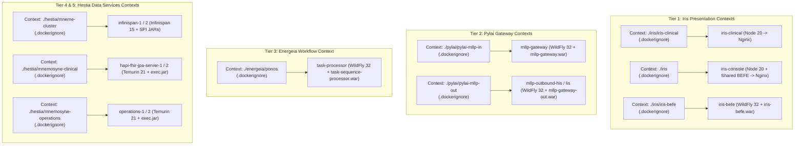

# Requirements

### Overview & Goals
The goal of Step 2 is to achieve 100% reproducible, isolated, and fast Docker builds across the 13 built container services defined in `docker-compose.yml`, building upon the Maven artifacts produced in Step 1.

### Scope
- **In Scope**:
  - Validating and building all 13 service images defined in `docker-compose.yml` (`infinispan-1`, `infinispan-2`, `befe`, `iris-console`, `iris-clinical`, `hapi-fhir-jpa-server-1`, `hapi-fhir-jpa-server-2`, `operations-1`, `operations-2`, `task-processor`, `mllp-gateway`, `mllp-outbound-his`, `mllp-outbound-lis`) using existing Step 1 Maven artifacts.
  - Applying minimal, targeted `.dockerignore` files strictly at active Docker build-context roots (`iris/`, `iris/iris-clinical/`, `iris/iris-befe/`, `hestia/mnemosyne-clinical/`, `hestia/mnemosyne-operations/`, `hestia/mneme-cluster/`, `energeia/ponos/`, `pylai/pylai-mllp-in/`, `pylai/pylai-mllp-out/`) to prevent host `node_modules`, `dist`, `.git`, coverage, and temporary files from entering build contexts.
  - Ensuring reproducible multi-stage builds for the Compose frontend applications (`iris-clinical`, `iris-console`).
  - Performing targeted individual builds during diagnostic phases, followed by an end-to-end clean verification build (`docker compose build --no-cache`).
  - Generating a detailed problem resolution and image build status report.

- **Out of Scope**:
  - Building or modifying `iris-administration` (as it is not part of the active `docker-compose.yml` service topology).
  - Creating a repository-root `/srv/harmonia/.dockerignore` (since the repository root `/srv/harmonia` is not used as an active Docker build context in `docker-compose.yml`).
  - Rebuilding or modifying Maven source code or re-running full Maven compilation (Step 1 artifacts are preserved).
  - Altering application runtime behavior, configuration semantics, or database schemas.
  - Modifying architectural boundaries or violating `AGENTS.md` invariants (e.g., Paradeigma isolation, Themis default-deny, Iris presentation decoupling).
  - Starting long-running containers or modifying runtime service orchestration.

### User Stories
- **As a DevOps Engineer / Integrator**, I want all Docker images in `docker-compose.yml` to build cleanly and deterministically from pre-built artifacts without failing due to missing files or corrupted host contexts.
- **As a Developer**, I want active build contexts to exclude unnecessary directories (like host `node_modules`, `dist`, or `.git`) with minimal, scoped ignore rules so that Docker image builds are fast, reproducible, and isolated.

### Functional Requirements
1. **Targeted Build Context Hygiene**:
   - Every active Docker build context root defined in `docker-compose.yml` must be guarded by appropriate `.dockerignore` rules.
   - Host `node_modules`, `dist`, `.git`, coverage, and temporary build artifacts must be excluded from active build contexts.
   - No unnecessary ignore files are introduced outside active build context roots.
2. **Deterministic Multi-Stage Packaging**:
   - Compose frontend SPAs (`iris-clinical`, `iris-console`) must run `npm install` and `npm run build` strictly inside isolated container build stages.
   - Java microservices must locate their target artifacts via deterministic relative paths in their respective Dockerfiles.
3. **Full Stack Reproducibility**:
   - Running `docker compose build --no-cache` must succeed across all 13 built services without errors or warnings regarding missing context or corrupt layers.
4. **Structured Status Reporting**:
   - Each encountered issue, modified file, root cause, affected image, and final build status must be clearly documented in the execution report.

# Technical Design

### Current Implementation
The Harmonia platform defines 18 container services in `docker-compose.yml`, of which 5 use pre-built official upstream images (`postgres:16-alpine`, `apache/activemq-artemis:2.33.0`) and 13 are built from local Dockerfiles across 9 distinct build contexts:
1. `hapi-fhir-jpa-server-1` & `hapi-fhir-jpa-server-2` (context `./hestia/mnemosyne-clinical`, `Dockerfile`) -> Spring Boot FHIR JPA server (`target/mnemosyne-clinical-*-exec.jar` on Eclipse Temurin 21).
2. `operations-1` & `operations-2` (context `./hestia/mnemosyne-operations`, `Dockerfile`) -> Spring Boot Operations server (`target/mnemosyne-operations-*-exec.jar` on Eclipse Temurin 21).
3. `infinispan-1` & `infinispan-2` (context `./hestia/mneme-cluster`, `Dockerfile`) -> Infinispan 15 cluster (`target/lib/*.jar` on `quay.io/infinispan/server:15.0.3.Final`).
4. `befe` (context `./iris/iris-befe`, `Dockerfile`) -> Jakarta EE 10 BEFE gateway (`target/iris-befe.war` on `quay.io/wildfly/wildfly:32.0.1.Final-jdk21`).
5. `iris-clinical` (context `./iris/iris-clinical`, `Dockerfile`) -> Multi-stage Node 20 build + Nginx Alpine.
6. `iris-console` (context `./iris`, `iris-console/Dockerfile`) -> Multi-stage Node 20 build with shared `@harmonia/iris-befe-frontend` + Nginx Alpine.
7. `mllp-gateway` (context `./pylai/pylai-mllp-in`, `Dockerfile`) -> WildFly 32 WAR container (`target/mllp-gateway.war`).
8. `mllp-outbound-his` & `mllp-outbound-lis` (context `./pylai/pylai-mllp-out`, `Dockerfile`) -> WildFly 32 WAR container (`target/mllp-gateway-out.war`).
9. `task-processor` (context `./energeia/ponos`, `Dockerfile`) -> WildFly 32 WAR container (`target/task-sequence-processor.war`).

### Key Decisions
1. **Strictly Scoped Build Context .dockerignore Placement**:
   - Do NOT create a repository-root `/srv/harmonia/.dockerignore` because the root directory is not used as a build context in `docker-compose.yml`.
   - Maintain and refine `.dockerignore` files strictly at active build context roots (`iris/`, `iris/iris-clinical/`, and Java/WildFly service context directories) to block host `node_modules`, `dist`, `.git`, and non-target artifacts from entering contexts.
2. **Exclude Non-Compose Modules (iris-administration)**:
   - Exclude `iris-administration` from Step 2 build and packaging activities, as it is not part of the active Compose service topology.
3. **Targeted Diagnostic Iteration**:
   - In accordance with the prompt guidelines, test and diagnose individual image builds first rather than continuously running full-stack builds, saving compute resources and identifying failures rapidly.
4. **No-Cache Full Stack Verification**:
   - Conclude Step 2 with `docker compose build --no-cache` to ensure clean-room reproducibility across all 13 Compose images.

### Architecture & Build Context Interaction Diagram

### Affected Files and Context Roots
- `/srv/harmonia/iris/.dockerignore`: Audit and verify coverage for `iris-console` context (exclude `**/node_modules`, `**/dist`, `**/node`, `.git`, coverage).
- `/srv/harmonia/iris/iris-clinical/.dockerignore`: Audit and verify coverage for `iris-clinical` context (exclude `node_modules`, `dist`, `node`, `.git`, coverage).
- Context-specific `.dockerignore` files for Java services (`iris/iris-befe/`, `pylai/pylai-mllp-in/`, `pylai/pylai-mllp-out/`, `energeia/ponos/`, `hestia/mnemosyne-clinical/`, `hestia/mnemosyne-operations/`, `hestia/mneme-cluster/`) ensuring `.git`, `src/test/`, and unnecessary files are ignored.

### Risks & Mitigations
- **Risk**: Wildcard or glob mismatch in `.dockerignore` accidentally excluding necessary build files (e.g., `package.json`, `src/`, or `target/*.jar`).
  - *Mitigation*: Use precise exclusion patterns for `node_modules`, `dist`, `.git`, `coverage`, and temporary build outputs while keeping application source and target artifact paths intact.
- **Risk**: Artifact naming mismatches in Dockerfile `COPY` commands (e.g., version strings in `-exec.jar` or `.war`).
  - *Mitigation*: Validate wildcard matches (`*-exec.jar`, `*.war`) and verify that exactly one matching artifact exists in each subproject's `target/` directory.

# Testing

### Validation Approach
Verification follows a utilitarian, staged progression:
1. Validate build context sizing and `.dockerignore` efficacy at active context roots.
2. Execute targeted image builds for each service component individually to isolate any build failures quickly.
3. Execute a full clean build with `docker compose build --no-cache` to ensure complete reproducibility.

### Key Scenarios
1. **Frontend Context Isolation Scenario**:
   - Verify that building frontend images (`iris-clinical`, `iris-console`) does not copy host `node_modules` into the build context.
   - Verify that Vite/Vue-TSC compilation completes successfully inside the containerized build stage.
2. **WildFly / Java Service Packaging Scenario**:
   - Verify that all WAR deployments in WildFly 32 containers (`iris-befe`, `mllp-gateway`, `mllp-outbound-his`, `mllp-outbound-lis`, `task-processor`) copy cleanly to `/opt/jboss/wildfly/standalone/deployments/ROOT.war`.
   - Verify that all Spring Boot executable JARs (`mnemosyne-clinical`, `mnemosyne-operations`) copy cleanly to `/app/app.jar`.
3. **Infinispan Cluster SPI Packaging Scenario**:
   - Verify that `mneme-cluster` successfully copies `target/lib/*.jar` and configuration XML files into the Infinispan 15 container image.
4. **End-to-End Stack Build Scenario**:
   - Execute `docker compose build --no-cache` across all services in `docker-compose.yml` and assert a `0` exit code with all 13 local images successfully tagged.

### Architectural Invariant Checks
- Confirm that no production code or production Dockerfile imports or depends on Paradeigma simulation modules (Invariant 1).
- Confirm that Iris images remain decoupled from direct JPA/database drivers (Invariant 3).
- Confirm that Petasos API boundaries and Themis security policies are not bypassed.

# Delivery Steps

### ✓ Step 1: Establish minimal .dockerignore coverage at active build context roots
Targeted `.dockerignore` files are established strictly at the 9 active Docker build-context roots used in `docker-compose.yml`, preventing host `node_modules`, `dist`, `.git`, coverage, and non-essential build clutter from entering build contexts.

- Audit and refine existing `.dockerignore` in `./iris/` to guard the `iris-console` build context against host `node_modules`, `dist`, `.git`, and cache directories.
- Audit and refine existing `.dockerignore` in `./iris/iris-clinical/` to guard the `iris-clinical` build context against host `node_modules`, `dist`, and temporary files.
- Establish minimal `.dockerignore` files at Java and Infinispan build-context roots (`iris/iris-befe/`, `pylai/pylai-mllp-in/`, `pylai/pylai-mllp-out/`, `energeia/ponos/`, `hestia/mnemosyne-clinical/`, `hestia/mnemosyne-operations/`, `hestia/mneme-cluster/`) to exclude `.git` and non-essential directories without creating an unnecessary repository-root ignore file.

### ✓ Step 2: Perform targeted image builds and resolve packaging discrepancies
All 13 container images in `docker-compose.yml` build cleanly and reproducibly from their respective build contexts using the Step 1 Maven artifacts.

- Execute targeted builds for frontend images (`iris-clinical`, `iris-console`) using Node 20 and Nginx multi-stage builds.
- Execute targeted builds for WildFly 32 EE 10 services (`iris-befe`, `mllp-gateway`, `mllp-outbound-his`, `mllp-outbound-lis`, `task-processor`) verifying the presence and deployment of their respective WAR artifacts in `/opt/jboss/wildfly/standalone/deployments/ROOT.war`.
- Execute targeted builds for Spring Boot executable JAR services (`hapi-fhir-jpa-server-1`, `hapi-fhir-jpa-server-2`, `operations-1`, `operations-2`) verifying `-exec.jar` resolution on Eclipse Temurin 21 JRE.
- Execute targeted builds for Infinispan 15 cluster nodes (`infinispan-1`, `infinispan-2`) verifying custom SPI library JARs and XML configuration deployment.
- Diagnose and resolve any packaging, pathing, or dependency resolution discrepancies encountered during individual image builds.

### ✓ Step 3: Execute full docker compose build verification and compile report
The complete multi-service image set in `docker-compose.yml` builds successfully and reproducibly in a clean end-to-end execution, and a detailed diagnostic report is compiled.

- Execute a full `docker compose build --no-cache` across all 13 built services in `docker-compose.yml` to verify end-to-end build reproducibility without relying on cached layers.
- Verify that no application runtime behavior, data contracts, or architectural boundaries defined in `AGENTS.md` and `docs/architectural-axioms.md` were modified.
- Compile a comprehensive build report documenting all issues identified, files modified, reasons for changes, affected Docker images, and final image build statuses.