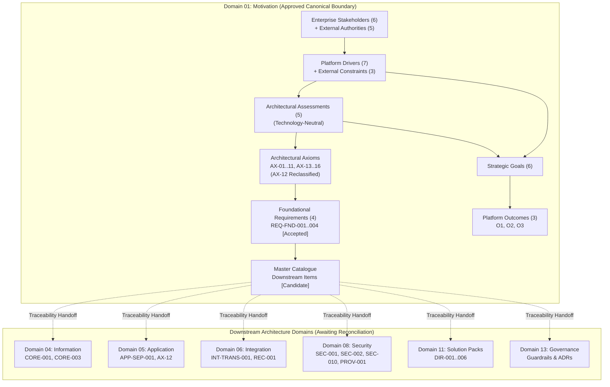

# Requirements

### Overview & Goals

Domain 01 (Motivation) canonical documentation under `docs/markdown/01-motivation/` represents the conceptual foundation of the Harmonia Health Integration Environment (HIE). Following review against the frozen Motivation model, the structure, file decomposition, orientation view, axiom structure, and foundational requirements are approved.

This cleanup addresses specific wording, classification, and scoping issues to ensure:
1. **Implementation Neutrality**: Assessments diagnose architectural problems without prescribing protocol details, wire codes, or specific database/caching mechanisms.
2. **Security Problem / Solution Demarcation**: The security assessment diagnoses the hazard of implicit perimeter trust without baking solution patterns (`zero-trust`, `default-deny`) into the assessment itself.
3. **Calibrated Rhetorical Tone**: Overstated claims ("catastrophic systemic failures", "fatal errors", "zero-tolerance", "absolute certainty", "skyrocketing", "exponential contention") are replaced with precise architectural terms.
4. **Tightened External Authorities**: External entities are framed as sources of legal, regulatory, identifier, or interoperability obligations without asserting detailed compliance controls or implementation mandates.
5. **Accurate Downstream Traceability Status**: Downstream requirements in the master catalogue are marked `Candidate` rather than `Accepted` until their owning architecture domains undergo formal canonical reconciliation.
6. **Preserved Governance Boundaries**: Zero-PHI operational logging remains classified as a downstream Security Architecture requirement (`SEC-010`, Domain 08) and governance guardrail (Domain 13), not as a Domain 01 principle.

### Scope

#### In Scope
- Canonical documentation files under `docs/markdown/01-motivation/` (13 files).
- Technology-neutral rephrasing of False Acceptance and Concurrent Processing in `drivers-assessments/assessments.md`.
- Decoupling Implicit Perimeter Trust assessment from specific solution mechanisms in `drivers-assessments/assessments.md`.
- Rhetorical calibration across `stakeholders/`, `drivers-assessments/`, `goals-outcomes/`, `principles/`, and `requirements-constraints/`.
- Constraint and authority statement tightening in `stakeholders/external-authorities.md` and `requirements-constraints/external-constraints.md`.
- Correcting downstream requirement statuses in `requirements-constraints/master-requirements-catalogue.md` to `Candidate`.
- Validating relative markdown links and creating the canonical completion report in `.junie/reports/YYYY-MM-DD-domain-01-final-cleanup.md`.

#### Out of Scope
- Redesigning, expanding, or modifying the approved Motivation architecture or relationships.
- Adding, removing, or renumbering Motivation elements (6 enterprise stakeholders, 5 external authorities, 7 drivers, 5 assessments, 6 goals, 3 outcomes, 15 axioms, 4 foundational requirements, 3 external constraints).
- Modifying LaTeX, ODT, publication scripts, Java source code, or tests.
- Reconciling or modifying downstream architecture domains (Domains 02 through 13).
- Creating Domain 13 guardrails or ADRs during this task.

### Approved Motivation Elements to Preserve

The following canonical elements are frozen and will be strictly preserved:
- **Enterprise Stakeholders (6)**: Regional Health Network Operator, Healthcare Delivery Organizations, Clinicians & Care Teams, Patients & Care Recipients, Healthcare Directory Stewards & Registrars, Platform Operations & Integration Engineers.
- **External Authorities (5)**: ADHA, HI Service, AHPRA, OAIC, SDOs.
- **Drivers (7)**: Clinical Interoperability, Durable Information Independence, Continuous Clinical Availability, Patient Safety & Identity Integrity, Statutory Health Privacy, Directory / Endpoint Governance, Coordinated Operational Activity.
- **Assessments (5)**: Silent Data Loss via False Acceptance, Unmonitored Destination Failure, PHI Leakage through Operational Logging, Implicit Perimeter Trust, Centralised Synchronous Persistence Can Constrain Concurrent Processing.
- **Strategic Goals (6)**: Durable Acceptance & Preservation, Timely Availability, Responsive Access, Reliable Subject Identity, Vendor-Independent Longitudinal Coherence, Coordinated Progression of Operational Activities.
- **Outcomes (3)**: Reduced Clinical Risk (O1), Continuous & Resilient Regional Exchange (O2), Demonstrable Protection & Accountable Handling (O3).
- **Architectural Axioms**: `AX-01` through `AX-11` and `AX-13` through `AX-16` (with `AX-12` reclassified to Domain 05).
- **Foundational Requirements (4)**: `REQ-FND-001`, `REQ-FND-002`, `REQ-FND-003`, `REQ-FND-004`.
- **External Constraint Categories (3)**: `CST-EXT-001`, `CST-EXT-002`, `CST-EXT-003`.
- **Motivation Orientation View**: The 7-thread visual and relational structure.

### Normative Foundations Retained

The four foundational requirement statements remain unchanged:
- **REQ-FND-001**: *Harmonia shall not positively acknowledge acceptance of an incoming event until responsibility for that event has crossed the required durable acceptance boundary.*
- **REQ-FND-002**: *Harmonia shall maintain sufficient explicit and observable state to determine the progression and outcome of managed multi-stage operational activities.*
- **REQ-FND-003**: *Harmonia shall preserve and validate the integrity of subject references and associations used within managed information, preventing known-invalid or internally inconsistent associations from being silently treated as valid.*
- **REQ-FND-004**: *Where Harmonia cannot establish the outcome of a managed operation with sufficient certainty, the outcome shall be represented explicitly as indeterminate and shall not be interpreted as either success or failure without subsequent reconciliation or another authoritative determination.*

Axiom **AX-07** remains unchanged:
- *Every governed operation executes within an established security context and is subject to platform-enforced security policy. Security is intrinsic to Harmonia-managed operations rather than dependent upon voluntary caller behaviour.*


# Technical Design

### Current Implementation State

The Domain 01 canonical documentation resides in `docs/markdown/01-motivation/` across 13 Markdown files in 6 directories:
```text
docs/markdown/01-motivation/
├── README.md
├── orientation-view.md
├── drivers-assessments/
│   ├── assessments.md
│   └── drivers.md
├── goals-outcomes/
│   ├── business-outcomes.md
│   └── strategic-goals.md
├── principles/
│   ├── architectural-axioms.md
│   └── reclassified-principles.md
├── requirements-constraints/
│   ├── external-constraints.md
│   ├── foundational-requirements.md
│   └── master-requirements-catalogue.md
└── stakeholders/
    ├── enterprise-stakeholders.md
    └── external-authorities.md
```

### Key Decisions

1. **Assessment Technology Neutrality**:
   - In `assessments.md`, False Acceptance focuses strictly on the risk of prematurely releasing sender responsibility before reaching an authoritative durable acceptance boundary. Concrete protocol behaviours (such as HL7 `MSA-1 = AA` / `AE` over MLLP) will be placed in a clearly demarcated non-normative downstream example section.
   - For Concurrent Processing, the assessment statement will be updated to:
     > Requiring central synchronous persistence interaction for every unit of active processing can introduce contention, latency, unnecessary I/O and coordination bottlenecks that limit concurrent throughput and scalability.
   - Rhetorical assertions regarding "exponential lock contention" and "skyrocketing I/O" will be removed.

2. **Security Problem vs Solution Separation**:
   - In `assessments.md`, the Implicit Perimeter Trust assessment diagnoses the systemic risk of trusting internal communications by default (enabling lateral movement, unauthorized access, and untraceable operations).
   - Specific solution paradigms (`zero-trust`, `default-deny`) will not be stated as the assessment itself, but as downstream enforcement strategies derived from governing axiom `AX-07`.

3. **External Authority Demarcation**:
   - In `external-authorities.md` and `external-constraints.md`, regulatory bodies (ADHA, HI Service, AHPRA, OAIC, SDOs) are framed as sources of legal, statutory, identifier, and interoperability constraints.
   - Unwarranted claims that authorities mandate specific internal implementation mechanisms (e.g., specific cryptographic primitives, logging configurations, access gates, or database algorithms) are removed.

4. **Catalogue Status Calibration**:
   - In `master-requirements-catalogue.md`, only Domain 01 foundational requirements (`REQ-FND-001..004`) and external constraints (`CST-EXT-001..003`) remain marked `Accepted`.
   - All downstream requirements (`CORE-001`, `CORE-003`, `SEC-001`, `SEC-002`, `SEC-010`, `PROV-001`, `INT-TRANS-001`, `APP-SEP-001`, `DIR-001..006`) are updated to `Candidate`, preserving their identifiers while acknowledging that their owning domains have not yet undergone canonical consolidation.

5. **Rhetorical Calibration**:
   - High-drama phrases identified across files will be replaced with rigorous architectural alternatives:
     - `catastrophic systemic failures` → `severe systemic failures`
     - `fatal vulnerability` / `catastrophic risk` → `critical vulnerability` / `severe risk`
     - `fatal medication errors` → `severe medication errors`
     - `zero-tolerance standards` → `mandatory statutory standards`
     - `absolute certainty` → `deterministic verification`
     - `fatal architectural failures` → `severe architectural failures`

### Architecture & Traceability Model



### Affected Files and Targeted Adjustments

| File Path | Targeted Modifications |
| :--- | :--- |
| `drivers-assessments/assessments.md` | Neutralise False Acceptance (downstream HL7 example); adopt neutral Concurrent Processing text; remove "exponential" / "skyrocket"; separate Implicit Perimeter Trust from solution. |
| `stakeholders/external-authorities.md` | Tighten HI Service and OAIC descriptions to obligation sources rather than technical implementation mandates; replace "zero-tolerance". |
| `requirements-constraints/external-constraints.md` | Express direct architectural impacts as platform obligations without claiming external bodies prescribe internal mechanisms. |
| `requirements-constraints/master-requirements-catalogue.md` | Reclassify downstream requirements (`CORE-001`, `CORE-003`, `SEC-001`, `SEC-002`, `SEC-010`, `PROV-001`, `INT-TRANS-001`, `APP-SEP-001`, `DIR-001..006`) from `Accepted` to `Candidate`. |
| `drivers-assessments/drivers.md` | Soften rhetorical wording in Patient Safety driver ("catastrophic clinical harm", "lethal medication doses"). |
| `goals-outcomes/strategic-goals.md` | Soften "catastrophic vulnerability" in Goal 1; soften "fatal diagnostic errors" in Goal 4. |
| `goals-outcomes/business-outcomes.md` | Soften "fatal adverse drug events" in Outcome 1. |
| `requirements-constraints/foundational-requirements.md` | Soften "fatal vulnerability" and "catastrophic window" in REQ-FND-001 rationale. |
| `stakeholders/enterprise-stakeholders.md` | Soften "catastrophic systemic failures" in Operator; "fatal medication errors" in Patients; "absolute certainty" in Engineers. |
| `principles/architectural-axioms.md` | Soften "fatal architectural failures" under AX-05 implications. |
| `orientation-view.md` | Synchronize thread walkthrough text with assessment neutrality and calibrated language while preserving the 7-thread model. |


# Validation & Reporting

### Validation Approach

Because this task modifies canonical architecture documentation and does not introduce code or test changes, validation focuses on structural integrity, semantic accuracy, and Markdown link consistency.

### Validation Checks

1. **File Inventory & Decomposition Check**:
   - Confirm that exactly 13 canonical files remain present under `docs/markdown/01-motivation/`.
   - Verify that no files have been created, deleted, or renamed within the canonical set.

2. **Link Resolution & Cross-Reference Check**:
   - Run an automated check across all relative Markdown links in `docs/markdown/01-motivation/` to confirm every target file and heading anchor exists.

3. **Motivation Model Fidelity Check**:
   - Verify preservation of the 6 enterprise stakeholders, 5 external authorities, 7 drivers, 5 assessments, 6 strategic goals, and 3 platform outcomes.
   - Confirm that the 7-thread Motivation Orientation View maintains its approved visual semantics and causal edges.
   - Confirm that axioms `AX-01` through `AX-11` and `AX-13` through `AX-16` remain intact, and `AX-12` remains formally reclassified to Domain 05.

4. **Assessment & Requirement Verification**:
   - Confirm that False Acceptance and Concurrent Processing assessments in `assessments.md` contain no prescriptive implementation technology.
   - Confirm that the four foundational requirements retain their exact approved normative wording:
     - `REQ-FND-001` (Durable Ingress Acceptance Boundary)
     - `REQ-FND-002` (Operational Activity Progression State)
     - `REQ-FND-003` (Subject Referential Integrity)
     - `REQ-FND-004` (Explicit Indeterminate Outcome)
   - Confirm that downstream requirements in `master-requirements-catalogue.md` are correctly marked `Candidate` and foundational items are marked `Accepted`.

### Completion Report Structure

Upon successful completion and validation, an execution report will be generated at:
```text
.junie/reports/YYYY-MM-DD-domain-01-final-cleanup.md
```

The report will follow the required schema:
- **Task**: Summary of requested Domain 01 motivation cleanup.
- **Files Changed**: List of modified documentation files.
- **Key Actions**: Bulleted summary of specific wording and classification updates.
- **Requirement Status Changes**: Table showing previous status, new status, and architectural justification:
  ```text
  Requirement | Previous Status | New Status | Reason
  ```
- **Validation**: Detailed results of structural, link, and model consistency checks.
- **Deviations from Approved Task**: Set to `None`.
- **Unresolved Issues**: Set to `None` (or documenting any human review item if discovered).


# Delivery Steps

### ✓ Step 1: Neutralise Motivation Assessments and Decouple Security Diagnostics
Motivation assessments in `assessments.md` are completely decoupled from implementation mechanisms and protocol details.

- Update False Acceptance assessment in `docs/markdown/01-motivation/drivers-assessments/assessments.md` to express the problem of acknowledging an event before crossing the durable boundary in a technology- and protocol-neutral manner.
- Relegate HL7 acknowledgement codes (`AA`, `AE`), MLLP/TCP behaviour, and volatile process queues to a clearly labelled downstream integration architecture example.
- Update Concurrent Processing assessment in `assessments.md` to adopt the approved text: "Requiring central synchronous persistence interaction for every unit of active processing can introduce contention, latency, unnecessary I/O and coordination bottlenecks that limit concurrent throughput and scalability."
- Eliminate claims of exponential lock contention and skyrocketing I/O from the Concurrent Processing operational hazard.
- Separate Implicit Perimeter Trust assessment from specific solution mechanisms by framing the diagnosis around the vulnerability of unverified internal trust, without mandating zero-trust or default-deny within the assessment itself, preserving `AX-07` as the governing axiom.

### ✓ Step 2: Tighten External Authorities, Constraints, and Downstream Catalogue Statuses
External authorities are defined strictly as constraint sources and downstream requirements in `master-requirements-catalogue.md` are marked as `Candidate`.

- Update `docs/markdown/01-motivation/stakeholders/external-authorities.md` to describe external bodies (ADHA, HI Service, AHPRA, OAIC, SDOs) as sources of applicable statutory, identifier, and interoperability obligations without prescribing specific cryptographic, persistence, access-gating, or logging mechanisms.
- Update `docs/markdown/01-motivation/requirements-constraints/external-constraints.md` to remove implementation assertions while preserving the three generalized external constraint categories (`CST-EXT-001`, `CST-EXT-002`, `CST-EXT-003`).
- Update `docs/markdown/01-motivation/requirements-constraints/master-requirements-catalogue.md` to change the status of all downstream requirements (`CORE-001`, `CORE-003`, `SEC-001`, `SEC-002`, `SEC-010`, `PROV-001`, `INT-TRANS-001`, `APP-SEP-001`, `DIR-001..006`) from `Accepted` to `Candidate`, reflecting that their owning domains have not yet completed canonical reconciliation.
- Preserve `Accepted` status for the four foundational requirements (`REQ-FND-001` through `REQ-FND-004`) and the three external constraint categories (`CST-EXT-001` through `CST-EXT-003`).

### ✓ Step 3: Purge Overstated Rhetorical Language Across Domain 01 Files
All unnecessarily dramatic or absolute rhetorical phrasing across Domain 01 markdown files is replaced with precise architectural and clinical safety language.

- Review and update `docs/markdown/01-motivation/drivers-assessments/drivers.md` to soften catastrophic and lethal terminology (e.g., in Patient Safety driver) into measured clinical hazard descriptions.
- Review and update `docs/markdown/01-motivation/goals-outcomes/strategic-goals.md` and `docs/markdown/01-motivation/goals-outcomes/business-outcomes.md` to replace phrases such as "catastrophic vulnerability" or "fatal adverse drug events" with precise risk language.
- Review and update `docs/markdown/01-motivation/requirements-constraints/foundational-requirements.md` to remove dramatic phrasing ("fatal vulnerability", "catastrophic window") while keeping normative statements intact.
- Review and update `docs/markdown/01-motivation/stakeholders/enterprise-stakeholders.md` to replace "catastrophic systemic failures", "fatal medication errors", and "absolute certainty" with precise engineering and clinical terms.
- Review and update `docs/markdown/01-motivation/principles/architectural-axioms.md` to replace "fatal architectural failures" (e.g., under AX-05) with "severe architectural failures".
- Update `docs/markdown/01-motivation/orientation-view.md` to maintain textual consistency with softened assessment summaries while preserving the exact 7-thread visual and relational structure.

### ✓ Step 4: Validate Structural and Link Integrity, and Generate Completion Report
All 13 canonical files are validated for structural and link integrity, and a comprehensive execution report is generated.

- Verify that all 13 canonical files exist in `docs/markdown/01-motivation/` with no additions, deletions, or renames.
- Execute automated link validation across all Markdown files in `docs/markdown/01-motivation/` to verify that every relative cross-reference and heading anchor resolves.
- Verify that the four foundational requirements (`REQ-FND-001`..`004`) retain their approved normative text, `AX-01`..`AX-11` and `AX-13`..`AX-16` are intact, and `AX-12` remains reclassified to Domain 05.
- Create the completion report at `.junie/reports/YYYY-MM-DD-domain-01-final-cleanup.md` containing task summary, modified files, key actions, requirement status change table, validation checks, deviations (`None`), and unresolved issues (`None`).