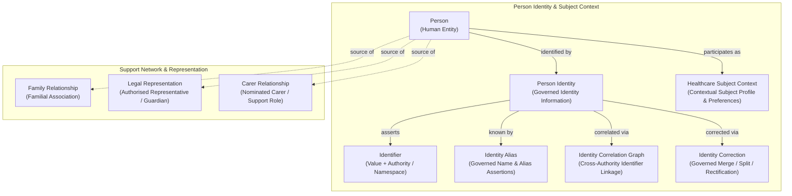
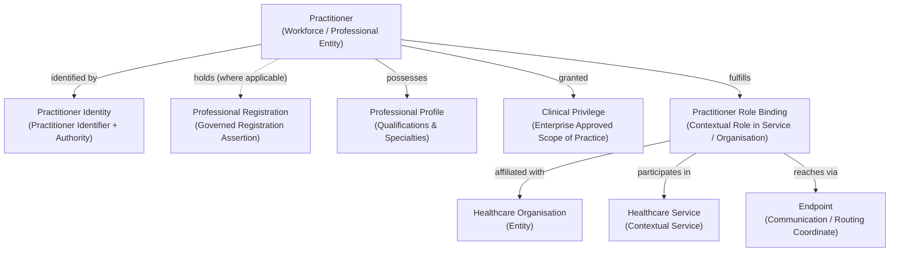
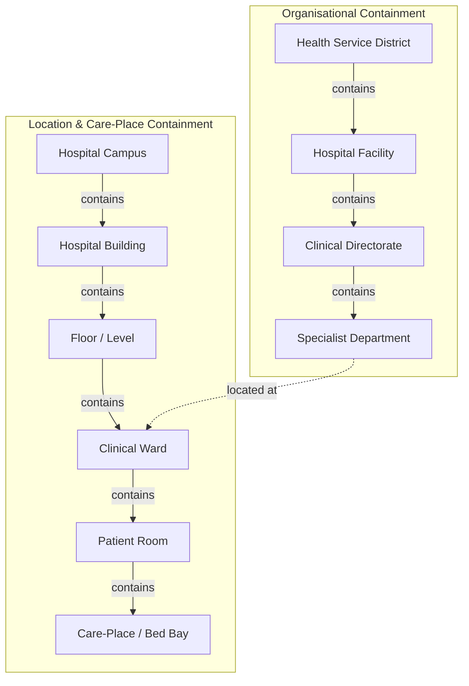
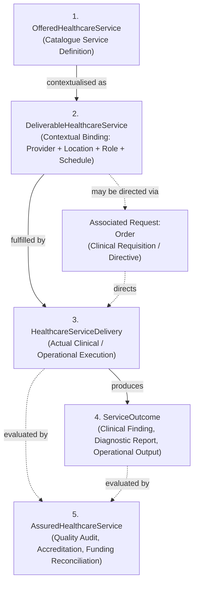
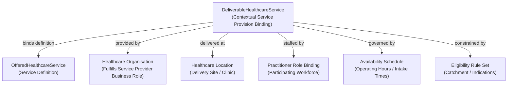
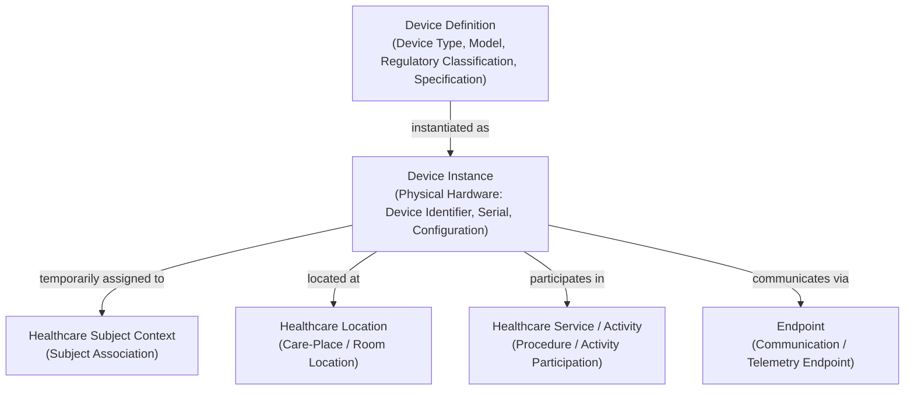

# Requirements

### Overview & Goals

This plan executes a final bounded **semantic hygiene pass** over the newly created **Domain 04 Entity, Identity, and Service Information Families** (`docs/markdown/04-information-architecture/information-families/`).

The objective is to refine normative concept definitions, purge non-canonical terminology, align strictly with frozen Domain 03 Business Architecture semantics, and update the formal completion report without redesigning or expanding the accepted information model.

---

### Upstream Authority & Immutability Context

- **Domain 01 (Motivation)**, **Domain 02 (Strategy)**, and **Domain 03 (Business Architecture)** are **CLOSED and FROZEN** authoritative baselines. They must remain untouched.
- The **Domain 04 Foundation** (metamodel, patterns, governance, assemblies/views, guardrails, and traceability framework) is **CLOSED and FROZEN**.
- The core information architecture model accepted in the previous step (including the resolution that `DeliverableHealthcareService` represents the contextual Service Provision binding) remains intact and is not being redesigned.

---

### Scope

#### In Scope
1. **Generic Semantic Terminology in Normative Definitions**:
   - Purge jurisdiction-specific identifiers, technical tags, and implementation artefacts (e.g., UDI, physical asset tags, firmware version, national facility identifier, HPI-I, HPI-O, AHPRA, TGA/FDA) from normative concept definitions and titles.
   - Retain such terms only as explicitly non-normative / illustrative examples where beneficial.
   - Use canonical generic semantic concepts: `Device Identifier`, `Organisation Identifier`, `External Directory Identifier`, `Regulatory Classification`, `Device Version / Configuration Assertion`, `Registration Authority`.
2. **Purge Invented Business Role "Healthcare Professional"**:
   - Remove any usage of "Healthcare Professional" as a Domain 03 Business Role (or implied role).
   - Use only canonical Domain 03 Business Roles (`Practitioner`, `Clinician`, `Performer`, `Prescriber`, `Requester`, `Care Coordinator`, `Service Provider`, etc.).
3. **Correct Domain 03 Order Administration Information Responsibility**:
   - Replace all occurrences of the non-canonical name `Clinical Order & Closed-Loop Matrix`.
   - Use the exact canonical Domain 03 Information Responsibilities: `Clinical Order Master Record`, `Closed-Loop Tracking Ledger`, `Order-Result Correlation Matrix`.
4. **Clarify Person Identity as Governed Identity Information**:
   - Remove language asserting that `Person Identity` is inherently a single "master", "golden", or "canonical" record.
   - Define `Person Identity` as the governed identity information concerning a `Person`.
   - Explicitly reinforce that identity correlation and governed identity correction preserve distinct source authorities and provenance without implying destructive consolidation into a single authoritative source identity.
5. **Refine Service Provision & Stewardship / Mandate Semantics**:
   - Replace "Service Provision Stewardship" and "Service Provision Mandate" with direct Service Provision semantics: `DeliverableHealthcareService` `provided-by` `Healthcare Organisation` (where the organisation fulfils the Domain 03 `Service Provider` Business Role).
   - Avoid "stewardship" unless an actual data/system stewardship semantic is intended; avoid introducing separate mandate concepts without Domain 03 traceability.
6. **Cross-Document Canonical Terminology Audit & Completion Report Update**:
   - Re-run an automated check across all seven files under `docs/markdown/04-information-architecture/information-families/` against Domain 03 baselines.
   - Update `.junie/reports/2026-10-06-domain04-entity-identity-service-information-families.md` detailing the hygiene corrections and explicitly reporting any remaining non-canonical terminology.

#### Out of Scope
- Redesigning the information model, semantic categories, or relationship patterns.
- Changing the accepted architectural decision that `DeliverableHealthcareService` represents the contextual Service Provision binding.
- Modifying any files under `docs/markdown/01-motivation/`, `docs/markdown/02-strategy/`, or `docs/markdown/03-business-architecture/`, or the frozen Domain 04 Foundation.
- Introducing downstream implementation models (FHIR, Java, JPA/SQL).

---

### Key Architectural Invariants & Demarcations

| Area | Hygiene Requirement | Canonical Target Semantic |
| :--- | :--- | :--- |
| **Device Family** | Remove UDI, asset tags, firmware version from normative definitions. | `Device Definition` (type, model, regulatory classification, technical specs) vs. `Device Instance` (physical hardware with `Device Identifier`, serial number, version/configuration assertion). Real-world schemes (UDI, asset tags) are non-normative examples. |
| **Organisation Family** | Remove `National Facility Identifier` from normative concepts. | `Organisation Identity` asserts generic `Organisation Identifier` and `External Directory Identifier`. Administrative hierarchy via forward containment `Organisation.contains(OrganisationalUnit)`. |
| **Person Identity** | Remove "master / golden record" terminology. | `Person Identity` represents governed identity information concerning a `Person`. Cross-authority correlation preserves distinct originating authorities without destructive consolidation. |
| **Business Roles** | Purge "Healthcare Professional" as a Business Role. | `Practitioner`, `Clinician`, `Service Provider`, etc. `Relationship Role` (e.g. *Parent*, *Attending*) $\neq$ `Business Role`. |
| **Order Responsibility** | Replace `Clinical Order & Closed-Loop Matrix`. | `Clinical Order Master Record`, `Closed-Loop Tracking Ledger`, `Order-Result Correlation Matrix` (from Domain 03 `L1: Order Administration`). |
| **Service Provision** | Eliminate unwarranted "Stewardship / Mandate" terms. | Direct provision: `DeliverableHealthcareService` `provided-by` `Healthcare Organisation` fulfilling `Service Provider` Business Role. |

# Technical Design

### Current State & Findings

A comprehensive review of `docs/markdown/04-information-architecture/information-families/` identified the following specific items to be corrected:

1. **`README.md`**:
   - Line 59 references `Healthcare Professional` as an example Business Role: update to canonical `Practitioner` / `Clinician`.
2. **`person-healthcare-subject.md`**:
   - Diagram and text contain references to `(Governed Master Identity)` and `master anchor`: replace with `(Governed Identity Information)` and `identity anchor`.
   - Reinforce that cross-authority correlation and identity correction preserve source authority and provenance without destructive single-record consolidation.
3. **`practitioner.md`**:
   - Verify that all references to statutory registration bodies (e.g. AHPRA, HPI-I) remain purely illustrative/non-normative examples and do not appear in normative definitions.
4. **`organisation.md`**:
   - Section 3.2 references `national health facility identifiers`: replace with generic `Organisation Identifier` and `External Directory Identifier`.
   - Replace any unnecessary "Stewardship" labels in administrative containment relationships with direct administrative allocation / governance lines.
5. **`healthcare-location.md`**:
   - Refine `Operational Stewardship` relationship name to `Operational Allocation / Area Management` to avoid overloading the governance term "Stewardship".
6. **`healthcare-service.md`**:
   - Table row in Section 2 references `Clinical Order & Closed-Loop Matrix`: replace with `Clinical Order Master Record, Closed-Loop Tracking Ledger, Order-Result Correlation Matrix`.
   - Table in Section 6.2 references `Service Provision Stewardship` and `Service Provision Mandate`: replace with `Service Provision` (`DeliverableHealthcareService provided-by Healthcare Organisation`) with organisation fulfilling the `Service Provider` Business Role.
7. **`device.md`**:
   - Normative text in Section 3.2 and Section 4 refers to `Unique Device Identifier (UDI)`, `asset tag`, and `firmware revision`: refine normative definitions to `Device Identifier`, `Asset Identification`, and `Device Version / Configuration Assertion`, keeping UDI and firmware as explicit illustrative examples.

---

### Detailed File Changes

```text
docs/markdown/04-information-architecture/information-families/
├── README.md                                # Fix example Business Role (remove Healthcare Professional)
├── person-healthcare-subject.md             # Replace master/golden identity language with governed identity info
├── practitioner.md                          # Confirm generic workforce & registration authority semantics
├── organisation.md                          # Use generic Organisation Identifier; refine administrative relationships
├── healthcare-location.md                   # Refine operational area allocation relationship terminology
├── healthcare-service.md                    # Fix Order Administration Information Responsibility & Service Provision terms
└── device.md                                # Use generic Device Identifier & Configuration Assertion terminology

.junie/reports/
└── 2026-10-06-domain04-entity-identity-service-information-families.md # Update report with hygiene audit findings
```

---

### Canonical Semantic Mermaid Diagrams

#### 1. Person, Identity & Healthcare Subject Context


#### 2. Practitioner & Professional Contextual Associations


#### 3. Organisation & Location Recursive Containment


#### 4. Healthcare Service 5-Stage Progression & Contextual Binding


#### 5. Service Provision Contextual Binding


#### 6. Device Definition vs. Instance & Temporal Relationships


---

### Domain 03 Responsibility Traceability Matrix

| Information Family | Owning Capability (Domain 03) | Domain 03 Function / Feature | Domain 03 Information Responsibility | Realised Domain 04 Concepts |
| :--- | :--- | :--- | :--- | :--- |
| **Person & Healthcare Subject** | `L2: Person Identity` | `Resolve Person Identifier`, `Correlate Person Identifiers`, `Maintain Person Identity Aliases`, `Apply Governed Person Identity Correction` | `Person Identity & Identifier Correlation Graph`, `Identity Aliases`, `Identity Merge/Split Audit Log` | `Person`, `Person Identity`, `Identifier`, `Identity Alias`, `Identity Correlation Graph`, `Identity Correction` |
| **Healthcare Subject Context** | `L2: Healthcare Subject Context` | `Establish Healthcare Subject Context`, `Govern Subject Demographic Context` | `Healthcare Subject Profile`, `Demographic History`, `Communication Preferences` | `Healthcare Subject Context`, `Demographic History`, `Communication Preferences` |
| **Client Relationships** | `L2: Client Relationships & Support Network` | `Maintain Client Relationships`, `Govern Client Relationship Validity` | `Client Support Network & Legal Mandates`, `Representative Legal Mandate`, `Carer Contact Directory` | `Family Relationship`, `Carer Relationship`, `Legal Representation`, `Support Person Relationship` |
| **Practitioner** | `L1: Provider Administration` | `Verify Practitioner Registration`, `Govern Practitioner Profile`, `Maintain Practitioner Roles`, `Bind Practitioner Electronic Endpoints`, `Maintain Practitioner Affiliations`, `Maintain Clinical Privileges` | `Practitioner Registry & Role Bindings`, `Professional Registration Status`, `Practitioner Role Bindings`, `Electronic Communication Endpoints`, `Scope of Practice Privileges` | `Practitioner`, `Practitioner Identity`, `Practitioner Identifier`, `Professional Registration`, `Professional Profile`, `Clinical Privilege`, `Practitioner Role Binding` |
| **Organisation** | `L1: Organisation Administration` | `Verify Healthcare Organisation`, `Govern Organisation Profile`, `Maintain Organisational Structure`, `Maintain Organisation Contacts` | `Healthcare Organisation Registry`, `National Facility Identifier Bindings`, `Department Hierarchy Graph`, `Organisation Contact Directory` | `Healthcare Organisation`, `Organisation Identity`, `Organisation Identifier`, `Organisation Profile`, `Organisation Classification`, `Organisation Contact Information` |
| **Healthcare Location** | `L1: Location Administration` | `Maintain Healthcare Location`, `Maintain Physical Location Hierarchy`, `Maintain Care-Place Definition` | `Location & Care-Place Definitions`, `Physical Hierarchy Graph`, `Care-Place Specifications` | `Healthcare Location`, `Location Classification`, `Geospatial Address`, `Care-Place Definition` |
| **Healthcare Service** | `L1: Health Service Administration` | `Maintain Healthcare Service Definition`, `Maintain Service / Location / Provider Map`, `Maintain Service Availability`, `Maintain Service Eligibility Rules` | `Service Catalogue & Service/Location/Provider Map`, `Service Availability Schedules`, `Service Eligibility Rule Sets` | `OfferedHealthcareService`, `DeliverableHealthcareService`, `Availability Schedule`, `Eligibility Rule Set` |
| **Order Administration (Associated Request)** | `L1: Order Administration` | `Receive Order Request`, `Resolve Order Destination`, `Manage Order Progression`, `Coordinate Order Modification / Cancellation`, `Associate Order Outcome` | `Clinical Order Master Record`, `Closed-Loop Tracking Ledger`, `Order-Result Correlation Matrix` | `Order` *(Associated Request / Direction Mechanism)* |
| **Device & Endpoint** | `L1: Clinical Device Administration` | `Maintain Device Definition`, `Maintain Device Instance Identity`, `Maintain Device Association`, `Maintain Device Communication Endpoints` | `Device Registry & Association Ledger`, `Medical Device Type Registry`, `Physical Device Instance Directory`, `Device Association Ledger`, `Device Communication Endpoint Map` | `Device Definition`, `Device Instance`, `Device Association`, `Endpoint` |

---

### Candidate Information Assembly Participation

The foundational entity and service concepts will participate in later Information Assemblies without transferring their originating authority:
1. **Healthcare Subject Context Assembly**: Aggregates `Person Identity`, `Healthcare Subject Context`, `Client Support Network`, and privacy directives.
2. **Practitioner Context Assembly**: Aggregates `Practitioner`, `Professional Registration` (if applicable), `Clinical Privilege`, active `Practitioner Role Bindings`, and secure `Endpoints`.
3. **Service Provision Context Assembly**: Aggregates `DeliverableHealthcareService`, `OfferedHealthcareService`, delivering `Healthcare Organisation`, `Healthcare Location`, participating `Practitioner Roles`, schedules, and eligibility rules.
4. **Encounter Context Assembly**: Aggregates `Healthcare Subject Context`, attending `Practitioner`, service delivery `Location`, and delivered `Healthcare Services`.
5. **Bed / Ward Operational Context Assembly**: Aggregates `Healthcare Location` (`Care-Place Definition`) with dynamic operational occupancy, turnover, and telemetry devices.

# Testing

### Validation Approach

1. **Automated Regex & Text Scans**:
   - Verify zero occurrences of the invented Business Role `Healthcare Professional` in role definitions.
   - Verify zero occurrences of `Clinical Order & Closed-Loop Matrix`.
   - Verify zero normative definitions asserting `master identity record` or `golden record`.
   - Verify zero occurrences of `Service Provision Stewardship` or `Service Provision Mandate`.
   - Verify that all jurisdiction-specific schemes (UDI, HPI-I, HPI-O, AHPRA, TGA, FDA) appear only in explicitly non-normative / illustrative example contexts.
2. **Domain 03 Baseline Verification**:
   - Compare all Capability, Function, Feature, and Information Responsibility names in `information-families/` against `docs/markdown/03-business-architecture/`.
3. **Upstream Immutability**:
   - Ensure `git diff` confirms zero changes to `docs/markdown/01-*`, `docs/markdown/02-*`, `docs/markdown/03-*`, or the frozen Domain 04 foundational sections (`metamodel`, `patterns`, `governance`, `assemblies-views`, `guardrails`, `traceability`).

---

### Key Verification Checks

| Check | Target / File | Expected Outcome | Verification Method |
| :--- | :--- | :--- | :--- |
| **Upstream Immutability** | `docs/markdown/01-*`, `docs/markdown/02-*`, `docs/markdown/03-*`, `docs/markdown/04-information-architecture/{metamodel,patterns,governance,assemblies-views,guardrails,traceability}` | Zero modified lines outside `information-families/` and navigation-only edits in `04-information-architecture/README.md`. | `git diff --stat` |
| **Business Role Audit** | All 7 files in `information-families/` | Zero occurrences of "Healthcare Professional" as a Business Role. | `grep_search` |
| **Order Responsibility Audit** | `healthcare-service.md` | Exact canonical terms: `Clinical Order Master Record`, `Closed-Loop Tracking Ledger`, `Order-Result Correlation Matrix`. | `grep_search` |
| **Person Identity Governance** | `person-healthcare-subject.md` | No golden/master identity assertions. Governed identity information with non-destructive correlation and correction provenance. | File inspection |
| **Service Provision Semantics** | `healthcare-service.md`, `organisation.md`, `healthcare-location.md` | Clean service provision (`provided-by`) with `Service Provider` Business Role. No unwarranted stewardship or mandate concepts. | File inspection |
| **Device Generic Terminology** | `device.md` | Normative terms: `Device Identifier`, `Device Version / Configuration Assertion`, `Regulatory Classification`. Real-world acronyms only in non-normative notes. | File inspection |
| **Completion Report** | `.junie/reports/2026-10-06-domain04-entity-identity-service-information-families.md` | Updated with full hygiene audit results and confirmation of canonical terminology. | File existence and completeness |

# Delivery Steps

### ✓ Step 1: Apply Semantic Hygiene to Person, Practitioner, Organisation, Location, and Device Families
Normative definitions, diagrams, and relationship models in the entity and device information family documents are cleansed of jurisdiction-specific terms, master/golden record language, and invented roles.

- In `person-healthcare-subject.md` and `README.md`, replace master/golden identity terminology with governed identity information; reinforce that cross-authority correlation and identity correction preserve source authorities and provenance without single-record consolidation; purge any reference to "Healthcare Professional" as a Business Role.
- In `practitioner.md`, ensure all registration and workforce identifier concepts remain strictly generic (`Practitioner Identifier`, `Registration Authority`) with zero normative jurisdiction-specific bindings.
- In `organisation.md`, replace `National Facility Identifier` with generic `Organisation Identifier` and `External Directory Identifier`; refine administrative containment and relationship names to eliminate unwarranted "Stewardship" labels.
- In `healthcare-location.md`, refine `Operational Stewardship` to direct `Operational Allocation / Area Management`.
- In `device.md`, purge UDI, asset tags, and firmware versions from normative concept definitions in favor of `Device Identifier`, `Asset Identification`, and `Device Version / Configuration Assertion` (relegating specific schemes to non-normative illustrative examples).

### ✓ Step 2: Apply Semantic Hygiene to Healthcare Service, Update Completion Report, and Verify Canonical Terminology
Healthcare service progression and order direction mappings are updated with exact Domain 03 responsibilities, and the completion report is updated with full hygiene verification.

- In `healthcare-service.md`, replace non-canonical `Clinical Order & Closed-Loop Matrix` with the exact canonical Domain 03 Information Responsibilities: `Clinical Order Master Record`, `Closed-Loop Tracking Ledger`, `Order-Result Correlation Matrix`.
- In `healthcare-service.md`, replace `Service Provision Stewardship` and `Service Provision Mandate` with direct `DeliverableHealthcareService provided-by Healthcare Organisation` where the organisation fulfils the Domain 03 `Service Provider` Business Role.
- Re-run automated terminology scans across all seven information-family documents against `docs/markdown/03-business-architecture/` baselines.
- Update `.junie/reports/2026-10-06-domain04-entity-identity-service-information-families.md` detailing the hygiene corrections applied and explicitly confirming canonical Domain 03 terminology alignment and upstream immutability.