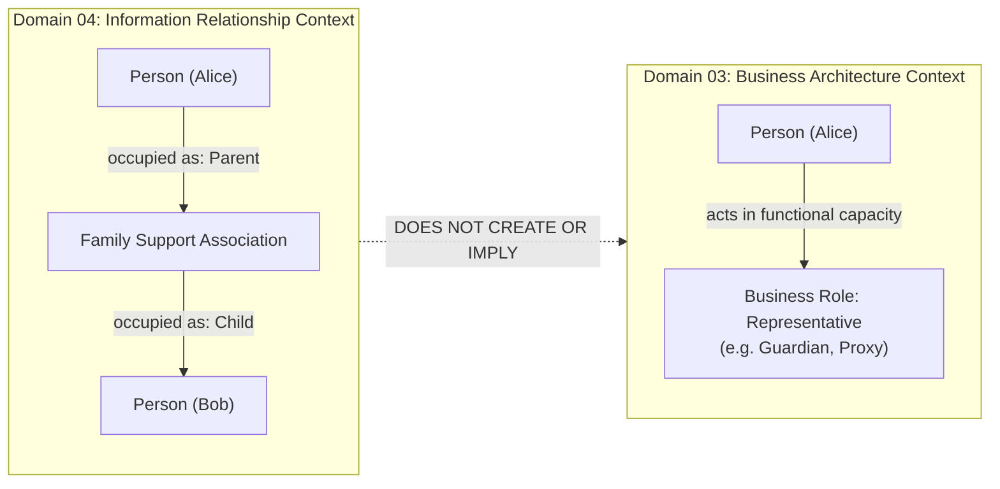
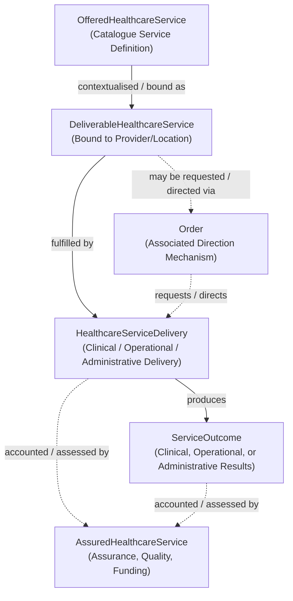
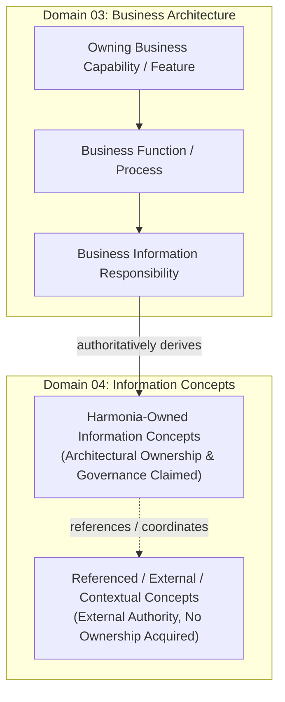

# Requirements

### Overview & Goals

This plan executes a focused, bounded **semantic hygiene pass** across the newly created **Domain 04 — Information Architecture** foundation documentation. The objective is to eliminate semantic drift, invented upstream terminology, and overly rigid/absolute constraints introduced during the initial foundation pass before detailed information-family modelling begins.

The core Domain 04 Information Architecture metamodel, foundational design patterns, and governing architectural question (*"What information does Harmonia need to understand, govern, and manage in order to discharge the responsibilities established by the Business Architecture, and what are the semantic relationships between those information concepts?"*) remain unchanged.

### Upstream Authority & Immutability Context

- **Domain 01 (Motivation)**, **Domain 02 (Strategy)**, and **Domain 03 (Business Architecture)** are **CLOSED and FROZEN** authoritative baselines. They must not be modified.
- Domain 04 derives strictly from the business meaning, capabilities, functions, services, processes, and conceptual information responsibilities established in Domain 03.
- All Business Role names and traceability chains used in Domain 04 must match the canonical Domain 03 baseline exactly.

### Scope

#### In Scope
1. **Canonical Domain 03 Business Role Terminology**:
   - In `patterns/information-relationships.md`, eliminate invented or non-canonical role examples (e.g. *Registered Clinician*, *Triage Officer*, *System Administrator*, *Patient / Care Recipient*, *Nominated Representative* where presented as a canonical role name).
   - Use only canonical Domain 03 Business Roles (e.g. *Practitioner*, *Clinician*, *Care Coordinator*, *Referrer*, *Requester*, *Prescriber*, *Performer*, *Carer*, *Support Person*, *Advocate*, *Representative*, *Wardsperson*, *Information Steward*, *Service Provider*, *Information Supplier*, *Information Client*).
   - Explicitly reinforce that *Healthcare Subject* is orthogonal to the *Patient* Business Role and is NOT itself a Business Role.
2. **Canonical Domain 03 Traceability Terminology**:
   - In `traceability/domain03-traceability.md`, correct all Capability, Feature, Function, Process, and Information Responsibility names to match the frozen Domain 03 baseline exactly (e.g. replacing invented terms like *Establish / Link Person Master Identity*, *Person Master Record*, etc. with canonical Domain 03 names such as `Person Identity`, `Cross-Authority Identifier Correlation`, `Correlate Person Identifiers`, `Person Identity & Identifier Correlation Graph`).
3. **Refined Responsibility Anchoring Rule**:
   - Replace the absolute rule that every Domain 04 Information Concept must have an owning Domain 03 Information Responsibility with the precise semantic rule:
     > *Information Concepts for which Harmonia claims architectural responsibility SHALL trace to an owning Domain03 Information Responsibility. Referenced, consumed, externally authoritative or contextual Information Concepts may be represented where required to discharge a traced Harmonia responsibility, but SHALL NOT thereby acquire Harmonia ownership or authority.*
   - Ensure consistency across `traceability/domain03-traceability.md`, `guardrails/modelling-guardrails.md`, `metamodel/information-architecture-metamodel.md`, and governance files.
4. **Separation of Architectural Responsibility from Information Stewardship**:
   - In `traceability/domain03-traceability.md` and governance documents, replace phrasing that equates Information Responsibility with "data stewardship" or infers `Information Steward` ownership merely from architectural responsibility.
5. **Semantically Scoped Person Containment Constraint**:
   - Replace blanket prohibitions on recursive containment for Person concepts with the precise semantic constraint:
     > *Person-oriented concepts SHALL NOT use recursive containment merely to represent familial, social, care, representation or authority relationships. Those semantics SHALL use appropriate Information Relationships or Collections.*
   - Apply this wording across `patterns/containment-and-collections.md`, `guardrails/modelling-guardrails.md`, and `metamodel/information-architecture-metamodel.md`.
6. **Removal of Premature Specificity from Reference Examples & Assemblies**:
   - In `patterns/definition-to-accountability.md`, broaden `ServiceOutcome` to encompass clinical, operational, or administrative outcomes according to service context (not solely clinical/health results).
   - Clarify that `HealthcareServiceDelivery` does not universally require a Healthcare Subject when broader service semantics permit otherwise (e.g. facility disinfection, environmental testing, population calibration).
   - In `assemblies-views/assemblies-and-views.md`, explicitly frame context assemblies (e.g. *Healthcare Subject Context*, *Practitioner Context*, *Longitudinal Clinical Record*, *Encounter Context*) as illustrative candidate assemblies, removing premature lifetime/episode/regional assertions.
   - Remove invented concept labels like `Person Master Record` where presented as canonical Domain 04 concepts.
7. **Consistency Review & Completion Report**:
   - Verify all files in `docs/markdown/04-information-architecture/` for cross-document consistency.
   - Generate completion report at `.junie/reports/2026-10-06-domain04-foundation-semantic-hygiene.md`.

#### Out of Scope
- Redesigning or restructuring the Domain 04 metamodel, core concept categories, or foundational design patterns.
- Populating detailed information families/catalogues across the 110 business capabilities.
- Modifying any files under `docs/markdown/01-motivation/`, `docs/markdown/02-strategy/`, or `docs/markdown/03-business-architecture/`.
- Introducing Application Architecture (Domain 05), Integration Architecture (Domain 06), FHIR resource profiles, or persistence designs.

### Functional Requirements

1. **Role Terminology Conformance**:
   - Zero invented Business Role names in Domain 04 documents.
   - Clear distinction between *Relationship Roles* and canonical Domain 03 *Business Roles*.
   - Reiteration that *Healthcare Subject* is an entity/subject context, not a Business Role.
2. **Upstream Traceability Purity**:
   - Traceability examples must reference exact verbatim names from Domain 03 Capabilities, Features, Functions, Processes, and Information Responsibilities.
3. **Responsibility & Anchoring Accuracy**:
   - Explicitly support externally authoritative, referenced, and contextual Information Concepts without requiring Harmonia ownership or transferring authority.
   - Disentangle architectural information responsibility from the specific `Information Steward` business role.
4. **Containment Semantics Precision**:
   - Allow appropriate recursive containment for structural/spatial entities while forbidding its misuse for Person-oriented relationships/care bindings.
5. **Reference Model & Candidate Assembly Generality**:
   - `ServiceOutcome` and `HealthcareServiceDelivery` must accommodate administrative and operational service dimensions alongside clinical ones.
   - Assemblies and views must be clearly designated as candidate illustrative structures.

# Technical Design

### Current Implementation & Baseline Context

The foundational documentation for Domain 04 was established across 10 markdown documents in `docs/markdown/04-information-architecture/`. While the core metamodel, 5-stage progression pattern, relationship structures, and guardrails are sound, the implementation contains minor semantic drift:
- Non-canonical Business Role examples in `patterns/information-relationships.md`.
- Invented Function/Process names in `traceability/domain03-traceability.md`.
- An overly absolute "No Unanchored Concepts" rule that does not account for referenced/external concepts.
- Conflation of Information Responsibility with Data Stewardship.
- Absolute prohibition wording on Person containment rather than scoped semantic constraint.
- Over-specialised clinical assumptions in `ServiceOutcome` and candidate assemblies.

### Key Decisions

1. **Strict Alignment with Frozen Domain 03 Taxonomies**:
   - *Decision*: Replace all invented role names in `patterns/information-relationships.md` with canonical Domain 03 Business Roles (*Clinician*, *Care Coordinator*, *Information Steward*, *Patient*, *Representative*, *Performer*, *Service Provider*).
   - *Rationale*: Maintains conceptual purity and strict compliance with the frozen Business Architecture baseline.
2. **Bounded Ownership Derivation Rule**:
   - *Decision*: Codify that only concepts for which Harmonia claims architectural responsibility must trace to an owning Domain 03 Information Responsibility. External/referenced concepts do not acquire Harmonia ownership.
   - *Rationale*: An integration engine regularly consumes, validates, and routes external records (e.g. national registries, external lab results) where Harmonia governs the integration relationship or transaction without owning the originating concept.
3. **Separation of Architectural Responsibility from Governance Roles**:
   - *Decision*: Remove references to "data stewardship" as a synonym for Capability Information Responsibility, and avoid inferring `Information Steward` role ownership from capability responsibilities.
   - *Rationale*: Capability Information Responsibility is an architectural property; `Information Steward` is a specific organizational governance role.
4. **Semantically Bounded Person Containment**:
   - *Decision*: Adopt the exact constraint: *Person-oriented concepts SHALL NOT use recursive containment merely to represent familial, social, care, representation or authority relationships.*
   - *Rationale*: Focuses the rule on the architectural intent (preventing `Person.contains(Person)` for relationships) without creating an unnecessarily absolute metaphysical rule.
5. **Multi-Domain Generality for Reference Models & Assemblies**:
   - *Decision*: Generalize `ServiceOutcome` to include clinical, operational, and administrative outcomes; allow `HealthcareServiceDelivery` without an obligatory Healthcare Subject where appropriate; frame assemblies as candidate illustrative structures.
   - *Rationale*: Harmonia coordinates operational and logistics services (e.g. ward sanitisation, device calibration, specimen transit) where outcomes and deliveries do not strictly follow patient-centric clinical paradigms.

### Proposed File Modifications & Corrections

```text
docs/markdown/04-information-architecture/
├── README.md
│   └── Update summaries to reflect generalized ServiceOutcome, candidate assembly framing, and refined containment/anchoring rules.
├── metamodel/information-architecture-metamodel.md
│   └── Refine responsibility derivation to distinguish Harmonia-owned from referenced/external concepts; relax Person containment wording.
├── patterns/
│   ├── information-relationships.md
│   │   └── Replace invented Business Roles (Registered Clinician, Triage Officer, System Administrator, Patient / Care Recipient) with canonical Domain 03 roles; clarify Healthcare Subject is not a role.
│   ├── containment-and-collections.md
│   │   └── Replace absolute Person containment prohibition with the semantically bounded constraint.
│   └── definition-to-accountability.md
│       └── Generalize ServiceOutcome (clinical, operational, administrative); clarify HealthcareServiceDelivery subject optionality; ensure ReportedTask accounts for both task and outcome.
├── governance/
│   ├── authority-custody-provenance.md
│   │   └── Clarify architectural responsibility vs. Information Stewardship; align granular authority bindings.
│   └── information-lifecycle.md
│       └── Maintain concept-specific lifecycles with generalized outcome states.
├── assemblies-views/assemblies-and-views.md
│   └── Frame context assemblies as illustrative candidate assemblies; remove invented concept names (Person Master Record -> Person / Person Identity Record).
├── guardrails/modelling-guardrails.md
│   └── Update Guardrail 6 (Responsibility Derivation) to incorporate the bounded ownership rule; update Guardrail 8 and Guardrail 9.
└── traceability/domain03-traceability.md
    └── Replace all non-canonical Domain 03 Capability, Feature, Function, Process, and Information Responsibility names with exact frozen baselines; replace "No Unanchored Concepts" with the refined derivation rule.
```

### Architecture Diagrams

#### 1. Corrected Relationship Role vs. Business Role Separation


#### 2. Generalized Definition-to-Accountability Pattern (Healthcare Service)


#### 3. Bounded Ownership & Responsibility Derivation Flow


# Testing

### Validation Approach

Verification will be conducted through exhaustive textual and conceptual auditing of all documents in `docs/markdown/04-information-architecture/` against:
1. Canonical Domain 03 documents (`actors-roles/roles.md`, `information-responsibility/information-responsibility.md`, `behaviours/*.md`, `processes/business-processes.md`).
2. The 16 Canonical Information Architecture Guardrails.
3. Repository architectural axioms (AX-01 to AX-18) in `docs/markdown/01-motivation/principles/architectural-axioms.md`.

### Conformance & Verification Scenarios

1. **Business Role Terminology Audit**:
   - Check `patterns/information-relationships.md` to ensure zero occurrences of *Registered Clinician*, *Triage Officer*, *System Administrator*, *Patient / Care Recipient*, or *Healthcare Subject* as a Business Role.
   - Verify that all role examples correspond exactly to entries in `docs/markdown/03-business-architecture/actors-roles/roles.md`.
2. **Traceability Terminology Audit**:
   - Check `traceability/domain03-traceability.md` to ensure all Capability, Feature, Function, Process, and Information Responsibility names match Domain 03 verbatim.
   - Confirm replacement of invented names (*Establish / Link Person Master Identity*, *Person Master Record*, etc.) with authentic Domain 03 terminology.
3. **Responsibility & Anchoring Rule Conformance**:
   - Verify that the revised rule for Harmonia-owned vs. referenced/external concepts is correctly applied across `traceability/domain03-traceability.md`, `guardrails/modelling-guardrails.md`, and `metamodel/information-architecture-metamodel.md`.
   - Confirm that Information Responsibility is not described as "data stewardship" or used to infer `Information Steward` role ownership.
4. **Person Containment Constraint Conformance**:
   - Verify that `patterns/containment-and-collections.md`, `guardrails/modelling-guardrails.md`, and `metamodel/information-architecture-metamodel.md` use the exact scoped wording: *Person-oriented concepts SHALL NOT use recursive containment merely to represent familial, social, care, representation or authority relationships.*
5. **Reference Example & Candidate Assembly Audit**:
   - Verify that `ServiceOutcome` explicitly includes clinical, operational, and administrative outcomes.
   - Verify that `HealthcareServiceDelivery` does not mandate a Healthcare Subject in all contexts.
   - Verify that context assemblies in `assemblies-views/assemblies-and-views.md` are documented as candidate illustrative assemblies.
   - Confirm removal of `Person Master Record` as a canonical concept name.
6. **Upstream Immutability Audit**:
   - Verify that `git status` / `git diff` confirms zero changes to `docs/markdown/01-motivation/`, `docs/markdown/02-strategy/`, and `docs/markdown/03-business-architecture/`.

### Completion Report Verification

- Verify the creation of `.junie/reports/2026-10-06-domain04-foundation-semantic-hygiene.md` documenting:
  - Files reviewed, modified, and created.
  - Terminology corrections made against Domain 03 baselines.
  - Refined responsibility anchoring and containment rules.
  - Generalizations applied to reference models and assemblies.
  - Confirmation of upstream immutability.

# Delivery Steps

### ✓ Step 1: Correct Business Role taxonomy and Relationship pattern examples
All Business Role examples in `patterns/information-relationships.md` strictly match frozen Domain 03 definitions and avoid role conflation.

- In `docs/markdown/04-information-architecture/patterns/information-relationships.md`, replace invented role examples (*Registered Clinician*, *Triage Officer*, *System Administrator*, *Patient / Care Recipient*) with canonical Domain 03 Business Roles (*Clinician*, *Care Coordinator*, *Information Steward*, *Patient*).
- Update the relationship-to-business-role separation diagram and narrative to ensure *Healthcare Subject* is not represented as a Business Role, using *Representative* instead.
- Review and refine the table of relationship role examples to maintain clear boundaries between local relationship bindings and enterprise functional capacities.

### ✓ Step 2: Correct Domain 03 traceability terminology and responsibility anchoring rules
All derivation paths in `traceability/domain03-traceability.md` and related governance sections use exact canonical Domain 03 names and refined ownership derivation semantics.

- In `docs/markdown/04-information-architecture/traceability/domain03-traceability.md`, replace all non-canonical Capability, Feature, Function, Process, and Information Responsibility names with verbatim Domain 03 terms.
- Replace the absolute "No Unanchored Information Concepts" rule with the refined semantic rule: *Information Concepts for which Harmonia claims architectural responsibility SHALL trace to an owning Domain03 Information Responsibility. Referenced, consumed, externally authoritative or contextual Information Concepts may be represented where required to discharge a traced Harmonia responsibility, but SHALL NOT thereby acquire Harmonia ownership or authority.*
- Disentangle architectural Information Responsibility from "data stewardship" or the `Information Steward` role across `traceability/domain03-traceability.md` and `governance/authority-custody-provenance.md`.
- Update Guardrail 6 in `guardrails/modelling-guardrails.md` to reflect the refined ownership derivation rule.

### ✓ Step 3: Relax Person containment constraints, generalize reference models, and align candidate assemblies
Containment constraints are semantically scoped, service models support multi-domain outcomes, and assemblies are appropriately framed as candidate illustrative structures.

- In `docs/markdown/04-information-architecture/patterns/containment-and-collections.md`, replace absolute Person containment bans with the scoped semantic constraint (*Person-oriented concepts SHALL NOT use recursive containment merely to represent familial, social, care, representation or authority relationships*).
- Update `guardrails/modelling-guardrails.md` and `metamodel/information-architecture-metamodel.md` with consistent Person containment wording.
- In `docs/markdown/04-information-architecture/patterns/definition-to-accountability.md`, generalize `ServiceOutcome` across clinical, operational, and administrative outcomes, and clarify that `HealthcareServiceDelivery` does not universally mandate a Healthcare Subject.
- In `docs/markdown/04-information-architecture/assemblies-views/assemblies-and-views.md`, frame context assemblies as illustrative candidate structures without imposing premature lifetime/episode/regional assertions, and replace invented concept labels like `Person Master Record`.
- Update `README.md` to ensure domain-level summaries align with the refined rules and generalizations.

### ✓ Step 4: Perform cross-file consistency review and generate completion report
The entire Domain 04 documentation suite is fully consistent, conforms to frozen baselines, and is formally reported.

- Execute an exhaustive cross-file consistency check across all 10 documents in `docs/markdown/04-information-architecture/`.
- Verify that no modifications have occurred in `docs/markdown/01-motivation/`, `docs/markdown/02-strategy/`, or `docs/markdown/03-business-architecture/`.
- Author the formal completion report at `.junie/reports/2026-10-06-domain04-foundation-semantic-hygiene.md`.