# Requirements

### Overview & Goals

In a distributed Health Integration Environment (HIE), clinical data integrity, patient safety, and operational effectiveness depend fundamentally on unambiguous semantic boundaries. When software systems conflate a clinical request with a clinical result, treat an encounter context as an aggregate owner of all medical facts, confuse a medication order with actual patient administration, or mistake an unverified message for an authoritative legal record, the consequences are severe: duplicate treatments, missed critical findings, corrupted audit trails, and catastrophic clinical misattribution.

The goal of **Domain 04 — Information Architecture, Package 2: Clinical & Service Administration Information Families** is to establish the technology-neutral, vendor-agnostic semantic information architecture governing the core clinical and service-administration concepts required to support the Harmonia enterprise:
- **Referral**
- **Appointment / Scheduling Context**
- **Episode / Encounter**
- **Order**
- **Diagnostic Information**
- **Medication Information**
- **Procedure**
- **Clinical Document**
- **Problem / Condition / Care Need**
- **Goal / Care Plan**
- **Clinical Communication**

#### Architectural Purpose & Derivation Philosophy
A central purpose of the Harmonia architecture is to make semantic derivation explicit, traceable, and reviewable rather than inferring a likely destination from established healthcare information models, standards, or implementation conventions and working backwards to construct justification. 

Harmonia architecture documentation exists to serve three primary purposes:
1. **Architecture as Engineering Input**:
   - The architecture provides strong, explicit, and traceable design input and guardrails for the implementation of Harmonia.
   - It constrains and guides implementation without prematurely prescribing implementation detail.
   - Architectural decisions, semantic boundaries, responsibilities, principles, and guardrails must be sufficiently precise that downstream design, interface, and development decisions can be objectively assessed against them.
   - Architecture is an input to design, not post-hoc documentation.
2. **Architecture as the Control Framework for AI-Assisted Development**:
   - The documentation establishes the authoritative architectural boundary within which AI agents operate as development peers.
   - AI development peers must **not** infer intended architecture from source code, familiar frameworks, healthcare industry conventions, standards (e.g. FHIR, HL7, OpenEHR), common implementation patterns, or what the agent considers the most probable eventual solution.
   - The architecture provides the context, constraints, canonical terminology, semantic boundaries, traceability, and guardrails needed for an AI peer to reason strictly *within and from* the architecture.
   - AI is expected to challenge the architecture when there is an authentic reason to challenge it, but **never** silently bypass the architecture because it recognizes a familiar destination.
3. **Architecture as an Educational and Demonstrative Artefact**:
   - The documentation provides a pragmatic demonstration of how TOGAF and ArchiMate concepts are used in the engineering and assurance of a substantial health software system:
     $$\text{Motivation} \longrightarrow \text{Strategy} \longrightarrow \text{Business} \longrightarrow \text{Information} \longrightarrow \text{Application} \longrightarrow \text{Integration} \longrightarrow \text{Technology} \longrightarrow \text{Implementation}$$
   - The **derivation itself is part of the deliverable**. Skipping derivation because the eventual solution seems recognizable defeats a primary objective of the architecture work.

#### The Governing Question of Domain 04
Treat Package 2 as an exercise in the **quantification and qualification** of abstract information in play, not the design of realized data structures:
- **Governing Question**: *What information must be in play for the business responsibilities and behaviours established in Domain 03 to occur, and what does that information mean?*
- **Not**: *What object, resource, message, class, table, document structure, or API payload represents it?*

---

### Scope

#### In Scope (Package 2 Forward Derivation)
1. **Forward Derivation of 11 Information Families**:
   - Deriving the information requirements, candidate concepts, semantic qualifications, and relationships forward from Domain 03 Business Architecture responsibilities, functions, services, and processes for:
     - `referral.md`
     - `appointment-scheduling.md`
     - `episode-encounter.md`
     - `order.md`
     - `diagnostics.md`
     - `medication.md`
     - `procedure.md`
     - `clinical-document.md`
     - `problem-condition-care-need.md`
     - `care-plan.md`
     - `clinical-communication.md`
2. **Standard Information Family Structure**:
   - Purpose and semantic boundary.
   - Domain 03 responsibility, capability, function, and process derivation (exact canonical terminology).
   - Principal Information Concepts and definitions.
   - Semantic classification (Entity, Activity, Event, Assertion, Definition, Contextual Binding, Outcome, Accountability, Collection, Assembly).
   - Information responsibility (Harmonia-owned vs. Reference / Contextual vs. Architectural Gap).
   - Originating information authority, stewardship, custody, and consumption demarcations.
   - Assertion-level governance, provenance, and temporal/effective characteristics.
   - Reified Information Relationships with source/target roles, qualifications, and temporal validity.
   - Concept-specific lifecycle state progressions.
   - Candidate Information Assembly participation.
   - Explicit negative semantic boundaries and exclusions.
   - Unresolved architectural questions, boundary risks, and gap recordings.
3. **Investigation and Resolution of Key Semantic Distinctions**:
   - Explicitly resolving candidate concepts and boundaries without presupposing industry answers:
     - `Referral ≠ Order ≠ Service Delivery`
     - `Appointment ≠ Encounter ≠ HealthcareServiceDelivery`
     - `Encounter Spine ≠ Aggregate Data Owner`
     - `Order ≠ Result / Fulfilment`
     - `Diagnostic Request ≠ Diagnostic Activity ≠ Observation ≠ Finding ≠ Diagnostic Report`
     - `Medication Order ≠ Dispense Event ≠ Administration Event ≠ Medication Statement / History`
     - `Procedure Definition ≠ Procedure Activity ≠ Procedure Outcome ≠ Procedure Documentation`
     - `Clinical Document ≠ Clinical Fact`
     - `Condition ≠ Problem ≠ Care Need`
     - `Goal ≠ Outcome`
     - `Care Plan ≠ Planned / Completed Activity`
     - `Clinical Communication ≠ Authoritative Clinical Record`
4. **Evaluation of Reusable Patterns**:
   - Testing the *Definition $\to$ Contextualisation/Binding $\to$ Fulfilment $\to$ Outcome $\to$ Accountability* pattern across all 11 families, classifying applicability (Fully, Partially, Concept-Specific, or Inapplicable) without manufacturing artificial concepts.
5. **Visual Conceptual Models**:
   - Generating 10 conceptual Mermaid semantic diagrams as *outputs* of the forward derivation, depicting only abstract concepts and relationships without implementation constructs.
6. **Navigational Alignment**:
   - Navigation-only updates to `docs/markdown/04-information-architecture/information-families/README.md` and `docs/markdown/04-information-architecture/README.md`.
7. **Authoritative Completion Report**:
   - Documenting derivation findings, concept classifications, authority assignments, and compliance at `.junie/reports/2026-10-07-domain04-clinical-service-administration-information-families.md`.

#### Out of Scope (Explicitly Excluded)
- **Operational Work & Facility Logistics**: Portering, cleaning queues, job dispatch, bed occupancy states, and bed turnover workflows (deferred to Operational Work / Facility Logistics package).
- **Collaboration Contexts**: Matrix chat rooms, discussion threads, and operational collaboration spaces (deferred to Collaboration Information Family).
- **Incident & Event Alerting**: Critical laboratory interruptive alerts, telemetry notification streams, and incident management (deferred to Event / Alerting package).
- **Information Control & Security**: Detailed ABAC/RBAC rulesets, break-glass security context tokens, and privacy exclusion matrices (governed under Themis / Information Control).
- **Longitudinal Clinical Record Assembly**: Full multi-source LHR assembly synthesis and reconciliation algorithms (deferred to Assemblies & Views package).
- **Downstream Technical Realizations**: Java classes, Spring beans, JPA entities, PostgreSQL DDL schemas, FHIR R4/R5 profiles, JSON Schemas, or REST/MLLP gateway endpoints (governed under Domains 05, 06, and 07).
- **Modifications to Frozen Baselines**: Modifying Domains 01, 02, 03, the Domain 04 Foundation, or Package 1 semantics.

---

### User Stories & Stakeholder Utility

Establishing explicit semantic boundaries and forward derivation maximizes clinical safety, operational efficiency, and systemic utility while preventing costly rework and software fragility:

- **As an Attending Clinician**, I want clinical requests, diagnostic observations, bedside administrations, and encounter contexts to maintain independent semantic identity and authority, so that the closure, discharge, or transfer of an administrative encounter never corrupts, obscures, or invalidates longitudinal clinical history.
- **As a Triage Specialist**, I want incoming referrals to be governed through an independent progression lifecycle and clinical dossier, so that patient access prioritization is managed transparently without premature dependency on downstream clinic booking schedules.
- **As a Registered Nurse**, I want medication orders, pharmacy dispenses, and administration events to be governed as distinct concepts with independent authorities and timestamps, so that dispensed pharmaceuticals are never conflated with ingested doses, preventing life-threatening medication errors.
- **As a Pathologist / Radiologist**, I want diagnostic requisitions, specimens, discrete findings, and diagnostic reports to maintain distinct semantic identities and correlation linkages, so that laboratory instrument provenance, preliminary findings, and formal addenda are preserved with legal non-repudiation.
- **As a Chronic Disease Care Coordinator**, I want shared care plans and clinical goals to coordinate multidisciplinary intent without acquiring false ownership over referenced diagnoses, interventions, or outcomes, so that care intent is evaluated objectively against actual patient outcomes.
- **As a Health Information Manager**, I want clinical documents to be governed as versioned clinical artifacts distinct from the discrete facts they assert, so that amending or superseding a document does not destructively alter verified clinical facts in the longitudinal health record.
- **As a System Integration Architect**, I want canonical information concepts derived strictly from business responsibility rather than FHIR resource models or database schemas, so that interface variations, legacy HL7 v2 streams, and future national standards can be mapped into a stable semantic core without distorting clinical reality.
- **As an AI Development Peer**, I want the architecture to provide an explicit, forward-derived control framework, so that I can reason consistently with Harmonia's architectural intent, identify genuine omissions or risks, and avoid substituting familiar industry conventions for intentional design.

---

### Functional Requirements

1. **Forward Derivation from Business Architecture (FR-01)**:
   - Every canonical Information Concept must be derived forward from Domain 03 Business Architecture responsibilities, capabilities, functions, services, and processes.
   - Derivation direction: $\text{Capability/Feature} \to \text{Function/Process/Service} \to \text{Collaboration/Interaction} \to \text{Information Requirement} \to \text{Concept/Relationship}$.
   - Concepts must NOT be inferred backwards from anticipated healthcare models, FHIR resources, or implementation conventions.
2. **Information Quantification & Qualification (FR-02)**:
   - Package 2 must quantify what information must exist, be distinguished, be related, be referenced, and be understood or managed by Harmonia to execute Domain 03 behaviours.
   - Package 2 must qualify what each concept means, why it exists, its semantic classification, relationship participation, authority, provenance, temporal context, and lifecycle without converting into physical schemas.
3. **Exact Canonical Domain 03 Upward Traceability (FR-03)**:
   - Concepts for which Harmonia claims architectural responsibility must trace directly to exact canonical Domain 03 Information Responsibilities and Processes without reconstructed or invented terminology.
   - Concepts lacking ownership trace must be explicitly classified as `Reference / Contextual` or recorded as an architectural gap.
4. **Independent Identity, Authority, Provenance, and Lifecycle (FR-04)**:
   - Related clinical concepts must retain independent semantic identity, originating authority, provenance, and concept-specific lifecycles.
   - Authority attaches at the granular assertion and relationship level, not composite objects.
5. **Non-Ownership Contextual Associations (FR-05)**:
   - Contextual spines (`Encounter Context`, `Care Plan`, `Referral Dossier`) must link constituent facts via explicit `Information Relationships` without acquiring ownership or subsuming their identity.
6. **Non-Equivalence Enforcement (FR-06)**:
   - Formal preservation of the 13 foundational non-equivalences across all documentation:
     - `Information Concept ≠ Data Object ≠ FHIR Resource`
     - `Referral ≠ Order`
     - `Appointment ≠ Encounter`
     - `Encounter ≠ HealthcareServiceDelivery`
     - `Order ≠ Result`
     - `Diagnostic Activity ≠ Diagnostic Report`
     - `Medication Order ≠ Dispense ≠ Administration`
     - `Procedure Activity ≠ Procedure Documentation`
     - `Clinical Document ≠ Clinical Fact`
     - `Condition ≠ Problem ≠ Care Need`
     - `Goal ≠ Outcome`
     - `Care Plan ≠ Activity`
     - `Clinical Communication ≠ Clinical Record`
7. **Evaluative & Planning Independence (FR-07)**:
   - `Condition`, `Problem`, and `Care Need` must be modeled as distinct concepts without artificial inheritance hierarchies.
   - `Goal` (desired target state) must remain distinct from `Outcome` (actual result).
   - Care plans must accommodate non-pathological care needs directly.
8. **Communication vs. Record Governed Gating (FR-08)**:
   - `Clinical Communication` must be modeled as transactional discourse distinct from the authoritative `Patient Clinical Record`.
   - Transition into the clinical record requires explicit governed boundaries (e.g. assertion acceptance, clinical verification, or governed ingestion).
9. **Setting-Neutral and Modality-Neutral Clinical Semantics (FR-09)**:
   - Clinical concepts (medication administration, procedures, encounters, orders) must be formulated with setting-neutral semantics applicable across acute, primary, community, inpatient, and virtual care environments.

---

### Non-Functional Requirements & Governance Guardrails

1. **Compliance with the 16 Information Architecture Guardrails (NFR-01)**:
   - Full compliance with Guardrails 1 through 16 codified in `docs/markdown/04-information-architecture/guardrails/modelling-guardrails.md`.
2. **Zero Downstream Standards / Implementation Leakage (NFR-02)**:
   - FHIR resources, HL7 messages, LOINC, SNOMED CT, ICD, MBS, DRG, EMR/PAS/LIS/RIS schemas, Java, Spring, JPA, SQL, and API payloads must **not** serve as derivation inputs or justifications for canonical Domain 04 concepts.
   - Convergence with standards is validation, not derivation: *We are allowed to arrive at FHIR; we are not allowed to start there.*
3. **Immutability of Frozen Baselines (NFR-03)**:
   - Domains 01, 02, and 03 are closed and frozen. Zero modifications may be made to upstream baselines.
   - The frozen Domain 04 Foundation and Package 1 concepts (`Person`, `Healthcare Subject Context`, `Practitioner`, `Practitioner Role Binding`, `Healthcare Organisation`, `Healthcare Location`, `OfferedHealthcareService`, `DeliverableHealthcareService`, `HealthcareServiceDelivery`, `ServiceOutcome`, `Device Instance`, `Endpoint`) must be reused without semantic redefinition.
4. **Visual Models as Outputs of Derivation (NFR-04)**:
   - All visual semantic diagrams must be outputs of the forward derivation, depicting only abstract concepts and relationships without forced connectivity or implementation constructs.

# Technical Design

### Current Implementation Context

The repository currently possesses a complete, frozen architecture baseline across Domains 01, 02, and 03, alongside the foundational metamodel, design patterns, governance models, guardrails, and Package 1 of Domain 04:

```text
docs/markdown/04-information-architecture/
├── README.md                                    # Domain overview & governing roadmap
├── metamodel/
│   └── information-architecture-metamodel.md   # Metamodel, concept model, 6-way independence
├── patterns/
│   ├── information-relationships.md             # Reusable relationship pattern, role separation
│   ├── containment-and-collections.md           # Qualified forward containment & collections
│   └── definition-to-accountability.md          # 5-stage pattern (Healthcare Service & Task/Work)
├── governance/
│   ├── authority-custody-provenance.md          # Assertion, authority, custody, provenance
│   └── information-lifecycle.md                 # Concept-specific lifecycles & transition rules
├── assemblies-views/
│   └── assemblies-and-views.md                  # Assembly vs View, candidate context assemblies
├── guardrails/
│   └── modelling-guardrails.md                  # The 16 canonical Information Architecture guardrails
├── traceability/
│   └── domain03-traceability.md                 # 4-tier derivation framework & reference examples
└── information-families/                        # Detailed Information Families
    ├── README.md                                # Package 1 overview & authority demarcations
    ├── person-healthcare-subject.md             # Person, Identity, Correlation, Subject Context
    ├── practitioner.md                          # Practitioner, Registration, Roles, Privileges
    ├── organisation.md                          # Organisation, Identifiers, Containment
    ├── healthcare-location.md                   # Locations, Care-Places, Spatial Containment
    ├── healthcare-service.md                    # 5-Stage Service Model & Service Provision Map
    └── device.md                                # Device Definition, Instance, Endpoints
```

Package 1 successfully established the foundational physical, organizational, and workforce entities. Package 2 now builds upon these entities to formalize the clinical, service-administration, and care-coordination concepts.

---

### Key Design Decisions & Utilitarian Justifications

#### Decision 1: Decoupling Contextual Spines from Data Ownership
- **Chosen Approach**: An `Encounter Context` or `Care Plan` serves as an operational and clinical coordination spine, linking related facts via explicit `Information Relationships`, but **SHALL NOT** own or subsume the semantic identity, authority, provenance, or lifecycle of associated orders, observations, medications, procedures, or documents.
- **Utilitarian Rationale**: In clinical reality, a patient's laboratory result or medication history remains clinically valid and vital long after an acute hospital encounter is closed or discharged. If an encounter owned its associated clinical facts, closing or archiving the encounter would jeopardize access to critical longitudinal health data, increasing the likelihood of adverse drug events or redundant diagnostic testing.

#### Decision 2: Pure Separation of Closed-Loop Order from Clinical Result
- **Chosen Approach**: Maintain `Order` as an authoritative requisition and tracking directive owned by `L1: Order Administration`, while treating diagnostic observations, pathology reports, and surgical outcomes as independent clinical concepts owned by performing clinical/diagnostic capabilities.
- **Utilitarian Rationale**: Conflating requests with results compromises patient safety. An order may be cancelled, rejected, or re-routed, whereas an unfulfilled order must never be mistaken for a normal clinical finding. Tracking order progression closed-loop (`Requisition Placed` $\to$ `Closed / Verified`) eliminates dropped orders, ensuring timely diagnosis and therapy.

#### Decision 3: Separation of Medication Order, Dispense, Administration, and Statement
- **Chosen Approach**: Reject a monolithic medication state machine. Represent `Medication Order` (prescribing intent), `Dispense Event` (pharmacy supply), `Administration Event` (bedside nurse delivery), and `Medication Statement / History` (reported usage) as distinct concepts with independent authorities and timestamps.
- **Utilitarian Rationale**: Dispensing a drug does not prove a patient swallowed it; prescribing a drug does not prove a pharmacy dispensed it; and emergency administrations often occur without an electronic pre-order. Separating these concepts provides absolute fidelity during clinical medication reconciliation, directly minimizing preventable adverse drug events.

#### Decision 4: Tripartite Demarcation of Condition, Problem, and Care Need
- **Chosen Approach**: Model `Condition` (pathological diagnosis), `Problem` (clinical management concern), and `Care Need` (functional, social, or preventative requirement) as distinct concepts related through semantic associations rather than an artificial inheritance hierarchy.
- **Utilitarian Rationale**: Modern healthcare addresses whole-person care. Patients frequently require community nursing, mobility aids, or dietary support in the absence of an acute disease diagnosis. Forcing all care planning through a disease-based pathology model disenfranchises vulnerable patients and creates clinical coding distortions.

#### Decision 5: Separation of Clinical Document from Clinical Fact
- **Chosen Approach**: `Clinical Document` is modeled as a legal, versioned narrative artifact (*Draft* $\to$ *Final Signed* $\to$ *Superseded*), while the clinical observations and findings asserted within it retain their own semantic identity and longitudinal validity.
- **Utilitarian Rationale**: In medico-legal practice, clinical documents are immutable once signed; corrections require formal addenda or superseding versions. However, a discrete clinical fact (such as a confirmed blood group or penicillin allergy) must remain accessible across clinical decision support systems even if the original consultation note undergoes administrative correction.

#### Decision 6: Explicit Boundary Between Clinical Communication and Clinical Record
- **Chosen Approach**: `Clinical Communication` is modeled as exchanged transactional discourse. Information in transit does not automatically enter the authoritative patient record without an explicit semantic boundary (such as clinical review, verification, or governed acceptance).
- **Utilitarian Rationale**: Unfiltered message ingestion floods clinical records with preliminary, unverified, or irrelevant chatter, generating cognitive fatigue for treating clinicians. Gating record incorporation through explicit acceptance ensures that only verified, clinically relevant assertions inform medical decisions.

---

### Detailed Information Family Specifications

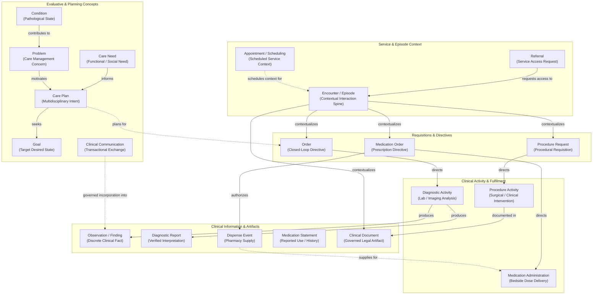

#### 1. Referral Information Family (`referral.md`)
- **Semantic Classification**: `Assertion / Requisition Directive`
- **Domain 03 Traceability**: `L1: Referral Administration` $\to$ `Referral Master & Triage Ledger` $\to$ `Referral Progression Process` (*Submitted* $\to$ *Intake Validated* $\to$ *Clinically Triaged* $\to$ *Accepted/Waitlisted* $\to$ *Scheduled* $\to$ *Consultation Attended* $\to$ *Discharged/Rejected*).
- **Core Concepts**: `Referral`, `Referral Identity`, `Healthcare Subject Context`, `Referrer`, `Intended Service / Recipient`, `Reason / Intent`, `Supporting Context`, `Referral State`, `Disposition`, `Referral Outcome`.
- **Key Relationships**:
  - `Referral concerns Healthcare Subject Context`
  - `Referral made-by Practitioner | Healthcare Organisation`
  - `Referral requests-access-to DeliverableHealthcareService | OfferedHealthcareService`
  - `Referral informed-by Problem | Condition | Assessment`
  - `Referral results-in HealthcareServiceDelivery`
  - `Referral associated-with Encounter | Episode Context`
- **Boundary Invariants**: `Referral ≠ Order` (transfer/sharing of longitudinal care responsibility vs. bounded execution of a specific task); `Referral State ≠ Service Delivery State ≠ Service Outcome`.

#### 2. Appointment / Scheduling Context (`appointment-scheduling.md`)
- **Semantic Classification**: `Contextual Binding / Schedule Projection`
- **Domain 03 Traceability**: `L1: Scheduling Administration` $\to$ `Appointment Synchronisation State` $\to$ `Receive Appointment Notification`, `Synchronise Appointment Status`.
- **Core Concepts**: `Appointment / Scheduled Service Context`, `Appointment Identity`, `Healthcare Subject Context`, `DeliverableHealthcareService`, `Participants` (Subject, Practitioner Roles, Support), `Healthcare Location`, `Scheduled Time / Period`, `Appointment State`, `Scheduling Authority`, `Provenance`.
- **Key Relationships**:
  - `Appointment schedules DeliverableHealthcareService`
  - `Appointment targets Healthcare Subject Context`
  - `Appointment involves Practitioner Role Binding`
  - `Appointment located-at Healthcare Location`
  - `Appointment precedes / realizes Encounter Context`
- **Boundary Invariants**: Harmonia coordinates and projects appointment milestones without owning host PAS booking engines. `Appointment ≠ Encounter ≠ HealthcareServiceDelivery`. Scheduled activities may be cancelled or no-showed; unscheduled service delivery (walk-ins, emergency resuscitation) legitimately occurs.

#### 3. Episode / Encounter Information Family (`episode-encounter.md`)
- **Semantic Classification**: `Contextual Binding / Activity Spine`
- **Domain 03 Traceability**: `L1: Episode & Encounter Administration` $\to$ `Encounter Master & Movement Ledger` $\to$ `Encounter Lifecycle Process` (*Planned/Booked* $\to$ *Arrived* $\to$ *Triaged/Ingested* $\to$ *Active In-Progress* $\to$ *Discharged* $\to$ *Completed/Encoded*).
- **Core Concepts**: `Encounter`, `Episode Context`, `Healthcare Subject Context`, attending `Practitioner Role Binding`, `DeliverableHealthcareService`, `Healthcare Location` / Care-Place movements, `Encounter Classification` (Inpatient, Emergency, Ambulatory, Virtual, Home), temporal context, encounter state, authority, provenance.
- **Key Relationships**:
  - `Episode Context relates-to Encounter [0..*]`
  - `Encounter occurs-within DeliverableHealthcareService`
  - `Encounter subject-of Healthcare Subject Context`
  - `Encounter attended-by Practitioner Role Binding`
  - `Encounter tracks-movement Healthcare Location`
- **Boundary Invariants**: **Encounter Context SHALL NOT imply ownership of every Information Concept associated with it.** Orders, observations, diagnostics, medications, procedures, documents, conditions, and communications retain their own semantic identity, authority, provenance, and lifecycle.

#### 4. Order Information Family (`order.md`)
- **Semantic Classification**: `Assertion / Requisition Directive`
- **Domain 03 Traceability**: `L1: Order Administration` $\to$ `Clinical Order & Closed-Loop Matrix` $\to$ `Closed-Loop Order Progression Process` (*Requisition Placed* $\to$ *Order Dispatched* $\to$ *Specimen Collected/Scheduled* $\to$ *In-Execution* $\to$ *Preliminary Result Bound* $\to$ *Final Result Bound* $\to$ *Closed/Verified*).
- **Core Concepts**: `Order`, `Order Identity`, `Healthcare Subject Context`, `Requester`, requested activity (`DeliverableHealthcareService` or generic `Actionable Activity`), `Destination / Intended Performer`, `Supporting Context`, `Order State`, `Business Acknowledgement`, `Progress Context`, `Outcome Association`.
- **Key Relationships**:
  - `Order requests / directs DeliverableHealthcareService | Actionable Activity`
  - `Order authored-by Practitioner Role Binding`
  - `Order concerns Healthcare Subject Context`
  - `Order dispatched-to Healthcare Organisation | Practitioner`
  - `Order bound-to ServiceOutcome | Diagnostic Report`
- **Boundary Invariants**: `Order ≠ HealthcareService ≠ HealthcareServiceDelivery ≠ Clinical Result`. Order coordinates progression but does NOT own resulting clinical findings. `Technical Transport ACK ≠ Business Delivery ACK`.

#### 5. Diagnostic Information Family (`diagnostics.md`)
- **Semantic Classification**: `Activity, Finding, and Diagnostic Report`
- **Domain 03 Traceability**: `L1: Diagnostic Administration` $\to$ `Diagnostic Correlation & Linkage Registry` $\to$ `Correlate Diagnostic Request`, `Bind Diagnostic Report`, `Distribute Diagnostic Report`.
- **Core Concepts**: `Diagnostic Request / Order`, `Diagnostic Activity`, `Specimen Context`, `Diagnostic Study Context` (imaging series/modality), `Observation / Finding`, `Diagnostic Report`, `Accession Number Binding`, `Diagnostic Correlation`.
- **Key Relationships**:
  - `Diagnostic Request directs Diagnostic Activity`
  - `Diagnostic Activity uses / examines Specimen Context | Diagnostic Study Context`
  - `Diagnostic Activity produces Observation / Finding [0..*]`
  - `Diagnostic Activity produces Diagnostic Report [0..*]`
  - `Diagnostic Report synthesizes Observation / Finding`
  - `Diagnostic Correlation binds Diagnostic Report to Order`
- **Boundary Invariants**: Do not collapse Request, Activity, Observation, Finding, and Report into one concept. Performing LIS/RIS retains authority over diagnostic interpretations; Harmonia governs correlation and longitudinal indexing.

#### 6. Medication Information Family (`medication.md`)
- **Semantic Classification**: `Definition, Directive, Activity Event, and Statement`
- **Domain 03 Traceability**: `L1: Medication Administration` $\to$ `Medication Event Timeline Matrix` $\to$ `Receive Medication Order`, `Track Dispense Event`, `Receive Medication Administration Event`.
- **Core Concepts**: `Medication Definition / Reference` (pharmaceutical product/substance), `Medication Order` (prescription directive), `Dispense Event` (pharmacy supply), `Administration Event` (bedside delivery), `Medication Statement / History` (reported medication use).
- **Key Relationships**:
  - `Medication Order requests Medication Activity`
  - `Medication Order specifies Medication Definition`
  - `Dispense Event fulfils / relates-to Medication Order`
  - `Administration Event fulfils / relates-to Medication Order`
  - `Administration Event verifies Medication Definition`
  - `Medication Statement asserts / reports Medication Use`
- **Boundary Invariants**: `Medication Order ≠ Dispense Event ≠ Administration Event ≠ Medication Statement / History`. Dispense does not prove administration; administration does not require a prior electronic order in Harmonia; medication history does not equal prescribing history.

#### 7. Procedure Information Family (`procedure.md`)
- **Semantic Classification**: `Definition, Activity, and Documentation`
- **Domain 03 Traceability**: `L1: Procedure Administration` $\to$ `Procedure Request & Documentation Index` $\to$ `Receive Procedure Booking / Request`, `Receive Procedural Documentation`; `L1: Theatre Operations` (*Theatre Case Progression Process*).
- **Core Concepts**: `Procedure Definition / Type` (where reusable specifications exist), `Procedure Activity`, `Procedure Request / Order`, `Procedure Outcome`, `Procedure Documentation` (operation report, anaesthetic log).
- **Key Relationships**:
  - `Procedure Activity conforms-to Procedure Definition (where applicable)`
  - `Procedure Activity directed-by Procedure Request`
  - `Procedure Activity performed-by Practitioner Role Binding`
  - `Procedure Activity located-at Healthcare Location`
  - `Procedure Activity produces Procedure Outcome`
  - `Procedure Activity documented-by Procedure Documentation | Clinical Document`
- **Boundary Invariants**: `Procedure Definition ≠ Procedure Activity ≠ Procedure Outcome ≠ Procedure Documentation`. `Procedure ≠ HealthcareServiceDelivery` (a procedure may constitute part of a service delivery, but represents distinct interventional semantics).

#### 8. Clinical Document Information Family (`clinical-document.md`)
- **Semantic Classification**: `Governed Document Artifact`
- **Domain 03 Traceability**: `L1: Clinical Record Administration` $\to$ `Clinical Document Registry & Lifecycle State` $\to$ `Clinical Document Lifecycle Process` (*Draft* $\to$ *Preliminary* $\to$ *Final Signed* $\to$ *Amended/Addended* $\to$ *Superseded* $\to$ *Entered-in-Error*).
- **Core Concepts**: `Clinical Document`, `Document Identity`, `Healthcare Subject Context`, `Author / Authorship`, `Clinical Context`, `Document Type / Definition`, `Creation Time`, `Effective Time`, `Version`, `Provenance`, `Lifecycle State`, `Document Content`.
- **Key Relationships**:
  - `Clinical Document documents Encounter | Procedure Activity | Diagnostic Activity`
  - `Clinical Document authored-by Practitioner Role Binding`
  - `Clinical Document contains-or-asserts Clinical Information`
  - `Clinical Document supersedes / amends Clinical Document`
- **Boundary Invariants**: **Clinical Document ≠ Clinical Fact.** A document is a governed legal communication artifact. It asserts clinical facts without owning their semantic identity. Documents amend or supersede; facts possess independent longitudinal validity.

#### 9. Problem / Condition / Care Need Information Family (`problem-condition-care-need.md`)
- **Semantic Classification**: `Clinical Assertion & Requirement`
- **Domain 03 Traceability**: `Patient Clinical Record` $\to$ `Governed Longitudinal Health Record (LHR)` (active problem lists, verified condition registries); care enablement contexts.
- **Core Concepts**:
  - `Condition`: Recognized clinical pathology, disease, disorder, or injury associated with a Healthcare Subject (clinical status, verification status, severity, onset/resolution).
  - `Problem`: Identified issue, diagnostic challenge, or care-management concern requiring clinical action or monitoring.
  - `Care Need`: Broader care requirement (functional, mobility, dietary, preventative, palliative, or social/support) that may exist in the absence of a pathological condition.
- **Key Relationships**:
  - `Condition concerns Healthcare Subject Context`
  - `Condition contributes-to Problem`
  - `Problem identified-in Encounter Context`
  - `Problem motivates Care Plan | Referral`
  - `Care Need responds-to Condition | Assessment | Functional Need`
  - `Care Need motivates Care Plan | Healthcare Service`
- **Boundary Invariants**: `Condition ≠ Problem ≠ Care Need`. `Care Need` is **NOT** an artificial superclass of `Condition` or `Problem`. Non-pathology care needs are first-class clinical and social requirements.

#### 10. Goal / Care Plan Information Family (`care-plan.md`)
- **Semantic Classification**: `Coordination Model & Target Assertion`
- **Domain 03 Traceability**: `L1: Care Plan Administration` $\to$ `Shared Care Plan & Clinical Goal Registry` $\to$ `Receive Care Plan`, `Associate Care Plan Context`, `Distribute Care Plan Change`.
- **Core Concepts**: `CarePlan`, `Goal` (desired target state/outcome), `Planned Activity`, `Enrolled Care Team Participant`, `Barrier`, `Plan Milestone`.
- **The Coordination Backbone**:
  $$\text{WHY (Condition/Need)} \longrightarrow \text{WHAT DO WE WANT? (Goal)} \longrightarrow \text{WHAT DO WE PLAN? (Care Plan)} \longrightarrow \text{WHAT DID WE DO? (Activity)} \longrightarrow \text{WHAT HAPPENED? (Outcome)} \longrightarrow \text{DID IT WORK? (Goal Evaluation)}$$
- **Key Relationships**:
  - `Care Plan addresses Condition | Problem`
  - `Care Plan responds-to Care Need`
  - `Care Plan seeks Goal`
  - `Care Plan plans-for Activity`
  - `Care Plan evaluated-against ServiceOutcome`
  - `Goal evaluated-against ServiceOutcome | Observation`
- **Boundary Invariants**: `Goal ≠ Outcome` (desired state vs. actual result). `Care Plan ≠ Activity`. Referencing an activity, condition, or outcome transfers zero ownership or authority to the Care Plan.

#### 11. Clinical Communication Information Family (`clinical-communication.md`)
- **Semantic Classification**: `Transactional Discourse Artifact`
- **Domain 03 Traceability**: `L1: Clinical Communication Administration` $\to$ `Clinical Message Dispatch & Audit Register` $\to$ `Distribute Clinical Communication`, `Track Business Delivery Acknowledgement`, `Record Communication Transaction`.
- **Core Concepts**: `Clinical Communication`, `Communication Identity`, `Sender`, `Recipient(s)`, `Healthcare Subject / Clinical Context`, `Content`, `Delivery State`, `Business Acknowledgement`, `Transaction Context`, `Provenance`.
- **Key Relationships**:
  - `Clinical Communication sent-by Practitioner Role Binding | Healthcare Organisation`
  - `Clinical Communication received-by Practitioner Role Binding | Recipient Endpoint`
  - `Clinical Communication relates-to Healthcare Subject Context | Encounter Context`
  - `Clinical Communication acknowledged-by Business Delivery Acknowledgement`
  - `Clinical Communication incorporated-into Patient Clinical Record (via governed boundary)`
- **Boundary Invariants**: **Clinical Communication ≠ Clinical Record.** Information being communicated does not automatically make it part of the authoritative clinical record. Transition requires explicit assertion acceptance, clinical verification, or governed incorporation.

---

### Definition-to-Accountability Pattern Evaluation

| Information Family | Stage 1: Definition | Stage 2: Binding | Stage 3: Fulfilment | Stage 4: Outcome | Stage 5: Accountability | Pattern Evaluation & Utility |
| :--- | :--- | :--- | :--- | :--- | :--- | :--- |
| **Referral** | Generic Referral Protocol / Indication Rule | Local Service Requisition Binding | Referral Triage & Booking Execution | Referral Disposition / Specialist Intake | Referral Audit & Waitlist Compliance Review | Applicable. Effectively demarcates referral protocols from active triage cases and historical waitlist accountability. |
| **Appointment** | Clinic Session / Slot Template | Scheduled Service Context (Booking) | Patient Check-In & Presentation | Appointment Attendance / No-Show Status | Clinic Utilization & DNA Audit Ledger | Applicable. Demarcates scheduling capacity from actual booking and attendance outcomes. |
| **Encounter** | Encounter Model / Episode Class Definition | Established Encounter Context | Active Inpatient / Clinical Rounding | Clinical Discharge Dossier & Encoded Record | Statutory Episode DRG / Morbidity Audit | Applicable. Clearly separates encounter admission models from daily clinical rounds and retrospective encoding audits. |
| **Order** | Orderable Item / Test Catalogue Specification | Concrete Clinical Requisition | Diagnostic Execution / Specimen Processing | Result Observation / Diagnostic Report | Closed-Loop Order Fulfillment Verification | Highly Applicable. Solves the closed-loop tracking problem by isolating orders from resulting clinical findings. |
| **Diagnostics** | Diagnostic Test Protocol (LOINC) | Laboratory Worklist / Accession Binding | Specimen Analysis / Modality Scanning | Discrete Observation & Diagnostic Report | Laboratory Quality Control & Accreditation Audit | Highly Applicable. Distinguishes protocol definitions, specimen examination activities, observations, and narrative reports. |
| **Medication** | Medication Definition (Product/Form) | Medication Order (Prescription) | Dispense Event & Administration Event | Therapeutic Response / Adverse Drug Reaction | Antimicrobial Stewardship & Formulary Audit | Highly Applicable. Decouples drug definitions, prescriptions, dispensing, bedside administration, and clinical efficacy. |
| **Procedure** | Procedure Definition (SNOMED-CT / MBS) | Surgical Case Booking / Theatre Requisition | Perioperative Surgical / Interventional Activity | Procedural Outcome & Specimen Yield | Surgical Mortality & Morbidity (M&M) Review | Highly Applicable. Distinguishes surgical definitions from operating theatre execution and post-operative outcomes. |
| **Clinical Document** | Document Template / Type Specification | Authored Clinical Consultation Context | Document Legal Signing & Publication | Document Dissemination & Clinical Impact | Medico-Legal Document Revision & Addenda Audit | Partially Applicable. Emphasizes versioning and legal lifecycle over operational fulfilment. |
| **Problem / Condition** | Disease Taxonomy (SNOMED-CT / ICD-10) | Diagnosed Condition Assertion / Active Problem | Clinical Monitoring & Disease Management | Resolution / Remission / Chronic Severity State | Epidemiology Registry & Public Health Notification | Partially Applicable. Pathological conditions progress through clinical states rather than task execution. |
| **Care Plan** | Chronic Disease Protocol Template | Shared Care Plan Context Binding | Multidisciplinary Care Plan Execution | Goal Attainment / Functional Outcome | Care Plan Quality & Effectiveness Review | Highly Applicable. Distinguishes clinical pathways from active patient plans, planned tasks, and goal evaluations. |
| **Clinical Communication** | Message Template / Communication Protocol | Dispatched Clinical Communication Instance | Electronic Message Transport & Delivery | Recipient Business Delivery Acknowledgement | Medico-Legal Transmission Audit Register | Applicable. Demarcates message drafting from secure routing, delivery confirmation, and legal transmission archives. |

---

### Visual Semantic Models (Mermaid Conceptual Diagrams)

#### Diagram 1: Referral → Service Relationship
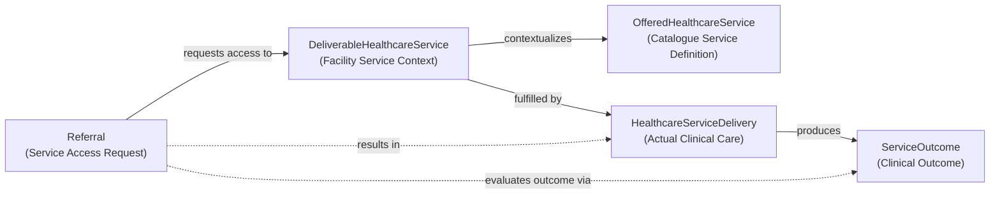

#### Diagram 2: Appointment / Encounter / Service Context
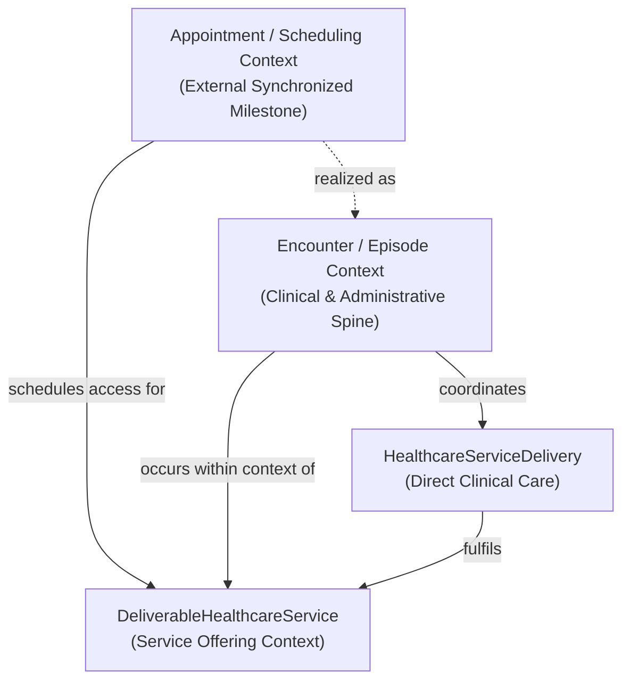

#### Diagram 3: Closed-Loop Order Semantic Relationships
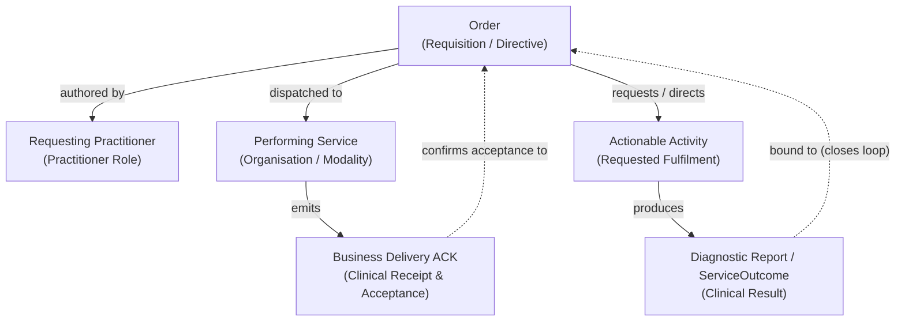

#### Diagram 4: Diagnostic Request → Activity → Observation / Report
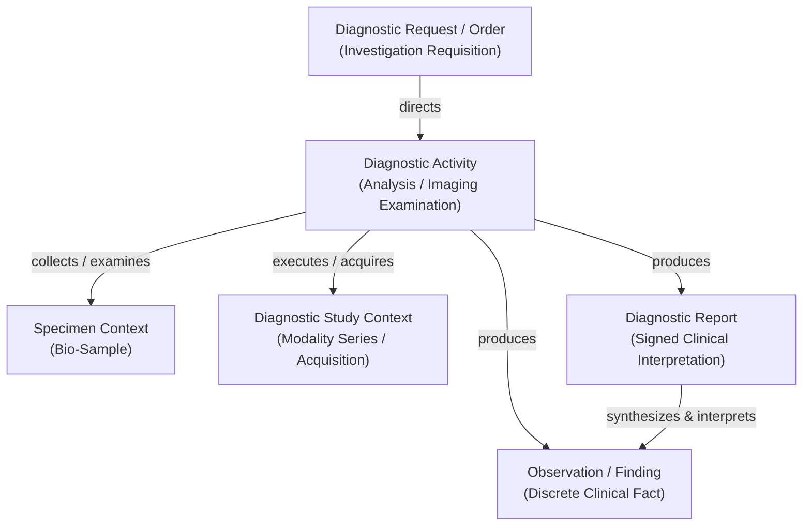

#### Diagram 5: Medication Order / Dispense / Administration / Statement
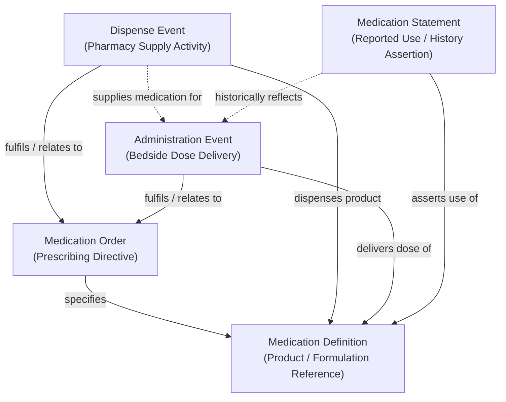

#### Diagram 6: Procedure Definition / Activity / Outcome / Documentation
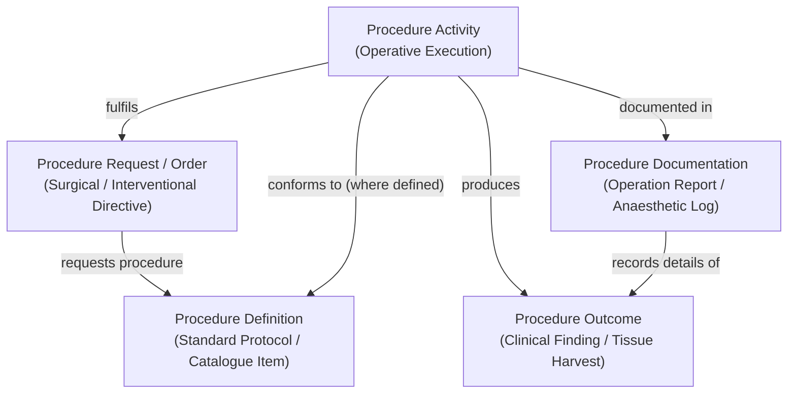

#### Diagram 7: Condition / Problem / Care Need
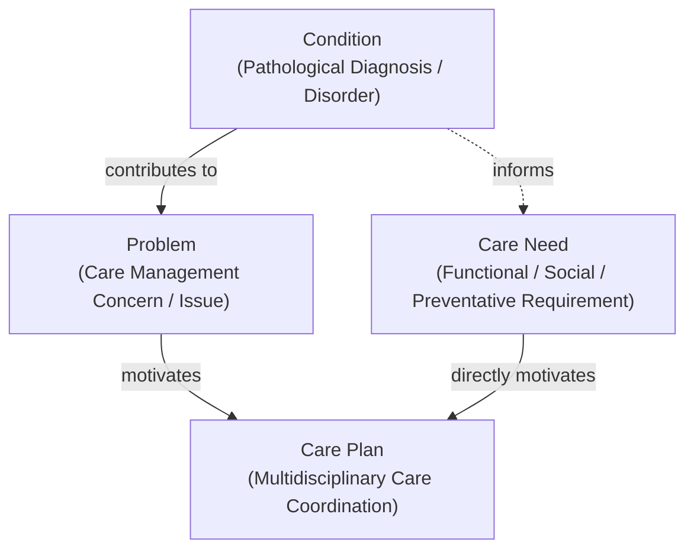

#### Diagram 8: Care Plan / Goal / Activity / Outcome
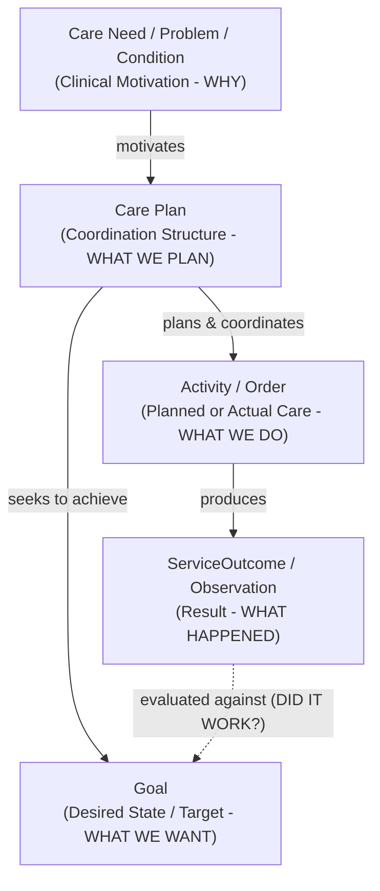

#### Diagram 9: Clinical Document vs. Clinical Fact
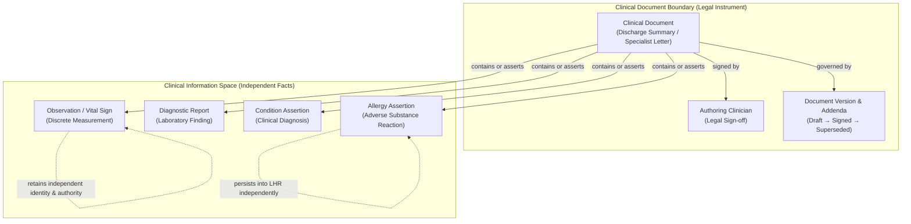

#### Diagram 10: Cross-Family Clinical / Service Semantic Context
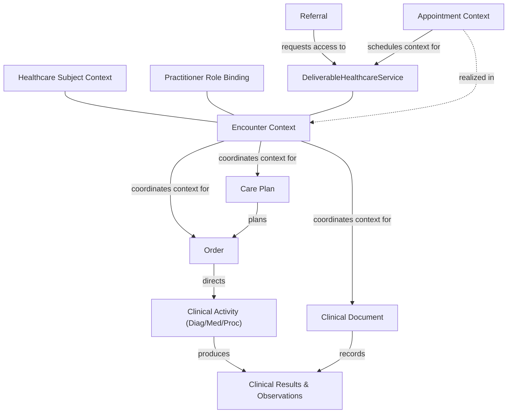

---

### File Structure & Documentation Artifacts

The planned documentation structure for Domain 04 Package 2 is as follows:

```text
docs/markdown/04-information-architecture/
├── README.md                                         # MODIFIED: Updated domain roadmap & Package 2 index
└── information-families/
    ├── README.md                                     # MODIFIED: Navigation update for Package 2 families
    ├── person-healthcare-subject.md                  # UNTOUCHED (Package 1)
    ├── practitioner.md                               # UNTOUCHED (Package 1)
    ├── organisation.md                               # UNTOUCHED (Package 1)
    ├── healthcare-location.md                        # UNTOUCHED (Package 1)
    ├── healthcare-service.md                         # UNTOUCHED (Package 1)
    ├── device.md                                     # UNTOUCHED (Package 1)
    ├── referral.md                                   # NEW: Referral Information Family
    ├── appointment-scheduling.md                     # NEW: Appointment / Scheduling Context
    ├── episode-encounter.md                          # NEW: Episode & Encounter Information Family
    ├── order.md                                      # NEW: Order Information Family
    ├── diagnostics.md                                # NEW: Diagnostic Information Family
    ├── medication.md                                 # NEW: Medication Information Family
    ├── procedure.md                                  # NEW: Procedure Information Family
    ├── clinical-document.md                          # NEW: Clinical Document Information Family
    ├── problem-condition-care-need.md                # NEW: Problem / Condition / Care Need Family
    ├── care-plan.md                                  # NEW: Goal / Care Plan Information Family
    └── clinical-communication.md                     # NEW: Clinical Communication Family

.junie/reports/
└── 2026-10-07-domain04-clinical-service-administration-information-families.md # NEW: Authoritative Completion Report
```

# Testing

### Validation Approach

Because Domain 04 establishes conceptual Information Architecture models, validation focuses on semantic consistency, structural integrity, upward traceability, and strict adherence to the 16 canonical Information Architecture Guardrails.

The validation strategy employs a multi-layered verification framework:
1. **Traceability Verification**: Cross-checking all established concepts, responsibilities, and processes against the frozen Domain 03 Business Architecture.
2. **Boundary & Non-Equivalence Verification**: Formally validating that the 13 foundational non-equivalences are explicitly upheld across all documentation.
3. **Diagrammatic Syntax & Semantic Consistency**: Ensuring all Mermaid diagrams compile cleanly and depict only conceptual entities without technical leakage.
4. **Guardrail Conformance Review**: Systematically verifying that no implementation classes, database schemas, FHIR resources, or API payloads have contaminated the conceptual definitions.
5. **Frozen Baseline Protection**: Confirming zero modifications to Domains 01–03, the Domain 04 Foundation, and Package 1 semantics.

---

### Key Verification Scenarios

#### Scenario 1: Closed-Loop Order vs. Result Separation
- **Target**: `order.md` and `diagnostics.md`
- **Assertion**: An `Order` tracks requisition progression (*Placed* $\to$ *Closed*) but does NOT own the resulting `Observation / Finding` or `Diagnostic Report`. Cancelling an order updates order state without invalidating already-published diagnostic findings.
- **Pass Criteria**: `Order` and `Diagnostic Report` have distinct identities, distinct owning capabilities (`L1: Order Administration` vs. performing diagnostic capability), and distinct lifecycles.

#### Scenario 2: Encounter Spine Non-Ownership
- **Target**: `episode-encounter.md`
- **Assertion**: An `Encounter` provides temporal and clinical context for care, but does NOT act as an aggregate owner of orders, medications, or documents created during the stay.
- **Pass Criteria**: Document clearly asserts that clinical facts retain independent identity, authority, and provenance when the encounter transitions to *Discharged* or *Completed*.

#### Scenario 3: Medication Timeline Independence
- **Target**: `medication.md`
- **Assertion**: `Medication Order`, `Dispense Event`, `Administration Event`, and `Medication Statement` operate as independent concepts with distinct authorities (Doctor, Pharmacist, Nurse, Patient).
- **Pass Criteria**: The model explicitly accommodates emergency bedside administrations performed without an electronic order, and recognizes that a dispense record does not prove patient ingestion.

#### Scenario 4: Clinical Document vs. Clinical Fact Demarcation
- **Target**: `clinical-document.md`
- **Assertion**: A `Clinical Document` is a versioned legal instrument. Marking a document *Superseded* or *Entered-in-Error* does not destructively delete or alter the discrete observations asserted within it.
- **Pass Criteria**: Clear architectural separation between the document artifact lifecycle and the persistence/validity of constituent clinical facts in the longitudinal record.

#### Scenario 5: Non-Pathological Care Need First-Class Support
- **Target**: `problem-condition-care-need.md`
- **Assertion**: `Care Need` is not an artificial subclass of `Condition` or `Problem`. A care plan or service delivery can be directly motivated by a functional or social care need without an acute disease diagnosis.
- **Pass Criteria**: The relationship graph demonstrates direct care plan and service motivation from `Care Need` without requiring a pathological `Condition` intermediary.

#### Scenario 6: External Scheduling Authority Preservation
- **Target**: `appointment-scheduling.md`
- **Assertion**: Harmonia synchronizes and coordinates appointment milestones without claiming authoritative ownership over external PAS scheduling engines.
- **Pass Criteria**: Information responsibility is classified as `Appointment Synchronisation State`, with originating scheduling authority explicitly assigned to external host platforms.

#### Scenario 7: Clinical Communication Gating
- **Target**: `clinical-communication.md`
- **Assertion**: Information exchanged in transit does not automatically contaminate the authoritative patient record without explicit clinical verification or governed incorporation.
- **Pass Criteria**: Explicit semantic boundary defined separating `Clinical Communication` from `Patient Clinical Record`.

---

### Edge Cases & Architectural Risks

- **Risk: Premature FHIR Mapping Leakage**
  - *Mitigation*: Strictly review all 11 documents to ensure no FHIR resource names (`Observation`, `DiagnosticReport`, `MedicationRequest`, `CarePlan`, `Encounter`) are used as justifications for domain concepts. Emphasize that FHIR is an interchange standard handled downstream by Pylai.
- **Risk: Binary Simplification of Service Delivery Context**
  - *Mitigation*: Ensure multi-party clinical interactions (e.g., attending doctor, performing resident, delivering facility, patient) use reified `Information Relationships` with explicit roles rather than disconnected foreign keys.
- **Risk: Conflation of Technical Transport ACKs with Business Delivery ACKs**
  - *Mitigation*: In `order.md` and `clinical-communication.md`, explicitly separate network-level delivery receipts (e.g. MLLP commit, HTTP 200) from clinician/system business acceptance and filing into the medical record.

---

### Conformance Checklist for Completion Report

The completion report at `.junie/reports/2026-10-07-domain04-clinical-service-administration-information-families.md` will formally verify:
- [x] All 11 Package 2 Information Family files created under `docs/markdown/04-information-architecture/information-families/`.
- [x] All 13 non-equivalences explicitly documented and upheld.
- [x] 10 Mermaid conceptual diagrams validated for syntax and semantic compliance.
- [x] Upward traceability to Domain 03 Business Information Responsibilities and Processes established for every concept.
- [x] Clear demarcation between owned/managed concepts and referenced/external/contextual concepts.
- [x] Definition-to-Accountability pattern evaluated across all 11 families.
- [x] Navigation-only updates applied to `information-families/README.md` and `04-information-architecture/README.md`.
- [x] Zero modifications made to Domains 01, 02, or 03.
- [x] Zero modifications made to the frozen Domain 04 Foundation.
- [x] Zero semantic modifications made to Domain 04 Package 1.
- [x] Zero downstream implementation, class, database, or FHIR architecture introduced.

# Delivery Steps

###   Step 1: Establish Service Access, Scheduling, and Care Episode Context Families
Clinical referral, external scheduling synchronization, and encounter context concepts are fully defined with clear boundaries and independent lifecycles.

- Author `docs/markdown/04-information-architecture/information-families/referral.md` establishing `Referral`, `Referral Identity`, `Referrer`, `Intended Service / Recipient`, `Reason / Intent`, `Supporting Context`, `Referral State`, `Disposition`, and `Referral Outcome`, tracing directly to `L1: Referral Administration`, `Referral Master & Triage Ledger`, and the `Referral Progression Process`.
- Enforce the fundamental non-equivalences: `Referral ≠ Order` (care responsibility transfer vs. bounded task execution), `Referral ≠ Service Delivery`, and `Referral State ≠ Service Delivery State ≠ Service Outcome`.
- Author `docs/markdown/04-information-architecture/information-families/appointment-scheduling.md` establishing `Appointment / Scheduled Service Context`, `Appointment Identity`, bound `DeliverableHealthcareService`, `Participants`, `Healthcare Location`, `Scheduled Time / Period`, `Appointment State`, and `Scheduling Authority`, tracing to `L1: Scheduling Administration` and `Appointment Synchronisation State`.
- Preserve the external scheduling authority guardrail: Harmonia synchronizes and coordinates appointment milestones without usurping host PAS or departmental scheduling engine authority (`Appointment ≠ Encounter ≠ HealthcareServiceDelivery`).
- Author `docs/markdown/04-information-architecture/information-families/episode-encounter.md` establishing `Encounter`, `Episode Context`, `Encounter Classification`, attending `Practitioner Role Binding`, bound `DeliverableHealthcareService`, care-place movements, and encounter state progression, tracing to `L1: Episode & Encounter Administration`, `Encounter Master & Movement Ledger`, and the `Encounter Lifecycle Process`.
- Enforce the non-ownership spinal invariant: `Encounter Context` acts as an operational and clinical spine but SHALL NOT own the semantic identity, authority, provenance, or lifecycle of associated orders, observations, medications, procedures, or documents.
- Model the qualified relationship `Episode Context relates-to Encounter [0..*]` and distinguish transactional encounters from longitudinal health record synthesis.

###   Step 2: Establish Actionable Request and Clinical Activity Execution Families
Closed-loop clinical orders, diagnostic investigation networks, medication event timelines, and procedure activities are formally modeled with explicit authority demarcations.

- Author `docs/markdown/04-information-architecture/information-families/order.md` establishing `Order`, `Order Identity`, `Requester`, requested activity (`DeliverableHealthcareService` or `Actionable Activity`), destination/performer routing, closed-loop states, and outcome associations, tracing to `L1: Order Administration`, `Clinical Order & Closed-Loop Matrix`, and the `Closed-Loop Order Progression Process`.
- Enforce the core invariant: `Order ≠ HealthcareService ≠ HealthcareServiceDelivery ≠ Clinical Result`, establishing that orders direct and track activity without acquiring ownership over resulting clinical observations or reports, and distinguishing transport technical receipts from business delivery acknowledgements.
- Author `docs/markdown/04-information-architecture/information-families/diagnostics.md` establishing `Diagnostic Request / Order`, `Diagnostic Activity`, `Specimen Context`, `Diagnostic Study Context`, `Observation / Finding`, `Diagnostic Report`, and accession correlation links, tracing to `L1: Diagnostic Administration` and `Diagnostic Correlation & Linkage Registry`.
- Guarantee that diagnostic requests, activities, observations, findings, and diagnostic reports remain distinct information concepts, preserving the originating diagnostic authority of performing LIS/RIS providers while Harmonia governs correlation and longitudinal indexing.
- Author `docs/markdown/04-information-architecture/information-families/medication.md` establishing reusable `Medication Definition / Reference`, `Medication Order`, `Dispense Event`, `Administration Event`, and `Medication Statement / History`, tracing to `L1: Medication Administration` and `Medication Event Timeline Matrix`.
- Enforce the multi-concept separation: `Medication Order ≠ Dispense Event ≠ Administration Event ≠ Medication Statement / History`, capturing distinct originating authorities (prescriber, dispensing pharmacist, administering nurse, patient informant) and recognizing that administration does not require a prior Harmonia-visible order.
- Author `docs/markdown/04-information-architecture/information-families/procedure.md` establishing `Procedure Definition / Type` (where reusable specifications exist), `Procedure Activity`, `Procedure Request / Order`, `Procedure Outcome`, and `Procedure Documentation`, tracing to `L1: Procedure Administration`, `Procedure Request & Documentation Index`, and `Theatre Operations`.
- Demarcate `Procedure Definition ≠ Procedure Activity ≠ Procedure Outcome ≠ Procedure Documentation`, and distinguish procedural interventions from generic healthcare service delivery.

###   Step 3: Establish Clinical Documentation, Evaluative State, and Care Coordination Families
Clinical documents, health conditions, care problems, non-pathology care needs, shared care plans, and clinical communications are modeled with strict semantic boundaries.

- Author `docs/markdown/04-information-architecture/information-families/clinical-document.md` establishing `Clinical Document`, `Document Identity`, `Author / Authorship`, `Document Type`, `Effective Time`, `Version`, `Provenance`, and legal lifecycle states, tracing to `L1: Clinical Record Administration`, `Clinical Document Registry & Lifecycle State`, and the `Clinical Document Lifecycle Process`.
- Enforce the critical axiom: `Clinical Document ≠ Clinical Fact`, ensuring that document containers do not usurp the semantic identity, authority, or lifecycle of individual clinical observations or assertions contained within them.
- Author `docs/markdown/04-information-architecture/information-families/problem-condition-care-need.md` establishing distinct concepts for `Condition` (pathological/clinical diagnosis), `Problem` (identified clinical or care-management concern), and `Care Need` (functional, preventative, or social support requirement), tracing to `Patient Clinical Record` and care enablement contexts.
- Enforce the non-hierarchical semantic boundary: `Condition ≠ Problem ≠ Care Need`, preventing artificial inheritance hierarchies and ensuring that non-pathology care needs directly motivate care delivery without requiring pathological intermediaries.
- Author `docs/markdown/04-information-architecture/information-families/care-plan.md` establishing `CarePlan`, `Goal` (desired target state/outcome), planned activities, enrolled care team participants, and plan progression milestones, tracing to `L1: Care Plan Administration` and `Shared Care Plan & Clinical Goal Registry`.
- Formalize the coordination backbone (`WHY` → `WHAT DO WE WANT?` → `WHAT DO WE PLAN?` → `WHAT DID WE DO?` → `WHAT HAPPENED?` → `DID IT WORK?`), strictly enforcing `Goal ≠ Outcome` and `Care Plan ≠ Activity`, ensuring that referencing prior or planned activities transfers zero ownership to the care plan.
- Author `docs/markdown/04-information-architecture/information-families/clinical-communication.md` establishing `Clinical Communication`, `Communication Identity`, `Sender`, `Recipient(s)`, clinical context, `Delivery State`, business acknowledgements, and transaction audit trails, tracing to `L1: Clinical Communication Administration` and `Clinical Message Dispatch & Audit Register`.
- Enforce the boundary `Clinical Communication ≠ Clinical Record`, requiring explicit governed acceptance, clinical qualification, or verification before communicated content enters the authoritative patient clinical record.

###   Step 4: Synthesize Cross-Family Semantic Consistency, Update Navigation, and Compile the Completion Report
All cross-family invariants are validated, documentation navigation is aligned, and the comprehensive completion report is produced.

- Execute a rigorous cross-family semantic review asserting all 13 core non-equivalences: `Referral ≠ Order`, `Referral ≠ Appointment`, `Appointment ≠ Encounter`, `Encounter ≠ HealthcareServiceDelivery`, `Order ≠ Result`, `Diagnostic Activity ≠ Diagnostic Report`, `Medication Order ≠ Dispense ≠ Administration`, `Procedure Activity ≠ Procedure Documentation`, `Clinical Document ≠ Clinical Fact`, `Condition ≠ Problem ≠ Care Need`, `Goal ≠ Outcome`, `Care Plan ≠ Activity`, and `Clinical Communication ≠ Clinical Record`.
- Evaluate the Definition-to-Accountability pattern across all 11 families, documenting where the 5-stage progression applies naturally and where it is semantically inapplicable.
- Verify that every family contains high-clarity Mermaid conceptual diagrams adhering to the 10 required visual semantic specifications without introducing FHIR, class, API, or database constructs.
- Update `docs/markdown/04-information-architecture/information-families/README.md` and `docs/markdown/04-information-architecture/README.md` with navigation links, family overviews, and metamodel alignments for Package 2.
- Generate the authoritative completion report at `.junie/reports/2026-10-07-domain04-clinical-service-administration-information-families.md` confirming zero modifications to Domains 01–03, zero modifications to the frozen Domain 04 Foundation, zero semantic alterations to Package 1, and complete adherence to all 16 Information Architecture guardrails.