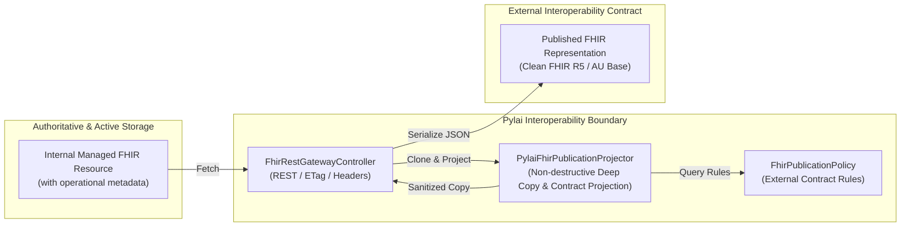

# Requirements

### Overview & Goals
Resolve **MAT-03** from the Harmonia Architectural Axiom Conformance Assessment by enforcing the **Pylai External FHIR Publication Boundary** (conforming to **AX-05 Information Authority & Lifecycle** and **AX-13 Egress & Publication Boundary**).

Harmonia internally manages FHIR representations with operational metadata required for governance, authority, concurrency, resilience, and provenance. However, external interoperability contracts require that Harmonia-private operational semantics do not leak across the system boundary. Pylai is the interoperability membrane responsible for constructing externally publishable FHIR representations governed by an explicit **interoperability publication contract** rather than exposing or destructively altering the internally managed representations.

### Scope
- **In Scope**:
  - Implement a dedicated, fail-closed, non-destructive publication boundary projector (`PylaiFhirPublicationProjector`) and contract policy (`FhirPublicationPolicy`) in `pylai-fhir-registry`.
  - Define publication permission based on an explicit **external interoperability contract** (permitting standard FHIR core, jurisdictional/IG extensions, and contract-approved interoperability metadata while excluding Harmonia operational mechanics).
  - Enforce publication projection on all Pylai FHIR REST managed-resource egress paths:
    - FHIR `READ` (`GET /{resourceType}/{id}`);
    - FHIR `SEARCH` (`GET /{resourceType}`) returning `Bundle`;
    - FHIR `CREATE`/`UPDATE` change request responses returning `Task` (HTTP 202 Accepted);
    - FHIR `Task` status polling (`GET /Task/{id}`).
  - Strip Harmonia-private operational metadata and extensions (authoritative persistence versioning, Mneme active-state tokens, Praxis execution identifiers, internal checkpoints, transient security context markers).
  - Filter `meta.security` to retain contract-permitted clinical confidentiality/security labels (e.g., HL7 v3 Confidentiality) while stripping Harmonia operational security labels (`http://harmonia.fhirfactory.net/security/*`).
  - Rely on generic, recursive element-level extension filtering to remove operational metadata across all resources (including `Task`) without ad-hoc resource-type switching.
  - Document the scope of synthetic/gateway-generated responses (`CapabilityStatement`, `OperationOutcome`).
  - Add comprehensive unit, web-layer integration, and ArchUnit architecture tests demonstrating contract-driven publication rules.

- **Out of Scope**:
  - Modifying internal persistence schemas or JPA entities in `mnemosyne-clinical` / `mnemosyne-operations`.
  - Redesigning Mneme active-state caching or Pragma envelope structures.
  - Creating new Architecture Decision Records (ADRs).

### Functional Requirements
1. **Contract-Driven Publication**: Publishability is defined by explicit contract rules rather than mere URI namespace ownership. Elements, extensions, profiles, and security tags are emitted only if permitted by the applicable external interoperability contract.
2. **Non-Destructive Projection**: Publication projection must never mutate the in-memory or persisted source resource returned from Mneme/Mnemosyne. A deep copy must be projected for serialization.
3. **Fail-Closed Filtering**: Any extension or metadata not explicitly permitted by the active publication contract must be excluded by default.
4. **Semantically-Private Operational Metadata Exclusion**: Known Harmonia operational metadata (authoritative state markers, Mneme coordination tokens, Praxis IDs, checkpoint extensions, operational security labels) must be stripped across all resource types.
5. **Legitimate Interoperability Extension Retention**: Extensions permitted by the external contract (e.g., FHIR core extensions, AU Base / AU Core extensions, explicitly approved third-party or Harmonia interoperability extensions) must be preserved.
6. **Clinical Security Label Preservation**: Clinical confidentiality tags (`meta.security`) defined in the contract (e.g., HL7 v3 `http://terminology.hl7.org/CodeSystem/v3-Confidentiality`) must remain intact; operational security tags must be stripped.
7. **Preservation of Standard FHIR Semantics**: `meta.versionId`, `meta.lastUpdated`, `meta.profile`, HTTP `ETag`, and `Last-Modified` headers must be preserved according to FHIR REST standards.
8. **Searchset Bundle Entry Projection**: When a Searchset Bundle is emitted, every resource inside `entry.resource` must be projected according to the publication contract.

### Non-Functional Requirements
- **Performance**: High-efficiency deep copying and traversal using HAPI FHIR native facilities with minimal allocation overhead.
- **Security**: Default-deny / fail-closed publication boundary preventing accidental PHI or infrastructure metadata leakage (Invariant 9).
- **Architectural Conformance**: Full compliance with Harmonia Architectural Axioms (AX-04, AX-05, AX-13) and AGENTS.md Invariant 9.

# Technical Design

### Current Implementation
In the current implementation:
- `FhirRestGatewayController` in `pylai-fhir-registry` handles external REST calls (`readResource`, `searchResources`, `createResource`, `updateResource`, `getTaskStatus`).
- Resources fetched from `FhirStorageService` or generated from `PragmaCacheService` via `PragmaFhirConverter.toFhirTask(...)` are serialized directly using `fhirContext.newJsonParser().encodeResourceToString(...)`.
- This causes internal operational metadata to leak across the external boundary:
  - `meta.security` entries carrying `http://harmonia.fhirfactory.net/security/labels` (`PROVIDER_REGISTRY`, `INTERNAL`).
  - Task resources carrying operational extensions (`http://fhirfactory.net/harmonia/task/security/*`, `.../checkpoint*`, `.../praxis-id`, `.../metadata/*`).
  - Internal versioning/authoritative metadata on `meta.extension`.

### HAPI-Native Capability Assessment
Before designing custom filtering machinery, HAPI FHIR facilities were evaluated:
1. **Resource Deep Copying**: HAPI's `Resource.copy()` provides native deep copying of the full in-memory AST / object graph for any FHIR R5 resource (`IBaseResource`). Reusing `Resource.copy()` ensures the managed source instance in Mneme/Mnemosyne memory is never modified.
2. **Extension & Element Traversal**: HAPI FHIR models implement `IBaseHasExtensions` and `IBaseElement`. Recursive traversal of `Resource.getExtension()` and child `Element.getExtension()` allows clean inspection and removal of unapproved extensions without custom JSON string parsing.
3. **Response Interceptor Processing**: HAPI FHIR server interceptors (`IServerInterceptor`, `@Hook(Pointcut.SERVER_OUTGOING_RESPONSE)`) were evaluated. However, Pylai FHIR Registry is structured as a Spring Boot application using Spring MVC `@RestController` (`FhirRestGatewayController`) rather than a standalone HAPI `RestfulServer` servlet. In this Spring-native architecture, injecting a dedicated `PylaiFhirPublicationProjector` directly into the gateway controller provides an explicit, testable publication choke point that enforces AX-13 while utilizing HAPI's `Resource.copy()` and serialization machinery.
4. **Serialization**: HAPI `FhirContext.newJsonParser().encodeResourceToString(...)` handles standard-compliant JSON serialization.
5. **Bundle Traversal**: HAPI's `Bundle.getEntry()` / `BundleEntryComponent` provides native traversal and projection of constituent resources in searchsets.
6. **Response Metadata**: HTTP `ETag` and `Last-Modified` headers derive directly from HAPI's `meta.versionId` and `meta.lastUpdated`.

### Generated Response Scope Analysis
- **`CapabilityStatement`**: Generated purely on-the-fly by `CapabilityStatementProvider.buildCapabilityStatement()` from static structural definitions of supported interactions and search parameters. It contains no managed clinical resource state, no Mneme/Mnemosyne cache entries, and no Harmonia operational metadata.
- **`OperationOutcome`**: Generated on-the-fly by `FhirGatewayExceptionHandler` for HTTP error responses (400, 401, 403, 404, 410, 422). It contains only standard FHIR `IssueSeverity`, `IssueType`, and diagnostic error messages.
- **Scope Boundary**: Neither `CapabilityStatement` nor `OperationOutcome` contain Harmonia-managed resource state or operational metadata. Therefore, they do not require routing through the managed-resource publication projector. The publication projector is strictly applied to managed resources and change-request Task representations emitted via READ, SEARCH, CREATE, UPDATE, and Task polling.

### Key Decisions
1. **Contract-Driven Publication Policy (`FhirPublicationPolicy`)**:
   - *Decision*: Model publication rules via `FhirPublicationPolicy` representing an explicit interoperability contract, rather than a hard-coded namespace allowlist.
   - *Rationale*: A publication contract defines what is permitted by the external agreement. An extension, profile, or security tag is published only if permitted by the contract. This supports standard FHIR core (`http://hl7.org/fhir/*`), Australian jurisdictional extensions (`http://hl7.org.au/fhir/*`), contract-approved third-party extensions, and contract-approved Harmonia interoperability extensions, while excluding unknown and internal operational extensions.
2. **Contract-Driven Security Label Evaluation**:
   - *Decision*: `FhirPublicationPolicy.isSecurityLabelPermitted(Coding)` checks coding system and values against contract permissions (e.g. permitting HL7 v3 `http://terminology.hl7.org/CodeSystem/v3-Confidentiality` codes `N`, `R`, `V`, `U`, while rejecting Harmonia operational security labels `http://harmonia.fhirfactory.net/security/*`).
   - *Rationale*: Evaluates security metadata semantically rather than assuming all HL7 labels are good and all custom labels are bad.
3. **Generic Recursive Projection (Minimising Resource-Specific Logic)**:
   - *Decision*: Implement a single, generic publication projection mechanism that traverses `meta` and all `Element` extensions recursively.
   - *Rationale*: Generic contract-driven extension filtering already excludes internal operational metadata (`praxis-id`, `checkpoint*`, security parameters) on `Task` and any other resource type without needing custom procedural resource switches (`instanceof Task`).
4. **HAPI-Native Deep Cloning**:
   - *Decision*: Use HAPI FHIR `Resource.copy()` to generate an independent in-memory copy before applying publication transformations.
   - *Rationale*: Guarantees source resources in Mneme cache and Mnemosyne persistence are never mutated.

### Architecture Diagram

### Proposed Changes & Component Details

#### 1. `net.fhirfactory.harmonia.pylai.fhir.publication.FhirPublicationPolicy`
Defines the external publication contract:
- `isExtensionPermitted(String url)`: Returns `true` if the extension URL is explicitly permitted by the active contract (e.g. FHIR core, AU Base/Core, permitted third-party/Harmonia interoperability extensions). Returns `false` for unknown or operational extensions.
- `isSecurityLabelPermitted(Coding coding)`: Returns `true` if the security coding system and code represent contract-approved clinical security/confidentiality metadata; returns `false` for Harmonia operational security tags.
- `isProfilePermitted(String profileUrl)`: Evaluates conformance profiles against the contract.
- Provides default contract configuration for FHIR R5 / AU Base interoperability.

#### 2. `net.fhirfactory.harmonia.pylai.fhir.publication.PylaiFhirPublicationProjector`
Core projection service:
- `projectForPublication(IBaseResource source)`: Non-destructively projects resources for external egress.
  - If `source instanceof Bundle`: invokes `projectBundle((Bundle) source)`.
  - If `source instanceof Resource`: invokes `projectResource((Resource) source)`.
- `projectResource(Resource source)`:
  - Calls `source.copy()` to produce an isolated in-memory deep clone.
  - Sanitizes `meta`: retains `versionId`, `lastUpdated`, `profile` (filtered), `tag`; filters `meta.extension` and `meta.security` using `FhirPublicationPolicy`.
  - Recursively cleans extensions on the resource root and all child `Element` nodes against `FhirPublicationPolicy`.
- `projectBundle(Bundle sourceBundle)`:
  - Calls `sourceBundle.copy()`.
  - Iterates over `bundle.getEntry()`, projecting each constituent `entry.getResource()`.

#### 3. `net.fhirfactory.harmonia.pylai.fhir.controller.FhirRestGatewayController`
- Injects `PylaiFhirPublicationProjector`.
- In `readResource`: projects the fetched resource before serialization.
- In `searchResources`: projects the constructed search `Bundle` before serialization.
- In `createResource` / `updateResource`: projects the returned `Task` before serialization.
- In `getTaskStatus`: projects the retrieved `Task` before serialization.
- Preserves HTTP `ETag` and `Last-Modified` derived from resource metadata.

### File Structure Changes
- **New Files**:
  - `pylai/pylai-fhir-registry/src/main/java/net/fhirfactory/harmonia/pylai/fhir/publication/FhirPublicationPolicy.java`
  - `pylai/pylai-fhir-registry/src/main/java/net/fhirfactory/harmonia/pylai/fhir/publication/PylaiFhirPublicationProjector.java`
  - `pylai/pylai-fhir-registry/src/test/java/net/fhirfactory/harmonia/pylai/fhir/publication/PylaiFhirPublicationProjectorTest.java`
  - `paradeigma/paradeigma-test/src/test/java/net/fhirfactory/harmonia/paradeigma/test/arch/PylaiPublicationBoundaryArchitectureTest.java`
- **Modified Files**:
  - `pylai/pylai-fhir-registry/src/main/java/net/fhirfactory/harmonia/pylai/fhir/controller/FhirRestGatewayController.java`
  - `pylai/pylai-fhir-registry/src/test/java/net/fhirfactory/harmonia/pylai/fhir/controller/FhirRestGatewayControllerTest.java`

# Testing

### Validation Approach
Automated tests will validate the publication boundary at unit, controller integration, end-to-end, and architectural rule levels, proving that publication is contract-driven rather than merely namespace-driven.

### Key Scenarios
1. **Contract-Driven Extension Filtering**:
   - Known Harmonia-private operational extension (e.g. `http://harmonia.fhirfactory.net/structure/authoritative-version`, `http://fhirfactory.net/harmonia/task/praxis-id`) -> **excluded**.
   - Explicitly permitted standard extension (e.g. `http://hl7.org/fhir/StructureDefinition/patient-birthPlace`) -> **retained**.
   - Explicitly permitted AU jurisdictional extension (e.g. `http://hl7.org.au/fhir/StructureDefinition/au-practitioner-role-code`) -> **retained**.
   - Explicitly permitted non-HL7 third-party extension configured in contract -> **retained**.
   - Explicitly permitted Harmonia-authored interoperability extension configured in contract -> **retained**.
   - Unknown / unapproved extension -> **excluded** (fail-closed).
2. **Contract-Driven Security Label Filtering**:
   - Permitted clinical security label (e.g. HL7 v3 `http://terminology.hl7.org/CodeSystem/v3-Confidentiality` code `R`) in `meta.security` -> **retained**.
   - Harmonia operational security label (e.g. `http://harmonia.fhirfactory.net/security/labels` code `INTERNAL`) in `meta.security` -> **excluded**.
3. **Non-Destructive Projection**:
   - Verify that projecting an internal `Practitioner` or `Task` resource does not modify the source instance in any way (the source retains its original `meta.security`, internal extensions, and elements in memory/cache).
4. **Generic Task Projection**:
   - Verify that Task change submission responses and polling responses are cleansed of internal execution context (`praxis-id`, `checkpoint*`, security markers) via generic recursive extension filtering without breaking standard FHIR Task attributes (status, intent, for, execution period, output).
5. **REST Gateway Ingress/Egress Flows**:
   - `GET /Practitioner/{id}` returns the projected resource without internal metadata.
   - `GET /Practitioner?name=...` returns a searchset `Bundle` where all constituent entries are projected.
   - `POST /Practitioner` (202 Accepted) and `GET /Task/{id}` return projected `Task` resources without internal operational context.
   - HTTP caching and concurrency headers (`ETag`, `Last-Modified`) continue to derive correctly from `meta.versionId` and `meta.lastUpdated`.

### Architectural Invariant Validation
- `PylaiPublicationBoundaryArchitectureTest`: ArchUnit test enforcing that Pylai is the sole external publication membrane and complies with AX-05 and AX-13.
- `ProviderRegistryCrossCapabilityE2ETest`: Cross-capability test passing with end-to-end assurance.

# Delivery Steps

### ✓ Step 1: implement-pylai-fhir-publication-projector
Implement the contract-driven publication boundary projector and policy in `pylai-fhir-registry` to project internally managed FHIR resources into clean external representations without modifying the source instance.

- Create `FhirPublicationPolicy` in package `net.fhirfactory.harmonia.pylai.fhir.publication` defining the external interoperability contract (contract-based extension rules, clinical security label validation, and conformance profile filtering).
- Create `PylaiFhirPublicationProjector` in package `net.fhirfactory.harmonia.pylai.fhir.publication`.
- Implement non-destructive deep cloning using HAPI FHIR `Resource.copy()` so source resources in Mneme/Mnemosyne memory/cache remain untouched.
- Implement generic recursive extension filtering across all resource elements using `FhirPublicationPolicy` (fail-closed: standard FHIR, AU Base, approved third-party and Harmonia interoperability extensions retained; Harmonia-private operational and unknown extensions excluded).
- Implement `meta.security` filtering via `FhirPublicationPolicy`: preserve standard clinical confidentiality codes (`http://terminology.hl7.org/CodeSystem/v3-Confidentiality`) while stripping Harmonia operational security labels (`http://harmonia.fhirfactory.net/security/*`).
- Implement Bundle projection: recursively project each constituent resource within a `Bundle` (e.g., searchset, collection).
- Add comprehensive unit tests in `PylaiFhirPublicationProjectorTest` covering contract semantics (operational excluded, standard/AU/third-party/Harmonia-contract retained, unknown excluded, clinical security retained, non-mutation verified).

### ✓ Step 2: integrate-publication-projector-into-pylai-rest-gateway
Integrate the publication projector into the Pylai FHIR REST gateway controller so all external HTTP egress paths for managed resources are governed by the publication boundary.

- Update `FhirRestGatewayController` to inject `PylaiFhirPublicationProjector`.
- Route single-resource READ responses (`GET /Practitioner/{id}`, `GET /fhir/Practitioner/{id}`) through `publicationProjector.projectForPublication(...)` before serialization.
- Route multi-resource SEARCH responses (`GET /Practitioner`, `GET /fhir/Practitioner`) through `publicationProjector.projectForPublication(...)` for the entire response Bundle before serialization.
- Route asynchronous change submission responses (`POST /Practitioner`, `PUT /Practitioner/{id}`) returning FHIR `Task` representations through the publication projector.
- Route task polling responses (`GET /Task/{id}`, `GET /fhir/Task/{id}`) through the publication projector.
- Ensure HTTP caching and concurrency headers (`ETag`, `Last-Modified`) continue to derive correctly from `meta.versionId` and `meta.lastUpdated`.
- Document why purely synthetic responses (`CapabilityStatement`, `OperationOutcome`) do not contain managed metadata and do not require managed-resource projection.
- Update `FhirRestGatewayControllerTest` with web-layer tests verifying that external responses contain zero Harmonia-private metadata while preserving standard metadata and HTTP headers.

### ✓ Step 3: add-architecture-tests-and-verify-e2e-suite
Add repository-level architectural invariants and verify end-to-end regression suites across all modules.

- Add `PylaiPublicationBoundaryArchitectureTest` in `paradeigma-test` enforcing Pylai external publication encapsulation and AX-13 conformance.
- Verify end-to-end scenario tests in `ProviderRegistryCrossCapabilityE2ETest` to ensure full integration with Themis security evaluation, Ergon execution, and Mnemosyne storage.
- Execute the full ArchUnit architecture test suite (`mvn test -pl paradeigma/paradeigma-test -am -Dtest="*ArchitectureTest"`).
- Execute all tests across `pylai-fhir-registry` and dependent submodules to guarantee regression-free delivery.