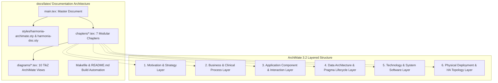

# Requirements

### Overview & Goals
The goal is to create a comprehensive, production-grade, modular LaTeX and TikZ documentation package for the entire **Harmonia** Health Information Exchange (HIE) platform located in `docs/latex/`. The documentation will be structured strictly around **ArchiMate 3.2** concepts, layers, and visual modeling terminology.

This provides an authoritative, publication-ready architectural specification for architects, engineers, healthcare interoperability specialists, and operations teams, complete with modular chapter files and high-fidelity TikZ vector architecture diagrams.

### Scope
#### In Scope
- **Directory Structure**: Create a dedicated `docs/latex/` directory with organized subdirectories (`chapters/`, `diagrams/`, `styles/`).
- **ArchiMate TikZ Styling Package**: Create a standalone TikZ style package (`harmonia-archimate.sty`) defining standard ArchiMate element shapes, color palettes across all layers, stereotyped badges, and formal relationship connectors (Composition, Aggregation, Assignment, Realization, Serving, Access, Flow, Triggering, Association).
- **Comprehensive Document Modules**:
  1. *Executive Summary & ArchiMate Foundation*: Architecture framework overview, Greek domain terminology, viewpoint catalog, and notation legend.
  2. *Motivation & Strategy Architecture*: Stakeholders, drivers, goals, principles, requirements, capabilities, and value streams for healthcare interoperability.
  3. *Business & Clinical Architecture*: Business actors, roles, clinical services (HL7 ingestion, patient matching, practitioner directory), business processes, and clinical event flows.
  4. *Application Architecture*: Detailed specification of all Harmonia application components (`Calliope`, `Pylai`, `Petasos`, `Energeia` [`Ponos`, `Praxis`, `Erga`], `Hestia` [`Mneme`, `Mnemosyne`], `Iris` [`BEFE`, `Clinical UI`, `Console UI`]), application services, interfaces, and collaboration interactions.
  5. *Data & Information Architecture*: Canonical data objects, `Pragma` task lifecycle and state transitions, `PetasosMessage` transport envelopes, FHIR R5 14-resource data models, and HL7 v2 triggers.
  6. *Technology & Infrastructure Architecture*: Infrastructure nodes, system software (WildFly Jakarta EE 10, Apache ActiveMQ Artemis, Infinispan Cache Grid, PostgreSQL, HAPI FHIR JPA), communication paths, networks, and port allocations.
  7. *Physical & High Availability Deployment Architecture*: Multi-broker Artemis HA replication (Primary/Backup pairs A & B) and server-side clustering (`ON_DEMAND`), Infinispan 2-node replicated cache grid with write-behind SPI, Docker Compose deployment topology, and failure/recovery mechanics.
- **Dedicated TikZ Diagram Views**: Modular, standalone TikZ diagram files for each ArchiMate viewpoint that can be rendered inline or embedded into other artifacts.
- **Build & Compilation Tooling**: `Makefile`, compilation scripts, and a `README.md` guide explaining compilation requirements (`pdflatex`, `latexmk`, TeX Live packages).

#### Out of Scope
- Modifying Java application source code or runtime configurations.
- Replacing existing Markdown documentation in `docs/` (the LaTeX document will be a companion and superset specification).

### User Stories
- **As an Enterprise Architect**, I want a formal ArchiMate-structured specification with precise TikZ diagrams so that I can validate platform compliance, system boundaries, and integration patterns.
- **As a Healthcare Integration Engineer**, I want clear diagrams and documentation showing how HL7 v2 messages and FHIR R5 resources flow from Pylai gateways through Petasos queues into Ponos/Praxis/Erga pipelines so that I can design and extend clinical transformations.
- **As an Operations and Infrastructure Engineer**, I want explicit technology and deployment models documenting Artemis HA replication groups, Infinispan cache topologies, and container port maps so that I can ensure 24/7 high availability and disaster recovery.

### Functional Requirements
- **FR-1 (ArchiMate Structure)**: Structure all documentation modules and diagrams using standard ArchiMate layers: Motivation & Strategy, Business, Application, Data/Information, Technology, and Physical/Deployment.
- **FR-2 (Custom TikZ Style Package)**: Deliver `harmonia-archimate.sty` supporting standard ArchiMate element shapes (rounded boxes, process chevrons, data object fold corner, actor icons, node boxes, database drums) and standard relation arrows with standard hex color coding.
- **FR-3 (Complete Harmonia Coverage)**: Document all 6 core platform subsystems (`Calliope`, `Petasos`, `Pylai`, `Energeia`, `Hestia`, `Iris`) and all 14 supported FHIR R5 resources.
- **FR-4 (Modular File Hierarchy)**: Separate content into individual `.tex` files per chapter and individual `.tex` files per TikZ diagram to enable modular maintenance, selective compilation, and reuse.
- **FR-5 (Build Automation)**: Provide automated compilation support via `Makefile` and `latexmk` supporting generation of clean, professional PDFs with hyperlinked cross-references, table of contents, and list of figures.

### Non-Functional Requirements
- **Typographic Quality**: Clean, modern typography using LaTeX packages (`geometry`, `microtype`, `hyperref`, `booktabs`, `titlesec`, `listings`, `xcolor`, `tikz`).
- **Vector Scalability**: All architectural diagrams must be authored natively in TikZ vector graphics to guarantee crisp rendering at any zoom level without bitmap artifacts.
- **Portability**: Standard TeX Live compatibility without requiring proprietary fonts or external rendering tools.

# Technical Design

### Current Implementation & Context
- The repository documentation currently consists of Markdown files (`README.md`, `energeia/README.md`, `petasos/README.md`, `docs/architecture.md`, `docs/high-availability.md`, `docs/failure-scenarios.md`).
- There is currently no `docs/latex/` directory or LaTeX/TikZ architectural model files.
- The platform is composed of 6 main subsystems spanning 26 Maven modules and 2 Vue 3 frontend SPAs.

### Key Decisions
1. **Strict ArchiMate 3.2 Layering & Color Standards**:
   - *Decision*: Map Harmonia architectural concepts to formal ArchiMate layers with canonical pastel color schemes:
     - **Motivation & Strategy**: Purple / Lilac (`#E6D0DE` / `#C8A2C8`)
     - **Business Layer**: Yellow / Amber (`#FFFFB5` / `#FEE685`)
     - **Application Layer**: Light Blue / Cyan (`#B5FFFF` / `#85E3FF`)
     - **Data / Information**: Light Cyan / Teal (`#D1F2EB` / `#A3E4D7`)
     - **Technology Layer**: Light Green (`#C9E4B5` / `#A3D977`)
     - **Physical / Deployment**: Green-Grey / Slate (`#D5E8D4` / `#97D077`)
   - *Rationale*: Provides immediate cognitive recognition of architectural concerns conforming to Open Group ArchiMate standards.

2. **Modular File-Set Architecture**:
   - *Decision*: Use a root `main.tex` that includes modular chapters from `chapters/` and modular TikZ diagrams from `diagrams/`.
   - *Rationale*: Enables parallel development, isolated diagram inspection, clean Git version control, and effortless inclusion of standalone diagrams in other technical reports.

3. **Pure TikZ Vector Graphics Engine (`harmonia-archimate.sty`)**:
   - *Decision*: Build a standalone LaTeX style package leveraging `pgf/tikz` libraries (`calc`, `positioning`, `shapes`, `arrows.meta`, `fit`, `shadows`, `decorations.pathmorphing`) without external binary dependencies.
   - *Rationale*: Guarantees platform-independent PDF compilation in any standard CI/CD or local TeX Live environment.

### Proposed File Structure
```
docs/latex/
├── Makefile                       # Build automation (all, clean, pdf, diagrams)
├── README.md                      # Compilation instructions, TeX packages & prerequisites
├── main.tex                       # Master LaTeX document
├── styles/
│   ├── harmonia-archimate.sty     # ArchiMate TikZ element styles, colors, and relation arrows
│   └── harmonia-doc.sty           # Typography, geometry, listings, headers/footers, and hyperref
├── chapters/
│   ├── 00-frontmatter.tex         # Title, executive summary, notation guide, and TOC
│   ├── 01-motivation-strategy.tex # Motivation, drivers, goals, requirements & capabilities
│   ├── 02-business-layer.tex      # Healthcare business actors, clinical services & workflows
│   ├── 03-application-layer.tex   # Harmonia 5-tier application components, services & interactions
│   ├── 04-data-architecture.tex   # Pragma model, Petasos envelope, FHIR R5 schemas & data flows
│   ├── 05-technology-layer.tex    # Nodes, containers, system software, networks & ports
│   └── 06-deployment-ha.tex       # HA clustering, replication groups, persistence & recovery
└── diagrams/
    ├── legend.tex                 # ArchiMate notation, element types & relationship arrows
    ├── fig-motivation-map.tex     # Goals, principles, requirements & capabilities view
    ├── fig-clinical-process.tex   # Clinical event ingestion & transformation process view
    ├── fig-app-overview-5tier.tex # 5-tier application component landscape
    ├── fig-petasos-messaging.tex  # Petasos API, Core, Artemis Adapter & Cluster view
    ├── fig-energeia-workflow.tex  # Ponos, Praxis sequence orchestrator & Erga Camel routes
    ├── fig-pragma-state-flow.tex  # Pragma task lifecycle & 5-phase checkpoint state flow
    ├── fig-hestia-data-grid.tex   # Mneme Infinispan cache & Mnemosyne write-behind JPA view
    ├── fig-technology-nodes.tex   # Infrastructure nodes, containers, software & port paths
    └── fig-deployment-ha.tex      # Artemis 4-node HA replication & failover topology
```

### ArchiMate Concepts & Harmonia Mapping Specification

| ArchiMate Layer | ArchiMate Concept | Harmonia Architectural Element |
| :--- | :--- | :--- |
| **Motivation** | `Stakeholder` | Healthcare Provider, Clinician, Health Network Operator, Patient |
| | `Driver` | Clinical Interoperability, 24/7 Uptime, Patient Safety, PHI Privacy |
| | `Goal` | Real-time HL7/FHIR Ingestion, Zero Message Loss, Sub-ms Read Access |
| | `Principle` | At-Least-Once Delivery, Separation of Transport & Logic, Write-Behind Cache |
| | `Requirement` | FHIR R5 CRUD/Search Compliance, Automatic Failover <2s, Checkpoint Auditing |
| **Strategy** | `Capability` | Inbound Gateway Ingestion, Modular Task Execution, Clustered Messaging |
| | `Value Stream` | Clinical Trigger Ingestion $\rightarrow$ Normalized FHIR Storage $\rightarrow$ Clinician Access |
| **Business** | `Business Actor` | Referring Hospital System, Diagnostic Lab, Medical Practitioner |
| | `Business Role` | Clinical Data Producer, Workflow Task Executor, Operations Administrator |
| | `Business Service` | Patient Admission Service, Clinical Resource Discovery, System Health Monitor |
| | `Business Process` | Process HL7 ADT Ingestion, Process MFN Practitioner Sync, Reconcile Patient |
| **Application** | `Application Component` | `PylaiGateway`, `PetasosMessaging`, `PonosEngine`, `PraxisWorkflow`, `ErgaActivities`, `MnemeGrid`, `MnemosyneJPA`, `IrisBEFE`, `IrisClinicalUI` |
| | `Application Service` | MLLP Ingestion Service, Workflow Execution Service, FHIR CRUD Service |
| | `Application Interface` | MLLP Port 2575, Camel Direct Endpoints, HotRod Ports 11222-11223, REST Ports |
| | `Data Object` | `Pragma`, `PetasosMessage`, `ErgonPayload`, FHIR R5 Resources (`Patient`, etc.) |
| **Technology** | `Node` / `Device` | Docker Host, Virtual Machines, Cluster Instances |
| | `System Software` | WildFly Jakarta EE 10, Apache ActiveMQ Artemis 2.38+, Infinispan 15+, PostgreSQL 16+ |
| | `Communication Path` | TCP/IP Network, MLLP Stream, Artemis Core Replication, HotRod Client, JDBC |
| **Physical/Deployment**| `Artifact` | `pylai-mllp-in.war`, `ponos.war`, `iris-befe.war`, `mnemosyne-clinical.jar` |
| | `Path / Route` | Primary A $\leftrightarrow$ Backup A replication, Cluster bridges, HotRod clusters |

### Architecture Diagram


### Risks & Mitigations
- **Risk 1: TeX Package Portability**: Missing TeX packages on developer environments causing build failures.
  - *Mitigation*: Restrict package dependencies to core TeX Live packages (`tikz`, `geometry`, `xcolor`, `hyperref`, `booktabs`, `titlesec`, `listings`); provide explicit prerequisite lists and Docker/CLI compilation commands in `README.md`.
- **Risk 2: TikZ Diagram Overcrowding**: Large multi-tier architecture diagrams becoming unreadable or overflowing page margins.
  - *Mitigation*: Design TikZ views with standardized modular grid coordinates (`node distance`), clear subgraph encapsulation, responsive scaling (`[scale=0.85, transform shape]`), and dedicated landscape pages where necessary.

# Testing

### Validation Approach
Verification will ensure that the complete LaTeX file-set compiles cleanly into a high-quality PDF, adheres strictly to ArchiMate 3.2 modeling conventions, and covers all subsystems accurately.

### Key Scenarios
1. **Compilation Cleanliness**:
   - Verify that `pdflatex -interaction=nonstopmode main.tex` (or `latexmk -pdf main.tex`) completes without fatal errors, unresolved cross-references, or broken citations.
2. **TikZ Vector Syntax & Rendering**:
   - Verify that all 10 TikZ architectural diagram files compile without missing PGF libraries, invalid coordinates, or overlapping nodes.
3. **ArchiMate Notation Completeness**:
   - Verify that all 6 ArchiMate layers are represented with correct shapes, standard color coding, stereotype badges, and formal relationship connectors.
4. **Architectural Accuracy**:
   - Verify that all documented port allocations (2575, 3000, 3001, 5432-5435, 61616-61619, 8080-8090, 11222-11223), package names, and subsystem relationships match the codebase.

### Edge Cases
- Overly wide TikZ diagrams: Ensure `adjustbox` or `resizebox` wrapping prevents page overflow.
- Special character escaping: Ensure all Greek terms (`ἐνέργεια`, `Πόνος`, `πρᾶξις`, `ἔργα`, `πρᾶγμα`, `πέτασος`, `Μνήμη`, `Μνημοσύνη`, `Ἑστία`, `Ἶρις`, `Πύλαι`, `Καλλιόπη`) and technical underscores/URIs are properly encoded or handled with UTF-8 TeX engines.

# Delivery Plan

### ✓ Step 1: Directory Structure, Build Automation & LaTeX/TikZ Style Packages
- Create directory structure under `docs/latex/` (`chapters/`, `diagrams/`, `styles/`).
- Author `styles/harmonia-archimate.sty` defining standard ArchiMate 3.2 color palettes, node shapes, stereotype badges, and relationship connectors.
- Author `styles/harmonia-doc.sty` defining document geometry, modern typography, listings, headers, footers, and hyperref styling.
- Author `Makefile` and `README.md` providing build automation and instructions.

### ✓ Step 2: ArchiMate Motivation & Business Layer Chapters and TikZ Views
- Author `chapters/00-frontmatter.tex` (title page, executive summary, ArchiMate overview, terminology glossary).
- Author `chapters/01-motivation-strategy.tex` (stakeholders, drivers, goals, principles, requirements, capabilities, value streams).
- Author `chapters/02-business-layer.tex` (business actors, roles, clinical services, business processes).
- Author `diagrams/legend.tex`, `diagrams/fig-motivation-map.tex`, and `diagrams/fig-clinical-process.tex`.

### ✓ Step 3: Application Architecture Chapter & Core Subsystem TikZ Views
- Author `chapters/03-application-layer.tex` detailing all 6 subsystems (Calliope, Pylai, Petasos, Energeia [Ponos, Praxis, Erga], Hestia [Mneme, Mnemosyne], Iris [BEFE, Clinical, Console]).
- Author `diagrams/fig-app-overview-5tier.tex` (5-tier component landscape).
- Author `diagrams/fig-petasos-messaging.tex` (Petasos API, Core, Artemis Adapter & Cluster view).
- Author `diagrams/fig-energeia-workflow.tex` (Ponos, Praxis sequence orchestrator & Erga Camel routes).

### ✓ Step 4: Data & Technology Architecture Chapters & TikZ Views
- Author `chapters/04-data-architecture.tex` (canonical data models, Pragma lifecycle, Petasos envelope, 14 FHIR R5 schemas, HL7 v2 mapping).
- Author `chapters/05-technology-layer.tex` (infrastructure nodes, system software, networks, port allocations).
- Author `diagrams/fig-pragma-state-flow.tex` (Pragma task lifecycle & 5-phase checkpoint state flow).
- Author `diagrams/fig-hestia-data-grid.tex` (Mneme Infinispan cache & Mnemosyne write-behind JPA view).
- Author `diagrams/fig-technology-nodes.tex` (infrastructure nodes, containers, software & port paths).

### ✓ Step 5: Physical Deployment & HA Architecture Chapter, Deployment Diagram, Root Document & PDF Verification
- Author `chapters/06-deployment-ha.tex` (HA clustering, replication groups, persistence & recovery).
- Author `diagrams/fig-deployment-ha.tex` (Artemis 4-node HA replication & failover topology).
- Author master document `main.tex`.
- Validate LaTeX syntax, file inclusion integrity, and build instructions.