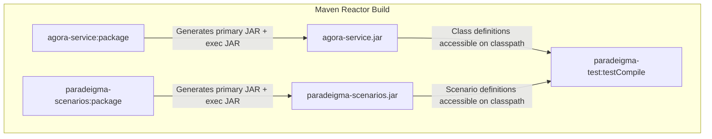

# Requirements

### Overview & Goals
When running `mvn clean package -DskipTests`, the build fails during `paradeigma-test` test compilation with 6 compiler errors indicating that packages from `agora-service` (`net.fhirfactory.harmonia.agora.service.config`, `net.fhirfactory.harmonia.agora.service.rest`) and `paradeigma-scenarios` (`net.fhirfactory.harmonia.paradeigma.scenarios.agora`, `net.fhirfactory.harmonia.paradeigma.scenarios.model`) cannot be found.

The goal is to fix the build configuration so that `mvn clean package -DskipTests` succeeds cleanly across all modules in the repository reactor while preserving executable artifact creation for containerization.

### Scope
- **In Scope**:
  - Configuring `spring-boot-maven-plugin` with `<classifier>exec</classifier>` in the root `pom.xml` plugin management and relevant submodules (`agora-service`, `paradeigma-scenarios`, `mnemosyne-operations`, simulator modules).
  - Updating Docker build configurations if necessary to reference the `-exec.jar` artifact.
  - Verifying reactor compilation with `mvn clean package -DskipTests` and executing scenario tests.
- **Out of Scope**:
  - Modifying Java test logic in `AgoraCollaborationScenarioTest` or scenario classes.
  - Changing architecture boundaries or introducing new module dependencies.

### User Stories
- As a **developer or CI/CD pipeline runner**, I want `mvn clean package -DskipTests` to complete successfully across the entire multi-module repository without compilation errors in `paradeigma-test`.
- As a **platform engineer**, I want Spring Boot modules to continue generating valid executable JARs for Docker container images without breaking intra-reactor library compilation.

### Functional Requirements
- `paradeigma-test` must successfully resolve and compile classes from `agora-service` and `paradeigma-scenarios`.
- All modules configuring Spring Boot repackaging must produce both a standard library JAR (`<artifact>-<version>.jar`) for reactor dependencies and an executable archive (`<artifact>-<version>-exec.jar`) for execution.
- `mvn clean package -DskipTests` must exit with `BUILD SUCCESS`.

### Non-Functional Requirements
- **Build Performance**: Fix must not introduce extra build steps or slow down compilation.
- **Maintainability**: Centralized configuration in root `pom.xml` plugin management ensures future Spring Boot modules automatically inherit the correct packaging behavior.

# Technical Design

### Current Implementation
In `agora/agora-service/pom.xml` and `paradeigma/paradeigma-scenarios/pom.xml`, the `spring-boot-maven-plugin:repackage` goal is executed without a `<classifier>`. When Maven executes the `package` phase:
1. Maven compiler generates standard `.class` files in `target/classes`.
2. Maven jar plugin packages them into `target/<artifact>-1.0.0-SNAPSHOT.jar`.
3. `spring-boot-maven-plugin` repackages `target/<artifact>-1.0.0-SNAPSHOT.jar` in place, moving all classes into `BOOT-INF/classes/` for executable fat JAR execution.
4. When downstream module `paradeigma-test` compiles in `testCompile`, `javac` inspects the repackaged JAR file on the classpath, fails to find classes in the root directory structure, and throws:
   - `package net.fhirfactory.harmonia.agora.service.config does not exist`
   - `package net.fhirfactory.harmonia.agora.service.rest does not exist`
   - `package net.fhirfactory.harmonia.paradeigma.scenarios.agora does not exist`
   - `package net.fhirfactory.harmonia.paradeigma.scenarios.model does not exist`

In contrast, `hestia/mnemosyne-clinical/pom.xml` correctly uses `<configuration><classifier>exec</classifier></configuration>`, leaving the primary JAR as a library JAR and creating a separate `-exec.jar`.

### Key Decisions
- **Decision 1: Use `<classifier>exec</classifier>` for Spring Boot Repackaging**:
  - *Rationale*: Setting the repackage classifier to `exec` instructs Spring Boot to attach the executable JAR as a secondary artifact with classifier `exec`, leaving the primary `.jar` artifact untouched. This is the official and standard Spring Boot multi-module pattern when other modules depend on a Spring Boot application module.
- **Decision 2: Configure in Root `pom.xml` `<pluginManagement>` and Target Module POMs**:
  - *Rationale*: Configuring `<classifier>exec</classifier>` in root `pom.xml`'s `<pluginManagement>` ensures repository-wide default consistency, while updating the child POMs guarantees explicit declaration.

### Proposed Changes
1. **`pom.xml`**:
   - In `<build><pluginManagement><plugins>`, update `spring-boot-maven-plugin` definition to include:
     ```xml
     <configuration>
         <classifier>exec</classifier>
     </configuration>
     ```
2. **`agora/agora-service/pom.xml`**:
   - Add `<configuration><classifier>exec</classifier></configuration>` to `spring-boot-maven-plugin`.
3. **`paradeigma/paradeigma-scenarios/pom.xml`**:
   - Add `<configuration><classifier>exec</classifier></configuration>` to `spring-boot-maven-plugin`.
4. **Other Spring Boot Application Modules**:
   - Ensure `hestia/mnemosyne-operations/pom.xml`, `paradeigma/paradeigma-pas/pom.xml`, `paradeigma/paradeigma-emr/pom.xml`, `paradeigma/paradeigma-lms/pom.xml`, and `paradeigma/paradeigma-rispac/pom.xml` declare or inherit `<classifier>exec</classifier>`.
5. **`deployment/docker/Dockerfile.agora`**:
   - Ensure the `ARG JAR_FILE` properly targets the `-exec.jar` artifact (e.g. `target/agora-service-*-exec.jar`).

### File Structure
- Modified: `pom.xml`
- Modified: `agora/agora-service/pom.xml`
- Modified: `paradeigma/paradeigma-scenarios/pom.xml`
- Modified: `hestia/mnemosyne-operations/pom.xml`
- Modified: `paradeigma/paradeigma-pas/pom.xml`
- Modified: `paradeigma/paradeigma-emr/pom.xml`
- Modified: `paradeigma/paradeigma-lms/pom.xml`
- Modified: `paradeigma/paradeigma-rispac/pom.xml`
- Modified: `deployment/docker/Dockerfile.agora`

### Architecture Diagram


### Risks
- **Docker Image Layering**:
  - *Risk*: Docker builds expecting `target/*.jar` might pick up the library JAR instead of the repackaged executable JAR if wildcards are ambiguous.
  - *Mitigation*: Specify `*-exec.jar` explicitly in Dockerfile ARGs where applicable.

# Testing

### Validation Approach
Verification will be performed directly through Maven build and test commands to validate full reactor compilation and scenario execution.

### Key Scenarios
1. **Full Reactor Build with Tests Skipped**:
   - Command: `mvn clean package -DskipTests`
   - Expected Outcome: All modules (`calliope`, `themis`, `hestia`, `iris`, `pylai`, `energeia`, `petasos`, `agora`, `paradeigma`) compile and package successfully with exit code 0.
2. **Paradeigma Agora Collaboration Scenario Test Execution**:
   - Command: `mvn test -pl paradeigma/paradeigma-test -Dtest="AgoraCollaborationScenarioTest"`
   - Expected Outcome: Tests in `AgoraCollaborationScenarioTest` pass cleanly.
3. **Harmonia Architecture Test Invariants**:
   - Command: `mvn test -pl paradeigma/paradeigma-test -am -Dtest="*ArchitectureTest" -Dsurefire.failIfNoSpecifiedTests=false`
   - Expected Outcome: All ArchUnit architecture tests pass, verifying module boundaries and isolation invariants.

# Delivery Steps

### ✓ Step 1: Configure Spring Boot Maven Plugin Exec Classifier
Ensure downstream Maven modules can compile against Spring Boot application modules by preserving standard library JARs alongside executable archives.

- Update `<pluginManagement>` in the root `pom.xml` to include `<classifier>exec</classifier>` in the default configuration for `spring-boot-maven-plugin`.
- Explicitly configure `<classifier>exec</classifier>` in `agora/agora-service/pom.xml` and `paradeigma/paradeigma-scenarios/pom.xml`.
- Ensure consistent `<classifier>exec</classifier>` configuration across other Spring Boot executable modules (`hestia/mnemosyne-operations/pom.xml`, `paradeigma/paradeigma-pas/pom.xml`, `paradeigma/paradeigma-emr/pom.xml`, `paradeigma/paradeigma-lms/pom.xml`, and `paradeigma/paradeigma-rispac/pom.xml`) matching `hestia/mnemosyne-clinical/pom.xml`.
- Update `deployment/docker/Dockerfile.agora` `ARG JAR_FILE` pattern if needed to target the executable classifier archive (`*-exec.jar`).

### ✓ Step 2: Verify Multi-Module Build and Scenario Test Execution
Validate that the full Maven reactor compiles and packages successfully without classpath resolution errors.

- Run `mvn clean package -DskipTests` to confirm that `paradeigma-test` compiles against `agora-service` and `paradeigma-scenarios` without any missing package or class compilation errors.
- Run targeted ArchUnit and unit tests (`mvn test -pl paradeigma/paradeigma-test -am -Dtest="AgoraCollaborationScenarioTest,*ArchitectureTest"`) to ensure scenario execution and architectural isolation invariants remain fully satisfied.