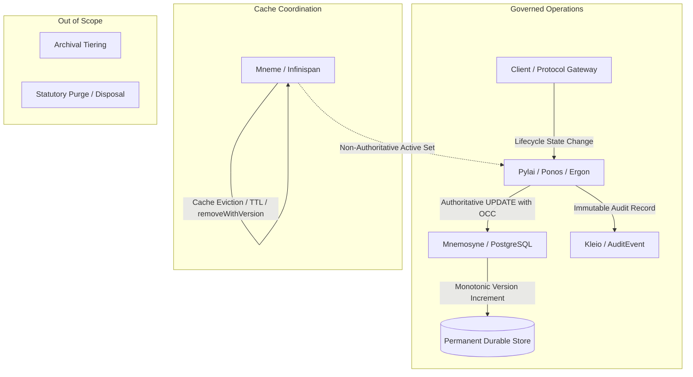

# Requirements

### Overview & Goals
The objective of this documentation initiative is to establish an explicit, authoritative platform invariant across the Harmonia Health Integration Environment (HIE):
- Harmonia does not provide physical `DELETE` semantics for governed persisted information.
- A logical deletion represents a domain-appropriate lifecycle transition and is therefore processed as an authoritative `UPDATE`.
- Long-term archival, retention-based purge, and physical disposal are formally designated as outside the scope of the current Harmonia framework.

This is strictly a documentation task. No production code, database schemas, persistence entities, FHIR providers, or runtime configurations will be modified.

### Scope
#### In Scope
- **Architecture Decision Record**: Formalize and synchronize `ADR-020 — Governed Information Uses Lifecycle State Rather Than Physical Deletion` (Status: Accepted, Date: 25 September 2026) across LaTeX and Markdown documentation.
- **Conceptual Disambiguation**: Explicitly distinguish four distinct operational concepts:
  1. *Resource Lifecycle Transition* (authoritative state change executed via conditional `UPDATE`).
  2. *Mneme Eviction* (cache entry invalidation/expiration affecting active cache working set only).
  3. *Archival* (long-term data migration/cold-storage outside platform scope).
  4. *Purge / Physical Disposal* (permanent statutory destruction outside platform scope).
- **Task 08 Guidance**: Formalize write semantics for Task 08 ("Authoritative Clinical Writes") to cover `CREATE` and `UPDATE` protocols while excluding physical authoritative `DELETE`.
- **Mneme Concurrency Integration**: Update `hestia/mneme-cluster/docs/mneme-concurrency-and-information-integrity.md` to reference ADR-020 and clarify that Infinispan's `removeWithVersion()` is a cluster coordination capability, not a Harmonia governed resource deletion semantic.
- **Consistency Audit**: Search and classify all repository occurrences of `DELETE`, `CRUD`, and `PersistenceOperationEnvelope` without altering unrelated administrative or test terminology.

#### Out of Scope
- Modifying production code, tests, database schemas, or JPA entities.
- Introducing generic `is_deleted` flags or separate archive tables.
- Modifying `PersistenceOperationType.DELETE` enum or `PersistenceOperationEnvelope` implementation code.
- Implementing Task 08 write protocols, archival engines, or purge routines.

### Normative Platform Guardrail
> **"Harmonia SHALL NOT expose physical deletion as a normal operation for governed persisted information. Logical deletion SHALL be represented as a domain-appropriate lifecycle transition and processed as a concurrency-controlled authoritative update. Mneme cache eviction SHALL NOT be interpreted as deletion of authoritative state. Archival, retention-based purge and physical disposal are outside the current Harmonia framework scope."**

# Technical Design

### Current Architecture Context
- **Mnemosyne** (`hestia/mnemosyne-*`): Owns durable application state and authoritative versioning (ADR-003, ADR-018).
- **Mneme** (`hestia/mneme-*`): Owns distributed active resource access and coordination via Infinispan (ADR-019).
- **Kleio** (`kleio/`): Owns immutable audit evidence and governed provenance (ADR-013).
- **Calliope** (`calliope/`): Owns canonical schemas, profiles, and domain models (ADR-004), including `PersistenceOperationEnvelope` and `PersistenceOperationType`.

### Key Architectural Distinctions

### Write Semantics Taxonomy
1. **CREATE**: Establishes authoritative state in Mnemosyne (`versionId = 1`), initializes provenance, and registers active entry in Mneme.
2. **UPDATE**: Advances authoritative state monotonically (`versionId = N + 1`), validates preconditions via optimistic concurrency control (OCC), and refreshes Mneme.
3. **LIFECYCLE TRANSITION**: A semantic specialization of **UPDATE** modifying lifecycle attributes (e.g., FHIR `status = 'entered-in-error'`, `active = false`). Subject to identical concurrency, provenance, and Kleio audit controls.
4. **DELETE (Physical)**: Prohibited for governed persisted information. Not provided as an authoritative Harmonia operation.

### Concurrency and Distributed Cache Semantics
- **Optimistic Concurrency Control**: Lifecycle transitions require matching version tokens (HTTP `If-Match` / durable version). Stale updates result in conflict rejection (`412 Precondition Failed` / `OptimisticLockException`).
- **Infinispan removeWithVersion()**: Hot Rod primitive for entry-level cache invalidation and active-set eviction. It coordinates distributed cache state across cluster nodes but does not execute domain deletion.

### Domain Lifecycle Mechanisms
Rather than introducing generic `is_deleted` flags or archive tables, Harmonia requires using domain-native semantics defined by the resource model:
- `status` (e.g. `cancelled`, `completed`, `entered-in-error`)
- `active` (`true` / `false`)
- `period.end` / validity duration
- `verificationStatus` / `clinicalStatus`

### Targeted Documentation Files
1. `docs/latex/chapters/appendix-decisions.tex`: Contains full LaTeX text for ADR-020 matching ADR-018/ADR-019 styling and cross-references.
2. `docs/architecture-decisions.md`: Contains Markdown counterpart of ADR-020 ensuring exact semantic synchronization.
3. `hestia/mneme-cluster/docs/mneme-concurrency-and-information-integrity.md`: Incorporates Section 3.4 referencing ADR-020, distinguishing cache eviction from resource deletion.

# Consistency Analysis

### Occurrence Classification Taxonomy
All occurrences of `DELETE`, `CRUD`, and related terms across repository documentation are categorized into five distinct classes:

- **Class A: Governed resource deletion** — Statements implying Harmonia supports physical deletion of governed data. *Action: Must be corrected/clarified to lifecycle transitions.*
- **Class B: Mneme/cache eviction** — Cache entry invalidation, TTL expiration, or `removeWithVersion()`. *Action: Clarified as non-authoritative active-state eviction.*
- **Class C: Test/laboratory capability** — Hot Rod conditional removal test cases demonstrating Infinispan primitives. *Action: Retained as technical characterization.*
- **Class D: Infrastructure/administrative operations** — Kubernetes workload deletion (`kubectl delete`), PVC teardown, messaging journal consumer ACK removal. *Action: Retained as administrative operations.*
- **Class E: Historical/design & rejected alternatives** — Negative design space discussion, rejected CRUD models, or WORM audit constraints. *Action: Retained for contextual clarity.*

### Existing Artefact: PersistenceOperationEnvelope
- **Location**: `calliope/src/main/java/net/fhirfactory/harmonia/model/persistence/PersistenceOperationType.java` (`CREATE, UPDATE, DELETE`).
- **Status**: Retained untouched per guardrails.
- **Reporting**: Formally flagged as an architectural consistency item requiring a future decision (whether to remove, restrict to non-governed internal messaging, or reinterpret as a lifecycle operation).

### Verification Checklist
- [x] Verify LaTeX compilation and markup in `appendix-decisions.tex`.
- [x] Verify Markdown semantic equivalence in `architecture-decisions.md`.
- [x] Verify concise ADR-020 integration in `mneme-concurrency-and-information-integrity.md`.
- [x] Verify zero changes to `.java`, `.xml`, `.sql`, or test source files.

# Delivery Steps

### ✓ Step 1: Align and finalize LaTeX architecture decision documentation
The LaTeX architecture decision appendix accurately defines ADR-020 and aligns Task 08 roadmap references.

- Review and verify `docs/latex/chapters/appendix-decisions.tex` to ensure ADR-020 adheres strictly to the formatting, styling, and structural conventions of ADR-018 and ADR-019.
- Ensure the four key concepts (Resource Lifecycle Transition, Mneme Eviction, Archival, Purge/Disposal) and Task 08 consequences (CREATE/UPDATE write semantics only) are captured normatively.
- Verify that earlier roadmap references in ADR-018 correctly cite ADR-020 without implying a physical DELETE path for Task 08.

### ✓ Step 2: Synchronize Markdown architecture decisions and Mneme concurrency documentation
The Markdown architecture decision documentation and Mneme concurrency guide fully reflect ADR-020 and the governed lifecycle invariants.

- Verify and synchronize `docs/architecture-decisions.md` to guarantee semantic parity with the LaTeX version of ADR-020.
- Update `hestia/mneme-cluster/docs/mneme-concurrency-and-information-integrity.md` with a dedicated section summarizing the platform guardrail: no physical delete, lifecycle transition as authoritative UPDATE, Mneme eviction vs. resource deletion, archival/purge scope, and Infinispan `removeWithVersion()` characterization.
- Ensure cross-references point to ADR-020 without duplicating entire decision text.

### ✓ Step 3: Perform consistency audit and generate final architecture report
All documentation occurrences of DELETE and CRUD terminology across the repository are categorized, verified, and audited for architectural consistency.

- Perform a comprehensive grep and classification of all `DELETE`, `CRUD`, and `removeWithVersion` occurrences across Markdown and LaTeX documentation into categories A through E.
- Document the analysis of `PersistenceOperationType.DELETE` and `PersistenceOperationEnvelope` in `Calliope` as an existing architectural artefact requiring future lifecycle reinterpretation or removal.
- Compile the final documentation report detailing inspected files, modified files, ADR-020 summary, retained deletion occurrences, and confirmation of zero production code changes.