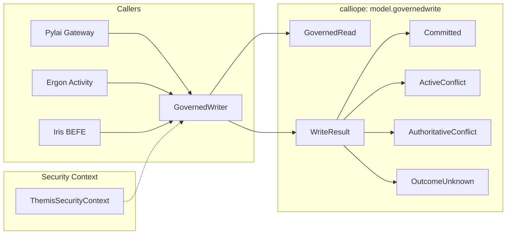

# Requirements

### Overview & Goals
The objective is to maximize platform reliability, data safety, and developer efficiency by establishing the foundational Java contract layer for Harmonia's governed-write architecture (Task 08 Step 08.04A). By defining clear, type-safe, and misuse-resistant caller-facing abstractions before implementing runtime coordination mechanisms, we eliminate error-prone ambiguity and ensure maximum utility across all integrating components (Pylai gateways, Energeia workflows, Iris BEFE, and Hestia storage tiers).

### Scope
- **In Scope**:
  - Implementation of core caller-facing Java records, enums, sealed result types, and writer interface in `calliope` (`net.fhirfactory.harmonia.model.governedwrite`).
  - Strict modeling of the four distinct version domains, opaque active coordination tokens, and authoritative predecessor preconditions.
  - Distinct modeling of `COMMITTED`, `NOT_COMMITTED`, and `UNKNOWN` commit outcomes.
  - Direct reuse of `ThemisSecurityContext` for provenance, correlation, and authorization lineage.
  - Unit tests verifying contract semantics, token opacity, and misuse resistance.
  - ArchUnit architecture guardrails ensuring zero leakage of Infinispan, JPA, or HTTP dependencies into the pure contract layer.
  - Documentation alignment in `docs/design/governed-write-concurrency-contract.md` and generation of the Step 08.04A report.
- **Out of Scope**:
  - Runtime implementation of Mneme CAS coordination or guarded convergence loops.
  - Runtime implementation of Mnemosyne conditional SQL/JPA persistence.
  - Migration of existing write paths (`FhirCacheService`, `TaskCacheService`, `FhirRestCacheStore`, `FhirStorageService`).
  - Modifying database schemas, Infinispan configurations, or JPA `@Version` annotations.
  - Creating new Maven modules (e.g., `hestia-governance`, `hestia-api`) or new deployable subsystems.

### User Stories
- **As an Integration Engineer**, I want a clear, strongly typed `GovernedWriter` API that accepts only `create` and `update` with automatic concurrency token propagation, so that I cannot inadvertently trigger race conditions or data loss.
- **As a System Architect**, I want `ActiveCoordinationToken` and `ExpectedAuthoritativeVersion` to remain strictly distinct and opaque, so that infrastructure mechanics do not leak into canonical business logic.
- **As an Operations & Reliability Engineer**, I want write outcomes to distinguish `UNKNOWN` from `NOT_COMMITTED`, so that network timeouts trigger controlled reconciliation rather than dangerous blind retries.

### Functional Requirements
- `GovernedRead<T>` must bundle the resource payload with both its active coordination token (Mneme) and authoritative version (Mnemosyne).
- `ActiveCoordinationToken` must be an immutable, strongly opaque value object representing a real observed Mneme token; it must contain no `none()` or `isPresent()` magic values, expose no `asOpaqueString()` or numeric accessors, and expose no arithmetic or ordering operations (`+1`, `next()`, `increment()`).
- `ExpectedAuthoritativeVersion` must represent expected absence for `create` and a specific predecessor version for `update`.
- The conflict model must distinguish between transient active cache contention (`ActiveStateConflict`) and persistent database precondition failures (`AuthoritativePreconditionConflict` with reasons `RESOURCE_ALREADY_EXISTS` and `EXPECTED_VERSION_MISMATCH`).
- `AuthoritativeCommitOutcome` must explicitly represent `COMMITTED`, `NOT_COMMITTED`, and `UNKNOWN`.
- `WriteResult<T>` must be a sealed hierarchy with dedicated variants enforcing invariant validation at construction time.
- Committed writes with degraded cache convergence must be represented as successful commits with `ConvergenceStatus.DEGRADED` rather than failures.
- Governed clinical writes must not expose any physical DELETE operation (ADR-020).

### Non-Functional Requirements
- **Dependency Purity**: Zero external runtime dependencies beyond JDK and existing Calliope/Themis models.
- **Misuse Resistance**: Sealed types and factory methods that make invalid result states impossible to construct.
- **Zero Overhead**: Lightweight Java records and value objects with minimal memory footprint and zero serialization friction.

# Technical Design

### Current Implementation
Currently, writes across Harmonia bypass governed coordination: `iris-befe` and `energeia-erga` perform direct unconditional `RemoteCache.put` calls; `FhirRestCacheStore` performs unconditional REST PUT operations; and `FhirStorageService` implements upsert semantics on CREATE and unvalidated version increments on UPDATE. The four version domains (Infinispan entry token, PostgreSQL DB version, FHIR `meta.versionId`, HTTP `ETag`) are frequently conflated.

### Key Decisions
- **Placement in `calliope` / `net.fhirfactory.harmonia.model.governedwrite`**: Maximizes utility and minimizes friction. `calliope` is already the platform's foundational model library. All consumers (Pylai, Energeia, Iris, Hestia) depend on `calliope`, and `calliope` depends on `themis-api`, ensuring zero circular dependencies and eliminating the need for a new Maven module.
- **Direct reuse of `ThemisSecurityContext`**: Prevents redundant context definitions by leveraging existing principal, authority, tenant, correlation, and causation fields.
- **Sealed `WriteResult<T>` Hierarchy**: Eliminates wide nullable records in favor of type-safe variants (`Committed`, `ActiveConflict`, `AuthoritativeConflict`, `OutcomeUnknown`, `NotCommitted`), enforcing semantic invariants at compile time.
- **Strict UPDATE-only Lifecycle (ADR-020)**: Excludes physical DELETE methods from `GovernedWriter` to ensure patient safety and regulatory auditability.

### Proposed Changes

#### 1. Core Model & Identifiers (`calliope`)
- `ResourceKey`: Immutable record `(String resourceType, String id)`.
- `ActiveCoordinationToken`: Strongly opaque immutable final class representing a real observed Mneme token, with no `none()`, `isPresent()`, `asOpaqueString()`, or numeric/ordering operations, masking internal representation in `toString()`.
- `AuthoritativeVersion`: Immutable record `(String value)` representing persisted Mnemosyne state.
- `ExpectedAuthoritativeVersion`: Value object representing expected absence (`none()`) or expected predecessor version (`of(...)`).
- `GovernedRead<T>`: Immutable record `(ResourceKey key, T resource, ActiveCoordinationToken activeToken, AuthoritativeVersion authoritativeVersion)`.

#### 2. Conflict & Outcome Taxonomy (`calliope`)
- `AuthoritativeCommitOutcome`: Enum `COMMITTED`, `NOT_COMMITTED`, `UNKNOWN`.
- `ConvergenceStatus`: Enum `CONVERGED`, `DEGRADED`, `NOT_APPLICABLE`.
- `PreconditionFailureReason`: Enum `RESOURCE_ALREADY_EXISTS`, `EXPECTED_VERSION_MISMATCH`.
- `ActiveStateConflict`: Record `(ResourceKey key, String message)`.
- `AuthoritativePreconditionConflict`: Record `(ResourceKey key, PreconditionFailureReason reason, ExpectedAuthoritativeVersion expectedVersion, AuthoritativeVersion currentVersion, String message)`.

#### 3. Sealed Result Model (`calliope`)
- `WriteResult<T>`: Sealed interface permitting `Committed<T>`, `ActiveConflict<T>`, `AuthoritativeConflict<T>`, `OutcomeUnknown<T>`, and `NotCommitted<T>`.

#### 4. Caller Contract (`calliope`)
- `GovernedWriter`: Public interface declaring:
  - `<T> WriteResult<T> create(ResourceKey key, T resource, ThemisSecurityContext securityContext)`
  - `<T> WriteResult<T> update(GovernedRead<T> current, T proposed, ThemisSecurityContext securityContext)`

### Data Models / Contracts

```java
package net.fhirfactory.harmonia.model.governedwrite;

import net.fhirfactory.harmonia.themis.api.model.ThemisSecurityContext;
import java.io.Serializable;
import java.util.Optional;

public record ResourceKey(String resourceType, String id) implements Serializable {}

public final class ActiveCoordinationToken implements Serializable {
    public static ActiveCoordinationToken of(String opaqueValue);
}

public record AuthoritativeVersion(String value) implements Serializable {
    public ExpectedAuthoritativeVersion toExpected();
}

public final class ExpectedAuthoritativeVersion implements Serializable {
    public static ExpectedAuthoritativeVersion none();
    public static ExpectedAuthoritativeVersion of(AuthoritativeVersion version);
    public boolean isNone();
    public Optional<AuthoritativeVersion> version();
}

public record GovernedRead<T>(
    ResourceKey key,
    T resource,
    ActiveCoordinationToken activeToken,
    AuthoritativeVersion authoritativeVersion
) implements Serializable {
    public ExpectedAuthoritativeVersion expectedAuthoritativeVersion();
}

public sealed interface WriteResult<T> extends Serializable permits
    WriteResult.Committed,
    WriteResult.ActiveConflict,
    WriteResult.AuthoritativeConflict,
    WriteResult.OutcomeUnknown,
    WriteResult.NotCommitted {
    
    ResourceKey key();
    AuthoritativeCommitOutcome commitOutcome();
    ConvergenceStatus convergenceStatus();
    default boolean isCommitted() { return commitOutcome() == AuthoritativeCommitOutcome.COMMITTED; }
    default boolean isOutcomeUnknown() { return commitOutcome() == AuthoritativeCommitOutcome.UNKNOWN; }
}

public interface GovernedWriter {
    <T> WriteResult<T> create(ResourceKey key, T resource, ThemisSecurityContext securityContext);
    <T> WriteResult<T> update(GovernedRead<T> current, T proposed, ThemisSecurityContext securityContext);
}
```

### Architecture Diagram



### Risks & Mitigations
- **Risk**: Callers attempting to reconstruct concurrency tokens manually.
  - **Mitigation**: `GovernedWriter.update` requires a `GovernedRead<T>`, ensuring tokens are intrinsically bound to observed state.
- **Risk**: Accidental leakage of Infinispan or JPA types into Calliope.
  - **Mitigation**: Pure JDK records/interfaces and strict ArchUnit verification in `paradeigma-test`.
- **Risk**: Treating ambiguous network timeouts as write failures.
  - **Mitigation**: Explicit `OutcomeUnknown` result variant and `AuthoritativeCommitOutcome.UNKNOWN` state.

# Testing

### Validation Approach
Verification employs a two-tier testing strategy to maximize correctness and long-term maintainability:
1. **Contract & Developer Experience Unit Tests (`calliope`)**: Exercises every API type, factory method, immutability invariant, and result variant under normal and exceptional scenarios.
2. **ArchUnit Architecture Guardrail Tests (`paradeigma-test`)**: Programmatically verifies package boundaries and prohibits unwanted infrastructure imports.

### Key Scenarios
- **Scenario 1 (Context Retention)**: Verify `GovernedRead<T>` encapsulates `ResourceKey`, payload, `ActiveCoordinationToken`, and `AuthoritativeVersion`.
- **Scenario 2 (Token Opacity & Real Token Semantics)**: Verify `ActiveCoordinationToken` represents a real token with no `none()` or `isPresent()` methods, exposes no `asOpaqueString()` or numeric methods (`increment`, `next`, `longValue`), is not `Comparable`, and masks raw token strings in `toString()`.
- **Scenario 3 (CREATE Conflict)**: Verify duplicate creation yields `AuthoritativePreconditionConflict` with reason `RESOURCE_ALREADY_EXISTS` and `commitOutcome = NOT_COMMITTED`.
- **Scenario 4 (UPDATE Conflict)**: Verify version mismatch yields `AuthoritativePreconditionConflict` with reason `EXPECTED_VERSION_MISMATCH` and preserves expected/current versions.
- **Scenario 5 (Active vs Authoritative Distinction)**: Verify `ActiveStateConflict` (cache contention) and `AuthoritativePreconditionConflict` (database mismatch) remain distinct, non-overlapping types.
- **Scenario 6 (Three-State Commit Outcomes)**: Verify `COMMITTED`, `NOT_COMMITTED`, and `UNKNOWN` outcomes remain distinct and correctly populated across all result variants.
- **Scenario 7 (Degraded Convergence Representation)**: Verify successful authoritative commit with degraded cache convergence is represented as `WriteResult.Committed` with `ConvergenceStatus.DEGRADED` and `isCommitted() == true`.
- **Scenario 8 (Absence of Governed DELETE)**: Reflectively assert `GovernedWriter` declares exactly `create` and `update` and contains no `delete` or `remove` methods.
- **Scenario 9 (Invalid State Rejection)**: Verify `WriteResult.Committed` rejects `ConvergenceStatus.NOT_APPLICABLE` and constructor constraints reject null keys.

### Architecture Guardrails (`GovernedWriteContractArchitectureTest`)
- Ensure classes in `net.fhirfactory.harmonia.model.governedwrite..` have **zero** dependencies on:
  - `org.infinispan..`, `org.infinispan.client.hotrod..`, `RemoteCache`
  - `jakarta.persistence..`, `org.hibernate..`, `ca.uhn.fhir.jpa..`, `org.postgresql..`
  - `org.springframework.web..`, `jakarta.servlet..`, `org.apache.http..`
- Ensure `GovernedWriter` interface contains no method names matching `*delete*` or `*remove*`.
- Ensure pure contract code contains zero forbidden import statements via source analysis.

# Delivery Steps

### ✓ Step 1: Define foundational identifier, token, and read model types in Calliope
`ResourceKey`, `ActiveCoordinationToken`, `AuthoritativeVersion`, `ExpectedAuthoritativeVersion`, and `GovernedRead<T>` provide type-safe, immutable identity and concurrency representations.

- Create `ResourceKey` in `calliope` under `net.fhirfactory.harmonia.model.governedwrite` to uniquely identify logical resources by type and ID without exposing JPA or HTTP coupling.
- Implement `ActiveCoordinationToken` as a strongly opaque, immutable value object representing a real observed Mneme token (with no `none()` or `isPresent()` magic states, no `asOpaqueString()`, and no arithmetic, increment, or ordering methods).
- Implement `AuthoritativeVersion` and `ExpectedAuthoritativeVersion` to represent Mnemosyne authoritative state transitions distinctly from active tokens.
- Implement `GovernedRead<T>` to bundle the resource payload with its active coordination token and authoritative version, ensuring callers cannot inadvertently assemble mismatched concurrency contexts.

### ✓ Step 2: Implement conflict taxonomy, commit outcome, and sealed WriteResult model
`ActiveStateConflict`, `AuthoritativePreconditionConflict`, `AuthoritativeCommitOutcome`, `ConvergenceStatus`, and sealed `WriteResult<T>` provide unambiguous write outcomes.

- Define `AuthoritativeCommitOutcome` enum with explicit states: `COMMITTED`, `NOT_COMMITTED`, and `UNKNOWN` (preventing ambiguous network states from being collapsed into false negatives).
- Define `ConvergenceStatus` enum (`CONVERGED`, `DEGRADED`, `NOT_APPLICABLE`) and `PreconditionFailureReason` enum distinguishing `RESOURCE_ALREADY_EXISTS` from `EXPECTED_VERSION_MISMATCH`.
- Implement `ActiveStateConflict` and `AuthoritativePreconditionConflict` value objects to clearly delineate transient cache contention from persistent database precondition mismatches.
- Implement `WriteResult<T>` as a sealed interface with permitted record variants (`Committed`, `ActiveConflict`, `AuthoritativeConflict`, `OutcomeUnknown`, `NotCommitted`) and static factory methods that enforce valid state combinations at compile time.

### ✓ Step 3: Establish caller-facing GovernedWriter interface and context integration
`GovernedWriter` defines the public write interface exposing only `create` and `update` operations using existing security context.

- Create `GovernedWriter` interface in `net.fhirfactory.harmonia.model.governedwrite` containing parameterized `create(key, resource, securityContext)` and `update(governedRead, proposed, securityContext)`.
- Directly compose existing `ThemisSecurityContext` for caller authentication, authorization, correlation, and causation metadata, avoiding duplicate context models.
- Enforce that `GovernedWriter` strictly prohibits physical DELETE operations in adherence to ADR-020.

### ✓ Step 4: Create developer experience unit tests and architecture guardrail tests
Unit tests and ArchUnit rules verify contract semantics, token opacity, and architectural isolation across modules.

- Implement `GovernedWriteContractTest` in `calliope` covering core contract scenarios: context bundling in `GovernedRead`, token opacity and real token semantics (no `none()`, `isPresent()`, `asOpaqueString()`), distinct conflict representations, three-state commit outcomes, degraded convergence representation, absence of DELETE methods, and invalid combination rejection.
- Implement `GovernedWriteContractArchitectureTest` in `paradeigma-test` ensuring `net.fhirfactory.harmonia.model.governedwrite` has zero dependencies on Infinispan, RemoteCache, JPA, Hibernate, or HTTP server/client libraries.
- Execute the test suite via Maven to validate that existing write paths and reactor modules remain unaffected.

### ✓ Step 5: Align design documentation and produce verification report
Documentation reflects final contract placement and the Step 08.04A verification report is published.

- Update `docs/design/governed-write-concurrency-contract.md` to reference the final package placement in `calliope` and record implementation status.
- Generate `.junie/reports/Harmonia Security - Task 8 - Step 04A - Foundational Governed Write Contracts.md` documenting added types, architecture decisions, test coverage, and explicit confirmation of out-of-scope boundaries.