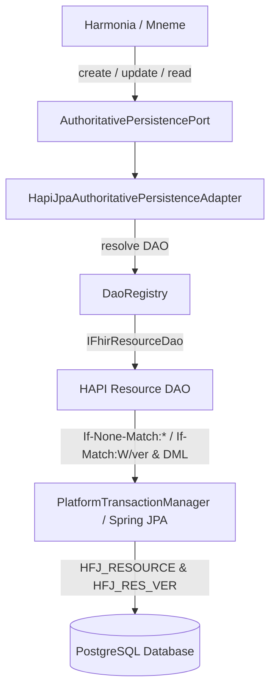

# Requirements

### Overview & Goals
This is a recovery and closure activity for Goal 2 Step 3.2. Steps 1 and 2 of Step 3.2 have already been implemented, experimentally verified on PostgreSQL (via Testcontainers), and reviewed/approved.

The objective of this activity is to verify the recovered repository baseline, execute the full Mnemosyne Clinical and architecture test suites, enforce architecture compliance, and produce the final Step 3.2 conformance report. No Step 3.3 work is commenced.

The experimentally established and accepted baseline mechanisms in `HapiJpaAuthoritativePersistenceAdapter` over HAPI FHIR 7.2.0 and PostgreSQL are:
- **CREATE-if-absent with client-assigned logical ID:** `dao.update(...)` with `If-None-Match: *` header.
- **UPDATE-if-expected-predecessor:** `dao.update(...)` with `If-Match: W/"<expected-version>"` header.

These mechanisms have already been empirically proven on PostgreSQL under genuine multi-threaded concurrency (10 concurrent writers) to enforce Harmonia's authoritative invariants (exactly one winner, deterministic precondition conflicts for losing writers, monotonic version progression, and zero phantom history entries) without JVM-local or application-level locks.

### Architectural Invariants & Scope
- **In Scope (Baseline & Closure):**
  - Accepted `AuthoritativePersistencePort` point `read(...)` semantics returning `AuthoritativePersistenceResult<T>`.
  - Accepted baseline implementation `HapiJpaAuthoritativePersistenceAdapter` backed by HAPI `DaoRegistry` and `IFhirResourceDao<?>`.
  - Accepted and verified CREATE-if-absent mechanism (`dao.update(...)` + `If-None-Match: *`): exactly 1 winner establishing version 1, 9 competing writers receiving deterministic `RESOURCE_ALREADY_EXISTS` conflicts, 1 durable `HFJ_RESOURCE` row, and 1 `HFJ_RES_VER` v1 history entry.
  - Accepted and verified UPDATE-if-expected-predecessor mechanism (`dao.update(...)` + `If-Match: W/"<expected-version>"`): exactly 1 winner establishing version 2, 9 competing writers receiving deterministic `EXPECTED_VERSION_MISMATCH` conflicts, no version 3, and zero phantom history records.
  - Explicit bounded conversion from HAPI persisted version (`IdType.getVersionIdPart()`) to Harmonia `AuthoritativeVersion`.
  - Preservation of legacy `AuthoritativePersistenceService` and `FhirResourceRepository` without dual-writing.
  - Step 3 execution: verify that the recovered repository contains the completed implementation and tests, add no code unless an actual missing history/conformance assertion is identified, execute full `hestia/mnemosyne-clinical` and architecture test suites, and produce the final Step 3.2 conformance report.
- **Out of Scope (Mandatory Stop Boundaries):**
  - Commencing Step 3.3 internal HTTP authoritative transport.
  - Step 3.4 Mneme HTTP client.
  - Step 3.5 DefaultGovernedReader / Step 3.6 DefaultGovernedWriter relocation.
  - Step 3.7 Iris migration, Step 3.8 lifecycle migration, Step 3.9 architecture enforcement.
  - Goal 3A search work.
  - Physical DELETE operations (forbidden by ADR-020).
  - Introducing Petasos/Artemis messaging or modifying Pylai gateways.
  - Application-local locks (`synchronized`, `ReentrantLock`, process-local mutexes, or distributed locks).
  - Security label mutation or interceptor-based governance injection in the persistence adapter (no default security tag injection).
  - Ponos / Praxis consumer assumptions or couplings.

### User Stories
- **As a Core Integration Platform (Harmonia)**, I want Mnemosyne persistence operations to leverage HAPI FHIR JPA DAOs for standards-compliant FHIR R5 indexing and version tracking while strictly preserving Harmonia's authoritative precondition algebra and ACID guarantees.
- **As a Managed Information Layer (Mneme / Mnemosyne)**, I want the experimentally proven PostgreSQL concurrency mechanisms (`If-None-Match: *` for create and `If-Match` for update) verified as the durable baseline so that multi-node operations remain deterministic without application-level locking.
- **As a System Architect**, I want full architectural compliance and test suite verification executed to close Goal 2 Step 3.2 with an authoritative conformance report before proceeding to Step 3.3.

### Functional Requirements
1. **Authoritative Point READ:**
   - `AuthoritativePersistencePort.read(ResourceKey key)` SHALL retrieve the authoritative resource state and its explicit `AuthoritativeVersion`.
   - If present, it returns `AuthoritativePersistenceResult.Committed(resource, version)`.
   - If absent or deleted, it returns `AuthoritativePersistenceResult.NotCommitted("Resource not found: ...")` (preserving Harmonia's existing result algebra).
2. **Authoritative CREATE-if-absent (Accepted Baseline):**
   - `create(ResourceKey key, T proposedState)` performs atomic creation of the resource at initial version `1` using `dao.update(proposedState, requestDetails)` with client-assigned logical ID `new IdType(key.resourceType(), key.id())` and header `If-None-Match: *`.
   - Under concurrent competition (10 concurrent threads), exactly ONE writer commits (`ABSENT -> VERSION 1` exactly once), and every losing writer receives `AuthoritativePersistenceResult.Conflict` with `PreconditionFailureReason.RESOURCE_ALREADY_EXISTS`.
   - Produces exactly 1 `HFJ_RESOURCE` row and exactly 1 `HFJ_RES_VER` version 1 history record.
3. **Authoritative UPDATE-if-expected-predecessor (Accepted Baseline):**
   - `update(ResourceKey key, T proposedState, ExpectedAuthoritativeVersion expectedVersion)` performs conditional update of the resource from `expectedVersion` to `expectedVersion + 1` using `dao.update(proposedState, requestDetails)` with expected version `new IdType(key.resourceType(), key.id(), expectedVerStr)` and header `If-Match: W/"<expectedVerLong>"`.
   - Under concurrent competition (10 concurrent threads against predecessor version `1`), exactly ONE writer commits establishing version `2`; all competing writers receive `AuthoritativePersistenceResult.Conflict` with `PreconditionFailureReason.EXPECTED_VERSION_MISMATCH`.
   - No losing writer establishes version `3`, zero lost updates occur, and `HFJ_RES_VER` contains exactly 2 version records (v1 and v2) with zero phantom history entries.
4. **Explicit Version Domain Mapping:**
   - Explicit bounded conversion from HAPI persisted version string (`IdType.getVersionIdPart()`) to `AuthoritativeVersion`:
     ```java
     AuthoritativeVersion authVersion = AuthoritativeVersion.of(Long.parseLong(resource.getIdElement().getVersionIdPart()));
     ```
   - Architectural identity SHALL NOT be established between `AuthoritativeVersion`, FHIR `meta.versionId`, HTTP `ETag`, and Mneme `ActiveStateToken`.
5. **Result Algebra & Failure Semantics:**
   - Positive evidence of precondition failure SHALL map to `Conflict`.
   - Positive evidence of uncommitted persistence errors SHALL map to `NotCommitted`.
   - Indeterminate outcomes (e.g. coordinator/connection failures during commit) SHALL map to `OutcomeUnknown`.
6. **Native History Progression:**
   - Committed operations SHALL create corresponding version records in `HFJ_RES_VER`.
   - Rejected / conflicting operations SHALL NOT generate any version records or orphan history entries in `HFJ_RES_VER`.
7. **Step 3 Execution & Closure Requirements:**
   - Step 3 is the only executable step.
   - Verify that the recovered repository contains the previously completed implementation and tests.
   - Add no code unless an actual missing history/conformance assertion is identified.
   - Execute the full `hestia/mnemosyne-clinical` test suite and ArchUnit architecture test suite, and compile the final Step 3.2 Conformance Report.

# Technical Design

### Current Implementation
In `hestia/mnemosyne-clinical`:
- Legacy persistence is implemented in `AuthoritativePersistenceService.java` using custom JPA entity `FhirResourceEntity` (`hie_fhir_resources`) with raw SQL conditional updates (`updateIfVersionMatches`) and implements `read(...)`.
- Step 3.1 activated HAPI FHIR JPA (`HapiJpaPersistenceConfig.java`, `JpaR5Config`, `HapiJpaConfig`), establishing `DaoRegistry`, `IFhirResourceDao<?>`, and physical schema tables (`HFJ_RESOURCE`, `HFJ_RES_VER`, `HFJ_SPIDX_*`).
- `AuthoritativePersistencePort.java` defines `read(...)`, `create(...)`, and `update(...)`.
- `HapiJpaAuthoritativePersistenceAdapter.java` is implemented and verified as the Step 3.2 authoritative persistence adapter.
- `HapiJpaAuthoritativePersistencePostgreSqlConcurrencyTest.java` is implemented and verified using Testcontainers PostgreSQL.

### Key Decisions & Accepted Mechanisms
1. **Extend `AuthoritativePersistencePort` with Point `read`:**
   - *Decision:* Ensure `<T extends IBaseResource> AuthoritativePersistenceResult<T> read(ResourceKey key)` is exposed on `AuthoritativePersistencePort`.
   - *Rationale:* Conforms to Section 4 & 9 of the prompt and review feedback. Allows callers to perform point reads through the authoritative boundary without bypassing the port or introducing cache/governed-read concerns.
2. **Accepted HAPI JPA Operations & Concurrency Mechanisms:**
   - *READ Operation:* `dao.read(new IdType(key.resourceType(), key.id()), requestDetails)`. Retrieves the current persisted resource. Translates `ResourceNotFoundException` / `ResourceGoneException` to `NotCommitted`.
   - *CREATE-if-absent Operation (Accepted Baseline):* Set client-assigned logical ID `proposedState.setId(new IdType(key.resourceType(), key.id()))` and invoke `dao.update(proposedState, requestDetails)` with header `If-None-Match: *`.
     - *Demonstrated Mechanism:* When a resource with the given ID already exists or a concurrent collision occurs, HAPI update rolls back or reports `outcome.getCreated() == false`, which the adapter maps to `Conflict(RESOURCE_ALREADY_EXISTS)`.
     - *Empirical Verification:* Tested on PostgreSQL with 10 concurrent threads: exactly 1 winner committed version 1, 9 threads received `RESOURCE_ALREADY_EXISTS` conflicts, exactly 1 `HFJ_RESOURCE` row exists, and exactly 1 `HFJ_RES_VER` v1 history record exists.
   - *UPDATE-if-expected-predecessor Operation (Accepted Baseline):* Set `proposedState.setId(new IdType(key.resourceType(), key.id(), expectedVerStr))` and invoke `dao.update(proposedState, requestDetails)` with header `If-Match: W/"<expectedVerLong>"`.
     - *Demonstrated Mechanism:* HAPI enforces predecessor version matching via optimistic locking (`HFJ_RESOURCE.RES_VER == expectedVersion`). Version mismatches or concurrent collisions throw `ResourceVersionConflictException`, `PreconditionFailedException`, or `ObjectOptimisticLockingFailureException`, which the adapter maps to `Conflict(EXPECTED_VERSION_MISMATCH)`.
     - *Empirical Verification:* Tested on PostgreSQL with 10 concurrent updates against v1: exactly 1 winner committed version 2, 9 threads received `EXPECTED_VERSION_MISMATCH` conflicts, no version 3 was created, zero lost updates occurred, and exactly 2 version records exist in `HFJ_RES_VER`.
3. **Explicit Version Domain Mapping:**
   - *Mapping:* Explicit bounded conversion between HAPI FHIR string version IDs (`IdType.getVersionIdPart()`) and Harmonia's `AuthoritativeVersion`:
     ```java
     AuthoritativeVersion authVersion = AuthoritativeVersion.of(Long.parseLong(resource.getIdElement().getVersionIdPart()));
     ```
   - *Domain Isolation:* Architectural identity is strictly forbidden between `AuthoritativeVersion`, FHIR `meta.versionId`, HTTP `ETag`, and Mneme `ActiveStateToken`.
4. **No Injected Security Label Mutation:**
   - *Decision:* Zero `FhirSecurityTagManager.applyDefaultSecurityTag(...)` or governance metadata modifications inside `HapiJpaAuthoritativePersistenceAdapter`.
   - *Rationale:* The persistence adapter is a physical storage bridge and must not become an unverified semantic or governance mutation point.
5. **No JVM-Local Locking:**
   - *Decision:* Zero `synchronized`, `ReentrantLock`, `AtomicInteger`, or JVM mutexes in the adapter.
   - *Rationale:* Multi-node and multi-JVM correctness is provided purely by HAPI JPA and PostgreSQL relational/transactional concurrency.

### Architecture Diagram


### File Structure
- `hestia/mnemosyne-clinical/src/main/java/net/fhirfactory/harmonia/hapifhir/persistence/AuthoritativePersistencePort.java` (Verified baseline - exposes `read(...)`, `create(...)`, `update(...)`)
- `hestia/mnemosyne-clinical/src/main/java/net/fhirfactory/harmonia/hapifhir/persistence/AuthoritativePersistenceService.java` (Verified baseline - legacy persistence with `read(...)`)
- `hestia/mnemosyne-clinical/src/main/java/net/fhirfactory/harmonia/hapifhir/persistence/HapiJpaAuthoritativePersistenceAdapter.java` (Verified baseline - HAPI JPA implementation with `If-None-Match: *` and `If-Match`)
- `hestia/mnemosyne-clinical/src/test/java/net/fhirfactory/harmonia/hapifhir/persistence/HapiJpaAuthoritativePersistencePostgreSqlConcurrencyTest.java` (Verified baseline - PostgreSQL concurrency test suite)

# Testing

### Validation Approach
Verification is conducted using Testcontainers running genuine PostgreSQL (`postgres:16-alpine`) instances to validate multi-threaded transaction boundaries, database constraint enforcement, optimistic locking, and version history progression. Mocks, H2, and in-memory databases are strictly excluded from concurrency verification.

### Key Scenarios (Experimentally Proven in Steps 1 & 2)
1. **PostgreSQL Concurrent CREATE Collision Proof (Verified):**
   - Clean state with no resource for `ResourceKey X`.
   - 10 concurrent threads simultaneously execute `adapter.create(X, resource)` using `dao.update(...)` + `If-None-Match: *`.
   - *Result:* Exactly 1 thread returns `Committed` with version `1`.
   - *Result:* Exactly 9 threads return `Conflict` with `PreconditionFailureReason.RESOURCE_ALREADY_EXISTS`.
   - *Result:* Exactly 1 resource row exists in `HFJ_RESOURCE` and exactly 1 version record exists in `HFJ_RES_VER`.
   - *Result:* Persisted resource equals the payload associated with the Committed result.
2. **PostgreSQL Concurrent UPDATE Collision Proof (Verified):**
   - ResourceKey X at authoritative version `1`.
   - 10 concurrent threads simultaneously execute `adapter.update(X, proposedState, ExpectedAuthoritativeVersion.of(1))` using `dao.update(...)` + `If-Match: W/"1"`.
   - *Result:* Exactly 1 thread returns `Committed` with version `2`.
   - *Result:* Exactly 9 threads return `Conflict` with `PreconditionFailureReason.EXPECTED_VERSION_MISMATCH`.
   - *Result:* No losing thread establishes version `3`.
   - *Result:* Exactly 2 version records exist in `HFJ_RES_VER` (v1 and v2) with zero phantom history records.
   - *Result:* No lost updates occur; final state matches the winner's proposed state.
3. **Authoritative Point READ Verification (Verified):**
   - Point read for existing resource returns `Committed` with identical payload and `AuthoritativeVersion`.
   - Point read for non-existent resource returns `NotCommitted`.
4. **Failure & Precondition Diagnostics (Verified):**
   - `update` with null/blank/negative/malformed expected version fails fast with `Conflict`.
   - Update on absent/deleted resource returns `Conflict(EXPECTED_VERSION_MISMATCH)`.
   - Immutable resource types (`AuditEvent`) reject modifications with `NotCommitted`.

### Step 3 Execution & Test Suite Verification
- Verify that recovered repository contains the complete implementation and test baseline.
- Add no code unless an actual missing history/conformance assertion is identified.
- Run PostgreSQL Concurrency Suite:
  ```bash
  mvn test -pl hestia/mnemosyne-clinical -Dtest=HapiJpaAuthoritativePersistencePostgreSqlConcurrencyTest
  ```
- Run Full Mnemosyne Clinical Subsystem Suite:
  ```bash
  mvn test -pl hestia/mnemosyne-clinical
  ```
- Run ArchUnit Architecture Suite:
  ```bash
  mvn test -pl paradeigma/paradeigma-test -am -Dtest="*ArchitectureTest" -Dsurefire.failIfNoSpecifiedTests=false
  ```
- Compile final Step 3.2 Conformance Report.

# Delivery Steps

### ✓ Step 1: Implement HapiJpaAuthoritativePersistenceAdapter and Extend AuthoritativePersistencePort [COMPLETE / REVIEWED / APPROVED]
Status: COMPLETE / REVIEWED / APPROVED. Baseline implementation established.

- `AuthoritativePersistencePort.java` extended with `<T extends IBaseResource> AuthoritativePersistenceResult<T> read(ResourceKey key)` and implemented in legacy `AuthoritativePersistenceService.java` for backward compatibility without dual-writing.
- `HapiJpaAuthoritativePersistenceAdapter.java` implemented in `net.fhirfactory.harmonia.hapifhir.persistence` implementing `AuthoritativePersistencePort<IBaseResource>` backed by `DaoRegistry` and `IFhirResourceDao<?>`.
- Point `read(...)` implemented via `dao.read(...)`, returning `Committed` on success or `NotCommitted` on `ResourceNotFoundException`/`ResourceGoneException`.
- CREATE-if-absent implemented via `dao.update(proposedState, requestDetails)` with client-assigned `IdType(key.resourceType(), key.id())` and header `If-None-Match: *`, strictly without security-label mutations, and mapping conflicts to `AuthoritativePersistenceResult.Conflict(RESOURCE_ALREADY_EXISTS)`.
- UPDATE-if-expected-predecessor implemented with predecessor version validation (`ExpectedAuthoritativeVersion`), configuring the resource ID with `IdType(key.resourceType(), key.id(), expectedVerStr)` and header `If-Match: W/"<expectedVerLong>"`, invoking `dao.update(proposedState, requestDetails)`, and mapping HAPI optimistic locking exceptions (`ResourceVersionConflictException` / `PreconditionFailedException` / `ObjectOptimisticLockingFailureException`) to `AuthoritativePersistenceResult.Conflict(EXPECTED_VERSION_MISMATCH)`.
- Explicit bounded conversion from HAPI persisted version string to `AuthoritativeVersion` implemented.

### ✓ Step 2: Implement PostgreSQL Concurrency and Precondition Collision Test Suite [COMPLETE / REVIEWED / APPROVED]
Status: COMPLETE / REVIEWED / APPROVED. Baseline experimentally proven on PostgreSQL.

- `HapiJpaAuthoritativePersistencePostgreSqlConcurrencyTest.java` implemented in `hestia/mnemosyne-clinical/src/test/java/net/fhirfactory/harmonia/hapifhir/persistence/` using Testcontainers `PostgreSQLContainer<?>` (`postgres:16-alpine`).
- 10-way concurrent CREATE collision test experimentally proven: 10 concurrent threads simultaneously executing `create(key, resource)` result in exactly 1 operation committing version 1, 9 receiving `Conflict(RESOURCE_ALREADY_EXISTS)`, exactly 1 durable resource in `HFJ_RESOURCE`, and exactly 1 version in `HFJ_RES_VER`.
- 10-way concurrent UPDATE collision test experimentally proven: 10 concurrent threads simultaneously executing `update(key, resource, expectedVersion=1)` result in exactly 1 operation committing version 2, 9 receiving `Conflict(EXPECTED_VERSION_MISMATCH)`, no losing thread establishing version 3, zero lost updates, and exactly 2 versions in `HFJ_RES_VER`.
- Authoritative point READ and failure diagnostics verified.
- Confirmed that multi-node/multi-thread safety relies entirely on PostgreSQL/HAPI JPA transactional concurrency with zero application-level locks (`synchronized`, `ReentrantLock`, atomics).

### ✓ Step 3: Verify Recovered Implementation, Architecture Compliance, and Final Conformance Report
The recovered repository baseline is verified, the full Mnemosyne Clinical and architecture test suites are executed, and the final Step 3.2 conformance report is compiled.

- Verify that the recovered repository contains the completed `HapiJpaAuthoritativePersistenceAdapter`, `AuthoritativePersistencePort`, `AuthoritativePersistenceService`, and `HapiJpaAuthoritativePersistencePostgreSqlConcurrencyTest`.
- Add no code unless an actual missing history/conformance assertion is identified.
- Query `HFJ_RES_VER` and `HFJ_RESOURCE` assertions to confirm native monotonic history progression and zero phantom history entries under concurrency.
- Verify architectural compliance against `MnemosyneAuthoritativePersistenceArchitectureTest` and `GovernedWriteCompositionArchitectureTest` (zero Infinispan imports, zero DELETE exposure, zero JPA entity leakage in public port signatures).
- Execute the full `hestia/mnemosyne-clinical` test suite (`mvn test -pl hestia/mnemosyne-clinical`) and ArchUnit architecture suite (`mvn test -pl paradeigma/paradeigma-test -am -Dtest="*ArchitectureTest"`).
- Compile the final Step 3.2 Conformance Report documenting exact files verified, established HAPI DAO operations, PostgreSQL concurrency proof outcomes, history integrity verification, and architectural compliance, without commencing any Step 3.3 work.