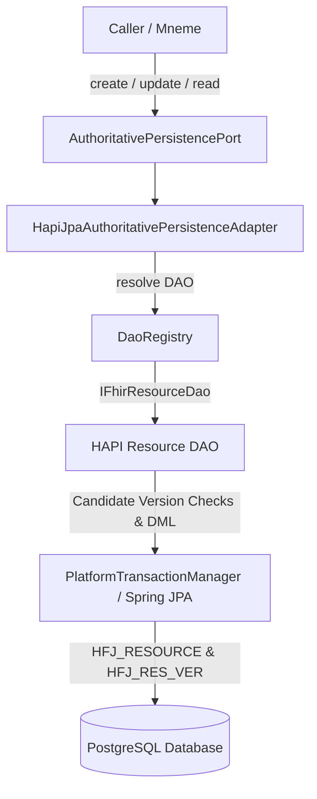

# Requirements

### Overview & Goals
The objective of Goal 2 Step 3.2 is to determine experimentally whether HAPI FHIR JPA on PostgreSQL can satisfy Harmonia's authoritative persistence and concurrency invariants, and only where demonstrated, to implement the smallest conformant `HapiJpaAuthoritativePersistenceAdapter` over that machinery.

In Step 3.1, native HAPI FHIR JPA persistence machinery was activated inside `hestia/mnemosyne-clinical`, providing operational R5 DAOs via `DaoRegistry` and creating the physical `HFJ_*` persistence schema. Step 3.2 evaluates whether candidate native HAPI JPA operations and PostgreSQL relational mechanisms (database uniqueness constraints, row-level optimistic locking, and native FHIR version-history tracking) provide atomic CREATE-if-absent and UPDATE-if-expected-predecessor semantics under genuine multi-threaded concurrency, without relying on JVM-local or application-level locks.

### Architectural Invariants & Scope
- **In Scope:**
  - Extend `AuthoritativePersistencePort` with authoritative point `read(...)` semantics returning `AuthoritativePersistenceResult<T>`.
  - Deliberately select and test candidate native HAPI DAO operations for CREATE, UPDATE, and point READ.
  - Implement an experimental `HapiJpaAuthoritativePersistenceAdapter` implementing `AuthoritativePersistencePort<IBaseResource>` backed by HAPI's `DaoRegistry` and `IFhirResourceDao<?>`.
  - Experimentally evaluate candidate mapping between HAPI persisted resource version strings and Harmonia's `AuthoritativeVersion`.
  - Execute PostgreSQL concurrency tests using Testcontainers to determine whether HAPI JPA + PostgreSQL guarantees:
    - Atomic CREATE-if-absent (exactly 1 winner establishing version 1, all competing writers receive deterministic `RESOURCE_ALREADY_EXISTS` conflicts).
    - Atomic UPDATE-if-expected-predecessor (exactly 1 winner establishing version N+1, all competing writers receive deterministic `EXPECTED_VERSION_MISMATCH` conflicts, no N+2 versions, no lost updates).
  - Verify native HAPI FHIR version-history (`HFJ_RES_VER`) progression and verify whether losing concurrent operations produce zero phantom history entries.
  - Preserve legacy `AuthoritativePersistenceService` and `FhirResourceRepository` untouched without dual-writing.
  - Adhere to the Hard Stop boundary if experimental results demonstrate an authoritative semantic gap.
- **Out of Scope (Mandatory Stop Boundaries):**
  - Step 3.3 internal HTTP authoritative transport.
  - Step 3.4 Mneme HTTP client.
  - Step 3.5 DefaultGovernedReader / Step 3.6 DefaultGovernedWriter relocation.
  - Step 3.7 Iris migration, Step 3.8 lifecycle migration, Step 3.9 architecture enforcement.
  - Goal 3A search work.
  - Physical DELETE operations (forbidden by ADR-020).
  - Introducing Petasos/Artemis messaging or modifying Pylai gateways.
  - Application-local locks (`synchronized`, `ReentrantLock`, process-local mutexes, or distributed locks).
  - Security label mutation or interceptor-based governance injection in the persistence adapter.

### User Stories
- **As a Core Integration Platform (Harmonia)**, I want Mnemosyne persistence operations to leverage HAPI FHIR JPA DAOs for standards-compliant FHIR R5 indexing and version tracking while strictly preserving Harmonia's authoritative precondition algebra and ACID guarantees.
- **As a Managed Information Layer (Mneme / Mnemosyne)**, I want concurrent creates and updates against the same resource key to resolve deterministically on PostgreSQL, so that exactly one writer commits and all competing writers receive deterministic precondition conflicts without corrupted history or lost updates.
- **As a System Architect**, I want empirical proof that HAPI JPA and PostgreSQL enforce authoritative progression without requiring application-level mutexes, guaranteeing multi-JVM scalability and multi-node correctness.

### Functional Requirements
1. **Authoritative Point READ:**
   - `AuthoritativePersistencePort.read(ResourceKey key)` SHALL retrieve the authoritative resource state and its candidate `AuthoritativeVersion`.
   - If present, it returns `AuthoritativePersistenceResult.Committed(resource, version)`.
   - If absent or deleted, it returns `AuthoritativePersistenceResult.NotCommitted("Resource not found: ...")` (preserving Harmonia's existing result algebra).
2. **Authoritative CREATE-if-absent:**
   - `create(ResourceKey key, T proposedState)` SHALL attempt atomic creation of the resource at initial version `1` using the candidate native HAPI operation `dao.create(proposedState, requestDetails)` iff no prior resource exists with the given `ResourceKey`.
   - Under concurrent competition, the implementation must guarantee that at most ONE writer commits (`ABSENT -> VERSION 1` exactly once), and every losing writer receives `AuthoritativePersistenceResult.Conflict` with `PreconditionFailureReason.RESOURCE_ALREADY_EXISTS`.
   - If the candidate HAPI operation permits upsert/overwrite (e.g. create followed by silent update) or fails to reject collisions, the executor must STOP and report the semantic gap.
3. **Authoritative UPDATE-if-expected-predecessor:**
   - `update(ResourceKey key, T proposedState, ExpectedAuthoritativeVersion expectedVersion)` SHALL attempt conditional update of the resource from `expectedVersion` to `expectedVersion + 1` using native version-aware `dao.update(proposedState, requestDetails)` iff the current persisted version matches `expectedVersion`.
   - Under concurrent competition, exactly ONE writer with `expectedVersion=N` SHALL commit establishing version `N+1`; all competing writers with `expectedVersion=N` SHALL receive `AuthoritativePersistenceResult.Conflict` with `PreconditionFailureReason.EXPECTED_VERSION_MISMATCH`.
   - No losing writer may establish version `N+2`, and no lost updates may occur.
4. **Result Algebra & Failure Semantics:**
   - Positive evidence of precondition failure SHALL map to `Conflict`.
   - Positive evidence of uncommitted persistence errors SHALL map to `NotCommitted`.
   - Indeterminate outcomes (e.g. coordinator/connection failures during commit) SHALL map to `OutcomeUnknown`.
5. **Native History Progression:**
   - Committed operations SHALL create corresponding version records in `HFJ_RES_VER`.
   - Rejected / conflicting operations SHALL NOT generate any version records or orphan history entries in `HFJ_RES_VER`.

# Technical Design

### Current Implementation
In `hestia/mnemosyne-clinical`:
- Legacy persistence is implemented in `AuthoritativePersistenceService.java` using custom JPA entity `FhirResourceEntity` (`hie_fhir_resources`) with raw SQL conditional updates (`updateIfVersionMatches`).
- Step 3.1 activated HAPI FHIR JPA (`HapiJpaPersistenceConfig.java`, `JpaR5Config`, `HapiJpaConfig`), establishing `DaoRegistry`, `IFhirResourceDao<?>`, and physical schema tables (`HFJ_RESOURCE`, `HFJ_RES_VER`, `HFJ_SPIDX_*`).
- `AuthoritativePersistencePort.java` currently defines `create(...)` and `update(...)`.

### Key Decisions & Candidate Mechanisms
1. **Extend `AuthoritativePersistencePort` with Point `read`:**
   - *Decision:* Add `<T extends IBaseResource> AuthoritativePersistenceResult<T> read(ResourceKey key)` to `AuthoritativePersistencePort`.
   - *Rationale:* Conforms to Section 4 & 9 of the prompt. Allows callers to perform point reads through the authoritative boundary without bypassing the port or introducing cache/governed-read concerns.
2. **Candidate HAPI JPA Operations Selection & Evaluation:**
   - *READ Candidate:* `dao.read(new IdType(key.resourceType(), key.id()), requestDetails)`. Retrieves the current persisted resource. Translates `ResourceNotFoundException` / `ResourceGoneException` to `NotCommitted`.
   - *CREATE Candidate:* Set `proposedState.setId(new IdType(key.resourceType(), key.id()))` and invoke `dao.create(proposedState, requestDetails)`.
     - *Deliberate selection:* `dao.create(...)` is deliberately selected over `dao.update(...)` because `dao.update(...)` exhibits PUT/upsert semantics in FHIR REST (creating if absent or updating if present), which under concurrent CREATE-if-absent attempts risks converting a competing create into a sequential update (`v1` then `v2`) instead of returning 1 winner and 1 conflict.
     - *Candidate concurrency mechanism:* PostgreSQL relational uniqueness on `HFJ_RESOURCE` (`RES_TYPE`, `RES_ID`) and HAPI JPA transaction rollback are hypothesized to enforce atomic uniqueness and throw `ResourceVersionConflictException` or `DataIntegrityViolationException`, which the adapter maps to `Conflict(RESOURCE_ALREADY_EXISTS)`. This hypothesis will be experimentally verified.
   - *UPDATE Candidate:* Set `proposedState.setId(new IdType(key.resourceType(), key.id(), expectedVerStr))` and invoke `dao.update(proposedState, requestDetails)`.
     - *Candidate concurrency mechanism:* HAPI's versioned update logic and Hibernate optimistic row checks (`HFJ_RESOURCE.RES_VER == expectedVersion`) within the transaction are hypothesized to enforce atomic predecessor matching. Precondition mismatches or concurrent collision are hypothesized to throw `ResourceVersionConflictException` or `PreconditionFailedException`, which the adapter maps to `Conflict(EXPECTED_VERSION_MISMATCH)`. This hypothesis will be experimentally verified.
3. **Candidate Explicit Version Domain Mapping:**
   - *Candidate Mapping:* Isolate the conversion between HAPI FHIR string version IDs (`IdType.getVersionIdPart()`) and Harmonia's `AuthoritativeVersion`:
     ```java
     AuthoritativeVersion authVersion = AuthoritativeVersion.of(Long.parseLong(resource.getIdElement().getVersionIdPart()));
     ```
   - *Experimental Validation:* The mapping is adopted only if PostgreSQL tests demonstrate that:
     - CREATE establishes initial version `1`;
     - UPDATE increments version monotonically by exactly 1 (`N -> N+1`);
     - Rejected operations produce zero version progression and zero phantom history entries.
   - *Domain Isolation:* No architectural identity exists between `AuthoritativeVersion`, FHIR `meta.versionId`, HTTP `ETag`, and Mneme `ActiveStateToken`.
4. **No Injected Security Label Mutation:**
   - *Decision:* Do NOT add `FhirSecurityTagManager.applyDefaultSecurityTag(...)` or other governance metadata modifications inside `HapiJpaAuthoritativePersistenceAdapter`.
   - *Rationale:* Conforms to review correction 4. The persistence adapter is a physical storage bridge and must not become an unverified semantic mutation point.
5. **No JVM-Local Locking:**
   - *Decision:* Zero `synchronized`, `ReentrantLock`, `AtomicInteger`, or JVM mutexes in the adapter.
   - *Rationale:* Multi-JVM correctness must be provided purely by HAPI JPA and PostgreSQL relational/transactional concurrency.

### Architecture Diagram


### File Structure
- `hestia/mnemosyne-clinical/src/main/java/net/fhirfactory/harmonia/hapifhir/persistence/AuthoritativePersistencePort.java` (Modified - add `read(...)`)
- `hestia/mnemosyne-clinical/src/main/java/net/fhirfactory/harmonia/hapifhir/persistence/AuthoritativePersistenceService.java` (Modified - implement `read(...)` for legacy compatibility)
- `hestia/mnemosyne-clinical/src/main/java/net/fhirfactory/harmonia/hapifhir/persistence/HapiJpaAuthoritativePersistenceAdapter.java` (Added - HAPI JPA implementation)
- `hestia/mnemosyne-clinical/src/test/java/net/fhirfactory/harmonia/hapifhir/persistence/HapiJpaAuthoritativePersistencePostgreSqlConcurrencyTest.java` (Added - PostgreSQL concurrency proof)

# Testing

### Validation Approach
Verification will be conducted using Testcontainers running genuine PostgreSQL (`postgres:16-alpine`) instances to validate multi-threaded transaction boundaries, candidate database constraint enforcement, and version history progression. Mocks, H2, and in-memory databases are strictly excluded from concurrency verification.

### Key Scenarios
1. **PostgreSQL Concurrent CREATE Collision Proof:**
   - Establish clean state with no resource for `ResourceKey X`.
   - Coordinate 10 concurrent threads to simultaneously execute `adapter.create(X, resource)`.
   - *Assert:* Exactly 1 thread returns `Committed` with version `1`.
   - *Assert:* Exactly 9 threads return `Conflict` with `PreconditionFailureReason.RESOURCE_ALREADY_EXISTS`.
   - *Assert:* Exactly 1 resource row exists in `HFJ_RESOURCE` and exactly 1 version record exists in `HFJ_RES_VER`.
   - *Assert:* Persisted resource equals the payload associated with the Committed result.
2. **PostgreSQL Concurrent UPDATE Collision Proof:**
   - Establish `ResourceKey X` at authoritative version `1`.
   - Coordinate 10 concurrent threads to simultaneously execute `adapter.update(X, proposedState, ExpectedAuthoritativeVersion.of(1))`.
   - *Assert:* Exactly 1 thread returns `Committed` with version `2`.
   - *Assert:* Exactly 9 threads return `Conflict` with `PreconditionFailureReason.EXPECTED_VERSION_MISMATCH`.
   - *Assert:* No losing thread establishes version `3`.
   - *Assert:* Exactly 2 version records exist in `HFJ_RES_VER` (v1 and v2) with zero phantom history records.
   - *Assert:* No lost updates occur; final state matches the winner's proposed state.
3. **Authoritative Point READ Verification:**
   - Perform point read for existing resource; assert returns `Committed` with identical payload and `AuthoritativeVersion`.
   - Perform point read for non-existent resource; assert returns `NotCommitted`.
4. **Failure & Precondition Diagnostics:**
   - Verify `update` with null/blank/negative/malformed expected version fails fast with `Conflict`.
   - Verify update on absent/deleted resource returns `Conflict(EXPECTED_VERSION_MISMATCH)`.
   - Verify immutable resource types (`AuditEvent`) reject modifications with `NotCommitted`.
5. **Hard Stop Evaluation:**
   - If either CREATE or UPDATE cannot satisfy the required invariants natively via HAPI JPA / PostgreSQL, execution will STOP and produce the required gap report.

### Test Suite Execution
- Run PostgreSQL Concurrency Suite:
  ```bash
  mvn test -pl hestia/mnemosyne-clinical -Dtest=HapiJpaAuthoritativePersistencePostgreSqlConcurrencyTest
  ```
- Run Subsystem and Architecture Tests:
  ```bash
  mvn test -pl hestia/mnemosyne-clinical
  mvn test -pl paradeigma/paradeigma-test -am -Dtest="*ArchitectureTest" -Dsurefire.failIfNoSpecifiedTests=false
  ```

# Delivery Steps

### ✓ Step 1: Implement Experimental HapiJpaAuthoritativePersistenceAdapter and Extend AuthoritativePersistencePort
`AuthoritativePersistencePort` exposes authoritative point READ, and `HapiJpaAuthoritativePersistenceAdapter` implements candidate `create`, `update`, and `read` operations over native HAPI FHIR JPA DAOs.

- Extend `AuthoritativePersistencePort.java` with `<T extends IBaseResource> AuthoritativePersistenceResult<T> read(ResourceKey key)` and implement `read` in legacy `AuthoritativePersistenceService.java` for backward compatibility.
- Implement `HapiJpaAuthoritativePersistenceAdapter.java` in `net.fhirfactory.harmonia.hapifhir.persistence` implementing `AuthoritativePersistencePort<IBaseResource>`.
- Wire `DaoRegistry` to resolve the corresponding typed or raw `IFhirResourceDao<?>` for the incoming `ResourceKey.resourceType()`.
- Implement point `read(...)` via `dao.read(...)`, mapping the retrieved resource's version to `AuthoritativeVersion` and returning `Committed` on success or `NotCommitted` on `ResourceNotFoundException`/`ResourceGoneException`.
- Implement candidate `create(...)` using `dao.create(proposedState, requestDetails)` with client-assigned ID `new IdType(key.resourceType(), key.id())`, strictly without security-tag mutation, and mapping uniqueness/version conflicts to `AuthoritativePersistenceResult.Conflict(RESOURCE_ALREADY_EXISTS)`.
- Implement candidate `update(...)` enforcing predecessor version validation (`ExpectedAuthoritativeVersion`), configuring the resource ID with expected version `new IdType(key.resourceType(), key.id(), expectedVerStr)`, invoking `dao.update(proposedState, requestDetails)`, and mapping HAPI optimistic locking exceptions (`ResourceVersionConflictException` / `PreconditionFailedException`) to `AuthoritativePersistenceResult.Conflict(EXPECTED_VERSION_MISMATCH)`.
- Ensure strict exception translation mapping positive precondition failures to `Conflict`, uncommitted errors to `NotCommitted`, and indeterminate connection/commit issues to `OutcomeUnknown`.

### ✓ Step 2: Implement PostgreSQL Concurrency and Precondition Collision Test Suite
A comprehensive Testcontainers PostgreSQL test suite experimentally evaluates whether concurrent CREATE and UPDATE operations over HAPI JPA satisfy Harmonia's authoritative concurrency and atomicity invariants.

- Create `HapiJpaAuthoritativePersistencePostgreSqlConcurrencyTest.java` in `hestia/mnemosyne-clinical/src/test/java/net/fhirfactory/harmonia/hapifhir/persistence/` using Testcontainers `PostgreSQLContainer<?>`.
- Implement concurrent CREATE test: 10 concurrent threads attempt simultaneous `create(key, resource)` for the same `ResourceKey` with synchronized transactional overlap; assert that exactly 1 operation commits version 1, 9 receive `Conflict(RESOURCE_ALREADY_EXISTS)`, exactly 1 durable resource exists in `HFJ_RESOURCE`, and exactly 1 version exists in `HFJ_RES_VER`.
- Implement concurrent UPDATE test: 10 concurrent threads attempt simultaneous `update(key, resource, expectedVersion=1)` for the same `ResourceKey` with synchronized transactional overlap; assert that exactly 1 operation commits version 2, 9 receive `Conflict(EXPECTED_VERSION_MISMATCH)`, no losing thread establishes version 3, no lost updates occur, and `HFJ_RES_VER` contains exactly 2 versions.
- Implement authoritative point READ verification: assert that point READ immediately returns the exact durable resource state and candidate `AuthoritativeVersion` created or updated by the adapter.
- Verify that no JVM-local locks (`synchronized`, `ReentrantLock`, atomics) are used and evaluate whether safety is guaranteed purely by PostgreSQL/HAPI JPA transactional concurrency. If invariants fail, trigger the Hard Stop condition.

### * Step 3: Verify Native History Integrity, Architecture Compliance, and Final Conformance Report
Native HAPI FHIR JPA version history progression is verified, ArchUnit architectural constraints are enforced, and the final conformance report is compiled.

- Add unit and integration test assertions verifying native HAPI history progression in `HFJ_RES_VER` and `HFJ_RESOURCE` across successful creates, updates, and rejected collisions, proving losing operations generate zero phantom history entries.
- Verify that `HapiJpaAuthoritativePersistenceAdapter` adheres to all architectural constraints in `MnemosyneAuthoritativePersistenceArchitectureTest` and `GovernedWriteCompositionArchitectureTest` (no Infinispan imports, no DELETE exposure, no JPA entity leakage in public port signatures).
- Execute the full `hestia/mnemosyne-clinical` test suite (`mvn test -pl hestia/mnemosyne-clinical`) and ArchUnit architecture suite (`mvn test -pl paradeigma/paradeigma-test -am -Dtest="*ArchitectureTest"`).
- Compile the final execution report documenting exact files changed, HAPI DAO operations selected, transaction/concurrency mechanisms relied upon, AuthoritativeVersion mappings, test outcomes, and conformance status (or Hard Stop semantic gap report if invariants failed).