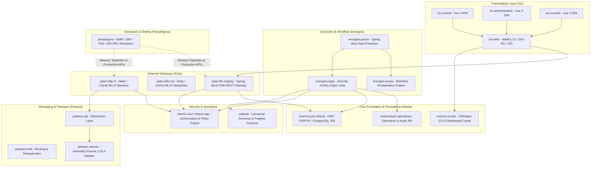
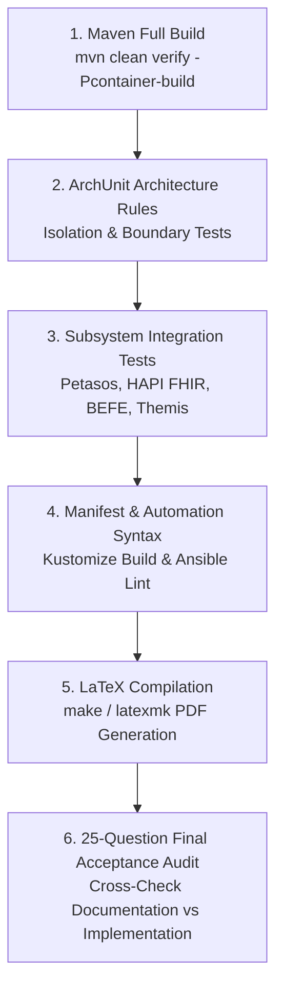

# Requirements

### Overview & Goals
Harmonia is a modular, high-performance Health Integration Environment (HIE) and interoperability platform uniting presentation services (Iris), protocol gateways (Pylai), workflow and task processing (Ponos/Erga/Praxis), resilient messaging (Petasos), in-memory caching (Mneme), durable persistence (Mnemosyne), security policy governance (Themis), canonical schemas (Calliope), and synthetic clinical simulation (Paradeigma).

This initiative executes an **agent-level, repository-wide architectural convergence and documentation baseline**. The primary goal is to reconcile the actual codebase implementation, deployment infrastructure, architectural intent, and technical documentation into an authoritative, single source of truth prior to localized capability development.

### Phased Execution Protocol & Review Gate
In accordance with Part B of the project specification, this task operates under a **Mandatory Review Gate**:
- **Phase 1 (Discovery & Analysis)**: Deep inspection of all Maven modules, container definitions, Kubernetes manifests, Ansible playbooks, configuration classes, tests, and documentation. Produces the complete System Inventory, Discrepancy Register, and Remediation Plan. **Execution stops here for explicit review and approval.**
- **Phase 2 (Remediation & Baseline Construction)**: Executed ONLY after explicit user approval. Fixes approved implementation/documentation defects, adds automated ArchUnit guardrails, updates repository AGENTS.md, reconstructs Markdown documentation, expands the formal LaTeX reference book, and completes baseline verification.

### Sources of Truth & Classification Standards
All findings, components, and capabilities across the platform are evaluated and classified under four mutually exclusive categories:
1. `IMPLEMENTED`: Functionality verified in Java/TypeScript source code and covered by tests.
2. `CONFIGURED`: Infrastructure, container, Kubernetes, or Ansible settings declared and wired in deployment descriptors.
3. `DOCUMENTED`: Architectural descriptions, specifications, diagrams, or requirements present in Markdown or LaTeX.
4. `DESIGNED/PLANNED`: Architectural intent or roadmap capabilities intended for future implementation, never to be conflated with implemented code.

### Scope Boundaries
#### In Scope
- Comprehensive audit of all 8 core subprojects: `calliope`, `themis`, `hestia`, `iris`, `pylai`, `energeia`, `petasos`, `paradeigma` across 41 Maven modules.
- Deployment artifact auditing across `docker-compose.yml`, 15 Dockerfiles, Kubernetes Kustomize bases/overlays, and Ansible automation roles.
- Middleware verification for ActiveMQ Artemis 2.33.0 (clustering & HA replication), Infinispan 15.0.3 (Hot Rod / JGroups), PostgreSQL 16 (HAPI FHIR R5 JPA & Operations), WildFly 31.0.1, Spring Boot 3.2.5, Nginx, and single-node MicroK8s semantics.
- Auditing and remediating known architectural gaps (e.g. REC-001 dual-write ingress, REC-002 fan-out sub-status, Petasos API encapsulation, Iris-administration vs Provider Registry decoupling).
- Creation and expansion of repository `AGENTS.md` and module-level architecture rules.
- Automated ArchUnit test suite additions for architectural boundary enforcement.
- Complete reconstruction of repository Markdown (`docs/`) and formal LaTeX publication (`docs/latex/`).

#### Out of Scope
- Unreviewed architectural redesign or arbitrary refactoring during Phase 1.
- Introduction of new runtime middleware technologies not already part of the Harmonia architecture.
- Replacing single-node MicroK8s reference deployment with multi-node orchestration platforms in Phase 1/2.
- Implementing unapproved features beyond approved defect remediation.

### User Stories & Acceptance Criteria
- **As a Harmonia Platform Engineer**, I want an authoritative System Inventory and Configuration Register so that I can deploy, configure, and operate a conformant Harmonia cluster on Ubuntu MicroK8s without guessing hidden parameters.
- **As a Core Subsystem Developer**, I want clear module ownership boundaries, decoupled APIs, and automated ArchUnit architecture tests so that future changes cannot violate architectural invariants (such as production depending on Paradeigma or UI accessing internal databases directly).
- **As a Clinical Integration Architect**, I want a comprehensive LaTeX Architecture & Deployment Reference and synchronized Markdown documentation so that all message flows, security policies, storage lifecycles, and failure recovery semantics are mathematically and architecturally verifiable.

# Technical Design

### Conceptual Architecture & Module Hierarchy
Harmonia structures its platform capabilities into cleanly separated conceptual domains:



---

### Architectural Invariants & Boundary Rules
1. **Petasos Messaging Invariant**:
   - `petasos-api` contains pure Java abstractions (`Petasos`, `PetasosProducer`, `PetasosConsumer`, `PetasosMessage`, `PetasosDestination`).
   - Payloads are treated as opaque binary/text streams (`byte[]`). Petasos never parses FHIR or HL7 business content.
   - Zero Apache ActiveMQ Artemis or JMS classes are exposed in `petasos-api`. Artemis client libraries are strictly contained in `petasos-artemis`.
   - Message durability (Artemis journal) is strictly distinct from application state persistence (Mnemosyne PostgreSQL).

2. **Iris-Administration & Provider Registry Invariant**:
   - `iris-administration` is a presentation client (Vue 3 SPA) consuming FHIR REST APIs provided by `pylai-fhir-registry` and `iris-befe`.
   - `iris-administration` MUST NOT implement Provider Registry persistence, authoritative validation, state machines, referential integrity, or FHIR lifecycle management.
   - Authoritative Provider Registry governance is owned server-side by `mnemosyne-clinical` (HAPI FHIR R5 JPA), `energeia-erga` (`AbstractProviderRegistryChangeErgon`), and `themis-core` (`ProviderRegistry*Policy`).

3. **Paradeigma Isolation Invariant**:
   - `Paradeigma` $\rightarrow$ `Production APIs` is permitted for scenario driving and simulation.
   - `Production Code` $\rightarrow$ `Paradeigma` is strictly **forbidden**.
   - Production modules must never import `net.fhirfactory.harmonia.paradeigma.*`, declare Maven dependencies on Paradeigma, contain runtime simulation flags (`paradeigmaMode`, `simulationMode`, `syntheticRequest`), or package test simulators into production containers.

4. **Security & Authorization Invariant (Themis)**:
   - Server-side default-deny policy enforcement across all ingress gates, Petasos queue consumers, Ergon activity executors, and Mnemosyne storage layers.
   - UI visibility restrictions in Iris SPAs are convenience only, never treated as authorization.
   - Context propagation uses immutable `PragmaSecurityContext` serialized into FHIR Task extensions.

---

### Middleware Topologies & Stateful Infrastructure
- **Apache ActiveMQ Artemis 2.33.0 (Petasos HA)**:
  - 4 broker pods: `artemis-primary-a` & `artemis-backup-a` (replicated journal `group-a`), `artemis-primary-b` & `artemis-backup-b` (replicated journal `group-b`).
  - Symmetric server-side clustering (`petasos-cluster`) with `ON_DEMAND` load balancing and instant redistribution (`redistribution-delay: 0`).
  - Dedicated storage volumes per broker node (`./data/journal`, `./data/bindings`, `./data/paging`, `./data/large-messages`).
- **Infinispan 15.0.3 (Mneme Distributed Cache)**:
  - Clustered StatefulSets (`infinispan-1`, `infinispan-2`) using JGroups TCP cluster discovery.
  - Hot Rod protocol client connections for high-speed ephemeral operational state (`task-sequences`, `active-pragmas`, `module-status`).
  - Strict classification: Mneme is an operational cache, not durable authoritative storage.
- **PostgreSQL 16 & HAPI FHIR R5 (Mnemosyne Persistence)**:
  - Clinical database (`postgres-1`, `postgres-2` / `fhir_node_1`, `fhir_node_2`) for FHIR R5 JPA storage (`hie_fhir_resources`, search parameters, provenance).
  - Operations database (`postgres-ops-1`, `postgres-ops-2` / `ops_node_1`, `ops_node_2`) for workflow audit, task histories, and governance state (`hie_operations_resources`).
- **Single-Node MicroK8s Semantics**:
  - Distinguishes workload/process resilience (pod self-healing, rolling updates, replica management, CoreDNS discovery) from host-level high availability.
  - Single-node Ubuntu host failure remains a physical failure domain; HA clustering provides process isolation, storage fencing, and graceful recovery.

# System Model & Inventories

### System Inventory Matrix

| Concept | Capability | Maven Module | Maven Artifact | Runtime Process | Container Image | K8s Workload | Default Ports | Persistence / Middleware |
| :--- | :--- | :--- | :--- | :--- | :--- | :--- | :--- | :--- |
| **Calliope** | Canonical Schemas | `calliope` | `calliope` | Library | N/A | Embedded | N/A | None (In-memory schemas) |
| **Themis** | Policy & Auth | `themis/themis-core` | `themis-core` | Library / Service | N/A | Embedded | N/A | Policy engine / In-memory |
| **Themis** | Audit Logging | `themis/themis-audit` | `themis-audit` | Library / Service | N/A | Embedded | N/A | Non-PHI audit event stream |
| **Petasos** | Messaging API | `petasos/petasos-api` | `petasos-api` | Library | N/A | Embedded | N/A | Transport abstraction |
| **Petasos** | Core Routing | `petasos/petasos-core` | `petasos-core` | Library | N/A | Embedded | N/A | Dedup sliding window cache |
| **Petasos** | Artemis Adapter | `petasos/petasos-artemis`| `petasos-artemis` | Library / Driver | N/A | Embedded | N/A | Artemis Core JMS Client |
| **Petasos** | Broker Nodes | Deployment | `artemis` | Java / Artemis Broker | `activemq-artemis:2.33.0` | StatefulSet (`artemis-*`) | 61616-61619 (Core), 8161 (Console) | Dedicated HostPath PVC (Journal) |
| **Pylai** | Inbound MLLP | `pylai/pylai-mllp-in` | `pylai-mllp-in` | Spring Boot / Netty | `pylai-mllp-in` | Deployment (`pylai-mllp-in`) | 2575 (MLLP), 8080 (HTTP) | Petasos Queue Producer |
| **Pylai** | Outbound MLLP | `pylai/pylai-mllp-out` | `pylai-mllp-out` | Spring Boot / Netty | `pylai-mllp-out` | Deployment (`pylai-mllp-out`) | 8080 (HTTP) | Petasos Queue Consumer |
| **Pylai** | FHIR REST Gateway | `pylai/pylai-fhir-registry`| `pylai-fhir-registry`| Spring Boot / REST | `mnemosyne-clinical` | Deployment / StatefulSet | 8080 (HTTP) | HAPI FHIR / PostgreSQL |
| **Energeia** | Ergon Activities | `energeia/erga` | `erga` | Library | N/A | Embedded | N/A | Activity definitions |
| **Energeia** | Workflow Engine | `energeia/praxis` | `praxis` | Library | N/A | Embedded | N/A | Workflow orchestration |
| **Energeia** | Task Processor | `energeia/ponos` | `ponos` | Spring Boot Worker | `ponos` | Deployment (`ponos`) | 8080 (HTTP Actuator) | Petasos Consumer / Mneme / Mnemosyne |
| **Hestia** | Mneme Cache | `hestia/mneme-cluster` | `mneme-cluster` | Infinispan Server | `mneme-cluster` | StatefulSet (`infinispan-*`) | 11222 (Hot Rod), 7800 (JGroups) | In-Memory / Ephemeral State |
| **Hestia** | Mnemosyne Clinical | `hestia/mnemosyne-clinical`| `mnemosyne-clinical` | Spring Boot HAPI FHIR | `mnemosyne-clinical` | StatefulSet (`mnemosyne-clinical`)| 8080 (HTTP) | PostgreSQL (`fhir_node_*`) |
| **Hestia** | Mnemosyne Ops | `hestia/mnemosyne-operations`| `mnemosyne-operations` | Spring Boot JPA | `mnemosyne-operations` | StatefulSet (`mnemosyne-operations`)| 8080 (HTTP) | PostgreSQL (`ops_node_*`) |
| **Iris** | BEFE Service | `iris/iris-befe` | `iris-befe` | WildFly 31 (WAR) | `iris-befe` | Deployment (`iris-befe`) | 8080 (HTTP), 9990 (Admin) | Hot Rod Client / Mneme |
| **Iris** | Clinical SPA | `iris/iris-clinical` | `iris-clinical` | Nginx Static SPA | `iris-clinical` | Deployment (`iris-clinical`) | 80 (HTTP) | Web Browser Client |
| **Iris** | Console SPA | `iris/iris-console` | `iris-console` | Nginx Static SPA | `iris-console` | Deployment (`iris-console`) | 80 (HTTP) | Web Browser Client |
| **Iris** | Admin SPA | `iris/iris-administration` | `iris-administration` | Nginx Static SPA | `iris-administration` | Deployment (`iris-administration`)| 80 (HTTP) | Web Browser Client |

---

### Port & Protocol Register

| Port | Protocol | Component | Traffic Flow | Purpose |
| :--- | :--- | :--- | :--- | :--- |
| **80 / 443** | HTTP / HTTPS | Ingress Controller | Ingress $\rightarrow$ Iris SPAs & BEFE | Public Web and REST endpoints |
| **2575** | HL7 MLLP over TCP | `pylai-mllp-in` | External EMR/PAS $\rightarrow$ Gateway | Inbound HL7 v2 (ADT, ORM, ORU) messages |
| **61616** | Artemis Core / Netty | `artemis-primary-a` | Petasos Clients $\rightarrow$ Broker | Active messaging traffic for Group A |
| **61617** | Artemis Replication | `artemis-backup-a` | Primary A $\rightarrow$ Backup A | HA Journal synchronous replication |
| **61618** | Artemis Core / Netty | `artemis-primary-b` | Petasos Clients $\rightarrow$ Broker | Active messaging traffic for Group B |
| **61619** | Artemis Replication | `artemis-backup-b` | Primary B $\rightarrow$ Backup B | HA Journal synchronous replication |
| **5432** | PostgreSQL Native | `postgres-1` | `mnemosyne-clinical` $\rightarrow$ DB | Clinical FHIR R5 database instance 1 |
| **5433** | PostgreSQL Native | `postgres-2` | `mnemosyne-clinical` $\rightarrow$ DB | Clinical FHIR R5 database instance 2 |
| **5434** | PostgreSQL Native | `postgres-ops-1` | `mnemosyne-operations` $\rightarrow$ DB | Operations database instance 1 |
| **5435** | PostgreSQL Native | `postgres-ops-2` | `mnemosyne-operations` $\rightarrow$ DB | Operations database instance 2 |
| **11222** | Infinispan Hot Rod | `mneme-cluster` | `iris-befe` / `ponos` $\rightarrow$ Cache | Binary RPC cache operations |
| **7800** | JGroups TCP | `mneme-cluster` | Cluster Peer $\leftrightarrow$ Peer | Cache cluster membership & replication |
| **8080** | HTTP REST | Spring Boot / WildFly | Internal Cluster Services | Microservice REST, Actuator & Health checks |

---

### Normal vs Paradeigma Deployment Matrix

| Dimension | Normal Production Deployment | Paradeigma Simulation Deployment |
| :--- | :--- | :--- |
| **Workload Scope** | Normal production services only (`pylai`, `energeia`, `hestia`, `iris`, `petasos`) | Normal production services + 5 synthetic generator workloads (`emr`, `lms`, `pas`, `rispac`, `scenarios`) |
| **Synthetic Generators** | Excluded | Deployed as independent client containers generating simulated traffic |
| **Target Endpoints** | Production hospital clinical systems | Inbound gateways (`pylai-mllp-in`:2575, `pylai-fhir-registry`:8080) |
| **Data Separation** | Authoritative real-world patient and provider data | Synthetic personas, deterministic identifiers, isolated test databases |
| **Production Coupling** | Zero Paradeigma code or configuration | Paradeigma calls standard external protocol endpoints (MLLP/REST) |
| **Failure Injection** | Disabled | Programmable latency, network partitions, corrupted payloads, NACK testing |

# Discrepancy Analysis & Remediation

### Discrepancy Classification & Identification Register

| ID | Area | Classification | Intended Architecture | Actual Implementation / Documentation | Evidence | Recommended Action | Affected Modules |
| :--- | :--- | :--- | :--- | :--- | :--- | :--- | :--- |
| **HARM-CON-001** | Paradeigma Isolation | `CONFORMANT` | Production modules must not depend on or import Paradeigma. | Automated tests enforce no imports, no POM dependencies, and no packaging leaks. | `ParadeigmaIsolationArchitectureTest.java` (ArchUnit + POM + Source checks) | Maintain automated ArchUnit tests in regular build pipeline. | `paradeigma-test`, All core modules |
| **HARM-CON-002** | Petasos Artemis Decoupling | `CONFORMANT` | `petasos-api` must be independent of Artemis/JMS types. | `petasos-api` POM and Java contracts contain zero Artemis/JMS dependencies. | `petasos-api/pom.xml`, `Petasos.java` | Maintain clean separation; add ArchUnit rule guarding `petasos-api`. | `petasos-api`, `petasos-artemis` |
| **HARM-CON-003** | Iris-Administration Role | `CONFORMANT` | `iris-administration` is a Vue SPA client, not Provider Registry engine. | `iris-administration` contains Vue 3 frontend components making REST API calls to gateway. | `iris/iris-administration/src/api/providerRegistryClient.ts` | Ensure no backend business logic or DB drivers are ever introduced into Iris. | `iris-administration`, `mnemosyne-clinical` |
| **HARM-DEF-001** | Dual-Write Ingress Window (REC-001) | `IMPLEMENTATION DEFECT` | Inbound gateways must guarantee message persistence before sending `AA` ACK. | Inbound MLLP processor returns `AA` even if downstream Petasos publish throws an exception. | `IncomingAdtMessageProcessor.java`, `docs/persistence-recovery-gaps.md` | Catch Petasos send failure and return HL7 `AE` (Application Error) NACK to trigger upstream retry. | `pylai-mllp-in` |
| **HARM-DEF-002** | Destination Fan-Out State (REC-002) | `IMPLEMENTATION DEFECT` | Parent Task in Mnemosyne tracks granular delivery status for each outbound fan-out destination. | Only macro workflow status is tracked; destination-level delivery status requires querying individual Provenance records. | `AdtDistributionErgon.java`, `OutboundStateLifecycleManager.java` | Extend `Pragma`/Task outputs with structured destination delivery checkpoints. | `energeia-erga`, `pylai-mllp-out` |
| **HARM-DOC-001** | Iris Submodule Terminology | `DOCUMENTATION DEFECT` | Presentation modules documented as `iris-clinical`, `iris-console`, `iris-administration`, `iris-befe`. | Some legacy LaTeX sections and notes refer to `iris-monitor` instead of `iris-console`. | `iris/pom.xml` (`iris-console`), `docs/latex/chapters/03-application-layer.tex` | Standardize documentation on `iris-console` across all Markdown and LaTeX chapters. | `docs/`, `docs/latex/` |
| **HARM-DOC-002** | LaTeX Reference Completeness | `DOCUMENTATION DEFECT` | LaTeX specification must provide complete 8-part reference manual with registers. | Existing LaTeX is version 0.5.0 with partial appendixes and missing comprehensive registers. | `docs/latex/main.tex` | Restructure and expand LaTeX document to complete publication-ready reference. | `docs/latex/` |
| **HARM-DEC-001** | Distributed Task Lease (REC-003) | `ARCHITECTURE DECISION REQUIRED` | Worker failure detection should use distributed lease locks in Infinispan or rely on Artemis consumer session timeout. | Currently relies solely on unacknowledged JMS consumer session timeouts. | `docs/persistence-recovery-gaps.md` | Review whether to add active Infinispan distributed lease locks or maintain JMS session timeouts. | `energeia-ponos`, `hestia-mneme` |
| **HARM-DEC-002** | Automated Startup DB Recovery Scan (REC-004) | `ARCHITECTURE DECISION REQUIRED` | Cold start should either actively scan DB for orphaned non-terminal tasks or rely on persistent Artemis journal replay. | Ponos currently relies solely on Artemis journal message persistence. | `docs/persistence-recovery-gaps.md` | Review whether to add a scheduled startup reconciliation scanner in Ponos. | `energeia-ponos`, `mnemosyne-clinical` |

---

### Automated Architecture Guardrails (ArchUnit)
Phase 2 establishes automated architectural enforcement rules:
1. `HarmoniaParadeigmaIsolationTest`: Asserts zero production dependencies or references to `net.fhirfactory.harmonia.paradeigma..`.
2. `HarmoniaPetasosApiIsolationTest`: Asserts zero `org.apache.activemq..` or `jakarta.jms..` imports within `net.fhirfactory.harmonia.petasos.api..`.
3. `HarmoniaIrisDecouplingTest`: Asserts zero direct JPA/Hibernate or database driver dependencies within Iris UI/BEFE modules.
4. `HarmoniaSecurityEnforcementTest`: Asserts all ingress gateway endpoints and persistence mutators invoke `ThemisPolicy` or `ThemisService` authorization checks.
5. `HarmoniaPackageLayeringTest`: Enforces strict unidirectional layering: `calliope` $\leftarrow$ `themis` $\leftarrow$ `hestia` $\leftarrow$ `petasos` $\leftarrow$ `energeia` $\leftarrow$ `pylai` $\leftarrow$ `iris`.

# Documentation Architecture

### Markdown Information Architecture (`docs/`)
The repository documentation will be reorganized into a clean, hierarchical structure:

```
docs/
├── README.md                                 # Platform overview, navigation index & quick start
├── AGENTS.md                                 # Repository-wide architectural guardrails for AI agents
├── architecture/
│   ├── overview.md                           # Multi-tier architectural concepts & principles
│   ├── system-inventory.md                   # Authoritative component & module inventory
│   ├── port-protocol-register.md             # Complete network port and protocol bindings
│   ├── failure-recovery.md                   # Failure matrix, ACK semantics & recovery procedures
│   └── persistence-lifecycle.md              # 4-tier storage architecture & transaction boundaries
├── concepts/
│   ├── petasos-messaging.md                  # Transport abstraction, Artemis HA & clustering
│   ├── energeia-workflow.md                  # Ponos, Ergon, Praxis & Pragma workflow execution
│   ├── hestia-persistence.md                 # Mneme (Infinispan) & Mnemosyne (PostgreSQL / FHIR)
│   ├── pylai-gateways.md                     # MLLP and FHIR REST protocol gateways
│   ├── themis-security.md                    # Default-deny authorization, roles, authorities & audit
│   └── calliope-canonical.md                 # Canonical models, schema definitions & envelopes
├── deployment/
│   ├── microk8s-reference-guide.md           # Ubuntu single-node MicroK8s reference deployment
│   ├── configuration-register.md             # Complete environment variable & property register
│   ├── kubernetes-workloads.md               # Kustomize base & overlay resource specifications
│   └── ansible-orchestration.md              # Playbooks, roles, vault secrets & undeploy workflows
├── paradeigma/
│   ├── simulation-framework.md               # Synthetic clinical data & scenario architecture
│   ├── deployment-guide.md                   # Paradeigma container workloads & runbooks
│   └── isolation-invariants.md               # Production isolation rules & verification tests
└── operations/
    ├── phi-sanitized-logging.md              # Zero-PHI logging invariants & diagnostic formats
    ├── health-readiness.md                   # Probe configurations, metrics & monitoring endpoints
    └── verification-runbook.md               # End-to-end integration and smoke testing runbooks
```

---

### Expanded LaTeX Architecture Reference Book (`docs/latex/`)
The formal LaTeX publication (`main.tex`) will be restructured into 8 major Parts and 9 Appendices:

- **PART I: Foundations and Concepts**
  - Chapter 1: Platform Motivation, HIE Context & Architectural Principles
  - Chapter 2: Conceptual Taxonomy (Hestia, Pylai, Petasos, Energeia, Mneme, Mnemosyne, Calliope, Themis, Iris, Paradeigma)
  - Chapter 3: Information Architecture & Standard Message Envelopes
- **PART II: Platform Capabilities and Modules**
  - Chapter 4: External Gateways (Pylai MLLP In/Out, FHIR Registry Gateway)
  - Chapter 5: Messaging & Event Transport (Petasos Core, Artemis Adapter)
  - Chapter 6: Workflow & Task Processing Engine (Ponos, Ergon, Praxis, Pragma)
  - Chapter 7: Presentation Services & User Interfaces (Iris BEFE, Clinical, Console, Administration)
- **PART III: Middleware Architecture**
  - Chapter 8: Apache ActiveMQ Artemis Topology (Clustering, Journal Replication & Message Deduplication)
  - Chapter 9: Infinispan Distributed Cache Grid (Hot Rod, JGroups & Cache Modes)
  - Chapter 10: PostgreSQL & HAPI FHIR R5 Persistence Architecture
- **PART IV: Runtime Architecture**
  - Chapter 11: Container Packaging, WildFly & Spring Boot Runtime Profiles
  - Chapter 12: MicroK8s Pod Scheduling, Services & Ingress Routing
  - Chapter 13: Single-Node Resilience vs Host-Level Availability
- **PART V: Configuration Architecture**
  - Chapter 14: Declarative Configuration Hierarchy (Environment, ConfigMaps, Secrets, Vault)
  - Chapter 15: Configuration Register & Property Cross-Reference
- **PART VI: Normal Deployment Architecture**
  - Chapter 16: Ubuntu Host Preparation, Prerequisites & MicroK8s Add-ons
  - Chapter 17: Normal Workload Deployment & Verification Runbook
  - Chapter 18: Safe Undeployment & Persistent Storage Retention Mechanics
- **PART VII: Paradeigma Architecture & Deployment**
  - Chapter 19: Synthetic Clinical Generators & Multi-System Scenario Framework
  - Chapter 20: Paradeigma Workload Deployment & Isolation Guardrails
- **PART VIII: Security, Logging, and Operations**
  - Chapter 21: Themis Policy Evaluation, Default-Deny & Authorization Boundaries
  - Chapter 22: PHI-Sanitized Logging & Audit Lineage Tracking
  - Chapter 23: Failure Scenarios, Recovery Guarantees & Health Probes
- **APPENDICES**
  - Appendix A: Authoritative Harmonia System Inventory
  - Appendix B: Configuration Parameter Register
  - Appendix C: Port and Network Protocol Register
  - Appendix D: Container Image & Dockerfile Register
  - Appendix E: Kubernetes Resource Register
  - Appendix F: Middleware Capability Matrix
  - Appendix G: Module Dependency Matrix
  - Appendix H: Normal Deployment Checklist
  - Appendix I: Paradeigma Simulation Deployment Checklist

---

### TikZ Vector Diagrams
The LaTeX document will integrate authoritative, publication-quality TikZ vector diagrams:
1. `fig-conceptual-layers.tex`: Conceptual stack (Iris $\rightarrow$ Pylai $\rightarrow$ Energeia $\rightarrow$ Petasos $\rightarrow$ Hestia / Themis / Calliope).
2. `fig-5tier-deployment-topology.tex`: Physical MicroK8s 5-tier deployment architecture and add-on mapping.
3. `fig-petasos-artemis-ha.tex`: Artemis symmetric clustering (`petasos-cluster`) and paired journal replication (`group-a`, `group-b`).
4. `fig-mneme-cache-grid.tex`: Infinispan Hot Rod client topology and JGroups cluster discovery.
5. `fig-themis-security-pipeline.tex`: 4-gate defence-in-depth authorization flow (Ingress, Dispatch, Activity, Storage).
6. `fig-iris-federation.tex`: Iris presentation architecture (SPAs, BEFE, Hot Rod, REST gateways).
7. `fig-normal-vs-paradeigma.tex`: Normal vs Paradeigma deployment boundary and isolation seams.

# Testing & Verification

### Validation & Testing Strategy
To guarantee platform convergence and prevent regression, verification is conducted across multiple layers:



---

### Automated Validation Suites
1. **Full Maven Build & Tests**:
   - `mvn clean test`: Executes all unit tests across 41 Maven modules.
   - `mvn test-compile`: Verifies strict Java 21 compilation and dependency resolutions.
   - Container profiles (`-Pcontainer-build`): Validates container image build scripts.
2. **ArchUnit Architecture Test Suite**:
   - `ParadeigmaIsolationArchitectureTest`: Asserts zero production dependencies on Paradeigma, no forbidden imports, and clean packaging.
   - `PetasosApiIsolationArchitectureTest`: Asserts zero Artemis/JMS types in `petasos-api`.
   - `IrisDecouplingArchitectureTest`: Asserts presentation layers do not import storage or persistence classes.
   - `ProviderRegistryArchitectureTest`: Asserts `iris-administration` has zero database or HAPI FHIR server dependencies.
3. **Deployment Descriptors Validation**:
   - `kustomize build deployment/kubernetes/environments/microk8s`: Verifies Kubernetes YAML syntax, resource references, and patch validity.
   - Ansible playbook syntax check across `prepare-microk8s.yml`, `deploy-harmonia.yml`, and `undeploy-harmonia.yml`.
4. **LaTeX Compilation**:
   - Compile `docs/latex/main.tex` via `latexmk -pdf` / `make`.
   - Ensure zero fatal compilation errors, resolved citations/cross-references, and clean formatting.

---

### 25-Point Final Acceptance Questionnaire
The convergence exercise will be validated against the 25 core architectural questions:
1. What is Harmonia? (HIE / interoperability platform)
2. What are its major architectural concepts? (Hestia, Pylai, Petasos, Energeia, Mneme, Mnemosyne, Calliope, Themis, Iris, Agora, Paradeigma)
3. What capability does each module own? (Documented in System Inventory)
4. What does each module explicitly NOT own? (Defined in module documentation)
5. Which middleware technologies are used? (Artemis 2.33, Infinispan 15.0, PostgreSQL 16, HAPI FHIR R5, WildFly 31, Spring Boot 3.2, Nginx, MicroK8s)
6. Which exact middleware capabilities does Harmonia rely upon? (Documented in Middleware Capability Matrix)
7. What is deployed in a normal Harmonia instance? (Enumerated in Normal Deployment Register)
8. What container implements each capability? (Mapped in Container Image Register)
9. What Kubernetes resource deploys it? (Mapped in Kubernetes Resource Register)
10. What infrastructure configuration does it require? (Documented in Configuration Register)
11. What application/code configuration does it require? (Documented in Configuration Register)
12. What ports and protocols are used? (Documented in Port/Protocol Register)
13. What queues exist and why? (Documented in Petasos/Artemis Topology)
14. What caches exist and what do they contain? (Documented in Mneme Topology)
15. What databases/persistence exist? (Documented in Mnemosyne Architecture)
16. What secrets are required? (Documented in Vault/Secret Register)
17. How are components secured? (Documented in Themis Defence-in-Depth Specification)
18. How does service discovery work? (Documented in CoreDNS & K8s Services Specification)
19. How does Harmonia start and recover? (Documented in Failure Recovery Guide)
20. How does single-node MicroK8s affect availability? (Documented in MicroK8s Resilience Guide)
21. What exactly constitutes a Paradeigma deployment? (Documented in Paradeigma Deployment Guide)
22. What additional components does Paradeigma introduce? (Documented in Normal vs Paradeigma Matrix)
23. How does Paradeigma configuration differ? (Documented in Configuration Register)
24. How is Paradeigma prevented from contaminating production? (Enforced via ArchUnit Tests)
25. How is either deployment verified? (Documented in Verification Runbooks)

# Delivery Steps

### * Step 1: Execute Phase 1 Discovery, System Model Reconstruction, and Discrepancy Register Generation
Execute the complete repository discovery and audit across all 8 subprojects (Calliope, Themis, Hestia, Iris, Pylai, Energeia, Petasos, Paradeigma), container specifications, Kubernetes manifests, Ansible automation, and existing Markdown/LaTeX documentation.

- Reconstruct the actual implementation model mapping Concept $\rightarrow$ Capability $\rightarrow$ Module $\rightarrow$ Maven Artifact $\rightarrow$ Runtime Process $\rightarrow$ Container Image $\rightarrow$ Kubernetes Workload $\rightarrow$ Service $\rightarrow$ Ports $\rightarrow$ Configuration $\rightarrow$ Middleware Dependency $\rightarrow$ Persistence.
- Perform the Architectural Concept Audit across Hestia, Pylai, Petasos, Energeia (Ponos/Ergon/Praxis/Pragma), Mneme (Infinispan), Mnemosyne (PostgreSQL/HAPI FHIR), Calliope, Themis, Iris (iris-clinical, iris-console, iris-administration, iris-befe), Agora, and Paradeigma.
- Conduct middleware and topology audits for ActiveMQ Artemis HA clustering, Infinispan cache modes/Hot Rod, PostgreSQL schemas/PVCs, WildFly/Spring Boot runtimes, and single-node MicroK8s resilience semantics.
- Audit source and Maven dependency graphs, verifying isolation between production and Paradeigma, Iris-administration decoupling from Provider Registry, and Petasos API isolation from Artemis internals.
- Compile the authoritative Discrepancy Register classifying every finding as `CONFORMANT`, `DOCUMENTATION DEFECT`, `IMPLEMENTATION DEFECT`, or `ARCHITECTURE DECISION REQUIRED`.
- Present the complete Phase 1 deliverable and stop at the mandatory review gate for explicit user approval before any code or documentation changes.

### ✓ Step 2: Remediate Approved Defects and Establish Automated Architecture Guardrails
Apply approved fixes for identified implementation and documentation defects, establish repository-level AGENTS.md guardrails, and implement automated ArchUnit architecture tests to prevent regression.

- Correct approved `IMPLEMENTATION DEFECT` findings (e.g. REC-001 dual-write ingress handling in `pylai-mllp-in`, REC-002 fan-out sub-status in `erga`/`pylai-mllp-out`, and any Petasos API abstraction leaks).
- Establish repository-wide `AGENTS.md` and module-specific architectural guidance defining component boundaries, dependency directions, security invariants, and PHI logging policies.
- Extend ArchUnit automated architecture tests (`ParadeigmaIsolationArchitectureTest` and new tests) to continuously enforce:
  - Zero production $\rightarrow$ Paradeigma dependencies or imports.
  - Zero Provider Registry $\rightarrow$ `iris-administration` dependencies.
  - Strict UI decoupling (`iris-befe` and SPAs from internal backend storage).
  - Petasos public API cleanliness from Artemis/JMS implementation types.
  - Proper unidirectional dependency flows between domain, core, gateway, and deployment modules.
- Re-run full Maven builds and unit/integration test suites across all 41 modules to verify zero functional regressions.

### ✓ Step 3: Establish Authoritative System Inventory and Reconstruct Markdown Documentation
Construct the durable Harmonia System Inventory and author a completely synchronized, multi-section Markdown engineering documentation suite.

- Publish the authoritative Harmonia System Inventory, Configuration Register, Port/Protocol Register, and Normal vs Paradeigma Deployment Matrix in Markdown.
- Restructure repository documentation under `docs/` into organized subdirectories: `architecture/`, `concepts/`, `modules/`, `middleware/`, `configuration/`, `deployment/`, `paradeigma/`, `operations/`, and `security/`.
- Document each module detailing: purpose, ownership boundaries, technical implementation, middleware interactions, deployment artifacts, configuration parameters, security policies, persistence, scaling/HA, failure recovery, verification commands, and Paradeigma simulation profile.
- Author the implementable Normal Reference Deployment Guide on Ubuntu/MicroK8s and the Paradeigma Simulation Environment Reference, specifying exact host prerequisites, add-on configurations, secrets management, and health/readiness endpoints.

### ✓ Step 4: Reconstruct and Expand LaTeX Architecture, Implementation, and Deployment Reference
Substantially restructure and expand the formal LaTeX architecture publication into the comprehensive Harmonia Architecture, Implementation, and Deployment Reference.

- Reorganize `docs/latex/main.tex` and chapter structure into Parts I through VIII (Foundations & Concepts, Platform Capabilities & Modules, Middleware Architecture, Runtime Architecture, Configuration Architecture, Normal Deployment Architecture, Paradeigma Simulation Architecture, Security/Logging/Operations) plus comprehensive Appendices (System Inventory, Configuration Register, Port Register, Container Register, Kubernetes Register, Middleware Matrix, Dependency Matrix, Deployment Checklists).
- Update and author high-quality TikZ architectural diagrams for conceptual layers, 5-tier deployment topology, Petasos/Artemis HA & clustering, Mneme distributed caching, Mnemosyne JPA persistence, Themis authorization pipeline, Iris UI federation, and Paradeigma scenario simulation.
- Reconcile all LaTeX tables, property references, queue names, cache configurations, container tags, and port definitions with actual codebase evidence.
- Build and compile the full LaTeX document (`make` / `latexmk`), eliminating syntax errors, missing citations, broken references, table overflow, and unreadable diagrams to produce the publication-grade PDF.

### * Step 5: Full Baseline Verification, Cross-Check, and Final Acceptance Audit
Perform comprehensive end-to-end verification across build systems, deployment descriptors, architecture rules, and documentation to validate final baseline convergence.

- Execute full root Maven build (`mvn clean verify -Pcontainer-build`) ensuring all unit, integration, and ArchUnit architecture tests pass cleanly across all modules.
- Validate Kubernetes manifests (`kustomize build deployment/kubernetes/environments/microk8s`) and Ansible playbook syntax across inventory environments.
- Cross-check every documented configuration property, port, queue, cache, database table, and container image against the actual source code and descriptors.
- Execute the 25-point Harmonia Final Acceptance Audit verifying that all architectural concepts, module ownership boundaries, middleware capabilities, normal deployment artifacts, and Paradeigma simulation controls are authoritatively documented and verifiable.
- Deliver the final convergence report summarizing architectural discrepancies, resolved defects, automated guardrails, documentation metrics, and build status.