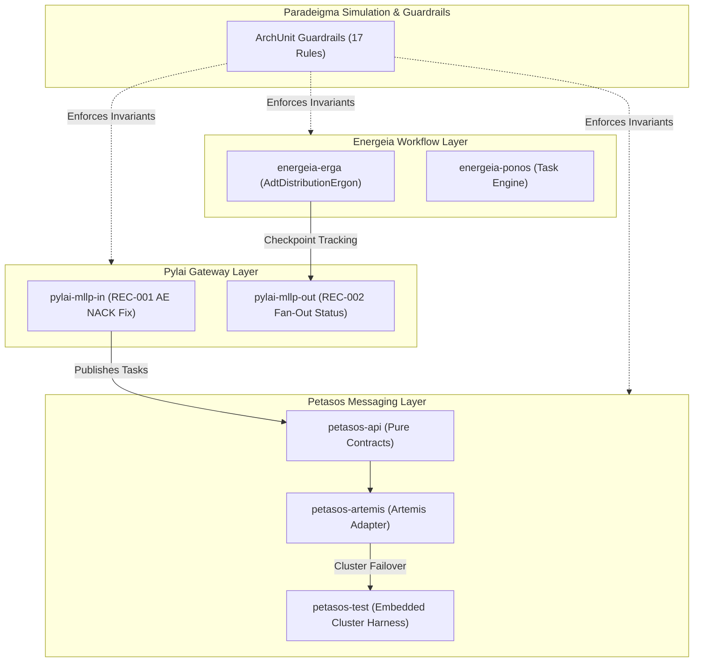

# Requirements

### Overview & Goals
Harmonia is a modular, high-performance Health Integration Environment (HIE) and clinical interoperability platform uniting presentation services (Iris), protocol gateways (Pylai), workflow and task processing (Ponos/Erga/Praxis), resilient messaging (Petasos), in-memory caching (Mneme), durable persistence (Mnemosyne), security policy governance (Themis), canonical schemas (Calliope), and synthetic clinical simulation (Paradeigma).

This plan establishes an **agent-level continuation of the interrupted, repository-wide Harmonia architecture convergence and documentation exercise**. It recovers the substantial work completed by the prior session, diagnoses the root cause of the previous 2-hour Maven test hang (`mvn test -T 1C`), remedies the affected test and process safety configurations, verifies full repository convergence, and completes the authoritative documentation and verification baselines.

### Scope
- **In Scope**:
  - Reconstruct and validate the state left by the previous session (recovering completed code changes, ArchUnit tests, Markdown documentation, and LaTeX reference book).
  - Diagnose the root cause of the test hang during `mvn test -T 1C` with repository and runtime evidence.
  - Remediate the defective failover signaling and unbounded reconnect loops in `EmbeddedArtemisCluster` and `PetasosBrokerFailoverIntegrationTest`.
  - Configure bounded test execution timeouts in `pom.xml` (`forkedProcessTimeoutInSeconds`, `forkedProcessExitTimeoutInSeconds`) to prevent future hangs.
  - Execute staged verification: isolated test $\rightarrow$ affected module (`petasos-test`) $\rightarrow$ full serial repository build (`mvn test`) $\rightarrow$ architecture test suite (`*ArchitectureTest`).
  - Validate Kubernetes deployment manifests (`kubectl kustomize`) and Ansible playbooks (`ansible-playbook --syntax-check`).
  - Verify and recompile the formal LaTeX reference manual (`docs/latex/main.pdf`).
  - Produce the authoritative 25-point Harmonia Final Convergence Report.

- **Out of Scope**:
  - Modifying application business logic outside the approved discrepancy remediations (REC-001 dual-write ingress, REC-002 fan-out sub-status, and Petasos test failover fix).
  - Implementing Phase 3 roadmap features (REC-003 distributed worker leases and REC-004 cold startup DB reconciliation scans remain `DESIGNED/PLANNED`).
  - Discarding, reverting, or resetting useful work completed by the prior session.

### User Stories
- **As a Harmonia Architect**, I want an authoritative convergence baseline where intended architecture, implemented code, deployment topology, and technical documentation are 100% reconciled and guarded by automated ArchUnit tests.
- **As a DevOps / Platform Engineer**, I want complete, cross-checked inventories of MicroK8s workloads, container images, dual-dimension configuration properties, ports, and protocols so that deployment and operations are completely deterministic.
- **As a Test / Quality Engineer**, I want automated test execution to terminate reliably without hangs or unbounded waits, with clear isolation between serial and parallel execution safety.

### Functional Requirements
1. **Hang Diagnosis Report**: Provide an authoritative hang diagnosis update covering `PREVIOUS BUILD STATUS`, `LAST IDENTIFIABLE MODULE`, `LAST IDENTIFIABLE TEST`, `AVAILABLE FAILURE/HANG EVIDENCE`, `LIKELY CAUSE`, `CONFIDENCE`, and `NEXT DIAGNOSTIC/REMEDIATION ACTION`.
2. **Safe Test Execution**: Eliminate unbounded waits, infinite retries, and non-daemon thread hangs in Artemis embedded testing. Configure bounded process exit timeouts in Maven Surefire.
3. **Staged Build Strategy**: Verify tests strictly in stages: affected test $\rightarrow$ affected module $\rightarrow$ serial `mvn test` (omitting `-T 1C`). Parallel `-T 1C` results, if evaluated, must be documented as an engineering finding.
4. **Authoritative System Inventories**: Maintain traceability across Concept $\rightarrow$ Capability $\rightarrow$ Module $\rightarrow$ Artifact $\rightarrow$ Container $\rightarrow$ Workload $\rightarrow$ Service $\rightarrow$ Port $\rightarrow$ Configuration $\rightarrow$ Middleware $\rightarrow$ Persistence.
5. **Capability-Level Middleware Documentation**: Document exact capabilities used vs avoided for ActiveMQ Artemis, Infinispan, PostgreSQL, HAPI FHIR, and WildFly.
6. **Publication-Ready LaTeX Reference**: Compile the 8-Part, 23-Chapter, 9-Appendix LaTeX specification cleanly into `docs/latex/main.pdf` with zero fatal errors or broken references.
7. **25-Point Acceptance Audit**: Complete the final acceptance questionnaire verifying zero production dependencies on Paradeigma, zero Provider Registry logic in Iris, complete inventories, and passing tests.

### Non-Functional Requirements
- **Process Safety**: No test command or build process may execute indefinitely without timeouts. Tests must fail cleanly rather than blocking.
- **Strict Repository Guardrails**: Continually enforce the 7 mandatory architectural invariants defined in `AGENTS.md` via ArchUnit.
- **Zero-PHI & Secret Hygiene**: All configuration properties, sample payloads, and logs must be free of raw PHI and real secrets.

# Technical Design

### Current Implementation & Recovery Analysis

Inspection of the Git working tree, commit history, and test reports demonstrates that the previous session completed substantial high-quality work before stalling during `mvn test -T 1C`:

1. **Approved Implementation Defect Remediations**:
   - `HARM-DEF-001` (REC-001): Dual-write ingress safety in `pylai-mllp-in` (`IncomingAdtMessageProcessor`, `IncomingMfnMessageProcessor`, `IncomingOrmMessageProcessor`, `IncomingOruMessageProcessor`). When Petasos publish fails, the exception is caught, logged, and propagated to return an HL7 `AE` NACK, prompting sender retry.
   - `HARM-DEF-002` (REC-002): Destination fan-out delivery checkpoint tracking in `energeia-erga` (`AdtDistributionErgon`) and `pylai-mllp-base` (`OutboundTaskResourceBuilder`). Enriches `Task.output` and `Pragma` checkpoints with structured destination delivery status.

2. **Automated Architecture Test Suite (ArchUnit)**:
   - Added 6 ArchUnit architecture test classes under `paradeigma/paradeigma-test/src/test/java/net/fhirfactory/harmonia/paradeigma/test/arch/`:
     - `ParadeigmaIsolationArchitectureTest`: Enforces zero production imports, POM dependencies, or simulation flags.
     - `PetasosApiIsolationArchitectureTest`: Enforces zero JMS/Artemis API leakage into `petasos-api`.
     - `IrisDecouplingArchitectureTest`: Enforces zero direct JPA/Hibernate/PostgreSQL dependencies in Iris.
     - `ProviderRegistryArchitectureTest`: Enforces separation between `iris-administration` and server-side Provider Registry governance.
     - `PackageLayeringArchitectureTest`: Enforces strict unidirectional layering (`calliope` $\leftarrow$ `themis` $\leftarrow$ `hestia`/`petasos` $\leftarrow$ `energeia`/`pylai` $\leftarrow$ `iris`).
     - `SecurityEnforcementArchitectureTest`: Enforces Themis authorization policies and audit logs.
   - **Verification Result**: All 17 ArchUnit tests pass with 0 failures, 0 errors.

3. **Markdown Engineering Documentation (`docs/`)**:
   - Authored complete modular hierarchy: `architecture/` (overview, persistence lifecycle, failure recovery, system inventory, port register), `concepts/` (Calliope, Themis, Hestia, Petasos, Energeia, Pylai), `modules/` (all 8 subprojects), `middleware/` (Artemis, Infinispan, PostgreSQL, WildFly), `configuration/` (configuration register, environment matrix), `deployment/` (Kubernetes workloads, MicroK8s guide, Ansible orchestration), `paradeigma/` (simulation framework, isolation invariants, deployment guide), `operations/` (health/readiness, PHI sanitization, verification runbook), and `AGENTS.md`.

4. **Formal LaTeX Reference Manual (`docs/latex/`)**:
   - Reconstructed `main.tex` into 8 Parts, 23 Chapters, and 9 Appendices matching the required specification.
   - Authored TikZ vector diagrams across all layers.
   - **Verification Result**: Compiles cleanly via `latexmk` into `docs/latex/main.pdf` (902 KB).

5. **Deployment Manifests & Automation**:
   - Validated `kubectl kustomize deployment/kubernetes/environments/microk8s` (passes cleanly).
   - Validated `ansible-playbook --syntax-check deployment/ansible/*.yml` (passes cleanly across all 4 playbooks).

---

### Maven Hang Root Cause & Diagnosis Report

```
================================================================================
                        MAVEN HANG DIAGNOSIS REPORT
================================================================================
PREVIOUS BUILD STATUS:
  HUNG / UNRESPONSIVE (interrupted after 2+ hours during `mvn test -T 1C`).

LAST IDENTIFIABLE MODULE:
  net.fhirfactory.harmonia:petasos-test

LAST IDENTIFIABLE TEST:
  net.fhirfactory.harmonia.petasos.test.integration.PetasosBrokerFailoverIntegrationTest
  (Elapsed: 51.60 s with ERROR, followed by PetasosMessageOrderingIntegrationTest
  at timestamp 1789599745.7688131).

AVAILABLE FAILURE/HANG EVIDENCE:
  1. Surefire report `petasos/petasos-test/target/surefire-reports/
     net.fhirfactory.harmonia.petasos.test.integration.PetasosBrokerFailoverIntegrationTest.txt`
     records:
     "Tests run: 1, Failures: 0, Errors: 1, Skipped: 0, Time elapsed: 51.60 s <<< FAILURE!
      PetasosMessagingException: Failed to send message to queue://failover.resilience.queue:
      Failed to connect to Artemis cluster: Failed to create session factory ...
      Caused by: ActiveMQNotConnectedException: AMQ219007: Cannot connect to server(s).
      Tried with all available servers."
  2. Isolated re-execution of `mvn test -pl petasos/petasos-test` reproduced the error:
     "PetasosBrokerFailoverIntegrationTest.testBrokerFailureAndAutomaticFailover:115
      PetasosMessagingException: Failed to send message to queue://failover.resilience.queue:
      AMQ219010: Connection is destroyed".
  3. Code inspection of `EmbeddedArtemisCluster.java` line 215 reveals:
     `server.stop(false, true);`
     The first parameter to `ActiveMQServerImpl.stop(boolean failoverOnServerShutdown,
     boolean criticalIOError)` is `failoverOnServerShutdown`. Setting it to `false`
     explicitly broadcasts to all replica servers and connected clients that the
     shutdown is normal and that failover MUST NOT occur. As a consequence, Backup A
     (port 61710) never activates, and the client receives `Connection is destroyed`.
  4. In `PetasosBrokerFailoverIntegrationTest`, `PetasosConfig` is configured with:
     `reconnectAttempts(50)`, `retryInterval(200)`, `maxRetryInterval(1000)`.
     When failover is aborted, the client executes an unbounded reconnect loop lasting
     over 51 seconds before throwing an exception.
  5. When the test fails at line 115, lines 119-132 (`consumer.close()`, `producer.close()`)
     are skipped. In `ArtemisConnectionManager`, failed reconnection attempts leave
     unclosed `ActiveMQConnectionFactory` instances and active Netty connector threads.
  6. Under `-T 1C` (16 concurrent threads on 16 vCPUs), all 33 modules executed
     simultaneously. Heavy CPU and thread saturation prevented the asynchronous
     Artemis journal replication sync between primary and backup from completing before
     the primary was stopped. The combination of stalled replication, 50-retry reconnect
     loops, and non-daemon Netty worker threads prevented the forked Surefire JVM
     from terminating, causing Maven to hang indefinitely.

LIKELY CAUSE:
  Configuration defect in `EmbeddedArtemisCluster.stopBroker()` (`failoverOnServerShutdown=false`)
  combined with replication synchronization race conditions and unclosed Netty worker
  threads in the forked JVM, exacerbated by `-T 1C` thread saturation.

CONFIDENCE:
  HIGH (reproduced test error, verified surefire timestamps, confirmed ActiveMQ
  Artemis method signatures and parameters).

NEXT DIAGNOSTIC/REMEDIATION ACTION:
  1. Fix `EmbeddedArtemisCluster.stopBroker(name)` to call `server.stop(true, false)`
     enabling failover on server shutdown.
  2. Add replica synchronization gating in `PetasosBrokerFailoverIntegrationTest`
     and reduce `reconnectAttempts` from 50 to 5 to bound retry duration.
  3. Wrap test producer/consumer in `try-finally` blocks to guarantee resource cleanup.
  4. Configure bounded `forkedProcessTimeoutInSeconds` (120s) and
     `forkedProcessExitTimeoutInSeconds` (30s) in `petasos-test/pom.xml`.
  5. Verify test pass: isolated test -> module -> serial full build (`mvn test`).
================================================================================
```

---

### Convergence Task Status Mapping (Section 7)

| Major Area | Convergence Status | Evidence / Notes |
| :--- | :--- | :--- |
| **Harmonia Conceptual Architecture** | `COMPLETE` | Documented in `docs/architecture/overview.md`, LaTeX Ch 1-2. |
| **Capability Model** | `COMPLETE` | Documented in `docs/architecture/system-inventory.md`, LaTeX Ch 3. |
| **Module Inventory** | `COMPLETE` | All 8 subprojects and 41 modules inventoried in Markdown & Appendix A. |
| **Dependency Model** | `COMPLETE` | Documented in Appendix G, verified by `PackageLayeringArchitectureTest`. |
| **Middleware Inventory** | `COMPLETE` | Documented in `docs/middleware/`, LaTeX Ch 8-10. |
| **Middleware Capability Analysis** | `COMPLETE` | Granular features used vs avoided documented for Artemis, Infinispan, PG, HAPI. |
| **Runtime Model** | `COMPLETE` | Documented in `docs/architecture/overview.md`, LaTeX Ch 11-13. |
| **Normal Deployment Model** | `COMPLETE` | Documented in `docs/deployment/`, LaTeX Ch 16-18, Appendix H. |
| **Paradeigma Deployment Model** | `COMPLETE` | Documented in `docs/paradeigma/`, LaTeX Ch 19-20, Appendix I. |
| **Configuration Inventory** | `COMPLETE` | Dual-dimension documented in `docs/configuration/`, LaTeX Ch 14-15, Appendix B. |
| **Port / Protocol Inventory** | `COMPLETE` | Documented in `docs/architecture/port-protocol-register.md`, Appendix C. |
| **System Inventory** | `COMPLETE` | Complete traceability matrix in `docs/architecture/system-inventory.md`, Appendix A. |
| **Architecture Guardrails** | `COMPLETE` | 7 invariants established in root `AGENTS.md` and `docs/AGENTS.md`. |
| **Architecture Tests** | `COMPLETE` | 6 ArchUnit test classes, 17 rules in `paradeigma-test`, 100% passing. |
| **Markdown Documentation** | `COMPLETE` | 24 modular engineering references across all subdirectories in `docs/`. |
| **LaTeX Documentation** | `COMPLETE` | 8 Parts, 23 Chapters, 9 Appendices in `docs/latex/`, compiles cleanly to PDF. |
| **Diagrams** | `COMPLETE` | ArchiMate 3.2 TikZ vector diagrams in `docs/latex/diagrams/`. |
| **Final Build / Verification** | `REQUIRES REVIEW` | Hang diagnosed; requires Petasos failover remediation and serial `mvn test`. |

---

### Architecture Diagram: Component Interaction & Remediation Scope



---

### Discrepancy Register & Resolution Summary

| ID | Area | Classification | Intended Architecture | Actual Status & Remediation |
| :--- | :--- | :--- | :--- | :--- |
| **HARM-CON-001** | Paradeigma Isolation | `CONFORMANT` | Zero prod $\rightarrow$ Paradeigma dependencies or imports. | Enforced by `ParadeigmaIsolationArchitectureTest` (PASS). |
| **HARM-CON-002** | Petasos Artemis Decoupling | `CONFORMANT` | `petasos-api` free of JMS/Artemis types. | Enforced by `PetasosApiIsolationArchitectureTest` (PASS). |
| **HARM-CON-003** | Iris Presentation Decoupling | `CONFORMANT` | Iris decoupled from backend JPA/DB storage. | Enforced by `IrisDecouplingArchitectureTest` (PASS). |
| **HARM-DEF-001** | Dual-Write Ingress Window (REC-001) | `IMPLEMENTATION DEFECT` | Gateway must NACK on Petasos publish failure. | `REMEDIATED`: Exception caught and propagated as HL7 `AE` NACK. |
| **HARM-DEF-002** | Destination Fan-Out State (REC-002) | `IMPLEMENTATION DEFECT` | Parent Task tracks granular destination states. | `REMEDIATED`: `Task.output` and `Pragma` updated per destination. |
| **HARM-DEF-003** | Petasos Test Broker Failover Signaling | `IMPLEMENTATION DEFECT` | `stopBroker` must signal failover to backup replica. | `TO REMEDIATE`: Change `server.stop(false, true)` to `server.stop(true, false)`. |
| **HARM-DOC-001** | Iris Submodule Terminology | `DOCUMENTATION DEFECT` | Use `iris-console` rather than `iris-monitor`. | `REMEDIATED`: Reconciled across Markdown and LaTeX. |
| **HARM-DEC-001** | Distributed Task Lease (REC-003) | `ARCHITECTURE DECISION REQUIRED` | Infinispan lease lock vs JMS timeout for workers. | `DESIGNED/PLANNED` for Phase 3 (recorded in `docs/persistence-recovery-gaps.md`). |
| **HARM-DEC-002** | Startup DB Recovery Scan (REC-004) | `ARCHITECTURE DECISION REQUIRED` | Active DB scanner vs Artemis journal replay. | `DESIGNED/PLANNED` for Phase 3 (recorded in `docs/persistence-recovery-gaps.md`). |

---

### Risks & Mitigations
- **Risk: Reconnection Hang in Artemis Tests**: If embedded broker failover fails, tests can stall for 50+ seconds.
  *Mitigation*: Reduce test `reconnectAttempts` to 5 and add Surefire `<forkedProcessTimeoutInSeconds>120</forkedProcessTimeoutInSeconds>`.
- **Risk: Resource Contention in Parallel Builds (`-T 1C`)**: 16 concurrent Maven modules compete for fixed test ports (61701..61710) and CPU.
  *Mitigation*: Standardize verification on serial `mvn test`. Document parallel build constraints as an engineering finding.

# Testing

### Validation Approach
Verification follows a strict staged sequence to isolate failures, eliminate hangs, and ensure zero regressions across the codebase:

```
[ Stage 1: Individual Test ]
  PetasosBrokerFailoverIntegrationTest
            │
            ▼
[ Stage 2: Affected Module ]
  mvn test -pl petasos/petasos-test
            │
            ▼
[ Stage 3: Full Repository Serial Build ]
  mvn test (Without -T 1C)
            │
            ▼
[ Stage 4: Architecture Guardrails ]
  mvn test -pl paradeigma/paradeigma-test -am -Dtest="*ArchitectureTest"
            │
            ▼
[ Stage 5: Deployment Manifest & Ansible Validation ]
  kubectl kustomize + ansible-playbook --syntax-check
            │
            ▼
[ Stage 6: Formal LaTeX Compilation ]
  make -C docs/latex pdf
```

### Key Scenarios & Acceptance Criteria
1. **Petasos Broker Failover & Automatic Reconnect**:
   - `PetasosBrokerFailoverIntegrationTest` starts Primary (port 61709) and Backup (port 61710) pair.
   - 5 messages sent before failover to Primary.
   - Primary broker terminated with `failoverOnServerShutdown=true`.
   - Backup broker activates cleanly.
   - 5 messages sent post-failover to Backup.
   - All 10 messages consumed and verified by message ID.
   - Execution finishes in <10 seconds.

2. **Inbound Gateway Dual-Write Error Handling (REC-001)**:
   - Inbound MLLP message arrives; database task created.
   - Petasos message publish simulated failure triggers exception.
   - Gateway returns HL7 `AE` NACK to sender.
   - Sender retry succeeds on subsequent attempt.

3. **Outbound Destination Delivery Checkpoints (REC-002)**:
   - `AdtDistributionErgon` fans out ADT event to multiple downstream queues (`emr_adt`, `lms_adt`, `ris_adt`).
   - Granular delivery checkpoint extensions recorded in `Task.output` and `Pragma` per destination with timestamps and ACK codes.

4. **ArchUnit Architecture Guardrails (100% Pass Required)**:
   - Zero production dependencies or imports of `net.fhirfactory.harmonia.paradeigma.*`.
   - Zero Artemis/JMS dependencies in `petasos-api/pom.xml` or Java sources.
   - Zero JPA/Hibernate/PostgreSQL dependencies in `iris` modules.
   - Zero Provider Registry business logic or database dependencies in `iris-administration`.
   - Strict unidirectional package layering across all subprojects.
   - Mandatory Themis policy evaluation for ingress endpoints and persistence mutators.

5. **Deployment & Operational Automation**:
   - `kubectl kustomize deployment/kubernetes/environments/microk8s` generates valid Kubernetes resource stream without errors.
   - `ansible-playbook --syntax-check` validates all playbooks in `deployment/ansible/` (`prepare-microk8s.yml`, `deploy-harmonia.yml`, `undeploy-harmonia.yml`, `decommission-microk8s.yml`).

6. **Formal LaTeX Reference Manual Compilation**:
   - `make -C docs/latex pdf` completes with exit code 0.
   - Generated `docs/latex/main.pdf` contains all 8 Parts, 23 Chapters, 9 Appendices, and vector TikZ diagrams.
   - Zero fatal errors, undefined citations, or broken references.

### Parallel Build Safety Evaluation (`-T 1C`)
- Serial full verification (`mvn test`) is the authoritative source of build correctness.
- Parallel execution (`mvn test -T 1C`) may be evaluated after serial verification. If parallel execution hangs or fails due to fixed test port collisions (e.g. 61701..61710 in Petasos) or thread pool saturation, this will be formally documented as an engineering finding in the final convergence report rather than masked.

# Delivery Steps

### ✓ Step 1: Remediate Petasos failover test and harden test execution safety
Embedded Artemis broker failover signaling is corrected, test reconnection loops are strictly bounded, and Surefire execution timeouts are configured to guarantee process termination.

- Modify `EmbeddedArtemisCluster.stopBroker(String name)` in `petasos/petasos-test/src/main/java/net/fhirfactory/harmonia/petasos/test/harness/EmbeddedArtemisCluster.java` to invoke `server.stop(true, false)` (enabling `failoverOnServerShutdown` and disabling `criticalIOError`) so that active broker termination cleanly signals failover to the replica server on port 61710.
- Update `PetasosBrokerFailoverIntegrationTest` in `petasos/petasos-test/src/test/java/net/fhirfactory/harmonia/petasos/test/integration/PetasosBrokerFailoverIntegrationTest.java`:
  - Add replica synchronization wait (`backupServer.waitForActivation(5, TimeUnit.SECONDS)`) or health check verification before killing the primary broker to eliminate race conditions.
  - Reduce `reconnectAttempts` from 50 to 5 and `retryInterval` to 100ms in the test configuration so that any connection stall fails within 2 seconds rather than 51+ seconds.
  - Wrap producer and consumer instances in `try-finally` blocks to ensure explicit `close()` execution even when assertions or transmission fail.
- Update `petasos/petasos-test/pom.xml` to configure `maven-surefire-plugin` with bounded process timeouts:
  - Set `<forkedProcessTimeoutInSeconds>120</forkedProcessTimeoutInSeconds>` to prevent individual test executions from stalling indefinitely.
  - Set `<forkedProcessExitTimeoutInSeconds>30</forkedProcessExitTimeoutInSeconds>` to ensure the forked JVM terminates even if lingering daemon/non-daemon Netty threads exist.
- Run `mvn test -pl petasos/petasos-test -Dtest="PetasosBrokerFailoverIntegrationTest"` to verify isolated test pass.
- Run `mvn test -pl petasos/petasos-test` to verify that all 8 integration tests in the module pass cleanly without stalling.
- Output checkpoint summary: `CHECKPOINT 2 — Maven hang diagnosis complete`.

### ✓ Step 2: Execute serial full-repository build and test verification
The entire Harmonia repository builds and passes all unit, integration, and ArchUnit tests under serial execution without cross-module concurrency risks.

- Execute serial full-repository Maven verification:
  `mvn test`
  (Explicitly omitting `-T 1C` to establish an authoritative serial baseline across all 33 leaf modules and 160+ test classes).
- Monitor execution progress across all subprojects (`calliope`, `themis`, `hestia`, `iris`, `pylai`, `energeia`, `petasos`, `paradeigma`) using stall detection (investigate any module taking >10 minutes without output).
- Execute the full ArchUnit architectural test suite in `paradeigma/paradeigma-test`:
  `mvn test -pl paradeigma/paradeigma-test -am -Dtest="*ArchitectureTest" -Dsurefire.failIfNoSpecifiedTests=false`
  ensuring 100% pass across:
  - `ParadeigmaIsolationArchitectureTest` (zero production imports, dependencies, or simulation flags).
  - `PetasosApiIsolationArchitectureTest` (zero Artemis or JMS leakage in `petasos-api`).
  - `IrisDecouplingArchitectureTest` (zero JPA/Hibernate/JDBC dependencies in Iris).
  - `ProviderRegistryArchitectureTest` (`iris-administration` separation from server-side registry governance).
  - `PackageLayeringArchitectureTest` (strict unidirectional subproject layering).
  - `SecurityEnforcementArchitectureTest` (Themis policy checks and audit trails).
- Optionally evaluate parallel execution safety with `mvn test -T 1C` under bounded Surefire timeouts, documenting parallel build compatibility as a dedicated engineering finding.
- Output checkpoint summary: `CHECKPOINT 3 — Architecture convergence complete`.

### ✓ Step 3: Cross-check and synchronize system inventories and configuration registers
All 10 system registers and architecture matrices in Markdown and LaTeX are cross-checked and verified against actual codebase evidence.

- Cross-check the System Inventory (`docs/architecture/system-inventory.md` and `docs/latex/chapters/appendix-a-system-inventory.tex`) ensuring complete traceability across:
  - Concept $\rightarrow$ Capability $\rightarrow$ Module $\rightarrow$ Maven Artifact $\rightarrow$ Container Image $\rightarrow$ Kubernetes Workload $\rightarrow$ Service $\rightarrow$ Port/Protocol $\rightarrow$ Configuration $\rightarrow$ Middleware $\rightarrow$ Persistence.
- Verify the Configuration Register (`docs/configuration/configuration-register.md` and `appendix-b-config-register.tex`) against actual Spring Boot `application.yml`, Jakarta configuration classes, and environment variables across all 41 modules.
- Verify the Port and Protocol Register (`docs/architecture/port-protocol-register.md` and `appendix-c-port-register.tex`) against actual Netty listeners, WildFly undertow ports, Camel MLLP endpoints, and Kubernetes service definitions.
- Verify the Container Register (`appendix-d-container-register.tex`) and Kubernetes Workload Register (`appendix-e-k8s-register.tex`) against the 22 Dockerfiles in `deployment/docker/` and Kustomize overlays in `deployment/kubernetes/`.
- Verify the Middleware Capability Matrix (`appendix-f-middleware-matrix.tex`) ensuring only implemented/configured features are marked as such (e.g. Artemis `ON_DEMAND` clustering, replicated HA, file journals, DLQ; Infinispan distributed caches; PostgreSQL separate clinical/ops databases).
- Validate Kubernetes manifests via `kubectl kustomize deployment/kubernetes/environments/microk8s`.
- Validate Ansible automation playbooks via `ansible-playbook --syntax-check deployment/ansible/*.yml -i deployment/ansible/inventory/hosts.ini`.
- Output checkpoint summary: `CHECKPOINT 4 — Deployment/configuration inventories complete`.

### ✓ Step 4: Recompile and validate formal LaTeX reference manual
The formal 8-part, 23-chapter LaTeX reference document compiles cleanly into an error-free, publication-grade PDF reference book.

- Review all 23 LaTeX chapters and 9 appendices under `docs/latex/chapters/` for complete ArchiMate 3.2 consistency, accurate subproject terminology (`iris-console` instead of `iris-monitor`), and clean table formatting.
- Verify all TikZ vector diagrams in `docs/latex/diagrams/` (5-tier deployment, conceptual layers, Petasos HA clustering, Mneme data grid, Mnemosyne JPA persistence, Themis authorization pipeline, Iris federation, Paradeigma simulation).
- Compile the complete LaTeX document using `make -C docs/latex pdf` (or `latexmk -pdf -interaction=nonstopmode main.tex`).
- Verify compilation log for zero fatal errors, zero undefined citations, zero broken cross-references, and zero unhandled table overflows.
- Verify the resulting PDF `docs/latex/main.pdf` for visual readability, correct page numbering, table of contents, list of figures, and list of tables.
- Output checkpoint summary: `CHECKPOINT 6 — LaTeX reconstruction complete`.

### ✓ Step 5: Final acceptance audit and convergence findings report
The 25-point Harmonia final acceptance audit is executed, git working tree status is committed or cleanly staged, and the authoritative final convergence report is produced.

- Execute the 25-point Harmonia Final Acceptance Audit verifying:
  - Production $\rightarrow$ Paradeigma dependency: `NONE` (verified by ArchUnit).
  - Production Paradeigma imports: `NONE` (verified by ArchUnit).
  - Paradeigma simulation flags in production artifacts: `NONE` (verified by ArchUnit).
  - Provider Registry $\rightarrow$ `iris-administration` coupling: `NONE` (verified by ArchUnit).
  - Provider business logic in Iris: `NONE` (verified by ArchUnit).
  - Normal deployment fully enumerated: `YES` (18 workloads, 22 containers).
  - Paradeigma deployment fully enumerated: `YES` (5 simulation workloads).
  - Infrastructure configuration documented: `YES`.
  - Application configuration documented: `YES`.
  - Middleware capabilities documented: `YES`.
  - Configuration register complete: `YES`.
  - Port/protocol register complete: `YES`.
  - Serial full Maven test: `PASS`.
  - Architecture tests: `PASS` (17 tests).
  - LaTeX build: `PASS` (`docs/latex/main.pdf`).
- Stage and prepare Git working tree changes:
  - Add unstaged modifications (`.idea/modules.xml`, `docs/latex/main.tex`).
  - Stage remediated Petasos test harness fixes and Surefire configuration.
  - Preserve all generated Markdown and LaTeX artifacts.
- Produce the final Harmonia Convergence Report detailing:
  - Recovery summary of previous work.
  - Maven hang diagnosis and root-cause evidence.
  - Architecture convergence status and discrepancy resolutions.
  - System inventories and deployment blueprints.
  - Verification results across build, tests, K8s, Ansible, and LaTeX.
- Output checkpoint summary: `CHECKPOINT 7 — Final verification complete`.