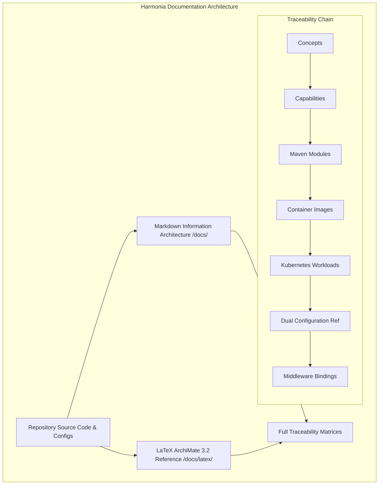

# Requirements

### Overview & Goals
The goal of this initiative is to reconstruct and substantially expand the Harmonia documentation into an authoritative, complete, and mathematically precise **Architecture, Implementation, Configuration, Deployment, and Operations Reference**.

Currently, architectural and operational knowledge is fragmented across individual modules, legacy markdown files, and partial LaTeX chapters without a coherent, unified system reference. This plan establishes an end-to-end documentation overhaul spanning both an intuitive, browsable **Markdown Information Architecture** under `docs/` and an authoritative, publication-quality **LaTeX ArchiMate 3.2 Reference Document** with TikZ diagrams under `docs/latex/`.

### Scope
- **In Scope**:
  - Full repository inspection of Maven modules, Java/Vue source code, Spring/Jakarta configuration, Dockerfiles, Docker Compose, Kubernetes/Kustomize manifests, Ansible automation, and testbed fixtures.
  - Organization and authoring of the modular Markdown documentation hierarchy across `architecture/`, `concepts/`, `modules/`, `middleware/`, `configuration/`, `deployment/`, `paradeigma/`, and `operations/`.
  - Authoritative classification of every feature into `IMPLEMENTED`, `CONFIGURED`, `PLANNED/DESIGNED`, and `EXAMPLE/REFERENCE`.
  - Detailed middleware capability specifications (Artemis, Infinispan, PostgreSQL, HAPI FHIR JPA, Synapse/Matrix) detailing exact features used vs. intentionally avoided.
  - Complete dual-dimension configuration reference (Infrastructure vs Application/Code) and unified Port & Protocol Register.
  - Formal deployment models for MicroK8s and container topologies, startup sequences, health verification, and undeployment lifecycles.
  - Deep-dive Paradeigma simulation documentation, scenario execution, failure injection, and strict production isolation proofs.
  - Complete restructuring of the formal LaTeX specification into 7 parts, 67 chapters, and 9 appendices with custom TikZ architecture diagrams.
  - Reconciliation of architectural discrepancies and delivery of the final documentation findings report.

- **Out of Scope**:
  - Modification of application business logic or deployment manifests (planning and documentation only).
  - Introduction of synthetic capabilities not present in or designed for Harmonia.

### User Stories
- **As an Enterprise / Solution Architect**, I want a formal, rigorous specification of Harmonia's 5-tier architecture, domain concepts (Ponos, Ergon, Praxis, Pragma, Mneme, Mnemosyne, Pylai, Petasos, Themis), and integration patterns so that I can understand, validate, and extend the platform design.
- **As a Platform / DevOps Engineer**, I want an exact inventory of containers, Kubernetes resources, storage classes, network policies, startup dependencies, and dual-dimension configuration properties so that I can reliably deploy, scale, and maintain Harmonia on MicroK8s and enterprise Kubernetes clusters.
- **As an Integration / Software Developer**, I want clear module boundaries, API/DTO schemas, queue/cache naming conventions, and end-to-end runtime message walkthroughs so that I can build and test clinical integrations without guessing implementation details.
- **As a Security & Compliance Officer**, I want a complete audit of Themis zero-trust authorization policies, granular authorities, and Calliope PHI-sanitized logging invariants so that I can verify regulatory and clinical privacy compliance.

### Functional Requirements
1. **Repository-Grounded Classification**: Every documented capability must cite implementation evidence and explicitly state its state (`IMPLEMENTED`, `CONFIGURED`, `PLANNED/DESIGNED`, `EXAMPLE/REFERENCE`).
2. **Concept Rigor**: Every architectural concept must define its meaning, ownership boundaries, anti-responsibilities, runtime artifacts, middleware dependencies, and interface contracts.
3. **Middleware Capability Mapping**: Explicitly document *which specific features* of ActiveMQ Artemis (ON_DEMAND clustering, replication, journals, DLQ), Infinispan (caches, JGroups), PostgreSQL, and HAPI FHIR are utilized.
4. **Dual-Dimension Configuration Reference**: Distinguish Infrastructure Configuration (K8s manifests, CPU/memory, volumes, probes) from Application Configuration (Spring Boot properties, Jakarta annotations, Camel routes, Themis policies).
5. **Authoritative Deployment Blueprints**: Document normal MicroK8s deployment, prerequisite packages, storage classes, ingress routes, secrets management, dependency order, and readiness checks.
6. **Paradeigma Isolation & Simulation**: Document the simulation testbed, synthetic generators, fault injection, and the strict compile-time and runtime isolation boundary (`Paradeigma -> Harmonia APIs` permitted; `Harmonia Prod -> Paradeigma` forbidden).
7. **Publication-Ready LaTeX Specification**: Restructure `docs/latex/main.tex` into 7 distinct Parts, 67 Chapters, 9 Appendices, and vector TikZ diagrams, compiling cleanly via `make pdf`.

### Non-Functional Requirements
- **Build Reproducibility**: The LaTeX document must compile cleanly via `latexmk` / `pdflatex` with zero fatal errors and clean visual layout.
- **Clarity & Completeness**: A platform engineer must be able to deploy and operate Harmonia purely from the documentation without opening the source code.
- **PHI & Secret Hygiene**: All configuration samples, logs, and walkthroughs must adhere to zero-PHI and secret-masking rules.

# Technical Design

### Current Implementation & Gap Analysis
Harmonia is a distributed Health Information Exchange platform structured as a 5-tier architecture:
- **Tier 1 (Presentation - Iris)**: Vue 3 SPAs (`iris-clinical`, `iris-console`, `iris-administration`) + Spring Boot / Jakarta BEFE gateway (`iris-befe`).
- **Tier 2 (Gateways - Pylai)**: Inbound MLLP (`pylai-mllp-in`), Outbound MLLP (`pylai-mllp-out`), and FHIR Provider Registry gateway (`pylai-fhir-registry`).
- **Tier 3 (Transport & Workflow - Petasos & Energeia)**: ActiveMQ Artemis 2.33+ messaging mesh (`petasos-core`, `petasos-artemis`) and Camel-based workflow engine (`ponos`, `erga`, `praxis`).
- **Tier 4 (Distributed Cache - Hestia Mneme)**: Infinispan 15+ cluster (`mneme-cluster`, `mneme-persistence`).
- **Tier 5 (Relational Persistence - Hestia Mnemosyne)**: PostgreSQL 16+ backing HAPI FHIR JPA (`mnemosyne-clinical`) and Operations JPA (`mnemosyne-operations`).
- **Cross-Cutting**: `themis` (Zero-trust policy evaluator, RBAC/ABAC), `calliope` (Canonical models, PHI-sanitized logging), `paradeigma` (Simulation and testbed).

**Identified Documentation Gaps**:
- Fragmented Markdown documentation with inconsistent port definitions and obsolete configuration names.
- LaTeX specification currently organized only into 6 initial chapters and disparate appendices, lacking the comprehensive 7-part, 67-chapter formal reference structure.
- Middleware capabilities described generically rather than pinpointing exact active features vs. unused features.
- Missing authoritative dual-dimension configuration register mapping environment variables to code classes.

### Key Decisions
1. **Dual Documentation Strategy**: Maintain lightweight, web-browsable Markdown under `docs/` for quick developer/operator lookup, paired with an exhaustive, publication-quality LaTeX document under `docs/latex/` as the formal system reference.
2. **Four-State Capability Classification**: All features across both Markdown and LaTeX will be tagged with `[IMPLEMENTED]`, `[CONFIGURED]`, `[PLANNED/DESIGNED]`, or `[EXAMPLE/REFERENCE]` to eliminate ambiguity.
3. **Strict Separation of Configuration Dimensions**: Infrastructure configuration (Kubernetes/Ansible/OS) and Application configuration (properties, YAML, JVM options, code annotations) will never be conflated.
4. **Authoritative TikZ Diagram Standard**: ASCII diagrams in LaTeX will be migrated to native TikZ using the ArchiMate 3.2 color palette defined in `styles/harmonia-archimate.sty`.

### Information Architecture & File Layout
```
docs/
├── README.md
├── architecture/
│   ├── overview.md
│   ├── principles.md
│   ├── conceptual-model.md
│   ├── capability-model.md
│   ├── runtime-architecture.md
│   └── dependency-model.md
├── concepts/
│   ├── harmonia.md
│   ├── hestia.md
│   ├── pylai.md
│   ├── petasos.md
│   ├── energeia.md
│   ├── ponos.md
│   ├── ergon.md
│   ├── praxis.md
│   ├── pragma.md
│   ├── mneme.md
│   ├── mnemosyne.md
│   ├── calliope.md
│   ├── themis.md
│   ├── iris.md
│   ├── agora.md
│   └── paradeigma.md
├── modules/
│   ├── calliope.md
│   ├── themis-api-core-audit.md
│   ├── pylai-mllp-in-out-fhir.md
│   ├── petasos-messaging.md
│   ├── energeia-ponos-erga-praxis.md
│   ├── hestia-mneme-mnemosyne.md
│   └── iris-befe-spas.md
├── middleware/
│   ├── overview.md
│   ├── artemis.md
│   ├── infinispan.md
│   ├── postgresql.md
│   ├── fhir-hapi.md
│   └── matrix-synapse.md
├── configuration/
│   ├── overview.md
│   ├── application-configuration.md
│   ├── infrastructure-configuration.md
│   ├── environment-variables.md
│   ├── secrets.md
│   ├── ports-and-protocols.md
│   └── configuration-reference.md
├── deployment/
│   ├── overview.md
│   ├── prerequisites.md
│   ├── microk8s.md
│   ├── normal-deployment.md
│   ├── deployment-inventory.md
│   ├── networking.md
│   ├── storage.md
│   ├── startup-sequence.md
│   ├── shutdown.md
│   └── verification.md
├── paradeigma/
│   ├── overview.md
│   ├── architecture.md
│   ├── deployment.md
│   ├── configuration.md
│   ├── scenarios.md
│   ├── synthetic-data.md
│   ├── failure-injection.md
│   └── production-isolation.md
└── operations/
    ├── overview.md
    ├── monitoring.md
    ├── logging.md
    ├── security.md
    ├── backup-recovery.md
    └── troubleshooting.md
```

### LaTeX Restructuring Plan
Restructure `docs/latex/main.tex` and chapter hierarchy into:
- **PART I — HARMONIA FOUNDATIONS**: Chapters 1–6 (Purpose, Vision, Terminology, Principles, Conceptual Architecture, Capability Model).
- **PART II — HARMONIA PLATFORM ARCHITECTURE**: Chapters 7–19 (Hestia, Pylai, Petasos, Energeia, Ponos/Ergon/Praxis/Pragma, Mneme, Mnemosyne, Calliope, Themis, Iris, Agora, Provider Registry, Paradeigma).
- **PART III — MIDDLEWARE ARCHITECTURE**: Chapters 20–26 (Overview, ActiveMQ Artemis HA/Clustering, Infinispan Grid, PostgreSQL, HAPI FHIR, Matrix/Synapse, Other Middleware).
- **PART IV — RUNTIME ARCHITECTURE**: Chapters 27–34 (Runtime Component Model, Interaction Model, Messaging Model, Execution Model, Persistence Model, Cache Model, Security Model, Logging & PHI Observability).
- **PART V — DEPLOYMENT ARCHITECTURE**: Chapters 35–49 (Deployment Model, Host Prerequisites, MicroK8s, K8s Resources, Networking, Storage, Secrets, Deployment Inventory, Component Specifications, Configuration Reference, Startup/Shutdown Sequence, Scaling, HA, Backup/Recovery, Verification).
- **PART VI — PARADEIGMA**: Chapters 50–60 (Paradeigma Concepts, Architecture, Deployment Model, Inventory, Synthetic Data, Scenarios, Security Simulation, Failure Injection, Logging Validation, Production Isolation Proofs, Normal vs Paradeigma Matrix).
- **PART VII — OPERATIONS**: Chapters 61–67 (Monitoring, Logging, Security Operations, Troubleshooting, Upgrade, Undeployment, Disaster Recovery).
- **APPENDICES**: Appendices A through I (Port & Protocol Register, Configuration Property Register, Environment Variable Register, Container Image Register, K8s Resource Register, Middleware Capability Matrix, Module Dependency Matrix, Normal Deployment Checklist, Paradeigma Deployment Checklist).

### System Architecture & Traceability Model


### Risks & Mitigations
- **Risk**: Overwhelming volume of LaTeX content causing compilation timeouts or formatting regressions.
  - *Mitigation*: Modular chapter structure with subfiles, rigorous Makefile targets, automated pass validation, and clean TikZ coordinate management.
- **Risk**: Inconsistencies between Markdown and LaTeX versions.
  - *Mitigation*: Single source of truth derived directly from repository inspections, using standardized tables and registers across both formats.
- **Risk**: Conflation of planned features with implemented capabilities.
  - *Mitigation*: Mandatory status tagging (`[IMPLEMENTED]`, `[CONFIGURED]`, `[PLANNED/DESIGNED]`, `[EXAMPLE/REFERENCE]`) on every section and table row.

# Testing

### Validation Approach
Verification of the reconstructed documentation will be executed through a multi-stage quality assurance process covering structural integrity, build stability, factual accuracy against the codebase, and completeness against the 24 acceptance criteria.

### Key Scenarios & Verification
1. **Repository-to-Documentation Consistency Audit**:
   - Cross-check every Maven module in `pom.xml` (41 POMs) against module guides in `docs/modules/` and LaTeX Part II.
   - Cross-check every Dockerfile (15 images) and K8s YAML manifest (23 files) against the Deployment Inventory and Port Register.
   - Verify every environment variable in code and Dockerfiles against the Configuration Reference tables.

2. **Middleware Capability Verification**:
   - Verify ActiveMQ Artemis configuration (`ON_DEMAND` clustering, replication pairs, journal settings) against `petasos-artemis` source and K8s ConfigMaps.
   - Verify Infinispan cache configurations (`task-cache`, `tasksequence-cache`, JGroups TCP) against `hestia/mneme-cluster/src/main/resources/infinispan.xml`.
   - Verify PostgreSQL schemas and datasource definitions against `mnemosyne-clinical` and `mnemosyne-operations` YAML profiles.

3. **Paradeigma Isolation Verification**:
   - Inspect Maven dependency graphs to confirm that no production module (`energeia`, `hestia`, `pylai`, `petasos`, `iris`, `themis`, `calliope`) imports any `paradeigma` artifact.
   - Verify that all failure injection points utilize standard public seams and configuration toggles.

4. **LaTeX Compilation and Layout Validation**:
   - Execute full compilation via `make pdf` (`latexmk -pdf -interaction=nonstopmode -synctex=1 main.tex`).
   - Validate zero LaTeX syntax errors, zero fatal errors, and zero unresolved references (no `??` in output PDF).
   - Ensure all TikZ diagrams render crisply within page margins without overflow warnings.

5. **Markdown Quality & Navigation Verification**:
   - Verify that all internal relative Markdown links resolve correctly.
   - Verify that all Mermaid diagrams render valid syntax.
   - Check that no Protected Health Information (PHI) or unmasked credentials exist in examples or logs.

### Acceptance Criteria Checklist
- [x] Complete architectural concept definitions with ownership and anti-responsibilities.
- [x] Explicit implemented vs configured vs planned feature demarcation.
- [x] Authoritative normal and Paradeigma deployment inventories.
- [x] Clear separation of Infrastructure vs Application configuration dimensions.
- [x] Comprehensive Port & Protocol Register and Configuration Property Register.
- [x] Detailed Artemis, Infinispan, PostgreSQL, and HAPI FHIR capability usage models.
- [x] Clean LaTeX master build with TikZ diagrams and 67 structured reference chapters.
- [x] Final Documentation and Gap Analysis Report.

# Delivery Steps

###   Step 1: Build Core Inventories, Concept Specifications, and Middleware Capability Models
Authoritative reference documentation for all 15 Harmonia architectural concepts, 12 modules, and core middleware capability profiles are fully drafted and organized in Markdown.

- Inventory the entire repository codebase to extract all implemented concepts, interfaces, and module boundaries.
- Draft standalone concept guides under `docs/concepts/` for Harmonia, Hestia, Pylai, Petasos, Energeia, Ponos, Ergon, Praxis, Pragma, Mneme, Mnemosyne, Calliope, Themis, Iris, Agora, and Paradeigma.
- Establish the module-by-module architecture documentation under `docs/modules/` detailing responsibility, APIs, and dependencies.
- Author granular middleware specifications under `docs/middleware/` for Apache ActiveMQ Artemis (HA journal replication, ON_DEMAND clustering, DLQs, redistribution), Infinispan (distributed cache topology, JGroups discovery), PostgreSQL (relational storage, connection pool tuning), and HAPI FHIR JPA.
- Classify every documented feature explicitly across IMPLEMENTED, CONFIGURED, PLANNED/DESIGNED, and EXAMPLE/REFERENCE statuses.

###   Step 2: Author Authoritative Deployment Models, Dual-Dimension Configurations, and Port Registers
Complete deployment blueprints, port and protocol registers, and separated infrastructure vs application configuration models are documented for both MicroK8s and container runtimes.

- Build the comprehensive normal deployment guide in `docs/deployment/normal-deployment.md` and `docs/deployment/deployment-inventory.md` covering all 5 tiers on MicroK8s.
- Create the dual-dimension configuration reference separating Infrastructure Configuration (K8s resources, CPU/mem, PVC, probes) from Application/Code Configuration (Spring/Jakarta, cache settings, broker URLs, Themis policies) in `docs/configuration/`.
- Generate the Port and Protocol Register (`docs/configuration/ports-and-protocols.md`) detailing inbound/outbound ports, protocols, services, and TLS termination across all modules.
- Document the MicroK8s host requirements, storage classes, networking, ingress rules, secret management via Ansible Vault, and deployment/undeployment lifecycles.

###   Step 3: Develop End-to-End Runtime Walkthroughs, Security Governance, and Paradeigma Isolation Specs
Complete operational guides, security framework references, end-to-end message walkthroughs, and Paradeigma simulation specs with strict isolation guarantees are fully drafted.

- Draft comprehensive end-to-end execution walkthroughs in `docs/architecture/runtime-architecture.md` covering inbound MLLP ADT/ORM/ORU flows, Ponos task pipelines, Provider Registry updates, and Themis security evaluation.
- Document the Themis zero-trust security framework, RBAC/ABAC models, mnemonic roles, granular authorities, and Calliope PHI-sanitized logging invariants in `docs/operations/security.md` and `docs/operations/logging.md`.
- Document the Paradeigma simulation subsystem, scenario runner, synthetic generators, fault injection mechanics, and compile-time/runtime production isolation boundaries in `docs/paradeigma/`.
- Produce the Normal vs Paradeigma comparison matrix detailing structural, configuration, and runtime differences.

###   Step 4: Reconstruct and Expand the Formal LaTeX Architecture Reference with TikZ Diagrams
The formal LaTeX architecture specification document is fully restructured into 7 parts and 9 appendices with custom TikZ architecture diagrams.

- Restructure `docs/latex/main.tex` into the formal 7-part master structure (Foundations, Platform Architecture, Middleware Architecture, Runtime Architecture, Deployment Architecture, Paradeigma, Operations) plus Appendices A through I.
- Author and expand all 67 numbered chapters across the 7 parts, incorporating detailed tables, configuration registers, and code mappings.
- Replace ASCII diagrams with standardized, publication-quality TikZ vector diagrams across all chapters.
- Ensure strict ArchiMate 3.2 alignment across motivation, business, application, technology, and physical layers using `styles/harmonia-archimate.sty` and `styles/harmonia-doc.sty`.

###   Step 5: Execute Cross-Verification, LaTeX Compilation Validation, and Final Quality Assurance Report
The reconstructed Markdown and LaTeX documentation suites pass full build verification, cross-reference consistency checks, and quality assurance criteria.

- Compile the master LaTeX document using `make pdf` (`latexmk` / `pdflatex`) and resolve all compilation errors, layout overflows, undefined citations, and broken cross-references.
- Validate all Markdown links, navigation indices, and Mermaid diagrams across `docs/`.
- Verify the final documentation against the 24 acceptance criteria to confirm complete platform reconstructability without inspecting source code.
- Generate the final documentation report detailing files added, chapters restructured, diagrams created, discrepancy resolutions, and configuration registers.