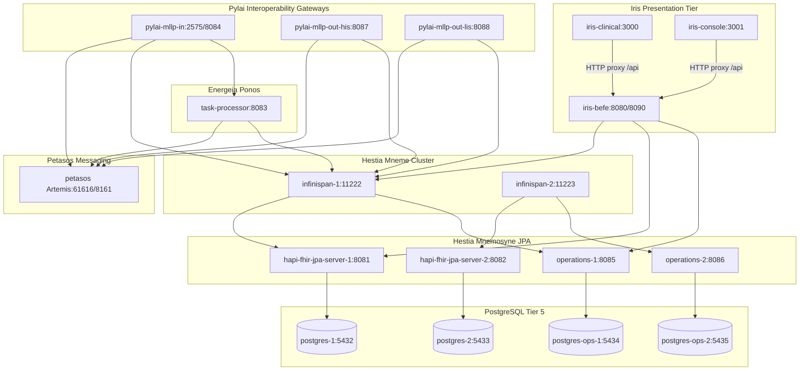

# Requirements

### Overview & Goals
Establish a fully functional, highly reliable Docker Compose development runtime for the Harmonia Health Integration Environment (HIE) on `harmonia-srv`. The objective is to maximize operational utility and service availability across all 9 architectural tiers with minimal friction and zero unnecessary structural churn.

### Scope
- **In Scope**:
  - Validation of Maven reactor build outputs (`mvn clean install -DskipTests`) required by Dockerfiles.
  - Verification and correction of Dockerfiles, build contexts, and `docker-compose.yml` service configurations.
  - Image construction using `docker compose build` for all custom containers.
  - Dependency-ordered startup, stabilization, and health verification for all 18 infrastructure, persistence, processing, messaging, gateway, and presentation services.
  - Verification of external accessibility for Iris Clinical (port 3000), Iris Console (port 3001), BEFE (ports 8080/8090), and other exposed service endpoints.
  - Production of an exhaustive deployment report capturing issues, fixes, service status, and reproduction instructions.
- **Out of Scope**:
  - Architectural redesigns or simplifications of the Harmonia system topology.
  - Modifications to application business logic solely to resolve unit/integration test failures.
  - Functional modifications to core architectural modules (Calliope, Themis, Hestia, Petasos, Energeia, Pylai, Iris) beyond packaging and deployment fixes.

### Functional Requirements
1. **Deterministic Build Pipeline**: All Maven target artifacts (`.jar`, `.war`, dependency libs) and Docker images must build cleanly without manual workarounds.
2. **Preserved Topology**: The multi-node, clustered, and segregated architecture defined in `docker-compose.yml` (Postgres, Mnemosyne, Mneme Infinispan cluster, Petasos Artemis, Ponos, Pylai MLLP in/out, Iris BEFE/Clinical/Console) must be maintained intact.
3. **Health & Readiness Validation**: Every service must start cleanly, establish its required upstream connections, and satisfy configured container health checks.
4. **Port Accessibility**: All configured published host ports must be responsive, specifically:
   - Iris Clinical: `http://localhost:3000`
   - Iris Console: `http://localhost:3001`
   - Iris BEFE: `http://localhost:8080` (Clinical API) & `http://localhost:8090` (Operations API)
   - Mnemosyne Clinical: `http://localhost:8081` & `http://localhost:8082`
   - Mnemosyne Operations: `http://localhost:8085` & `http://localhost:8086`
   - Petasos Console / Broker: `http://localhost:8161` & `tcp://localhost:61616`
   - Ponos / Pylai MLLP Gateways: `8083`, `8084`, `2575`, `8087`, `8088`
5. **Traceable Deployment Record**: Document all diagnosed packaging/runtime issues and provide exact reproduction commands.

# Technical Design

### Current Implementation
The repository defines an 18-service topology in `docker-compose.yml` encompassing:
- **Tier 5 Persistence**: PostgreSQL instances (`postgres-1`, `postgres-2`, `postgres-ops-1`, `postgres-ops-2`).
- **Tier 4 Authoritative State (Mnemosyne)**: Spring Boot JPA applications (`hestia/mnemosyne-clinical`, `hestia/mnemosyne-operations`).
- **Tier 3 Active State (Mneme)**: Clustered Infinispan 15 data grid nodes (`hestia/mneme-cluster`) with custom write-behind persistence SPI.
- **Messaging (Petasos)**: ActiveMQ Artemis 2.33.0 standalone broker (`petasos`).
- **Task Processing (Energeia / Ponos)**: WildFly 31 runtime hosting `energeia/ponos` (`task-sequence-processor.war`).
- **Interoperability Membrane (Pylai)**: WildFly 31 runtimes hosting MLLP Inbound (`pylai/pylai-mllp-in`) and MLLP Outbound (`pylai/pylai-mllp-out`).
- **Presentation Tier (Iris)**: WildFly 31 backend gateway (`iris/iris-befe`) and Nginx frontend SPAs (`iris/iris-clinical`, `iris/iris-console`).

### Key Decisions
1. **Preserve Service Topology & Boundaries**: In alignment with Harmonia Architectural Axioms and AGENTS.md guardrails, preserve all multi-node instances and separate network configurations rather than collapsing them into a simplified single-container layout.
2. **Prioritize Deployment/Packaging Corrections Over Code Churn**: Focus modifications on Dockerfile directives, build context paths, Nginx proxy configurations, container environment variables, and Maven packaging plugins before altering any application Java/TypeScript code.
3. **Dependency-Ordered Service Bootstrapping**: Launch containers in strict dependency order:
   - Tier 1: Databases (`postgres-*`) & Broker (`petasos`)
   - Tier 2: Mnemosyne JPA servers (`hapi-fhir-jpa-server-*`, `operations-*`)
   - Tier 3: Mneme cache cluster (`infinispan-*`)
   - Tier 4: Ponos task processor & Pylai gateways
   - Tier 5: Iris BEFE & Frontend SPAs

### Service Architecture & Interaction Diagram

### Affected Files & Components
- Maven Build Artefacts: `hestia/mneme-cluster/pom.xml`, `hestia/mnemosyne-clinical/pom.xml`, `hestia/mnemosyne-operations/pom.xml`, `iris/iris-befe/pom.xml`, `energeia/ponos/pom.xml`, `pylai/pylai-mllp-in/pom.xml`, `pylai/pylai-mllp-out/pom.xml`.
- Docker Build Files: `iris/iris-console/Dockerfile`, `iris/iris-clinical/Dockerfile`, `hestia/mneme-cluster/Dockerfile`, `hestia/mnemosyne-clinical/Dockerfile`, `hestia/mnemosyne-operations/Dockerfile`, `energeia/ponos/Dockerfile`, `pylai/pylai-mllp-in/Dockerfile`, `pylai/pylai-mllp-out/Dockerfile`.
- Runtime Configurations: `docker-compose.yml`, `iris/iris-clinical/nginx.conf`, `iris/iris-console/nginx.conf`, `petasos/deployment/artemis/standalone/docker-entrypoint.sh`.

# Testing

### Validation Approach
Verification will be executed progressively against the live Docker Compose environment to ensure each tier meets its functional requirements before upstream consumers are engaged.

### Key Scenarios
1. **Docker Build Verification**:
   - Verify all Maven packages are created without error (`target/*-exec.jar`, `target/*.war`, `target/lib/*.jar`).
   - Validate that `docker compose build` succeeds with zero errors across all 12 custom build services.
2. **Infrastructure & Persistence Verification**:
   - Confirm `postgres-1`, `postgres-2`, `postgres-ops-1`, and `postgres-ops-2` accept connections via `pg_isready`.
   - Confirm `hapi-fhir-jpa-server-1/2` and `operations-1/2` return HTTP 200 on `/actuator/health`.
   - Confirm `petasos` initializes queues and accepts connections on `tcp://localhost:61616` and HTTP on `http://localhost:8161`.
3. **Data Grid & Gateway Verification**:
   - Verify `infinispan-1` and `infinispan-2` form cluster channels on port 7800/7801 and respond to HotRod queries on port 11222/11223.
   - Verify `task-processor`, `mllp-gateway`, `mllp-outbound-his`, and `mllp-outbound-lis` WildFly runtimes deploy their respective WARs successfully without fatal deployment exceptions.
4. **Presentation & Frontend Verification**:
   - Verify `befe` initializes and binds HTTP endpoints.
   - Verify `iris-clinical` responds with HTTP 200 and renders HTML/JS assets on `http://localhost:3000`.
   - Verify `iris-console` responds with HTTP 200 and renders HTML/JS assets on `http://localhost:3001`.
   - Verify Nginx reverse-proxy routes `/api/` calls from SPAs to BEFE.

### Edge Cases & Diagnostic Checks
- **Stale Container Volumes**: Check for volume permission or schema migration conflicts on clean versus restarted container boots.
- **Port Clashes**: Verify no host port conflicts prevent services from binding to their published ports.
- **Service Dependency Latency**: Ensure depends_on healthchecks and timeouts prevent premature connections before downstream dependencies are ready.

# Delivery Steps

### ✓ Step 1: Build Maven Reactor Artefacts and Validate Docker Build Contexts
All required JAR, WAR, and library artefacts are built and validated in local target directories for Docker image consumption.

- Execute `mvn clean install -DskipTests` across the Harmonia Maven reactor to produce backend artifacts including Spring Boot executable JARs (`mnemosyne-clinical`, `mnemosyne-operations`), WildFly WARs (`iris-befe`, `ponos`, `pylai-mllp-in`, `pylai-mllp-out`), and Infinispan SPI dependencies (`mneme-cluster/target/lib`).
- Audit each service's Docker build context, Dockerfile instructions, and build artifact references (e.g., verifying `target/mnemosyne-*-exec.jar`, `target/*.war`, `target/lib/*.jar`, and frontend dependencies in `iris/iris-clinical` and `iris/iris-console`).
- Identify and correct any packaging or Dockerfile path mismatches to ensure reliable reproducibility.

### ✓ Step 2: Build Docker Images and Resolve Packaging Deficiencies
All Harmonia Docker images are successfully constructed via Docker Compose without errors.

- Run `docker compose build` to build container images for all defined services (`hapi-fhir-jpa-server-1/2`, `operations-1/2`, `infinispan-1/2`, `task-processor`, `mllp-gateway`, `mllp-outbound-his/lis`, `befe`, `iris-clinical`, `iris-console`).
- Address build context hygiene and layer efficiency by ensuring `.dockerignore` coverage in frontend directories (`iris/iris-clinical`, `iris/iris-console`) to prevent host `node_modules` contamination.
- Resolve any Dockerfile build-step failures, frontend dependency installation issues, or missing context files using targeted single-service rebuilds.
- Ensure all multi-stage and base image layers build cleanly, deterministically, and reproducibly.

### ✓ Step 3: Bootstrap and Verify Infrastructure and Persistence Tier
PostgreSQL relational backends, Mnemosyne JPA persistence layers, and Petasos messaging brokers are running and passing healthchecks.

- Start PostgreSQL database containers (`postgres-1`, `postgres-2`, `postgres-ops-1`, `postgres-ops-2`) and verify connection health checks.
- Launch Mnemosyne Clinical (`hapi-fhir-jpa-server-1`, `hapi-fhir-jpa-server-2`) and Mnemosyne Operations (`operations-1`, `operations-2`) Spring Boot instances; verify schema initialization, database connectivity, and `/actuator/health` endpoints.
- Start Petasos ActiveMQ Artemis (`petasos`) standalone broker; verify JAAS authentication setup, queue initialization, and management console accessibility on port 8161.

### ✓ Step 4: Deploy and Validate In-Memory Grid, Processing, and Interoperability Gateways
Distributed cache nodes, workflow processing engines, and MLLP interoperability gateways are active and connected.

- Start Mneme Infinispan cluster nodes (`infinispan-1`, `infinispan-2`), verifying cluster discovery, HotRod listener activation, and write-behind persistence SPI connectivity to Mnemosyne endpoints.
- Start Energeia Ponos task sequence processor (`task-processor`) WildFly container; verify deployment of `task-sequence-processor.war` and Petasos broker connectivity.
- Launch Pylai inbound (`mllp-gateway`) and outbound (`mllp-outbound-his`, `mllp-outbound-lis`) WildFly gateways; verify deployment of MLLP WARs and connectivity to Petasos queues and Mneme cache.

### ✓ Step 5: Launch Iris Presentation Tier, Verify Host Accessibility, and Produce Final Report
The Iris presentation tier is fully operational and accessible via configured host ports, with an exhaustive execution summary documented.

- Launch Iris BEFE (`befe`), Iris Clinical (`iris-clinical`), and Iris Console (`iris-console`).
- Verify WildFly deployment of `iris-befe.war` and API routing on ports 8080, 8090, and 9990.
- Verify Nginx HTTP accessibility and SPA bundle serving for Iris Clinical on host port 3000 and Iris Console on host port 3001.
- Perform end-to-end connectivity sanity checks across the complete runtime graph.
- Compile and generate the comprehensive final status report detailing problems encountered, configuration modifications made, operational status of all services, and reproduction commands.