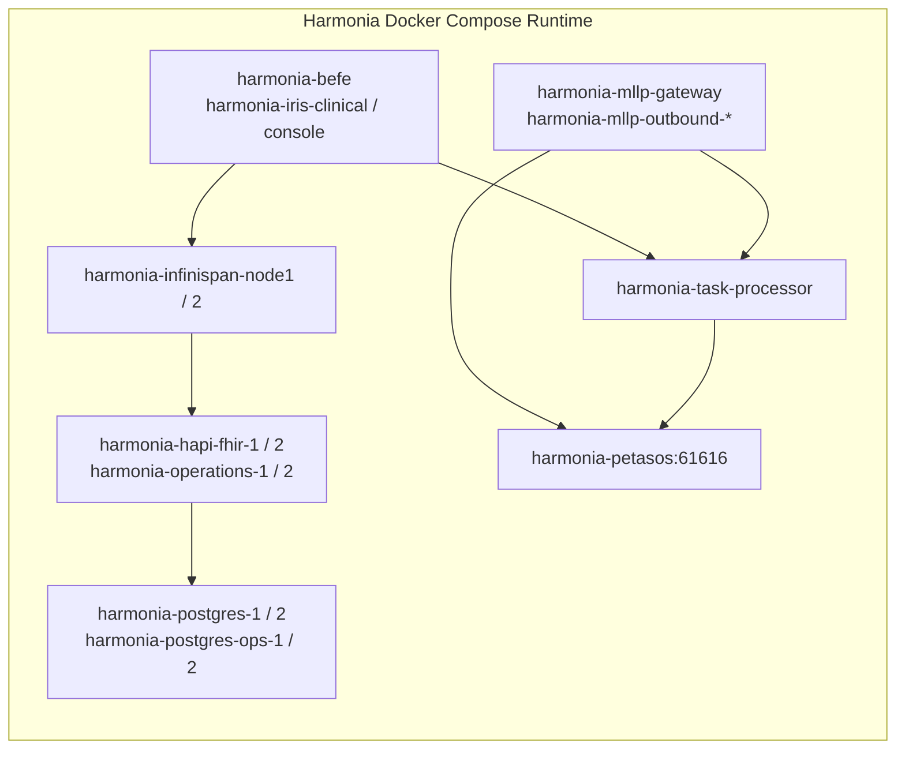

# Requirements

### Overview & Goals
The Docker Compose build naming in Harmonia has already converged to `harmonia-*`. However, runtime container names generated by `docker compose up -d` still use legacy `hie-*` identifiers (such as `hie-petasos`, `hie-postgres-1`, `hie-befe`, `hie-task-processor`). 

The objective of this task is to complete the human-visible runtime container naming convergence across all 18 Harmonia-owned services from `hie-*` to `harmonia-*`, ensuring complete alignment with project branding while maintaining 100% operational continuity, data persistence, and inter-service discovery.

### Scope

#### In Scope
- Inspecting active Docker Compose files and cataloging all `container_name:` declarations.
- Updating explicit `container_name:` values in `docker-compose.yml` for all 18 services to use the `harmonia-*` prefix.
- Updating platform component container references in `paradeigma/deployment/docker-compose-paradeigma.yml`.
- Updating operational status documentation in `README.md` to reflect the converged container names.
- Validating container recreation, health checks, data persistence, and inter-service connectivity without data loss.

#### Out of Scope
- Modifying Compose service names (e.g. `petasos`, `hie-operations-jpa-server-1`, `mllp-gateway`).
- Modifying Docker network DNS names or discovery endpoints (e.g. `tcp://petasos:61616`, `http://hapi-fhir-jpa-server-1:8080/fhir`).
- Modifying published/internal port mappings.
- Modifying named volume declarations or volume mappings (`postgres_data_1`, `petasos_data`, etc.).
- Modifying database schemas, PostgreSQL data directories, or Artemis message journals.
- Modifying Kubernetes manifests (`deployment/kubernetes/`), Ansible playbooks (`deployment/ansible/`), or Java protocol constants (`HIE_PRAGMA_ID`, etc.).
- Running destructive prune commands (`docker compose down -v`, `docker volume prune`, `docker system prune`).

### User Stories
- **As an Operator / Developer**, I want `docker compose ps` to display consistent `harmonia-*` container names across all 18 runtime services, so that runtime inspection and operational monitoring cleanly reflect the Harmonia platform identity.
- **As a System Administrator**, I want container renaming to preserve existing data volumes and internal DNS endpoints, so that message broker queues and clinical databases restart without data loss or configuration errors.

### Acceptance Criteria
- All 18 services in `docker-compose.yml` declare explicit `container_name: harmonia-<service-identifier>` matching the target naming convention.
- `docker compose config` validates cleanly with zero syntax or topology errors.
- Running `docker compose up -d` starts all 18 containers with `harmonia-*` runtime names.
- Health checks for all services (PostgreSQL, HAPI FHIR JPA, Operations JPA, Mneme Infinispan, Petasos Artemis, MLLP Gateways, BEFE, SPAs) pass and reach `healthy` / `Up` status.
- Petasos Artemis retained queues, journal storage, and PostgreSQL databases preserve all persistent state from named volumes.
- Inter-service networking (such as `petasos:61616` and `infinispan-1:11222`) continues functioning without breakage.

# Technical Design

### Current Implementation
The active Docker Compose topology is defined in `/home/hunterm/Development/Code/harmonia/docker-compose.yml`. The Compose project name resolves to `harmonia`. Currently, all 18 services define explicit `container_name` attributes with the legacy `hie-` prefix.

### Key Decisions
- **Container Name Only**: Only the `container_name:` attribute within service definitions is updated. Service keys (which serve as DNS aliases within the Docker bridge network) remain unchanged to prevent breaking inter-service communication (e.g., `petasos:61616`, `infinispan-1:11222`, `hapi-fhir-jpa-server-1:8080`).
- **Volume & Network Invariance**: Volume names (`postgres_data_1`, `petasos_data`, etc.) and network names (`hie-network`) remain unchanged, guaranteeing zero data migration risk or volume recreation.
- **Documentation Alignment**: `README.md` is updated in sync to ensure verification instructions match the new runtime output.

### Proposed Container Renaming Matrix

| # | Compose Service Key | Current `container_name` | Proposed `container_name` | Internal DNS / Service Role |
|---|---|---|---|---|
| 1 | `postgres-1` | `hie-postgres-1` | `harmonia-postgres-1` | PostgreSQL Clinical Node 1 (port 5432) |
| 2 | `postgres-2` | `hie-postgres-2` | `harmonia-postgres-2` | PostgreSQL Clinical Node 2 (port 5433) |
| 3 | `postgres-ops-1` | `hie-postgres-ops-1` | `harmonia-postgres-ops-1` | PostgreSQL Operations Node 1 (port 5434) |
| 4 | `postgres-ops-2` | `hie-postgres-ops-2` | `harmonia-postgres-ops-2` | PostgreSQL Operations Node 2 (port 5435) |
| 5 | `hapi-fhir-jpa-server-1` | `hie-hapi-fhir-1` | `harmonia-hapi-fhir-1` | Mnemosyne FHIR JPA Server Node 1 (port 8081) |
| 6 | `hapi-fhir-jpa-server-2` | `hie-hapi-fhir-2` | `harmonia-hapi-fhir-2` | Mnemosyne FHIR JPA Server Node 2 (port 8082) |
| 7 | `hie-operations-jpa-server-1` | `hie-operations-1` | `harmonia-operations-1` | Mnemosyne Operations JPA Server Node 1 (port 8085) |
| 8 | `hie-operations-jpa-server-2` | `hie-operations-2` | `harmonia-operations-2` | Mnemosyne Operations JPA Server Node 2 (port 8086) |
| 9 | `infinispan-1` | `hie-infinispan-node1` | `harmonia-infinispan-node1` | Mneme Infinispan Cache Node 1 (port 11222) |
| 10 | `infinispan-2` | `hie-infinispan-node2` | `harmonia-infinispan-node2` | Mneme Infinispan Cache Node 2 (port 11223) |
| 11 | `befe` | `hie-befe` | `harmonia-befe` | Iris WildFly BEFE Gateway (port 8080/8090/9990) |
| 12 | `iris-clinical` | `hie-iris-clinical` | `harmonia-iris-clinical` | Iris Clinical Vue 3 SPA (port 3000) |
| 13 | `iris-console` | `hie-iris-console` | `harmonia-iris-console` | Iris Console Vue 3 SPA (port 3001) |
| 14 | `petasos` | `hie-petasos` | `harmonia-petasos` | ActiveMQ Artemis Petasos Broker (port 61616/8161) |
| 15 | `mllp-gateway` | `hie-mllp-gateway` | `harmonia-mllp-gateway` | Pylai Inbound MLLP Gateway (port 2575/8084) |
| 16 | `mllp-outbound-his` | `hie-mllp-outbound-his` | `harmonia-mllp-outbound-his` | Pylai Outbound MLLP Gateway HIS (port 8087) |
| 17 | `mllp-outbound-lis` | `hie-mllp-outbound-lis` | `harmonia-mllp-outbound-lis` | Pylai Outbound MLLP Gateway LIS (port 8088) |
| 18 | `task-processor` | `hie-task-processor` | `harmonia-task-processor` | Energeia Ponos Task Sequence Processor (port 8083) |

### Secondary Files to Align
- `paradeigma/deployment/docker-compose-paradeigma.yml`: Update platform component `container_name:` declarations for `mllp-gateway` (`harmonia-mllp-gateway`) and `task-processor` (`harmonia-task-processor`).
- `README.md`: Update Section 2 ("Verify Service Status") container inventory list from `hie-*` to `harmonia-*`.

### Retained References with `hie-`
The following references intentionally remain unchanged per architectural boundaries:
- `hie-network`: Docker network bridge identifier.
- `hie-operations-jpa-server-1` / `hie-operations-jpa-server-2`: Compose service names used for internal DNS resolution in Infinispan `JAVA_OPTIONS`.
- Kubernetes manifests and Ansible playbooks under `deployment/`: Out of scope per prompt boundaries.
- Java protocol headers (`HIE_PRAGMA_ID`, `HIE_TASK_ID`, etc.): Application domain constants.

### Architecture Diagram

# Testing

### Validation Approach
Verification follows a strict non-destructive procedure ensuring that container name changes do not disrupt runtime dependencies, internal service discovery, or persistent storage volumes.

### Key Scenarios

#### 1. Configuration Syntax Validation
- **Action**: Run `docker compose config`.
- **Expected Outcome**: Clean output with zero YAML parsing errors, confirming all 18 services have `container_name: harmonia-*` while maintaining existing port mappings, environment variables, network attachments, and volume mounts.

#### 2. Safe Container Replacement
- **Action**: 
  1. Stop existing containers with `docker compose down` (WITHOUT `-v`).
  2. Launch updated containers with `docker compose up -d`.
- **Expected Outcome**: Docker stops and removes the old `hie-*` containers and creates all 18 new containers under `harmonia-*` names, attaching them to existing persistent volumes.

#### 3. Container Status & Health Check Verification
- **Action**: Run `docker compose ps`.
- **Expected Outcome**: Exactly 18 services are reported running with `harmonia-*` names. All services with configured health checks (`postgres-1`, `postgres-2`, `postgres-ops-1`, `postgres-ops-2`, `hapi-fhir-jpa-server-1`, `hapi-fhir-jpa-server-2`, `hie-operations-jpa-server-1`, `hie-operations-jpa-server-2`, `petasos`) report status `healthy`.

#### 4. Data Persistence & State Retention Verification
- **Action**: Inspect volumes `harmonia_petasos_data`, `harmonia_postgres_data_1`, `harmonia_postgres_data_2`, `harmonia_postgres_ops_data_1`, `harmonia_postgres_ops_data_2`.
- **Expected Outcome**:
  - PostgreSQL retains existing schemas and records without re-initialization.
  - Petasos Artemis retains broker journal data and security configuration.

#### 5. Inter-Service Connectivity & DNS Verification
- **Action**: Verify that internal services communicate via Compose DNS service names (e.g. `petasos:61616`, `infinispan-1:11222`, `task-processor:8080`).
- **Expected Outcome**: Inbound/outbound MLLP gateways and Ponos task processor connect to `tcp://petasos:61616` and Infinispan successfully without connection refused errors.

#### 6. Remaining Legacy Reference Audit
- **Action**: Execute grep audit across the codebase for `hie-` references.
- **Expected Outcome**: No legacy `hie-*` container names remain in active Compose files or operational docs, with only intentional architectural references (Kubernetes manifests, Java headers) remaining.

# Delivery Steps

### ✓ Step 1: Update container name declarations in Docker Compose configurations and documentation
All 18 Harmonia-owned runtime container names in `docker-compose.yml` (and associated references in `paradeigma/deployment/docker-compose-paradeigma.yml` and `README.md`) are updated to `harmonia-*`.

- Update all 18 `container_name:` properties in `docker-compose.yml` from `hie-*` to `harmonia-*`:
  - `postgres-1`: `hie-postgres-1` &rarr; `harmonia-postgres-1`
  - `postgres-2`: `hie-postgres-2` &rarr; `harmonia-postgres-2`
  - `postgres-ops-1`: `hie-postgres-ops-1` &rarr; `harmonia-postgres-ops-1`
  - `postgres-ops-2`: `hie-postgres-ops-2` &rarr; `harmonia-postgres-ops-2`
  - `hapi-fhir-jpa-server-1`: `hie-hapi-fhir-1` &rarr; `harmonia-hapi-fhir-1`
  - `hapi-fhir-jpa-server-2`: `hie-hapi-fhir-2` &rarr; `harmonia-hapi-fhir-2`
  - `hie-operations-jpa-server-1`: `hie-operations-1` &rarr; `harmonia-operations-1`
  - `hie-operations-jpa-server-2`: `hie-operations-2` &rarr; `harmonia-operations-2`
  - `infinispan-1`: `hie-infinispan-node1` &rarr; `harmonia-infinispan-node1`
  - `infinispan-2`: `hie-infinispan-node2` &rarr; `harmonia-infinispan-node2`
  - `befe`: `hie-befe` &rarr; `harmonia-befe`
  - `iris-clinical`: `hie-iris-clinical` &rarr; `harmonia-iris-clinical`
  - `iris-console`: `hie-iris-console` &rarr; `harmonia-iris-console`
  - `petasos`: `hie-petasos` &rarr; `harmonia-petasos`
  - `mllp-gateway`: `hie-mllp-gateway` &rarr; `harmonia-mllp-gateway`
  - `mllp-outbound-his`: `hie-mllp-outbound-his` &rarr; `harmonia-mllp-outbound-his`
  - `mllp-outbound-lis`: `hie-mllp-outbound-lis` &rarr; `harmonia-mllp-outbound-lis`
  - `task-processor`: `hie-task-processor` &rarr; `harmonia-task-processor`
- Update platform container references in `paradeigma/deployment/docker-compose-paradeigma.yml` (`hie-mllp-gateway` &rarr; `harmonia-mllp-gateway`, `hie-task-processor` &rarr; `harmonia-task-processor`).
- Update the runtime container status verification checklist in `README.md` to reflect `harmonia-*` naming.
- Ensure strict preservation of service discovery names (`petasos`, `infinispan-1`, `hapi-fhir-jpa-server-1`, `hie-operations-jpa-server-1`, etc.), network configurations (`hie-network`), ports, and volume definitions.

### ✓ Step 2: Execute safe topology verification, container recreation, health check, and persistence validation
The Docker Compose environment is cleanly transitioned to the new container names with data persistence, health checks, and inter-service communication validated.

- Validate Compose syntax and verify zero unintended structural changes using `docker compose config`.
- Stop and remove existing legacy containers safely without volume removal via `docker compose down` (strictly avoiding `-v`, `docker system prune`, or volume deletion).
- Start all 18 services in detached mode via `docker compose up -d`.
- Inspect runtime status with `docker compose ps` to confirm all 18 containers report `harmonia-*` names and achieve `Up` / `healthy` status.
- Verify PostgreSQL persistence by confirming database connectivity and schema/data retention across both FHIR and Operations nodes.
- Verify Petasos Artemis broker persistence and inter-service connectivity on `petasos:61616` (e.g. from `mllp-gateway`, `mllp-outbound-his`, `mllp-outbound-lis`, `task-processor`).
- Search the runtime configuration for remaining `hie-*` references and document any intentionally retained elements (such as Kubernetes manifests and Java protocol headers).