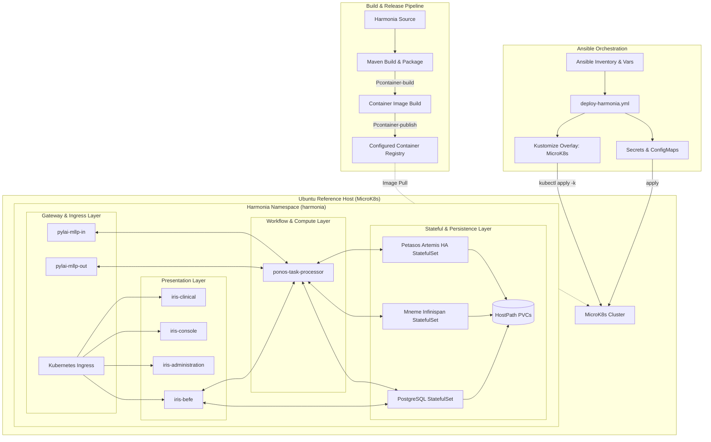

# Requirements

### Overview & Goals
The objective of this task is to extend the Harmonia platform with an automated, repeatable, and enterprise-ready container build, publication, deployment, and undeployment framework targeting Kubernetes, with single-node MicroK8s on Ubuntu as the initial reference deployment environment.

The framework unites:
1. **Maven-Driven Container Production**: Building and publishing versioned OCI container images for all independently deployable Harmonia services as part of explicit Maven lifecycle profiles (`-Pcontainer-build`, `-Pcontainer-publish`).
2. **Authoritative Kubernetes Resource Definitions**: Structuring declarative Kubernetes manifests using Kustomize (base and environment overlays) for stateless microservices and stateful infrastructure components.
3. **Ansible Automation & Host Preparation**: Automating Ubuntu host prerequisite validation, MicroK8s installation/add-on enablement, and idempotent deployment/undeployment orchestration.
4. **Data Durability & Clean Undeployment**: Guaranteeing that undeployment removes compute workloads while retaining persistent data by default, requiring explicit opt-in for destructive data purges.

### Scope
#### In Scope
- **Deployable Modules Containerization**:
  - `hestia/mnemosyne-clinical` (Spring Boot 3 / HAPI FHIR JPA server)
  - `hestia/mnemosyne-operations` (Spring Boot 3 / Operations JPA server)
  - `hestia/mneme-cluster` (Infinispan 15 cluster node with custom persistence provider SPI)
  - `energeia/ponos` (WildFly 31 / Task Sequence Processor & embedded Artemis manager)
  - `pylai/pylai-mllp-in` (WildFly 31 / Inbound MLLP Gateway)
  - `pylai/pylai-mllp-out` (WildFly 31 / Outbound MLLP Gateway)
  - `iris/iris-befe` (WildFly 31 / Backend-For-Frontend presentation API)
  - `iris/iris-clinical` (Vue 3 Single Page Application on Nginx)
  - `iris/iris-console` (Vue 3 Monitor / Console SPA on Nginx)
  - `iris/iris-administration` (Vue 3 Administration SPA on Nginx)
- **Maven Profiles**: Dedicated `-Pcontainer-build` and `-Pcontainer-publish` profiles with configurable registry (`HARMONIA_CONTAINER_REGISTRY`), namespace (`HARMONIA_CONTAINER_NAMESPACE`), and image tag (`HARMONIA_IMAGE_TAG`).
- **Kubernetes Architecture**:
  - Declarative manifests in `deployment/kubernetes/base` and `deployment/kubernetes/environments/microk8s`.
  - StatefulSet definitions with dedicated PVCs for PostgreSQL 16 (Clinical and Operations databases), Apache ActiveMQ Artemis 2.33.0 HA pairs (`Primary A/B` and `Backup A/B`), and Mneme Infinispan cluster.
  - Deployments and Services for stateless microservices and web UIs.
  - Ingress configuration for external endpoints and NetworkPolicies for namespace isolation.
- **Ansible Automation**:
  - `prepare-microk8s.yml`: Ubuntu host verification, MicroK8s snap install, user permissions, and required add-on enablement (`dns`, `ingress`, `hostpath-storage`, `metrics-server`).
  - `deploy-harmonia.yml`: Namespace provisioning, secret injection, Kustomize application, and readiness verification.
  - `undeploy-harmonia.yml`: Workload teardown preserving persistent storage by default.
  - `decommission-microk8s.yml`: Dedicated playbook for host cleanup.
- **Documentation**: Comprehensive guides covering architecture, commands, configuration parameters, single-node availability semantics, and multi-node evolution.

#### Out of Scope
- Modifying Harmonia Java application business logic, APIs, or domain models.
- Packaging simulation services (`paradeigma-*`) into default production deployment manifests.
- Embedding production secrets or credentials in source code or Git commits.
- Hardcoding host IP addresses or MicroK8s-specific runtime checks inside application code.

### User Stories
- **As a Developer**, I want to build and publish versioned container images using simple Maven profile commands (`mvn clean verify -Pcontainer-build`) so that my local code is seamlessly packaged into runnable containers without breaking regular builds.
- **As an Infrastructure Engineer**, I want an automated Ansible playbook (`prepare-microk8s.yml`) to provision a clean Ubuntu host with MicroK8s and required add-ons idempotently so that the deployment target is consistent and validated.
- **As a Platform Operator**, I want to deploy the complete Harmonia platform using `ansible-playbook deploy-harmonia.yml -e harmonia_image_tag=1.0.0` and have all services reach Ready status with verified health checks.
- **As an Operator**, I want to safely undeploy Harmonia without destroying database volumes (`undeploy-harmonia.yml`) and only purge persistent data when explicitly requested via `-e harmonia_purge_data=true`.

### Functional Requirements
- **FR-01 (Maven Container Build)**: Executing `mvn clean verify -Pcontainer-build` must build container images for all deployable modules using their respective Dockerfiles without pushing to a registry.
- **FR-02 (Maven Container Publish)**: Executing `mvn clean verify -Pcontainer-publish` must build and publish container images to the configured registry (`${harmonia.container.registry}/${harmonia.container.namespace}/<image>:<tag>`).
- **FR-03 (Standard Build Independence)**: Standard `mvn clean verify` must compile, test, and package all modules without requiring Docker or remote registry connections.
- **FR-04 (Host Preparation)**: `prepare-microk8s.yml` must install MicroK8s on Ubuntu via snap, configure `microk8s` user permissions, and idempotently enable required add-ons (`dns`, `ingress`, `hostpath-storage`, `metrics-server`).
- **FR-05 (Idempotent Deployment)**: `deploy-harmonia.yml` must create the configurable namespace (default `harmonia`), deploy ConfigMaps, Secrets, PVCs, StatefulSets, Deployments, Services, and Ingress resources, and converge idempotently on repeat runs.
- **FR-06 (Rollout Validation)**: The deployment playbook must poll and verify that all pods reach Ready, services resolve, and ingress responds, failing with informative diagnostics upon timeout.
- **FR-07 (Safe Undeployment)**: `undeploy-harmonia.yml` must delete Deployments, StatefulSets, Services, and Ingress while retaining PVCs and persistent data volumes.
- **FR-08 (Explicit Data Purge)**: Data volumes must only be purged when the playbook is executed with `-e harmonia_purge_data=true` and after an explicit confirmation gate.
- **FR-09 (Stateful Topology Preservation)**: PostgreSQL and Artemis HA topologies must maintain dedicated storage volumes, broker identities, and clustering configurations.
- **FR-10 (Paradeigma Isolation)**: Paradeigma clinical simulators must remain excluded from default production manifests.

### Non-Functional Requirements
- **Security & Secret Hygiene**: No passwords, tokens, API keys, or private certificates may be committed to Git. Secrets are injected via Ansible Vault or environment variables.
- **PHI Privacy & Logging**: All Kubernetes log aggregations and deployment diagnostics must maintain Harmonia's PHI-sanitized logging invariants.
- **Portability & Decoupling**: Application code must contain no MicroK8s or environment-specific conditional branches; all environment variations reside in Kustomize overlays and Ansible variables.
- **Single-Node Availability Semantics**: Documentation must explicitly clarify that single-node MicroK8s provides process/pod resilience but does not provide host-level high availability.

# Technical Design

### Current Implementation
The Harmonia repository is a multi-module Maven project (Java 21, Spring Boot 3.2.5, WildFly 31.0.1.Final, Apache Camel 4.4.2, HAPI FHIR 7.2.0, Infinispan 15.0.3.Final, ActiveMQ Artemis 2.33.0, and Vue 3 / Vite frontend applications).
Existing developer workflows rely on `docker-compose.yml` and `petasos/deployment/docker-compose.yml` with individual Dockerfiles in deployable module directories. No Kubernetes manifests or Ansible automation currently exist in the repository.

### Key Decisions
1. **Container Build Tooling**: Use Maven profiles (`container-build`, `container-publish`) wrapping Docker build/push commands (via `docker-maven-plugin` / `exec-maven-plugin`) targeting existing module Dockerfiles. This maintains consistency with existing multi-stage Dockerfiles for WildFly, Spring Boot, and Vue/Nginx SPAs.
2. **Kubernetes Configuration Management**: Implement a **Kustomize Base + Overlay** architecture under `deployment/kubernetes/`. The `base/` directory defines standard Kubernetes resources, while `environments/microk8s/` defines environment-specific overlays (storage class, replicas, ingress hostnames, node ports).
3. **Ansible Orchestration**: Ansible acts as the orchestrator (`k8s` / `kubernetes.core` collection or `microk8s kubectl` fallback) to prepare the Ubuntu host, inject secrets, and apply authoritative Kustomize definitions, avoiding duplicate object templating.
4. **Stateful Workload Model**:
   - **PostgreSQL**: Deployed as a `StatefulSet` with dedicated PVCs for `fhir_node_1`, `fhir_node_2`, `ops_node_1`, and `ops_node_2`.
   - **Petasos ActiveMQ Artemis**: Deployed as paired `StatefulSet` workloads (`artemis-primary-a/b` and `artemis-backup-a/b`) with dedicated journal PVCs and headless discovery services.
   - **Mneme Infinispan**: Deployed as a clustered `StatefulSet` with JGroups discovery.
5. **Data Protection Invariant**: Undeployment scripts delete compute resources but retain `PersistentVolumeClaims` by default. Purging data requires explicit `-e harmonia_purge_data=true`.

### Proposed Changes
#### 1. Maven Containerization Build Framework
- Add `<profiles>` to root `pom.xml`:
  - `container-build`: Triggers image building across all deployable submodules.
  - `container-publish`: Triggers image building, tagging, and remote pushing.
- Configurable properties:
  - `harmonia.container.registry` (default: `localhost:32000` or configurable)
  - `harmonia.container.namespace` (default: `harmonia`)
  - `harmonia.image.tag` (default: `${project.version}`)
- Configure deployable module POMs:
  - `hestia/mnemosyne-clinical`
  - `hestia/mnemosyne-operations`
  - `hestia/mneme-cluster`
  - `energeia/ponos`
  - `pylai/pylai-mllp-in`
  - `pylai/pylai-mllp-out`
  - `iris/iris-befe`
  - `iris/iris-clinical`
  - `iris/iris-console`
  - `iris/iris-administration`

#### 2. Kubernetes Manifests Architecture (`deployment/kubernetes/`)
- `base/`:
  - Workloads: `mnemosyne-clinical`, `mnemosyne-operations`, `ponos-task-processor`, `pylai-mllp-in`, `pylai-mllp-out`, `iris-befe`, `iris-clinical`, `iris-console`, `iris-administration`, `mneme-cluster`, `postgres`, `petasos-artemis`.
  - Services: ClusterIP and Headless services for inter-service communication (`petasos-artemis-discovery`, `mneme-discovery`, `mnemosyne-clinical`, etc.).
  - Ingress: External routing for Iris UI SPAs and Pylai gateway REST endpoints.
  - ConfigMaps & Secret templates.
  - NetworkPolicies: Intra-namespace ingress/egress rules.
- `environments/microk8s/`:
  - `kustomization.yaml`: Patches for `microk8s-hostpath` storage class, single-node replica counts, and local domain ingress rules.

#### 3. Ansible Automation Framework (`deployment/ansible/`)
- `inventory/`: Host groups (`development`, `test`, `production`).
- `group_vars/all.yml`: Centralized defaults (`harmonia_namespace`, `harmonia_image_registry`, `harmonia_image_tag`, `microk8s_channel`, `ingress_enabled`, replica counts).
- `roles/`:
  - `microk8s`: Ubuntu prerequisite verification, snap installation, group configuration, and add-on enablement (`dns`, `ingress`, `hostpath-storage`, `metrics-server`).
  - `harmonia-deploy`: Namespace validation, secret generation, Kustomize overlay deployment, and readiness polling.
  - `harmonia-undeploy`: Graceful resource deletion with PVC protection and optional purge flag.
- Playbooks:
  - `prepare-microk8s.yml`
  - `deploy-harmonia.yml`
  - `undeploy-harmonia.yml`
  - `decommission-microk8s.yml`

### Architecture Diagram


### File Structure
```
harmonia/
├── pom.xml                                      # Container build profiles & plugin management
├── <application modules>/pom.xml                # Submodule container build plugins
└── deployment/
    ├── README.md                                # Deployment overview & quickstart
    ├── kubernetes/
    │   ├── base/
    │   │   ├── kustomization.yaml
    │   │   ├── namespace.yaml
    │   │   ├── network-policy.yaml
    │   │   ├── ingress.yaml
    │   │   ├── hestia/                          # mnemosyne, mneme, postgres
    │   │   ├── energeia/                        # ponos task processor
    │   │   ├── pylai/                           # mllp-in, mllp-out
    │   │   ├── iris/                            # befe, clinical, console, admin
    │   │   └── petasos/                         # artemis primary/backup StatefulSets
    │   └── environments/
    │       └── microk8s/
    │           ├── kustomization.yaml
    │           └── patches/
    └── ansible/
        ├── ansible.cfg
        ├── inventory/
        │   ├── hosts.ini
        │   └── group_vars/
        │       ├── all.yml
        │       └── vault.yml
        ├── roles/
        │   ├── microk8s/
        │   ├── harmonia-deploy/
        │   └── harmonia-undeploy/
        ├── prepare-microk8s.yml
        ├── deploy-harmonia.yml
        ├── undeploy-harmonia.yml
        └── decommission-microk8s.yml
```

### Risks & Mitigations
- **Risk: Artemis Split-Brain on Single Node**:
  - *Mitigation*: Configure Artemis paired broker replication with explicit quorum and network failure policies in `broker.xml` ConfigMaps.
- **Risk: Resource Exhaustion on Single MicroK8s Host**:
  - *Mitigation*: Set conservative, configurable resource requests and limits in Kustomize overlays and Ansible group variables.
- **Risk: Accidental Persistent Data Loss on Undeploy**:
  - *Mitigation*: Hard-code safe retention of PVCs in `undeploy-harmonia.yml` and require an interactive confirmation prompt and `-e harmonia_purge_data=true` before destructive deletion.

# Testing

### Validation Approach
Verification of the Harmonia MicroK8s framework encompasses Maven build checks, container image validation, Kubernetes manifest syntax validation, Ansible playbook linting, and end-to-end deployment/undeployment idempotency tests.

### Key Scenarios
1. **Maven Standard Build Non-Interference**:
   - Run `mvn clean verify` without container profiles.
   - Verify all unit and integration tests succeed and no Docker daemon connection is attempted.
2. **Maven Container Build Execution**:
   - Run `mvn clean verify -Pcontainer-build -Dharmonia.container.registry=localhost:32000 -Dharmonia.image.tag=test-1.0.0`.
   - Verify that container images for all 10 deployable modules are successfully built and tagged.
3. **Ansible Syntax & Host Preparation Idempotency**:
   - Execute `ansible-playbook --syntax-check` on all playbooks.
   - Execute `prepare-microk8s.yml` on reference Ubuntu host; verify MicroK8s status, add-ons (`dns`, `ingress`, `hostpath-storage`, `metrics-server`), and re-run to confirm zero changes reported.
4. **End-to-End Idempotent Deployment**:
   - Execute `ansible-playbook deploy-harmonia.yml -e harmonia_image_tag=test-1.0.0`.
   - Validate that the `harmonia` namespace is created, all pods reach `Ready`, Services resolve, Ingress routes respond, and PVCs bind.
   - Re-run `deploy-harmonia.yml` and verify that the cluster state converges idempotently without restarts.
5. **Safe Undeployment & Data Retention**:
   - Execute `ansible-playbook undeploy-harmonia.yml`.
   - Verify that all Deployments, StatefulSets, Services, and Ingress resources are removed, MicroK8s remains running, and all PVCs/data remain intact.
6. **Explicit Data Purge Verification**:
   - Execute `ansible-playbook undeploy-harmonia.yml -e harmonia_purge_data=true`.
   - Verify that PVCs and persistent data directories are cleanly purged after confirmation.

### Edge Cases
- **Registry Unavailability / Push Failure**: Ensure `mvn clean verify -Pcontainer-publish` fails fast with a non-zero exit code if authentication or network fails.
- **Pod CrashLoopBackoff / Rollout Timeout**: Ensure Ansible deployment playbook detects pod failure, halts within timeout window, and prints sanitized diagnostic logs without exposing tokens or PHI.
- **Host Reboot / Workload Restart**: Restart PostgreSQL and Artemis pods and verify that committed FHIR resources and queued messages survive without corruption.

# Delivery Steps

### ✓ Step 1: Maven Container Build and Publication Profiles
Configure Maven profiles (`-Pcontainer-build`, `-Pcontainer-publish`) and Docker plugins across parent and deployable module `pom.xml` files without impacting standard builds.

- Update root `pom.xml` with plugin management for container tooling (`docker-maven-plugin` / `exec-maven-plugin`), registry properties (`harmonia.container.registry`, `harmonia.container.namespace`, `harmonia.image.tag`), and build/publish profiles.
- Configure container build executions for deployable modules: `hestia/mnemosyne-clinical`, `hestia/mnemosyne-operations`, `hestia/mneme-cluster`, `energeia/ponos`, `pylai/pylai-mllp-in`, `pylai/pylai-mllp-out`, `iris/iris-befe`, `iris/iris-clinical`, `iris/iris-console`, and `iris/iris-administration`.
- Update module Dockerfiles and build parameters to ensure consistent artifact copying, multi-stage builds for SPAs, and zero hardcoded credentials.
- Ensure standard `mvn clean verify` runs normally without invoking container daemon or publishing images.

### ✓ Step 2: Kubernetes Base Manifests and MicroK8s Kustomize Overlays
Create declarative, standard Kubernetes manifests under `deployment/kubernetes/base` and environment-specific Kustomize overlays in `deployment/kubernetes/environments/microk8s`.

- Define Kubernetes StatefulSets, headless Services, and PVC templates for stateful tiers: PostgreSQL 16 (`mnemosyne-postgres`), Apache ActiveMQ Artemis HA paired brokers (`petasos-artemis-primary-a/b`, `petasos-artemis-backup-a/b`), and Mneme Infinispan (`mneme-cluster`).
- Define Kubernetes Deployments, Services, ConfigMaps, and Secret templates for stateless microservices (`mnemosyne-clinical`, `mnemosyne-operations`, `ponos-task-processor`, `pylai-mllp-in`, `pylai-mllp-out`, `iris-befe`, `iris-clinical`, `iris-console`, `iris-administration`).
- Configure Ingress resources for external endpoints (`iris-*`, gateway APIs) and NetworkPolicies for strict namespace isolation.
- Configure liveness probes, readiness probes, resource requests/limits, and environment variable bindings referencing ConfigMaps and Secrets.
- Build Kustomize overlay for MicroK8s configuring host-backed storage classes, image tag transformers, and local ingress routes.

### ✓ Step 3: Ansible Ubuntu and MicroK8s Host Preparation Role
Create idempotent Ansible role and playbook for configuring prerequisites, installing MicroK8s via snap, and enabling required add-ons on Ubuntu hosts.

- Create `deployment/ansible/inventory/` directory structure supporting development, test, and production hosts with centralized variables in `group_vars/all.yml`.
- Create `microk8s` Ansible role to verify Ubuntu requirements (kernel, RAM, CPU, disk, firewall, DNS), install MicroK8s via snap with pinned channel/version, and configure `microk8s` user group permissions.
- Idempotently enable and verify required MicroK8s add-ons (`dns`, `ingress`, `hostpath-storage`, `metrics-server`).
- Configure registry mirrors / credentials and provide `prepare-microk8s.yml` playbook.

### ✓ Step 4: Ansible Deployment, Validation, and Safe Undeployment Automation
Implement idempotent Ansible deployment, rollout verification, safe undeployment (preserving data), and explicit data purge playbooks.

- Implement `harmonia-deploy` Ansible role and `deploy-harmonia.yml` playbook to orchestrate namespace creation, secret creation via Ansible Vault/environment variables, and Kustomize manifest application.
- Implement rollout status validation in Ansible to monitor pod readiness, service endpoint availability, and PVC binding with configurable timeout.
- Implement `harmonia-undeploy` Ansible role and `undeploy-harmonia.yml` playbook that cleanly terminates workloads, services, and ingress while strictly retaining PVCs and persistent data by default.
- Implement explicit confirmation gate for `harmonia_purge_data=true` to delete PVCs and database storage only when intentionally instructed.
- Create optional `decommission-microk8s.yml` playbook for standalone host teardown.

### ✓ Step 5: Operational Documentation and Validation Verification
Author complete operational documentation and run validation suites to verify build, deployment, and undeployment lifecycles.

- Author comprehensive deployment guide in `deployment/README.md` and `docs/deployment-microk8s.md` covering prerequisites, Maven image build/publish commands, Ansible execution, secrets management, single-node availability semantics, and multi-node evolution.
- Validate Maven compilation, unit test execution, and image build profile execution across all deployable modules.
- Perform Ansible linting and syntax validation across playbooks and roles.
- Verify that Paradeigma remains isolated from default production deployment manifests.