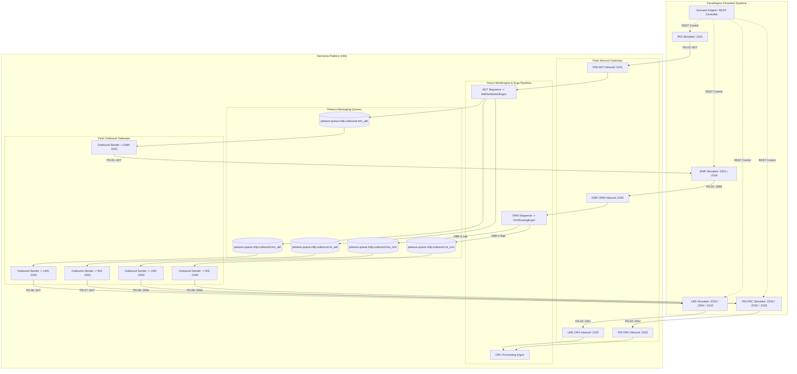

# Requirements

### Overview & Goals
**Harmonia Paradeigma** is an end-to-end runnable exemplar and reference solution demonstrating representative HL7 v2.4 clinical workflows across simulated healthcare systems interacting with Harmonia Health Integration Environment (HIE).

The solution models four distinct simulated healthcare applications:
1. **PAS** — Patient Administration System (Generates stateful ADT events: A01, A02, A03, A04, A08, A11, A12, A13).
2. **EMR** — Electronic Medical Record (Consumes ADT events, generates Laboratory and Diagnostic Imaging ORM^O01 orders).
3. **LMS** — Laboratory Management System (Consumes ADT and ORM orders, generates ORU^R01 lab results).
4. **RIS-PAC** — Diagnostic Imaging / PACS System (Consumes ADT and ORM orders, generates ORU^R01 imaging reports).

### Scope
- **In Scope**:
  - Implementation of nine logical MLLP interfaces (PD-01 to PD-09).
  - Strict MLLP transport framing (`<VT>...<FS><CR>`) over TCP/IP.
  - Complete HL7 ACK lifecycle (AA, AE, AR) with MSH-10 / MSA correlation.
  - Harmonia internal fan-out of PAS ADT to EMR, LMS, and RIS-PAC.
  - Deterministic Ponos routing of ORM orders based on OBR-4 Universal Service Identifier (Lab -> LMS, Imaging -> RIS-PAC).
  - Inbound ORU result processing and recording.
  - Synthetic, deterministic patient/order/result generator (seed-based).
  - Scenario Engine supporting complete clinical patient journeys and independent timed background generation.
  - Failure simulation (dropped connections, ACK delays, application errors, duplicate messages).
  - Local multi-container Docker Compose deployment and comprehensive unit/integration/E2E test suite.
  - Full architectural documentation.
- **Out of Scope**:
  - Live FHIR Agora Patient Diagnostics Room integration (reserved for later phases).
  - Real patient data / PHI.
  - External proprietary EHR vendor interfaces.

### User Stories
- **As a Developer / Architect**, I want a runnable reference implementation of Harmonia HL7 v2.4 integration so that I can understand, test, and build upon Harmonia's gateway, messaging, and workflow capabilities.
- **As an Integration Engineer**, I want automated verification of ADT fan-out and deterministic ORM routing so that I can ensure zero message loss and correct endpoint delivery under concurrency.
- **As a QA / Test Engineer**, I want configurable execution profiles (`TEST`, `DEMO`, `LOAD`) and failure simulation modes so that I can validate system resilience and recovery behavior.

### Functional Requirements
- **FR-01 (Transport)**: All external interfaces must use HL7 v2.4 over TCP/IP with MLLP framing.
- **FR-02 (Interface Matrix)**: Support all 9 defined interfaces (PD-01 to PD-09) with configurable host/port bindings.
- **FR-03 (ACK Handling)**: Return valid HL7 ACKs (AA, AE, AR) within configurable timeouts and track correlation via MSH-10/MSA.
- **FR-04 (ADT Fan-out)**: Single PAS ADT ingestion must fan out inside Harmonia to EMR, LMS, and RIS-PAC.
- **FR-05 (ORM Routing)**: EMR ORM messages must be routed deterministically to LMS or RIS-PAC by inspecting OBR-4.
- **FR-06 (Scenario Orchestration)**: The `ParadeigmaScenarioEngine` must orchestrate multi-system patient journeys via simulator REST control APIs.
- **FR-07 (Independent Operation)**: Simulators must support standalone timed generation in `FIXED` and `RANDOM_RANGE` modes.
- **FR-08 (Failure Injection)**: Support configurable, seed-controlled failure scenarios (timeouts, bad ACKs, connection drops, duplicates).

### Non-Functional Requirements
- **Compatibility**: HL7 v2.4 baseline with extensible parser configuration for v2.3.1 / v2.5 / v2.5.1.
- **Determinism**: 100% reproducible test executions using configurable random seeds.
- **Observability**: Structured logging without clinical payload leakage by default; Micrometer metrics for message rates, latency, and ACK statuses.
- **Isolation**: Each simulated system must run as an independent application process.

# Technical Design

### Current Implementation
- **Pylai (`pylai-mllp-in`, `pylai-mllp-out`)**: Implements Apache Camel MLLP endpoints for ADT and MFN ingestion, transforming raw HL7 messages into FHIR `Communication` and `Task` resources and publishing `ErgonEvent`s to Artemis/Petasos queues. Outbound MLLP processor supports dynamic destination routing from Petasos queues.
- **Energeia Ponos (`energeia/ponos`, `energeia/erga`)**: Task execution engine routing tasks through `TaskSequenceLoader` and executing `Ergon` processing steps.
- **Petasos (`petasos-api`, `petasos-artemis`, `petasos-core`)**: Provides asynchronous message transport, queuing, deduplication, and topic/queue delivery.
- **Calliope (`calliope`)**: Supplies canonical domain models, `Topic`, `ErgonPayload`, and `Pragma` definitions.

### Key Decisions
1. **Harmonia Routing & Fan-out**: Ponos TaskSequence Pipeline. Inbound messages ingested by Pylai are transformed to Tasks and processed by Ponos `Erga` activities (`AdtDistributionErgon` and `OrmRoutingErgon`) which publish outbound dispatch requests to dedicated Petasos egress queues consumed by `pylai-mllp-out`.
2. **Paradeigma Scenario Coordination**: Centralized Conductor with REST. `ParadeigmaScenarioEngine` drives coordinated patient journeys by invoking REST management APIs on each simulator while each simulator also supports autonomous background timer modes.
3. **HL7 Parsing & Framing**: Use HAPI HL7 v2 (`PipeParser`, `Terser`) with custom MLLP framing handlers and Camel MLLP components.
4. **Synthetic Data Engine**: Seed-based deterministic generator for patients, orders (LOINC/local lab codes, RadLex/imaging codes), and results.

### Architecture Diagram


### Interface & Port Matrix
| Interface ID | Interface Name | Source | Destination | HL7 Type | Default Port | Transport |
|---|---|---|---|---|---|---|
| **PD-01** | PAS-ADT-IN | PAS Simulator | Harmonia Pylai | ADT^A01/A02/A03/A04/A08 | `2101` | MLLP / TCP |
| **PD-02** | LMS-ORU-IN | LMS Simulator | Harmonia Pylai | ORU^R01 (Lab) | `2102` | MLLP / TCP |
| **PD-03** | RISPAC-ORU-IN | RIS-PAC Simulator | Harmonia Pylai | ORU^R01 (Imaging) | `2103` | MLLP / TCP |
| **PD-04** | EMR-ORM-IN | EMR Simulator | Harmonia Pylai | ORM^O01 (Lab & Rad) | `2104` | MLLP / TCP |
| **PD-05** | EMR-ADT-OUT | Harmonia Pylai | EMR Simulator | ADT (Fan-out) | `2201` | MLLP / TCP |
| **PD-06** | LMS-ADT-OUT | Harmonia Pylai | LMS Simulator | ADT (Fan-out) | `2202` | MLLP / TCP |
| **PD-07** | RISPAC-ADT-OUT | Harmonia Pylai | RIS-PAC Simulator | ADT (Fan-out) | `2203` | MLLP / TCP |
| **PD-08** | LMS-ORM-OUT | Harmonia Pylai | LMS Simulator | ORM^O01 (Lab Routed) | `2204` | MLLP / TCP |
| **PD-09** | RISPAC-ORM-OUT | Harmonia Pylai | RIS-PAC Simulator | ORM^O01 (Rad Routed) | `2205` | MLLP / TCP |

### Module Structure
```
harmonia/
├── pom.xml (registers paradeigma module)
├── paradeigma/
│   ├── pom.xml
│   ├── paradeigma-common/
│   │   ├── src/main/java/net/fhirfactory/harmonia/paradeigma/common/
│   │   │   ├── mllp/ (MllpClient, MllpServer, MllpFrameCodec)
│   │   │   ├── hl7/ (MessageBuilders, AckHandler, Parsers)
│   │   │   ├── generator/ (PatientGenerator, OrderGenerator, ResultGenerator)
│   │   │   ├── model/ (ScenarioStep, PatientProfile, OrderProfile, ResultProfile)
│   │   │   ├── failure/ (FailureSimulator, FaultInjectionConfig)
│   │   │   └── rest/ (SimControlDto, RestEndpoints)
│   ├── paradeigma-pas/
│   │   └── src/main/java/net/fhirfactory/harmonia/paradeigma/pas/ (PasApplication, PasScheduler, PasRestController)
│   ├── paradeigma-emr/
│   │   └── src/main/java/net/fhirfactory/harmonia/paradeigma/emr/ (EmrApplication, EmrMllpListener, EmrRestController)
│   ├── paradeigma-lms/
│   │   └── src/main/java/net/fhirfactory/harmonia/paradeigma/lms/ (LmsApplication, LmsMllpListener, LmsResultWorker, LmsRestController)
│   ├── paradeigma-rispac/
│   │   └── src/main/java/net/fhirfactory/harmonia/paradeigma/rispac/ (RispacApplication, RispacMllpListener, RispacResultWorker, RispacRestController)
│   ├── paradeigma-scenarios/
│   │   └── src/main/java/net/fhirfactory/harmonia/paradeigma/scenarios/ (ParadeigmaScenarioEngine, PatientJourneyScenario, ProfileManager)
│   ├── paradeigma-test/
│   │   └── src/test/java/net/fhirfactory/harmonia/paradeigma/test/ (E2EJourneyTest, FanOutTest, OrmRoutingTest, ConcurrencyTest, FailureRecoveryTest)
│   ├── deployment/
│   │   └── docker-compose-paradeigma.yml
│   └── docs/ (architecture.md, interfaces.md, hl7-events.md, simulator docs, failure-testing.md, running-paradeigma.md, troubleshooting.md)
```

### Deterministic Routing Rules
- **Laboratory ORM (PD-08)**: Matches when `OBR-4.1` starts with `LAB`, `L_`, `LOINC`, or belongs to configured lab test catalogs (e.g. `CBC`, `ELEC`, `LFT`, `GLU`). Routed to LMS queue `petasos.queue.mllp.outbound.lms_orm`.
- **Diagnostic Imaging ORM (PD-09)**: Matches when `OBR-4.1` starts with `RAD`, `IMG`, `XR`, `CT`, `MRI`, `US` (e.g. `XR_CHEST`, `CT_HEAD`, `MRI_BRAIN`). Routed to RIS-PAC queue `petasos.queue.mllp.outbound.ris_orm`.

# Testing

### Validation Approach
Automated testing is divided into three levels:
1. **Unit Tests**: Validate MLLP framing/decoding, HAPI HL7 v2.4 message generation, ACK parsing/correlation, OBR-4 routing logic, and synthetic generator reproducibility.
2. **Component & Integration Tests**: Validate Pylai MLLP inbound/outbound routes, Ponos Erga execution, Petasos message queue isolation, and simulator REST control endpoints.
3. **End-to-End System Tests**: Run complete simulated clinical scenarios across all 4 simulators and Harmonia, verifying message delivery across all 9 interfaces, ACK receipt, and message correlation.

### Key Scenarios
- **Scenario 1: Inbound ADT Verification (PAS -> Harmonia)**
  - PAS sends ADT^A04, A01, A02, A08, A03 to Pylai (:2101).
  - Verify MLLP framing, MSH-10 uniqueness, and immediate AA ACK response.
- **Scenario 2: ADT Fan-Out (Harmonia -> EMR, LMS, RIS-PAC)**
  - Single ADT from PAS fans out to EMR (:2201), LMS (:2202), and RIS-PAC (:2203).
  - Verify each simulator receives the exact message, returns ACK AA, and records receipt.
- **Scenario 3: Deterministic ORM Routing**
  - EMR sends Laboratory ORM^O01 (`CBC`) and Imaging ORM^O01 (`XR_CHEST`) to Harmonia (:2104).
  - Verify Ponos routes Lab order strictly to LMS (:2204) and Imaging order strictly to RIS-PAC (:2205).
- **Scenario 4: Result Ingestion (LMS & RIS-PAC ORU -> Harmonia)**
  - LMS sends Lab ORU^R01 to Harmonia (:2102) and RIS-PAC sends Imaging ORU^R01 to Harmonia (:2103).
  - Verify Harmonia parses, acknowledges, and records the result tasks.
- **Scenario 5: Full End-to-End Patient Journey**
  - Execute `PatientJourneyScenario` covering registration, admission, ADT fan-out, lab order/result, imaging order/result, patient transfer, and discharge.
  - Verify complete lifecycle correlation (Patient ID, Visit ID, Order IDs, MSH-10s).
- **Scenario 6: Concurrency & Timing Test**
  - Run continuous multi-patient journeys under `LOAD` profile for 10 minutes.
  - Verify zero message loss, no cross-patient correlation contamination, and correct metrics.

### Edge Cases & Failure Recovery
- **Dropped Connection / Network Disconnect**: Simulator disconnects mid-transmission; verify Harmonia retry policies and clean connection recovery.
- **Destination Unavailable**: Outbound simulator is offline; verify Petasos queue buffering and replay when simulator starts.
- **NACK / Application Error (AE / AR)**: Simulator returns AE/AR; verify distinction between transport retries and non-retryable application errors.
- **Duplicate MSH-10 Transmission**: Send identical MSH-10 twice; verify Petasos/Ponos duplicate detection and idempotent ACK handling.
- **Malformed HL7 Segments**: Ingest corrupted HL7 payload; verify immediate AE ACK response and error audit logging without pipeline crashes.

# Delivery Steps

### ✓ Step 1: Core Simulator Framework & Synthetic Clinical Data Engine (paradeigma-common)
`paradeigma-common` provides reusable MLLP networking, HL7 v2.4 message framing/parsing, deterministic synthetic dataset generators, and failure simulation models.

- Implement MLLP framing utilities (`<VT>...<FS><CR>`) and NIO-based MLLP client and server engines with configurable socket timeouts, reconnect policies, and ACK handling.
- Implement HL7 v2.4 message builders and parsers using HAPI (`PipeParser`, `Terser`) for ADT (A01, A02, A03, A04, A08, A11, A12, A13), ORM^O01 (Lab and Rad), and ORU^R01 (Lab and Rad).
- Implement `SyntheticPatientGenerator`, `SyntheticOrderGenerator`, and `SyntheticResultGenerator` with configurable pseudo-random seed support for deterministic test reproducibility.
- Implement failure simulation interceptors supporting configurable error probabilities (dropped connections, ACK delays, AE/AR NACKs, malformed segments, duplicate MSH-10s).
- Build unit tests validating MLLP framing, message generation, ACK correlation, and synthetic data determinism.

### ✓ Step 2: Harmonia Interface Gateway Extensions & Erga Routing Pipelines
Harmonia Pylai gateways and Ponos Erga pipelines support all 9 logical interfaces, deterministic OBR-4 ORM routing, and multi-destination ADT fan-out.

- Extend `pylai-mllp-in` with multi-port inbound listeners for PD-01 (PAS ADT :2101), PD-02 (LMS ORU :2102), PD-03 (RIS-PAC ORU :2103), and PD-04 (EMR ORM :2104).
- Implement `IncomingOrmMessageProcessor` and `IncomingOruMessageProcessor` in Pylai to convert inbound HL7 messages into FHIR `Communication` and `Task` resources and dispatch `ErgonEvent`s to Petasos.
- Implement `AdtDistributionErgon` in `energeia/erga` to fan out ADT events to EMR (:2201), LMS (:2202), and RIS-PAC (:2203) outbound Petasos queues.
- Implement `OrmRoutingErgon` in `energeia/erga` to evaluate OBR-4 Universal Service Identifier and route Lab orders to LMS (:2204) and Rad orders to RIS-PAC (:2205).
- Configure outbound `pylai-mllp-out` destination registry and Petasos queues for endpoints PD-05 through PD-09.
- Register TaskSequences in Ponos and verify pipeline execution with unit/integration tests.

### ✓ Step 3: Simulated Healthcare Applications (PAS, EMR, LMS, RIS-PAC)
Four independent simulated healthcare applications (PAS, EMR, LMS, RIS-PAC) are implemented with MLLP interfaces, background timers, failure injection, and REST management endpoints.

- Implement `paradeigma-pas`: stateful patient lifecycle management (A04 -> A01 -> A02 -> A08 -> A03), timed generation modes (FIXED, RANDOM_RANGE), REST API (`/api/pas/...`), and MLLP client sending to Harmonia :2101.
- Implement `paradeigma-emr`: MLLP listener (:2201) receiving ADT, MLLP client sending ORM^O01 (Lab and Rad) to Harmonia :2104, REST API (`/api/emr/...`), and order correlation tracking.
- Implement `paradeigma-lms`: MLLP listener (:2202 for ADT, :2204 for ORM), MLLP client sending ORU^R01 lab results to Harmonia :2102, configurable result delays, REST API (`/api/lms/...`), and ACK generation.
- Implement `paradeigma-rispac`: MLLP listener (:2203 for ADT, :2205 for ORM), MLLP client sending ORU^R01 imaging reports to Harmonia :2103, configurable reporting delays, REST API (`/api/rispac/...`), and ACK generation.
- Add application health checks, structured logging, and Micrometer metrics across all four simulators.

### ✓ Step 4: Scenario Conductor Engine & Execution Profiles (paradeigma-scenarios)
`paradeigma-scenarios` coordinates end-to-end multi-system patient journeys and manages runtime execution profiles.

- Implement `ParadeigmaScenarioEngine` providing automated orchestration across the 4 simulators via REST control APIs.
- Implement `PatientJourneyScenario` executing the complete clinical journey: Register -> Admit -> ADT Fan-out -> EMR Lab Order -> LMS Processing -> LMS ORU Result -> EMR Rad Order -> RIS-PAC Processing -> RIS-PAC ORU Result -> Transfer -> Discharge.
- Implement configuration profiles (`DEMO` with human-observable pacing, `TEST` with accelerated deterministic millisecond execution, `LOAD` with concurrent patient journeys).
- Implement tracking and correlation verification across MSH-10, Patient ID, Visit ID, Order ID, and Harmonia correlation IDs.

### ✓ Step 5: Deployment Orchestration, Automated E2E Test Suite & Documentation
The complete reference solution is runnable via Docker Compose, validated by comprehensive automated E2E tests, and documented.

- Create `docker-compose.yml` in `deployment/` (or update root compose) defining containers for `paradeigma-pas`, `paradeigma-emr`, `paradeigma-lms`, `paradeigma-rispac`, alongside Pylai, Ponos, Petasos, and Mnemosyne.
- Implement automated integration and E2E tests in `paradeigma-test` verifying all 9 interface flows, fan-out, routing, ACK handling, duplicate idempotency, and failure recovery.
- Create 10-minute automated concurrency timing test verifying multi-patient journeys without correlation crosstalk.
- Author complete technical documentation in `docs/` (`architecture.md`, `interfaces.md`, `hl7-events.md`, simulator guides, `failure-testing.md`, `running-paradeigma.md`, `troubleshooting.md`) with Mermaid diagrams.