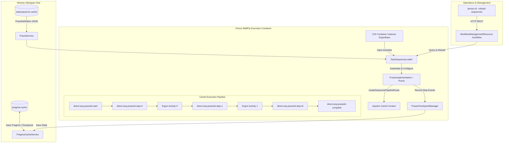

# Requirements

### Overview & Goals
The objective is to expand the master Harmonia Health Information Exchange (HIE) ArchiMate 3.2 Technical Architecture Specification (`docs/latex/main.tex`) by creating a comprehensive, rigorous LaTeX appendix: **Appendix D: Implementation and Deployment Guide for Praxis Workflow Sequences**.

This appendix will provide an exhaustive, production-grade technical manual detailing the step-by-step engineering process, architectural patterns, component blueprints, configuration parameters, state persistence workflows, testing strategies, and containerized deployment considerations required to implement, orchestrate, test, and operate:
1. **Praxis Workflow Sequence Architecture**: Decoupling declarative workflow metadata (`PraxisDefinition`) from Camel/CDI runtime execution (`PraxisImplementation` / `Praxis`), managing topic subscriptions (`TopicSubscription`, `TopicHierarchy`), configuring target gateway routing, and executing ordered activity pipelines.
2. **Dynamic Route Generation & Endpoint Chaining**: Dynamically synthesizing Apache Camel routing topologies (`createSequencePipelineRoute()`, `direct:seq-<praxisId>-step-N`), orchestrating inter-activity handoffs, and managing exchange properties and header invariants.
3. **Audit Checkpointing & Durable State Persistence**: Integrating `PraxisCheckpointManager` to record execution audit records (`PIPELINE_INGRESS`, `PRE_ERGON`, `POST_ERGON`, `PIPELINE_COMPLETE`, `PIPELINE_FAILED`) snapshotting in-flight `Pragma` task envelopes into the `Mneme` Infinispan grid (`tasksequence-cache` and `pragma-cache`).
4. **Dynamic Discovery, Seeding & Runtime Registration**: Operating `TaskSequenceLoader` to dynamically query `PraxisService`, discover `@Dependent` `ErgonBase` CDI beans, apply default seeds via `TaskSequenceDefaultSeeder`, and register active routes into the `CamelContext`.
5. **Testing, Verification & Quality Assurance**: Testing workflow sequences using `CamelTestSupport`, synthetic `Pragma` fixtures, mock endpoint assertions, and end-to-end integration testing.
6. **Deployment, Cluster Operations & Live Dynamic Reload**: Containerizing in WildFly / Ponos, managing Infinispan cache replication, operating the `/workflow` REST management endpoints, and executing dynamic reload via `ponos-cli --reload-sequences`.

The resulting documentation will strictly adhere to established ArchiMate 3.2 standards, LaTeX styling (`styles/harmonia-doc.sty`, `styles/harmonia-archimate.sty`), and provide concrete code listings, JSON schemas, configuration templates, sequence interactions, and a dedicated TikZ architecture diagram.

### Scope
- **In Scope**:
  - Authoring `docs/latex/chapters/appendix-praxis-workflow.tex` covering the complete Praxis development, orchestration, checkpointing, testing, and deployment lifecycle.
  - Creating TikZ ArchiMate diagram:
    - `docs/latex/diagrams/fig-praxis-workflow-architecture.tex`: Detailed ArchiMate 3.2 view of Praxis workflow architecture, dynamic Camel pipeline synthesis, CDI activity discovery, checkpoint management, cache persistence, and runtime administration.
  - Updating `docs/latex/main.tex` to include Appendix D (`\input{chapters/appendix-praxis-workflow.tex}`).
  - Updating `docs/latex/chapters/00-frontmatter.tex` to reference the Praxis implementation guide in the Executive Summary and system outline.
  - Comprehensive coverage of the 7 core sections of the Praxis Implementation Guide:
    1. Architectural Principles & the Praxis Paradigm (Decoupling `PraxisDefinition` from `PraxisImplementation`, topic subscriptions, gateway targeting, lifecycle checkpoints, and dual-cache architecture in Mneme).
    2. Step-by-Step Praxis Creation Blueprint (Defining JSON/Java descriptors, configuring topic routing, activity ordering, dynamic route compilation, and exception handling).
    3. Production Reference Implementation (Complete Java implementation of a multi-step clinical pipeline, e.g. `PatientCareAdmissionPraxis` / `LabResultPipelinePraxis`, alongside a declarative JSON definition).
    4. Dynamic Route Generation & Camel Pipeline Topology (`createSequencePipelineRoute()`, direct endpoint chaining, ingress conduit bridge, and error boundary handling).
    5. Dynamic Discovery, Seeding & CDI Binding (`TaskSequenceLoader`, `TaskSequenceDefaultSeeder`, `Instance<ErgonBase>` injection, and CamelContext route registration).
    6. Multi-Tier Testing Strategies (`CamelTestSupport` unit tests, `ErgonPraxisEndToEndIntegrationTest`, step assertion, and failure snapshotting validation).
    7. Deployment, Cluster Management & Operational Runbook (WildFly Jakarta EE containerization, `/workflow` REST API, `ponos-cli` dynamic reload, and Infinispan cache management).
  - Multi-pass `pdflatex` compilation and verification of `main.pdf`.
- **Out of Scope**:
  - Modifying the underlying Java production codebase or altering existing workflow routes.
  - Non-Camel external BPMN workflow engines.

### User Stories
- **As a Workflow Integration Developer**, I want an authoritative guide for authoring new Praxis workflow sequences so that I can compose modular Ergon activities into deterministic, auditable clinical pipelines.
- **As a Solutions Architect**, I want formal ArchiMate 3.2 process and component models for Praxis workflow orchestration so that I can verify data governance, checkpointing compliance, and transaction isolation.
- **As a Platform / DevOps Engineer**, I want clear operational instructions for querying workflow status, performing dynamic route reload via `ponos-cli`, and maintaining Infinispan cluster consistency for task sequences.

### Functional Requirements
- **FR-1**: Author `docs/latex/chapters/appendix-praxis-workflow.tex` structured into dedicated sections covering architecture, code blueprint, reference implementation, dynamic route generation, discovery/seeding, testing, and deployment.
- **FR-2**: Create `docs/latex/diagrams/fig-praxis-workflow-architecture.tex` using ArchiMate TikZ styling to model the Praxis definition model, dynamic Camel pipeline synthesis, CDI activity injection, checkpoint manager, and Ponos runtime management.
- **FR-3**: Provide complete, copy-paste ready Java code and JSON schema blueprints demonstrating `PraxisImplementation` configuration, topic subscription matching, and activity chaining.
- **FR-4**: Provide concrete XML/JSON/YAML configuration examples for declarative task sequence loading, CDI wiring, and REST administration.
- **FR-5**: Detail testing patterns using `CamelTestSupport`, synthetic `Pragma` fixtures, mock endpoints, and assertion of `PragmaCheckpoint` records.
- **FR-6**: Integrate Appendix D into `docs/latex/main.tex` and update front matter nomenclature and summaries.
- **FR-7**: Compile and validate `main.pdf` using multi-pass `pdflatex`, ensuring zero fatal errors, resolved cross-references, and updated TOC, LOF, and LOT.

### Non-Functional Requirements
- **NFR-1 (Typographical Quality & Formatting)**: Strict adherence to LaTeX formatting conventions, `harmoniablue`/`harmoniaaccent` color palettes, `booktabs` tables, and syntax-highlighted `lstlisting` code blocks.
- **NFR-2 (Architectural & Code Fidelity)**: All class names, interfaces, method signatures, queue names, and configuration keys must reflect actual Harmonia platform code (`calliope/model/praxis`, `energeia/praxis`, `energeia/erga`, `energeia/ponos`, `hestia`).
- **NFR-3 (Flawless Compilation)**: Compilation must succeed cleanly via `pdflatex` without undefined citations, missing references, or broken diagrams.

# Technical Design

### Current Implementation
Harmonia provides the `Energeia` workflow orchestration layer featuring:
- **`calliope` (`net.fhirfactory.harmonia.model.praxis`)**:
  - `PraxisDefinition`: Decoupled serializable POJO encapsulating sequence metadata, topic subscriptions (`TopicSubscription`), target gateway instances, trigger types, and ordered activity class names.
  - `Topic`: Domain/model/element/qualifier hierarchical message categorization.
- **`energeia/praxis` (`net.fhirfactory.harmonia.praxis`)**:
  - `PraxisImplementation` (and `Praxis` subclass): Runtime orchestrator that extends `PraxisDefinition`, binds `@Dependent` `ErgonBase` activities from CDI, configures chained Camel endpoints (`direct:seq-<praxisId>-step-N`), and builds the dynamic Camel `RouteBuilder`.
  - `PraxisCheckpointManager`: Creates and persists `PragmaCheckpoint` audit records (`PIPELINE_INGRESS`, `PRE_ERGON`, `POST_ERGON`, `PIPELINE_COMPLETE`, `PIPELINE_FAILED`) into the `Mneme` Infinispan cache.
  - `PraxisService`: Manages CRUD and HotRod synchronization for `PraxisDefinition` records in the `tasksequence-cache`.
  - `TaskSequenceLoader`: Scans `PraxisService`, resolves CDI `Instance<ErgonBase>` beans, and registers active routes with `CamelContext`.
  - `TaskSequenceDefaultSeeder`: Seeds default workflow configurations into Infinispan on initial boot.
- **`energeia/ponos` (`net.fhirfactory.harmonia.praxis`)**:
  - `TaskProcessorRouteBuilder`: Subscribes to inbound queues and dispatches exchanges to sequence pipelines.
  - `PragmaWorkflowDispatcher`: Routes incoming `Pragma` envelopes to matching Praxis pipelines based on topic or gateway criteria.
  - `WorkflowManagementResource`: REST endpoint (`/workflow/status`, `/workflow/validate`, `/workflow/reload`) for runtime administration.

### Key Decisions
1. **Dedicated Master Appendix Structure**: Create **Appendix D: Implementation and Deployment Guide for Praxis Workflow Sequences** structured into 7 comprehensive sections:
   - *Section D.1: Architectural Blueprint & the Praxis Paradigm*
   - *Section D.2: Step-by-Step Praxis Creation Blueprint*
   - *Section D.3: Production Reference Implementation: PatientCareAdmissionPraxis*
   - *Section D.4: Dynamic Route Generation, Endpoints & Camel Pipeline Topology*
   - *Section D.5: Dynamic Discovery, Seeding & Runtime Registration (TaskSequenceLoader)*
   - *Section D.6: Multi-Tier Testing Strategies (CamelTestSupport, Mocking & Checkpoint Assertion)*
   - *Section D.7: Deployment, Cluster Management & Operational Runbook (REST API & ponos-cli)*
2. **ArchiMate 3.2 Process & Component Diagram**:
   - Create `fig-praxis-workflow-architecture.tex`: Visualizes `PraxisDefinition` (JSON/Cache) -> `TaskSequenceLoader` -> CDI Bean Discovery -> `PraxisImplementation` Dynamic Route Synthesis -> Camel Context (`direct:seq-pipeline-start` -> `direct:seq-step-0` -> `direct:seq-step-1` -> `direct:seq-complete`) -> `PraxisCheckpointManager` -> `Mneme` Cache Grid -> REST Management & CLI.
3. **Comprehensive Code Blueprints**: Provide production-grade Java and JSON reference implementations:
   - `PraxisDefinition` JSON configuration for declarative ingestion.
   - `PatientCareAdmissionPraxis` Java class demonstrating multi-step activity composition and checkpoint management.
   - `PraxisWorkflowTest` Camel test harness validating step execution, checkpoint ordering, and failure snapshots.
4. **Deployment & Operational Guidance**: Document WildFly runtime deployment, `/workflow` REST APIs, Infinispan cluster caching, and dynamic reload via `ponos-cli --reload-sequences`.

### Component & File Structure
- **New Files**:
  - `docs/latex/chapters/appendix-praxis-workflow.tex`: Master Praxis workflow implementation and deployment guide.
  - `docs/latex/diagrams/fig-praxis-workflow-architecture.tex`: ArchiMate Praxis workflow architecture diagram.
- **Modified Files**:
  - `docs/latex/main.tex`: Add `\input{chapters/appendix-praxis-workflow.tex}` under `\appendix`.
  - `docs/latex/chapters/00-frontmatter.tex`: Update system overview and document map.

### Architecture Diagram

### Risks & Mitigations
- **Risk**: LaTeX syntax errors, unescaped characters (`_`, `^`, `%`), or TikZ node collisions causing build breaks.
  - *Mitigation*: Strictly escape all LaTeX specials, follow existing TikZ ArchiMate macro patterns, and validate with multi-pass `pdflatex` compilation.
- **Risk**: Inconsistencies between documented Praxis methods and actual `PraxisDefinition` / `PraxisImplementation` Java source.
  - *Mitigation*: Ground all examples directly on `PraxisDefinition.java`, `PraxisImplementation.java`, `PraxisCheckpointManager.java`, and `TaskSequenceLoader.java`.

# Testing

### Validation Approach
1. Compile `docs/latex/main.tex` with `pdflatex` (two passes to resolve cross-references, TOC, LOF, LOT).
2. Verify that `main.pdf` contains Appendix A (Paradeigma), Appendix B (MLLP Services), Appendix C (Ergon Modules), and Appendix D (Praxis Sequences) with complete formatting and diagrams.
3. Review compilation logs to confirm zero undefined references or fatal syntax errors.

### Key Verification Scenarios
- **Scenario 1**: Verify Appendix D appears in the Table of Contents with numbered sections (D.1 through D.7).
- **Scenario 2**: Verify the new TikZ diagram (`fig-praxis-workflow-architecture.tex`) renders correctly within page boundaries in the generated PDF.
- **Scenario 3**: Verify all tables (Lifecycle Checkpoint Stages, Exchange Properties, Configuration Parameters, Readiness Criteria) format cleanly with `booktabs` and `tabularx`.
- **Scenario 4**: Verify all Java, JSON, XML, and Shell code listings format cleanly with syntax highlighting and proper indentation.

# Delivery Steps

### ✓ Step 1: Design ArchiMate TikZ Diagram for Praxis Workflow Architecture
Create the dedicated ArchiMate 3.2 TikZ process and component diagram illustrating the Praxis workflow execution, dynamic route compilation, and checkpoint management model.
- Create `docs/latex/diagrams/fig-praxis-workflow-architecture.tex` modeling `PraxisDefinition`, `TaskSequenceLoader`, CDI activity resolution, dynamic Camel route synthesis, `PraxisCheckpointManager`, and `Mneme` cache persistence.

### ✓ Step 2: Author Appendix D: Praxis Architecture, Creation Blueprint & Reference Implementation (Sections D.1 to D.3)
Author the core architectural principles, creation blueprints, declarative schemas, and production reference implementation in `docs/latex/chapters/appendix-praxis-workflow.tex`.
- Section D.1: Architectural Blueprint, the Praxis Paradigm, Topic Subscriptions, and Checkpoint Lifecycle.
- Section D.2: Step-by-Step Praxis Creation Blueprint (Java/JSON definitions, activity ordering, dynamic compilation, error handling).
- Section D.3: Production Reference Implementation (`PatientCareAdmissionPraxis` full Java code and declarative JSON schema).

### ✓ Step 3: Author Appendix D: Dynamic Routing, Discovery, Testing, and Deployment Guide (Sections D.4 to D.7)
Author the dynamic Camel pipeline topology, `TaskSequenceLoader` discovery/seeding, testing patterns, and operational runbook in `docs/latex/chapters/appendix-praxis-workflow.tex`.
- Section D.4: Dynamic Route Generation, Endpoints & Camel Pipeline Topology (`createSequencePipelineRoute()`, endpoint chaining).
- Section D.5: Dynamic Discovery, Seeding & CDI Binding (`TaskSequenceLoader`, `TaskSequenceDefaultSeeder`, `PraxisService`).
- Section D.6: Multi-Tier Testing Strategies (`CamelTestSupport`, mock endpoints, checkpoint assertions, failure snapshots).
- Section D.7: Deployment, Cluster Management & Operational Runbook (WildFly containerization, `/workflow` REST API, `ponos-cli` dynamic reload).

### ✓ Step 4: Integrate Appendix D into Master LaTeX Specification, Compile PDF, and Validate
Integrate the new appendix into the master LaTeX build, update front matter, and verify multi-pass compilation.
- Update `docs/latex/main.tex` to input `chapters/appendix-praxis-workflow.tex`.
- Update `docs/latex/chapters/00-frontmatter.tex` to cross-reference Appendix D in the Executive Summary and system outline.
- Execute multi-pass `pdflatex` compilation in `docs/latex/` and verify that `main.pdf` compiles cleanly without errors and includes all updated tables, figures, and sections.