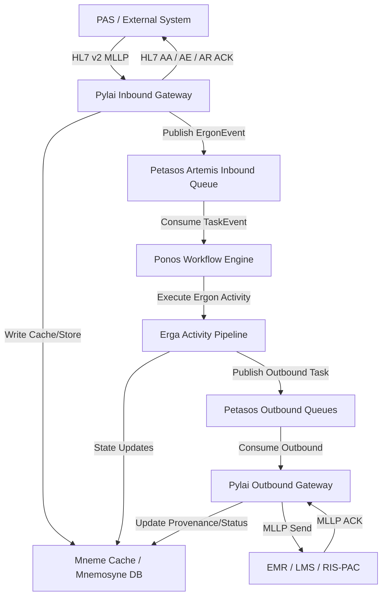

# Requirements

### Overview & Goals
Review the implemented Harmonia Health Integration Environment (HIE) and Paradeigma clinical simulator codebase to significantly expand the technical documentation and validation suite regarding persistence, transaction boundaries, message/workflow state, and failure recovery. The objective is to produce authoritative, code-grounded documentation and automated integration tests that answer:
> What state Harmonia persists, where it is persisted, why it is persisted, when it changes, and how that state allows processing to recover following failure.

### Scope
- **In Scope**:
  - Comprehensive documentation of persistent entities, database schemas (`hie_fhir_resources`, `hie_operations_resources`), caches (Mneme Infinispan), and Artemis persistent journal.
  - End-to-end message lifecycle and timeline sequence diagrams (PAS ADT fan-out, EMR ORM routing, LMS/RIS-PAC ORU processing).
  - Transaction boundaries, dual-write window analysis, and point-of-no-data-loss determinations.
  - Failure-recovery architecture, comprehensive failure matrix, idempotency rules, ACK semantics (AA/AE/AR), retry policies, and DLQ handling.
  - Formal recovery guarantees and Recovery Point Objectives (RPO).
  - Gap analysis document (`docs/persistence-recovery-gaps.md`) capturing differences between current implementation and intended architecture.
  - Six automated recovery acceptance tests in `paradeigma/paradeigma-test`.
  - Master architecture cross-linking in `docs/architecture.md`.
- **Out of Scope**:
  - Major architectural re-engineering or replacing core persistence frameworks (the task is inspect, document, test, and identify gaps).
  - Non-persistence UI frontend documentation.

### User Stories
- **As a Systems Architect / Backend Developer**, I want clear documentation of Harmonia's persistence and recovery models so that I can maintain, extend, and operate the platform without risking clinical data loss.
- **As an Integration Operator**, I want to understand failure detection, retry behavior, DLQ inspection, and restart recovery procedures so that I can resolve operational incidents reliably.
- **As a QA / Test Engineer**, I want automated recovery acceptance tests in Paradeigma so that crash recovery, redelivery, and idempotency guarantees can be continuously validated.

### Functional Requirements
- **FR-1**: Create `docs/persistence-architecture.md` detailing the 4-tier storage architecture, entity catalogue, ownership boundaries, and Artemis journal vs database persistence.
- **FR-2**: Create `docs/database-schema.md` detailing all tables, JPA mappings, indexes, constraints, and versioning.
- **FR-3**: Create `docs/message-lifecycle.md` tracing ADT, ORM, and ORU flows with Mermaid sequence diagrams, state transitions, transaction boundaries, and point-of-no-data-loss markers.
- **FR-4**: Create `docs/failure-recovery.md` providing a comprehensive failure matrix, restart recovery procedures, lease/ownership rules, idempotency keys, and ACK semantics.
- **FR-5**: Create `docs/recovery-guarantees.md` specifying delivery guarantees (at-least-once, effectively-once) and RPO per processing phase.
- **FR-6**: Create `docs/persistence-recovery-gaps.md` cataloguing all identified implementation gaps (e.g. REC-001, REC-002, REC-003) with risk ratings and remediation paths.
- **FR-7**: Implement the 6 required recovery acceptance tests in `paradeigma/paradeigma-test`.
- **FR-8**: Update `docs/architecture.md` with cross-links to all new persistence and recovery documents.

### Non-Functional Requirements
- **NFR-1 (Accuracy & Code-Grounded)**: All documentation must reflect actual classes, tables, queues, and configuration in the codebase.
- **NFR-2 (Privacy & Compliance)**: Documentation must reflect strict PHI protection standards (no sensitive payload logging).
- **NFR-3 (Deterministic Testing)**: Integration tests must execute deterministically using embedded Artemis brokers and mock MLLP servers.

# Technical Design

### Current Implementation
Harmonia unites several modular subsystems:
- **Pylai**: Inbound/Outbound MLLP gateways (`pylai-mllp-in`, `pylai-mllp-out`) converting HL7 messages to FHIR `Communication` and `Task` resources.
- **Petasos**: Artemis-backed high-availability messaging layer (`petasos-api`, `petasos-core`, `petasos-artemis`) managing message queues, broker HA failover, sliding-window deduplication (`_AMQ_DUPL_ID`), and DLQ routing.
- **Ponos / Erga / Praxis**: Workflow execution engine (`energeia/ponos`, `energeia/erga`, `energeia/praxis`) processing `TaskEvent`s, executing modular `ErgonBase` activities (`AdtDistributionErgon`, `OrmRoutingErgon`, `OruProcessingErgon`), and managing `Pragma` task instances.
- **Mneme / Mnemosyne**: Storage tier with Mneme (Infinispan HotRod cache grid via `TaskCacheService`) and Mnemosyne JPA/Hibernate PostgreSQL stores (`FhirResourceRepository` on `hie_fhir_resources`, `OperationResourceRepository` on `hie_operations_resources`).
- **Paradeigma**: Clinical simulation testbed (`paradeigma-pas`, `paradeigma-emr`, `paradeigma-lms`, `paradeigma-rispac`, `paradeigma-scenarios`, `paradeigma-test`) providing synthetic generation and MLLP client/server test harnesses.

### Key Decisions
1. **Four-Tier Persistence Classification**: Clearly distinguish:
   - *Message Durability*: Artemis NIO Journal (`./data/journal`) storing transient in-flight messages until consumer ACK.
   - *Workflow / Execution State*: `Pragma` task instances in Mneme Infinispan cache grid (`TaskCacheService`) and transformed FHIR `Task` resources.
   - *Application Durability*: Mnemosyne PostgreSQL database stores (`hie_fhir_resources`, `hie_operations_resources`) holding permanent FHIR resources and operational telemetry.
   - *Exemplar State*: In-memory simulator state within Paradeigma microservices.
2. **Dual-Write Analysis & Gap Documentation**: Document that `IncomingAdtMessageProcessor` persists `Communication`/`Task` to cache/DB before publishing `ErgonEvent` to Artemis. Document failure windows and identify lack of atomic outbox pattern as an explicit gap in `docs/persistence-recovery-gaps.md`.
3. **Idempotency Key Categorization**: Explicitly distinguish transport deduplication (`_AMQ_DUPL_ID`), protocol correlation (`MSH-10`), and business entity idempotency (`Pragma.pragmaId` and FHIR identifiers).
4. **Automated Recovery Test Suite**: Build deterministic tests using `EmbeddedArtemisCluster`, `MllpServer`, and simulated fault injectors in `paradeigma-test`.

### Data Models & Database Mappings
- **`FhirResourceEntity` -> `hie_fhir_resources`**:
  - `id` (BIGINT, PK, AUTO_INCREMENT)
  - `resource_type` (VARCHAR(64), NOT NULL)
  - `fhir_id` (VARCHAR(128), NOT NULL)
  - `version_id` (BIGINT, NOT NULL, default 1)
  - `resource_json` (TEXT, NOT NULL)
  - `is_deleted` (BOOLEAN, NOT NULL, default false)
  - `last_updated` (TIMESTAMP, NOT NULL)
  - Constraints: `uk_resource_type_fhir_id (resource_type, fhir_id)`
  - Indexes: `idx_resource_type_fhir_id`, `idx_resource_type_deleted`
- **`OperationResourceEntity` -> `hie_operations_resources`**:
  - `id` (BIGINT, PK, AUTO_INCREMENT)
  - `object_type` (VARCHAR(64), NOT NULL)
  - `object_id` (VARCHAR(128), NOT NULL)
  - `version_id` (BIGINT, NOT NULL, default 1)
  - `data_json` (TEXT, NOT NULL)
  - `is_deleted` (BOOLEAN, NOT NULL, default false)
  - `created_date` (TIMESTAMP, NOT NULL)
  - `last_updated` (TIMESTAMP, NOT NULL)
  - Constraints: `uk_ops_object_type_object_id (object_type, object_id)`
  - Indexes: `idx_ops_object_type_object_id`, `idx_ops_object_type_deleted`

### Architecture Diagram

### File Structure Changes
- **New Documentation Files**:
  - `docs/persistence-architecture.md`
  - `docs/database-schema.md`
  - `docs/message-lifecycle.md`
  - `docs/failure-recovery.md`
  - `docs/recovery-guarantees.md`
  - `docs/persistence-recovery-gaps.md`
- **Modified Documentation Files**:
  - `docs/architecture.md` (add navigation and cross-links)
- **New / Extended Test Files**:
  - `paradeigma/paradeigma-test/src/test/java/net/fhirfactory/harmonia/paradeigma/test/RecoveryAcceptanceTest.java`
  - `paradeigma/paradeigma-common/src/main/java/net/fhirfactory/harmonia/paradeigma/common/failure/FailureSimulator.java` (if test extensions needed)

### Risks & Mitigations
- **Risk**: Describing intended design rather than actual implementation.
  - *Mitigation*: Strictly inspect existing classes, annotations, and route configurations; use `docs/persistence-recovery-gaps.md` for discrepancies.
- **Risk**: Flaky integration tests during broker restart simulations.
  - *Mitigation*: Use lightweight embedded broker instances and deterministic port allocation with explicit wait conditions.

# Testing

### Validation Approach
Verification will combine automated test execution and documentation consistency review against the codebase:
1. Run all unit and integration tests across Maven modules (`mvn test`) including new recovery acceptance tests.
2. Verify all links, table schemas, entity fields, queue names, and sequence diagrams against Java classes and Docker configs.

### Key Scenarios
1. **Broker Recovery (Test 1)**:
   - Message is published to Artemis queue.
   - Broker is stopped and restarted.
   - Consumer connects after restart; message is successfully received and processed.
2. **Ponos Worker Recovery (Test 2)**:
   - TaskEvent is dispatched.
   - Simulated worker failure occurs before acknowledgment.
   - Message is redelivered and processed to terminal completion without corrupted state.
3. **Destination Outage Recovery (Test 3)**:
   - Outbound MLLP destination (e.g., LMS) is unavailable.
   - Message transmission fails and triggers retry mechanism.
   - Destination is brought online; retry delivers message and records ACK.
4. **Duplicate HL7 Idempotency (Test 4)**:
   - Identical HL7 message with same MSH-10 Message Control ID is submitted twice.
   - System recognizes duplicate and returns ACK without duplicate downstream side effects.
5. **Partial ADT Fan-Out (Test 5)**:
   - Inbound ADT message fans out to EMR, LMS, and RIS-PAC.
   - RIS-PAC destination fails while EMR and LMS succeed.
   - Upon recovery, RIS-PAC receives message without re-sending to EMR or LMS.
6. **Complete Platform Restart (Test 6)**:
   - Messages are queued in persistent Artemis journal.
   - Full service stop and restart occurs.
   - State is reconstructed and pending work reaches terminal COMPLETED status.

### Edge Cases
- Malformed HL7 payload triggering immediate Application Reject (AR) ACK without persistence.
- Poison pill messages exceeding `max-delivery-attempts` (3) moving to `DLQ`.
- Database disconnection during task creation returning Application Error (AE) NACK.

# Delivery Steps

### ✓ Step 1: Document Persistence Architecture, Entity Catalogue, and Database Schema
Core persistence architecture, entity catalogue, JPA database schema, and storage tier boundaries are fully documented.
- Create `docs/persistence-architecture.md` detailing the 4-tier storage model (Artemis journal, Ponos execution state, Mnemosyne durable PostgreSQL store, Mneme distributed Infinispan cache).
- Document the Persistent Entity Catalogue covering `FhirResourceEntity` (`hie_fhir_resources`), `OperationResourceEntity` (`hie_operations_resources`), and canonical models (`Pragma`, `ErgonPayload`, `Topic`).
- Create `docs/database-schema.md` with full physical DDL mappings, indexes, unique constraints (`uk_resource_type_fhir_id`, `uk_ops_object_type_object_id`), and optimistic locking details.
- Include Mermaid Entity Relationship (ER) diagrams showing relational and operational mappings between domain entities and physical storage.

### ✓ Step 2: Document Message Lifecycle, Persistence Timeline, and Transaction Boundaries
The end-to-end message flow, transaction boundaries, and persistence timeline are fully documented with Mermaid sequence diagrams.
- Create `docs/message-lifecycle.md` tracing ADT, ORM, and ORU flows across Pylai (MLLP In/Out), Petasos (Artemis), Ponos (Erga activities), and Mnemosyne.
- Document precise transaction boundaries, commit points, and Petasos acknowledgement points for inbound and outbound pipelines.
- Analyze dual-write failure windows (e.g., DB write succeeded vs. Petasos publish failed) and document existing mitigations versus architectural gaps.
- Map the point-of-no-data-loss timeline sequence diagrams for inbound HL7 message acceptance.

### ✓ Step 3: Document Failure-Recovery Architecture, Guarantees, and Gap Analysis
Failure recovery mechanisms, recovery guarantees, RPO, and the formal gap analysis catalog are comprehensively documented.
- Create `docs/failure-recovery.md` containing the exhaustive failure matrix across broker crashes, worker crashes, network partitions, destination outages, and corrupted messages.
- Detail restart recovery, startup scans, lease/ownership recovery, idempotency key distinctions (MSH-10 vs. Petasos messageId vs. Pragma ID), and partial fan-out recovery.
- Document HL7 ACK semantics (AA, AE, AR mapping rules), retry backoff configuration, dead-letter queue (DLQ) behavior, and error persistence.
- Create `docs/recovery-guarantees.md` formalizing delivery semantics (at-least-once, effectively-once) and Recovery Point Objectives (RPO).
- Create `docs/persistence-recovery-gaps.md` recording all identified implementation deviations (e.g. REC-001 through REC-003) with priorities and remediation paths.

### ✓ Step 4: Implement Automated Recovery Acceptance Tests in Paradeigma
Paradeigma contains deterministic failure scenarios and automated integration tests verifying recovery guarantees.
- Extend `paradeigma-common` and `paradeigma-test` failure simulation capabilities with configurable destination faults and delay injections.
- Implement automated recovery integration tests in `paradeigma-test/src/test/java/net/fhirfactory/harmonia/paradeigma/test/RecoveryAcceptanceTest.java` covering:
  - Test 1: Artemis broker recovery and journal replay.
  - Test 2: Ponos processing recovery following mid-flight interruption.
  - Test 3: Destination (LMS/RIS-PAC) unavailability and retry recovery.
  - Test 4: Duplicate HL7 MSH-10 detection and idempotency.
  - Test 5: Partial ADT fan-out recovery without re-transmitting to successful destinations.
  - Test 6: Full platform restart recovery with outstanding work.

### ✓ Step 5: Cross-Link Architecture Documentation and Perform Consistency Validation
Architecture documentation is cross-linked and all documentation artifacts are verified against actual code and test executions.
- Update `docs/architecture.md` with references and links to all new documentation artifacts (`persistence-architecture.md`, `database-schema.md`, `message-lifecycle.md`, `failure-recovery.md`, `recovery-guarantees.md`, `persistence-recovery-gaps.md`).
- Validate end-to-end consistency across all clinical flows (PAS ADT fan-out, EMR ORM routing, LMS/RIS-PAC ORU processing) between documentation and implementation.