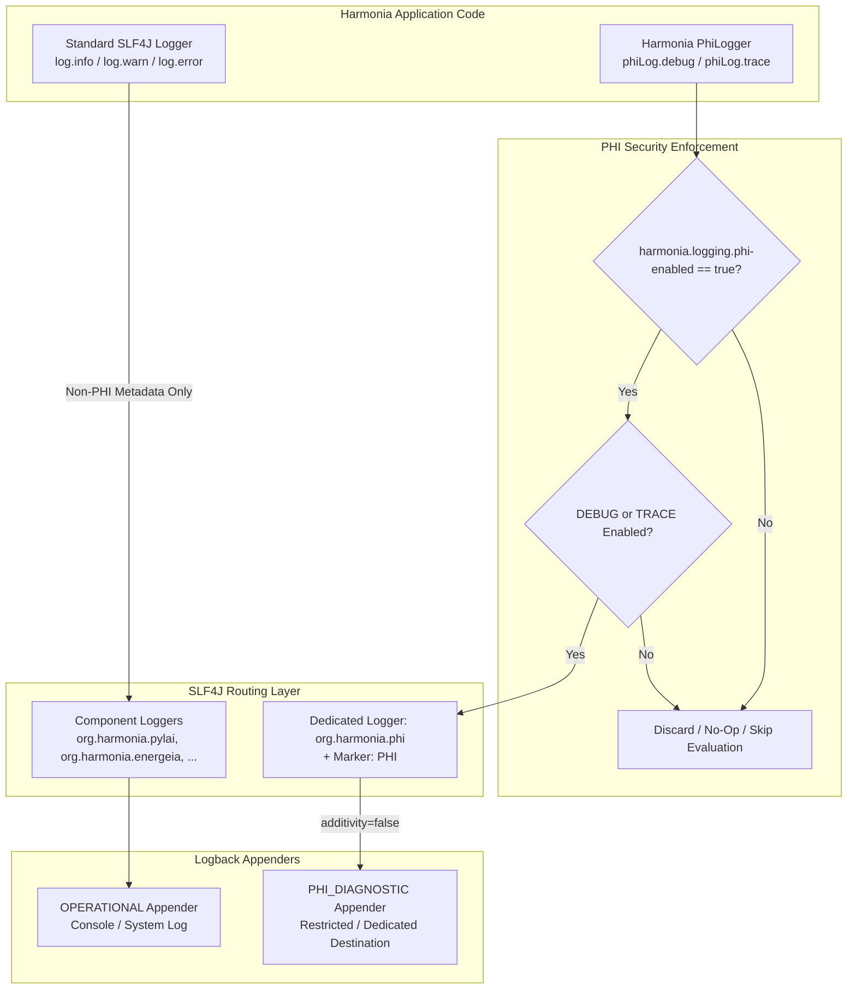

# Requirements

### Overview & Goals
The Harmonia platform processes sensitive healthcare integration data spanning HL7 v2.x messages, FHIR R5 resources, and workflow task payloads across multiple distributed tiers. To maximize patient privacy and compliance with healthcare data protection standards (HIPAA, GDPR, Australian Privacy Principles) while optimizing system maintainability and diagnostic capability, Harmonia requires a centralized, architectural control mechanism for logging Patient Health Information (PHI).

The goal is to implement a reusable, platform-wide PHI-aware logging capability using the existing SLF4J 2.x and Logback infrastructure. This capability enforces a strict separation: operational logging (`INFO`, `WARN`, `ERROR`) must be guaranteed PHI-free, while diagnostic logging (`DEBUG`, `TRACE`) conditionally permits PHI only when an explicit global switch (`harmonia.logging.phi-enabled=true`) is active alongside appropriate log levels.

### Scope
- **In Scope**:
  - Centralized PHI logging abstraction (`PhiLogger`, `PhiLoggerFactory`) in the foundational `calliope` module.
  - Configuration property `harmonia.logging.phi-enabled` (default `false`) and environment variable `HARMONIA_LOGGING_PHI_ENABLED`.
  - Dedicated SLF4J logger namespace `org.harmonia.phi` and mandatory SLF4J marker `PHI`.
  - Dual-gate security evaluation (`phi-enabled == true && isDebugEnabled()/isTraceEnabled()`).
  - Lazy evaluation support via suppliers to eliminate runtime overhead and avoid serialization when disabled.
  - One-time prominent non-PHI startup warning when PHI diagnostic mode is enabled.
  - Dedicated Logback appender configurations (`PHI_DIAGNOSTIC`) with disabled additivity (`additivity="false"`).
  - Remediation of existing logging statements across all Harmonia submodules (`pylai`, `energeia`, `hestia`, `iris`, `themis`, `petasos`) to eliminate PHI from operational logs.
  - Comprehensive automated test suite verifying all 25+ required security and behavioral test scenarios.
  - Complete architectural and operational documentation in `docs/security/logging.md`.

- **Out of Scope**:
  - Implementation of external enterprise SIEM ingestion pipelines, cloud storage buckets, or log archiving daemons (the platform provides the necessary technical log isolation for infrastructure teams to secure).
  - General clinical audit logging (`ThemisAuditService` and `AuditEvent` remain distinct from application diagnostic logging).
  - Upgrading or replacing SLF4J / Logback provider dependencies.

### User Stories
- **As a Compliance Officer & Security Auditor**, I want operational logs (`INFO`, `WARN`, `ERROR`) to be strictly devoid of Patient Health Information so that system logs can be safely stored, aggregated, and monitored without risking privacy breaches.
- **As a Systems Integration Engineer**, I want the ability to temporarily enable controlled PHI diagnostic logging in non-production or strictly controlled troubleshooting environments at `DEBUG`/`TRACE` levels to analyze complex transformation or routing failures.
- **As a Harmonia Core Developer**, I want a clean, idiomatic `PhiLogger` API that enforces safety at compile-time (no `info()`, `warn()`, or `error()` methods) and handles marker attachment and namespace routing automatically.
- **As an Operations Specialist**, I want PHI diagnostic log streams to be routed to isolated appenders with independent access control and retention policies without impacting normal operational logging.

### Functional Requirements
1. **Logging Policy Matrix**:
   - `TRACE`: PHI conditionally permitted (requires `phi-enabled=true` AND `isTraceEnabled()`).
   - `DEBUG`: PHI conditionally permitted (requires `phi-enabled=true` AND `isDebugEnabled()`).
   - `INFO`: PHI strictly prohibited.
   - `WARN`: PHI strictly prohibited.
   - `ERROR`: PHI strictly prohibited.
2. **Security Gating**:
   - The default value for `harmonia.logging.phi-enabled` MUST be `false`.
   - Enabling `DEBUG` or `TRACE` logger levels alone MUST NOT emit PHI.
   - Setting `harmonia.logging.phi-enabled=true` alone MUST NOT emit PHI if the logger level is set to `INFO` or above.
3. **API Design & Safety**:
   - `PhiLogger` must expose only `debug(...)` and `trace(...)` methods (with standard message formatting, exception arguments, and supplier-based lazy arguments).
   - `PhiLogger` must NOT provide `info(...)`, `warn(...)`, or `error(...)` methods.
4. **Namespace and Marker**:
   - All PHI diagnostic events must be emitted through the SLF4J namespace `org.harmonia.phi`.
   - Every PHI diagnostic event must automatically carry the SLF4J Marker `PHI`.
5. **Startup Notification**:
   - If `harmonia.logging.phi-enabled=true`, the system must emit a single, non-PHI startup warning banner once per JVM lifecycle.
6. **Secrets Prohibition**:
   - Authentication tokens, API keys, passwords, and private keys must never be logged at any level, regardless of PHI diagnostic mode.

### Non-Functional Requirements
- **Performance & Zero Overhead**: When PHI logging is disabled, evaluation of PHI expressions, string concatenations, and object serializations must be bypassed with sub-microsecond cost via lazy suppliers and fast boolean checks.
- **Fail-Safe Isolation**: Failure or unreachability of the PHI diagnostic log destination must never cause fallback or redirection of PHI to operational appenders.
- **Modularity**: The shared logging library must reside in `calliope` and remain independent of specific clinical payload representations (e.g., FHIR or HL7 libraries).

# Technical Design

### Current Implementation
Harmonia currently utilizes SLF4J 2.0.13 with Logback 1.5.6. Loggers across submodules (`pylai`, `energeia`, `hestia`, `iris`) are instantiated via `LoggerFactory.getLogger(...)`. In various workflow and gateway processors (e.g. `PatientDemographicsUpdateErgon`, `PatientIdentityUpdateErgon`, `IncomingAdtMessageProcessor`), clinical details such as patient names, MRNs, dates of birth, and raw HL7 message contents are logged at `INFO` or `WARN` levels.

Existing configuration patterns rely on environment variables (e.g., `TASK_BROKER_HOST`) with fallback to Java system properties via helper classes or direct reads.

### Key Decisions
1. **Centralized Platform Placement in `calliope`**:
   - *Decision*: Implement `PhiLogger`, `PhiLoggerFactory`, and `PhiLoggingConfig` in `net.fhirfactory.harmonia.logging` within the `calliope` module.
   - *Rationale*: `calliope` is the foundational canonical library already referenced across all Harmonia tiers, avoiding duplicate logging implementations across submodules or circular dependencies.
2. **Payload-Agnostic Logging Interface**:
   - *Decision*: `PhiLogger` accepts generic `Object` arguments and `Supplier<?>` functional interfaces rather than coupling directly to FHIR `IBaseResource` or HAPI HL7 `Message`.
   - *Rationale*: Ensures the logging framework remains lightweight, modular, and reusable across non-clinical infrastructure and future protocols.
3. **Dedicated Logger Namespace (`org.harmonia.phi`) and Marker (`PHI`)**:
   - *Decision*: Under the hood, `DefaultPhiLogger` delegates to an internal SLF4J logger named `org.harmonia.phi` and passes `MarkerFactory.getMarker("PHI")` to every call.
   - *Rationale*: Provides dual-layer defense-in-depth allowing Logback appender filtering by both logger name and SLF4J marker.
4. **Compile-Time Level Elimination**:
   - *Decision*: Omit `info()`, `warn()`, and `error()` entirely from the `PhiLogger` interface.
   - *Rationale*: Eliminates the possibility of developers accidentally logging PHI at operational severity levels.

### Proposed Changes

#### 1. Core Classes in `calliope` (`net.fhirfactory.harmonia.logging`)
- **`PhiLogger`**: Interface containing `debug(...)` and `trace(...)` methods with overloads for message templates, object arguments, `Throwable`, and `java.util.function.Supplier<?>`.
- **`DefaultPhiLogger`**: Implementation wrapping `org.slf4j.Logger` (`org.harmonia.phi`) and `org.slf4j.Marker` (`PHI`), applying the dual-gate evaluation (`PhiLoggingConfig.isPhiEnabled() && delegate.isDebugEnabled()`).
- **`PhiLoggerFactory`**: Factory providing `getLogger(Class<?>)` and `getLogger(String)`.
- **`PhiLoggingConfig`**: Manages the resolution of `harmonia.logging.phi-enabled` / `HARMONIA_LOGGING_PHI_ENABLED` and handles the one-time startup warning emission.

#### 2. Subsystem Remediation
- **`pylai`**:
  - `IncomingAdtMessageProcessor`, `IncomingMfnMessageProcessor`, `IncomingOrmMessageProcessor`, `IncomingOruMessageProcessor`: Remove patient names/MRNs from `log.info` and `log.error`; use `phiLog.debug` for raw HL7 message payloads and patient demographics.
  - `OutboundTaskQueueConsumer`, `Hl7AckProcessor`: Replace payload dumps in operational logs with task/message IDs.
- **`energeia`**:
  - `PatientDemographicsUpdateErgon`, `PatientIdentityUpdateErgon`: Clean `log.info` calls to log only `patientId` / `taskId` without names, MRNs, DOBs, or marital status. Shift detailed demographic dumps to `phiLog.debug`.
  - `Adt2FhirMapper`, `ExtractPatientFromBundle`: Transition bundle/resource serialization logs to `phiLog.debug`.
- **`hestia` & `iris`**:
  - `HapiFhirRestClient`, `OperationsRestClient`: Sanitize error logs on HTTP failures to prevent raw response body leakage when PHI is present.
  - `FhirStorageService`: Maintain clean operational logs (resource type and ID only).

#### 3. Logback Configuration & Appender Routing
- Configure `logback.xml` files with:
  ```xml
  <appender name="PHI_DIAGNOSTIC" class="ch.qos.logback.core.ConsoleAppender">
      <encoder>
          <pattern>%d{yyyy-MM-dd HH:mm:ss.SSS} [%thread] %-5level [%marker] %logger{36} - %msg%n</pattern>
      </encoder>
  </appender>

  <logger name="org.harmonia.phi" level="DEBUG" additivity="false">
      <appender-ref ref="PHI_DIAGNOSTIC" />
  </logger>
  ```

### Data Models / Contracts

```java
package net.fhirfactory.harmonia.logging;

import java.util.function.Supplier;

public interface PhiLogger {
    boolean isDebugEnabled();
    boolean isTraceEnabled();

    void debug(String message);
    void debug(String format, Object arg);
    void debug(String format, Object arg1, Object arg2);
    void debug(String format, Object... arguments);
    void debug(String message, Throwable throwable);
    void debug(String message, Supplier<?>... suppliers);

    void trace(String message);
    void trace(String format, Object arg);
    void trace(String format, Object arg1, Object arg2);
    void trace(String format, Object... arguments);
    void trace(String message, Throwable throwable);
    void trace(String message, Supplier<?>... suppliers);
}
```

```java
package net.fhirfactory.harmonia.logging;

public final class PhiLoggerFactory {
    public static PhiLogger getLogger(Class<?> clazz);
    public static PhiLogger getLogger(String name);
}
```

### Architecture Diagram



### Risks & Mitigations
- **Risk**: Performance degradation due to eager string evaluation when PHI logging is disabled.
  - *Mitigation*: Support `Supplier<?>` overloads in `PhiLogger` and enforce parameter formatting (`{}`) rather than string concatenation in calling code.
- **Risk**: Exception messages carrying PHI escaping through `log.error(...)`.
  - *Mitigation*: Audit exception factories to ensure exceptions contain error codes, correlation IDs, and non-PHI reason descriptions; log the diagnostic payload via `phiLog.debug(...)` beforehand.
- **Risk**: PHI leaking to root appender via logger inheritance.
  - *Mitigation*: Configure `additivity="false"` on the `org.harmonia.phi` logger definition across all logging configurations.

# Testing

### Validation Approach
Verification of PHI logging security guarantees requires systematic automated testing of all gate permutations, logger routing, marker verification, API surface inspection, and subsystem regression.

### Key Scenarios
1. **Gate Permutations (Tests 1–5, 19–21)**:
   - `INFO` enabled, `phi-enabled=false` $\rightarrow$ No PHI output.
   - `DEBUG` enabled, `phi-enabled=false` $\rightarrow$ No PHI output.
   - `TRACE` enabled, `phi-enabled=false` $\rightarrow$ No PHI output.
   - `DEBUG` enabled, `phi-enabled=true` $\rightarrow$ PHI DEBUG output emitted.
   - `TRACE` enabled, `phi-enabled=true` $\rightarrow$ PHI TRACE output emitted.
   - `org.harmonia.phi=TRACE` with `phi-enabled=false` $\rightarrow$ No PHI output.
   - `phi-enabled=true` with `org.harmonia.phi=INFO` $\rightarrow$ No PHI output.
2. **API Surface Restrictions (Tests 6–8)**:
   - Reflection and compilation checks confirming `PhiLogger` has no `info()`, `warn()`, or `error()` methods.
3. **Lazy Evaluation Verification (Tests 9–10, 23)**:
   - Pass an atomic boolean counter inside a `Supplier<?>` argument; assert that the counter remains unchanged when `phi-enabled=false` or logger level is disabled.
4. **Namespace and Marker Compliance (Tests 13–15)**:
   - Capture `ILoggingEvent` instances; verify logger name is strictly `org.harmonia.phi` and marker equals `PHI`.
5. **Appender Isolation and Non-Propagation (Tests 16–18, 22)**:
   - Verify events arrive at `PHI_DIAGNOSTIC` appender and do NOT appear in root or operational appenders (`additivity=false`).
   - Simulate failure or removal of `PHI_DIAGNOSTIC` appender; verify events are safely discarded without falling back to operational logs.
6. **Startup Notification (Tests 11–12)**:
   - Verify non-PHI warning banner appears once upon initialization when `phi-enabled=true`.
7. **Operational Log Purity & Exception Hygiene (Tests 24–25)**:
   - Verify exceptions logged in error handlers contain no patient identifiers.
   - Verify standard operational `DEBUG`/`TRACE` on non-PHI loggers remains functional without requiring `phi-enabled=true`.

### Edge Cases
- Dynamic property change during test execution (resetting singleton config cache between unit tests).
- Multithreaded logging from concurrent Camel routes ensuring thread safety in `PhiLoggingConfig` and `DefaultPhiLogger`.
- Null arguments, empty format strings, and null exception parameters in `PhiLogger` calls.

### Test Changes
- **New Unit Tests**:
  - `PhiLoggerApiTest.java`: Validates methods, reflection constraints, and absence of operational methods.
  - `PhiLoggingGateTest.java`: Validates all combinations of system properties, env vars, and log levels.
  - `PhiLazyEvaluationTest.java`: Validates supplier execution semantics.
  - `PhiLogRoutingTest.java`: Validates namespace, marker, Logback appenders, and additivity isolation.
  - `PhiStartupWarningTest.java`: Validates single-emission startup notification.
- **Subsystem Regression Tests**:
  - Update tests in `pylai-mllp-in`, `energeia-erga`, and `hestia-mnemosyne-clinical` to verify sanitized operational logs.

# Documentation & Governance

### Documentation Plan
A comprehensive technical specification and operations guide will be created in `docs/security/logging.md` covering:

1. **Platform Logging Policy**:
   | Level | PHI Policy | Description |
   | :--- | :--- | :--- |
   | **TRACE** | **Conditional** | Permitted only when `harmonia.logging.phi-enabled=true` AND `TRACE` level is active. |
   | **DEBUG** | **Conditional** | Permitted only when `harmonia.logging.phi-enabled=true` AND `DEBUG` level is active. |
   | **INFO** | **Prohibited** | Operational state transitions and metrics only. Must never contain PHI. |
   | **WARN** | **Prohibited** | Recoverable operational warnings. Must never contain PHI. |
   | **ERROR** | **Prohibited** | System errors and exceptions. Must never contain PHI. |

2. **Configuration & Operational Parameters**:
   - `harmonia.logging.phi-enabled`: Boolean (default `false`).
   - `HARMONIA_LOGGING_PHI_ENABLED`: Corresponding environment variable.

3. **Developer Guidelines & API Usage**:
   - Usage examples for `PhiLogger` vs SLF4J `Logger`.
   - Pattern formatting vs string concatenation.
   - Using suppliers for expensive serialization (FHIR bundles, HL7 segments).
   - Sanitizing exception messages and constructing PHI-safe errors.

4. **Secrets & Credentials Policy**:
   - Strict reminder that secrets (passwords, JWTs, API tokens, Artemis credentials, private keys) are NEVER permitted in logs at any level, including PHI diagnostic mode.

5. **Operational Security for PHI Diagnostic Destinations**:
   - Infrastructure requirements for `PHI_DIAGNOSTIC` log stores: TLS encryption in transit, disk encryption at rest, restricted access role bindings (`audit.read` / security officer), short retention windows (e.g., 7 days), and automated deletion policies.

6. **README & Architecture Updates**:
   - Cross-reference `docs/security/logging.md` in the main `README.md` under documentation and security specifications.

# Delivery Steps

### ✓ Step 1: Core PHI Logging Abstraction and Configuration Engine
The shared `PhiLogger`, `PhiLoggerFactory`, and configuration model are implemented in `calliope`, providing dual-gate security controls and lazy evaluation across the platform.

- Create `PhiLoggingConfig` in `net.fhirfactory.harmonia.logging` to resolve `harmonia.logging.phi-enabled` and `HARMONIA_LOGGING_PHI_ENABLED` defaulting strictly to `false`.
- Implement `PhiLogger` interface exposing only `debug(...)` and `trace(...)` signatures (with format args, `Throwable`, and `Supplier<?>` lazy evaluation), omitting `info`, `warn`, and `error` by design.
- Implement `DefaultPhiLogger` and `PhiLoggerFactory` routing all diagnostic events to the dedicated `org.harmonia.phi` SLF4J namespace while attaching the mandatory `PHI` marker (`MarkerFactory.getMarker("PHI")`).
- Implement one-time non-PHI startup warning emission when PHI diagnostic mode is enabled.
- Ensure zero external dependencies on FHIR/HL7 libraries within the logging core to maintain clean payload independence.

### ✓ Step 2: Dedicated PHI Log Routing and Appender Isolation
Logback and logging configurations are updated to isolate PHI events into dedicated diagnostic destinations with zero propagation to operational appenders.

- Define and configure the `PHI_DIAGNOSTIC` appender in Logback configurations (e.g. `pylai-mllp-cli`, `ponos-cli`, `hie-operations-cli`, and test resources).
- Configure the `org.harmonia.phi` logger with `additivity="false"` to guarantee PHI diagnostic events never bleed into root/console/operational appenders.
- Provide production-ready Logback XML templates and WildFly/Spring Boot logging configuration profiles for standalone and clustered deployments.
- Ensure appender failure behaviors are non-blocking and fail-safe, dropping diagnostic events without falling back to operational destinations.

### ✓ Step 3: Subsystem Operational and Diagnostic Logging Remediation
All operational log statements across Harmonia submodules are scrubbed of PHI, and diagnostic logging is transitioned to `PhiLogger`.

- Audit and refactor `pylai` gateways (`IncomingAdtMessageProcessor`, `IncomingMfnMessageProcessor`, `IncomingOrmMessageProcessor`, `IncomingOruMessageProcessor`, `OutboundTaskQueueConsumer`) to replace PHI-bearing `log.info`/`warn`/`error` calls with non-PHI identifiers and migrate deep diagnostics to `phiLog.debug`/`trace`.
- Refactor `energeia` workflow services (`PatientDemographicsUpdateErgon`, `PatientIdentityUpdateErgon`, `Adt2FhirMapper`, `ExtractPatientFromBundle`, `TaskEventMessageProcessor`) to eliminate patient demographics/identities from INFO/WARN/ERROR logs.
- Refactor `hestia` persistence clients (`HapiFhirRestClient`, `FhirStorageService`, `OperationsRestClient`) and `iris-befe` REST resources to ensure exception messages and error outcomes do not expose payload bodies or clinical attributes.
- Enforce PHI-free exception instantiation across custom exception classes and catch blocks throughout the codebase.

### ✓ Step 4: Automated PHI Testing Suite and Security Verification
The full matrix of 25+ automated unit, integration, and security tests passes, verifying strict PHI gating, marker attachment, and appender isolation.

- Implement unit test suites verifying `PhiLogger` API constraints (absence of info/warn/error methods, lazy supplier non-execution when disabled).
- Implement gate tests verifying that DEBUG/TRACE alone, or `phi-enabled=true` with INFO level, produces no PHI output, and only the conjunction of both permits output.
- Implement Logback routing and appender tests confirming events reach `PHI_DIAGNOSTIC` exclusively and are excluded from operational appenders.
- Implement exception handling regression tests confirming stack traces and error logs remain sanitized and free of PHI.

### ✓ Step 5: Architecture Documentation and Operational Security Guidelines
Comprehensive documentation detailing the PHI logging policy, architecture, configuration, and security operational controls is published in the repository.

- Create `docs/security/logging.md` detailing the 5-level logging policy (TRACE/DEBUG conditional, INFO/WARN/ERROR prohibited).
- Document configuration properties, environment variables, `PhiLogger` API usage patterns, and lazy supplier best practices.
- Document infrastructure operational security guidelines for PHI diagnostic destinations (encryption at rest/transit, restricted access controls, short retention, automated expiry).
- Update the main `README.md` and security documentation cross-references to incorporate the new logging architecture.