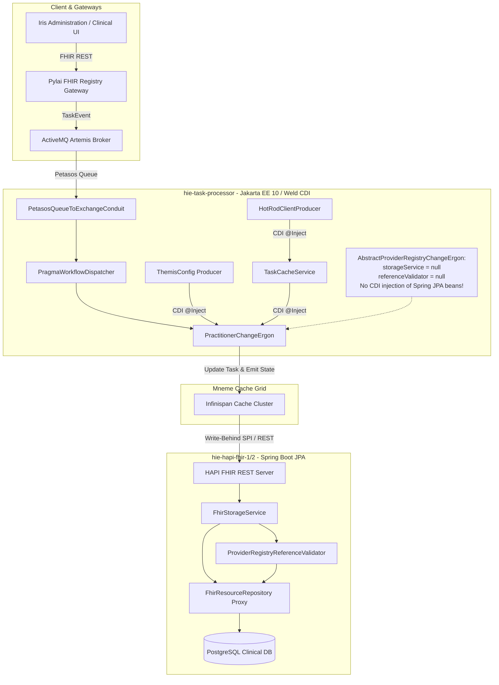

# Requirements

### Overview & Goals

Following recent architecture, UI, and Provider Registry integration work, the integrated Docker Compose deployment of Harmonia produces fatal container startup errors in WildFly:
```
WELD-001408: Unsatisfied dependencies for type FhirResourceRepository with qualifiers @Default
```
This failure prevents `ROOT.war` (`task-sequence-processor.war` in `energeia/ponos`) from deploying, failing `WeldStartService` and cascading into 83 unavailable platform services.

To maximize platform utility, operational uptime, and patient data safety, this plan provides a comprehensive root-cause diagnosis and delivers the minimal, architecturally sound remediation. The solution re-establishes clear boundaries between Spring Boot persistence and WildFly CDI workflow execution, restores full service health, and prevents regressions.

---

### Scope

#### In Scope
- **Root-Cause Analysis**: Document the complete dependency chain and runtime ownership for `FhirResourceRepository`, `FhirStorageService`, and `ProviderRegistryReferenceValidator`.
- **Hestia Mnemosyne Clinical Correction**: Revert recent working-tree workarounds in `mnemosyne-clinical` that introduced invalid CDI annotations (`@ApplicationScoped`, `@Inject`), no-arg null-fallback constructors, and extraneous `jakartaee-api` dependencies into Spring Boot components.
- **Energeia Erga Correction**: Remove invalid `@Inject` annotations on Spring-owned persistence services within `AbstractProviderRegistryChangeErgon` while preserving getter/setter injection for test harnesses and retaining CDI injection for `ThemisService`.
- **Energeia Ponos Verification**: Retain and validate `ThemisConfig` to satisfy `@Inject ThemisService` across all Ergon activities in WildFly.
- **Multi-Stage Verification**: Compile affected modules, run focused test suites, rebuild the Docker container image without stale layers, verify clean WildFly boot, run ArchUnit architectural invariants, and audit downstream services.

#### Out of Scope
- Creating duplicate persistence implementations or mock repositories in Ponos.
- Altering the asynchronous 5-tier persistence architecture (Infinispan write-behind cache store to Mnemosyne JPA).
- Replacing CDI with Spring inside Ponos or replacing Spring Boot with CDI inside Mnemosyne Clinical.
- Disabling Weld bean validation or switching bean discovery modes to bypass resolution errors.
- Unrelated UI modifications in Iris SPAs.

---

### User Stories

- **As a System Operator**, I want all Docker Compose containers (specifically `hie-task-processor`) to boot cleanly and reach healthy status without dependency injection crashes, so that clinical message processing and workflow orchestration function reliably.
- **As an Integration Engineer**, I want Ergon workflow activities to maintain strict separation of concerns between workflow orchestration (Ponos / WildFly) and durable storage (Mnemosyne / Spring Boot), ensuring high-throughput task execution without runtime dependency leakage.
- **As a Compliance Officer**, I want all Provider Registry operations to enforce strict Themis policy evaluation and preserve data integrity rules without resorting to silent null-check bypasses or disabled security gates.

---

### Functional Requirements

- **FR-1: Resolution of WELD-001408**: `ROOT.war` (`task-sequence-processor.war`) must deploy into WildFly 41+ without any unsatisfied dependency exceptions.
- **FR-2: Preservation of Spring Data JPA Contracts**: `FhirResourceRepository` must remain strictly a Spring Data JPA interface owned by `mnemosyne-clinical`, with mandatory constructor injection in `FhirStorageService` and `ProviderRegistryReferenceValidator`.
- **FR-3: Test Harness Compatibility**: Unit and scenario test suites in `energeia/erga` and `paradeigma/paradeigma-test` must continue to pass by injecting mocked or real storage services via setters.
- **FR-4: Default-Deny Themis Governance**: `AbstractProviderRegistryChangeErgon` must continue to enforce Themis policy evaluation at runtime via `ThemisService` injected from `ThemisConfig`.
- **FR-5: Clean Container Initialization**: The `hie-task-processor` container must complete WildFly deployment with zero failed deployment units and zero missing MSC services.

---

### Non-Functional Requirements

- **Architectural Boundary Integrity**: Strict separation between Jakarta EE 10 / CDI 4.0 (Ponos, BEFE, Pylai Gateways) and Spring Boot 3.x (Mnemosyne Clinical, Mnemosyne Operations, Agora Service). No CDI annotations in Spring Boot modules and no Spring context bootstrapping in WildFly.
- **Minimal Blast Radius**: The correction must touch the absolute minimum number of source files, preventing unintended side effects across unrelated modules.
- **Zero-PHI Diagnostic Safety**: All logging throughout startup, validation, and error reporting must remain strictly zero-PHI compliant.

# Technical Design

### Current Implementation & Artifact Analysis

#### Artifact Anatomy & Deployment Topology
- **Deployment Unit**: `ROOT.war` in container `hie-task-processor` is packaged from `energeia/ponos/target/task-sequence-processor.war`.
- **Packaging Analysis**:
  - `task-sequence-processor.war/WEB-INF/beans.xml` specifies `bean-discovery-mode="all"`.
  - Maven dependencies include `energeia-erga`, which in turn includes `mnemosyne-clinical` (`WEB-INF/lib/mnemosyne-clinical-1.0.0-SNAPSHOT.jar`).
  - Inside `mnemosyne-clinical.jar`, the classes `FhirStorageService.class`, `ProviderRegistryReferenceValidator.class`, and `FhirResourceRepository.class` are present.
- **Runtime Failure Trace**:
  ```
  org.jboss.weld.exceptions.DeploymentException: WELD-001408: Unsatisfied dependencies for type FhirResourceRepository with qualifiers @Default
    at injection point [BackedAnnotatedParameter] Parameter 1 of [BackedAnnotatedConstructor] @Autowired @Inject public net.fhirfactory.harmonia.hapifhir.service.ProviderRegistryReferenceValidator(FhirResourceRepository)
    at net.fhirfactory.harmonia.hapifhir.service.ProviderRegistryReferenceValidator.<init>(ProviderRegistryReferenceValidator.java:0)
    at injection point [BackedAnnotatedParameter] Parameter 1 of [BackedAnnotatedConstructor] @Autowired @Inject public net.fhirfactory.harmonia.hapifhir.service.FhirStorageService(FhirResourceRepository, ThemisService)
    at net.fhirfactory.harmonia.hapifhir.service.FhirStorageService.<init>(FhirStorageService.java:0)
  ```

---

### Root Cause & Regression Attribution (Phases 1–4)

#### Root Cause
`AbstractProviderRegistryChangeErgon` (in `energeia/erga`) declared CDI `@Inject` annotations on fields of type `FhirStorageService` and `ProviderRegistryReferenceValidator`. These classes are Spring service components belonging to `hestia/mnemosyne-clinical`, and they require constructor injection of `FhirResourceRepository`. `FhirResourceRepository` is an interface whose implementation is dynamically generated by Spring Data JPA at runtime inside the Spring Boot container `hie-hapi-fhir-1/2`. 

In WildFly (`energeia/ponos`), there is no Spring ApplicationContext, no Spring Data JPA runtime, and no database connection to PostgreSQL. When Weld scanned the classpath during deployment of `ROOT.war`, it attempted to resolve dependencies for `AbstractProviderRegistryChangeErgon`. Because `FhirResourceRepository` has no CDI bean implementation in WildFly, Weld failed validation and aborted container deployment.

#### Expected Architecture
Harmonia follows a decoupled 5-tier architecture:
1. **Presentation / Gateways / Workflow (Iris, Pylai, Ponos)** run in WildFly Jakarta EE 10 and communicate asynchronously via Petasos (ActiveMQ Artemis) and the Mneme (Infinispan) in-memory data grid.
2. **Authoritative Persistence (Mnemosyne Clinical / Operations)** runs as Spring Boot JPA microservices backed by PostgreSQL.
3. Mutations placed into the Mneme cache grid by Ponos or Iris are asynchronously written to Mnemosyne via the `FhirRestCacheStore` write-behind SPI.
4. Workflow activities (Erga) do not directly connect to PostgreSQL JPA repositories. They execute in-memory transformations, validate business rules, check Themis security policies, and emit output events. `storageService` and `referenceValidator` in `AbstractProviderRegistryChangeErgon` were designed with null-safe execution blocks (`if (storageService != null)`) specifically because direct JPA storage is not available in Ponos.

#### Regression Origin & Recent Changes
1. **Commit `e2c3837`**: Introduced the Provider Registry subsystem. `AbstractProviderRegistryChangeErgon` was annotated with `@Inject` on `storageService` and `referenceValidator`. All unit tests passed because they constructed Ergons manually and used setters (`ergon.setStorageService(...)`).
2. **Recent Working-Tree Changes**: When Docker deployment was tested and failed with `WELD-001408`, an attempt was made to appease Weld by:
   - Adding `@ApplicationScoped` and `@Inject` to `FhirStorageService` and `ProviderRegistryReferenceValidator`.
   - Adding no-argument constructors initializing `repository = null`.
   - Adding null checks inside `FhirStorageService` (`if (repository == null) { return; }`), effectively bypassing persistence.
   - Adding `jakarta.jakartaee-api` to `mnemosyne-clinical/pom.xml`.
   - Adding `ThemisConfig` to `energeia/ponos`.
   
   However, because `@Inject` was also placed on the parameterized constructors taking `FhirResourceRepository`, Weld continued to attempt resolution of `FhirResourceRepository`, leaving the deployment broken and introducing architectural pollution into `mnemosyne-clinical`.

---

### Key Decisions

1. **Remove `@Inject` from `storageService` and `referenceValidator` in `AbstractProviderRegistryChangeErgon`**:
   - *Rationale*: These services are Spring-managed persistence components requiring PostgreSQL JPA repositories. They cannot and should not be instantiated by Weld in WildFly. Removing `@Inject` prevents Weld from attempting to discover or instantiate them, while keeping the getter/setter methods allows unit and integration tests to inject mocks seamlessly.
2. **Revert all working-tree hacks in `hestia/mnemosyne-clinical`**:
   - *Rationale*: Preserves Spring Boot JPA architectural purity, ensures `FhirResourceRepository` remains a mandatory `final` dependency for real storage operations, eliminates silent null-pointer bypasses, and removes unnecessary Jakarta EE dependencies from Spring modules.
3. **Retain `ThemisConfig` in `energeia/ponos`**:
   - *Rationale*: `ThemisService` is a pure domain interface (`themis-api`) backed by deterministic evaluation (`themis-core`). Supplying it via a CDI `@Produces` bean in Ponos satisfies `@Inject private ThemisService themisService;` in `AbstractProviderRegistryChangeErgon`, maintaining default-deny security governance.

---

### Proposed Changes

#### 1. `energeia/erga`
**File**: `energeia/erga/src/main/java/net/fhirfactory/harmonia/erga/registry/AbstractProviderRegistryChangeErgon.java`
- Remove `@Inject` from `storageService`:
  ```java
  // Before
  @Inject
  private FhirStorageService storageService;

  // After
  private FhirStorageService storageService;
  ```
- Remove `@Inject` from `referenceValidator`:
  ```java
  // Before
  @Inject
  private ProviderRegistryReferenceValidator referenceValidator;

  // After
  private ProviderRegistryReferenceValidator referenceValidator;
  ```
- Retain `@Inject private ThemisService themisService;`.
- Retain all public getters and setters (`setStorageService`, `setReferenceValidator`).

#### 2. `hestia/mnemosyne-clinical`
**File**: `hestia/mnemosyne-clinical/src/main/java/net/fhirfactory/harmonia/hapifhir/service/ProviderRegistryReferenceValidator.java`
- Revert to original Spring-only component:
  ```java
  @Component
  public class ProviderRegistryReferenceValidator {
      private final FhirResourceRepository repository;

      @Autowired
      public ProviderRegistryReferenceValidator(FhirResourceRepository repository) {
          this.repository = repository;
      }
      // Remove no-arg constructor and @ApplicationScoped / @Inject
  ```

**File**: `hestia/mnemosyne-clinical/src/main/java/net/fhirfactory/harmonia/hapifhir/service/FhirStorageService.java`
- Revert to original Spring-only service:
  ```java
  @Service
  public class FhirStorageService {
      private final FhirResourceRepository repository;
      private final ThemisService themisService;

      public FhirStorageService(FhirResourceRepository repository) {
          this(repository, DeterministicPolicyEvaluator.withDefaultPolicies());
      }

      @Autowired
      public FhirStorageService(FhirResourceRepository repository, @Autowired(required = false) ThemisService themisService) {
          this.repository = repository;
          this.themisService = themisService != null ? themisService : DeterministicPolicyEvaluator.withDefaultPolicies();
      }
      // Remove no-arg constructor, @ApplicationScoped, @Inject, and repository null guards
  ```

**File**: `hestia/mnemosyne-clinical/pom.xml`
- Remove the `jakarta.jakartaee-api` dependency.

#### 3. `energeia/ponos`
**File**: `energeia/ponos/src/main/java/net/fhirfactory/harmonia/praxis/config/ThemisConfig.java`
- Keep the clean CDI producer:
  ```java
  @ApplicationScoped
  public class ThemisConfig {
      private final ThemisService themisService = DeterministicPolicyEvaluator.withDefaultPolicies();

      @Produces
      @ApplicationScoped
      public ThemisService produceThemisService() {
          return themisService;
      }
  }
  ```

---

### Architecture & Interaction Diagram



---

### Architectural Guardrails Compliance

- **Invariant 1 (Paradeigma Isolation)**: No dependencies on Paradeigma added or modified.
- **Invariant 2 (Petasos API Abstraction)**: Pure Petasos APIs retained without JMS leakage.
- **Invariant 3 (Iris Decoupling)**: Iris presentation tier remains strictly decoupled from persistence.
- **Invariant 6 (Default-Deny Security)**: Themis security policy evaluation remains mandatory across all Ergon activities via `ThemisConfig`.
- **Package Layering**: Unidirectional dependency hierarchy preserved (Calliope -> Themis -> Hestia -> Petasos -> Energeia -> Pylai/Iris). Spring Boot and CDI container boundaries cleanly enforced.

# Testing

### Validation Approach

Validation will follow a strict phased verification strategy designed to maximize certainty while avoiding unnecessary churn or wide-scale rebuilds. Each stage verifies a specific tier before advancing outward to integrated container execution.

---

### Key Scenarios

#### Scenario 1: Spring Boot Module Purity & Unit Verification
- **Target**: `hestia/mnemosyne-clinical`
- **Verification**:
  - Verify that `FhirStorageService` and `ProviderRegistryReferenceValidator` require non-null `FhirResourceRepository` in their constructors.
  - Run `mvn clean test -pl hestia/mnemosyne-clinical -Dtest=ProviderRegistryReferenceValidatorTest,FhirStorageServiceSecurityTest`.
- **Expected Outcome**: All tests pass; compilation succeeds without Jakarta EE container dependencies.

#### Scenario 2: Ergon Activity Test Harness & Setter Injection
- **Target**: `energeia/erga`
- **Verification**:
  - Run `mvn clean test -pl energeia/erga -Dtest=PractitionerChangeErgonTest,AbstractProviderRegistryChangeErgonPersistenceSecurityTest`.
- **Expected Outcome**: Ergons validate references and persist resources when injected via test harness setters; all assertions pass without CDI `@Inject`.

#### Scenario 3: Ponos Packaging & CDI Bean Discovery
- **Target**: `energeia/ponos`
- **Verification**:
  - Build `task-sequence-processor.war` (`mvn clean package -pl energeia/ponos -DskipTests`).
  - Unpack WAR and inspect `WEB-INF/classes` and `WEB-INF/lib` to confirm proper metadata and presence of `ThemisConfig`.
- **Expected Outcome**: War archive compiles and packages successfully.

#### Scenario 4: WildFly Container Boot & Weld Resolution
- **Target**: `hie-task-processor` Docker image
- **Verification**:
  - Rebuild Docker image using `docker build --no-cache -t harmonia-task-processor:latest energeia/ponos`.
  - Run container in test mode: `docker run --rm harmonia-task-processor:latest timeout 20 /opt/jboss/wildfly/bin/standalone.sh -b 0.0.0.0`.
  - Inspect console logs for `WELD-001408` or deployment failure codes.
- **Expected Outcome**: `WeldStartService` starts cleanly without unsatisfied dependency errors; WildFly reports `Deployed "ROOT.war"` and server state `Running`.

#### Scenario 5: Architectural Invariant Verification
- **Target**: Entire repository
- **Verification**:
  - Execute ArchUnit test suite: `mvn test -pl paradeigma/paradeigma-test -am -Dtest="*ArchitectureTest" -Dsurefire.failIfNoSpecifiedTests=false`.
- **Expected Outcome**: All 7 architecture rule suites pass, verifying zero architectural boundary violations.

---

### Downstream Error Classification (Phase 7)

Once the root cause in `hie-task-processor` is corrected, startup logs across the remaining containers will be audited according to the classification matrix:

| Failure Pattern | Category | Analysis & Action |
| :--- | :--- | :--- |
| `WELD-001408: Unsatisfied dependencies for type FhirResourceRepository` | **ROOT CAUSE** | Resolved by removing invalid `@Inject` annotations in `AbstractProviderRegistryChangeErgon` and reverting hacks in `mnemosyne-clinical`. |
| `WFLYSRV0026: WildFly ... started (with errors)` (83 services unavailable) | **CASCADE** | Consequence of `WeldStartService` failure. Clears automatically once `ROOT.war` deploys. |
| Missing Elytron auto-generated self-signed keystore warnings | **CONFIGURATION** | Normal WildFly standalone development defaults; non-fatal. |
| Inability to connect to Infinispan on port 11222 during isolated container test | **CONFIGURATION / EXPECTED** | Expected when running `hie-task-processor` isolated without Docker Compose network. |
| Unrelated UI bundle compilation warnings in Iris SPAs | **INDEPENDENT** | Isolated to Node.js/Vue build; must not be coupled to backend CDI resolution. |

# Delivery Steps

### ✓ Step 1: revert-mnemosyne-clinical-hacks
`hestia/mnemosyne-clinical` is restored to an architecturally clean Spring Boot JPA service without invalid CDI annotations or bypassed persistence fields.

- Revert working-tree modifications in `hestia/mnemosyne-clinical/src/main/java/net/fhirfactory/harmonia/hapifhir/service/ProviderRegistryReferenceValidator.java`, removing `@ApplicationScoped`, `@Inject`, and the no-argument constructor that set `repository = null`.
- Revert working-tree modifications in `hestia/mnemosyne-clinical/src/main/java/net/fhirfactory/harmonia/hapifhir/service/FhirStorageService.java`, removing `@ApplicationScoped`, `@Inject`, and the no-argument constructor that set `repository = null`.
- Ensure `repository` remains a `final`, mandatory constructor dependency in both service classes, guaranteeing referential integrity and persistence operations cannot execute against an uninitialized repository.
- Revert the addition of `jakarta.jakartaee-api` in `hestia/mnemosyne-clinical/pom.xml` to keep the Spring Boot persistence server free of container-specific Jakarta EE dependencies.
- Compile `hestia/mnemosyne-clinical` and execute unit tests (`ProviderRegistryReferenceValidatorTest`, `FhirStorageServiceSecurityTest`) to verify baseline stability.

### ✓ Step 2: correct-erga-cdi-injection
`AbstractProviderRegistryChangeErgon` eliminates erroneous CDI injection of Spring persistence beans while preserving Themis authorization and full test harness capability.

- In `energeia/erga/src/main/java/net/fhirfactory/harmonia/erga/registry/AbstractProviderRegistryChangeErgon.java`, remove the `@Inject` annotation from `private FhirStorageService storageService;` and `private ProviderRegistryReferenceValidator referenceValidator;`.
- Retain the public getter and setter methods (`getStorageService()`, `setStorageService(...)`, `getReferenceValidator()`, `setReferenceValidator(...)`) so that unit, integration, and scenario tests can inject test doubles and mocks without requiring a CDI container.
- Retain `@Inject private ThemisService themisService;` in `AbstractProviderRegistryChangeErgon` to enforce default-deny security evaluation.
- Ensure `ThemisConfig.java` in `energeia/ponos/src/main/java/net/fhirfactory/harmonia/praxis/config/ThemisConfig.java` remains active to provide `@Produces @ApplicationScoped ThemisService` using `DeterministicPolicyEvaluator.withDefaultPolicies()`.
- Compile `energeia/erga` and execute focused test suites (`PractitionerChangeErgonTest`, `AbstractProviderRegistryChangeErgonPersistenceSecurityTest`) to ensure all activities function as intended.

### ✓ Step 3: verify-wildfly-packaging-and-boot
`task-sequence-processor.war` builds cleanly without CDI resolution errors and boots successfully in the WildFly container.

- Rebuild `energeia/ponos` using Maven (`mvn clean package -DskipTests`) to generate the updated `target/task-sequence-processor.war`.
- Inspect the generated WAR archive to ensure `WEB-INF/classes` and `WEB-INF/lib` contain valid CDI metadata.
- Rebuild the `harmonia-task-processor` Docker image with `--no-cache` to ensure stale image layers containing the previous invalid classes are discarded.
- Execute a test run of the `harmonia-task-processor` container to verify `ROOT.war` deployment completes cleanly, `WeldStartService` succeeds with 0 unsatisfied dependencies, and WildFly reports status `Running`.

### ✓ Step 4: run-platform-verification-and-regression-audit
All architectural boundary tests pass and the full Docker Compose multi-service platform starts and operates without cascaded failures.

- Run the automated ArchUnit test suite (`mvn test -pl paradeigma/paradeigma-test -am -Dtest="*ArchitectureTest"`) to verify compliance with repository guardrails (Iris decoupling, Agora isolation, Paradeigma isolation, package layering, security enforcement).
- Run the Provider Registry integration tests (`ProviderRegistryEndToEndWriteTest`, `ProviderRegistryConcurrencyTest`, `ProviderRegistryRestartRecoveryTest`).
- Start the platform via `docker compose up --build -d` and monitor startup logs across all containers (`hie-task-processor`, `hie-hapi-fhir-1`, `hie-infinispan-node1`, `hie-befe`, `hie-iris-clinical`).
- Verify that `hie-task-processor` reaches healthy status without throwing `WELD-001408` or triggering service dependency failures.
- Inspect logs for any subsequent or independent runtime issues across dependent services and classify them accordingly.