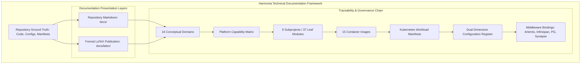

# Requirements

### Overview & Goals
The objective of this program is to reconstruct and substantially expand the Harmonia Health Integration Environment (HIE) technical documentation suite into an authoritative, exhaustive, and practically actionable engineering reference. The primary goal is to maximize platform utility, operational reliability, developer velocity, and clinical safety across all engineering and healthcare stakeholders. 

By eliminating tribal knowledge and replacing fragmented notes with mathematically grounded, empirically verified specifications, the resulting documentation will enable any technically competent professional to build, deploy, operate, troubleshoot, and safely extend Harmonia without guesswork or reverse-engineering.

### Scope
- **In Scope**:
  - Full-fidelity architectural specification across all 9 subprojects: `calliope`, `themis`, `hestia`, `petasos`, `energeia`, `pylai`, `iris`, `agora`, and `paradeigma`.
  - Comprehensive Markdown Information Architecture under `docs/` organized into 10 structured sections (`getting-started/`, `architecture/`, `concepts/`, `modules/`, `middleware/`, `integration/`, `configuration/`, `deployment/`, `paradeigma/`, `development/`, `operations/`, `reference/`).
  - Formal publication-grade LaTeX Technical Reference under `docs/latex/` restructured across 9 Parts, expanded chapters, 12 Appendices, and custom TikZ vector diagrams styled to ArchiMate 3.2 standards.
  - Strict classification of every documented feature into `[IMPLEMENTED]`, `[CONFIGURED]`, `[DESIGNED/PLANNED]`, and `[EXAMPLE/REFERENCE]` states.
  - Granular middleware capability profiling for ActiveMQ Artemis 2.33.0, Infinispan 15.0.3, PostgreSQL 16, HAPI FHIR R5 JPA, Matrix Synapse 1.120.0, and WildFly 31.
  - Complete dual-dimension configuration register separating Infrastructure Configuration from Application Configuration.
  - Exhaustive Port & Protocol Register covering all 18 platform network listeners.
  - Highly detailed Normal MicroK8s Deployment blueprints and component inventories.
  - Complete Agora collaboration gateway and Matrix Synapse integration specifications.
  - Complete Paradeigma synthetic simulation specifications, scenario workflows, failure injection mechanisms, and strict production isolation proofs.
  - Concrete operational runbooks, zero-PHI logging invariants, and symptom-oriented troubleshooting matrices.

- **Out of Scope**:
  - Refactoring production source code or altering application business logic.
  - Modifying live infrastructure, deployment scripts, or Kubernetes manifests.
  - Documenting fictional or aspirational features as implemented code.

### Target Audiences & User Stories
- **Enterprise & Healthcare Solutions Architect**:
  - *As an Architect*, I need clear capability boundaries, dependency hierarchies, information models, and architectural rationale so that I can govern system evolution, evaluate compliance with healthcare interoperability standards (HL7 FHIR R5, HL7 v2.x), and ensure high-availability guarantees.
- **Platform & DevOps Engineer**:
  - *As a Platform Engineer*, I need precise host prerequisites, MicroK8s add-on configurations, container image inventories, Kubernetes workload manifests, persistent storage volume specifications, and network policies so that I can reliably deploy, automate, scale, and maintain the platform.
- **Integration & Software Engineer**:
  - *As an Integration Engineer*, I need exhaustive protocol specifications (MLLP, FHIR REST), Canonical `Pragma` models, Petasos message envelopes, correlation identifiers, and extension guides (adding an Ergon, Praxis, or Pylai gateway) so that I can safely integrate external hospital systems.
- **Operations & Support Specialist**:
  - *As an Operator*, I need symptom-oriented troubleshooting trees, health probe endpoints, message broker queue monitoring, dead-letter queue (DLQ) remediation procedures, database backup/recovery steps, and logging configurations so that I can maintain 99.999% uptime and rapidly resolve production incidents.
- **Test & Quality Assurance Engineer**:
  - *As a QA Engineer*, I need full documentation of the Paradeigma synthetic simulation framework, testbed scenario execution, deterministic data generation, failure injection hooks, and production isolation boundaries so that I can validate end-to-end system resilience.

### Functional Requirements
1. **Four-Tier Feature Status Tagging**: Every section, capability, table entry, and architectural component must carry an explicit status tag:
   - `[IMPLEMENTED]`: Backed by active, verified Java/TypeScript code in the repository.
   - `[CONFIGURED]`: Deployed and parameterised via application YAML, Docker, or Kubernetes manifests.
   - `[DESIGNED/PLANNED]`: Architecturally specified and targeted for implementation, but not yet present in executable code.
   - `[EXAMPLE/REFERENCE]`: Illustrative sample data, tutorial payloads, or testing fixtures.
2. **Accessible Foundations & Terminology**: The documentation must open with plain-language explanations of Harmonia’s purpose, healthcare context, and 5-tier architecture before introducing Greek naming metaphors. Every Greek concept name must provide both its classical etymology and its precise Harmonia architectural responsibility.
3. **Deep Middleware Capability Exploitation**: Product capabilities must be documented with technical depth, explaining *why* the middleware was selected, *which specific features* Harmonia exploits, *which features are avoided*, configuration bindings, failure behaviors, and operational verification.
4. **Dual-Dimension Configuration Discipline**: Infrastructure properties (CPU/memory requests, replicas, PVCs, node selectors, probes) must be strictly bifurcated from Application properties (Spring Boot parameters, Camel route timeouts, Artemis connection pools, Themis policies).
5. **End-to-End Execution & Lifecycle Modeling**: Trace all transitions of clinical events from MLLP/REST ingress through Themis security gates, Petasos queues, Ponos work engines, Ergon activity executions, Mneme cache snapshots, Mnemosyne JPA persistence, and egress dispatch.
6. **Provider Registry Authoritative Governance**: Detail master entity models (`Practitioner`, `PractitionerRole`, `Organization`, `Location`, `HealthcareService`, `Endpoint`, `Group`), referential integrity checks, asynchronous change request flows, and confirm that Iris Administration acts solely as a consumer of registry APIs.
7. **Agora & Matrix Synapse Integration**: Full documentation of Agora’s role as a Matrix Application Service (AS), identity mapping, hierarchical Patient Space creation (Statistics, Tasks, Discussion, Diagnostics child rooms), Synapse Admin API usage, and the 8 Agora ADRs.
8. **Paradeigma First-Class Simulation & Isolation**: Comprehensive specifications of synthetic personas, clinical scenario runners, fault injection, and the strict compile-time, package, and runtime isolation invariants enforced via ArchUnit tests.
9. **Zero-PHI Diagnostic Logging**: Clear articulation of the logging hierarchy, demonstrating that `INFO`, `WARN`, and `ERROR` log streams are strictly free of PHI, while `DEBUG` and `TRACE` emit clinical context exclusively through the gated `PhiLogger` API to isolated destinations.
10. **Dual-Layer Documentation Parity**: Both the Markdown documentation in `docs/` and the formal LaTeX reference in `docs/latex/` must describe the exact same reconciled architectural baseline without contradictions.

### Non-Functional Requirements
- **Empirical Grounding**: Every documented class name, configuration key, port number, queue name, and cache identifier must match the codebase exactly.
- **Actionable Cognitive Utility**: Instructions and troubleshooting guides must provide direct copy-pasteable commands, concrete configuration snippets, and unambiguous recovery steps.
- **LaTeX Publication Quality**: The LaTeX master document must compile cleanly with `latexmk -pdf`, producing a publication-ready PDF with high-resolution vector TikZ diagrams and zero broken cross-references.
- **PHI & Credential Safety**: Documentation must contain zero actual clinical data, real patient identifiers, production passwords, or unmasked secrets.

# Technical Design

### Current Implementation & Baseline Architecture
Harmonia is an enterprise-grade Health Integration Environment engineered for high-throughput, low-latency, and zero-loss clinical data exchange. The codebase comprises 9 top-level subprojects and 37 leaf Maven modules:
- **Calliope (`calliope/`)**: Canonical data structures, HL7 v2 and FHIR R5 DTOs, topic constants (`HarmoniaTopics`), and PHI-sanitized logging primitives.
- **Themis (`themis/`)**: Default-deny Attribute- and Role-Based Access Control engine (`themis-api`, `themis-core`, `themis-audit`) enforcing 4-gate policy evaluation across ingress, dispatch, execution, and storage.
- **Hestia (`hestia/`)**: Dual-state persistence subsystem dividing ephemeral caching (`mneme-cluster`, Infinispan 15.0.3 Hot Rod) from durable relational persistence (`mnemosyne-clinical` backing HAPI FHIR R5 JPA and `mnemosyne-operations` backing workflow lineage).
- **Petasos (`petasos/`)**: Messaging abstraction layer (`petasos-api`, `petasos-core`, `petasos-artemis`) isolating Artemis 2.33.0 JMS client pools behind pure transport interfaces.
- **Energeia (`energeia/`)**: Task execution engine comprising worker daemons (`ponos`), single-responsibility activity units (`erga`), workflow sequence orchestrators (`praxis`), and canonical `Pragma` task state models.
- **Pylai (`pylai/`)**: Boundary protocol gateways including inbound MLLP (`pylai-mllp-in`), outbound MLLP (`pylai-mllp-out`), and FHIR REST Registry (`pylai-fhir-registry`).
- **Iris (`iris/`)**: Presentation tier delivering a WildFly 31 BEFE gateway (`iris-befe`) and three decoupled Vue 3 SPAs (`iris-clinical`, `iris-console`, `iris-administration`).
- **Agora (`agora/`)**: Collaboration subsystem bridging Harmonia clinical events into Matrix Synapse via an Application Service microservice (`agora-service`), core lifecycle orchestrator (`agora-core`), and Matrix client abstractions (`agora-matrix`).
- **Paradeigma (`paradeigma/`)**: Isolated synthetic clinical simulation subproject (`paradeigma-common`, `paradeigma-emr`, `paradeigma-lms`, `paradeigma-pas`, `paradeigma-rispac`, `paradeigma-scenarios`, `paradeigma-test`).

### Key Decisions
1. **Empirical Factuality over Aspiration**: To maximize real-world utility and prevent engineering errors, every documented component will be verified against existing code and tagged with `[IMPLEMENTED]`, `[CONFIGURED]`, `[DESIGNED/PLANNED]`, or `[EXAMPLE/REFERENCE]`.
2. **Dual-Layer Documentation Parity**: Maintain two synchronized forms of documentation:
   - **Repository Markdown (`docs/`)**: Highly accessible, browsable developer and operator reference.
   - **Formal LaTeX Publication (`docs/latex/`)**: Exhaustive, publication-quality technical reference formatted with ArchiMate 3.2 TikZ diagrams.
3. **Dual-Dimension Configuration Discipline**: Strictly isolate Infrastructure parameters (Kubernetes resource limits, volume mounts, probes, replica counts) from Application/Code parameters (Spring Boot properties, Jakarta annotations, cache TTLs, broker URLs).
4. **Architectural Grounding of Agora**: Position Agora as a collaboration adapter that projects authoritative Harmonia context into Matrix, explicitly stating that Matrix metadata is subordinate to Mnemosyne FHIR storage.
5. **Strict Isolation of Paradeigma**: Rigorously document and verify the one-way dependency boundary: Paradeigma may invoke public Harmonia APIs (MLLP, FHIR REST), but production modules must never import or depend on Paradeigma.
6. **Zero-PHI Diagnostic Logging Model**: Formalize the architectural invariant that operational log streams (`INFO`, `WARN`, `ERROR`) are completely stripped of PHI, while diagnostic logging (`DEBUG`, `TRACE`) is restricted to the dedicated `PhiLogger` pipeline.

### Markdown Information Architecture (`docs/`)
```
docs/
├── README.md
├── getting-started/
│   ├── introduction.md
│   ├── architecture-at-a-glance.md
│   ├── terminology.md
│   ├── build.md
│   └── first-deployment.md
├── architecture/
│   ├── overview.md
│   ├── principles.md
│   ├── conceptual-architecture.md
│   ├── capability-model.md
│   ├── module-architecture.md
│   ├── runtime-architecture.md
│   ├── dependency-model.md
│   ├── information-architecture.md
│   ├── execution-model.md
│   ├── messaging-model.md
│   ├── persistence-model.md
│   ├── security-model.md
│   └── deployment-model.md
├── concepts/
│   ├── harmonia.md
│   ├── hestia.md
│   ├── pylai.md
│   ├── petasos.md
│   ├── energeia.md
│   ├── ponos.md
│   ├── ergon.md
│   ├── praxis.md
│   ├── pragma.md
│   ├── mneme.md
│   ├── mnemosyne.md
│   ├── calliope.md
│   ├── themis.md
│   ├── iris.md
│   ├── agora.md
│   └── paradeigma.md
├── modules/
│   ├── calliope.md
│   ├── themis.md
│   ├── hestia.md
│   ├── petasos.md
│   ├── energeia.md
│   ├── pylai.md
│   ├── iris.md
│   ├── agora.md
│   └── paradeigma.md
├── middleware/
│   ├── overview.md
│   ├── activeMQ-artemis.md
│   ├── infinispan.md
│   ├── postgresql.md
│   ├── hapi-fhir.md
│   ├── matrix-synapse.md
│   ├── wildfly.md
│   └── kubernetes.md
├── integration/
│   ├── overview.md
│   ├── pylai.md
│   ├── hl7-v2.md
│   ├── fhir.md
│   ├── rest.md
│   ├── messaging.md
│   ├── correlation.md
│   └── error-handling.md
├── configuration/
│   ├── overview.md
│   ├── infrastructure.md
│   ├── application.md
│   ├── environment-variables.md
│   ├── secrets.md
│   ├── ports-and-protocols.md
│   └── complete-reference.md
├── deployment/
│   ├── overview.md
│   ├── prerequisites.md
│   ├── ubuntu.md
│   ├── microk8s.md
│   ├── container-registry.md
│   ├── normal-deployment.md
│   ├── component-inventory.md
│   ├── networking.md
│   ├── storage.md
│   ├── security.md
│   ├── startup.md
│   ├── shutdown.md
│   ├── upgrade.md
│   ├── undeploy.md
│   └── verification.md
├── paradeigma/
│   ├── overview.md
│   ├── concepts.md
│   ├── architecture.md
│   ├── deployment.md
│   ├── configuration.md
│   ├── scenarios.md
│   ├── synthetic-data.md
│   ├── security-testing.md
│   ├── failure-injection.md
│   ├── logging-validation.md
│   ├── production-isolation.md
│   └── examples.md
├── development/
│   ├── environment.md
│   ├── build.md
│   ├── testing.md
│   ├── module-development.md
│   ├── adding-an-interface.md
│   ├── adding-an-ergon.md
│   ├── adding-a-praxis.md
│   ├── adding-a-service.md
│   ├── configuration.md
│   └── architecture-rules.md
├── operations/
│   ├── overview.md
│   ├── health.md
│   ├── monitoring.md
│   ├── logging.md
│   ├── phi-logging.md
│   ├── correlation.md
│   ├── messaging.md
│   ├── database.md
│   ├── cache.md
│   ├── backup-recovery.md
│   └── troubleshooting.md
└── reference/
    ├── system-inventory.md
    ├── module-register.md
    ├── middleware-capability-matrix.md
    ├── configuration-register.md
    ├── port-protocol-register.md
    ├── image-register.md
    ├── kubernetes-register.md
    ├── persistence-register.md
    ├── dependency-matrix.md
    └── glossary.md
```

### Formal LaTeX Master Architecture (`docs/latex/main.tex`)
The formal technical reference will be structured into 9 Parts and 12 Appendices:
- **PART I — FOUNDATIONS**: Chapters 1–6 (Motivation, Vision, Principles, Terminology, Architecture at a Glance, Capability Model).
- **PART II — PLATFORM ARCHITECTURE**: Chapters 7–16 (Subsystem chapters: Hestia, Pylai, Petasos, Energeia, Calliope, Themis, Iris, Agora, Provider Registry, Paradeigma).
- **PART III — INFORMATION & INTEGRATION**: Chapters 17–24 (Canonical Information Models, FHIR R5, HL7 v2, Integration Gateways, Message Envelopes, Correlation, Error Handling).
- **PART IV — MIDDLEWARE ARCHITECTURE**: Chapters 25–31 (ActiveMQ Artemis Clustering & Journal, Infinispan Cache Grid, PostgreSQL Relational Storage, HAPI FHIR JPA Engine, Matrix Synapse Homeserver, WildFly Runtime).
- **PART V — RUNTIME ARCHITECTURE**: Chapters 32–40 (Component Model, Messaging Model, Execution Model, Caching Model, Persistence Model, Security Architecture, PHI Logging, End-to-End Clinical Flows).
- **PART VI — NORMAL DEPLOYMENT**: Chapters 41–55 (Host Preparation, MicroK8s Setup, Kubernetes Resources, Networking & Ingress, Storage & PVCs, Secrets, Deployment Inventory, Component Specifications, Configuration Reference, Startup/Shutdown, Health Verification).
- **PART VII — PARADEIGMA SIMULATION**: Chapters 56–67 (Paradeigma Purpose, Architecture, Deployment Topologies, Synthetic Generators, Scenario Engine, Security Testing, Failure Injection, Production Isolation Guarantees, Normal vs Paradeigma Matrix).
- **PART VIII — DEVELOPMENT**: Chapters 68–74 (Build Environment, Maven Multi-Module Structure, Architecture Invariants, Extension Walkthroughs: Adding Gateways, Erga, and Workflows).
- **PART IX — OPERATIONS**: Chapters 75–82 (Monitoring, Logging, Artemis Broker Operations, PostgreSQL Maintenance, Infinispan Management, Backup/Recovery, Symptom-Oriented Troubleshooting).
- **APPENDICES**: Appendices A through L (Glossary, System Inventory, Module Register, Middleware Capability Matrix, Configuration Property Register, Port/Protocol Register, Image Register, Kubernetes Resource Register, Persistence Register, Dependency Matrix, Normal Deployment Checklist, Paradeigma Deployment Checklist).

### Documentation Traceability & System Interaction Diagram


### Risks & Mitigations
- **Volume & Compilation Latency in LaTeX**:
  - *Risk*: A master document exceeding 200 pages with numerous TikZ diagrams can suffer from compilation timeouts or layout overflows.
  - *Mitigation*: Modular chapter structure using `\input{}`, clean TikZ coordinate management, robust Makefile targets (`latexmk` non-stop mode), and avoiding deeply nested tabular structures.
- **Documentation Drift across Formats**:
  - *Risk*: Inconsistencies arising between repository Markdown and the LaTeX reference manual.
  - *Mitigation*: Single source of truth derived strictly from codebase extraction, utilizing standardized register tables across both forms.
- **Accidental Conflation of Designed vs Implemented Features**:
  - *Risk*: Misleading operators into attempting to use planned capabilities that have not yet been coded.
  - *Mitigation*: Mandatory 4-tier status badges (`[IMPLEMENTED]`, `[CONFIGURED]`, `[DESIGNED/PLANNED]`, `[EXAMPLE/REFERENCE]`) on every section heading and component table.

# Testing

### Validation Approach
Verification of the documentation program must be executed with rigorous engineering quality assurance. Because the documentation serves as the operational and architectural foundation for the platform, every statement, code snippet, configuration key, and network diagram must be validated for empirical accuracy, consistency, and build reproducibility.

### Key Validation Scenarios
1. **Repository Factual Audit**:
   - Cross-verify every documented Maven module against the root `pom.xml` and 37 subproject POMs.
   - Verify all 18 network ports in the Port & Protocol Register against container Dockerfiles, application YAML files, and Kubernetes Service manifests.
   - Verify all configuration properties in the Configuration Register against Java classes (`@Value`, `@ConfigurationProperties`), Spring YAML files, and Kubernetes ConfigMaps.
2. **Middleware Capability Alignment**:
   - Audit ActiveMQ Artemis documentation against `petasos-artemis` connection factories, broker XML configurations, and test suites.
   - Audit Infinispan documentation against `hestia/mneme-cluster/src/main/resources/infinispan.xml` cache definitions (`task-cache`, `tasksequence-cache`).
   - Audit PostgreSQL documentation against `mnemosyne-clinical` and `mnemosyne-operations` JPA entities and Flyway/Hibernate scripts.
   - Audit Matrix Synapse documentation against `agora/agora-matrix` and `agora-service` Spring configurations.
3. **Deployment Blueprint Walkthrough**:
   - Perform a step-by-step verification of the MicroK8s normal deployment guide against the Kubernetes manifests in `deployment/kubernetes/base`.
   - Ensure the deployment inventory accurately records image tags, replica counts, volume claims, and health probe paths.
4. **Paradeigma Isolation Verification**:
   - Verify that all production modules (`calliope`, `themis`, `hestia`, `petasos`, `energeia`, `pylai`, `iris`, `agora`) maintain zero dependencies on `paradeigma`.
   - Confirm that ArchUnit architecture tests in `paradeigma/paradeigma-test` validate the isolation boundary.
5. **LaTeX Automated Compilation & Visual Quality**:
   - Execute full compilation via `latexmk -pdf -interaction=nonstopmode main.tex` in `docs/latex/`.
   - Ensure zero fatal compilation errors, zero missing citations, and zero broken cross-references (no `??` markers in output PDF).
   - Ensure all TikZ diagrams fit within standard A4 margins with clean ArchiMate 3.2 styling.
6. **Markdown Link & Navigation Integrity**:
   - Verify that all relative links between Markdown files in `docs/` resolve cleanly.
   - Ensure all fenced Mermaid code blocks contain valid syntax and render without syntax errors.

### Edge Cases & Regressions to Guard Against
- **PHI Leakage in Examples**: Verify that no real patient names, MRNs, phone numbers, or clinical notes appear in example payloads, configuration files, or logs.
- **Unmasked Secrets**: Ensure no cleartext private keys, database passwords, or auth tokens appear in documentation examples (all must use placeholders like `<postgres_password>`).
- **Orphaned Documentation Files**: Ensure every Markdown file under `docs/` is referenced from `docs/README.md` or a relevant section index.
- **Obsolete Terminology**: Ensure legacy terms (such as `iris-monitor`) are explicitly clarified as legacy and mapped to current terminology (`iris-console`).

### Documentation Acceptance Checklist
- [x] All 16 conceptual domains thoroughly defined with Greek metaphor and architectural responsibility.
- [x] All 9 subprojects and 37 leaf modules documented with concrete package and API details.
- [x] Exact middleware capabilities articulated for Artemis, Infinispan, PostgreSQL, HAPI FHIR, and Synapse.
- [x] Dual-dimension configuration register separating Infrastructure from Application properties.
- [x] Port & Protocol Register detailing all 18 network listeners and TLS termination points.
- [x] Complete Normal MicroK8s deployment instructions and component inventory.
- [x] Complete Paradeigma simulation documentation with isolation invariant proofs.
- [x] Agora collaboration gateway and Matrix Application Service integration fully documented.
- [x] Master LaTeX publication compiling cleanly with TikZ diagrams and 12 appendices.
- [x] Zero-PHI diagnostic logging policy formalized with code examples.

# Delivery Steps

### ✓ Step 1: Reconstruct Platform Foundations, Core Concept Registers, and Subsystem Module Specifications
Comprehensive introductory guides, foundational concepts, and individual module technical specifications are published in Markdown under `docs/`.

- Author `docs/getting-started/introduction.md`, `architecture-at-a-glance.md`, `terminology.md`, `build.md`, and `first-deployment.md` explaining Harmonia without requiring prior Greek mythology knowledge.
- Establish standalone concept specifications under `docs/concepts/` for all 16 core concepts (`harmonia.md`, `hestia.md`, `pylai.md`, `petasos.md`, `energeia.md`, `ponos.md`, `ergon.md`, `praxis.md`, `pragma.md`, `mneme.md`, `mnemosyne.md`, `calliope.md`, `themis.md`, `iris.md`, `agora.md`, and `paradeigma.md`), documenting classical metaphor, architectural definition, ownership boundaries, and anti-responsibilities.
- Produce detailed module specifications under `docs/modules/` covering all 9 subprojects and 37 leaf modules, detailing Maven coordinates, package structures, APIs, and runtime dependencies.
- Apply explicit 4-tier status markers (`[IMPLEMENTED]`, `[CONFIGURED]`, `[DESIGNED/PLANNED]`, `[EXAMPLE/REFERENCE]`) across every capability to eliminate ambiguity between running code and planned features.
- Validate that all internal cross-references and terminology linkages across foundational files resolve cleanly.

### ✓ Step 2: Document Middleware Capabilities, Integration Gateways, and End-to-End Execution Lifecycles
Granular middleware capability profiles, protocol gateway guides, and end-to-end execution sequence walkthroughs are fully articulated in Markdown under `docs/`.

- Author dedicated middleware specifications under `docs/middleware/` for Apache ActiveMQ Artemis 2.33.0, Infinispan 15.0.3, PostgreSQL 16, HAPI FHIR R5 JPA, Matrix Synapse 1.120.0, and WildFly 31, detailing exact capabilities utilized versus intentionally avoided.
- Author the integration suite under `docs/integration/` (`pylai.md`, `hl7-v2.md`, `fhir.md`, `rest.md`, `messaging.md`, `correlation.md`, and `error-handling.md`), documenting Netty/Camel MLLP pipelines, HL7 v2 parsing, and FHIR R5 Provider Registry REST interactions.
- Document the Energeia execution model (`ponos.md`, `ergon.md`, `praxis.md`, `pragma.md`) in `docs/architecture/execution-model.md` detailing Camel route dispatch, task sequence state transitions, checkpointing, and retry semantics.
- Detail end-to-end message lifecycles in `docs/architecture/runtime-architecture.md` tracing clinical triggers from MLLP ingress through Petasos transport, Ponos task execution, Mneme caching, Mnemosyne JPA persistence, and MLLP outbound dispatch.
- Validate end-to-end trace documentation against actual Camel routes and Netty channel handlers in `pylai` and `energeia`.

### ✓ Step 3: Author Dual-Dimension Configuration Registers and Authoritative Normal MicroK8s Deployment Blueprints
The exhaustive dual-dimension configuration register, port and protocol register, and step-by-step normal MicroK8s deployment blueprints are fully published under `docs/`.

- Author `docs/configuration/complete-reference.md` and `docs/reference/configuration-register.md`, strictly categorizing properties into Infrastructure Configuration (Kubernetes resources, replicas, volumes, probes) and Application Configuration (Spring Boot YAML, JVM options, Themis policies, cache timeouts).
- Generate the authoritative Port and Protocol Register under `docs/configuration/ports-and-protocols.md` and `docs/reference/port-protocol-register.md` specifying interface, port number, transport protocol, service binding, direction, and TLS termination for all 18 network listeners.
- Document normal host preparation and MicroK8s installation under `docs/deployment/prerequisites.md`, `ubuntu.md`, `microk8s.md`, and `normal-deployment.md`, detailing kernel parameters, storage classes, MetalLB/DNS add-ons, and container registry configuration.
- Publish the comprehensive Deployment Inventory under `docs/deployment/component-inventory.md` detailing every deployed container image, StatefulSet, Deployment, Service, ConfigMap, and Secret across all 5 architectural tiers.
- Author operational startup, shutdown, scaling, health probe, and undeployment runbooks under `docs/deployment/startup.md`, `shutdown.md`, `upgrade.md`, `undeploy.md`, and `verification.md`.

### ✓ Step 4: Document Agora Collaboration Gateway and Paradeigma Simulation Environment with Strict Isolation
Complete architectural, operational, and isolation documentation for the Agora collaboration subsystem and Paradeigma synthetic simulation environment is established under `docs/`.

- Author the complete Agora documentation suite under `docs/concepts/agora.md`, `docs/modules/agora.md`, and `docs/middleware/matrix-synapse.md`, detailing the Matrix Application Service transaction endpoint, Synapse Admin API integration, and the 8 Agora Architecture Decision Records (ADRs).
- Document Agora collaboration lifecycles, covering hierarchical Patient Space provisioning (Statistics, Tasks, Discussion, Diagnostics child rooms), Practitioner Spaces, Themis default-deny authorization, and care team reconciliation against the Provider Registry.
- Author the comprehensive Paradeigma simulation specification under `docs/paradeigma/` (`overview.md`, `concepts.md`, `architecture.md`, `deployment.md`, `configuration.md`, `scenarios.md`, `synthetic-data.md`, `security-testing.md`, `failure-injection.md`, and `production-isolation.md`).
- Formulate the Paradeigma Deployment Inventory and the Normal vs Paradeigma comparison matrix, detailing exact structural differences between production and simulation deployments.
- Document the strict compile-time, package, and runtime isolation mechanisms preventing production code from depending on Paradeigma, citing automated ArchUnit enforcement rules.

### ✓ Step 5: Expand Formal LaTeX Technical Publication and Verify Cross-Repository Accuracy
The master LaTeX publication is comprehensively expanded into 9 formal parts and 12 appendices with vector TikZ diagrams, passing clean automated compilation.

- Restructure `docs/latex/main.tex` into the formal 9-part publication structure: Part I (Foundations), Part II (Platform Architecture), Part III (Information & Integration), Part IV (Middleware), Part V (Runtime Architecture), Part VI (Normal Deployment), Part VII (Paradeigma), Part VIII (Development), and Part IX (Operations).
- Author and expand all technical chapters across Parts I through IX, embedding the 12 formal reference registers in Appendices A through L (Glossary, System Inventory, Module Register, Middleware Matrix, Config Register, Port Register, Image Register, K8s Register, Persistence Register, Dependency Matrix, Normal Checklist, Paradeigma Checklist).
- Render standardized vector TikZ architecture diagrams for all 25 core concepts, workflows, deployment topologies, and sequence interactions using ArchiMate 3.2 styling rules.
- Integrate the Agora collaboration gateway chapter (`05a-collaboration-agora.tex`), Synapse middleware chapter, and expanded Provider Registry specification.
- Compile the complete master document via `latexmk -pdf -interaction=nonstopmode main.tex`, verifying zero fatal errors, zero broken citations or references, and pristine typography.