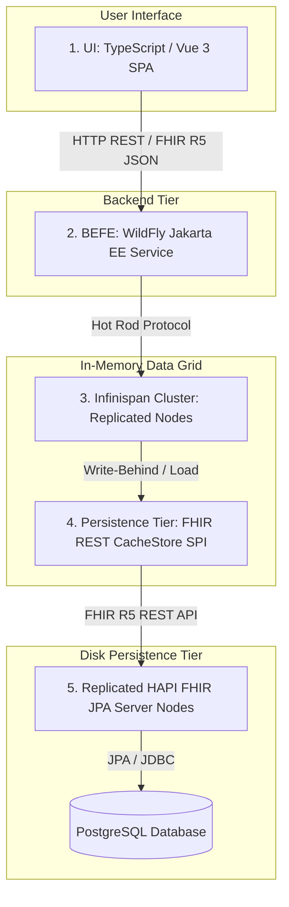

# Requirements

### Overview & Goals
The objective is to establish a modular, scalable, enterprise-grade Health Information Exchange (HIE) platform comprising 5 coordinated sub-projects. The system provides high-performance cached access to healthcare data with high availability (HA), asynchronous write-behind disk persistence, and a modern web interface.

### Scope
- **In Scope**:
  - Construction of 5 distinct sub-projects managed via a root Maven multi-module monorepo.
  - Complete data modeling and management for 8 initial FHIR R5 resources:
    1. `Person`
    2. `RelatedPerson`
    3. `Practitioner`
    4. `PractitionerRole`
    5. `Organization` (Organisation)
    6. `Location`
    7. `HealthcareService`
    8. `Group`
  - Clustered Infinispan caching tier with replicated cache topology across multiple nodes.
  - Custom Infinispan Persistence Tier (`NonBlockingStore` SPI) delivering asynchronous write-behind data ingestion into HAPI FHIR JPA.
  - Replicated HAPI FHIR JPA Server (FHIR R5) backed by a relational database for disk persistence.
  - WildFly Jakarta EE Backend-For-Frontend (BEFE) service exposing standard RESTful FHIR endpoints.
  - TypeScript / Vue 3 Single Page Application (SPA) for resource interaction and administration.
  - Container orchestration with Docker Compose for multi-node deployments.
- **Out of Scope**:
  - Legacy FHIR specification versions (DSTU2, STU3, R4) transformations.
  - External non-FHIR billing/claims subsystems.
  - Hardware-level appliance configuration.

### User Stories
- **As a Healthcare Administrator**, I want to manage Organizations, Locations, and Healthcare Services in a single unified UI so that organizational hierarchies and facilities are accurately maintained.
- **As a Clinical Coordinator**, I want to search and assign Practitioners and Practitioner Roles so that medical staff assignments can be retrieved instantly.
- **As a Patient Registrar**, I want to register and link Persons, RelatedPersons, and Patient Groups to maintain clinical cohort relationships.
- **As a System Architect**, I want reads and writes to be served from a replicated Infinispan cache cluster with asynchronous disk persistence to HAPI FHIR JPA so that response times remain low and data is reliably persisted.

### Functional Requirements
- **FR-1: FHIR R5 Resource Lifecycle**: Provide full CRUD and search operations for Person, RelatedPerson, Practitioner, PractitionerRole, Organization, Location, HealthcareService, and Group.
- **FR-2: High-Performance Caching**: Serve all read and search queries from an Infinispan replicated cache cluster with near-zero latency.
- **FR-3: Asynchronous Write-Behind Persistence**: Write resource mutations to Infinispan immediately, with asynchronous queued flushing to HAPI FHIR JPA Server via a custom SPI store.
- **FR-4: Read-Through Cache Loading**: On cache miss, transparently fetch the requested FHIR resource from the HAPI FHIR JPA server and populate the cache.
- **FR-5: BEFE REST Endpoints**: Expose Jakarta REST (JAX-RS) endpoints in BEFE accepting and returning standard FHIR R5 JSON representations.
- **FR-6: Interactive Vue 3 UI**: Provide rich data tables, search/filter bars, detail views, and mutation forms for all 8 FHIR R5 resources.

### Non-Functional Requirements
- **High Availability**: Multi-node replication for both the Infinispan cluster and HAPI FHIR JPA instances.
- **Data Consistency**: Eventual consistency guarantee via write-behind queue with configurable retry policy and dead-letter handling.
- **Performance**: Sub-10ms response times for cached resource reads via BEFE.
- **Standards Compliance**: HL7 FHIR Specification Release 5.0.0 compliance for all payload schemas.

# Technical Design

### Current Implementation
The repository is an empty root directory initialized with IntelliJ project metadata (`hie.iml`). The architecture is being built from the ground up as a unified 5-subproject monorepo.

### Key Decisions
1. **Monorepo Build System (Maven Multi-Module)**:
   - Root `pom.xml` orchestrates all Java/Jakarta EE sub-projects as well as the Vue UI via `frontend-maven-plugin`.
2. **Jakarta EE Runtime for BEFE (WildFly Server)**:
   - WildFly Application Server provides standard Jakarta EE 10 (JAX-RS, CDI, JSON-B/P) and enterprise Hot Rod client clustering support.
3. **FHIR Specification Version (FHIR R5)**:
   - Targets the latest HL7 FHIR R5 standard using `hapi-fhir-structures-r5` and `hapi-fhir-jpaserver-base`.
4. **Persistence Tier Integration (FHIR REST CacheStore SPI)**:
   - A custom Infinispan `NonBlockingStore` SPI translates cache load/write/delete operations into asynchronous FHIR R5 REST requests against the HAPI FHIR JPA server cluster.
5. **Infinispan Cache Topology (Write-Behind Replicated)**:
   - Replicated cache ensures every cluster node maintains an in-memory copy of FHIR resources for maximum read speed, while writes are queued asynchronously to the persistence store.

### Architecture Diagram


### Sub-Projects Specification

#### 1. `ui` (Vue 3 + TypeScript SPA)
- Built with Vite, Vue 3 (Composition API, `<script setup>`), TypeScript, Pinia, Vue Router, and TailwindCSS / Element Plus.
- Contains modular views and forms for:
  - `PersonView.vue`, `RelatedPersonView.vue`
  - `PractitionerListView.vue`, `PractitionerRoleView.vue`
  - `OrganizationView.vue`, `LocationHierarchyView.vue`
  - `HealthcareServiceView.vue`, `GroupManagementView.vue`
- Includes typed TypeScript FHIR R5 domain models and an Axios-based REST client configured for BEFE.

#### 2. `befe` (Backend-For-Frontend)
- WildFly Jakarta EE 10 application.
- Exposes JAX-RS controllers at `/api/fhir/{resourceType}` with full CRUD and search parameter evaluation (`_id`, `name`, `identifier`, `organization`, etc.).
- Utilizes Infinispan Hot Rod client (`RemoteCacheManager`) to interact directly with the Infinispan cluster.

#### 3. `infinispan-cluster` (Clustered Data Grid)
- Infinispan 15+ cluster configuration (`infinispan.xml`).
- Configures caches for each resource type (`person-cache`, `practitioner-cache`, `organization-cache`, `location-cache`, `group-cache`, etc.) with `replicated-cache` mode.
- Configures the write-behind persistence store with parameters:
  - `write-behind queue-size="1024" thread-pool-size="4"`
  - `connection-pool` and load-balancer settings pointing to HAPI FHIR JPA nodes.

#### 4. `infinispan-persistence` (Custom Infinispan CacheStore SPI)
- Implements Infinispan's `org.infinispan.persistence.spi.NonBlockingStore<K, V>`.
- Provides asynchronous non-blocking methods (`write`, `delete`, `load`, `contains`) that communicate with the HAPI FHIR JPA REST endpoints using non-blocking HTTP client / HAPI FHIR Generic Client.

#### 5. `hapi-fhir-jpa-server` (Replicated HAPI FHIR JPA Server)
- Spring / Spring Boot HAPI FHIR JPA server targeting FHIR R5.
- Resource Providers registered for Person, RelatedPerson, Practitioner, PractitionerRole, Organization, Location, HealthcareService, and Group.
- Configured with PostgreSQL database backend and distributed caching/clustering awareness.

### Proposed File Structure
```
hie/
├── pom.xml                                   # Root Maven Parent POM
├── docker-compose.yml                        # Full cluster orchestration
│
├── ui/                                       # 1. Vue 3 TypeScript UI
│   ├── pom.xml                               # frontend-maven-plugin build
│   ├── package.json
│   ├── vite.config.ts
│   ├── src/
│   │   ├── api/                              # BEFE REST API clients
│   │   ├── models/                           # FHIR R5 TypeScript models
│   │   ├── stores/                           # Pinia state stores
│   │   ├── views/                            # Resource views (8 resources)
│   │   └── components/                       # Shared UI components
│
├── befe/                                     # 2. Jakarta EE BEFE Service
│   ├── pom.xml
│   └── src/main/
│       ├── java/net/fhirfactory/hie/befe/
│       │   ├── rest/                         # JAX-RS Resource Controllers
│       │   ├── service/                      # Cache interaction layer
│       │   └── config/                       # Hot Rod Client & CDI Producers
│       └── webapp/WEB-INF/beans.xml
│
├── infinispan-cluster/                       # 3. Infinispan Cluster Setup
│   ├── pom.xml
│   ├── Dockerfile
│   └── src/main/resources/infinispan.xml     # Cluster & Replicated Cache Config
│
├── infinispan-persistence/                   # 4. Persistence Tier Store SPI
│   ├── pom.xml
│   └── src/main/java/net/fhirfactory/hie/persistence/
│       ├── store/FhirRestCacheStore.java     # NonBlockingStore SPI implementation
│       ├── client/HapiFhirRestClient.java    # REST connector
│       └── config/FhirStoreConfiguration.java
│
└── hapi-fhir-jpa-server/                     # 5. HAPI FHIR JPA Server
    ├── pom.xml
    └── src/main/
        ├── java/net/fhirfactory/hie/hapifhir/
        │   ├── config/FhirServerConfig.java  # FHIR R5 & JPA Configuration
        │   └── provider/                     # 8 FHIR R5 Resource Providers
        └── resources/application.yml         # Database & Server configuration
```

### Risks & Mitigations
- **Write-Behind Eventual Consistency**: If an external system queries HAPI FHIR directly before the Infinispan write-behind queue drains, it might read stale data.
  - *Mitigation*: All client traffic is routed strictly through BEFE / Infinispan, and write-behind queues use low batch flush intervals (<500ms).
- **Cluster Split-Brain in Infinispan**: Network partitions could cause divergent cache states.
  - *Mitigation*: JGroups TCP ping with node quorum / merge policies configured in `infinispan.xml`.

# Testing

### Validation Approach
Automated tests and end-to-end integration flows will validate each sub-project independently as well as their collective interaction in a multi-node cluster environment.

### Key Scenarios
- **Scenario 1: End-to-End Resource Creation & Propagation**:
  - UI issues POST to BEFE `/api/fhir/Person`.
  - BEFE puts the Person into Infinispan `person-cache`.
  - Infinispan acknowledges immediately to BEFE, returning HTTP 201 Created to the UI.
  - Persistence Tier `FhirRestCacheStore` drains the write-behind queue and executes POST to HAPI FHIR JPA Server.
  - Verify Person exists in PostgreSQL database.
- **Scenario 2: Cache Miss / Read-Through Loading**:
  - Direct insertion of a resource into HAPI FHIR JPA Server or eviction of a resource from Infinispan cache.
  - BEFE requests the resource by ID.
  - Infinispan triggers `FhirRestCacheStore.load()` to fetch from HAPI FHIR JPA Server, caches the result, and returns it to BEFE.
- **Scenario 3: Multi-Node Replication**:
  - Deploy 2 Infinispan nodes and 2 HAPI FHIR JPA nodes.
  - Write a `Practitioner` via Node 1; verify Node 2 has the updated entry immediately in its replicated cache partition.
- **Scenario 4: UI Resource Management**:
  - Navigate UI views for Organization, Location, HealthcareService, and Group.
  - Perform create, update, search-by-name, and delete actions; verify reactive UI updates and state store synchronization.

### Edge Cases
- **HAPI FHIR JPA Server Temporarily Unavailable**:
  - Write-behind queue accumulates mutations in Infinispan without blocking user operations, then retries with exponential backoff when HAPI FHIR recovers.
- **Concurrent Writes to the Same FHIR Resource**:
  - Verify version tagging (`meta.versionId`) and optimistic locking behavior in Infinispan and HAPI FHIR JPA.
- **Invalid FHIR Payloads**:
  - BEFE FHIR parser validates JSON structure against FHIR R5 schemas before putting to cache, returning HTTP 400 Bad Request with an `OperationOutcome` resource on validation errors.

# Delivery Steps

### ✓ Step 1: Initialize Root Monorepo and Implement HAPI FHIR JPA Server
The Maven multi-module parent project is configured alongside a fully functioning, clustered HAPI FHIR JPA Server (FHIR R5) backed by PostgreSQL.

- Create the root `pom.xml` declaring submodules: `hapi-fhir-jpa-server`, `infinispan-persistence`, `infinispan-cluster`, `befe`, and `ui`.
- Configure HAPI FHIR JPA Server with FHIR R5 context (`FhirContext.forR5()`), JPA resource providers, and database configuration (PostgreSQL dialect and HikariCP connection pool).
- Implement HAPI FHIR Resource Providers for all 8 target resources: `Person`, `RelatedPerson`, `Practitioner`, `PractitionerRole`, `Organization`, `Location`, `HealthcareService`, and `Group`.
- Add Docker Compose service definition for PostgreSQL and multi-node replicated HAPI FHIR JPA instances with health checks.
- Add integration tests verifying FHIR R5 CRUD operations against the JPA server.

### ✓ Step 2: Implement Persistence Tier Store SPI and Infinispan Cluster Setup
Infinispan cluster configuration is established with a custom write-behind CacheStore SPI connecting Infinispan to the HAPI FHIR JPA Server.

- Implement `FhirRestCacheStore` implementing Infinispan `NonBlockingStore` SPI in the `infinispan-persistence` submodule.
- Implement asynchronous write-behind store methods (`write`, `delete`) and cache loader methods (`load`) that dispatch HTTP REST calls to the HAPI FHIR JPA Server.
- Create Infinispan cluster XML/YAML configuration in `infinispan-cluster` defining `replicated-cache` with write-behind persistence store settings (`write-behind`, `modification-queue-size`, `thread-pool-size`).
- Configure JGroups discovery (TCP/MPING/DNS_PING) for multi-node Infinispan clustering and high availability.
- Add unit and integration tests for `FhirRestCacheStore` verifying write-behind queue draining and cache loader retrieval.

### ✓ Step 3: Implement Jakarta EE BEFE Service with Infinispan Integration
The WildFly Jakarta EE BEFE service is built and exposes RESTful endpoints for all 8 FHIR R5 resources backed by the Infinispan cluster.

- Set up WildFly Jakarta EE 10 project structure with JAX-RS, CDI, and Hot Rod client dependencies in the `befe` submodule.
- Implement Hot Rod `RemoteCacheManager` producer connecting the BEFE service to the Infinispan cluster.
- Create JAX-RS resource endpoints (`/api/fhir/Person`, `/api/fhir/RelatedPerson`, `/api/fhir/Practitioner`, `/api/fhir/PractitionerRole`, `/api/fhir/Organization`, `/api/fhir/Location`, `/api/fhir/HealthcareService`, `/api/fhir/Group`).
- Implement FHIR R5 serialization, deserialization, and search parameter filtering in the BEFE service layer.
- Add integration tests verifying BEFE REST endpoints, cache hits, and automatic persistence propagation.

### ✓ Step 4: Implement TypeScript/Vue UI and End-to-End Orchestration
A responsive Vue 3 TypeScript application is implemented and connected to BEFE, with full Docker Compose orchestration for all 5 sub-projects.

- Scaffold Vue 3 + TypeScript + Vite + Pinia application in the `ui` submodule with `frontend-maven-plugin` integration in `ui/pom.xml`.
- Implement Pinia state stores and API client services for managing the 8 FHIR R5 resources.
- Build UI views and components for viewing, creating, updating, and filtering Persons, Practitioners, Organizations, Locations, HealthcareServices, and Groups.
- Create root `docker-compose.yml` orchestrating PostgreSQL, HAPI FHIR JPA nodes, Infinispan nodes, WildFly BEFE, and Vue UI (Nginx reverse proxy).
- Validate end-to-end workflow from UI action -> BEFE -> Infinispan replicated cache -> Write-behind Persistence Store -> HAPI FHIR JPA Server.