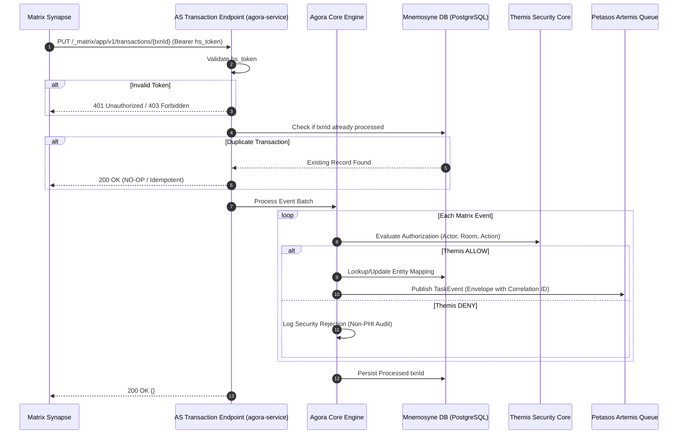
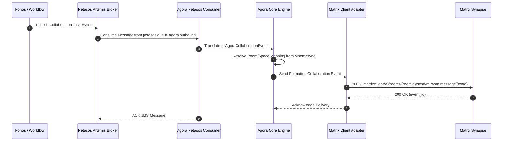
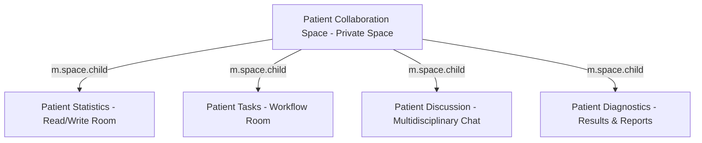

# Requirements

### Overview & Goals
Harmonia is an enterprise-grade Health Integration Environment (HIE) engineered for healthcare data ingestion, transformation, governance, caching, and persistence. Following a platform-wide architecture convergence exercise, this plan introduces **Agora** as Harmonia's first-class Matrix/Synapse integration framework.

Agora establishes a governed architectural boundary between Harmonia and the Matrix collaboration ecosystem. By primarily integrating with Matrix Synapse as an **Application Service (AS)**, Agora projects authorized Harmonia clinical and operational collaboration contexts into Matrix Spaces and Rooms, ingests collaboration events, and dispatches them back into Harmonia via the Petasos messaging backbone.

### Core Architectural Principle
**Agora makes Matrix a Harmonia collaboration capability; it does NOT make Matrix the Harmonia architecture.**
- Harmonia remains authoritative for healthcare information, FHIR resources, Provider Registry state, identity relationships, security policies, and clinical workflows.
- Matrix/Synapse provides authorized collaboration and communication surfaces only.
- Agora projects clinical collaboration state into Matrix and translates Matrix activity back into Harmonia through controlled public interfaces.

### Scope
#### In Scope
- **Scaffolding and Module Design**: Introduction of a decoupled 4-module subproject `agora/` (`agora-api`, `agora-core`, `agora-matrix`, `agora-service`).
- **Matrix Application Service Implementation**: Inbound transaction endpoint `PUT /_matrix/app/v1/transactions/{txnId}` with Bearer token authentication, transaction deduplication, and idempotent event processing.
- **Matrix Client-Server & Admin API Integration**: Standard Matrix Client-Server API adapter for Room/Space lifecycle, event publication, and membership; dedicated Synapse Administration Gateway for provisioned local user management.
- **Collaboration Projections**: Hierarchical projection of Patient Spaces with 4 standard child rooms (Statistics, Tasks, Discussion, Diagnostics), Practitioner Spaces with PractitionerRole child rooms, and Group collaboration rooms.
- **Identity & Provisioning Strategy**: Deterministic provisioning of local Matrix users (`@_harmonia_p_<uuid>:synapse`) via Synapse Admin API (AGORA-ADR-001).
- **Transport Security & Non-E2EE Governance**: Unencrypted Matrix rooms with TLS termination in a closed, non-federated deployment to allow automated clinical governance and event indexing (AGORA-ADR-002).
- **Durable Mapping & Idempotency Storage**: Relational persistence in PostgreSQL via Mnemosyne for resource mappings and processed transactions; ephemeral caching via Mneme.
- **Asynchronous Petasos Integration**: Bi-directional event integration through `petasos-api` contracts, propagating Harmonia message envelopes without direct dependency on Ponos.
- **Themis Security Governance**: Default-deny evaluation for all collaboration requests and membership modifications.
- **Paradeigma Integration**: Synthetic collaboration scenarios exercising Agora via public interfaces without production leakage.
- **Deployment & Observability**: Multi-stage Docker packaging, Kubernetes workloads, Ansible playbooks with volume retention on undeploy, and health/readiness endpoints.
- **Documentation & Registers**: Comprehensive updates to AGENTS.md, Markdown documentation, System Inventory, Configuration/Port Registers, and formal LaTeX reference manual.

#### Out of Scope
- Authoritative Patient, Practitioner, PractitionerRole, or Group data ownership (owned exclusively by Mnemosyne and Calliope).
- Direct Ponos task execution coupling (`Agora -> Ponos` is strictly forbidden).
- End-to-End Encryption (E2EE) session key exchange via MSC3202 (unencrypted server-side rooms with transport TLS selected).
- Public Matrix federation or open user registration (deployment is strictly closed and non-federated).
- Modifying settled architectural contracts in Calliope, Themis, Hestia, Petasos, Energeia, Pylai, or Iris.

### User Stories
- **US-1 (Clinical Team Collaboration)**: As a clinician viewing a patient in Iris Clinical, I want a dedicated Patient Collaboration Space with structured child rooms (Statistics, Tasks, Discussion, Diagnostics) automatically provisioned so that our multidisciplinary team can coordinate care around clinical tasks.
- **US-2 (Care Team Membership Synchronization)**: As a clinical coordinator, I want care team membership changes in the authoritative Provider Registry to automatically synchronize into Matrix room memberships so that only authorized personnel have access to patient collaboration threads.
- **US-3 (Task Event Ingestion)**: As a workflow orchestrator, I want task updates and clinical annotations created within Matrix rooms to be ingested by Agora, validated against Themis, and published onto Petasos so that downstream Harmonia processors can advance clinical workflows.
- **US-4 (Reliable Messaging & Idempotency)**: As a system operator, I want duplicate Matrix Application Service transactions to be safely acknowledged without causing duplicate clinical actions in Harmonia, even across server restarts.
- **US-5 (Privacy & Information Minimisation)**: As an information security officer, I want zero patient names, MRNs, or raw clinical payloads to appear in Matrix room aliases, URLs, or operational logs so that patient privacy is strictly protected.

### Functional Requirements
1. **Application Service Transaction Ingestion**: Agora must expose `PUT /_matrix/app/v1/transactions/{txnId}`, authenticate the homeserver via `hs_token`, deduplicate transactions idempotently against persistent storage, and process batches of events.
2. **Matrix Client-Server Adapter**: Agora must interact with Synapse over standard Matrix v1.11+ Client-Server endpoints for room creation, Space parent-child hierarchy configuration, topic/metadata updates, and event sending.
3. **Provisioned User Management**: Agora must manage local Matrix user accounts for Harmonia principals via the isolated `SynapseAdministrationGateway` using deterministic, opaque user IDs.
4. **Collaboration Projection & Lifecycle**: Agora must create and manage:
   - Patient Space $\rightarrow$ 4 child rooms (`Statistics`, `Tasks`, `Discussion`, `Diagnostics`).
   - Practitioner Space $\rightarrow$ PractitionerRole child rooms.
   - Group collaboration rooms.
5. **Membership Reconciliation**: Agora must periodically and reactively compare authoritative Harmonia collaboration memberships (governed by Themis) with live Matrix room states and issue corrective join, invite, or kick operations.
6. **Petasos Messaging Integration**: Agora must publish ingested Matrix events onto Petasos queues using canonical message envelopes (`messageId`, `correlationId`, `causationId`, `securityContext`) and consume outbound Harmonia events for Matrix publication.
7. **Durable Persistence via Mnemosyne**: Agora must persist resource ID mappings (`Harmonia ID <-> Matrix Room/Space ID`) and transaction processing records in PostgreSQL tables (`agora_resource_mappings`, `agora_as_transactions`).
8. **Security Governance (Themis)**: Every membership grant, room creation, or inbound event dispatch must evaluate authorization against Themis with default-deny semantics.
9. **Zero-PHI Diagnostic Logging**: Operational logs must contain only safe technical identifiers (`correlationId`, `txnId`, `roomId`); patient names, MRNs, and message bodies must never appear in standard log streams.

### Non-Functional Requirements
- **Resilience & Bounded Waits**: All external HTTP calls, messaging consumers, and test harnesses must enforce explicit bounded timeouts (maximum 10s in integration tests) to eliminate Maven build hangs.
- **Decoupled Architecture**: Agora must introduce zero direct dependencies on Ponos or Artemis JMS client implementations (`petasos-api` abstraction only).
- **Deployment Isolation**: Synapse must run in a closed, non-federated mode with persistent PostgreSQL storage and dedicated Kubernetes StatefulSet/Service topology.
- **Idempotency Durability**: Transaction deduplication must survive pod restarts and database reconnects.

# Technical Design

### Current Implementation & Context
Harmonia decomposes integration capabilities across 8 core subprojects:
`Calliope` (schemas), `Themis` (security), `Hestia` (Mneme caching & Mnemosyne persistence), `Petasos` (Artemis messaging abstraction), `Energeia` (Ponos/Erga/Praxis workflow engine), `Pylai` (MLLP/FHIR gateways), `Iris` (presentation SPAs & BEFE), and `Paradeigma` (simulation).

Currently, Harmonia lacks a collaboration projection layer into chat/collaboration middleware. Agora fills this architectural role by connecting to Matrix Synapse via the Matrix Application Service and Client-Server APIs, mediating communication through Petasos.

### Key Architecture Decisions (ADRs)

#### AGORA-ADR-001: Matrix Principal & Identity Provisioning Strategy
- **Context**: Matrix collaboration requires distinct user principals for message attribution, state events, and access control.
- **Decision**: **Provisioned Local Users**. Agora provisions dedicated local Matrix accounts (`@_harmonia_p_<uuid>:synapse`) via the Synapse Admin REST API (`PUT /_synapse/admin/v2/users/{userId}`) with generated secure credentials stored in Mnemosyne.
- **Rationale**: Local accounts allow clinical users and automated actors to maintain persistent session tokens, distinct display profiles, and full compatibility with native Matrix client applications, while maintaining deterministic mapping to Harmonia practitioner/principal UUIDs.

#### AGORA-ADR-002: Matrix Room Encryption (E2EE) Policy
- **Context**: Matrix supports Olm/Megolm E2EE. However, Agora acts as a platform bridge that must inspect task notifications, extract clinical annotations, and trigger downstream Petasos workflows.
- **Decision**: **Transport TLS Non-E2EE**. Rooms and Spaces managed by Agora will operate without Olm/Megolm room encryption, protected by end-to-end TLS 1.3 on all transport hops within a closed, non-federated Kubernetes network boundary.
- **Rationale**: Server-side Application Service event processing cannot transparently decrypt Megolm streams without complex MSC3202 bot device key sharing and persistent session key state. Non-E2EE with transport encryption and strict network isolation ensures full visibility for governance, auditing, and Petasos workflow dispatch.

#### AGORA-ADR-003: Authoritative Harmonia <-> Matrix Identifier Mapping
- **Context**: Mappings between Harmonia resources (Patient, Practitioner, PractitionerRole, Group) and Matrix entities (Spaces, Rooms, User IDs) must survive pod restarts, cache invalidation, and Synapse restarts.
- **Decision**: Persist mappings in PostgreSQL via a dedicated Mnemosyne table `agora_resource_mappings` with unique composite indexing (`harmonia_resource_type`, `harmonia_resource_id`, `matrix_entity_type`). Ephemeral lookups are cached in Mneme Infinispan.
- **Rationale**: Relying solely on Matrix room state events or room aliases creates fragile dependency on homeserver state. Mnemosyne provides transactional, ACID-backed authoritative mapping.

#### AGORA-ADR-004: Matrix Event & Clinical Conversation Retention
- **Context**: Synapse indefinitely retains room events by default, which may lead to database bloat and uncontrolled retention of sensitive collaboration discussions.
- **Decision**: Synapse retention policy will be configured in `homeserver.yaml` with a default message lifetime of 90 days (`retention.default_policy: { min_lifetime: 1d, max_lifetime: 90d }`). Authoritative clinical summaries, decisions, and task outputs must be committed back to Mnemosyne FHIR resources before event expiration.
- **Rationale**: Matrix is an ephemeral collaboration projection, not authoritative clinical storage.

#### AGORA-ADR-005: Clinical Conversation & PHI Minimisation
- **Context**: Information security rules dictate that PHI must be strictly minimized in secondary collaboration stores.
- **Decision**: Room aliases, Space names, user localparts, and topics must never include patient names, DOB, MRN, or clinical condition details. Opaque UUIDs or synthetic labels will be used. Collaboration payloads reference FHIR Task and Communication resources by URI/ID.
- **Rationale**: Prevents accidental PHI leakage into Synapse server logs, metrics, or administrative inspection.

#### AGORA-ADR-006: Federation & Public Access Governance
- **Context**: Open Matrix homeservers allow inter-server federation and public room directory discovery.
- **Decision**: **Closed, Non-Federated Deployment**. Synapse configuration explicitly sets `federation.enabled: false`, `enable_registration: false`, `allow_guest_access: false`, and `room_directory.enabled: false`.
- **Rationale**: Enforces a strict security perimeter where only authenticated Harmonia actors can participate.

#### AGORA-ADR-007: Application Service Transaction Idempotency
- **Context**: The Matrix homeserver pushes event transactions to `PUT /_matrix/app/v1/transactions/{txnId}` and retries on non-200 responses or timeouts. Duplicate processing can trigger duplicated Petasos events.
- **Decision**: Store processed `txnId` values in PostgreSQL table `agora_as_transactions` with unique constraints and timestamp indexing, verified prior to event translation.
- **Rationale**: Guarantees zero duplicate business effects in Harmonia across pod replacement or transient network retries.

#### AGORA-ADR-008: Room Archival and Deletion Lifecycle
- **Context**: When a clinical encounter concludes or a patient is discharged, associated collaboration spaces must be decommissioned.
- **Decision**: **Soft Retirement & Archival**. Agora updates room state to read-only (`m.room.power_levels`), kicks active participants, marks the mapping as `ARCHIVED` in Mnemosyne, and closes the room rather than issuing an irreversible purge.
- **Rationale**: Preserves audit trails while cleanly removing active clutter from clinician client views.

---

### Matrix & Synapse Technology Baseline
- **Matrix Specification Version**: Matrix v1.11 (supporting Room Versions 9-11, Application Service API v1, Spaces MSC1772).
- **Matrix Synapse Version**: Pinned to `matrixdotorg/synapse:v1.120.0`.
- **Container Base**: Official Debian/Ubuntu-based Synapse container running on Python 3.11/3.12 with PostgreSQL backend.

---

### API Capability Matrix

| Harmonia Requirement | Matrix Capability | API Endpoint / Route | Standard vs Synapse-Specific | Supported in v1.11 / Synapse 1.120 | Agora Adapter | Architectural Notes |
| :--- | :--- | :--- | :--- | :--- | :--- | :--- |
| AS Event Ingestion | Push transactions | `PUT /_matrix/app/v1/transactions/{txnId}` | Matrix Standard | Supported | `ApplicationServiceTransactionEndpoint` | Validates `hs_token`; idempotent processing |
| AS Registration | Homeserver hooks | YAML config loaded by Synapse | Matrix Standard | Supported | `AppServiceRegistrationGenerator` | Configures namespaces for users, aliases, rooms |
| Space Creation | Create space room | `POST /_matrix/client/v3/createRoom` (`creation_content.type = "m.space"`) | Matrix Standard | Supported | `MatrixClientAdapter.createSpace()` | Private Space with invite-only join rule |
| Room Creation | Create child room | `POST /_matrix/client/v3/createRoom` | Matrix Standard | Supported | `MatrixClientAdapter.createRoom()` | Creates Statistics, Tasks, Discussion, Diagnostics |
| Space-Room Hierarchy | Child room link | `PUT /_matrix/client/v3/rooms/{spaceId}/state/m.space.child/{roomId}` | Matrix Standard | Supported | `MatrixClientAdapter.linkChildRoom()` | Declares parent-child relationship |
| Room Membership | Invite / Join / Kick | `POST /_matrix/client/v3/rooms/{roomId}/invite`, `/join`, `/kick` | Matrix Standard | Supported | `MatrixClientAdapter.manageMembership()` | Governed by Themis authorization |
| Room State Query | Member listing | `GET /_matrix/client/v3/rooms/{roomId}/members` | Matrix Standard | Supported | `MatrixClientAdapter.getRoomMembers()` | Used by reconciliation engine |
| Event Publication | Send text / notices | `PUT /_matrix/client/v3/rooms/{roomId}/send/m.room.message/{txnId}` | Matrix Standard | Supported | `MatrixClientAdapter.sendMessage()` | Dispatches outbound task notices |
| User Provisioning | Create local user | `PUT /_synapse/admin/v2/users/{userId}` | **Synapse-Specific** | Supported | `SynapseAdministrationGateway.createUser()` | Admin API required for deterministic local account creation |
| Room Deletion / Purge | Admin purge | `DELETE /_synapse/admin/v1/rooms/{roomId}` | **Synapse-Specific** | Supported | `SynapseAdministrationGateway.purgeRoom()` | Admin API; isolated for clean decommissioning |
| Homeserver Health | Healthcheck probe | `GET /_matrix/client/versions`, `GET /health` | Matrix Standard / Synapse | Supported | `MatrixHealthIndicator` | Used by Spring Boot Actuator & K8s probes |

---

### Module Decomposition & Architecture
Agora will be structured across 4 decoupled Maven submodules under `agora/`:

```
agora/
├── pom.xml                      (Parent aggregation POM)
├── agora-api/                   (Harmonia contracts, event DTOs, topic constants)
├── agora-core/                  (Orchestration, mappings, reconciliation, Petasos/Themis wiring)
├── agora-matrix/                (Matrix AS/CS client, Synapse admin gateway, HTTP DTOs)
└── agora-service/               (Deployable Spring Boot runtime, REST AS controller, health)
```

#### Dependency Flow
$$\text{agora-service} \longrightarrow \text{agora-core} \longrightarrow \text{agora-matrix}$$
$$\text{agora-core} \longrightarrow \text{agora-api} \longleftarrow \text{calliope}, \text{themis-api}, \text{petasos-api}$$

- `agora-api`: Pure Java interfaces, event definitions (`AgoraCollaborationEvent`), payload DTOs. Zero Matrix or Spring dependencies.
- `agora-core`: Domain logic, `AgoraCollaborationLifecycleService`, `AgoraMembershipReconciliationService`, Mnemosyne JPA entities (`AgoraMappingEntity`), and Petasos producers/consumers. Zero Ponos dependencies.
- `agora-matrix`: Encapsulates `MatrixClientAdapter` and `SynapseAdministrationGateway`. Raw Matrix JSON/DTOs do not leak into `agora-core` or outside Agora.
- `agora-service`: Spring Boot 3.2.5 application entry point, Application Service transaction endpoint controller (`ApplicationServiceTransactionEndpoint`), Actuator health indicators, security filter checking `hs_token`.

---

### Architecture & Data Flow Diagrams

#### 1. Inbound Application Service Transaction Flow


#### 2. Outbound Collaboration Projection Flow


#### 3. Patient Collaboration Space Hierarchy


---

### Data Models & Persistence Contracts (Mnemosyne)

#### Entity: `AgoraMappingEntity` (Table: `agora_resource_mappings`)
- `id`: `UUID` (Primary Key, auto-generated)
- `harmonia_resource_type`: `VARCHAR(64)` (`PATIENT`, `PRACTITIONER`, `PRACTITIONER_ROLE`, `GROUP`, `TASK`)
- `harmonia_resource_id`: `VARCHAR(128)` (Opaque Harmonia/FHIR identifier)
- `matrix_entity_type`: `VARCHAR(64)` (`SPACE`, `ROOM`, `USER`)
- `matrix_entity_id`: `VARCHAR(256)` (Matrix Room ID `!abc:homeserver` or User ID `@xyz:homeserver`)
- `status`: `VARCHAR(32)` (`ACTIVE`, `ARCHIVED`, `SUSPENDED`)
- `created_at`: `TIMESTAMP WITH TIME ZONE`
- `updated_at`: `TIMESTAMP WITH TIME ZONE`
- *Constraints*: Unique index on `(harmonia_resource_type, harmonia_resource_id, matrix_entity_type)`.

#### Entity: `AgoraTransactionEntity` (Table: `agora_as_transactions`)
- `transaction_id`: `VARCHAR(128)` (Primary Key, homeserver transaction ID)
- `received_at`: `TIMESTAMP WITH TIME ZONE`
- `processed_at`: `TIMESTAMP WITH TIME ZONE`
- `event_count`: `INTEGER`
- `status`: `VARCHAR(32)` (`PROCESSED`, `FAILED`, `IGNORED`)

---

### File Structure & Changes

```
agora/
├─��� pom.xml
├── agora-api/
│   ├── pom.xml
│   └── src/main/java/net/fhirfactory/harmonia/agora/api/
│       ├── model/ (AgoraCollaborationEvent, AgoraRoomType, AgoraMembershipAction)
│       └── topic/ (AgoraTopics)
├── agora-core/
│   ├── pom.xml
│   └── src/main/java/net/fhirfactory/harmonia/agora/core/
│       ├── identity/ (AgoraIdentityService)
│       ├── lifecycle/ (AgoraCollaborationLifecycleService)
│       ├── reconciliation/ (AgoraMembershipReconciliationService)
│       ├── messaging/ (AgoraPetasosEventProducer, AgoraPetasosEventConsumer)
│       └── persistence/ (AgoraMappingEntity, AgoraTransactionEntity, AgoraMappingRepository, AgoraTransactionRepository)
├── agora-matrix/
│   ├── pom.xml
│   └── src/main/java/net/fhirfactory/harmonia/agora/matrix/
│       ├── client/ (MatrixClientAdapter, MatrixRestException)
│       ├── admin/ (SynapseAdministrationGateway)
│       ├── appservice/ (AppServiceRegistration, AppServiceTransactionDto)
│       └── dto/ (MatrixRoomDto, MatrixEventDto, MatrixUserDto)
└── agora-service/
    ├── pom.xml
    └── src/main/java/net/fhirfactory/harmonia/agora/service/
        ├── AgoraApplication.java
        ├── config/ (AgoraProperties, MatrixConfig, PetasosConfig)
        ├── rest/ (ApplicationServiceTransactionEndpoint)
        └── health/ (MatrixHealthIndicator)
```

Platform modifications:
- `pom.xml`: Register `<module>agora</module>`.
- `paradeigma/paradeigma-test/.../ParadeigmaIsolationArchitectureTest.java`: Add `"agora"` to `productionModules`.
- `paradeigma/paradeigma-test/.../AgoraIsolationArchitectureTest.java`: New ArchUnit rules verifying no Ponos imports and no Matrix DTO leakage.
- `deployment/docker/Dockerfile.agora`: Agora container build definition.
- `deployment/kubernetes/base/`: Add `agora-*.yaml` and `synapse-*.yaml`.
- `deployment/ansible/`: Add `roles/agora/` and `roles/synapse/`.
- Documentation & LaTeX: Comprehensive updates across Markdown and TeX chapters.

# Deployment and Operations

### Deployment Topology & Infrastructure

Agora deploys alongside the existing Harmonia 5-tier architecture as an asynchronous collaboration gateway in Tier 3, backed by Matrix Synapse in Tier 4/5.

```
+---------------------------------------------------------------------------------------------------+
| KUBERNETES CLUSTER (Namespace: harmonia)                                                          |
|                                                                                                   |
|  +---------------------------+        REST / AS Txn        +-----------------------------------+  |
|  | Agora Service Pod         | <-------------------------> | Matrix Synapse Pod                |  |
|  | (Deployment: agora)       |      (Cluster-Internal)     | (StatefulSet: synapse)            |  |
|  | - Port: 8092 (AS + REST)  |                             | - Port: 8008 (Matrix Client / AS) |  |
|  | - Port: 9992 (Mgmt)       |                             | - Image: matrixdotorg/synapse     |  |
|  +---------------------------+                             +-----------------------------------+  |
|       |                 |                                                    |                    |
|       | Petasos Core    | JPA JDBC                                           | PostgreSQL Native  |
|       v                 v                                                    v                    |
|  +----------------+  +-------------------------------------+  +---------------------------------+ |
|  | ActiveMQ       |  | PostgreSQL Operations Node          |  | PostgreSQL Synapse DB           | |
|  | Artemis Mesh   |  | (StatefulSet: postgres-ops-1)       |  | (StatefulSet: postgres-synapse) | |
|  | (61616)        |  | - Database: ops_node_1              |  | - Database: synapse_db          | |
|  +----------------+  | - Tables: agora_resource_mappings   |  | - Port: 5436                    | |
|                      |           agora_as_transactions     |  +---------------------------------+ |
|                      +-------------------------------------+                                      |
+---------------------------------------------------------------------------------------------------+
```

### Network Ports & Protocol Register Updates

| Port Number | Protocol / Transport | Workload / Component | Direction & Flow | Purpose & Description | Security Boundary |
| :--- | :--- | :--- | :--- | :--- | :--- |
| **`8008`** | HTTP / REST | `synapse` StatefulSet | Internal: Agora $\rightarrow$ Synapse, Ingress $\rightarrow$ Synapse | Matrix Client-Server API, Synapse Admin API, and AS transaction egress | Internal Cluster Network / TLS at Ingress |
| **`8092`** | HTTP / REST | `agora` Deployment | Internal: Synapse $\rightarrow$ Agora | Application Service transaction endpoint (`PUT /_matrix/app/v1/transactions/{txnId}`) | Authenticated via Bearer `hs_token` |
| **`9992`** | HTTP / Actuator | `agora` Deployment | Monitoring / K8s Probes | Spring Boot Actuator liveness, readiness, and metrics | Internal Cluster Only |
| **`5436`** | PostgreSQL Native TCP | `postgres-synapse` StatefulSet | Synapse $\rightarrow$ Database | Dedicated relational storage for Synapse homeserver state | PostgreSQL Native MD5/SCRAM Authentication |

### Configuration Register Updates

| Parameter / Variable Name | Component / Scope | Default Value | Description | Secret? | Code Binding |
| :--- | :--- | :--- | :--- | :--- | :--- |
| `AGORA_SYNAPSE_BASE_URL` | `agora-service` | `http://synapse:8008` | URL of the Synapse homeserver for CS/Admin API calls | No | `agora.synapse.baseUrl` |
| `AGORA_HOMESERVER_TOKEN` | `agora-service` | `Secret` | Secret token used by Synapse to authenticate to Agora (`hs_token`) | **Yes** | `agora.security.hsToken` |
| `AGORA_APPSERVICE_TOKEN` | `agora-service` | `Secret` | Secret token used by Agora to authenticate to Synapse (`as_token`) | **Yes** | `agora.security.asToken` |
| `AGORA_ADMIN_TOKEN` | `agora-service` | `Secret` | Synapse Admin access token for local user provisioning | **Yes** | `agora.security.adminToken` |
| `AGORA_APPSERVICE_ID` | `agora-service` | `harmonia-agora` | Application Service unique identifier in Synapse registration | No | `agora.appservice.id` |
| `AGORA_SERVER_NAME` | `agora-service` | `harmonia.local` | Server name domain for Matrix user/room IDs | No | `agora.matrix.serverName` |
| `AGORA_RECONCILIATION_CRON`| `agora-service` | `0 */15 * * * *` | Cron schedule for periodic membership reconciliation | No | `agora.reconciliation.cron` |
| `SYNAPSE_REPORT_STATS` | `synapse` | `no` | Homeserver telemetry reporting flag (disabled for privacy) | No | `report_stats` |
| `SYNAPSE_REGISTRATION_SHARED_SECRET` | `synapse` | `Secret` | Shared secret for automated user registration | **Yes** | `registration_shared_secret` |

### Secrets Management
Secrets are managed using Harmonia Kubernetes Secret patterns:
- Secret `harmonia-agora-secrets`: Contains `hs-token`, `as-token`, `synapse-admin-token`.
- Secret `harmonia-synapse-secrets`: Contains `registration-shared-secret`, `macaroon-secret-key`, `db-password`.
- Secrets are mounted as environment variables in Pod specs and never committed to source control or emitted in operational logs.

### Operational Runbook & Failure Handling

| Failure Symptom | Root Cause Investigation | Diagnostic Actions | Automated & Manual Recovery Remediation |
| :--- | :--- | :--- | :--- |
| Synapse returns HTTP 503 / Connection Refused | Synapse pod restarting or PostgreSQL database unavailable | Check `kubectl logs -n harmonia synapse-0`; inspect `postgres-synapse` health | Agora retries with exponential backoff (up to 5 retries); circuit breaker prevents thread exhaustion. Agora marks Synapse readiness probe degraded but remains alive. |
| Inbound AS transactions failing with HTTP 401 | `hs_token` mismatch between Synapse registration YAML and Agora configuration | Compare `registration.yaml` `hs_token` hash with `harmonia-agora-secrets` | Update secret in Kubernetes and reload Agora deployment. |
| Duplicate Transaction Warnings in Agora Logs | Synapse re-sending transactions due to transient HTTP timeout | Check `agora_as_transactions` query times; monitor Synapse response latency | Expected Matrix behavior. Agora verifies transaction existence and returns 200 OK immediately without duplicate Petasos dispatches. |
| Membership Drift Detected | External admin intervention or interrupted reconciliation loop | Run Agora reconciliation CLI / trigger `/actuator/reconcile` | Reconciliation engine automatically issues corrective invite/kick commands to converge Matrix state to Themis desired state. |
| Petasos Broker Connection Lost | ActiveMQ Artemis failover or cluster partition | Inspect `artemis-primary-*` pods and Petasos connection pool metrics | Agora queues outbound events in bounded in-memory sliding buffer and reconnects via Petasos failover URL. |

### Undeployment & Persistence Policy
- Standard `helm uninstall` or `ansible-playbook undeploy-harmonia.yml` removes Deployments, Services, and ConfigMaps, but **preserves PersistentVolumeClaims** (`synapse-data`, `postgres-synapse-data`, `postgres-ops-data`).
- Full data destruction is executed only when explicit parameter `--extra-vars "harmonia_purge_data=true"` is passed, preventing accidental loss of clinical collaboration audit trails.

# Testing and Verification

### Validation Approach
Verification of Agora follows Harmonia's multi-tier testing strategy, ensuring high code quality, contract compliance, bounded execution timeouts, and strict architecture isolation.

### Key Scenarios
1. **Application Service Authentication & Transaction Deduplication**:
   - Verify `PUT /_matrix/app/v1/transactions/{txnId}` rejects invalid tokens with HTTP 401/403.
   - Verify valid transaction persists `txnId` and returns HTTP 200 `{}`.
   - Resend identical `txnId`; verify immediate HTTP 200 response with zero duplicate Petasos dispatches.
2. **Space and Child Room Hierarchy Lifecycle**:
   - Trigger Patient Space creation for synthetic patient UUID.
   - Verify private Space created with 4 child rooms (`Statistics`, `Tasks`, `Discussion`, `Diagnostics`) linked via `m.space.child` state events.
   - Verify durable mapping recorded in `agora_resource_mappings`.
3. **Provisioned Local User Management**:
   - Request collaboration provisioning for synthetic Practitioner.
   - Verify deterministic user `@_harmonia_p_<uuid>:synapse` created via `SynapseAdministrationGateway`.
   - Verify credentials stored securely and mapped in Mnemosyne.
4. **Themis Security Authorization & Membership Drift Reconciliation**:
   - Inject unauthorized user into room state.
   - Run reconciliation engine; verify Themis evaluates `DENY` and Agora issues kick command.
   - Authorize new Practitioner in Themis; verify reconciliation automatically invites user.
5. **Bi-Directional Petasos Messaging**:
   - Ingest `m.room.message` from Matrix; verify translation to `AgoraCollaborationEvent` and successful delivery onto Petasos queue.
   - Publish task notification to Petasos queue; verify consumption by Agora and publication into target Matrix room.

### Test Changes & Architecture Guardrails

#### 1. ArchUnit Architecture Test Suite (`AgoraIsolationArchitectureTest.java`)
- **Rule 1: Ponos Direct Dependency Prohibition**:
  `noClasses().that().resideInAPackage("net.fhirfactory.harmonia.agora..").should().dependOnClassesThat().resideInAPackage("net.fhirfactory.harmonia.energeia.ponos..")`
- **Rule 2: Matrix Type Leakage Prevention**:
  `noClasses().that().resideInAnyPackage("net.fhirfactory.harmonia.calliope..", "net.fhirfactory.harmonia.themis..", "net.fhirfactory.harmonia.petasos..", "net.fhirfactory.harmonia.energeia..", "net.fhirfactory.harmonia.pylai..", "net.fhirfactory.harmonia.iris..").should().dependOnClassesThat().resideInAPackage("net.fhirfactory.harmonia.agora.matrix..")`
- **Rule 3: Paradeigma Isolation**:
  Update `ParadeigmaIsolationArchitectureTest` to assert zero production dependencies on Paradeigma across `agora`.

#### 2. Timeout Safety & Bounded Waits
In accordance with Harmonia test guidelines, all tests must guarantee bounded execution to prevent indefinite Maven hangs:
- Surefire plugin configuration in `agora/pom.xml` sets `<forkedProcessExitTimeoutInSeconds>60</forkedProcessExitTimeoutInSeconds>` and individual test timeouts `@Timeout(10)`.
- Mock HTTP servers (WireMock / MockWebServer) and test clients use socket connection timeouts of $\le 5$ seconds.
- Testcontainers or embedded mock harnesses enforce deterministic start and stop bounds.

#### 3. Paradeigma Synthetic Simulation (`AgoraCollaborationScenario.java`)
- Implemented in `paradeigma/paradeigma-scenarios/` as a leaf test scenario.
- Generates synthetic HL7/FHIR patient encounters and validates end-to-end Space creation, user provisioning, and event ingestion over public HTTP/REST interfaces.
- Strictly isolated from production modules (zero `paradeigmaMode` branches in production code).

#### 4. Documentation & LaTeX Verification
- Compilation check via `cd docs/latex && make pdf` ensuring zero broken references, missing citations, or undefined labels across new and modified TeX chapters.

# Delivery Steps

### ✓ Step 1: Scaffold Agora Maven modules, domain contracts, persistence, and Petasos integration
Agora's Maven module hierarchy (`agora-api`, `agora-core`, `agora-matrix`, `agora-service`) is established, the platform parent POM is wired, and core domain abstractions, Petasos event producers/listeners, and Mnemosyne PostgreSQL persistence entities are fully functional and unit-tested.

- Scaffold parent POM `agora/pom.xml` and submodules `agora/agora-api`, `agora/agora-core`, `agora/agora-matrix`, and `agora/agora-service` with Java 21 and Spring Boot 3.2.5 dependencies, registering `agora` in root `pom.xml`.
- Implement Harmonia-facing public domain models, events, and topic identifiers in `agora/agora-api` under package `net.fhirfactory.harmonia.agora.api` (`AgoraCollaborationEvent`, `AgoraSpaceRequest`, `AgoraRoomRequest`, `AgoraMembershipRequest`, `AgoraTopicConstants`), adhering strictly to Calliope and Themis API contracts.
- Implement Mnemosyne JPA relational entities and Spring Data repositories in `agora-core` under package `net.fhirfactory.harmonia.agora.core.persistence` (`AgoraMappingEntity`, `AgoraMappingRepository`, `AgoraTransactionEntity`, `AgoraTransactionRepository`) targeting PostgreSQL schema tables `agora_resource_mappings` and `agora_as_transactions` to persist durable mappings and idempotency state.
- Implement Petasos transport adapters in `agora-core` under package `net.fhirfactory.harmonia.agora.core.messaging` (`AgoraPetasosEventProducer`, `AgoraPetasosEventConsumer`) using `petasos-api` contracts (`PetasosProducer`, `PetasosConsumer`, `PetasosMessage`) with correlation ID and security context propagation, ensuring zero direct dependency on Ponos or JMS implementations.
- Write unit tests in `agora-core` validating mapping persistence, transaction idempotency queries, Petasos message translation, and Themis default-deny security evaluation with bounded timeouts.

### ✓ Step 2: Implement Matrix protocol adapters, Synapse admin gateway, and AS transaction controller
Agora provides robust Matrix Client-Server and Application Service protocol adapters, an isolated Synapse Administration gateway, and an authenticated, idempotent Application Service transaction REST endpoint.

- Implement Matrix Client-Server REST client abstractions and DTOs in `agora/agora-matrix` under package `net.fhirfactory.harmonia.agora.matrix.client` (`MatrixClientAdapter`, `MatrixRoomDto`, `MatrixEventDto`, `MatrixPowerLevelsDto`) utilizing Spring `RestClient`/`WebClient` targeting Matrix v1.11+ specification endpoints (`/_matrix/client/v3/createRoom`, `/_matrix/client/v3/rooms/{roomId}/send/...`, `/_matrix/client/v3/rooms/{roomId}/state/...`).
- Implement Synapse-specific administration client in `agora/agora-matrix` under package `net.fhirfactory.harmonia.agora.matrix.admin` (`SynapseAdministrationGateway`) targeting `/_synapse/admin/v2/users/{userId}` and `/_synapse/admin/v1/rooms/{roomId}` with dedicated admin token authentication and comprehensive error translation.
- Implement Application Service protocol models and registration generator in `agora/agora-matrix` under package `net.fhirfactory.harmonia.agora.matrix.appservice` (`AppServiceRegistration`, `AppServiceTransactionDto`, `AppServiceEventDto`).
- Implement the deployable Spring Boot Application Service REST controller in `agora/agora-service` under package `net.fhirfactory.harmonia.agora.service.rest` (`ApplicationServiceTransactionEndpoint`) implementing `PUT /_matrix/app/v1/transactions/{txnId}` with Bearer `hs_token` authentication validation.
- Implement transaction deduplication and processing pipeline in `agora/agora-service` ensuring that incoming Matrix transactions are checked against `AgoraTransactionRepository` before dispatching translated domain events to Petasos, returning HTTP 200 OK with empty JSON object `{}`.
- Write contract and controller unit tests verifying token authentication, unknown event type tolerance, duplicate transaction idempotency, and 401/403 failure paths.

### ✓ Step 3: Implement Space and Room lifecycle, user provisioning, and membership reconciliation
Agora automatically orchestrates the lifecycle of Patient Collaboration Spaces, practitioner and group rooms, deterministic local user provisioning, and bi-directional membership reconciliation against authoritative Themis security policies.

- Implement deterministic identity resolution and local user provisioning service in `agora-core` under package `net.fhirfactory.harmonia.agora.core.identity` (`AgoraIdentityService`) deriving opaque localparts (`@_harmonia_p_<uuid>:synapse`) from Harmonia principal IDs and provisioning accounts via `SynapseAdministrationGateway`.
- Implement Room and Space lifecycle management in `agora-core` under package `net.fhirfactory.harmonia.agora.core.lifecycle` (`AgoraCollaborationLifecycleService`) supporting creation and hierarchical binding of Patient Spaces (`m.space.parent`, `m.space.child`) with default child rooms: Patient Statistics, Tasks, Discussion, and Diagnostics.
- Implement Practitioner and Group collaboration structure lifecycle projecting Practitioner Spaces, PractitionerRole child rooms, and Group collaboration rooms with minimal clinical metadata.
- Implement membership reconciliation engine in `agora-core` under package `net.fhirfactory.harmonia.agora.core.reconciliation` (`AgoraMembershipReconciliationService`) reconciling desired collaboration membership authorized by Themis against live Matrix room state fetched via `MatrixClientAdapter`, executing corrective join, invite, or kick operations.
- Integrate Themis default-deny policy evaluation gate before granting or reconciling membership, verifying `ThemisDecision.isAllowed()` before invoking Matrix membership modifications.
- Write unit and mock integration tests covering Space creation hierarchies, child room linking, identity provisioning retries, and membership drift reconciliation.

### ✓ Step 4: Add Paradeigma scenarios, ArchUnit architecture guardrails, and timeout-safe test suite
Paradeigma synthetic simulation scenarios exercise Agora over public interfaces, ArchUnit tests enforce architectural boundaries, and the test suite executes deterministically with bounded timeouts.

- Author new ArchUnit architecture test `paradeigma/paradeigma-test/src/test/java/net/fhirfactory/harmonia/paradeigma/test/arch/AgoraIsolationArchitectureTest.java` enforcing: Agora does not depend on Ponos, Matrix DTOs do not leak outside Agora, production code does not depend on Paradeigma, and Themis authorization is enforced on ingress.
- Update `ParadeigmaIsolationArchitectureTest.java` to register `agora` in the authoritative `productionModules` array, verifying zero Paradeigma imports or dependencies in production Agora modules.
- Implement Paradeigma collaboration scenario in `paradeigma/paradeigma-scenarios` under package `net.fhirfactory.harmonia.paradeigma.scenarios.agora` (`AgoraCollaborationScenario`) simulating Patient Space provisioning, PractitionerRole room setup, synthetic practitioner messaging, duplicate transaction submission, and membership drift resolution.
- Ensure all test HTTP clients, embedded brokers, and database operations enforce explicit bounded timeouts (maximum 10 seconds) to prevent Maven build hangs.
- Execute targeted Surefire test runs across `agora-api`, `agora-core`, `agora-matrix`, `agora-service`, and `paradeigma-test` ensuring all architecture rules and unit tests pass cleanly.

### ✓ Step 5: Package containers, create Kubernetes/Ansible deployment, and update platform documentation and registers
Agora and Synapse are packaged as container images, deployed to Kubernetes and Ansible with robust secrets management and volume retention, and platform registers, Markdown, and LaTeX documentation are fully updated.

- Create multi-stage production Dockerfile `deployment/docker/Dockerfile.agora` following Harmonia image conventions, and configure Maven container build profile for `localhost:32000/harmonia/agora:1.0.0-SNAPSHOT`.
- Author Kubernetes deployment manifests under `deployment/kubernetes/base/`: `agora-deployment.yaml`, `agora-service.yaml`, `agora-configmap.yaml`, `agora-secret.yaml`, `synapse-statefulset.yaml`, `synapse-service.yaml`, `synapse-configmap.yaml`, `synapse-secret.yaml`, and `synapse-appservice-registration.yaml` (pinning Synapse to `matrixdotorg/synapse:v1.120.0`), updating `kustomization.yaml` and `ingress.yaml`.
- Author Ansible roles in `deployment/ansible/roles/agora` and `deployment/ansible/roles/synapse`, updating `deploy-harmonia.yml` and `undeploy-harmonia.yml` to preserve Synapse and database volumes during undeployment unless explicit purge is requested.
- Update authoritative platform registers: `docs/architecture/system-inventory.md` (adding Agora modules and Synapse middleware), `docs/architecture/port-protocol-register.md` (ports 8008, 8092), and `docs/configuration/configuration-register.md` (all Agora and Synapse configuration parameters).
- Update platform documentation: `AGENTS.md` (Agora guardrails), `docs/concepts/agora.md` (concept guide), `docs/middleware/matrix-synapse.md` (Synapse reference), and affected Markdown architecture overviews.
- Update LaTeX master document `docs/latex/main.tex`, create chapter `docs/latex/chapters/05a-collaboration-agora.tex`, update Appendices A through G, and verify error-free compilation of the master reference PDF via `make pdf`.