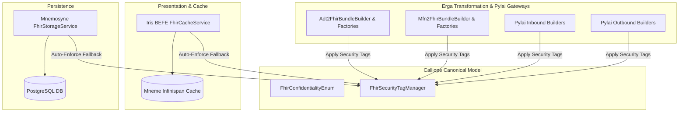

# Requirements

### Overview & Goals
The goal of this feature is to implement standard HL7 FHIR Release 5 security tagging (`meta.security`) across all FHIR resources in the Harmonia 5-tier platform. Security tagging enables downstream systems, access-control policies, audit loggers, and data consumers to classify and restrict clinical and operational data appropriately.

### Scope
- **In Scope**:
  - Centralized model and helper utilities in `calliope` for HL7 v3 Confidentiality codes (`N`, `R`, `V`, `U`, `L`, `M`) and security tag operations.
  - Automatic tagging of all FHIR resources created across `energeia/erga` HL7 v2-to-FHIR transformation pipelines (ADT, MFN, patient workflows).
  - Security tagging of gateway-generated FHIR resources (`Communication`, `Task`, `Provenance`) in `pylai-mllp-in` and `pylai-mllp-base`.
  - Automatic fallback enforcement of security tags in `iris-befe` (`FhirCacheService`) and `hestia/mnemosyne-clinical` (`FhirStorageService`) so no untagged FHIR resource can be cached or persisted.
  - UI visibility for security tags in `iris-clinical` views.
- **Out of Scope**:
  - Complex role-based access control policy engines (PEP/PDP) beyond tagging resources.
  - Non-FHIR operational database entities in `mnemosyne-operations`.

### User Stories
- **As a Compliance / Security Officer**, I want all FHIR resources ingested or generated by Harmonia to carry standard HL7 confidentiality security tags so that clinical data privacy policies can be enforced consistently.
- **As an Integration Developer**, I want centralized utilities to easily attach, inspect, and validate security tags on any FHIR resource or Bundle.
- **As a Clinical UI User**, I want to see the confidentiality classification of FHIR resources in the Iris Clinical interface.

### Functional Requirements
- Every FHIR R5 resource created or transformed within the platform must include at least one `Coding` entry in its `meta.security` list.
- The standard security coding system must be `http://terminology.hl7.org/CodeSystem/v3-Confidentiality`.
- The default confidentiality classification for clinical and administrative resources is `N` (Normal / routine clinical data).
- When a resource already has security tags provided by an upstream client or system, those tags must be preserved and not overwritten.
- If a resource is ingested without security tags, `iris-befe` and `mnemosyne-clinical` must automatically assign the default confidentiality tag.
- Iris Clinical SPA must display security tag badges (e.g. `Confidentiality: Normal`) in resource views.

# Technical Design

### Current Implementation
- Currently, FHIR resource builders in `energeia/erga` (`AdtPatientResourceBuilder`, `AdtMetadataResourceBuilder`, `MfnPractitionerResourceBuilder`, etc.) populate resource fields and sometimes `meta.lastUpdated` / `meta.versionId`, but do not populate `meta.security`.
- In `iris-befe` (`FhirCacheService`) and `mnemosyne-clinical` (`FhirStorageService`), `Resource.getMeta()` is initialized and assigned `versionId` and `lastUpdated`, but `meta.security` is left empty if not provided in the payload.
- In `calliope`, `PragmaFhirConverter` maps `Pragma` instances to FHIR `Task` resources without handling `meta.security`.

### Key Decisions
1. **Strict HL7 v3 Confidentiality**: Use `http://terminology.hl7.org/CodeSystem/v3-Confidentiality` with standard codes (`N`, `R`, `V`, `U`, `L`, `M`) for standard interoperability.
2. **Centralized Auto-Enforcement**: Define core security tag utilities in `calliope` and enforce default security tagging across all generation and persistence entry points (`Erga`, `Pylai`, `BEFE`, and `Mnemosyne JPA`).

### Proposed Changes

#### 1. `calliope`
- **`FhirConfidentialityEnum`**:
  - System: `http://terminology.hl7.org/CodeSystem/v3-Confidentiality`
  - Constants: `N` ("Normal"), `R` ("Restricted"), `V` ("Very Restricted"), `U` ("Unrestricted"), `L` ("Low"), `M` ("Moderate").
  - Methods: `toCoding()`, `fromCode(String code)`.
- **`FhirSecurityTagManager`**:
  - `applyDefaultSecurityTag(Resource resource)`: adds `N` Coding to `meta.security` if no confidentiality coding is present.
  - `applySecurityTag(Resource resource, FhirConfidentialityEnum confidentiality)`: adds specified confidentiality coding.
  - `applySecurityTags(Bundle bundle)`: ensures bundle and all contained resource entries have security tags.
  - `getConfidentiality(Resource resource)`: extracts primary confidentiality coding if present.
- **`PragmaFhirConverter`**:
  - Ensure `task.getMeta().addSecurity(...)` is populated on converted `Task` resources.

#### 2. `energeia/erga`
- Update all factory builders in `net.fhirfactory.harmonia.erga.hl7v2x.factories`:
  - `AdtPatientResourceBuilder` -> `Patient`
  - `AdtEncounterResourceBuilder` -> `Encounter`
  - `AdtAdministrativeResourceBuilder` -> `RelatedPerson`, `Organization`
  - `AdtClinicalResourceBuilder` -> `Condition`, `AllergyIntolerance`, `Observation`, `Coverage`, `Procedure`
  - `AdtMetadataResourceBuilder` -> `Communication`, `Provenance`
  - `Adt2FhirBundleBuilder` -> `Bundle` and all entries
  - `MfnPractitionerResourceBuilder` -> `Practitioner`, `PractitionerRole`
  - `MfnAdministrativeResourceBuilder` -> `Organization`, `Location`, `HealthcareService`
  - `MfnMetadataResourceBuilder` -> `Communication`, `Provenance`
  - `Mfn2FhirBundleBuilder` -> `Bundle` and all entries
- Update workflow activities `PatientDemographicsUpdateErgon` and `PatientIdentityUpdateErgon`.

#### 3. `pylai`
- Update `pylai-mllp-in` builders: `AdtCommunicationResourceBuilder`, `AdtTaskResourceBuilder`, `MfnCommunicationResourceBuilder`, `MfnTaskResourceBuilder`.
- Update `pylai-mllp-base` outbound builders: `OutboundCommunicationResourceBuilder`, `OutboundProvenanceResourceBuilder`, `OutboundTaskResourceBuilder`.

#### 4. `hestia/mnemosyne-clinical` & `iris/iris-befe`
- `FhirStorageService.java`: invoke `FhirSecurityTagManager.applyDefaultSecurityTag(resource)` in `createResource` and `updateResource`.
- `FhirCacheService.java`: invoke `FhirSecurityTagManager.applyDefaultSecurityTag(resource)` in `saveResource`.

#### 5. `iris/iris-clinical`
- Update Vue 3 views (`PersonView.vue`, `PractitionerListView.vue`, `ProvenanceView.vue`, `CommunicationView.vue`, `TaskView.vue`, `OrganizationView.vue`, etc.) to display security label chips/badges.

### Architecture Diagram

### File Structure
- `calliope/src/main/java/net/fhirfactory/harmonia/model/security/FhirConfidentialityEnum.java` (New)
- `calliope/src/main/java/net/fhirfactory/harmonia/model/security/FhirSecurityTagManager.java` (New)
- `calliope/src/main/java/net/fhirfactory/harmonia/model/pragma/PragmaFhirConverter.java` (Modified)
- `energeia/erga/src/main/java/net/fhirfactory/harmonia/erga/hl7v2x/factories/*.java` (Modified)
- `pylai/pylai-mllp-in/src/main/java/net/fhirfactory/harmonia/mllpgateway/hl7/factories/*.java` (Modified)
- `pylai/pylai-mllp-base/src/main/java/net/fhirfactory/harmonia/mllpgateway/service/*.java` (Modified)
- `iris/iris-befe/src/main/java/net/fhirfactory/harmonia/befe/service/FhirCacheService.java` (Modified)
- `hestia/mnemosyne-clinical/src/main/java/net/fhirfactory/harmonia/hapifhir/service/FhirStorageService.java` (Modified)
- `iris/iris-clinical/src/views/*.vue` (Modified)

# Testing

### Validation Approach
Verification will be executed using automated unit and integration tests across all modified modules:
- Unit tests for the new `FhirConfidentialityEnum` and `FhirSecurityTagManager` in `calliope`.
- Unit and integration tests for ADT and MFN transformation bundles verifying that every resource in the bundle has `meta.security` populated.
- Gateway tests in `pylai` verifying `Communication`, `Task`, and `Provenance` security tags.
- Service tests in `iris-befe` and `mnemosyne-clinical` asserting auto-enforcement when creating resources with and without pre-existing security tags.

### Key Scenarios
1. **Default Security Tagging on New Resource**: Creating any resource without a `meta.security` tag results in `meta.security` containing system `http://terminology.hl7.org/CodeSystem/v3-Confidentiality` and code `N`.
2. **Preservation of Explicit Security Tags**: Creating or updating a resource with an explicit confidentiality tag (e.g., `R` for Restricted) preserves the tag and does not overwrite it with `N`.
3. **HL7 Transformation Bundling**: Deriving FHIR resources from HL7 v2 messages (ADT A01, A08, MFN M02, etc.) attaches security tags to all generated resources (`Patient`, `Encounter`, `Condition`, `Bundle`, etc.).
4. **End-to-End Cache & Persistence**: Resources written through BEFE and flushed to Mnemosyne JPA retain security tags in the JSON payload and database.

### Test Changes
- Add `FhirSecurityTagManagerTest` and `FhirConfidentialityEnumTest` in `calliope`.
- Update `AdtModularBuildersTest`, `MfnModularBuildersTest`, `Adt2FhirMapperTest`, and `Mfn2FhirBundleTest` in `energeia/erga`.
- Update `CommunicationServiceTest`, `TaskServiceTest`, and `ProvenanceServiceTest` in `pylai-mllp-base`.
- Update `FhirStorageServiceTest` in `mnemosyne-clinical` and `FhirCacheServiceTest` in `iris-befe`.

# Delivery Steps

### ✓ Step 1: Implement Centralized FHIR Security Tagging Model in Calliope
The Calliope module provides standard HL7 v3 Confidentiality models, enumerations, and centralized security tag management utilities.

- Create `FhirConfidentialityEnum` in `net.fhirfactory.harmonia.model.security` implementing standard HL7 v3 Confidentiality codes (`N` - Normal, `R` - Restricted, `V` - Very Restricted, `U` - Unrestricted, `L` - Low, `M` - Moderate) with `system="http://terminology.hl7.org/CodeSystem/v3-Confidentiality"`.
- Create `FhirSecurityTagManager` in `net.fhirfactory.harmonia.model.security` providing utility methods to apply, validate, retrieve, and ensure default confidentiality security tags on any FHIR R5 `Resource` and `Bundle`.
- Update `PragmaFhirConverter` to propagate and validate security tags between canonical `Pragma` task representations and FHIR `Task` resources (`task.getMeta().getSecurity()`).
- Add comprehensive unit tests in `calliope` verifying `FhirConfidentialityEnum`, `FhirSecurityTagManager`, and `PragmaFhirConverter` security tag behavior.

### ✓ Step 2: Integrate Security Tagging into Erga Transformation Builders
All derived FHIR R5 resources and Bundles created by Erga transformation mappers contain valid HL7 v3 Confidentiality security tags.

- Update `AdtPatientResourceBuilder`, `AdtEncounterResourceBuilder`, `AdtAdministrativeResourceBuilder`, `AdtClinicalResourceBuilder`, and `AdtMetadataResourceBuilder` to apply standard confidentiality security tags (`N` - Normal) to all generated FHIR resources (`Patient`, `Encounter`, `RelatedPerson`, `Organization`, `Condition`, `AllergyIntolerance`, `Communication`, `Provenance`, etc.).
- Update `Adt2FhirBundleBuilder` to ensure the parent FHIR `Bundle` and all constituent bundle entries have security tags attached.
- Update `MfnPractitionerResourceBuilder`, `MfnAdministrativeResourceBuilder`, `MfnMetadataResourceBuilder`, and `Mfn2FhirBundleBuilder` to attach security tags to all practitioner, location, organization, healthcare service, and metadata resources.
- Update `PatientDemographicsUpdateErgon` and `PatientIdentityUpdateErgon` workflow activities to ensure updated FHIR resources maintain security tags.
- Update unit tests in `energeia/erga` (`AdtModularBuildersTest`, `MfnModularBuildersTest`, `Adt2FhirMapperTest`, `Mfn2FhirBundleTest`) to verify security label presence on all generated resources.

### ✓ Step 3: Integrate Security Tagging into Pylai Gateway Services
All synthetic FHIR resources created by Pylai MLLP gateways contain security tagging.

- Update `pylai-mllp-in` resource builders (`AdtCommunicationResourceBuilder`, `AdtTaskResourceBuilder`, `MfnCommunicationResourceBuilder`, `MfnTaskResourceBuilder`) to apply standard confidentiality security tags on initial `Communication` and `Task` resources.
- Update `pylai-mllp-base` outbound builders (`OutboundCommunicationResourceBuilder`, `OutboundProvenanceResourceBuilder`, `OutboundTaskResourceBuilder`) to apply standard confidentiality tags.
- Update unit tests in `pylai-mllp-in` and `pylai-mllp-base` to assert `meta.security` tags on gateway-generated FHIR resources.

### ✓ Step 4: Enforce Security Tagging in Iris BEFE and Mnemosyne JPA Persistence
Iris BEFE and Mnemosyne JPA persistence automatically ensure and enforce confidentiality security tags on all stored FHIR resources.

- Update `FhirCacheService` in `iris-befe` to ensure incoming FHIR resources saved to the Mneme cache have a default `N` (Normal) confidentiality tag if no security tag was provided.
- Update `FhirStorageService` in `hestia/mnemosyne-clinical` to ensure all FHIR resources persisted to PostgreSQL relational storage receive default security tagging on create/update if absent.
- Add unit tests in `iris-befe` and `mnemosyne-clinical` verifying auto-tagging behavior on resource creation and updates.

### ✓ Step 5: Display Security Tagging in Iris Clinical UI
The Iris Clinical user interface visualizes security tags and confidentiality classifications on FHIR resources.

- Update FHIR resource detail views and components in `iris-clinical` (such as `PersonView.vue`, `PractitionerListView.vue`, `ProvenanceView.vue`, `CommunicationView.vue`, `TaskView.vue`, and `OrganizationView.vue`) to render security tag badges from `meta.security`.
- Add confidentiality badge styling to visually indicate security levels (`Normal`, `Restricted`, `Very Restricted`).