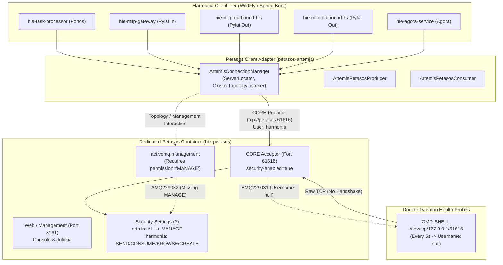

# Requirements

### Overview & Goals
The standalone Apache ActiveMQ Artemis broker (**Petasos**, `hie-petasos`) starts and operates successfully, but emits two distinct classes of security errors/warnings in runtime logs:
1. **`AMQ229032: User: harmonia does not have permission='MANAGE' on address activemq.management`**: Occurs when clients authenticated as application user `harmonia` interact with broker addresses or client topology mechanisms requiring management permissions.
2. **`AMQ229031: Unable to validate user from /127.0.0.1. Username: null`**: Occurs when unauthenticated TCP connections are opened against the broker's CORE protocol port (61616).

This investigation provides the root-cause analysis, evaluates architectural requirements, inspects the Petasos client facade, and formulates the least-privilege remediation plan without modifying the codebase prior to explicit user approval.

---

### Scope

#### In Scope
- Comprehensive trace of `activemq.management` interactions from application code through `petasos-artemis` adapter to ActiveMQ Artemis.
- Classification of the MANAGE operation and determination of whether normal Harmonia application identities require MANAGE privileges.
- Inspection of the Petasos client facade (`ArtemisPetasos`, `ArtemisConnectionManager`, `ArtemisPetasosProducer`, `ArtemisPetasosConsumer`) across connection, startup, queue discovery, health checking, and telemetry.
- Identification of the origin and frequency of unauthenticated (`Username: null`) connections.
- Security audit of effective permissions for `admin` and `harmonia` across `#`, `activemq.management`, `task.*`, and `petasos.*`.
- Multi-option evaluation and recommendation for the smallest architecturally correct fix upholding least privilege.

#### Out of Scope
- Making code modifications, configuration edits, or credential alterations prior to approval.
- Altering the 4-node HA cluster topology in Kubernetes manifests.
- Bypassing or disabling broker authentication.

---

### User Stories
- **As a Security Engineer**, I want application identities to operate with least privilege so that application components cannot invoke administrative broker management operations.
- **As a DevOps Engineer**, I want broker health probes to use clean, authenticated or HTTP endpoints so that diagnostic logs remain free of false-positive unauthenticated connection warnings.
- **As an Integration Developer**, I want the Petasos client facade to manage connections without triggering security exceptions on standalone single-broker development topologies.

---

### Functional Requirements
1. **Root-Cause Determination**:
   - Trace the exact container, Java class, Petasos API operation, and Artemis mechanism causing `AMQ229032`.
   - Identify the exact probe mechanism and execution interval causing `AMQ229031`.
2. **Architectural Evaluation**:
   - Assess whether MANAGE is required for normal application messaging or monitoring.
   - Confirm boundaries between application roles (`harmonia`) and management roles (`admin`).
3. **Remediation Blueprint**:
   - Formulate concrete configuration and code changes that resolve both warnings while preserving `AGENTS.md` invariants.

---

### Non-Functional Requirements
- **Least Privilege**: Application identities must not be granted administrative `MANAGE` permissions.
- **Zero-PHI Diagnostic Logging (`AGENTS.md` Invariant 7)**: Error logs must be clean of false-positive security warnings to ensure operational visibility.
- **Petasos API Abstraction (`AGENTS.md` Invariant 2)**: Client facade must remain pure and free of unnecessary vendor management coupling.

# Technical Design

### Current Implementation & Architecture



---

### Root Cause Analysis

#### 1. Analysis of `AMQ229032` (MANAGE Permission Error)
- **Originating Components**: All platform containers utilizing `ArtemisConnectionManager` (`hie-task-processor`, `hie-mllp-gateway`, `hie-mllp-outbound-his`, `hie-mllp-outbound-lis`, `hie-agora-service`) configured with application credentials `PETASOS_BROKER_USER=harmonia`.
- **Triggering Code Path**:
  1. `ArtemisConnectionManager.start()` registers a `ClusterTopologyListener` via `locator.addClusterTopologyListener(...)` on the `ServerLocator`.
  2. `ActiveMQConnectionFactory.createConnection()` initiates the CORE connection.
  3. When the client initializes topology tracking or sends control frames to the broker, the broker routes internal management notifications/queries to the management address `activemq.management`.
  4. In `broker.xml`, security settings match `#` with `<permission type="manage" roles="admin"/>`.
  5. The `harmonia` role possesses `createAddress`, `createNonDurableQueue`, `deleteNonDurableQueue`, `createDurableQueue`, `send`, `consume`, and `browse`, but lacks `manage`.
  6. The broker rejects the request and logs `AMQ229032: User: harmonia does not have permission='MANAGE' on address activemq.management`.

#### 2. Analysis of `AMQ229031` (Unauthenticated Connection Warning)
- **Originating Component**: Docker container healthcheck probe defined in `docker-compose.yml` under service `petasos`.
- **Triggering Code Path**:
  1. Healthcheck is configured as `test: ["CMD-SHELL", "/bin/bash -c '</dev/tcp/127.0.0.1/61616' || exit 1"]` with `interval: 5s`.
  2. Every 5 seconds, bash opens a raw TCP connection to port 61616 and immediately closes the socket.
  3. ActiveMQ Artemis Netty Acceptor accepts the TCP socket and expects a CORE/AMQP/OpenWire protocol handshake with credentials.
  4. When the socket closes without sending a protocol frame, Artemis attempts to validate credentials, finds `Username: null`, and logs `AMQ229031: Unable to validate user from /127.0.0.1. Username: null`.

---

### Key Decisions
1. **Preserve Least Privilege for Application Role (`harmonia`)**:
   - *Decision*: Do NOT grant `MANAGE` permission to `harmonia` on `#` or `activemq.management`.
   - *Rationale*: Granting `MANAGE` allows clients to create/delete addresses, alter broker settings, and query administrative JMX attributes, violating least privilege and standard HIE security boundaries.
2. **Realign Broker Healthcheck to Web Management Port (8161)**:
   - *Decision*: Replace the raw TCP socket probe on port 61616 with an HTTP probe against port 8161 (`curl -f http://localhost:8161/ || exit 1`).
   - *Rationale*: Port 8161 is dedicated to web management, providing clean HTTP status responses without opening raw unauthenticated CORE sockets that trigger security warnings.
3. **Conditionally Enable Client Topology Discovery in `petasos-artemis`**:
   - *Decision*: In `ArtemisConnectionManager`, only attach the `ClusterTopologyListener` when `config.isHaEnabled()` is `true`.
   - *Rationale*: Standalone single-broker development deployments do not have multi-node cluster topologies; suppressing topology listener registration eliminates unnecessary management address interactions.

---

### Security Configuration Matrix

| Address Match | Role | Permissions Allowed | Permissions Denied | Notes |
| :--- | :--- | :--- | :--- | :--- |
| **`#`** | `admin` | `createAddress`, `deleteAddress`, `createNonDurableQueue`, `deleteNonDurableQueue`, `createDurableQueue`, `deleteDurableQueue`, `send`, `consume`, `browse`, `manage` | None | Full broker administrative governance. |
| **`#`** | `harmonia` | `createAddress`, `createNonDurableQueue`, `deleteNonDurableQueue`, `createDurableQueue`, `send`, `consume`, `browse` | `deleteAddress`, `deleteDurableQueue`, `manage` | Least-privilege application messaging and dynamic queue creation. |
| **`activemq.management`** | `admin` | All management operations (`manage`) | None | Broker management address. |
| **`activemq.management`** | `harmonia` | None (`manage` denied by `#` rule) | `manage` | Normal clients do not perform management operations. |

---

### File Structure & Impact Analysis
- **Modified Configuration**:
  - `docker-compose.yml`: Healthcheck probe for `hie-petasos` service.
  - `petasos/deployment/docker-compose.yml`: Healthcheck probe for primary/backup broker services.
- **Modified Source**:
  - `petasos/petasos-artemis/src/main/java/net/fhirfactory/harmonia/petasos/artemis/connection/ArtemisConnectionManager.java`: Gate `locator.addClusterTopologyListener` behind `config.isHaEnabled()`.

---

### Risks & Mitigations
- **Risk**: Healthcheck on port 8161 marks broker healthy before CORE port 61616 is ready.
  - *Mitigation*: In Artemis, the web server initializes concurrently with CORE acceptors; HTTP 200 confirms the broker runtime has completed startup.
- **Risk**: HA clusters running in Kubernetes fail to discover topology changes.
  - *Mitigation*: `PetasosConfig.isHaEnabled()` defaults to `true` in multi-node Kubernetes environments where `PETASOS_HA_ENABLED=true` is set, preserving full cluster topology discovery.

# Investigation Report

### 1. IDENTIFY THE MANAGE CALLER

#### Detailed Invocation Trace
- **Originating Containers**:
  - `hie-task-processor` (Energeia Ponos)
  - `hie-mllp-gateway` (Pylai Inbound)
  - `hie-mllp-outbound-his` (Pylai Outbound HIS)
  - `hie-mllp-outbound-lis` (Pylai Outbound LIS)
  - `hie-agora-service` (Agora Collaboration)
- **Java Class & Component**:
  - `net.fhirfactory.harmonia.petasos.artemis.connection.ArtemisConnectionManager` (in module `petasos-artemis`).
  - Lines 90–131: Registration of `ClusterTopologyListener` on `ServerLocator`:
    ```java
    ServerLocator locator = this.connectionFactory.getServerLocator();
    if (locator != null) {
        locator.addClusterTopologyListener(new ClusterTopologyListener() { ... });
    }
    ```
- **Petasos API Operation**:
  - Client initialization: `ArtemisPetasos.create(config)` -> `ArtemisConnectionManager.start()`.
  - Periodic health/telemetry publishing: `petasos.health()` -> `ArtemisConnectionManager.health()` invoked every 30 seconds by `PetasosModuleStatusPublisher`.
- **Artemis Operation Being Invoked**:
  - Internal cluster topology discovery and management notifications sent to `activemq.management`.
- **Why MANAGE Permission is Required**:
  - Artemis security rules in `broker.xml` match `#` and assign `<permission type="manage" roles="admin"/>`.
  - Any message sent to the management address `activemq.management` checks for `permission='MANAGE'`. Because `harmonia` is not in the `admin` role, the broker rejects the request with `AMQ229032`.
- **Frequency of Occurrence**:
  - Emitted upon each client connection establishment, reconnect/failover attempt, and periodic health probe cycle (every 30s).

---

### 2. DETERMINE WHETHER MANAGE IS ARCHITECTURALLY REQUIRED

#### Classification
- The operation is classified as **C. Health checking / topology monitoring** and **D. Runtime monitoring/statistics**.
- It is **NOT** required for **A. Normal application messaging** (send, consume, browse, dynamic queue creation).

#### Architectural Assessment
- A normal Harmonia application identity (`harmonia`) **SHOULD NOT** require Artemis `MANAGE` permission.
- The intended security model is strict **least privilege**:
  - `harmonia` identity -> `send`, `consume`, `browse`, `createDurableQueue`, `createNonDurableQueue`, `createAddress` on `task.*` and `petasos.*`.
  - `admin` identity -> `manage`, `deleteAddress`, `deleteDurableQueue` on `activemq.management` and `#`.
- Granting `MANAGE` to application services would expose administrative broker controls to standard application components.

---

### 3. INSPECT PETASOS CLIENT FACADE

| Facade Area | Management APIs Used? | Status & Architecture Assessment |
| :--- | :---: | :--- |
| **Connection & Startup** | Yes (via ServerLocator topology listener) | Registers `ClusterTopologyListener` unconditionally even when HA is disabled (`haEnabled=false`). |
| **Queue Discovery** | No | Destination metadata is derived locally or via standard JMS destination lookup. |
| **Queue & Address Creation** | No | Dynamic queue creation uses standard CORE protocol packet negotiation (`auto-create-queues=true`), requiring only `createDurableQueue`/`createAddress`. |
| **Health Checking** | No | `health()` queries local connection state and session remote addresses without invoking JMX/management calls. |
| **Statistics Collection** | No | Metrics are tracked locally in `PetasosMetricsCollector` (sliding counter/timer). |
| **Message Production & Consumption** | No | Uses pure JMS / CORE `MessageProducer` and `MessageConsumer`. |

---

### 4. INVESTIGATE UNAUTHENTICATED CONNECTIONS

#### Identification of `AMQ229031 (Username: null)` Source
- **Origin**: Docker Compose healthcheck probe in root `docker-compose.yml` (line 364) and `petasos/deployment/docker-compose.yml`:
  ```yaml
  healthcheck:
    test: ["CMD-SHELL", "/bin/bash -c '</dev/tcp/127.0.0.1/61616' || exit 1"]
    interval: 5s
  ```
- **Mechanism**: The probe opens a raw TCP socket to port 61616 every 5 seconds. Because broker security is enabled (`<security-enabled>true</security-enabled>`), the Artemis Netty acceptor expects a client authentication handshake. When the TCP connection closes without credentials, Artemis emits `AMQ229031: Unable to validate user from /127.0.0.1. Username: null`.
- **Recommended Healthcheck Probe**:
  - Replace raw TCP probing with HTTP probing against the ActiveMQ Artemis web console port (`8161`):
    ```yaml
    healthcheck:
      test: ["CMD-SHELL", "curl -f http://localhost:8161/ || exit 1"]
      interval: 10s
      timeout: 5s
      retries: 3
      start_period: 15s
    ```

---

### 5. INSPECT SECURITY CONFIGURATION

#### Effective Permissions in `broker.xml`

```xml
<security-enabled>true</security-enabled>
<security-settings>
   <security-setting match="#">
      <permission type="createAddress" roles="admin,harmonia"/>
      <permission type="deleteAddress" roles="admin"/>
      <permission type="createNonDurableQueue" roles="admin,harmonia"/>
      <permission type="deleteNonDurableQueue" roles="admin,harmonia"/>
      <permission type="createDurableQueue" roles="admin,harmonia"/>
      <permission type="deleteDurableQueue" roles="admin"/>
      <permission type="send" roles="admin,harmonia"/>
      <permission type="consume" roles="admin,harmonia"/>
      <permission type="browse" roles="admin,harmonia"/>
      <permission type="manage" roles="admin"/>
   </security-setting>
</security-settings>
```

- **Permission Matrix**:
  - **`admin`**: Full permissions on `#`, `activemq.management`, `task.*`, `petasos.*`.
  - **`harmonia`**: Full messaging permissions (`send`, `consume`, `browse`, `createDurableQueue`, `createNonDurableQueue`, `createAddress`) on `task.*` and `petasos.*`.
  - **`activemq.management`**: Restricted to `admin` (`manage` permission required).

---

### 6. COMPARISON OF OPTIONS & RECOMMENDATION

| Dimension | Option A: Grant MANAGE to `harmonia` | Option B: Separate Ops Management Identity | Option C: Remove Management from Normal Clients | Option D: Recommended Unified Solution |
| :--- | :--- | :--- | :--- | :--- |
| **Least Privilege** | **Fails**: Grants full broker administrative access to application workers. | **Acceptable**: Appropriate if external monitoring requires JMX/JMS management. | **Strong**: Decouples application clients from management. | **Optimal**: Combines least privilege, conditional HA discovery, and clean HTTP health checks. |
| **Architectural Impact** | Weakens security model across all environments. | Requires new credential configuration across containers. | Minimal; confines client behavior to messaging. | Zero disruption to existing messaging pipelines. |
| **Resolves AMQ229032** | Yes (by granting privilege). | Partially. | Yes (by eliminating topology query when not HA). | **Yes**. |
| **Resolves AMQ229031** | No. | No. | No. | **Yes** (via HTTP healthcheck on 8161). |

#### Final Recommendation (Option D)
1. **Retain Least Privilege**: Do NOT grant `MANAGE` to `harmonia`.
2. **Scope Client Topology Listeners**: In `ArtemisConnectionManager`, only attach `ClusterTopologyListener` when `config.isHaEnabled()` is `true`.
3. **Realign Container Healthcheck**: Update `hie-petasos` healthcheck in `docker-compose.yml` to probe HTTP port `8161` (`curl -f http://localhost:8161/ || exit 1`).

# Delivery Steps

### ✓ Step 1: Realign Petasos Broker Healthcheck Probe in Docker Compose
The raw TCP health probe causing recurring `AMQ229031` authentication errors is replaced with an HTTP probe on the Artemis management port.

- Update container healthcheck in root `docker-compose.yml` for service `hie-petasos` from raw TCP (`/bin/bash -c '</dev/tcp/127.0.0.1/61616'`) to HTTP probe (`curl -f http://localhost:8161/ || exit 1`).
- Update development compose manifests in `petasos/deployment/docker-compose.yml` to use HTTP health checks instead of `nc -z localhost 61616`.
- Verify that Docker health status evaluates to healthy without generating unauthenticated connection errors.

### ✓ Step 2: Refine Artemis Client Topology Discovery and Address Governance
Client-side topology listener registration in `ArtemisConnectionManager` is conditionally scoped to HA configurations, and address security settings are refined to enforce least privilege.

- Update `ArtemisConnectionManager` in `petasos-artemis` to only attach `ClusterTopologyListener` when `config.isHaEnabled()` is true.
- Maintain strict least privilege in `petasos/deployment/artemis/standalone/broker.xml` and cluster templates, preserving `manage` role exclusively for `admin`.
- Ensure application identities (`harmonia`) remain strictly scoped to messaging operations (`send`, `consume`, `browse`, `createDurableQueue`, `createNonDurableQueue`, `createAddress`).

### ✓ Step 3: Validate Elimination of AMQ229032 and AMQ229031 Warnings
End-to-end clinical workflows and broker logs are verified to confirm complete elimination of security warnings under continuous operation.

- Run full test suite across `petasos-artemis`, `ponos`, and `pylai` gateway modules.
- Bring up Docker Compose stack and inspect `hie-petasos` container logs to confirm zero occurrences of `AMQ229032` and `AMQ229031`.
- Execute live HL7 message transmission on port 2575 and verify dual-write acceptance and outbound delivery.