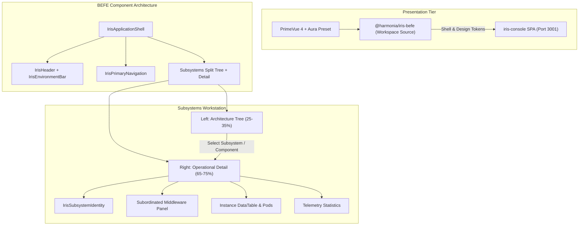

# Requirements

### Overview & Goals
The objective of this task is to recover and establish the authoritative **Iris Design System** foundation across the Harmonia presentation tier (`iris-befe` and `iris-console`), and implement the approved **Subsystems Split Tree + Detail** interaction design for **Checkpoint 2 Visual Review**.

Recent visual testing revealed that while Iris CSS design tokens were loaded at runtime, the application rendered as an unstyled, light HTML diagnostic page with raw hyperlinks, native form controls, run-together architectural labels, and stacked full-width panels. This plan diagnoses and resolves the root causes, elevates `iris-befe` as the shared design system foundation, and implements the compliant Subsystems workstation.

### Scope

#### In Scope
- **Root Cause Resolution**: Eliminate reliance on missing CSS utility frameworks and conflicting dark-mode styles; wire PrimeVue 4 styled mode with Aura preset and semantic Iris design tokens.
- **`iris-befe` Presentation Foundation**: Refine and standardize shared presentation components (`IrisApplicationShell`, `IrisHeader`, `IrisPrimaryNavigation`, `IrisEnvironmentBar`, `IrisBreadcrumbs`, `IrisPage`, `IrisPageHeader`, `IrisToolbar`, `IrisStatus`, `IrisSubsystemIdentity`, `IrisHierarchy`, `IrisDataTable`, `IrisSection`, `IrisLoadingState`, `IrisEmptyState`, `IrisErrorState`).
- **Application Shell**: Implement the compact, high-density Harmonia application shell featuring product identity, environment/cluster context, overall health status, and application-styled primary navigation.
- **Subsystems Split Tree + Detail Workstation**: Implement the approved 2-column workstation (25-35% Left Architecture Tree, 65-75% Right Inspection Workstation) with Greek+English hierarchy and progressive drill-down into subordinated middleware (Petasos -> ActiveMQ Artemis, Mneme -> Infinispan, Mnemosyne -> PostgreSQL, Agora -> Synapse).
- **Runtime Verification & Checkpoint 2 Delivery**: Verify in actual running application via Docker Compose, check console errors, document any `IRIS-API-GAP-<n>` items, and produce Checkpoint 2 visual review artifacts.

#### Out of Scope
- Redesigning other `iris-console` views (`Overview`, `Interfaces`, `Messages`, `Work`, `Events`, `Alerts`, `Health`) prior to explicit Checkpoint 2 approval.
- Modifying backend WildFly BEFE Java APIs or domain logic.
- Adding dependencies violating architectural invariants (e.g. JPA or Paradeigma imports).

### User Stories
- **US-1**: As a Harmonia Operations Engineer, I want a clear, professional application shell so that I can immediately identify the cluster environment (`PROD / microk8s-01`), system health status, and navigate between perspectives without confusing browser-default hyperlinks.
- **US-2**: As an Operator, I want a 2-column Split Tree + Detail view of Harmonia architecture so that I can explore architectural areas (Integration, Execution, Information, Security, Collaboration, Presentation) on the left while inspecting detailed telemetry, instances, and middleware on the right without scrolling past giant trees.
- **US-3**: As an Operator, I want Greek subsystem names paired with plain English descriptions (e.g., *Petasos — Messaging & Transport*, *Energeia — Execution & Processing*) so that I can quickly correlate platform capabilities with operational components.
- **US-4**: As a System Administrator, I want to drill down from a subsystem into its subordinated middleware (e.g., Petasos -> ActiveMQ Artemis broker cluster and queues) to inspect broker instances and queue depths.

### Functional Requirements
- **FR-1 Shell & Masthead**: Header must display `HARMONIA Operations Console`, overall status badge (`HEALTHY` / `DEGRADED`), environment bar (`PROD / microk8s-01 / harmonia-cluster-01`, `Updated HH:MM`), and user session indicator.
- **FR-2 Primary Navigation**: Navigation items (`Overview`, `Subsystems`, `Interfaces`, `Work`, `Messages`, `Events`, `Alerts`, `Health`) must render as styled application tabs with active indicator states and badge counters.
- **FR-3 Architecture Tree (Left Pane)**: Must occupy 25-35% width, grouped by 6 core architectural areas, displaying subsystem nodes with health badges, instance counts, and English descriptions. Counts must be separated into badges to prevent run-together text.
- **FR-4 Subsystem Detail Workstation (Right Pane)**: Must occupy 65-75% width, featuring Subsystem Identity header, action toolbar (time window, refresh), perspective tab switcher (Runtime Instances, Health & Dependencies, Telemetry Statistics, All), Subordinated Middleware panel, and instance table with pod/node metrics.
- **FR-5 Progressive Drill-down**: Selecting child nodes or components (e.g., Ponos, Ergon, Praxis, Pragma under Energeia) updates the detail pane with targeted telemetry and workflow execution state.

### Non-Functional Requirements
- **Theme & Contrast**: Light page background (`#f8fafc`), white surfaces (`#ffffff`), dark high-contrast typography (`#0f172a`), restrained Harmonia sky accent (`#0284c7`), meeting WCAG 2.1 AA contrast requirements.
- **Information Density**: High-density tables and compact controls tailored for enterprise operations console workflows without decorative whitespace.
- **Decoupling**: Strictly adhere to Invariant 3 (Iris presentation decoupling) and Invariant 7 (Zero-PHI diagnostic logging).

# Technical Design

### Current Implementation & Root Cause Analysis

Thorough investigation of `iris-console` and `iris-befe` revealed why the running application resembled an unstyled HTML diagnostic page:

1. **Missing Tailwind / Utility Framework**: `iris-console` components (`NavigationTopBar.vue`, `GlobalOperationsHeader.vue`, `SubsystemTreeNavigator.vue`, `InstanceTable.vue`, `SubsystemsView.vue`) were authored using Tailwind CSS utility class names (`flex-row`, `w-80`, `border-b`, `bg-white`, `text-slate-700`, `gap-2`), but **Tailwind CSS is neither installed nor configured in Vite or PostCSS**. As a result, none of these utility rules existed in the browser stylesheet.
2. **Fallback to Browser-Default Native Elements**: Without utility classes or scoped CSS, `<router-link>` rendered as standard blue/purple underlined HTML `<a>` tags, `<button>` rendered as native beveled buttons, and `<table>` collapsed without spacing.
3. **Run-together Text from Unstyled Inline Elements**: In `SubsystemTreeNavigator.vue` and `GlobalOperationsHeader.vue`, area names and counts were rendered in unstyled adjacent `<span>` tags without flexbox spacing, collapsing into strings like `Integration & Transport2` and `9Subsystems(6 Degraded)`.
4. **Stacked Layout Instead of Split-Tree**: `SubsystemsView.vue` relied on `md:flex-row` and `md:w-80` to establish the 2-column desktop split. Because those classes did not exist, the layout fell back to default block display (100% width vertical stack), forcing the detail view below the tree.
5. **Bypassing `iris-befe` in `App.vue`**: `App.vue` replaced the standard slots of `IrisApplicationShell` with `GlobalOperationsHeader` and `NavigationTopBar`, completely bypassing `IrisHeader` and `IrisPrimaryNavigation`.
6. **Conflicting Legacy `style.css`**: `iris-console/src/style.css` contained legacy dark-mode styles (`--bg-main: #0b0f19`, `body { color: #fff }`) conflicting with the light-mode tokens in `tokens.css`.

---

### Key Decisions

1. **Dedicated Iris CSS in `iris-befe` + PrimeVue 4 Aura**:
   - Rather than adding heavy external CSS utility libraries, all Iris components will have encapsulated, robust CSS scoped/module styles and custom properties tied to `--iris-*` and PrimeVue semantic tokens.
2. **Workspace Source Package Architecture**:
   - `iris-console` consumes `@harmonia/iris-befe` directly via Vite path aliases, maintaining strict unidirectional dependency: `iris-console -> iris-befe`.
3. **Composite Application Shell**:
   - `IrisApplicationShell` provides structured slots for Masthead, Header, Environment Bar, Primary Navigation, and Content Body, ensuring visual coherence across all Harmonia SPAs (`iris-console`, `iris-clinical`, `iris-administration`).
4. **Subsystems Split Tree + Detail Layout**:
   - Use CSS Flexbox/Grid with desktop constraints (Left pane: `280px-340px` / ~28%, Right pane: `flex: 1` / ~72%) and independent vertical scrolling to guarantee high-density productivity.

---

### Architecture Diagram



---

### File Structure & Changes

```
iris/
├── iris-befe/frontend/src/
│   ├── theme/
│   │   ├── tokens.css               [Refined light mode variables, focus rings, compact tables]
│   │   ├── irisPreset.ts            [PrimeVue Aura theme extension]
│   │   └── index.ts                 [Plugin exporter]
│   ├── components/
│   │   ├── shell/
│   │   │   ├── IrisApplicationShell.vue  [Structured shell container with env & nav slots]
│   │   │   ├── IrisHeader.vue            [Product identity, health badge, user menu]
│   │   │   ├── IrisEnvironmentBar.vue    [Cluster/env metadata & refresh timestamp]
│   │   │   ├── IrisPrimaryNavigation.vue [Styled navigation tabs with badge counts]
│   │   │   ├── IrisBreadcrumbs.vue       [Navigation trail]
│   │   │   ├── IrisPage.vue              [Page container]
│   │   │   ├── IrisPageHeader.vue        [Page title & action bar]
│   │   │   └── IrisToolbar.vue           [Search, time-window, action buttons]
│   │   ├── presentation/
│   │   │   ├── IrisStatus.vue            [Status badge: HEALTHY, DEGRADED, UNAVAILABLE, UNKNOWN]
│   │   │   ├── IrisSubsystemIdentity.vue [Greek title, English description, version, state]
│   │   │   ├── IrisHierarchy.vue         [Architecture tree navigator primitive]
│   │   │   ├── IrisDataTable.vue         [High-density table wrapper]
│   │   │   ├── IrisSection.vue           [Collapsible card/section container]
│   │   │   ├── IrisLoadingState.vue      [Spinner & loading skeleton]
│   │   │   ├── IrisEmptyState.vue        [Empty state placeholder]
│   │   │   └── IrisErrorState.vue        [Error alert banner]
│   └── index.ts                     [Export barrel]
└── iris-console/src/
    ├── App.vue                      [Wired to IrisApplicationShell & IrisPrimaryNavigation]
    ├── style.css                    [Reset & global baseline typography; dark styles removed]
    ├── models/
    │   └── subsystemHierarchy.ts    [Harmonia architectural areas & authoritative subsystems]
    ├── components/
    │   └── subsystems/
    │       ├── SubsystemTreeNavigator.vue   [Left architecture tree with clean badges & spacing]
    │       ├── SubsystemHeader.vue          [Subsystem identity with English titles]
    │       ├── SubordinatedMiddlewarePanel.vue [Middleware cards: Artemis, Infinispan, PG, Synapse]
    │       ├── InstanceTable.vue            [Runtime instances table with Pod telemetry]
    │       ├── HealthDependenciesPanel.vue  [Dependency status list]
    │       └── StatisticsPanel.vue          [Throughput, memory, queue depth metrics]
    └── views/
        └── SubsystemsView.vue       [Split Tree + Detail layout container]
```

---

### Data Models & Contracts

```typescript
export interface SubordinatedMiddleware {
  name: string;
  technology: string;
  ports: string;
  role: string;
  nodes?: string[];
  metrics?: { label: string; value: string }[];
  description: string;
}

export interface AuthoritativeSubsystem {
  id: string;
  name: string;
  englishTitle: string;
  description: string;
  areaId: string;
  areaName: string;
  children?: { id: string; name: string; englishTitle: string; description: string }[];
  middleware?: SubordinatedMiddleware;
}
```

---

### Risks & Mitigations

- **Risk**: Style collisions between PrimeVue base styles and custom CSS.
  - *Mitigation*: Use PrimeVue 4 styled mode with Aura preset and explicit `--iris-*` CSS variables scoped inside Iris component classes.
- **Risk**: Loss of live telemetry during presentation refactoring.
  - *Mitigation*: Retain Pinia `operationsStore` API integrations (`/api/operations/...`) and ensure reactive bindings to instance and subsystem models are preserved.
- **Risk**: Layout overflow on smaller desktop displays.
  - *Mitigation*: Implement fixed left-pane width (`280px-320px`) with scrollable viewport and `min-width: 0` on the right detail pane.

# Testing

### Validation Approach
Verification will be conducted through automated component/unit tests in Vitest across both `iris-befe` and `iris-console`, followed by full containerized runtime execution via Docker Compose to visually verify theme styling, layout metrics, and browser console output.

### Key Scenarios

1. **Application Shell & Navigation**:
   - Verify header renders `HARMONIA Operations Console` and `PROD / microk8s-01 / harmonia-cluster-01`.
   - Verify primary navigation items render as styled tab pills with active highlight on `/subsystems`.
   - Verify navigation links do not have default browser underlines or native styling.

2. **Subsystems Initial View (Split Tree + Detail)**:
   - Verify left pane displays 6 architectural areas (Integration, Execution, Information, Security, Collaboration, Presentation) occupying ~28% desktop width.
   - Verify area counts and labels are separated by badge elements (`Integration & Transport` and `[2]`).
   - Verify initial selection defaults to the first active subsystem or selected route query.

3. **Petasos Subsystem Selection**:
   - Click `Petasos` in the tree.
   - Verify right pane updates to display `Petasos — Messaging & Transport`.
   - Verify Subordinated Middleware panel displays `ActiveMQ Artemis` with broker ports (`61616`) and operational queue/consumer counts.
   - Verify instance table lists Petasos runtime nodes.

4. **Energeia Subsystem Selection & Progressive Drill-down**:
   - Expand `Energeia` in the tree to reveal `Ponos`, `Ergon`, `Praxis`, `Pragma`.
   - Select `Energeia` to inspect overall workflow engine metrics.
   - Select `Ponos` to inspect task sequence execution state.

5. **Theme & Visual Hierarchy**:
   - Verify light page background, crisp borders (`#e2e8f0`), high-density tables, and legible typography.
   - Confirm absence of dark-theme fragments or unstyled native form controls.

### Edge Cases
- **No Discovered Instances**: Verify empty state placeholder is shown in `InstanceTable` without layout distortion.
- **Subsystem Without Middleware**: Subsystems without middleware (e.g., Calliope) cleanly hide the middleware panel while rendering operational sections.
- **Stale Cache Snapshot**: Subsystem header displays `Cached Snapshot` indicator if telemetry is stale.

### Test Changes
- Update and expand `iris-befe/frontend/src/__tests__/` to validate `IrisApplicationShell`, `IrisPrimaryNavigation`, `IrisEnvironmentBar`, and `IrisHierarchy`.
- Update `iris-console/src/__tests__/subsystemPerspective.spec.ts` and `navigation.spec.ts` to assert the corrected 2-column DOM structure and navigation classes.
- Run full test suites:
  - `cd iris/iris-befe/frontend && npm test`
  - `cd iris/iris-console && npm test`

# Delivery Steps

### ✓ Step 1: Refine Shared iris-befe Presentation Foundation and PrimeVue 4 Theming
Refactor and enhance `iris-befe` design system foundation and PrimeVue 4 Aura preset configuration.

- Clean up `irisPreset.ts` and `tokens.css` in `iris/iris-befe/frontend/src/theme/` to establish clean light-mode tokens, restrained borders, compact typography, accessible focus rings, and high-density table metrics.
- Ensure `createIris` plugin properly configures PrimeVue 4 styled mode with Aura preset and semantic color mappings.
- Refine existing shared components (`IrisStatus.vue`, `IrisBreadcrumbs.vue`, `IrisToolbar.vue`, `IrisSection.vue`, `IrisSubsystemIdentity.vue`, `IrisLoadingState.vue`, `IrisEmptyState.vue`, `IrisErrorState.vue`, `IrisDataTable.vue`) to use dedicated CSS classes and PrimeVue primitives.
- Add or update `IrisHierarchy.vue` or tree presentation primitives in `iris-befe` with proper spacing, badge counts, and clear selection states.
- Verify Vitest suites in `iris-befe/frontend`.

### ✓ Step 2: Implement Refined Iris Application Shell and Navigation in iris-befe and iris-console
Deliver the standard Harmonia application shell in `iris-befe` and wire it into `iris-console`.

- Refine `IrisApplicationShell.vue`, `IrisHeader.vue`, `IrisPrimaryNavigation.vue`, and create/update `IrisEnvironmentBar.vue` to match the required enterprise masthead hierarchy: Product identity, Environment/cluster context, Overall health badge, Primary navigation, and Session context.
- Update `IrisPrimaryNavigation.vue` to render styled navigation items with active indicator pills, badge counts, and clean hover states, replacing blue/purple underlined HTML hyperlinks.
- Update `iris-console/src/App.vue` to consume the standard `IrisApplicationShell` with slots, eliminating conflicting ad-hoc header and navigation components.
- Clean up `iris-console/src/style.css` to remove conflicting legacy dark-mode styles and establish clean baseline typography and layout styles.
- Verify shell navigation and active state tests in `iris-console`.

### ✓ Step 3: Build and Wire Subsystems Split Tree and Detail Workstation
Implement the approved 2-column Split Tree + Detail layout on the Subsystems page.

- Refactor `SubsystemsView.vue` and `SubsystemTreeNavigator.vue` to enforce desktop split-pane layout (~25-35% Left Architecture Tree, ~65-75% Right Detail Inspection Workstation) with proper overflow scrolling.
- Structure the Architecture Tree according to Harmonia repository truth: Integration & Transport (Pylai, Petasos), Execution & Processing (Energeia -> Ponos, Ergon, Praxis, Pragma), Information & State (Calliope, Mneme, Mnemosyne), Security & Policy (Themis), Collaboration (Agora), Presentation (Iris).
- Ensure Greek names feature English subtitles/descriptions and architectural counts are cleanly separated with badge elements (avoiding `Integration & Transport2`).
- Build the right detail pane with progressive drill-down: Subsystem Identity header, operational summary cards, subordinated middleware panel (ActiveMQ Artemis, Infinispan, PostgreSQL, Synapse), runtime instance table, and telemetry statistics.
- Verify Subsystems perspective unit and component tests.

### ✓ Step 4: Integrate Telemetry, Validate in Running Application, and Prepare Checkpoint 2 Artifacts
Connect live operations telemetry, verify Docker Compose runtime execution, and capture verification artifacts for Checkpoint 2 visual review.

- Wire live `/api/operations` telemetry endpoints and store bindings to the Subsystems view without faking data (document any `IRIS-API-GAP-<n>` if found).
- Build and launch the platform using `docker compose up --build -d` and verify service health across BEFE and SPAs.
- Verify in browser (Firefox and Chromium/Edge) for styling, layout responsiveness, console logs, and visual fidelity.
- Prepare Checkpoint 2 delivery report containing root cause analysis, changed files, components created/refined, screenshot/render artifacts for initial view, Petasos selected, and Energeia selected.
- Stop for explicit user approval before proceeding with other views.