# Requirements

### Overview & Goals
Harmonia's operational monitoring UI (`iris-monitor`, canonically standardized in the repository as `iris-console`) currently presents a general 5-tier architecture dashboard. This task redesigns `iris-monitor` into a useful, coherent, and visually polished Harmonia **Operations Console** structured around five primary operational perspectives:

1. **SUBSYSTEMS** — *Is Harmonia healthy?*
2. **QUEUES** — *Is work moving?*
3. **WORKFLOWS** — *What work is Harmonia currently performing?*
4. **EVENTS** — *What happened to a particular interaction?*
5. **ALERTS** — *What currently requires operator attention?*

The presentation tier communicates exclusively through an Operations Backend (`iris-befe` port 8090) that acts as a normalized information layer between the UI and Harmonia's underlying platform services.

### Scope

#### In Scope
- **Top-Level Navigation & Global Header**: Persistent top navigation bar (`Subsystems | Queues | Workflows | Events | Alerts`), bookmarkable direct routes (`/subsystems`, `/queues`, `/workflows`, `/events`, `/alerts`), and compact global status header displaying environment, cluster, health state, active alerts, and refresh indicators.
- **Subsystem Perspective**:
  - Subsystem navigation sidebar populated from the actual operational inventory (Pylai, Petasos, Energeia [Ponos, Praxis], Mneme, Mnemosyne, Calliope, Themis, Agora, Iris) with health state indicators (Healthy, Degraded, Unavailable, Unknown).
  - Selected subsystem header (name, description, state, instance count, version, last update).
  - Top Pane: Domain-neutral **Instances** table and slide-out **Instance Detail Drawer**.
  - Middle Pane: **Operational Health & Dependencies** (service health, failed operations, restarts, availability %, P95 latency, and dependency list with round-trip latency).
  - Bottom Pane: **Operational Statistics** with time window selectors (15m, 1h, 6h, 24h) and native SVG micro-charts.
- **Queues Perspective**: Dedicated Petasos message broker view listing queues, addresses, depths, consumers, producers, enqueue/dequeue rates, oldest message ages, redeliveries, and DLQ depth, with search/filtering and detail drawer.
- **Workflows Perspective**: Energeia/Ponos/Praxis/Pragma execution view showing active Praxis executions, queued/completed/failed work, processing rates, drill-down to Pragma instances and Ergon checkpoints.
- **Events Perspective**: Cross-subsystem interaction diagnostic view with search by Correlation ID, Causation ID, Message ID, Pragma ID, Subsystem, Event Type, and visual operational timeline tracing message flows across components.
- **Alerts Perspective**: Actionable operational conditions classified by severity (Critical, Warning, Information), status (Active, Acknowledged, Resolved), with operator guidance.
- **Operations Backend (`iris-befe`)**:
  - Normalized operational models (`OperationalSummary`, `OperationalSubsystem`, `OperationalInstance`, `OperationalHealth`, `DependencyHealth`, `QueueSummary`, `WorkflowSummary`, `PragmaSummary`, `OperationalEvent`, `OperationalAlert`, `TimeSeries`).
  - Provider SPI abstraction (`SubsystemHealthProvider`) and concrete implementations for all subsystems.
  - Runtime instance discovery (`KubernetesInstanceProvider`) mapping Pods to Instances with fallback to local Docker and Infinispan `modulestatus-cache`.
  - Aggregator service and REST endpoints under `/api/operations/*` on port 8090.
  - Themis authorization enforcement using `themis-api` contracts.
  - Partial failure tolerance, data staleness detection, and explicit `UNKNOWN` state handling.
- **Paradeigma Scenarios**: Deterministic operational scenarios validating UI and API behavior across healthy, degraded, DLQ, and alert states.
- **Documentation**: Markdown operational model documentation and LaTeX architecture reference updates.

#### Out of Scope
- Direct browser connections to Kubernetes, ActiveMQ Artemis, PostgreSQL, Infinispan, or Synapse (strictly prohibited by Invariant 3).
- Exposing clinical payloads, FHIR resource bodies, HL7 messages, or Matrix conversation contents (zero-PHI invariant).
- Exposing database credentials, secrets, or raw SQL queries in the UI.
- Introducing heavy telemetry platforms (Prometheus, Grafana, OpenTelemetry) where existing endpoints and Infinispan caches suffice.
- Modifying underlying subsystem architectures or core clinical contracts.
- Production code depending on Paradeigma (Invariant 1).

### User Stories
- **As an Operator**, I want a persistent top navigation bar and global header showing overall Harmonia health and alert counts so that I immediately know if the platform requires attention.
- **As a Site Reliability Engineer**, I want to inspect a subsystem's runtime instances, operational health, and dependency latencies so that I can isolate whether a failure is within the service or an upstream dependency.
- **As a System Administrator**, I want to monitor Petasos message queues, message depth trends, consumer counts, and DLQ volumes without viewing clinical message payloads so that I can detect stuck queues or backpressure.
- **As an Integration Specialist**, I want to observe active Praxis workflow sequences and inspect Pragma execution checkpoints so that I can identify stalled or retrying Ergon activities.
- **As a Support Engineer**, I want to search events by Correlation ID and trace the interaction across gateways, message queues, workflow processors, and storage on a visual timeline so that I can diagnose failed integration transactions.
- **As an On-Call Engineer**, I want a dedicated alerts view summarizing actionable anomalies with operator remediation guidance so that I can quickly resolve incidents.

### Functional Requirements
- **FR-1: Top-Level Navigation & Routing**:
  - Top navigation bar persistent across all views with links to `Subsystems`, `Queues`, `Workflows`, `Events`, and `Alerts`.
  - Clean bookmarkable URLs (`/subsystems`, `/queues`, `/workflows`, `/events`, `/alerts`). Root path `/` redirects to `/subsystems`.
- **FR-2: Global Operations Header**:
  - Displays Harmonia environment (`PROD / microk8s-01`), cluster status, overall platform health (`HEALTHY`, `DEGRADED`, `UNAVAILABLE`), active subsystem count, critical alert count, warning count, current timestamp, last refresh time, and manual refresh trigger.
- **FR-3: Subsystems View**:
  - Left sidebar listing operational subsystems: Pylai, Petasos, Energeia (with child nodes Ponos and Praxis), Mneme, Mnemosyne, Calliope, Themis, Agora, Iris.
  - Subsystem status indicator using color, icon, and accessible tooltip (`Healthy`, `Degraded`, `Unavailable`, `Unknown`).
  - Header displaying subsystem name, description, overall health, instance count, version, and last update timestamp.
  - Top Pane (Instances): Table with instance name, state, readiness, role, restarts, uptime, CPU %, memory MB. Clicking an instance opens a detail drawer showing Pod, namespace, node, IP, image, container version, start time, liveness/readiness probes, and recent operational errors.
  - Middle Pane (Operational Health & Dependencies): Shows service operational status, dependencies health ratio (e.g. `4 / 4 Healthy`), failed operations count, restart count, availability %, P95 latency ms, followed by a dependencies table showing target subsystem, status, and round-trip latency.
  - Bottom Pane (Operational Statistics): Time window selector (`15m`, `1h`, `6h`, `24h`), key metric cards (Events In/Out, Tasks Processed/Queued/Failed, Processing Rate, Latencies P50/P95/P99), and native reactive SVG sparklines/trend charts. Unsupported metrics must display `N/A` rather than fake zeros.
- **FR-4: Queues View**:
  - Summary metrics: broker topology, total queues, messages in flight, consumers, DLQ depth.
  - Filter and search by queue name, gateway binding, and queue health status.
  - Queues table: Queue/Address, status, depth, consumers, producers, enqueue rate, dequeue rate, oldest message age, redelivery count, DLQ depth, expiry count.
  - Queue detail drawer: Current depth, historical depth trend, consumer count, rates, DLQ status, associated capability. Payloads and PHI are strictly excluded.
- **FR-5: Workflows View**:
  - Summary cards: Active Praxis executions, active Pragma instances, queued work, running work, completed work, failed work, retrying work, processing rate, P95 duration.
  - Workflow (Praxis) list table: Workflow/Praxis name, active, queued, completed, failed, P95 duration.
  - Drill-down: Praxis -> Pragmas -> Ergon execution checkpoints.
  - Pragma detail drawer: Pragma ID, Praxis ID, status, started timestamp, duration, current Ergon, completed Erga count, retry count, correlation ID, failure reason code.
- **FR-6: Events View**:
  - Search/filter controls: Correlation ID, Causation ID, Message ID, Pragma ID, Subsystem, Event Type, Status, Time Range.
  - Event timeline: Vertical operational flowchart displaying interaction progression (e.g., Pylai MLLP In -> Petasos Queue -> Ponos Workflow -> Ergon Validation -> Mnemosyne FHIR Commit -> Petasos Outbound Queue).
  - Event detail drawer: Safe operational metadata (timestamp, subsystem, event type, operation, status, duration, identifiers, failure code). Clinical payloads are omitted.
- **FR-7: Alerts View**:
  - Filterable by severity (`Critical`, `Warning`, `Information`), subsystem, and lifecycle status (`Active`, `Acknowledged`, `Resolved`).
  - Alerts table: Alert ID, severity badge, subsystem, component, condition, first observed, last observed, duration, related resource, correlation ID, operator guidance.
- **FR-8: Operations Backend REST API**:
  - Exposes `/api/operations/*` on port 8090.
  - Enforces Themis default-deny security evaluation.
  - Employs bounded timeouts and graceful degradation for all downstream telemetry providers.
  - Explicitly tags stale telemetry when providers fail to refresh.

### Non-Functional Requirements
- **Performance**: Operations API response times under 200ms for cached telemetry; polling interval defaults to 10 seconds without imposing excessive backend load.
- **Security & Privacy**: Zero PHI, zero database credentials, zero secrets exposed via UI, logs, or API payloads. Default-deny authorization on all Operations REST endpoints.
- **Decoupling**: Complete isolation between UI/BEFE and internal storage/middleware (no direct JPA, PostgreSQL, Artemis, or Kubernetes browser connections).
- **Accessibility & UX**: Accessible tables, high contrast dark-theme styling, status conveyed through icons and text (not color alone), keyboard navigation, semantic headings.
- **Responsiveness**: Desktop-first information density with responsive collapsible sidebars and stacked panes on compact viewports.

# Technical Design

### Current Implementation
- **Iris Presentation Architecture**:
  - `iris-befe` is a WildFly Jakarta EE 10 microservice serving clinical FHIR REST on port 8080 and operational REST on port 8090 (`OperationsServerManager`). It integrates with Infinispan 15 via Hot Rod (`RemoteCacheManager`) but has zero JPA/PostgreSQL dependencies.
  - `iris-console` is a Vue 3 / Vite / TypeScript SPA configured in `iris/iris-console`. It currently implements an initial 5-tier architecture dashboard, Artemis queue table, and task sequence configuration view.
- **Subsystem Telemetry Sources**:
  - **Infinispan (Mneme)**: Caches `modulestatus-cache`, `task-cache`, `tasksequence-cache`, and `messagequeue-cache` store low-latency cluster states.
  - **Subsystem Endpoints**: Mnemosyne Operations (port 8085 `/actuator/health`), Mnemosyne Clinical (port 8081 `/fhir/metadata`), Energeia Ponos (port 8083 `/actuator/health`), Pylai Gateways (port 8084, 8087, 8088), Agora (port 8092 `/actuator/health`).
  - **Kubernetes / MicroK8s**: Standard Kubernetes Pod API (`/api/v1/namespaces/{namespace}/pods`) using in-cluster ServiceAccount token.

### Key Decisions
1. **Hybrid Cache & Probes Telemetry Strategy**: The Operations Backend queries Infinispan clustered caches (`modulestatus-cache`, `task-cache`, `messagequeue-cache`) as the primary low-latency state store, supplemented by non-blocking subsystem REST/Actuator and Kubernetes API health probes.
2. **Direct Top-Level Perspective Routing**: Top-level navigation routes directly to `/subsystems`, `/queues`, `/workflows`, `/events`, and `/alerts`, with `/` redirecting to `/subsystems`.
3. **Native Vue 3 SVG Micro-Charts**: Time-series sparklines, latency distributions, and queue depth trends are rendered using native Vue 3 SVG components with zero external charting library dependencies, ensuring dark-theme cohesion and high performance.
4. **Normalized Domain Model**: Telemetry from diverse infrastructure (Kubernetes, Artemis, Infinispan, Ponos) is normalized in `iris-befe` into domain-neutral models before reaching the browser.
5. **Themis Default-Deny Authorization**: Operations API endpoints evaluate user permissions through `themis-api` contracts before returning platform telemetry.

### Architecture Diagram

```mermaid
graph TD
    subgraph Browser ["Iris Presentation Tier (Browser)"]
        UI["iris-console (Vue 3 SPA)"]
        Nav["Persistent Top Nav (5 Perspectives)"]
        Header["Global Operations Header"]
        SubsystemsView["Subsystems View"]
        QueuesView["Queues View"]
        WorkflowsView["Workflows View"]
        EventsView["Events View"]
        AlertsView["Alerts View"]
        
        UI --> Nav
        UI --> Header
        Nav --> SubsystemsView
        Nav --> QueuesView
        Nav --> WorkflowsView
        Nav --> EventsView
        Nav --> AlertsView
    end

    subgraph BEFE ["Operations Backend (iris-befe :8090)"]
        OpsAPI["Operations REST API (/api/operations/*)"]
        ThemisAuth["Themis Authorization Filter"]
        Aggregator["Operations Aggregator Service"]
        
        subgraph Providers ["Subsystem Health Providers (SPI)"]
            K8sProv["KubernetesInstanceProvider"]
            PetasosProv["PetasosHealthProvider"]
            EnergeiaProv["EnergeiaHealthProvider"]
            MnemeProv["MnemeHealthProvider"]
            MnemosyneProv["MnemosyneHealthProvider"]
            PylaiProv["PylaiHealthProvider"]
            AgoraProv["AgoraHealthProvider"]
            ThemisProv["ThemisHealthProvider"]
            CalliopeProv["CalliopeHealthProvider"]
            IrisProv["IrisHealthProvider"]
        end
        
        OpsAPI --> ThemisAuth --> Aggregator
        Aggregator --> K8sProv
        Aggregator --> PetasosProv
        Aggregator --> EnergeiaProv
        Aggregator --> MnemeProv
        Aggregator --> MnemosyneProv
        Aggregator --> PylaiProv
        Aggregator --> AgoraProv
        Aggregator --> ThemisProv
        Aggregator --> CalliopeProv
        Aggregator --> IrisProv
    end

    subgraph Platform ["Harmonia Platform Services"]
        K8sAPI["Kubernetes API / MicroK8s"]
        Artemis["ActiveMQ Artemis Broker (61616)"]
        Infinispan["Infinispan Cache Grid (11222)"]
        Ponos["Energeia / Ponos (8083)"]
        Mnemosyne["Mnemosyne Ops (8085)"]
        PylaiGateways["Pylai Gateways (2575, 8084)"]
        AgoraService["Agora AS Service (8092)"]
    end

    UI -- "REST (JSON) :8090" --> OpsAPI
    K8sProv -.-> K8sAPI
    PetasosProv -.-> Artemis
    MnemeProv -. "Hot Rod" .-> Infinispan
    EnergeiaProv -.-> Ponos
    MnemosyneProv -.-> Mnemosyne
    PylaiProv -.-> PylaiGateways
    AgoraProv -.-> AgoraService
```



### Data Models & Contracts

#### Java Normalized Operational Models (`iris-befe`)
```java
// Overall platform operational summary
public class OperationalSummary {
    private String platformStatus;       // HEALTHY, DEGRADED, UNAVAILABLE
    private String environment;          // e.g. "PROD / microk8s-01"
    private String cluster;              // cluster identifier
    private long timestamp;
    private int totalSubsystems;
    private int degradedSubsystems;
    private int criticalAlerts;
    private int warningAlerts;
    private long lastRefreshed;
    // getters/setters/json serialization
}

// Operational Subsystem Representation
public class OperationalSubsystem {
    private String id;                   // e.g. "petasos", "energeia"
    private String name;                 // e.g. "Petasos"
    private String description;          // e.g. "Harmonia messaging and transport"
    private String state;                // HEALTHY, DEGRADED, UNAVAILABLE, UNKNOWN
    private int instanceCount;
    private String version;              // e.g. "1.0.0"
    private long lastUpdated;
    private List<OperationalSubsystem> children; // e.g. Ponos, Praxis under Energeia
}

// Domain-Neutral Runtime Instance Representation
public class OperationalInstance {
    private String instanceId;           // e.g. "petasos-0"
    private String subsystemId;          // e.g. "petasos"
    private String role;                 // Primary, Standby, Worker
    private String state;                // Running, Standby, Terminated, Failed
    private boolean ready;
    private int restartCount;
    private String uptime;               // e.g. "2d 14h"
    private long startedAt;
    private double cpuPercent;           // e.g. 18.0
    private long memoryMb;               // e.g. 768
    // Detail attributes (safe operational metadata)
    private String podName;
    private String namespace;
    private String nodeName;
    private String ipAddress;
    private String containerImage;
    private String appVersion;
    private List<String> recentErrors;
    private List<String> dependencies;
}

// Subsystem Operational Health & Dependencies
public class OperationalHealth {
    private String subsystemId;
    private String status;               // HEALTHY, DEGRADED, UNAVAILABLE, UNKNOWN
    private double availabilityPercent;  // e.g. 99.98
    private int failedOperations;
    private int restartCount;
    private long p95LatencyMs;
    private String dependenciesSummary;  // e.g. "4 / 4 Healthy"
    private List<DependencyHealth> dependencies;
    private Map<String, Object> details; // Subsystem-specific operational telemetry
}

public class DependencyHealth {
    private String name;                 // e.g. "Petasos", "Mneme"
    private String status;               // HEALTHY, DEGRADED, UNAVAILABLE
    private long latencyMs;              // e.g. 12
    private String message;
}

// Queue Operational Model (Petasos)
public class QueueSummary {
    private String queueId;
    private String queueName;
    private String address;
    private String status;               // HEALTHY, DEGRADED, UNHEALTHY
    private long depth;
    private int consumerCount;
    private int producerCount;
    private double enqueueRate;          // msg/sec
    private double dequeueRate;          // msg/sec
    private long oldestMessageAgeSeconds;
    private long redeliveryCount;
    private long dlqDepth;
    private long expiryCount;
    private String associatedCapability;
    private List<TimeSeriesPoint> depthHistory;
}

// Workflow (Praxis) & Pragma Operational Models
public class WorkflowSummary {
    private String workflowId;
    private String name;
    private String description;
    private int activeExecutions;
    private int queuedWork;
    private int completedWork;
    private int failedWork;
    private int retryingWork;
    private double processingRate;
    private long p95DurationMs;
    private double failureRate;
}

public class PragmaSummary {
    private String pragmaId;
    private String praxisId;
    private String status;               // RUNNING, COMPLETED, FAILED, RETRYING
    private long startedAt;
    private long durationMs;
    private String currentErgon;
    private int completedErgaCount;
    private int retryCount;
    private String correlationId;
    private String causationId;
    private String failureReasonCode;
    private List<ErgonCheckpoint> checkpoints;
}

// Cross-Subsystem Operational Event
public class OperationalEvent {
    private String eventId;
    private long timestamp;
    private String subsystem;
    private String eventType;
    private String operation;
    private String status;               // SUCCESS, WARNING, FAILURE
    private long durationMs;
    private String messageId;
    private String correlationId;
    private String causationId;
    private String pragmaId;
    private String praxisId;
    private String ergonId;
    private String interfaceId;
    private String reasonCode;
}

// Operational Alert Representation
public class OperationalAlert {
    private String alertId;
    private String severity;             // CRITICAL, WARNING, INFORMATION
    private String subsystem;
    private String component;
    private String condition;
    private long firstObserved;
    private long lastObserved;
    private String duration;
    private String status;               // ACTIVE, ACKNOWLEDGED, RESOLVED
    private String relatedResource;
    private String correlationInfo;
    private String operatorGuidance;
}
```

#### Provider SPI (`SubsystemHealthProvider`)
```java
public interface SubsystemHealthProvider {
    String getSubsystemId();
    String getSubsystemName();
    String getDescription();
    String getVersion();
    OperationalSubsystem getSubsystemOverview();
    OperationalHealth getOperationalHealth();
    List<OperationalInstance> getInstances();
    Map<String, TimeSeries> getStatistics(String window);
    boolean isAvailable();
}
```

### Operations REST Endpoints (BEFE :8090)
- `GET /api/operations/summary` -> `OperationalSummary`
- `GET /api/operations/subsystems` -> `List<OperationalSubsystem>`
- `GET /api/operations/subsystems/{id}` -> `OperationalSubsystem`
- `GET /api/operations/subsystems/{id}/instances` -> `List<OperationalInstance>`
- `GET /api/operations/subsystems/{id}/health` -> `OperationalHealth`
- `GET /api/operations/subsystems/{id}/statistics?window={15m|1h|6h|24h}` -> `Map<String, TimeSeries>`
- `GET /api/operations/queues` -> `List<QueueSummary>`
- `GET /api/operations/queues/{id}` -> `QueueSummary`
- `GET /api/operations/workflows` -> `List<WorkflowSummary>`
- `GET /api/operations/workflows/{id}` -> `WorkflowSummary`
- `GET /api/operations/pragmas/{id}` -> `PragmaSummary`
- `GET /api/operations/events?correlationId=...&subsystem=...&status=...&from=...&to=...` -> `List<OperationalEvent>`
- `GET /api/operations/events/{id}` -> `OperationalEvent` (with correlated lifecycle timeline)
- `GET /api/operations/alerts?severity=...&status=...` -> `List<OperationalAlert>`

### Frontend Component Architecture (`iris-console`)
```
src/
├── App.vue                         # Main application shell with GlobalOperationsHeader and RouterView
├── router/
│   └── index.ts                    # Routes: /subsystems, /queues, /workflows, /events, /alerts
├── stores/
│   ├── operationsStore.ts          # Unified Pinia store for platform summary, subsystems, and alerts
│   ├── queueStore.ts               # Queue telemetry and historical depths
│   ├── workflowStore.ts            # Praxis and Pragma execution telemetry
│   └── eventStore.ts               # Event diagnostic search and timeline correlation
├── api/
│   └── operationsClient.ts         # Axios client targeting BEFE port 8090 (/api/operations/*)
├── components/
│   ├── common/
│   │   ├── GlobalOperationsHeader.vue # Cluster summary, active alert pills, refresh state
│   │   ├── NavigationTopBar.vue       # 5-perspective persistent top navigation
│   │   ├── StatusBadge.vue            # Accessible health indicator (icon + text + color)
│   │   └── SvgTimeSeriesChart.vue     # Native reactive SVG sparkline & line chart
│   ├── subsystems/
│   │   ├── SubsystemSidebar.vue       # Subsystem inventory hierarchy & health badges
│   │   ├── SubsystemHeader.vue        # Name, description, overall health, instance count
│   │   ├── InstanceTable.vue          # Domain-neutral instances table
│   │   ├── InstanceDetailDrawer.vue   # Slide-out runtime instance details
│   │   ├── HealthDependenciesPanel.vue# Service health & dependency latencies
│   │   └── StatisticsPanel.vue        # Time window selector & metric sparklines
│   ├── queues/
│   │   ├── QueueTable.vue             # Queue depth, rates, consumers, DLQ
│   │   └── QueueDetailDrawer.vue      # Historical depth trends & consumer stats
│   ├── workflows/
│   │   ├── WorkflowTable.vue          # Praxis execution counts & rates
│   │   └── PragmaDetailDrawer.vue     # Ergon checkpoint timeline & metadata
│   ├── events/
│   │   ├── EventSearchFilter.vue      # Correlation ID, time range, subsystem filters
│   │   ├── EventTimeline.vue          # Diagnostic sequence flow diagram
│   │   └── EventDetailDrawer.vue      # Safe operational event metadata
│   └── alerts/
│       ├── AlertSeverityTabs.vue      # Critical, Warning, Information filters
│       └── AlertTable.vue             # Actionable alerts with operator guidance
└── views/
    ├── SubsystemsView.vue
    ├── QueuesView.vue
    ├── WorkflowsView.vue
    ├── EventsView.vue
    └── AlertsView.vue
```

### File Structure Changes
- **Modified/Extended**:
  - `iris/iris-befe/pom.xml`: Add `<dependency>` on `net.fhirfactory.harmonia:themis-api`.
  - `iris/iris-befe/src/main/java/net/fhirfactory/harmonia/befe/server/OperationsServerManager.java`: Add routing and HTTP handlers for the complete `/api/operations/*` suite.
  - `iris/iris-console/src/router/index.ts`: Update routes for direct perspective paths.
  - `iris/iris-console/src/App.vue`: Incorporate `GlobalOperationsHeader` and persistent top nav.
  - `docs/latex/chapters/07-presentation-iris.tex` & `docs/latex/chapters/appendix-iris-user-interfaces.tex`: Document the redesigned 5-perspective Operations Console.
- **Created**:
  - `iris/iris-befe/src/main/java/net/fhirfactory/harmonia/befe/model/operations/*`: Normalized operational DTOs.
  - `iris/iris-befe/src/main/java/net/fhirfactory/harmonia/befe/provider/*`: `SubsystemHealthProvider`, concrete providers, and `KubernetesInstanceProvider`.
  - `iris/iris-befe/src/main/java/net/fhirfactory/harmonia/befe/service/OperationsAggregatorService.java`: Telemetry aggregator service.
  - `iris/iris-console/src/components/*`: All new Vue 3 perspective components and SVG chart components.
  - `iris/iris-console/src/views/SubsystemsView.vue`, `QueuesView.vue`, `WorkflowsView.vue`, `EventsView.vue`, `AlertsView.vue`.
  - `paradeigma/paradeigma-scenarios/src/main/java/net/fhirfactory/harmonia/paradeigma/scenarios/operations/IrisOperationsScenario.java`: Deterministic test scenarios.
  - `docs/architecture/iris-operations-console.md`: Complete Markdown operational guide.

### Risks & Mitigations
- **Downstream Telemetry Source Unavailability**: If a subsystem or Artemis broker is temporarily unreachable, the provider sets status to `UNKNOWN` or `UNAVAILABLE` without throwing exceptions or blocking the API. Stale cached data is explicitly flagged.
- **Kubernetes RBAC Privilege Escalation**: Operations backend requires only read-only, namespace-scoped permissions (`pods`, `services`) in the `harmonia` namespace; no cluster-wide administration roles are granted.
- **PHI Leakage in Diagnostic Views**: Event timelines and queue drawers display technical identifiers (`correlationId`, `pragmaId`, counts, durations) only. Message payloads, FHIR resource bodies, and HL7 segments are strictly suppressed.
- **High Polling Overhead**: The frontend employs bounded polling (10s interval) with manual refresh options and backend in-memory caching to prevent cascading load on underlying subsystems.

# Testing

### Validation Approach
Verification follows a layered testing approach combining backend unit/integration tests, ArchUnit architectural invariant validation, frontend component and routing tests, and synthetic deterministic Paradeigma scenarios.

### Key Scenarios
1. **Subsystems Perspective & Instance Drill-Down**:
   - Verify `GET /api/operations/subsystems` returns the complete 9-subsystem inventory.
   - Verify selecting a subsystem renders instances, health indicators, dependencies, and time-series statistics.
   - Verify selecting an instance opens the detail drawer with correct Pod, node, and uptime metadata.
2. **Graceful Degradation & Stale Data**:
   - Simulate an unavailable subsystem (e.g. Petasos broker down or Agora unreachable).
   - Verify the Subsystem view renders `UNAVAILABLE` or `UNKNOWN` with stale indicator while other subsystems remain `HEALTHY`.
   - Verify the UI does not crash or display HTTP 500 errors.
3. **Queue Health & Depth Monitoring**:
   - Verify queues are listed with message counts, rates, and consumer counts.
   - Verify queue detail drawer displays historical depths without exposing message payloads or PHI.
   - Verify sustained queue growth or DLQ messages trigger warning/critical queue status.
4. **Workflow Execution & Pragma Drill-Down**:
   - Verify Praxis workflows display active, queued, completed, and failed counts.
   - Verify drill-down into a Pragma instance reveals Ergon execution checkpoints and durations.
5. **Event Timeline Diagnostic Search**:
   - Query events by `correlationId`.
   - Verify the visual timeline renders chronological hops across Pylai -> Petasos -> Ponos -> Ergon -> Mnemosyne.
6. **Alerts Lifecycle & Guidance**:
   - Verify critical and warning alerts are visible in the Alerts table.
   - Verify alerts contain actionable operator guidance.
7. **Themis Security Enforcement**:
   - Verify unauthenticated or unauthorized requests to `/api/operations/*` receive HTTP 403 / DENY.

### Architecture Tests
- Run ArchUnit tests to verify:
  - `IrisDecouplingArchitectureTest`: Iris modules contain zero JPA, Hibernate, or PostgreSQL driver imports.
  - `ParadeigmaIsolationArchitectureTest`: Zero production dependencies or imports of Paradeigma.
  - `ThemisSecurityEnforcementTest`: Operations APIs evaluate Themis security contracts.

### LaTeX Build Verification
- Compile the master architecture reference via `make pdf` in `docs/latex/` to ensure all updated chapters, figures, and registers compile without errors.

# Documentation & Gaps

### Operational Information Model Register

| Concept | UI Information | Operations API Resource | Authoritative Source | Sampling / Retention |
| :--- | :--- | :--- | :--- | :--- |
| **Platform Summary** | Environment, cluster state, total & degraded subsystems, active alert counts | `GET /api/operations/summary` | Aggregated from Subsystem Providers & K8s | Real-time / 10s polled |
| **Subsystem Overview**| Subsystem name, state, instance count, version | `GET /api/operations/subsystems` | Infinispan `modulestatus-cache` + REST Actuators | Clustered cache / Real-time |
| **Runtime Instance** | Instance name, role, state, uptime, restarts, CPU %, Memory MB | `GET /api/operations/subsystems/{id}/instances` | Kubernetes Pod API (`harmonia` namespace) | Polled / 10s |
| **Instance Detail** | Pod, node, IP, image, version, probe status, errors | `GET /api/operations/subsystems/{id}/instances/{name}` | Kubernetes Pod Spec & Status | On-demand / Polled |
| **Operational Health**| Service state, failed ops, availability %, P95 latency | `GET /api/operations/subsystems/{id}/health` | Subsystem Health Probes & Metrics | Derived / Windowed |
| **Dependency Health** | Downstream dependency name, status, latency ms | `GET /api/operations/subsystems/{id}/health` | Direct ping / Hot Rod / HTTP HEAD | Sampled / 15s |
| **Operational Statistics**| Events In/Out, Tasks Processed/Queued, Processing Rate | `GET /api/operations/subsystems/{id}/statistics` | Infinispan `task-cache` & Actuators | Time windows (15m, 1h, 6h, 24h) |
| **Queue Depth & Rates**| Queue name, address, depth, consumer count, enqueue/dequeue rate, DLQ | `GET /api/operations/queues` | ActiveMQ Artemis Management / Jolokia | Sampled / 5s |
| **Workflow (Praxis)** | Workflow name, active executions, queued/completed/failed work | `GET /api/operations/workflows` | Infinispan `tasksequence-cache` & Ponos | Clustered cache / Real-time |
| **Pragma Execution** | Pragma ID, state, duration, Ergon checkpoints, retry count | `GET /api/operations/pragmas/{id}` | Infinispan `task-cache` & Mnemosyne Ops | Checkpoint event stream |
| **Operational Event** | Correlation ID, causation ID, hop timeline, status, duration | `GET /api/operations/events` | Infinispan `auditevent-cache` & Mnemosyne | Indexed event metadata |
| **Operational Alert** | Severity, condition, component, duration, guidance | `GET /api/operations/alerts` | Health Provider Alert Evaluators | Evaluated on telemetry ingest |

---

### Telemetry Gaps Register (`MONITOR-GAP`)

- **MONITOR-GAP-001: Granular Container CPU/Memory Metrics Outside Kubernetes**:
  - *Desired Information*: Precise per-instance CPU and memory utilization percentages in local Docker Compose deployments.
  - *Subsystem*: All runtime instances.
  - *Current Source*: Kubernetes Metrics API is available in MicroK8s, but local Docker environments lack a uniform cgroup metrics REST endpoint without docker socket mounts.
  - *Resolution*: Display JVM runtime memory (`Runtime.getRuntime()`) and system load average reported by subsystem health endpoints when running outside Kubernetes; mark CPU percent as `N/A` if unavailable rather than fabricating data.
- **MONITOR-GAP-002: Durable Alert Acknowledgement Persistence**:
  - *Desired Information*: Persistent recording of operator alert acknowledgements across browser sessions and cluster restarts.
  - *Subsystem*: Operations Alert Management.
  - *Current Source*: Alert lifecycle is currently evaluated dynamically from live telemetry conditions.
  - *Resolution*: Provide in-memory session acknowledgement in the Operations backend with an Infinispan `alert-status-cache` projection; display alerts read-only if persistence is unconfigured.

---

### Architecture Decision Register (`MONITOR-ADR`)

- **MONITOR-ADR-001: Hybrid Infinispan Cache and REST Endpoint Telemetry Aggregation**:
  - *Context*: The Operations backend needs low-latency cluster status without overloading platform subsystems on every browser poll.
  - *Decision*: Read cluster state primarily from Infinispan replicated caches (`modulestatus-cache`, `task-cache`, `messagequeue-cache`), and use asynchronous background probes for subsystem HTTP actuator health.
  - *Status*: Approved.
- **MONITOR-ADR-002: Native SVG Time-Series Charting in Vue 3**:
  - *Context*: Iris Console requires sparklines and time-series visualisations without introducing heavyweight external dashboard dependencies.
  - *Decision*: Implement custom reactive SVG components directly in Vue 3, integrating natively with Tailwind CSS and the dark theme.
  - *Status*: Approved.
- **MONITOR-ADR-003: Strict Presentation Zero-PHI Boundary**:
  - *Context*: Iris Console provides operational and diagnostic visibility across integration events.
  - *Decision*: Operations APIs and console views strictly filter and omit message payloads, FHIR resource JSON, and clinical identifiers, exposing only technical correlation IDs, timestamps, and reason codes.
  - *Status*: Approved.

# Delivery Steps

### ✓ Step 1: Stage 1: Define Normalized Operational Models and Provider Architecture in iris-befe
The Operations backend defines the normalized domain models, the `SubsystemHealthProvider` interface, and concrete subsystem health providers with fallback telemetry.

- Define normalized Java operational domain models (`OperationalSummary`, `OperationalSubsystem`, `OperationalInstance`, `OperationalHealth`, `DependencyHealth`, `QueueSummary`, `WorkflowSummary`, `PragmaSummary`, `OperationalEvent`, `OperationalAlert`, `TimeSeries`) in `iris-befe` (package `net.fhirfactory.harmonia.befe.model.operations`).
- Implement the `SubsystemHealthProvider` SPI interface and concrete provider implementations: `PylaiHealthProvider`, `PetasosHealthProvider`, `EnergeiaHealthProvider`, `MnemeHealthProvider`, `MnemosyneHealthProvider`, `CalliopeHealthProvider`, `ThemisHealthProvider`, `AgoraHealthProvider`, and `IrisHealthProvider`.
- Implement `KubernetesInstanceProvider` for runtime Pod-to-Instance discovery using in-cluster ServiceAccount credentials with fallback to local Docker and Infinispan `modulestatus-cache`.
- Implement `ThemisAuthorizer` integration in `iris-befe` by adding `themis-api` dependency and enforcing default-deny RBAC permissions on operations resources.
- Add JUnit 5 unit tests verifying model serialization, provider telemetry normalization, Themis security enforcement, and graceful degradation on telemetry source timeout.

### ✓ Step 2: Stage 2: Implement Operations REST Endpoints and Aggregator Service in iris-befe
`iris-befe` exposes the complete suite of `/api/operations/*` REST endpoints on port 8090 with bounded execution and error handling.

- Implement `OperationsAggregatorService` in `iris-befe` to orchestrate telemetry collection across all registered `SubsystemHealthProvider` beans, Infinispan caches, and Kubernetes instance discovery.
- Extend `OperationsServerManager` and JAX-RS resources to handle the full REST API suite: `/summary`, `/subsystems`, `/subsystems/{id}`, `/subsystems/{id}/instances`, `/subsystems/{id}/health`, `/subsystems/{id}/statistics`, `/queues`, `/queues/{id}`, `/workflows`, `/workflows/{id}`, `/pragmas/{id}`, `/events`, `/events/{id}`, and `/alerts`.
- Implement query parameter filtering (correlation ID, subsystem, severity, time window `15m|1h|6h|24h`) and pagination controls.
- Implement data staleness detection and explicit `UNKNOWN` status semantics to ensure partial telemetry failures do not break the API response.
- Add integration tests for `OperationsServerManager` asserting HTTP 200 responses, expected JSON payloads, bounded socket timeouts, and HTTP 403 on unauthenticated access.

### ✓ Step 3: Stage 3: Build Console Shell, Navigation, Global Operations Header, and Subsystem Perspective
`iris-console` renders the persistent top-level navigation, global operational status header, and the complete Subsystem perspective with instance drawer and statistics.

- Refactor `iris-console` routing (`router/index.ts`) to establish direct bookmarkable top-level routes (`/subsystems`, `/queues`, `/workflows`, `/events`, `/alerts`) with root `/` redirecting to `/subsystems`.
- Implement `GlobalOperationsHeader.vue` displaying overall cluster health, environment, degraded count, active alerts count, and refresh indicators.
- Implement `SubsystemsView.vue` with `SubsystemSidebar.vue` showing the hierarchical Harmonia subsystem inventory (Pylai, Petasos, Energeia [Ponos, Praxis], Mneme, Mnemosyne, Calliope, Themis, Agora, Iris) with accessible health badges.
- Implement `SubsystemHeader.vue`, `InstanceTable.vue`, and `InstanceDetailDrawer.vue` presenting domain-neutral runtime instances and safe operational metadata without exposing secrets.
- Implement `HealthDependenciesPanel.vue` and `StatisticsPanel.vue` with native reactive SVG sparklines and time-series charts for 15m, 1h, 6h, and 24h windows.
- Update Pinia `operationsStore.ts` and add Vue test suite verifying navigation, instance drawer opening, and staleness badge rendering.

### ✓ Step 4: Stage 4: Implement Queues and Workflows Operational Perspectives in iris-console
Operators can inspect real-time message queue status, broker topology, Praxis task sequences, and drill down into Pragma execution checkpoints.

- Implement `QueuesView.vue` with summary cards (broker topology, total queues, consumers, DLQ messages), search/filter bar, and queues table (queue name, address, depth, consumers, producers, enqueue/dequeue rate, oldest message age, DLQ).
- Implement `QueueDetailDrawer.vue` displaying historical depth sparkline, rates, and consumer details with zero message payload or PHI exposure.
- Implement `WorkflowsView.vue` displaying active Praxis executions, queued/completed/failed counts, throughput rates, and P95 execution duration.
- Implement workflow drill-down to Pragma instances and `PragmaDetailDrawer.vue` displaying execution state, started time, duration, current Ergon, completed Erga, and failure reason codes.
- Add frontend component tests verifying queue search filtering, workflow list rendering, and Pragma drill-down view interactions.

### ✓ Step 5: Stage 5: Implement Events Diagnostic Timeline and Alerts Perspective in iris-console
Operators can trace end-to-end interactions across subsystems via a visual event timeline and manage actionable operational alerts.

- Implement `EventsView.vue` with a diagnostic search and filter bar supporting correlation ID, causation ID, message ID, Pragma ID, subsystem, event type, status, and time range.
- Implement `EventTimeline.vue` rendering an operational vertical flowchart tracing interactions across Pylai, Petasos, Energeia, Mnemosyne, and Agora.
- Implement `EventDetailDrawer.vue` displaying technical operational metadata (durations, reason codes, identifiers) with payloads omitted by default.
- Implement `AlertsView.vue` with severity tabs (Critical, Warning, Information), status filters (Active, Acknowledged, Resolved), and alerts table with operator guidance.
- Add frontend unit tests verifying timeline layout rendering, event filter execution, and alert severity filtering.

### ✓ Step 6: Stage 6: Add Paradeigma Deterministic Scenarios, Documentation, and Architecture Verification
Deterministic operational scenarios validate all console states in Paradeigma, documentation is updated, and the LaTeX reference compiles cleanly.

- Implement `IrisOperationsScenario` in `paradeigma/paradeigma-scenarios` providing deterministic test scenarios (all healthy, Petasos degraded, DLQ growth, failed Pragma, active critical alert) consuming only public Operations REST APIs.
- Execute ArchUnit architecture tests (`ParadeigmaIsolationArchitectureTest`, `IrisDecouplingArchitectureTest`) verifying zero production-to-Paradeigma imports and zero JPA/database dependencies in Iris.
- Document the normalized operational model, data source mappings, `MONITOR-GAP`, and `MONITOR-ADR` registers in Markdown (`docs/architecture/iris-operations-console.md`).
- Update the LaTeX technical reference (`docs/latex/chapters/07-presentation-iris.tex`, `docs/latex/chapters/appendix-iris-user-interfaces.tex`, and diagrams) and verify PDF compilation using `make pdf`.