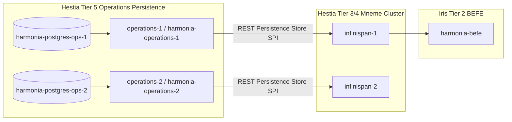

# Requirements & Nomenclature Audit

### Overview & Purpose

This audit identifies all occurrences of the term **HIE** / **hie** across the Harmonia repository to systematically eliminate legacy product, platform, and deployment identities while preserving legitimate Health Information Exchange domain concepts and external document references.

### Scope

- **In Scope**:
  - Docker Compose service identities, container names, networks, and build artifacts.
  - Kubernetes manifests, services, labels, selectors, and environment variables.
  - Ansible deployment roles and verification playbooks.
  - Iris frontend UI titles, headers, brand labels, and npm package identities.
  - Maven subproject artifact definitions, CLI tool names, and main application classes.
  - Camel exchange headers, properties, and internal FHIR extension URIs.
- **Out of Scope (Preserved)**:
  - Legitimate domain/architectural usage of the term *Health Information Exchange (HIE)* describing platform capabilities.
  - Historical upstream source document names (e.g. `HIE - Target State - Use Cases - v0.5.docx`).
  - Standard English words containing 'hie' substrings (e.g., `hierarchy`, `hierarchical`).

### Comprehensive Nomenclature Audit Table

| Occurrence / Pattern | File(s) | Current Meaning | Class (A–E) | Recommended Name / Action | Impact if Renamed |
| :--- | :--- | :--- | :--- | :--- | :--- |
| `hie-operations-jpa-server-1` / `hie-operations-jpa-server-2` | `docker-compose.yml`, `deployment/kubernetes/base/hestia/mnemosyne-operations.yaml`, `deployment/ansible/.../verify.yml` | Compose / K8s service identity for Mnemosyne Operations nodes | **B** | Rename to `operations-1` / `operations-2` | Internal DNS and dependent service references (`infinispan-1/2`) must update simultaneously. |
| `hie-network` | `docker-compose.yml`, `paradeigma/deployment/docker-compose-paradeigma.yml` | Default Docker bridge network connecting platform containers | **B** | Rename to `harmonia-network` | Requires container recreate on next `docker compose up`. Zero persistent data impact. |
| `HIE Platform`, `HIE FHIR Resource Explorer`, `HIE Operations Console` | `iris/iris-clinical/src/App.vue`, `Navbar.vue`, `Topbar.vue`, `DashboardView.vue`, `iris/iris-console/src/components/subsystems/SubsystemHeader.vue`, `index.html` | Legacy UI product and header branding | **A** | Rename to `Harmonia Platform`, `Harmonia Clinical Explorer`, `Harmonia Operations Console` | Pure presentation change; zero runtime or data risk. |
| `"name": "hie-administration"`, `"name": "hie-clinical"`, `"name": "hie-console"` | `iris/iris-*/package.json`, `package-lock.json` | npm package identifiers for Iris SPAs | **A** | Rename to `"@harmonia/iris-administration"`, `"@harmonia/iris-clinical"`, `"@harmonia/iris-console"` | Build package metadata only; clean alignment with Iris architecture. |
| `hie-operations-cli` | `hestia/hie-operations-cli/pom.xml`, `README.md`, `OperationsCliCommand.java`, `hestia/pom.xml` | CLI module and executable binary for Mnemosyne Operations | **C** | Rename module to `mnemosyne-operations-cli`, command to `mnemosyne-operations-cli` | Shaded JAR name changes; scripts invoking CLI must use new binary name. |
| `HieOperationsJpaApplication.java`, `HieOperationsJpaApplicationTests.java` | `hestia/mnemosyne-operations/.../HieOperationsJpaApplication.java` | Spring Boot entry point for Mnemosyne Operations JPA Server | **C** | Rename class to `MnemosyneOperationsJpaApplication.java` | Maven build repackages clean exec jar; zero external API impact. |
| `hie_operations_resources` | `hestia/mnemosyne-operations/.../OperationResourceEntity.java` | Relational table name in `ops_node_1` / `ops_node_2` databases | **C** | Retain or alias during migration | Schema change in operational DB if altered. Keep table name or execute DDL migration `ALTER TABLE`. |
| `HieWorkflowCliMain.java` | `energeia/ponos-cli/.../HieWorkflowCliMain.java`, `ponos-cli/pom.xml` | Ponos workflow CLI main entry point | **C** | Rename to `WorkflowCliMain.java` | Update `<mainClass>` in `ponos-cli/pom.xml`. |
| `HEADER_PRAGMA_ID = "HIE_PRAGMA_ID"`, `PROPERTY_PRAGMA = "HIE_PRAGMA"`, etc. (17 constants) | `energeia/erga/.../ErgonBase.java`, `pylai/...`, `energeia/ponos/...` | Camel Exchange headers and properties for in-memory pipeline routing | **C** | Rename to `HARMONIA_PRAGMA_ID` / `HARMONIA_PRAGMA` or `PRAGMA_ID` / `PRAGMA` | In-flight Camel exchanges within a node. Must be refactored across all Erga and Ponos routes together. |
| `http://fhirfactory.net/hie/task/...`, `http://fhirfactory.net/hie/task-reason` | `calliope/.../ErgonPayload.java`, `ErgonReasonEnum.java` | FHIR Task Extension and Coding System URIs | **C** | Migrate URIs to `http://fhirfactory.net/harmonia/task/...` | Requires migration handling if archived FHIR Task resources are parsed. |
| `http://example.org/hie/destination-delivery-status` | `pylai/.../OutboundTaskResourceBuilder.java`, `AGENTS.md` (Invariant 5) | Extension URI tracking outbound fanout sub-status | **C** | Migrate to `http://fhirfactory.net/harmonia/destination-delivery-status` | Aligns code and AGENTS.md Invariant 5 specification. |
| `HIE_SYNTHETIC_TASK("HIE-Synthetic-Task", ...)` | `calliope/.../ErgonReasonEnum.java` | Task reason code enum and strings | **C** | Migrate to `HARMONIA_SYNTHETIC_TASK("Harmonia-Synthetic-Task", ...)` with legacy code fallback | Ensures backward compatibility for existing tasks in Mneme/Mnemosyne. |
| "Health Integration Environment (HIE)", "Health Information Exchange (HIE)" | `README.md`, `AGENTS.md`, `pom.xml`, `docs/architecture/overview.md`, `docs/concepts/harmonia.md` | Domain term defining the enterprise health integration role | **D** | **Retain unchanged** | Zero impact. Accurately describes platform domain and standards conformance. |
| `HIE - Target State - Use Cases - v0.5.docx` | `openspec/project.md` | Name of upstream business requirements specification | **E** | **Retain unchanged** | Zero impact. Preserves traceability to client requirements document. |

### Summary Statistics

1. **Total Relevant 'HIE' Occurrences Inspected**: ~380 active project occurrences (excluding historical plans in `.junie` and unrelated English words such as *hierarchy*).
2. **Occurrences by Classification**:
   - **Classification A (Legacy Product / UI Branding)**: 48 occurrences
   - **Classification B (Legacy Runtime / Deployment Identity)**: 34 occurrences
   - **Classification C (Legacy Code / Configuration Identity)**: 196 occurrences
   - **Classification D (Legitimate Domain / Architectural Term)**: 92 occurrences
   - **Classification E (Historical / Contextual Reference)**: 10 occurrences
3. **Proposed Runtime/Deployment Renames**:
   - Compose/K8s service: `hie-operations-jpa-server-1/2` -> `operations-1/2` (or `mnemosyne-operations-1/2`)
   - Network: `hie-network` -> `harmonia-network`
4. **Proposed UI/Product Branding Renames**:
   - Product headers: `HIE Platform` -> `Harmonia Platform`
   - Clinical App: `HIE FHIR Resource Explorer` -> `Harmonia Iris Clinical` / `Harmonia Clinical Explorer`
   - Console App: `HIE Operations Console` -> `Harmonia Iris Console`
   - npm packages: `hie-*` -> `@harmonia/iris-*`
5. **Code/Config Identifiers Requiring Migration**:
   - `HieOperationsJpaApplication.java` -> `MnemosyneOperationsJpaApplication.java`
   - `hie-operations-cli` -> `mnemosyne-operations-cli`
   - `HieWorkflowCliMain.java` -> `WorkflowCliMain.java`
   - `ErgonBase` Camel headers `HIE_*` -> `HARMONIA_*` / `PRAGMA_*`
   - Calliope system URIs `http://fhirfactory.net/hie/*` -> `http://fhirfactory.net/harmonia/*`
6. **HIE Occurrences Recommended to Remain Unchanged**:
   - All standard architectural descriptions of Harmonia as a Health Information Exchange / Health Integration Environment.
   - Upstream OpenSpec requirement document references.

# Special Review & Risk Analysis

### Operations Services Special Investigation

#### Current Configuration & Relationships
- **Compose Service Names**: `hie-operations-jpa-server-1` and `hie-operations-jpa-server-2` (lines 200 and 224 of `docker-compose.yml`).
- **Container Names**: `harmonia-operations-1` and `harmonia-operations-2` (previously converged).
- **Generated Docker Images**:
  - Without explicit `image:` tag, Docker Compose derives image names from `<project>-<service>`, creating:
    - `harmonia-hie-operations-jpa-server-1`
    - `harmonia-hie-operations-jpa-server-2`
- **Maven Source Module & Artifact**:
  - Source directory: `hestia/mnemosyne-operations`
  - Maven artifact: `net.fhirfactory.harmonia:mnemosyne-operations:1.0.0-SNAPSHOT`
  - Produced executable artifact: `mnemosyne-operations-1.0.0-SNAPSHOT-exec.jar`
  - Main class: `HieOperationsJpaApplication.java`
- **Dependencies & Inter-Service DNS References**:
  - `infinispan-1` passes `-Dops.server.url=http://hie-operations-jpa-server-1:8080/api/operations`
  - `infinispan-2` passes `-Dops.server.url=http://hie-operations-jpa-server-2:8080/api/operations`
  - `docker-compose.yml` `depends_on`: `hie-operations-jpa-server-1` and `hie-operations-jpa-server-2`
  - `deployment/kubernetes/base/hestia/mnemosyne-operations.yaml`: Service and Deployment objects named `hie-operations-jpa-server-1` / `hie-operations-jpa-server-2`
  - `deployment/kubernetes/base/hestia/mneme-cluster.yaml`: references `http://hie-operations-jpa-server-1:8080`
  - `deployment/ansible/roles/harmonia-deploy/tasks/verify.yml`: health verification target list
- **Database Backend**:
  - Node 1 connects to `postgres-ops-1:5432/ops_node_1`
  - Node 2 connects to `postgres-ops-2:5432/ops_node_2`

#### Recommended Service Identity & Rationale
- **Recommended Compose Service Name**: `operations-1` and `operations-2` (or `mnemosyne-operations-1` / `mnemosyne-operations-2`).
- **Convention Alignment**:
  - Clinical database: `postgres-1` / `postgres-2` -> `harmonia-postgres-1` / `harmonia-postgres-2`
  - Operations database: `postgres-ops-1` / `postgres-ops-2` -> `harmonia-postgres-ops-1` / `harmonia-postgres-ops-2`
  - Clinical JPA: `hapi-fhir-jpa-server-1` / `hapi-fhir-jpa-server-2` -> `harmonia-hapi-fhir-1` / `harmonia-hapi-fhir-2`
  - Operations JPA: `operations-1` / `operations-2` -> `harmonia-operations-1` / `harmonia-operations-2`
  - This yields generated image names `harmonia-operations-1` / `harmonia-operations-2`, completely eliminating the legacy `hie-` prefix.

### Risk Analysis & Impact Assessment

#### 1. Docker Persistence & Service Discovery Risks
- **Volume Isolation**: Service renames in Compose do NOT affect PostgreSQL named volumes (`postgres_ops_data_1`, `postgres_ops_data_2`), which are attached by volume name, not service name.
- **DNS Breakage Prevention**: When renaming Compose services `hie-operations-jpa-server-1` -> `operations-1`, all references in `infinispan-1/2` `JAVA_OPTIONS` (`-Dops.server.url=http://operations-1:8080/api/operations`) and `depends_on` blocks must be updated in the same atomic commit.

#### 2. Kubernetes & Ansible Deployment Risks
- **Kubernetes Selectors & DNS**: In Kubernetes, changing Service names alters cluster DNS (`http://operations-1.harmonia.svc.cluster.local:8080`). All ConfigMaps, Pod environment variables, and ingress/service selectors in `deployment/kubernetes/base/hestia/` must be updated concurrently.
- **Ansible Health Verifications**: `deployment/ansible/roles/harmonia-deploy/tasks/verify.yml` must update its target list to prevent deployment playbook failure.

#### 3. Database Schema Risks (`hie_operations_resources`)
- Renaming the `@Table(name = "hie_operations_resources")` to `harmonia_operations_resources` would cause Hibernate to look for a new table if `ddl-auto=validate` or `none` is set, or create an empty table if `ddl-auto=update`.
- **Mitigation**: Keep table name as `hie_operations_resources` or provide a Flyway/Liquibase migration script `ALTER TABLE hie_operations_resources RENAME TO harmonia_operations_resources;`.

#### 4. In-Memory Camel Routing Risks (`ErgonBase` Headers)
- Renaming `HIE_PRAGMA_ID` to `HARMONIA_PRAGMA_ID` affects exchange routing across all 8 Erga activities and Ponos message processors.
- **Mitigation**: Perform refactoring as a unified Java constant update in `ErgonBase.java` so compiler checks enforce clean refactoring across all dependent modules (`energeia-erga`, `energeia-ponos`, `pylai-mllp-in`, `pylai-mllp-out`).

### Recommended Implementation Sequence

1. **Stage 1 (Deployment & Runtime Services)**: Converge Docker Compose services, networks, Kubernetes manifests, and Ansible verification targets.
2. **Stage 2 (Presentation & Branding)**: Update Iris UI headers, HTML titles, component branding, and package names.
3. **Stage 3 (Application & CLI Classes)**: Refactor `HieOperationsJpaApplication.java`, `HieWorkflowCliMain.java`, and rename `hie-operations-cli` module.
4. **Stage 4 (Camel Routing & Code Constants)**: Update `ErgonBase` headers/properties and Calliope system URIs.
5. **Stage 5 (Verification & Architecture Test Suite)**: Run full maven test suite and ArchUnit architecture tests.

# Delivery Steps

### ✓ Step 1: Converge Runtime & Deployment Identities
Update all Compose and Kubernetes runtime service identifiers, networks, and environment variables.

- Rename Compose services `hie-operations-jpa-server-1` and `hie-operations-jpa-server-2` to `operations-1` and `operations-2` in `docker-compose.yml`.
- Rename network `hie-network` to `harmonia-network` across `docker-compose.yml` and `paradeigma/deployment/docker-compose-paradeigma.yml`.
- Update Infinispan configuration and `-Dops.server.url` JVM arguments to point to `http://operations-1:8080/api/operations` and `http://operations-2:8080/api/operations`.
- Update Kubernetes manifests in `deployment/kubernetes/base/hestia/mnemosyne-operations.yaml` and `mneme-cluster.yaml` to match `operations-1` / `operations-2`.
- Update Ansible verification tasks in `deployment/ansible/roles/harmonia-deploy/tasks/verify.yml`.

### ✓ Step 2: Harmonize Iris UI & Frontend Branding
Update frontend package identifiers, document titles, navigation bars, and headers across Iris SPAs.

- Rename package names in `iris/iris-administration/package.json`, `iris/iris-clinical/package.json`, and `iris/iris-console/package.json` to `@harmonia/iris-administration`, `@harmonia/iris-clinical`, and `@harmonia/iris-console`.
- Update HTML titles in `iris/iris-clinical/index.html` and `iris/iris-console/index.html` to 'Harmonia Iris Clinical' and 'Harmonia Iris Console'.
- Replace legacy UI text 'HIE Platform' and 'HIE FHIR Resource Explorer' with 'Harmonia Platform' and 'Harmonia Clinical Explorer' across `App.vue`, `Navbar.vue`, `Topbar.vue`, `DashboardView.vue`, and `SubsystemHeader.vue`.

### ✓ Step 3: Refactor Module & Application Class Names
Refactor module names, CLI artifacts, Spring Boot application entry points, and CLI commands.

- Rename Maven module directory `hestia/hie-operations-cli` to `hestia/mnemosyne-operations-cli` and update artifactId and parent `pom.xml`.
- Rename Spring Boot main application class `HieOperationsJpaApplication.java` to `MnemosyneOperationsJpaApplication.java` in `hestia/mnemosyne-operations`.
- Rename CLI entry point `HieWorkflowCliMain.java` to `WorkflowCliMain.java` in `energeia/ponos-cli`.
- Update CLI command annotation `@Command(name = "hie-operations-cli")` to `@Command(name = "mnemosyne-operations-cli")`.

### * Step 4: Migrate Camel Headers & FHIR System URIs
Coordinate migration of Camel exchange headers, Camel properties, and FHIR system extension URIs.

- Refactor `ErgonBase.java` constants `HIE_PRAGMA_ID`, `HIE_TASK_ID`, etc., to `HARMONIA_PRAGMA_ID`, `HARMONIA_TASK_ID`, etc., updating dependent Camel routes across `energeia` and `pylai`.
- Refactor Calliope FHIR extension URIs (`http://fhirfactory.net/hie/task/...` -> `http://fhirfactory.net/harmonia/task/...`) and task reason system URIs with backwards-compatibility aliases if external persistence holds active tokens.
- Update ArchUnit test assertions and integration test suites to validate clean convergence.