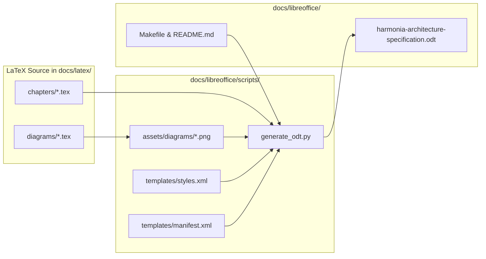

# Requirements

### Overview & Goals
The goal is to create a complete, publication-grade, highly navigable **LibreOffice OpenDocument Text (`.odt`)** version of the entire **Harmonia Health Information Exchange (HIE)** architectural specification currently authored in LaTeX (`docs/latex/`).

The LibreOffice edition will serve as an accessible, easily editable, and navigable companion document for stakeholders, healthcare enterprise architects, system integrators, and developers who prefer desktop office suites (LibreOffice Writer, OpenOffice, Microsoft Word) over LaTeX toolchains.

### Scope
#### In Scope
- **Directory Structure**: Create a dedicated `docs/libreoffice/` directory containing the primary specification document (`harmonia-architecture-specification.odt`), diagram assets (`assets/diagrams/`), automated builder script (`scripts/generate_odt.py`), and documentation guide (`README.md`, `Makefile`).
- **Complete Specification Parity**: Replicate 100% of the content from all LaTeX chapters and appendices:
  1. *Front Matter*: Cover page, Executive Summary, ArchiMate 3.2 Notation Guide, Greek Terminology Glossary, Interactive Table of Contents, List of Figures, and List of Tables.
  2. *Chapter 1: Motivation & Strategy Architecture*: Healthcare stakeholders, interoperability drivers, core principles, system goals, and capability maps.
  3. *Chapter 2: Business & Clinical Architecture*: Business actors, roles, clinical services (HL7 ingestion, patient matching, practitioner sync), and business process workflows.
  4. *Chapter 3: Application Architecture*: Detailed 5-tier architecture of `Calliope`, `Pylai` (`pylai-mllp-in`, `pylai-mllp-out`, `pylai-mllp-base`, `pylai-mllp-cli`), `Petasos`, `Energeia` (`Ponos`, `Praxis`, `Erga`), `Hestia` (`Mneme`, `Mnemosyne`), and `Iris` (`BEFE`, `Clinical UI`, `Console UI`).
  5. *Chapter 4: Data & Information Architecture*: `Pragma` task lifecycle state machine, `PetasosMessage` envelope, 14 FHIR R5 resource models, and HL7 v2 trigger schemas.
  6. *Chapter 5: Technology & Infrastructure Architecture*: Infrastructure nodes, system software (WildFly 31, ActiveMQ Artemis 2.38+, Infinispan 15+, PostgreSQL 16+), network paths, and port assignments.
  7. *Chapter 6: Physical Deployment & HA Architecture*: Artemis multi-broker replication pairs, Infinispan replicated cache grid with write-behind SPI, Docker Compose deployment topology, and failover mechanics.
  8. *Appendix A*: Paradeigma Reference Architecture.
  9. *Appendix B*: MLLP Ingress & Egress Gateway Services.
  10. *Appendix C*: Ergon Module Architecture.
  11. *Appendix D*: Praxis Workflow Engine & Sequence Orchestrator.
  12. *Appendix E*: Provider Registry Architecture.
- **Visuals & Diagram Assets**: High-resolution vector/raster diagram exports for all 15 architectural views embedded with figure captions and cross-reference targets.
- **Usability & Navigation Features**:
  - Interactive clickable Table of Contents (TOC), List of Figures (LOF), and List of Tables (LOT).
  - Internal bookmark hyperlinks linking text references directly to diagrams, appendices, and section headings.
  - Page headers showing the document title/current chapter and footers showing dynamic page numbering ("Page X of Y").
  - Clean styling hierarchy with custom color-coded callout boxes (Note, Tip, Warning, Architectural Principle) and styled data tables with alternating row backgrounds.
- **Build & Packaging Tooling**: Python-based zero-external-dependency script to generate or update the `.odt` package, alongside `Makefile` and `README.md`.

#### Out of Scope
- Modifying the existing LaTeX documentation in `docs/latex/` (LaTeX remains the vector LaTeX source).
- Modifying platform source code or runtime configurations.

### User Stories
- **As an Enterprise Architect / Business Analyst**, I want a LibreOffice `.odt` version of the Harmonia architectural specification so that I can review, annotate, and export sections into corporate office documents without installing a TeX Live distribution.
- **As a System Integrator or Engineer**, I want interactive document navigation (clickable TOC, hyperlinks, figure links, bookmarks) so that I can quickly jump to specific subsystem specifications, port allocations, or data models.
- **As a Technical Writer / Contributor**, I want an automated generation script and clean styling templates so that the LibreOffice document can be regenerated or updated consistently as the architecture evolves.

### Functional Requirements
- **FR-1 (Content & Structure Parity)**: Recreate the entire LaTeX specification structure across 7 core chapters and 5 appendices with identical technical depth and terminology.
- **FR-2 (High-Fidelity Diagrams)**: Include all 15 architectural diagrams as crisp visual figures embedded within their respective chapters.
- **FR-3 (Interactive Navigation)**: Provide a hyperlinked Table of Contents, List of Figures, List of Tables, and internal cross-reference bookmarks.
- **FR-4 (Professional Typography & Palette)**: Apply consistent styles using the Harmonia brand colors (Harmonia Navy `#1A365D`, Harmonia Blue `#2B6CB0`, Accent Cyan `#319795`) and standard ArchiMate layer pastel tones.
- **FR-5 (Formatted Technical Tables & Callouts)**: Format all technical tables with distinct header rows and alternating row backgrounds, and render architecture principles and notes as visually styled callout blocks.
- **FR-6 (Build & Generation Tooling)**: Provide a clean Python generator script (`generate_odt.py`) that constructs a valid, standard OpenDocument (`.odt`) package adhering to the OpenDocument 1.3 specification.

### Non-Functional Requirements
- **Standard Compatibility**: The generated `.odt` file must open seamlessly in LibreOffice Writer (7.x and 8.x), Apache OpenOffice, and Microsoft Word without formatting glitches.
- **Zero Heavy Tooling Dependency**: The generation script must run using standard Python 3 libraries (`zipfile`, `xml.etree.ElementTree`) without requiring external binary compilation dependencies.
- **Maintainability & Portability**: All assets, templates, and scripts must reside neatly within `docs/libreoffice/`.

# Technical Design

### Current Implementation & Context
- The repository documentation currently comprises:
  - Markdown guides in `docs/` (`architecture.md`, `database-schema.md`, `high-availability.md`, `failure-recovery.md`, `message-lifecycle.md`, `persistence-architecture.md`).
  - Production-grade LaTeX/TikZ architectural documentation in `docs/latex/` containing 7 chapters, 5 appendices, and 15 TikZ diagrams.
- There is currently no LibreOffice (`.odt`) edition in the repository.

### Key Decisions
1. **Standard OpenDocument Format (`.odt`) Container**:
   - *Decision*: Produce a standard, compliant OpenDocument Text (`.odt`) archive containing standard XML parts (`content.xml`, `styles.xml`, `meta.xml`, `manifest.xml`, and `Pictures/` directory).
   - *Rationale*: Guarantees maximum portability across LibreOffice Writer, Collabora Office, Microsoft Word, and Google Docs without proprietary vendor lock-in.

2. **Automated Zero-Dependency Generation Script (`generate_odt.py`)**:
   - *Decision*: Author a standalone Python 3 generator in `docs/libreoffice/scripts/generate_odt.py` that parses the structured content, styles, and diagrams to build the complete `.odt` archive deterministically using standard library modules (`zipfile`, `xml.etree.ElementTree`).
   - *Rationale*: Eliminates fragile system dependencies (such as pandoc, unoconv, or heavyweight Office daemons in headless mode), allowing any developer or CI environment to build the document instantly.

3. **High-Resolution Diagram Rendering & Embedding**:
   - *Decision*: Render and embed high-resolution vector SVG / 300 DPI PNG diagrams for all 15 architectural viewpoints in `docs/libreoffice/assets/diagrams/` and embed them into the document with standardized captions and figure anchors.
   - *Rationale*: Ensures that all complex ArchiMate flows, message sequences, and deployment topologies are razor-sharp and legible in print and on screen.

4. **Navigational Enhancements & Information Hierarchy**:
   - *Decision*: Implement full heading hierarchy (Heading 1 through Heading 4) mapped to LibreOffice Outline Levels, automated TOC/LOF/LOT with hyperlinks, bookmark targets on every chapter, section, table, and figure, and custom callout boxes for architecture principles and implementation notes.
   - *Rationale*: Makes a 50+ page technical architectural document effortless to skim, search, and navigate.

### Proposed Directory Layout
```
docs/libreoffice/
├── Makefile                               # Build targets (all, build, clean, validate)
├── README.md                              # Guide for viewing, editing, and generating the document
├── harmonia-architecture-specification.odt# Ready-to-use master LibreOffice specification document
├── assets/
│   └── diagrams/                          # Diagram image assets (SVG / PNG)
│       ├── legend.png
│       ├── fig-motivation-map.png
│       ├── fig-clinical-process.png
│       ├── fig-app-overview-5tier.png
│       ├── fig-petasos-messaging.png
│       ├── fig-energeia-workflow.png
│       ├── fig-pragma-state-flow.png
│       ├── fig-hestia-data-grid.png
│       ├── fig-technology-nodes.png
│       ├── fig-deployment-ha.png
│       ├── fig-mllp-ingress-process.png
│       ├── fig-mllp-egress-process.png
│       ├── fig-paradeigma-architecture.png
│       ├── fig-praxis-workflow-architecture.png
│       └── fig-ergon-module-architecture.png
├── templates/
│   ├── styles.xml                         # OpenDocument style definitions (typography, headers, footers)
│   └── manifest.xml                       # META-INF manifest template
└── scripts/
    └── generate_odt.py                    # Python script to generate the complete .odt package
```

### Document Structure & Style Palette
- **Document Metadata**:
  - Title: Harmonia Health Information Exchange Platform
  - Subtitle: ArchiMate 3.2 Technical Architecture Specification & System Reference
  - Author: Harmonia Platform Architecture Team
  - Version: 1.0.0
- **Typography**:
  - Headings: Liberation Sans / Arial, Bold, Harmonia Blue (`#1A365D` for Title/H1, `#2B6CB0` for H2, `#2C5282` for H3, `#4A5568` for H4)
  - Body Text: Liberation Serif / Times New Roman (11pt, 1.15 line spacing, 6pt paragraph spacing)
  - Code / Identifiers: Liberation Mono / Consolas (9.5pt, shaded background `#F7FAFC`, border `#E2E8F0`)
- **Tables**:
  - Header Row: Dark Navy background (`#1A365D`), White bold text
  - Alternating Rows: Light tint (`#F7FAFC` / `#FFFFFF`), subtle border (`#E2E8F0`)
- **Callout Boxes**:
  - Architecture Principle: Left border 4pt in Teal (`#319795`), background `#E6FFFA`
  - Note / Tip: Left border 4pt in Blue (`#3182CE`), background `#EBF8FF`
  - Warning / Alert: Left border 4pt in Amber (`#DD6B20`), background `#FFFAF0`

### Architecture Diagram


### Risks & Mitigations
- **Risk 1: OpenDocument XML Formatting Complexities**: Incompatibilities between LibreOffice versions or Microsoft Word when parsing custom ODF styles.
  - *Mitigation*: Adhere strictly to the OASIS OpenDocument Format 1.3 standard, standard ODF XML namespaces (`office:`, `style:`, `text:`, `table:`, `draw:`, `fo:`), and validate using standard XML tooling and LibreOffice Writer import tests.
- **Risk 2: Diagram Scaling and Alignment**: Overly large diagram images exceeding page boundaries.
  - *Mitigation*: Define standardized image frame styles (`draw:frame`) with responsive aspect-ratio preservation and center alignment within page printable margins.

# Testing

### Validation Approach
Verification ensures that the generated `.odt` file is structurally valid, contains all sections from the LaTeX reference documentation, displays all architectural diagrams crisply, and provides functional, intuitive navigation.

### Key Scenarios
1. **Document Completeness & Section Parity**:
   - Verify that all 7 core chapters and all 5 appendices are fully represented with complete text, code listings, data tables, and diagrams.
2. **Interactive Navigation Verification**:
   - Verify that the Table of Contents, List of Figures, and List of Tables contain active hyperlinked page entries.
   - Verify that internal bookmark cross-references (e.g. clicking "Figure 3.1", "Table 5.2", or "Appendix D") navigate to the intended target location.
3. **Typography & Styling Integrity**:
   - Verify heading hierarchy (H1-H4), font families, font sizes, margins, headers, and footers ("Page X of Y").
   - Verify callout boxes and table styling (alternating row fills, header formatting).
4. **OpenDocument Standard Compliance**:
   - Validate XML schema validity of `content.xml`, `styles.xml`, `meta.xml`, and `META-INF/manifest.xml` within the `.odt` zip archive.
5. **Multi-Viewer Compatibility**:
   - Ensure the `.odt` document opens cleanly in LibreOffice Writer, OpenOffice, and Microsoft Word.

### Edge Cases
- Long table rows spanning across page breaks: Ensure table header repetition (`table:table-header-rows`) is configured.
- Special Greek characters and mathematical symbols (`ἐνέργεια`, `Πόνος`, `πρᾶξις`, `ἔργα`, `πρᾶγμα`, `πέτασος`, `Μνήμη`, `Μνημοσύνη`, `Ἑστία`, `Ἶρις`, `Πύλαι`, `Καλλιόπη`): Ensure UTF-8 XML encoding handles all characters without mojibake.

# Delivery Steps

### ✓ Step 1: Setup Document Architecture, Styles, and Diagram Assets
Establish the directory structure under `docs/libreoffice/`, extract/render standalone SVG/PNG vector diagram assets from the TikZ source files, and define the OpenDocument styles, color schemes, and page templates.

- Create the `docs/libreoffice/` directory layout with `assets/diagrams/`, `templates/`, and `scripts/` subdirectories.
- Convert or render all 15+ architectural diagrams (Legend, Motivation Map, Clinical Process, 5-Tier App Landscape, Petasos Messaging, Energeia Workflow, Pragma State Lifecycle, Hestia Data Grid, MLLP Ingress/Egress, Paradeigma, Praxis Workflow, Ergon Module, Technology Nodes, Deployment HA) into high-resolution SVG/PNG assets for embedding.
- Define corporate and ArchiMate styles in the LibreOffice ODT style configuration: Harmonia Blue headings, styled table templates with colored headers, callout boxes for architectural notes/principles, and standardized body typography.
- Configure page headers with document/section title and page footers with dynamic page numbering ("Page X of Y").

### ✓ Step 2: Author Core Specification Chapters & Embed Architectural Views
Author and assemble the main specification body in LibreOffice format matching the content and structure of LaTeX chapters 00 through 06.

- Create Front Matter: Cover page, Document Control metadata, Executive Summary, ArchiMate 3.2 Notation Guide, Greek Terminology Glossary, and automatically generated interactive Table of Contents, List of Figures, and List of Tables.
- Author Chapter 1 (Motivation & Strategy): Stakeholder matrix, clinical interoperability drivers, architecture principles, and capability maps.
- Author Chapter 2 (Business & Clinical Layer): Healthcare business actors, clinical services (HL7 ingestion, patient matching, practitioner sync), and business process workflows.
- Author Chapter 3 (Application Architecture): 5-tier Harmonia subsystem specifications (`Calliope`, `Pylai`, `Petasos`, `Energeia` [`Ponos`, `Praxis`, `Erga`], `Hestia` [`Mneme`, `Mnemosyne`], `Iris` [`BEFE`, `Clinical UI`, `Console UI`]), service interfaces, and collaboration interactions.
- Author Chapter 4 (Data & Information Architecture): Canonical `Pragma` task lifecycle & checkpoint state machine, `PetasosMessage` envelope, FHIR R5 14-resource schemas, and HL7 v2 triggers.
- Author Chapter 5 (Technology & Infrastructure): Infrastructure nodes, system software (WildFly 31, Artemis 2.38+, Infinispan 15+, PostgreSQL 16+), networks, and port allocations.
- Author Chapter 6 (Physical Deployment & HA): Multi-broker Artemis Primary/Backup replication pairs, Infinispan replicated cache grid with write-behind SPI, Docker Compose topology, and failover/recovery mechanics.

### ✓ Step 3: Author Appendices, Tables, Callout Blocks, and Navigation Links
Incorporate all 5 subsystem appendices, structured technical tables, callout blocks, bookmarks, and cross-reference hyperlinks to ensure seamless navigation.

- Author Appendix A (`Paradeigma` Reference Architecture & End-to-End Integration Walkthrough).
- Author Appendix B (`Pylai MLLP Ingress & Egress` Microservices and Pipelines).
- Author Appendix C (`Ergon` Module Architecture and Task Execution).
- Author Appendix D (`Praxis` Workflow Engine, Sequence Orchestrator & Saga Compensation).
- Author Appendix E (`Provider Registry` Architecture and Practitioner Synchronization).
- Format all technical data tables (port allocations, JMS queues/topics, Infinispan cache configs, FHIR endpoints) with alternating row colors and bold header rows.
- Insert interactive bookmarks and cross-reference links between chapters, appendices, figures, and data models to allow quick jumps across the document.

### ✓ Step 4: Build Automation, Quality Validation, and Developer Guide
Create an automated ODT builder script, verify the document structure and formatting in LibreOffice, and provide build instructions in a dedicated README.

- Create a zero-dependency Python script (`generate_odt.py` or build utility) to assemble, validate, and package the `.odt` OpenDocument archive deterministically.
- Create `docs/libreoffice/Makefile` supporting targets `all`, `build`, `clean`, and `validate`.
- Write `docs/libreoffice/README.md` providing instructions on viewing, editing, and building the LibreOffice document, including styling guidelines and cross-reference conventions.
- Validate the generated `harmonia-architecture-specification.odt` file for structural validity (XML validation, manifest completeness, image integrity) and navigable layout.