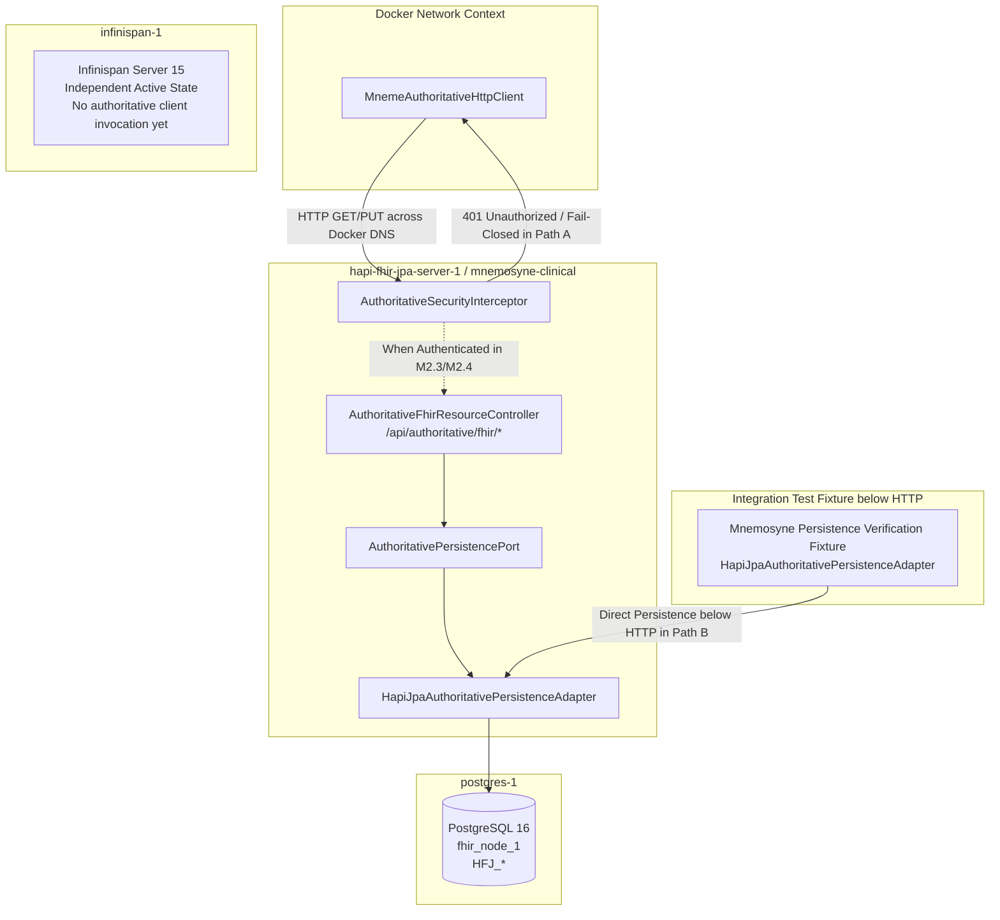

# Requirements

### Overview & Goals
Milestones **M1 (Stable Docker Runtime Baseline)**, **M2.1 (Mneme Authoritative HTTP Client)**, and **Step 3.3 (Mnemosyne Authoritative HTTP Server Adapter)** are complete, conformant, and accepted baselines. In accordance with the repository authority hierarchy (`docs/architectural-axioms.md`, `AGENTS.md`, ADR-021, ADR-022) and the master convergence roadmap (`docs/implementation/harmonia-convergence-runtime-integration-plan.md`), the current and only authorized step is **M2.2 — Containerise/deploy Mnemosyne and prove the Mneme → Mnemosyne authoritative path across the Docker network**.

The objective of M2.2 is to execute a rigorous **Docker deployment-boundary proof** by deploying `mnemosyne-clinical` (`hapi-fhir-jpa-server-1`) alongside `postgres-1` and `infinispan-1` on the Docker bridge network (`harmonia-network`), explicitly separating two distinct verification paths:
1. **Path A (Docker Authoritative-Boundary Proof)**: `MnemeAuthoritativeHttpClient` connects across Docker DNS to `AuthoritativeSecurityInterceptor` at `/api/authoritative/fhir/*`, verifying Docker DNS resolution, container routing, and fail-closed HTTP `401 Unauthorized` security enforcement.
2. **Path B (Mnemosyne Durable-Persistence Proof)**: Exercises the existing Mnemosyne/HAPI-JPA persistence integration using an existing legitimate integration-test mechanism below the HTTP security boundary, persisting a test resource to PostgreSQL, restarting Mnemosyne / cycling Compose, and verifying that durable database state remains intact without implying creation occurred through unauthenticated HTTP.

### Scope
- **In Scope (M2.2)**:
  - Containerization and build verification of `mnemosyne-clinical` using `hestia/mnemosyne-clinical/Dockerfile` and JRE 21 runtime.
  - Configuration of Docker Compose topology in `docker-compose.yml` for Mnemosyne (`hapi-fhir-jpa-server-1`), PostgreSQL (`postgres-1`), and Mneme (`infinispan-1`) on `harmonia-network` with Docker DNS.
  - Configuring network alias `mnemosyne-clinical` for `hapi-fhir-jpa-server-1` on `harmonia-network`.
  - **Verification Path A**: Deployment verification harness utilizing `MnemeAuthoritativeHttpClient` within the Docker network context to prove Docker DNS resolution, container routing, and fail-closed `401 Unauthorized` security enforcement against `/api/authoritative/fhir/*`.
  - Verification that the dedicated `/api/authoritative/fhir/*` endpoint is targeted and that public `/fhir/*` (`JpaRestfulServer`) is never substituted.
  - **Verification Path B**: Mnemosyne durable persistence proof below the HTTP security boundary (exercising `HapiJpaAuthoritativePersistenceAdapter` against PostgreSQL `postgres-1`), verifying that durable records in `postgres_data_1` survive Mnemosyne container restarts and Compose stop/start cycles.
  - Verification of independent startup and operational resilience of `infinispan-1` when Mnemosyne is offline (without injecting unused client configuration or promoting cache to authority).
  - Preservation of exact M2.1 failure classifications (`NotCommitted`, `OutcomeUnknown`, `Conflict`, `Committed`).
  - ArchUnit architecture enforcement guaranteeing zero dependency or architectural boundary leakage.

- **Out of Scope (Explicit Exclusions)**:
  - **M2.3**: Implementation of deployment-level transport authentication mechanisms (e.g. mTLS, service tokens) for `service:mneme`.
  - **M2.4**: Distributed multi-container authenticated semantic proof (CREATE/READ/UPDATE/conflicts) across the Docker network using the deployment harness.
  - Inventing temporary API keys, caller-controlled identity headers, test bypasses, or disabled security.
  - Exposing another production API or using public `/fhir/*` as a substitute for the authoritative API.
  - Creating an artificial production Mneme runtime in `infinispan-1`.
  - M3 Governed Reader / Writer integration (`DefaultGovernedReader`, `DefaultGovernedWriter`).
  - Application migration (Iris BEFE, Pylai gateways, Ponos workflow tasks).
  - Authoritative search / GraphQL / bulk operations (M5).
  - MicroK8s / Kubernetes production deployments (M6).
  - Physical DELETE operations (forbidden by ADR-020).
  - Modifying or removing legacy cache stores (`FhirRestCacheStore`).
  - Unrelated MAT remediation or redesign of M2.1 client / Step 3.3 server semantics.

### User Stories
- **As a Distributed Integration Platform**, I want Mnemosyne to deploy as an isolated Docker container on `harmonia-network` communicating with PostgreSQL over Docker DNS so that authoritative persistence is completely separated from application runtimes.
- **As a Clinical Security & Governance Officer**, I want all unauthenticated requests arriving at `/api/authoritative/fhir/*` across the Docker network to be rejected fail-closed with `401 Unauthorized` by `AuthoritativeSecurityInterceptor` so that network presence is never mistaken for authentication.
- **As a Systems Operator**, I want Mnemosyne to connect durably to PostgreSQL in Docker and preserve clinical records across container restarts so that authoritative data survives process restarts without loss.
- **As an Architectural Guardian**, I want `infinispan-1` to remain independently operational and decoupled from Mnemosyne downtime without treating active cache as authoritative persistence.

### Functional Requirements
- **FR-1 Mnemosyne Containerization & DNS**: `mnemosyne-clinical` must build reproducibly via Dockerfile and resolve `postgres-1:5432` over internal Docker DNS on `harmonia-network`.
- **FR-2 Docker DNS Resolution & Transport Routing (Path A)**: A deployment verification harness on `harmonia-network` must resolve `http://mnemosyne-clinical:8080/api/authoritative/fhir` (or `http://hapi-fhir-jpa-server-1:8080/api/authoritative/fhir`) via internal Docker DNS and establish TCP/HTTP communication.
- **FR-3 Fail-Closed Security Boundary Proof (Path A)**: Invocations of `/api/authoritative/fhir/{resourceType}/{id}` over the Docker network lacking trusted transport identity must return `401 Unauthorized` through the real `AuthoritativeSecurityInterceptor`.
- **FR-4 Pure Point Boundary Enforcement**: The internal authoritative endpoint must remain strictly isolated from public `/fhir/*` (`JpaRestfulServer`).
- **FR-5 Independent Runtime Resilience**: Mneme (`infinispan-1`) must start and remain operational when Mnemosyne is offline. No client failure or outage must cause Infinispan cache to become authoritative.
- **FR-6 PostgreSQL Persistence & Schema Initialization (Path B)**: Mnemosyne must connect to PostgreSQL (`postgres-1`), auto-initialize the HAPI JPA schema (`HFJ_*`), and execute persistence operations against `fhir_node_1` below the HTTP security boundary.
- **FR-7 Container Restart Durability (Path B)**: Durable records persisted in PostgreSQL (`postgres_data_1` volume) via the persistence verification fixture below the HTTP boundary must remain intact and retrievable after Mnemosyne container restarts (`docker compose restart hapi-fhir-jpa-server-1`) and Compose cycles (`docker compose stop` / `up`).

### Non-Functional Requirements
- **Modularity & Layering**: Production code in Mneme must not depend on `mnemosyne-clinical`, Hibernate, JPA, or PostgreSQL drivers (verified by ArchUnit Invariant 8).
- **Security Invariance**: Docker network presence must never be treated as trusted service identity (AGENTS.md Invariant 6).
- **Diagnostics & Observability**: Container logs must reflect clear DNS resolution, HTTP status codes, and health check transitions without logging unmasked PHI (AGENTS.md Invariant 7).

# Technical Design

### Repository Baseline & Existing Assets

1. **Docker Compose Baseline (`docker-compose.yml`)**:
   - `postgres-1`: `postgres:16-alpine`, port `5432:5432`, DB `fhir_node_1`, user `fhir_user`, password `fhir_password`, volume `postgres_data_1`, healthcheck `pg_isready`.
   - `hapi-fhir-jpa-server-1`: built from `./hestia/mnemosyne-clinical`, JRE 21, port `8081:8080`, profile `postgres`, connected to `postgres-1` via `jdbc:postgresql://postgres-1:5432/fhir_node_1`, healthcheck on `/actuator/health`.
   - `infinispan-1`: built from `./hestia/mneme-cluster`, port `11222:11222`, network `harmonia-network`. Contains `mneme-persistence` SPI JAR in `/opt/infinispan/server/lib/` for Infinispan cache-store extensions (`FhirRestCacheStore` targeting `/fhir`). Runs independently and does not instantiate `MnemeAuthoritativeHttpClient`.
2. **Mneme Authoritative HTTP Client Baseline (`hestia/mneme-persistence`)**:
   - `MnemeAuthoritativeHttpClient` implements `AuthoritativePersistencePort<IBaseResource>` and connects to `/api/authoritative/fhir/*`.
   - `MnemeAuthoritativeClientConfig` reads `HARMONIA_MNEMOSYNE_AUTHORITATIVE_URL` (env) or `mnemosyne.authoritative.url` (property), defaulting to `http://mnemosyne-clinical:8080/api/authoritative/fhir`.
   - Wire contracts and conservative failure classifications are verified by WireMock and ArchUnit tests in M2.1.
   - **Runtime Grounding Finding**: `MnemeAuthoritativeHttpClient` is not instantiated or invoked inside the `infinispan-1` server process. Production caller integration belongs to the Governed Access layer (M3). In M2.2, a dedicated deployment verification harness executes `MnemeAuthoritativeHttpClient` within the `harmonia-network` Docker context to verify DNS resolution, routing, and fail-closed security.
3. **Mnemosyne Authoritative Server Baseline (`hestia/mnemosyne-clinical`)**:
   - `AuthoritativeFhirResourceController` maps `/api/authoritative/fhir/{resourceType}/{id}` for GET (READ) and PUT (CREATE/UPDATE).
   - `AuthoritativeSecurityInterceptor` intercepts all `/api/authoritative/fhir/**` requests, checking `HttpServletRequest.getUserPrincipal()` and failing closed with `401 Unauthorized` when unauthenticated.
   - `HapiJpaAuthoritativePersistenceAdapter` implements `AuthoritativePersistencePort<IBaseResource>` against HAPI DAOs and PostgreSQL.

### Key Decisions

- **Decision 1: Ground M2.2 Verification in Real Fail-Closed 401 Responses**:
  - *Approach*: Exercise the cross-container HTTP transport path from the deployment verification harness to Mnemosyne over Docker DNS and verify that `MnemeAuthoritativeHttpClient` receives HTTP 401 Unauthorized from `AuthoritativeSecurityInterceptor`.
  - *Rationale*: M2.3 is responsible for establishing trusted `service:mneme` service identity. In M2.2, an unauthenticated request reaching Mnemosyne and returning 401 proves network connectivity, Docker DNS, container routing, and fail-closed security without weakening Themis or inventing fake credentials.
- **Decision 2: Independent Container Lifecycle & Decoupled Startup**:
  - *Approach*: Do not configure `HARMONIA_MNEMOSYNE_AUTHORITATIVE_URL` on `infinispan-1`, and ensure `infinispan-1` runs as an independent active-state engine.
  - *Rationale*: Infinispan server does not consume this environment variable. Preserving clean runtime boundaries prevents configuration pollution and reinforces that Mneme active state is decoupled from authoritative persistence.
- **Decision 3: Docker DNS Network Aliasing**:
  - *Approach*: Assign network alias `mnemosyne-clinical` to `hapi-fhir-jpa-server-1` on `harmonia-network`.
  - *Rationale*: Matches the default URL configured in `MnemeAuthoritativeClientConfig` (`http://mnemosyne-clinical:8080/api/authoritative/fhir`) and ensures inter-container resolution without localhost or workstation IP dependencies.

### Target Docker Topology & Configuration

| Service / Container | Image / Build Context | Internal Hostname & Port | Host Port | Network | Volumes | Dependencies / Role |
| :--- | :--- | :--- | :--- | :--- | :--- | :--- |
| **`postgres-1`** (`harmonia-postgres-1`) | `postgres:16-alpine` | `postgres-1:5432` | `5432:5432` | `harmonia-network` | `postgres_data_1:/var/lib/postgresql/data` | Healthcheck: `pg_isready -U fhir_user -d fhir_node_1` |
| **`hapi-fhir-jpa-server-1`** (`harmonia-hapi-fhir-1`) | `./hestia/mnemosyne-clinical` (`eclipse-temurin:21-jre-jammy`) | `hapi-fhir-jpa-server-1:8080`<br/>*(alias: `mnemosyne-clinical`)* | `8081:8080` | `harmonia-network` | None | Depends on `postgres-1: service_healthy`<br/>Healthcheck: `/actuator/health` |
| **`infinispan-1`** (`harmonia-infinispan-node1`) | `./hestia/mneme-cluster` (`quay.io/infinispan/server:15.0.3.Final`) | `infinispan-1:11222` | `11222:11222`<br/>`7800:7800` | `harmonia-network` | None | Active-state cache cluster node (independent startup). |
| **`Deployment Verification Harness`** | JVM / Test Context on Docker Network | Ephemeral client | N/A | `harmonia-network` | None | Harness executing `MnemeAuthoritativeHttpClient` to prove Docker DNS & 401 fail-closed boundary. |

### Architecture & Milestone Separation



- **M2.2 Scope**:
  - **Path A (Authoritative Boundary)**: Proves `MAC -> Docker DNS (mnemosyne-clinical:8080) -> ASI -> 401 Unauthorized` (Fail-Closed Network Proof).
  - **Path B (Durable Persistence)**: Proves `PVF -> HJPA -> PostgreSQL` operational persistence, restart survival, and Compose cycle preservation below the HTTP security boundary.
  - Confirms `infinispan-1` operational independence.
- **M2.3 Scope (Next Milestone)**:
  - Establishes authenticated `service:mneme` transport identity mapped to `ThemisPrincipal`.
- **M2.4 Scope (Subsequent Milestone)**:
  - Executes full distributed semantic verification (`CREATE`, `READ`, `UPDATE`, conflict handling) via authenticated harness through `/api/authoritative/fhir/*`.
- **M3 Scope (Governed Access Integration)**:
  - Integrates production callers (`DefaultGovernedWriter` / `DefaultGovernedReader`) with `MnemeAuthoritativeHttpClient`.

# Verification & Failure Strategy

### 1. Mnemosyne Image Build & Health Verification
- Build image: `docker compose build hapi-fhir-jpa-server-1`.
- Start container: `docker compose up -d postgres-1 hapi-fhir-jpa-server-1`.
- Verify container health status transitions to `healthy` via `http://localhost:8081/actuator/health`.
- Confirm PostgreSQL schema is initialized with `HFJ_*` tables in `fhir_node_1`.

### 2. Path A — Distributed Docker Authoritative Boundary Proof
- **Network Path & DNS Resolution**:
  - Execute client request from deployment verification harness to `http://mnemosyne-clinical:8080/api/authoritative/fhir/Patient/pat-test-1`.
  - Verify DNS resolves and HTTP connection is established across `harmonia-network`.
- **Fail-Closed Security Rejection**:
  - Verify that unauthenticated GET and PUT requests return HTTP `401 Unauthorized` from `AuthoritativeSecurityInterceptor`.
  - Verify that `MnemeAuthoritativeHttpClient` correctly maps the HTTP 401 response to `AuthoritativePersistenceResult.NotCommitted` (fail-closed, zero mutation).
  - Verify that public `/fhir/*` path is not invoked or substituted.
  - *Boundary Rule*: This proves deployment, DNS, HTTP routing, and fail-closed security only. Authenticated semantic calls are deferred to M2.3/M2.4.

### 3. Path B — Mnemosyne Durable Persistence & Restart Proof
- **Persistence Below HTTP Boundary**:
  - Exercise the existing Mnemosyne/HAPI-JPA persistence integration using an existing legitimate integration-test mechanism / persistence fixture below the HTTP security boundary (`HapiJpaAuthoritativePersistenceAdapter`).
  - Persist a test clinical resource directly to PostgreSQL `fhir_node_1` (`HFJ_RESOURCE` / `HFJ_RES_VER`).
- **Mnemosyne Restart Durability**:
  - Restart Mnemosyne container: `docker compose restart hapi-fhir-jpa-server-1`.
  - Wait for health status `healthy`.
  - Verify that previously written records in `HFJ_RESOURCE` / `HFJ_RES_VER` remain intact and readable from PostgreSQL.
- **Compose Cycle Durability**:
  - Execute `docker compose stop postgres-1 hapi-fhir-jpa-server-1` followed by `docker compose up -d`.
  - Confirm volume `postgres_data_1` preserved all database tables and rows.
- **Boundary Constraints for Path B**:
  - MUST NOT bypass or disable `AuthoritativeSecurityInterceptor`.
  - MUST NOT invent service credentials or caller headers.
  - MUST NOT expose another production API or use public `/fhir/*`.
  - MUST NOT imply that authenticated distributed authoritative semantics have been proven over HTTP.

### 4. Failure Mode & Resilience Verification
- **Exact M2.1 Failure Semantics Preservation**:
  - `NotCommitted`: Returned exclusively when zero mutation / zero transmission is positively established:
    - Pre-network DNS resolution failure (`UnknownHostException`, `UnresolvedAddressException`).
    - Local client-side precondition or argument errors.
    - Server-side fail-closed rejection before persistence execution: HTTP `401 Unauthorized` / HTTP `403 Forbidden`.
    - Server-side validation rejection: HTTP `400 Bad Request` / HTTP `422 Unprocessable Entity`.
    - Server-side resource absent for READ: HTTP `404 Not Found` / HTTP `410 Gone`.
  - `OutcomeUnknown`: Returned for all indeterminate transport states where request may have reached Mnemosyne:
    - Connection failure / socket timeout / connection reset / mid-stream disconnect (`ConnectException`, `HttpTimeoutException`, `SocketTimeoutException`, `IOException`).
    - HTTP `500 Internal Server Error`, `502 Bad Gateway`, `503 Service Unavailable`, `504 Gateway Timeout`.
    - Missing or malformed ETag headers on HTTP 200/201 responses.
  - `Conflict`: Returned on HTTP `412 Precondition Failed` (CREATE collision or UPDATE stale expected version).
  - `Committed`: Returned on HTTP `200 OK` (READ/UPDATE) or `201 Created` (CREATE) with valid ETag and matching version headers.
- **Mnemosyne Offline Resilience**:
  - Stop Mnemosyne (`docker compose stop hapi-fhir-jpa-server-1`).
  - Verify Mneme (`infinispan-1`) remains running and operational.
  - Execute authoritative client call: verify `MnemeAuthoritativeHttpClient` classifies the transport failure conservatively as `OutcomeUnknown` (or `NotCommitted` on unresolvable DNS) without crashing or hanging, and Mneme never treats local cache as authoritative persistence.
- **PostgreSQL Offline Resilience**:
  - Stop PostgreSQL (`docker compose stop postgres-1`).
  - Verify Mnemosyne healthcheck reports unhealthy; incoming requests fail safely (HTTP 500/503 -> client receives `OutcomeUnknown`).

### 5. Architecture Conformance Verification
- Execute ArchUnit architecture tests:
  `mvn test -pl paradeigma/paradeigma-test -am -Dtest="*ArchitectureTest" -Dsurefire.failIfNoSpecifiedTests=false`
- Verify zero violations of Invariants 1, 2, 3, 6, 8, and 9.

# Implementation Architecture & Files

### Existing Assets Reused vs. Changed

| Asset / File | Current Role | M2.2 Required Change | Reason |
| :--- | :--- | :--- | :--- |
| `hestia/mnemosyne-clinical/Dockerfile` | JRE 21 container image definition | **Reused without modification** | Validated in M1; builds Spring Boot executable JAR cleanly. |
| `hestia/mneme-cluster/Dockerfile` | Infinispan 15 cluster container definition | **Reused without modification** | Validated in M1; contains `mneme-persistence` in classpath. |
| `hestia/mneme-persistence/.../MnemeAuthoritativeHttpClient.java` | M2.1 Authoritative HTTP client | **Reused without modification** | Implements HTTP transport, headers, and failure classification. |
| `hestia/mnemosyne-clinical/.../AuthoritativeFhirResourceController.java` | Step 3.3 Authoritative REST controller | **Reused without modification** | Implements dedicated `/api/authoritative/fhir/*` endpoint. |
| `hestia/mnemosyne-clinical/.../AuthoritativeSecurityInterceptor.java` | Step 3.3 Themis security interceptor | **Reused without modification** | Implements fail-closed authentication/authorization check. |
| `docker-compose.yml` | Multi-container Compose topology | **Update service configuration** | Add `mnemosyne-clinical` network alias to `hapi-fhir-jpa-server-1` (and `hapi-fhir-jpa-server-2`). |
| `docs/implementation/harmonia-convergence-runtime-integration-plan.md` | Master roadmap | **Update M2.2 status upon completion** | Maintains authoritative record of convergence progress. |

### Files Expected to Change / Be Added

- **Modified Files**:
  1. `docker-compose.yml`
  2. `docs/implementation/harmonia-convergence-runtime-integration-plan.md`
- **New Test Files (Deployment Verification Harness)**:
  1. `hestia/mneme-persistence/src/test/java/net/fhirfactory/harmonia/persistence/client/DistributedAuthoritativeDockerPathTest.java` (or equivalent Docker network verification test runner)

### Implementation Sequence

### ✓ Step 1: Configure Docker Compose Topology and Network Aliases
- Update `docker-compose.yml` to assign network alias `mnemosyne-clinical` to `hapi-fhir-jpa-server-1` on `harmonia-network`.
- Verify `infinispan-1` configuration remains clean and decoupled.

### ✓ Step 2: Build Mnemosyne Container Image & Verify Packaging
- Package `mnemosyne-clinical` executable JAR (`target/mnemosyne-clinical-*-exec.jar`).
- Build Docker container image `harmonia-hapi-fhir-1` via Docker Compose.
- Verify health check `/actuator/health` and PostgreSQL connectivity to `postgres-1`.

### ✓ Step 3: Execute Path A — Distributed Docker Authoritative Boundary Proof
- Start topology (`docker compose up -d postgres-1 hapi-fhir-jpa-server-1 infinispan-1`).
- Run deployment verification harness: prove DNS resolution of `mnemosyne-clinical:8080` and TCP connection over `harmonia-network`.
- Prove fail-closed security response: unauthenticated requests over the network return HTTP 401 Unauthorized via `AuthoritativeSecurityInterceptor`.
- Confirm `MnemeAuthoritativeHttpClient` handles the 401 response safely as `NotCommitted` without throwing unhandled exceptions.

### ✓ Step 4: Execute Path B — Mnemosyne Durable Persistence & Restart Proof
- Execute persistence verification fixture below the HTTP security boundary (`HapiJpaAuthoritativePersistenceAdapter`), persisting a test record to PostgreSQL `postgres_data_1`.
- Restart `hapi-fhir-jpa-server-1` and verify state survives cleanly in PostgreSQL.
- Stop and restart Compose stack, verifying persistence preservation across container lifecycle.
- Stop `hapi-fhir-jpa-server-1` and verify Mneme handles downtime safely with zero cache fallback.

### ✓ Step 5: Run Architecture Conformance & Update Master Plan
- Execute full ArchUnit test suite (`mvn test -pl paradeigma/paradeigma-test -am -Dtest="*ArchitectureTest"`).
- Update `docs/implementation/harmonia-convergence-runtime-integration-plan.md` recording M2.2 completion and establishing M2.3 as next step.

### Stop Conditions & Exit Criteria

- **Stop Condition — M2.3 Dependency**: M2.2 MUST NOT implement transport authentication or invent temporary credentials. When the network path and fail-closed 401 security response are verified over Docker DNS (Path A) and durable persistence survival is proven below the HTTP boundary (Path B), M2.2 is complete.
- **Stop Condition — No Scope Creep**: M2.2 stops immediately upon completing Docker deployment verification. Do not commence M2.3, M2.4, or M3.
- **M2.2 Exit Criterion**: Mnemosyne and PostgreSQL deploy reproducibly under Docker Compose; the deployment harness resolves and reaches Mnemosyne over internal Docker DNS; unauthenticated requests fail closed with HTTP 401 (Path A); durable PostgreSQL state survives container restarts below the HTTP boundary (Path B); and `infinispan-1` operates independently without acquiring authority during outages.

```
M2.2 PLAN COMPLETE — AWAITING IMPLEMENTATION APPROVAL
```