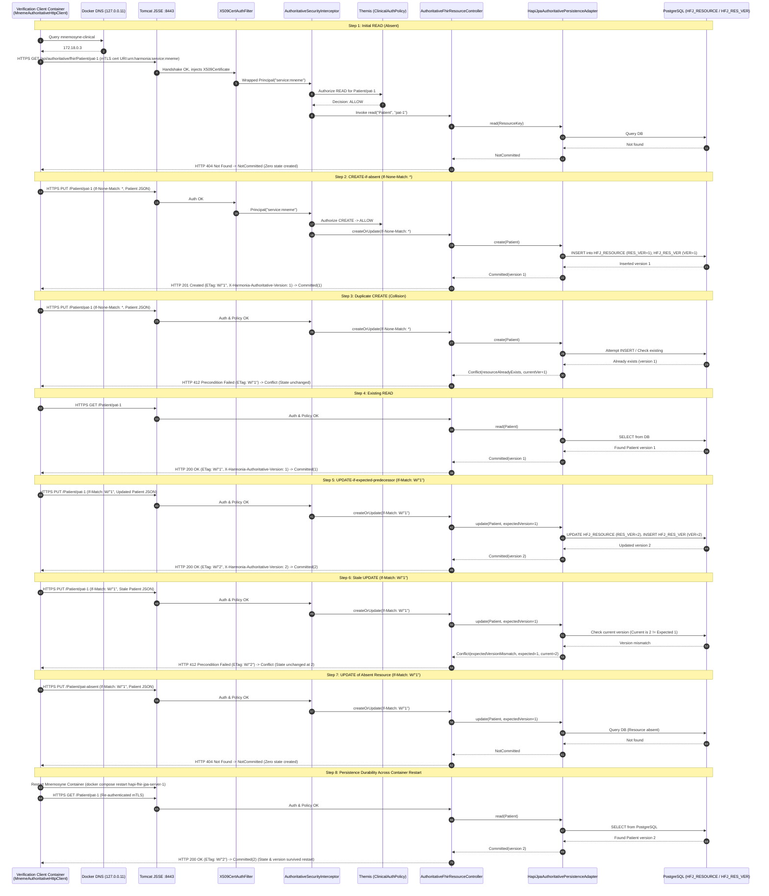

# Requirements

### Overview & Goals

Milestone **M2.4 (Distributed Authoritative-Path Verification)** proves that Mneme's existing `MnemeAuthoritativeHttpClient` correctly executes the established Mnemosyne authoritative point-access semantics across the real authenticated Docker deployment boundary (`https://mnemosyne-clinical:8443/api/authoritative/fhir/{resourceType}/{id}`).

Building directly on the accepted baseline:
- **M1**: Stable Docker Runtime Baseline
- **M2.1**: Mnemosyne Authoritative Point Persistence
- **Step 3.3 / M2.2**: Distributed Authoritative Path & Network Boundary Isolation
- **M2.3**: Mutual TLS (mTLS) Deployment-Level Transport Authentication & Normative SAN URI Identity Mapping

M2.4 proves that authoritative point persistence, optimistic locking, version progression, and conflict semantics operate deterministically through the authenticated mTLS Docker bridge network without host port traversal, while strictly preserving version domain separation and failure classification discipline.

### Scope

- **In Scope (M2.4)**:
  - Extending the existing verification harness (`DistributedAuthoritativeDockerPathTest.java`) to execute the complete authoritative point-access semantic cycle using real `MnemeAuthoritativeHttpClient`.
  - Verifying the 7-step semantic sequence across the real Docker network (`harmonia-network`) with Docker DNS (`mnemosyne-clinical:8443`):
    1. Initial READ of absent resource -> `HTTP 404` -> `AuthoritativePersistenceResult.NotCommitted` (zero state created).
    2. Conditional CREATE-if-absent (`If-None-Match: *`) -> `HTTP 201` -> `AuthoritativePersistenceResult.Committed(version 1)`, headers `X-Harmonia-Authoritative-Version: 1` and `ETag: W/"1"`, validated by follow-up READ.
    3. Duplicate CREATE collision (`If-None-Match: *`) -> `HTTP 412` -> `AuthoritativePersistenceResult.Conflict(resourceAlreadyExists)`, state and version 1 remain unchanged.
    4. Existing READ -> `HTTP 200` -> `AuthoritativePersistenceResult.Committed(version 1)` with valid FHIR resource and ETag.
    5. Predecessor UPDATE (`If-Match: W/"1"`) -> `HTTP 200` -> `AuthoritativePersistenceResult.Committed(version 2)`, headers `X-Harmonia-Authoritative-Version: 2` and `ETag: W/"2"`.
    6. Stale UPDATE collision (`If-Match: W/"1"`) -> `HTTP 412` -> `AuthoritativePersistenceResult.Conflict(expectedVersionMismatch)`, state and version 2 remain unchanged.
    7. Absent UPDATE (`If-Match: W/"1"` on non-existent resource) -> `HTTP 404` -> `AuthoritativePersistenceResult.NotCommitted` (zero state created).
  - Verifying PostgreSQL durability and restart recovery (CREATE -> UPDATE -> Mnemosyne restart -> authenticated READ -> version 2 state intact).
  - Preserving strict 4-way version domain separation (no fallback to FHIR `meta.versionId`, no cache token arithmetic).
  - Preserving failure classifications (`Committed`, `Conflict`, `NotCommitted`, `OutcomeUnknown`) with zero blind retries on mutating requests.
  - Documentation and repository housekeeping (replace "Pre-network/Pre-HTTP" with "pre-authoritative-HTTP-transmission", correct DELETE policy documentation, exclude `.pki/` in `.gitignore`, update master convergence plan to M2.4 COMPLETE).

- **Out of Scope (Explicit Exclusions)**:
  - Implementing `DefaultGovernedReader` or `DefaultGovernedWriter` (deferred to Milestone M3).
  - Application-facing Governed Access wiring / Application migration (deferred to Milestone M3 / M4).
  - Search or batch operations (deferred to Milestone M5).
  - Modifying public `/fhir/*` endpoints (`JpaRestfulServer`).
  - Introducing physical DELETE semantics.
  - Modifying Themis authorization policies or service principal authorities.

### Architectural Invariants & Axiom Alignment

1. **AX-01 (Explicit Authority & Boundary Integrity)**:
   - Client identity is established exclusively via X.509 URI SAN `urn:harmonia:service:mneme`, mapped to `service:mneme`, and evaluated by Themis `ClinicalAuthorizationPolicy`.
2. **AX-05 (State Separation & Durable Truth)**:
   - Mnemosyne alone establishes authoritative durable state in PostgreSQL (`HFJ_RESOURCE`, `HFJ_RES_VER`).
   - Mneme active cache state (Infinispan) is strictly active/reconstructable and never authoritative.
3. **AX-13 (Interoperability & Wire Encapsulation)**:
   - HTTP conditional headers (`If-None-Match: *`, `If-Match: W/"<version>"`) and response headers (`ETag`, `X-Harmonia-Authoritative-Version`) act as wire representations of the explicit authoritative version contract, not a redefinition of internal domains.
4. **Version Domain Discipline**:
   - Explicit domain boundaries maintained between:
     1. FHIR `meta.versionId`
     2. HTTP `ETag`
     3. Mneme active-state token
     4. Mnemosyne `AuthoritativeVersion`
   - Zero fallback from `AuthoritativeVersion` to `meta.versionId` or cache tokens.
5. **Failure Classification Discipline**:
   - `Committed`: Successful mutation / read with authoritative version confirmed.
   - `Conflict`: Precondition failure / collision on server (`HTTP 412 Precondition Failed` on duplicate CREATE or stale UPDATE) with zero state change.
   - `NotCommitted`: Known failure demonstrably occurring without mutation (`HTTP 404 Not Found` on absent READ or UPDATE, `HTTP 401/403/400`, pre-authoritative-HTTP-transmission TLS failure).
   - `OutcomeUnknown`: Indeterminate post-transmission network/stream failure; zero automatic retry on mutations.

# Technical Design

### Current Implementation Context

The distributed authoritative architecture is already implemented across `hestia/mneme-persistence`, `hestia/mnemosyne-clinical`, and `themis/themis-core`:
- **Client**: `MnemeAuthoritativeHttpClient` configured with `MnemeAuthoritativeClientConfig.ofTls(...)` using JDK 21 `HttpClient` and `SslContextFactory`.
- **Network Boundary**: Multi-container Docker bridge network `harmonia_harmonia-network` resolving `mnemosyne-clinical:8443` via internal Docker DNS (`127.0.0.11 -> 172.18.0.3`).
- **Transport Auth**: Spring Boot embedded Tomcat TLS enforcing `server.ssl.client-auth=need`.
- **Identity Filter**: `X509CertificateAuthenticationFilter` extracts `jakarta.servlet.request.X509Certificate`, delegates to `CertificateServiceIdentityMapper` for URI SAN `urn:harmonia:service:mneme`, and binds `Principal("service:mneme")`.
- **Security Interceptor**: `AuthoritativeSecurityInterceptor` ingests `request.getUserPrincipal()`, resolves `HarmoniaServiceIdentities.PRINCIPAL_MNEME`, and evaluates Themis `ClinicalAuthorizationPolicy`.
- **Controller**: `AuthoritativeFhirResourceController` handles point `GET` and `PUT` at `/api/authoritative/fhir/{resourceType}/{id}`.
- **Persistence Adapter**: `HapiJpaAuthoritativePersistenceAdapter` executes transactional operations on PostgreSQL with atomic optimistic locking.

### Key Decisions

1. **Reuse Existing Deployment Verification Harness**:
   - Extend `DistributedAuthoritativeDockerPathTest.java` in `hestia/mneme-persistence` rather than creating temporary scripts or ad-hoc runtimes.
   - Execute tests inside a container attached to `harmonia_harmonia-network` targeting direct Docker DNS `https://mnemosyne-clinical:8443` without host port mapping (`localhost:8443`).
2. **Deterministic Sequence-Based Semantic Proof**:
   - Use a unique test resource identifier (`Patient/pat-m24-{uuid}`) to ensure total test isolation and determinism across the 7-step sequence and restart durability proof.
3. **Explicit Header & Version Mapping**:
   - Client sends `If-None-Match: *` for CREATE, `If-Match: W/"{version}"` for UPDATE.
   - Server returns `ETag: W/"{version}"` and diagnostic `X-Harmonia-Authoritative-Version: {version}`.
   - Client validates consistency between `ETag` and `X-Harmonia-Authoritative-Version` and constructs `AuthoritativeVersion`.

### Architecture & Runtime Flow



### File Structure & Changes

| File / Component | Module | Action | Description |
| :--- | :--- | :--- | :--- |
| `DistributedAuthoritativeDockerPathTest.java` | `hestia/mneme-persistence` | **Modify** | Add complete nested test suite `M24DistributedAuthoritativePathSemanticTests` asserting Steps 1–8 over mTLS and Docker DNS. |
| `.gitignore` | Root | **Modify** | Add `.pki/` to exclude development PKI private keys/keystores from Git tracking. |
| `harmonia-convergence-runtime-integration-plan.md` | `docs/implementation` | **Modify** | Update M2.4 status to `COMPLETE / CONFORMANT`, replace "Pre-network/Pre-HTTP" terminology with "pre-authoritative-HTTP-transmission", correct DELETE policy documentation, and set M3 as next milestone. |

# Testing

### Validation Approach

Verification is performed at two complementary levels:
1. **Automated Unit & WireMock Suite**:
   - `MnemeAuthoritativeHttpClientTest` and `MnemeAuthoritativeHttpClientMtlsTest` asserting wire headers, version resolutions, and transport failure classifications in isolation.
   - `AuthoritativeFhirResourceControllerTest` and `AuthoritativeFhirResourceControllerSecurityTest` asserting server-side status codes, headers, and fail-closed security.
2. **Distributed Cross-Container Docker Boundary Suite**:
   - Executed from a client container on `harmonia_harmonia-network` resolving `mnemosyne-clinical:8443` over Docker DNS with mTLS client certificates.
   - Proves end-to-end traversal from JDK `HttpClient` through JSSE mTLS, `X509CertificateAuthenticationFilter`, `AuthoritativeSecurityInterceptor`, Themis, `AuthoritativeFhirResourceController`, `HapiJpaAuthoritativePersistenceAdapter`, to PostgreSQL.

### Key Scenarios (Step-by-Step Matrix)

| Step | Operation | Target Endpoint | Precondition / Headers | Expected HTTP Status | ETag / X-Authoritative-Version | Client Result Type | Expected Database State |
| :--- | :--- | :--- | :--- | :--- | :--- | :--- | :--- |
| **1. Initial READ** | GET | `/api/authoritative/fhir/Patient/pat-m24-{uuid}` | `Accept: application/fhir+json` | `404 Not Found` | None | `NotCommitted` | Zero rows in `HFJ_RESOURCE` |
| **2. CREATE** | PUT | `/api/authoritative/fhir/Patient/pat-m24-{uuid}` | `If-None-Match: *`, Patient JSON | `201 Created` | `W/"1"` / `1` | `Committed(1)` | Row inserted in `HFJ_RESOURCE` (version 1), 1 row in `HFJ_RES_VER` |
| **3. Duplicate CREATE** | PUT | `/api/authoritative/fhir/Patient/pat-m24-{uuid}` | `If-None-Match: *`, Patient JSON | `412 Precondition Failed` | `W/"1"` / `1` | `Conflict(resourceAlreadyExists)` | `HFJ_RESOURCE` remains version 1 |
| **4. Existing READ** | GET | `/api/authoritative/fhir/Patient/pat-m24-{uuid}` | `Accept: application/fhir+json` | `200 OK` | `W/"1"` / `1` | `Committed(1)` | Verified matching resource payload |
| **5. UPDATE** | PUT | `/api/authoritative/fhir/Patient/pat-m24-{uuid}` | `If-Match: W/"1"`, Updated JSON | `200 OK` | `W/"2"` / `2` | `Committed(2)` | `HFJ_RESOURCE` updated to version 2, 2 rows in `HFJ_RES_VER` |
| **6. Stale UPDATE** | PUT | `/api/authoritative/fhir/Patient/pat-m24-{uuid}` | `If-Match: W/"1"`, Stale JSON | `412 Precondition Failed` | `W/"2"` / `2` | `Conflict(expectedVersionMismatch)` | `HFJ_RESOURCE` remains version 2 |
| **7. Absent UPDATE** | PUT | `/api/authoritative/fhir/Patient/pat-m24-absent` | `If-Match: W/"1"`, Patient JSON | `404 Not Found` | None | `NotCommitted` | Zero rows in `HFJ_RESOURCE` for absent key |
| **8. Restart Durability** | GET (post-restart) | `/api/authoritative/fhir/Patient/pat-m24-{uuid}` | `Accept: application/fhir+json` | `200 OK` | `W/"2"` / `2` | `Committed(2)` | Recovered version 2 state directly from PostgreSQL |

### Edge Cases & Failure Permutations

- **Pre-authoritative-HTTP-transmission TLS Handshake Failures**: Untrusted client cert, missing cert, or invalid truststore reject at JSSE layer -> mapped safely to `AuthoritativePersistenceResult.NotCommitted`.
- **In-flight / Post-transmission Socket Resets**: Dropped TCP connection during response read -> mapped conservatively to `AuthoritativePersistenceResult.OutcomeUnknown` with zero automatic retry.
- **Fail-Closed Security**: Client with wrong SAN URI (`urn:harmonia:service:other`) -> rejected fail-closed with HTTP 401 Unauthorized -> `AuthoritativePersistenceResult.NotCommitted`.

### Conformance & ArchUnit Verification

All architecture rules and invariants must pass cleanly:
```bash
mvn test -pl paradeigma/paradeigma-test -am -Dtest="*ArchitectureTest"
```
Ensuring:
- Zero Paradeigma leakage into production modules (`ParadeigmaIsolationArchitectureTest`).
- Strict Presentation decoupling from JPA/PostgreSQL (`IrisDecouplingArchitectureTest`).
- Pure Petasos API abstraction (`PetasosApiIsolationArchitectureTest`).
- Unidirectional package layering and security boundary enforcement (`PackageLayeringArchitectureTest`, `SecurityEnforcementArchitectureTest`).

# Delivery Steps

### ✓ Step 1: Implement M2.4 Distributed Semantic Verification Scenarios in Harness
The test harness in `hestia/mneme-persistence` contains dedicated, executable integration tests exercising the complete 8-step authoritative semantic sequence over authenticated mTLS.

- Extend `DistributedAuthoritativeDockerPathTest.java` with a dedicated nested class `M24DistributedAuthoritativePathSemanticTests` executing:
  - **Step 1: Initial READ (Absent)**: Expects HTTP 404, maps to `AuthoritativePersistenceResult.NotCommitted`, asserts zero database mutations.
  - **Step 2: CREATE-if-absent**: PUT with `If-None-Match: *`, expects HTTP 201, `X-Harmonia-Authoritative-Version: 1`, `ETag: W/"1"`, `AuthoritativePersistenceResult.Committed`, followed by verification READ.
  - **Step 3: Duplicate CREATE**: PUT with `If-None-Match: *` against existing key, expects HTTP 412, `AuthoritativePersistenceResult.Conflict(resourceAlreadyExists)`, confirms existing state and version 1 remain unchanged.
  - **Step 4: Existing READ**: GET, expects HTTP 200, valid resource payload, `AuthoritativePersistenceResult.Committed(version 1)`.
  - **Step 5: Predecessor UPDATE**: PUT with `If-Match: W/"1"`, expects HTTP 200, `X-Harmonia-Authoritative-Version: 2`, `ETag: W/"2"`, `AuthoritativePersistenceResult.Committed(version 2)`.
  - **Step 6: Stale UPDATE**: PUT with stale `If-Match: W/"1"` against version 2 resource, expects HTTP 412, `AuthoritativePersistenceResult.Conflict(expectedVersionMismatch)`, confirms version 2 remains intact via follow-up READ.
  - **Step 7: Absent UPDATE**: PUT with `If-Match: W/"1"` against non-existent resource, expects HTTP 404, `AuthoritativePersistenceResult.NotCommitted`, confirms no state is created.
- Ensure all test assertions maintain explicit 4-way version domain discipline without falling back to FHIR `meta.versionId` or cache tokens.

### ✓ Step 2: Execute End-to-End Docker Network Semantic Proof & Durability Verification
The complete semantic suite and persistence durability tests execute and pass from an authenticated Docker container attached to `harmonia-network` targeting `https://mnemosyne-clinical:8443`.

- Start the Docker Compose topology (`harmonia-postgres-1`, `harmonia-hapi-fhir-1` with mTLS enabled on port 8443).
- Launch the verification test container attached directly to `harmonia_harmonia-network` with mounted PKI client keystores/truststores.
- Execute the full semantic sequence (Steps 1–7) over the real mTLS network boundary using Docker DNS (`https://mnemosyne-clinical:8443/api/authoritative/fhir/Patient/{id}`).
- Execute **Step 8: Persistence Durability & Restart Verification**:
  - Perform CREATE and UPDATE across Docker network boundary to establish version 2 in PostgreSQL.
  - Restart the Mnemosyne container (`harmonia-hapi-fhir-1`).
  - Execute authenticated READ across Docker network boundary after restart and prove state and version 2 are recovered intact from PostgreSQL.
- Collect and verify diagnostic logs: source container IP, Docker DNS resolution (`172.18.0.3:8443`), TLS handshake logs, `X509CertificateAuthenticationFilter` principal extraction, `AuthoritativeSecurityInterceptor` ingestion, Themis policy evaluation, controller status, headers, and persistence results.

### ✓ Step 3: Housekeeping, Documentation Alignment, and Master Plan Conformance Update
Repository configuration, housekeeping items, convergence documentation, and architecture tests are completely updated and verified.

- Update `.gitignore` to ensure `.pki/` is explicitly ignored and generated keystore/truststore files are prevented from being committed as repository artifacts.
- Perform documentation housekeeping in `docs/implementation/harmonia-convergence-runtime-integration-plan.md` and related reports:
  - Replace occurrences of "Pre-network/Pre-HTTP" with "pre-authoritative-HTTP-transmission" for precise TLS failure classification.
  - Correct examples regarding `service:mneme` and `DELETE` (clarifying that DELETE is rejected by `ClinicalAuthorizationPolicy` because physical deletion is prohibited on clinical resources, while preserving existing Themis authorities).
- Update `docs/implementation/harmonia-convergence-runtime-integration-plan.md` to record Milestone M2.4 status as `COMPLETE / CONFORMANT` and set next authorized milestone to `M3 — Governed Access Integration`.
- Execute full unit test suite in `hestia/mneme-persistence` and `hestia/mnemosyne-clinical`, and execute repository-wide ArchUnit test suite (`paradeigma-test`) to ensure zero architectural regressions.