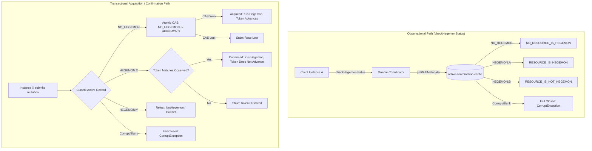

# Requirements

### Overview & Goals
Milestone M3.2 establishes the **Active Hegemon** pattern and integrates the **Calliope Alignment Seam** within Mneme's active-state coordination layer. In distributed clinical environments, multiple in-memory or cached instances of a managed resource may exist simultaneously across clients and services.

This bounded increment implements and proves the **Mneme-side Active-Hegemony primitives** to maximize operational throughput and ensure fail-closed coordination integrity:
- **Active Hegemony vs Authoritative State**: Active Hegemony represents active precedence within Mneme. Authoritative state represents durable state established by Mnemosyne. These are related but independent concepts.
- **Pre-Persistence Hegemony Rule**: When Mneme accepts a governed mutation for a resource instance, Mneme SHALL transactionally establish or confirm that instance as the Active Hegemon before authoritative persistence is attempted. This ensures concurrent clients observe which instance has active precedence while mutation is underway.
- **Authority Independence**: Establishment of Active Hegemony grants active precedence within Mneme. It does not establish authoritative durable state. Mnemosyne independently determines whether the governed mutation establishes new authoritative state.
- **Semantic Active-State Generation Discipline**:
  - `NO_HEGEMON + X -> HEGEMON:X`: Semantic Active-State transition. Hot Rod entry generation / `ActiveStateToken` advances atomically via CAS. Returns `Acquired(newToken)`.
  - `HEGEMON:X + X -> X confirmed as existing Hegemon`: NO semantic Active-State transition. Token/generation MUST NOT advance merely to confirm Hegemony. Handled via cheap observation/validation without cache mutation. Returns `Confirmed(confirmedToken)`.
  - `HEGEMON:Y + X -> X is not Hegemon`: Reject / report non-Hegemon. Token/generation does not advance. Returns `NotHegemon`.
- **Observable Hegemony Invariant**: Once Hegemony has become observable, it must NOT simply be erased as though it never existed because a later persistence operation failed. Recovery and reconciliation following persistence failure (`NotCommitted`, `OutcomeUnknown`, or degraded convergence) is deferred to a subsequent design task.
- **Non-Mutating Operations**: Reads, active-state observations (`checkHegemonStatus`), and refreshes do not establish, alter, or clear the Active Hegemon.
- **No Participating-Instance Registry**: Mneme maintains no registry of participating instances. `InstanceId` is opaque management metadata, conveying no client identity, lease, heartbeat, or durable identity.
- **Single Coordination Record**: Active-state coordination uses a single cache-resident record associated with `ResourceKey` in `active-coordination-cache`, encoding explicit `NO_HEGEMON` or `HEGEMON:<instance-id>` state with entry-version token semantics.
- **Cheap Common Path**: Once an Active Hegemon exists, mutation from that instance remains cheap (read-validation without cache rewrite). Reconciliation is exceptional. Non-Hegemon mutations are detected; Calliope reconciliation is deferred to a subsequent step.

### Scope
- **In Scope (Current Bounded Increment)**:
  - `ResourceHegemonStatus` enum (`NO_RESOURCE_IS_HEGEMON`, `RESOURCE_IS_HEGEMON`, `RESOURCE_IS_NOT_HEGEMON`).
  - Fail-closed `ActiveCoordinationRecord` record with explicit `NO_HEGEMON` and `HEGEMON:<uuid>` encoding, and 6-state fail-closed decoding under AX-14/AX-15.
  - Observational `ResourceHegemonStatus checkHegemonStatus(ResourceKey key, InstanceId instanceId)` via `getWithMetadata`.
  - Transactional Hegemony acquisition (`NO_HEGEMON -> HEGEMON:X`) using Hot Rod CAS (`replaceWithVersion`) advancing token generation.
  - Read-validated Hegemony confirmation (`HEGEMON:X + X`) verifying record and token currency without advancing entry generation or rewriting cache.
  - `HegemonyCoordinationResult` sealed hierarchy (`Acquired(newToken)`, `Confirmed(confirmedToken)`, `NotHegemon`, `Stale`, `Unavailable`).
  - Concurrency test proving exactly one winner on concurrent `NO_HEGEMON -> HEGEMON` race.
  - Unit and contract tests proving existing Hegemon confirmation, non-Hegemon rejection, and fail-closed corrupt parsing.
- **Out of Scope**:
  - Integrating Hegemony lifecycle into `DefaultGovernedWriter` (deferred to next step).
  - Calliope alignment evaluation or destructive merge (`checkAlignment` / `mergeResource`).
  - Hegemony rollback or recovery on persistence failure (`clearHegemonOnFailure`, `rollbackHegemon`).
  - Resource refresh APIs (`refreshHegemon()`, `getHegemonResource()`).
  - Client/instance registries, leases, heartbeats, or participant tracking.
  - Modifying Mnemosyne durable persistence or attempting distributed transactions.

### Architectural Authority & Invariants
- **AX-05 (Active State vs Authoritative Durable State)**: Mneme manages active distributed use; Mnemosyne alone establishes authoritative durable state. Hegemony provides active precedence, not durable truth.
- **AX-14 (Semantic Distinctions Are Preserved)**: A valid `NO_HEGEMON` state is semantically distinct from blank, corrupt, or unrecognised coordination data. Blank, malformed, or unknown state fails closed; it must never be treated as `NO_RESOURCE_IS_HEGEMON`.
- **AX-15 (Uncertainty Preserved Until Resolved)**: Corrupt or uninterpretable active state fails closed rather than manufacturing uncoordinated state.
- **Ergo Delayed-Execution Resource Principle**: An Ergo activity operates upon the governed state of managed resources as it exists at the instant the activity executes. Scheduled activities do not preserve transient Mneme state (`InstanceId`, `ActiveHegemon`, `ActiveStateToken`).

### User Stories
- **As a client holding a managed resource instance**, I want to cheaply observe whether my instance is the Active Hegemon via `checkHegemonStatus(...)` without mutating active state or registering with the cluster.
- **As a governed writer**, I want to transactionally establish Hegemony (when none exists) or validate existing Hegemony before attempting persistence so that active precedence is verified atomically without multi-cache locking or false token increments.
- **As a distributed cluster**, I want concurrent Hegemony acquisition races to permit exactly one winner and fail closed on corrupt coordination data, preserving system integrity.

### Functional Requirements
1. **Resource Hegemon Status API**: Mneme exposes `ResourceHegemonStatus checkHegemonStatus(ResourceKey key, InstanceId instanceId)`. Returns `NO_RESOURCE_IS_HEGEMON`, `RESOURCE_IS_HEGEMON`, or `RESOURCE_IS_NOT_HEGEMON`. Strictly observational; zero cache writes, zero Calliope invocation, zero persistence.
2. **No Participating-Instance Registry**: Mneme maintains no client registries, leases, or heartbeats. `InstanceId` is opaque management metadata.
3. **Active Hegemon Metadata Placement**: `ActiveHegemon` belongs strictly to Mneme active state associated with `ResourceKey`. Never added to FHIR resources, managed information content, or Mnemosyne durable persistence.
4. **Pre-Persistence Hegemony Acquisition & Validation**: When Mneme accepts a governed mutation for a resource instance, Mneme transactionally establishes or confirms that instance as the Active Hegemon before persistence is attempted.
5. **Transactional Hegemony Operation Semantics**:
   - If resource currently has `NO_HEGEMON`: atomically establish submitting instance as Hegemon (`NO_HEGEMON -> HEGEMON:X`) via CAS `replaceWithVersion`. Token advances; returns `Acquired(newToken)`.
   - If submitting instance is already Hegemon (`HEGEMON:X`): confirm Hegemony via observation/validation of record and token currency. Zero cache writes; token does NOT advance; returns `Confirmed(confirmedToken)`.
   - If another instance is Hegemon (`HEGEMON:Y`): report `NotHegemon` / conflict without overwriting existing Hegemon or advancing token.
   - If observed token is stale: reject with `Stale` using optimistic concurrency semantics.
   - If data is corrupt or uninterpretable: fail closed with `ActiveCoordinationCorruptException`.
6. **Active-State Coordination Record Encoding**:
   - Single cache entry in `active-coordination-cache` encoding `NO_HEGEMON` or `HEGEMON:<instance-id>`.
   - Strict decoding across 6 states:
     a. *Absent coordination entry*: cold key -> treated as `NO_RESOURCE_IS_HEGEMON` on check; observe seeds `NO_HEGEMON`.
     b. *Valid `NO_HEGEMON` state*: returns `NO_RESOURCE_IS_HEGEMON`.
     c. *Valid `HEGEMON:<id>` state*: returns `RESOURCE_IS_HEGEMON` if ID matches, else `RESOURCE_IS_NOT_HEGEMON`.
     d. *Blank / whitespace state*: fails closed under AX-14/AX-15.
     e. *Malformed InstanceId*: fails closed under AX-14/AX-15.
     f. *Unknown / unrecognised encoding*: fails closed under AX-14/AX-15.
7. **Refresh Separation**: Normal Mneme resource access capability. No `refreshHegemon()` or `getHegemonResource()` API.
8. **Calliope Reconciliation Deferred**: Detects non-Hegemon status; defers `checkAlignment` and `mergeResource`.

# Technical Design

### Current Implementation
- **Step 1 Completed**: `InstanceId` and `ActiveHegemon` value records exist in `hestia/mneme-cluster` (`net.fhirfactory.harmonia.hestia.mneme.coordination`). `ResourceAlignmentPort` and `AlignmentAssessment` sealed hierarchy exist in `calliope` (`net.fhirfactory.harmonia.model.alignment`).
- **Coordination Storage**: `HotRodActiveStateCoordinator` operates over `active-coordination-cache` storing string markers and entry versions providing `ActiveStateToken`.
- **Governed Writer**: `DefaultGovernedWriter` currently consumes tokens using the legacy `"ACTIVE"` marker before persistence.

### Key Decisions
1. **Pre-Persistence Hegemony Establishment & Confirmation**:
   - Establishing Active Hegemony grants active precedence within Mneme prior to authoritative persistence.
   - Concurrent clients observe which instance holds active precedence while mutation is underway.
2. **Read-Validated Existing-Hegemon Confirmation (Zero False Token Generation)**:
   - For an existing Hegemon X (`HEGEMON:X`), confirming Hegemony does NOT execute `replaceWithVersion(cacheKey, "HEGEMON:X", version)`.
   - In Hot Rod, any cache write increments entry metadata version, which would manufacture a false Active-State generation.
   - Confirmation is achieved by observing via `getWithMetadata` that the record is `HEGEMON:X` and that `meta.getVersion() == observedToken.version`.
   - This provides atomic validation that active state has not diverged without modifying cache or advancing `ActiveStateToken`.
3. **Atomic CAS Acquisition for First Hegemon (`NO_HEGEMON -> HEGEMON:X`)**:
   - When no Hegemon exists, establishing Hegemony is a genuine semantic Active-State transition.
   - Executed via `replaceWithVersion(cacheKey, "HEGEMON:" + instanceId.value(), observedVersion)`.
   - When CAS succeeds, entry version advances, generating `Acquired(newToken)`.
   - Concurrent attempts race via native Hot Rod optimistic concurrency; exactly one wins.
4. **Single Coordination Record with Explicit Encoding**:
   - Replaces legacy `"ACTIVE"` marker with `NO_HEGEMON` and `HEGEMON:<uuid>`.
   - The Hot Rod entry version continues to provide the `ActiveStateToken`, ensuring atomic progression without secondary caches.
5. **Fail-Closed Record Parsing (AX-14 & AX-15)**:
   - Blank, malformed, or unrecognised cache values throw `ActiveCoordinationCorruptException`.
   - Corrupt state is never silently interpreted as `NO_RESOURCE_IS_HEGEMON`.
6. **Non-Mutating Observational Status**:
   - `checkHegemonStatus(key, instanceId)` uses `getWithMetadata(cacheKey)` with zero cache mutations or token consumption.
   - Does not expose the current Hegemon's identity to consumer-facing callers.

### Data Models & Contracts
```java
package net.fhirfactory.harmonia.hestia.mneme.coordination;

public enum ResourceHegemonStatus {
    NO_RESOURCE_IS_HEGEMON,
    RESOURCE_IS_HEGEMON,
    RESOURCE_IS_NOT_HEGEMON
}
```

```java
package net.fhirfactory.harmonia.hestia.mneme.coordination;

import java.io.Serializable;
import java.util.Objects;
import java.util.UUID;

public record ActiveCoordinationRecord(ActiveHegemon activeHegemon) implements Serializable {
    public static final String NO_HEGEMON_MARKER = "NO_HEGEMON";
    public static final String HEGEMON_PREFIX = "HEGEMON:";

    public static ActiveCoordinationRecord none() {
        return new ActiveCoordinationRecord(ActiveHegemon.none());
    }

    public static ActiveCoordinationRecord of(InstanceId id) {
        return new ActiveCoordinationRecord(ActiveHegemon.of(id));
    }

    public String encode() {
        if (activeHegemon == null || !activeHegemon.isPresent()) {
            return NO_HEGEMON_MARKER;
        }
        return HEGEMON_PREFIX + activeHegemon.instanceId().value().toString();
    }

    public static ActiveCoordinationRecord decode(String raw) {
        if (raw == null || raw.isBlank()) {
            throw new ActiveCoordinationCorruptException("Active coordination record is blank or null");
        }
        String trimmed = raw.trim();
        if (NO_HEGEMON_MARKER.equals(trimmed)) {
            return none();
        }
        if (trimmed.startsWith(HEGEMON_PREFIX)) {
            String uuidStr = trimmed.substring(HEGEMON_PREFIX.length()).trim();
            try {
                UUID uuid = UUID.fromString(uuidStr);
                return of(InstanceId.of(uuid));
            } catch (IllegalArgumentException e) {
                throw new ActiveCoordinationCorruptException("Malformed InstanceId in coordination record: " + trimmed, e);
            }
        }
        throw new ActiveCoordinationCorruptException("Unrecognised active coordination record encoding: " + trimmed);
    }
}
```

```java
package net.fhirfactory.harmonia.hestia.mneme.coordination;

import net.fhirfactory.harmonia.model.governedwrite.ActiveStateToken;

public sealed interface HegemonyCoordinationResult {
    record Acquired(ActiveStateToken newToken) implements HegemonyCoordinationResult {}
    record Confirmed(ActiveStateToken confirmedToken) implements HegemonyCoordinationResult {}
    record NotHegemon(String message) implements HegemonyCoordinationResult {}
    record Stale(String message) implements HegemonyCoordinationResult {}
    record Unavailable(String message) implements HegemonyCoordinationResult {}
}
```

```java
package net.fhirfactory.harmonia.hestia.mneme.coordination;

import net.fhirfactory.harmonia.model.governedwrite.ActiveStateCoordinator;
import net.fhirfactory.harmonia.model.governedwrite.ActiveStateToken;
import net.fhirfactory.harmonia.model.governedwrite.ResourceKey;

public interface MnemeActiveStateCoordinator extends ActiveStateCoordinator {
    ResourceHegemonStatus checkHegemonStatus(ResourceKey key, InstanceId instanceId);
    HegemonyCoordinationResult acquireOrConfirmHegemony(ResourceKey key, InstanceId instanceId, ActiveStateToken observedToken);
}
```

### Architecture Diagram


### File Structure Changes
- `hestia/mneme-cluster`:
  - Add `ResourceHegemonStatus.java` in `net.fhirfactory.harmonia.hestia.mneme.coordination`.
  - Add `ActiveCoordinationRecord.java` and `ActiveCoordinationCorruptException.java` in `net.fhirfactory.harmonia.hestia.mneme.coordination`.
  - Add `HegemonyCoordinationResult.java` in `net.fhirfactory.harmonia.hestia.mneme.coordination`.
  - Add `MnemeActiveStateCoordinator.java` in `net.fhirfactory.harmonia.hestia.mneme.coordination`.
  - Update `HotRodActiveStateCoordinator.java` to implement `MnemeActiveStateCoordinator`, use explicit `NO_HEGEMON`/`HEGEMON:<id>` encoding, and implement `checkHegemonStatus` and `acquireOrConfirmHegemony`.

# Testing

### Validation Approach
Verification follows bounded test execution across unit, concurrency, and architecture tests. All results are classified strictly as PASS, FAIL, TIMEOUT, STALLED, or UNRESOLVED.

### Key Scenarios (Acceptance Criteria A–J)
- **A. No-Hegemon status observation**: Active state has no Hegemon; observation by Instance A reports `NO_RESOURCE_IS_HEGEMON`; active cache remains completely unmodified.
- **B. First Hegemon acquisition from NO_HEGEMON**: Active state has `NO_HEGEMON`; Instance A attempts acquisition with valid observed token; atomically transitions to `HEGEMON:A` returning `Acquired(newToken)` with advanced generation.
- **C. Stale token rejection**: Instance A attempts acquisition with an outdated token version; CAS fails and returns `Stale`.
- **D. Existing-Hegemon happy path confirmation**: A is Active Hegemon; observation reports `RESOURCE_IS_HEGEMON`; A executes `acquireOrConfirmHegemony`; validates record and token without write or generation increment; returns `Confirmed(confirmedToken)`; inexpensive path with zero Calliope/Mnemosyne calls.
- **E. Non-Hegemon observation**: A is Active Hegemon; Instance B checks status via `checkHegemonStatus(key, B)`; reports `RESOURCE_IS_NOT_HEGEMON`; cache unmodified.
- **F. Non-Hegemon acquisition rejected**: A is Active Hegemon; Instance B attempts acquisition; returns `NotHegemon`; existing `HEGEMON:A` record remains unchanged; token does not advance.
- **G. Concurrent first acquisition race (Crucial Race Proof)**: Resource R initially has `NO_HEGEMON`. Instance X and Instance Y concurrently attempt acquisition with the observed token. Exactly one wins the transition (`NO_HEGEMON -> HEGEMON:X` or `NO_HEGEMON -> HEGEMON:Y`), never both. The loser observes `RESOURCE_IS_NOT_HEGEMON` or `Stale`. Mnemosyne is not involved.
- **H. Corrupt/unknown coordination state**: Cache contains blank, whitespace, malformed UUID, or unknown encoding (e.g. legacy `"ACTIVE"`); decode fails closed with `ActiveCoordinationCorruptException`; never treated as `NO_RESOURCE_IS_HEGEMON`.
- **I. Architectural separation**: Verify that `ActiveHegemon` is not added to FHIR resources, no participant registry is introduced, and Calliope contracts remain decoupled from active-state coordination.

### Test Changes
- `hestia/mneme-cluster`:
  - Add `ActiveCoordinationRecordTest` testing all 6 encoding/decoding states and fail-closed corrupt exceptions.
  - Add `HotRodActiveStateCoordinatorTest` testing Scenarios A, B, C, D, E, F, and H.
  - Add `HotRodActiveStateCoordinatorConcurrencyTest` testing Scenario G (concurrent NO_HEGEMON race with multi-threaded executor).
- `paradeigma/paradeigma-test`:
  - Verify that `GovernedWriteContractArchitectureTest` and all architecture tests pass.

# Delivery Steps

### ✓ Step 1: Implement Active Coordination Models and Result Hierarchy
Implement `ResourceHegemonStatus`, `ActiveCoordinationRecord`, `ActiveCoordinationCorruptException`, `HegemonyCoordinationResult`, and `MnemeActiveStateCoordinator` in `hestia/mneme-cluster`.

### ✓ Step 2: Implement MnemeActiveStateCoordinator in HotRodActiveStateCoordinator
Update `HotRodActiveStateCoordinator` to implement `MnemeActiveStateCoordinator`, using explicit `NO_HEGEMON`/`HEGEMON:<id>` encoding, observational status check via `getWithMetadata`, and CAS-based acquisition / read-validated confirmation.

### ✓ Step 3: Implement Unit and Contract Tests
Implement `ActiveCoordinationRecordTest` testing all 6 states and fail-closed corrupt cases, and `HotRodActiveStateCoordinatorTest` testing Scenarios A, B, C, D, E, F, and H.

### ✓ Step 4: Implement Concurrency Race Proof and Execute Verification Suite
Implement `HotRodActiveStateCoordinatorConcurrencyTest` proving exactly one winner on concurrent `NO_HEGEMON` acquisition, and execute bounded test and architecture verification suites.