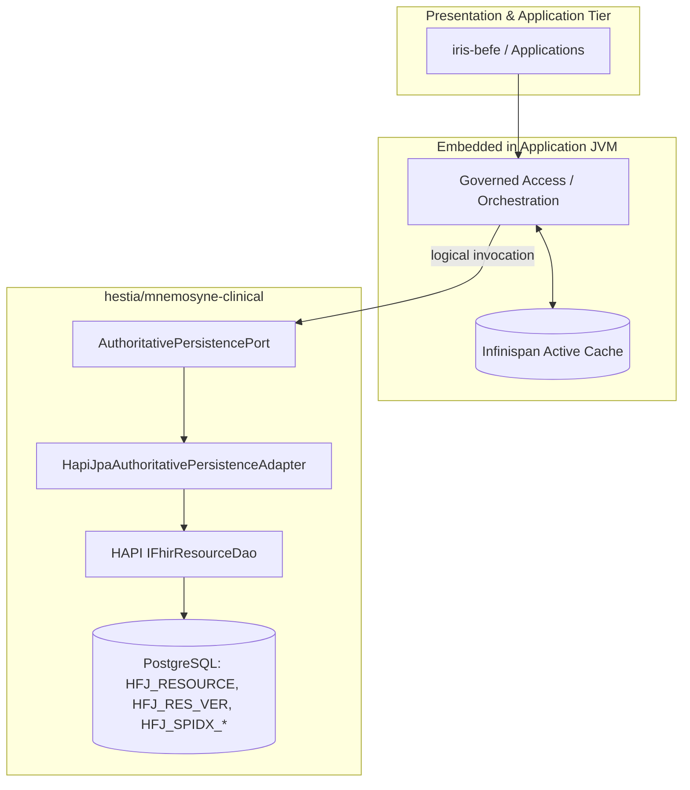

# Delivery Steps

### ✓ Step 1: Implementation
<plan_session_history>
History processor: During the current session, you have worked on the following `<previous_issue>`.
The `<issue_description>` usually continues or extends your previous work. Consider all `<previous_issue>` and `<issue_description>` together.
If `<assistant_question>`/`<user_answer>` blocks are present, treat them as additional user-provided context that may contain important clarifications about the task.
<previous_issue>
## Plan Task
HARMONIA CONVERGENCE — MANAGED-INFORMATION RUNTIME OWNERSHIP ASSESSMENT

READ-ONLY ARCHITECTURAL ASSESSMENT.

DO NOT IMPLEMENT CODE.

Goal 2 has correctly stopped because:

1. iris-befe and DefaultGovernedWriter are in different JVMs with no
   existing invocation mechanism; and

2. governed UPDATE requires a legitimate GovernedRead<T>, for which no
   production point-read implementation currently exists.

Before selecting a transport, reassess the runtime/component ownership of
the governed information orchestration itself.

PRIMARY QUESTION

Why does DefaultGovernedWriter currently live in mnemosyne-clinical?

Determine whether that placement reflects accepted Harmonia architecture
or is merely an artefact of Task 08 implementation history.

ARCHITECTURAL BASELINE

Mneme owns Harmonia's application-facing access to managed information and
the distributed active-state representation, observation and coordination
required to use that information safely.

Mnemosyne owns Harmonia's authoritative durable representation of managed
information. It atomically establishes authoritative state and authoritative
version progression.

Therefore:

    Mneme manages active use.
    Mnemosyne establishes durable truth.

A governed write currently orchestrates:

    Themis authorization
        ->
    Mneme active-state coordination
        ->
    Mnemosyne authoritative commit
        ->
    Mneme active-state convergence

Assess which subsystem should own that orchestration.

Do not assume that DefaultGovernedWriter must remain in
mnemosyne-clinical merely because it currently resides there.

Likewise do not assume that moving it is correct.

Establish ownership from architecture and dependency semantics.


ASSESS THESE COMPONENTS

For each determine its semantic owner, current module, current runtime and
appropriate target ownership:

- GovernedAccess
- GovernedReader
- GovernedWriter
- DefaultGovernedWriter
- ActiveStateCoordinator
- HotRodActiveStateCoordinator
- ActiveStateConvergencePort
- HotRodMnemeConvergence
- AuthoritativePersistencePort
- AuthoritativePersistenceService
- GovernedRead
- WriteResult


ASSESS WRITE ORCHESTRATION

Determine whether this target responsibility split is architecturally
correct:

    Mneme:
        application-facing managed-information access
        governed operation orchestration
        active-state coordination
        active-state convergence

    Mnemosyne:
        authoritative point read
        authoritative create
        authoritative conditional update
        authoritative version progression
        durable representation

    Themis:
        authorization decision

Do not implement this split.

Determine whether existing axioms, ADRs or module responsibilities support
or contradict it.


ASSESS READ ORCHESTRATION

Determine ownership for:

    Application
        -> Mneme managed read
        -> active representation if valid
        -> authoritative fallback/repair via Mnemosyne
        -> Mneme convergence
        -> GovernedRead<T>
        -> Application

Specifically determine:

- who obtains the active-state token;
- who obtains authoritative version/state;
- who combines them into GovernedRead<T>;
- whether GovernedRead is correctly an application-facing Mneme envelope.


RUNTIME CONSEQUENCES

Only AFTER semantic ownership is established, identify the runtime
consequence.

If governed orchestration belongs to Mneme, determine:

- where that orchestration could execute using existing runtime topology;
- what exact capability must cross the Mneme -> Mnemosyne boundary;
- whether the required boundary is narrower than remotely invoking
  DefaultGovernedWriter.

Do NOT select or invent a transport yet.

Do NOT create REST endpoints, RPC, Artemis flows, JDBC bridges or new
services.

The objective is to establish WHAT must cross a runtime boundary before
deciding HOW it crosses.


MAT-06

Do not resolve MAT-06.

Treat AuthoritativePersistencePort as the current abstraction over
Mnemosyne authoritative machinery.

Determine whether the ownership assessment remains valid regardless of
whether its eventual implementation is custom persistence or HAPI FHIR JPA.


PREVIOUS TASK 08 WORK

Treat existing Task 08 implementation as evidence, not architecture.

Classify:

- DefaultGovernedWriter placement
- AuthoritativePersistencePort
- ActiveStateCoordinator
- HotRodActiveStateCoordinator
- HotRodMnemeConvergence
- GovernedRead / WriteResult

as:

    RETAIN AS-IS
    RETAIN BUT MOVE OWNERSHIP
    REWORK
    SUPERSEDE
    BLOCKED

Explain why.


DELIVERABLE

Return a concise report containing:

1. Current ownership/runtime placement.
2. Semantic responsibility analysis.
3. Target ownership recommendation.
4. Governed CREATE orchestration ownership.
5. Governed READ orchestration ownership.
6. Governed UPDATE orchestration ownership.
7. Exact capability that must cross a runtime boundary.
8. Task 08 component disposition.
9. MAT-06 interaction.
10. Whether an ADR is required.
11. Smallest next implementation/architecture step.

DO NOT IMPLEMENT.

Do not choose transport technology.

Do not create another subsystem.

Do not solve runtime topology before establishing semantic ownership.

Review question:

    "Are we trying to remotely invoke DefaultGovernedWriter because it
     genuinely belongs to Mnemosyne, or only because Task 08 happened to
     put it there?"
</previous_issue>
<previous_issue_solution>
### Managed-Information Runtime Ownership Assessment

### Review Question
**"Are we trying to remotely invoke `DefaultGovernedWriter` because it genuinely belongs to Mnemosyne, or only because Task 08 happened to put it there?"**

**Finding:** We were attempting to remotely invoke `DefaultGovernedWriter` solely because Task 08 co-located it with `AuthoritativePersistenceService` in `mnemosyne-clinical` as an implementation shortcut. `DefaultGovernedWriter` does **not** belong in Mnemosyne. Placing the application-facing orchestrator inside Mnemosyne inverts architectural ownership (`AX-05`), forces the persistence tier to manage active cache coordination and convergence, and creates an artificial remote boundary between application callers and their active-state access tier.

---

### 1. Current Ownership and Runtime Placement

| Component | Current Module | Current Runtime | Current Role |
| :--- | :--- | :--- | :--- |
| `GovernedAccess` | `calliope` (`net.fhirfactory.harmonia.model.governedwrite`) | In-process contract (JAR) | Unified application entry point interface (`READ`, `CREATE`, `UPDATE`). |
| `GovernedReader` | `calliope` (`net.fhirfactory.harmonia.model.governedwrite`) | In-process contract (JAR) | Point-read contract returning `Optional<GovernedRead<T>>`. |
| `GovernedWriter` | `calliope` (`net.fhirfactory.harmonia.model.governedwrite`) | In-process contract (JAR) | Write contract defining `create` and `update`. |
| `DefaultGovernedWriter` | `hestia/mnemosyne-clinical` (`...hapifhir.governed`) | Spring Boot JPA Server JVM (`hapi-fhir-jpa-server-1/2`) | Orchestrates Themis auth, Mneme CAS coordination, Mnemosyne persistence, and Mneme convergence. |
| `ActiveStateCoordinator` | `calliope` (`net.fhirfactory.harmonia.model.governedwrite`) | In-process SPI (JAR) | SPI contract for active-state token observation and consumption. |
| `HotRodActiveStateCoordinator` | `hestia/mneme-cluster` (`...hestia.mneme.coordination`) | Hot Rod client library | Observes and consumes CAS tokens in Infinispan cluster. |
| `ActiveStateConvergencePort` | `calliope` (`net.fhirfactory.harmonia.model.governedwrite`) | In-process SPI (JAR) | SPI contract for post-commit cache synchronization. |
| `HotRodMnemeConvergence` | `hestia/mneme-cluster` (`...hestia.mneme.convergence`) | Hot Rod client library | Executes CAS convergence loop with newer-version protection. |
| `AuthoritativePersistencePort` | `hestia/mnemosyne-clinical` (`...hapifhir.persistence`) | In-process SPI (inside Mnemosyne) | SPI contract defining atomic persistence operations (`create`, `update`, `read`). |
| `AuthoritativePersistenceService`| `hestia/mnemosyne-clinical` (`...hapifhir.persistence`) | Spring Boot JPA Server JVM | PostgreSQL relational / JPA transactional persistence implementation. |
| `GovernedRead<T>` | `calliope` (`net.fhirfactory.harmonia.model.governedwrite`) | In-process pure model (JAR) | Immutable record holding resource payload, `ActiveStateToken`, and `AuthoritativeVersion`. |
| `WriteResult<T>` | `calliope` (`net.fhirfactory.harmonia.model.governedwrite`) | In-process pure model (JAR) | Sealed algebraic domain outcome hierarchy (`Committed`, `ActiveStateConflict`, etc.). |

---

### 2. Semantic Responsibility Analysis

Harmonia's core taxonomy and Architectural Axiom `AX-05` strictly separate active use from durable truth:
- **Mneme manages active use (`AX-05`, `ADR-019`):** Mneme owns application-facing managed-information access, distributed active-state representation, observation, concurrency coordination, and active cache convergence.
- **Mnemosyne establishes durable truth (`AX-05`, `ADR-018`):** Mnemosyne owns authoritative durable state, atomic precondition verification, authoritative version progression, and persistence metadata. It is **not** an application-facing database API.
- **Themis governs authorization (`AX-06`, Invariant 6):** Evaluates default-deny authorization decisions based on security context.

The governed write lifecycle comprises four stages:
1. **Themis Authorization:** Pure security decision (`themisAuthorizer.authorize(...)`).
2. **Mneme Active-State Coordination:** Validates and consumes active CAS coordination token (`activeStateCoordinator.consume(...)`).
3. **Mnemosyne Authoritative Commit:** Atomically evaluates absence or predecessor version precondition and commits durable state progression (`persistencePort.create(...)` or `persistencePort.update(...)`).
4. **Mneme Active-State Convergence:** Synchronizes post-commit state into active cache with newer-version preservation (`convergencePort.converge(...)`).

Stages 1, 2, and 4 are concerns of active application access and distributed cache coordination (Mneme and Themis). Only Stage 3 is a durable persistence concern (Mnemosyne). Placing the orchestrator in `mnemosyne-clinical` forced Mnemosyne to take dependencies on active cache coordination, inverting subsystem authority.

---

### 3. Target Ownership Recommendation

The target responsibility split is **architecturally correct** and directly derived from `AX-05`, `ADR-018`, and `ADR-019`:

```
+-----------------------------------------------------------------------+
| Mneme (Application-Facing Managed-Information Layer)                  |
| - Owns application-facing access contracts (GovernedAccess)           |
| - Owns governed operation orchestration (DefaultGovernedWriter/Reader)|
| - Owns active-state coordination (ActiveStateCoordinator)             |
| - Owns active-state convergence (ActiveStateConvergencePort)          |
+-----------------------------------------------------------------------+
                                   |
                   AuthoritativePersistencePort
                                   v
+-----------------------------------------------------------------------+
| Mnemosyne (Authoritative Durable Core)                                |
| - Authoritative point read                                            |
| - Authoritative create (absence precondition)                         |
| - Authoritative conditional update (predecessor version check)        |
| - Authoritative version progression and durable representation        |
+-----------------------------------------------------------------------+
```

- **Calliope:** Retains pure domain contracts (`GovernedAccess`, `GovernedReader`, `GovernedWriter`, `GovernedRead`, `WriteResult`, `ResourceKey`, `ActiveStateToken`, `AuthoritativeVersion`, `AuthoritativePersistencePort`).
- **Mneme:** Owns the execution of governed orchestration (`DefaultGovernedWriter`, `DefaultGovernedReader`).
- **Mnemosyne:** Exclusively implements `AuthoritativePersistencePort`.

---

### 4. Governed CREATE Orchestration Ownership

**Owner:** **Mneme**

**Execution Flow:**
1. Application invokes `GovernedWriter.create(key, resource, securityContext)`.
2. Mneme evaluates Themis policy (`ThemisAction.CREATE`). If denied, returns `WriteResult.notCommitted`.
3. Mneme delegates atomic creation to Mnemosyne (`AuthoritativePersistencePort.create(key, resource)`).
4. Mnemosyne atomically verifies non-existence, assigns initial `AuthoritativeVersion(1)`, persists durable state, and returns `AuthoritativePersistenceResult.Committed`.
5. Upon successful durable commit, Mneme converges active cache (`ActiveStateConvergencePort.converge(key, committedResource, version)`).
6. Mneme returns `WriteResult.committed` (or `committedDegraded` if cache convergence was degraded) to the application.

---

### 5. Governed READ Orchestration Ownership

**Owner:** **Mneme**

**Execution Flow:**
1. Application invokes `GovernedReader.read(key, securityContext)`.
2. Mneme evaluates Themis policy (`ThemisAction.READ`). If denied, returns `Optional.empty()` (or access denied outcome).
3. Mneme inspects active distributed state (Infinispan via Hot Rod `getWithMetadata`):
   - **Cache Hit:** Extracts `ActiveStateToken` (Hot Rod CAS version) and `AuthoritativeVersion` (from entry metadata).
   - **Cache Miss / Invalid Entry:** Mneme falls back to Mnemosyne (`AuthoritativePersistencePort.read(key)`). Mnemosyne returns authoritative state and version. Mneme converges this state into active cache (obtaining a fresh `ActiveStateToken`).
4. Mneme constructs and returns `GovernedRead<T>` containing:
   - Pristine `T resource` payload (unaltered domain object);
   - `ActiveStateToken` (for active CAS coordination);
   - `AuthoritativeVersion` (for Mnemosyne optimistic concurrency verification).

**Envelope Integrity:** `GovernedRead<T>` is strictly an application-facing Mneme container. It equips callers with concurrency tokens required for subsequent updates without exposing infrastructure plumbing or mutating business payloads.

---

### 6. Governed UPDATE Orchestration Ownership

**Owner:** **Mneme**

**Execution Flow:**
1. Application invokes `GovernedWriter.update(currentGovernedRead, proposedResource, securityContext)`.
2. Mneme evaluates Themis policy (`ThemisAction.UPDATE`). If denied, aborts fail-closed.
3. Mneme coordinates active state via `ActiveStateCoordinator.consume(key, currentGovernedRead.activeToken())`:
   - If `STALE`: Returns `WriteResult.activeStateConflict` immediately without invoking Mnemosyne.
   - If `UNAVAILABLE`: Fails fast with `WriteResult.notCommitted`.
4. Mneme invokes Mnemosyne conditional update (`AuthoritativePersistencePort.update(key, proposed, currentGovernedRead.expectedAuthoritativeVersion())`).
5. Mnemosyne evaluates predecessor version match in the database transaction, increments version, persists state, and returns `Committed(persistedResource, newVersion)` (or `Conflict` if a concurrent commit intervened).
6. Mneme converges active cache with the new version via `ActiveStateConvergencePort.converge(...)`.
7. Mneme returns `WriteResult<T>` to the application.

---

### 7. Exact Capability That Must Cross a Runtime Boundary

When governed orchestration is owned by Mneme, the runtime boundary is narrowed significantly.

#### Location of Orchestration Execution
Governed orchestration executes within the **calling application runtime** (e.g., `iris-befe` on WildFly, Pylai gateways, or Energeia task processors) via a client library (`hestia/mneme-access` / `hestia/mneme-cluster`), which interacts directly with Infinispan and Themis in-process/via Hot Rod.

#### Exact Cross-Boundary Capability
The only capability that must cross the runtime boundary from the caller/Mneme into the Mnemosyne container is the **`AuthoritativePersistencePort`**:

```java
public interface AuthoritativePersistencePort<T> {
    AuthoritativePersistenceResult<T> read(ResourceKey key);
    AuthoritativePersistenceResult<T> create(ResourceKey key, T resource);
    AuthoritativePersistenceResult<T> update(ResourceKey key, T proposed, ExpectedAuthoritativeVersion expectedVersion);
}
```

#### Comparison of Boundaries
- **If `DefaultGovernedWriter` is in Mnemosyne (Task 08 approach):**
  - Crosses boundary: Application -> Mnemosyne (`GovernedWriter`).
  - Mnemosyne must reach back across the network to Infinispan for CAS coordination and cache convergence.
  - Generates cyclic cross-tier dependencies: Caller -> Mnemosyne -> Infinispan -> Postgres -> Infinispan -> Mnemosyne -> Caller.
- **If `DefaultGovernedWriter` is in Mneme (Recommended approach):**
  - Crosses boundary: Mneme -> Mnemosyne (`AuthoritativePersistencePort` only).
  - Clean unidirectional flow: Caller/Mneme -> Themis (local) -> Infinispan (Hot Rod) -> Mnemosyne Persistence (remote port) -> Infinispan (Hot Rod).
  - Mnemosyne remains a clean, self-contained durable store with zero cache or presentation awareness.

---

### 8. Task 08 Component Disposition

| Component | Disposition | Architectural Rationale |
| :--- | :--- | :--- |
| `DefaultGovernedWriter` placement | **RETAIN BUT MOVE OWNERSHIP** | The orchestration logic is sound and tested, but its component ownership belongs in Mneme (`hestia/mneme-cluster` or `hestia/mneme-access`), not in `mnemosyne-clinical`. |
| `AuthoritativePersistencePort` | **RETAIN AS-IS** (Move interface to pure API module) | Accurately models Mnemosyne's atomic persistence capability; interface should reside in `calliope` or `mnemosyne-api`. |
| `ActiveStateCoordinator` | **RETAIN AS-IS** | Pure Calliope contract for active-state observation and token consumption. |
| `HotRodActiveStateCoordinator` | **RETAIN AS-IS** | Production Hot Rod token observation/consumption in `hestia/mneme-cluster`. |
| `HotRodMnemeConvergence` | **RETAIN AS-IS** | Production post-commit CAS convergence with newer-version protection in `hestia/mneme-cluster`. |
| `GovernedRead` / `WriteResult` | **RETAIN AS-IS** | Pure, immutable Calliope value records that maintain payload integrity and decouple domain results from presentation protocols. |

---

### 9. MAT-06 Interaction

**Independence from MAT-06:**
- `MAT-06` evaluates custom relational persistence vs HAPI FHIR JPA server for Mnemosyne's internal durable storage.
- `AuthoritativePersistencePort` is the explicit isolation boundary for `MAT-06`.
- The ownership assessment remains **fully invariant** under any `MAT-06` resolution: whether Mnemosyne's backend is implemented with custom JPA repositories, jOOQ, or HAPI FHIR JPA Server, Mnemosyne exposes only `AuthoritativePersistencePort` to Mneme. Mneme remains the sole orchestrator of active-state coordination and cache convergence.

---

### 10. Architecture Decision Record (ADR) Requirement

**Recommendation:** An ADR is **required** (e.g., *ADR-021: Mneme Ownership of Governed Managed-Information Access and Orchestration*).

**Rationale:**
While `AX-05`, `ADR-018`, and `ADR-019` establish the high-level boundary (Mneme manages active use; Mnemosyne establishes durable truth), they did not explicitly prescribe where the multi-step orchestration pipeline (Themis -> Mneme coordination -> Mnemosyne commit -> Mneme convergence) executes. The ADR is required to:
1. Formalize that `GovernedAccess`, `GovernedReader`, and `GovernedWriter` orchestration reside in Mneme.
2. Establish that Mnemosyne exposes only `AuthoritativePersistencePort` and `AuthoritativeSearchPort`.
3. Prohibit Mnemosyne from taking dependencies on active cache coordination or presentation orchestration.

---

### 11. Smallest Next Implementation / Architecture Step

1. **Draft ADR-021** capturing the Mneme orchestration ownership and the `AuthoritativePersistencePort` boundary.
2. **Move `DefaultGovernedWriter` and implement `DefaultGovernedReader` in Mneme** (`hestia/mneme-cluster` or client module), moving the `AuthoritativePersistencePort` contract interface into `calliope.model.governedwrite` (or `mnemosyne-api`).
3. **Define the remote bridge for `AuthoritativePersistencePort`** across the Mneme -> Mnemosyne boundary (deferred to transport design).
</previous_issue_solution>
<previous_issue_solution>
tool name: submit
tool parameters:
 - "delivery_plan"=[{"description":"Formulate and accept ADR-021 codifying the architectural separation between Mneme managed-information orchestration and Mnemosyne authoritative persistence.\n\n- Document the target responsibility split in `docs/architecture-decisions.md`: Mneme owns application-facing managed-information access (`GovernedAccess`, `GovernedReader`, `GovernedWriter`), active-state coordination, and post-commit cache convergence; Mnemosyne owns durable persistence and version progression via `AuthoritativePersistencePort`.\n- Establish the invariant prohibiting Mnemosyne from taking dependencies on active cache coordination (`ActiveStateCoordinator`), Hot Rod CAS tokens, or post-commit cache convergence (`ActiveStateConvergencePort`).\n- Update architectural documentation to clarify that `GovernedRead<T>` is an application-facing Mneme envelope encapsulating active CAS coordination tokens and authoritative version numbers without mutating domain payloads.","name":"Document ADR-021 on Governed Access Orchestration and Port Boundaries"},{"description":"Relocate the governed write orchestrator to Mneme and introduce the point-read cache-aside orchestrator.\n\n- Move `AuthoritativePersistencePort` and `AuthoritativePersistenceResult` interfaces to a pure domain contract package (`calliope.model.governedwrite` or dedicated API module) so caller/orchestrator tiers can reference the port without depending on JPA or server-side persistence implementations.\n- Move `DefaultGovernedWriter` from `hestia/mnemosyne-clinical` to `hestia/mneme-cluster` (or `hestia/mneme-access`), binding it to local/client Themis authorization, Hot Rod active coordination, and the decoupled `AuthoritativePersistencePort`.\n- Implement `DefaultGovernedReader` in Mneme supporting cache-aside point reads against Infinispan Hot Rod with authoritative fallback to `AuthoritativePersistencePort.read(...)` and cache convergence.\n- Update unit tests in `hestia/mneme-cluster` and ArchUnit rules in `paradeigma/paradeigma-test` verifying that Mneme owns governed orchestration while Mnemosyne implements only `AuthoritativePersistencePort`.","name":"Relocate Governed Orchestration to Mneme and Implement GovernedReader"},{"name":"Establish Authoritative Persistence Port Remote Bridge","description":"Define the concrete invocation mechanism allowing Mneme orchestration to delegate atomic persistence operations to Mnemosyne across the runtime boundary.\n\n- Specify the wire protocol and transport contract for `AuthoritativePersistencePort` operations (`read`, `create`, `update`).\n- Implement the client-side adapter in Mneme and the server-side provider endpoint in Mnemosyne (`hestia/mnemosyne-clinical`).\n- Verify end-to-end integration across `iris-befe` (WildFly), Mneme (Infinispan), and Mnemosyne (Spring Boot JPA) under high-concurrency create and update workloads."}],
 - "proposal"=[{"name":"Requirements","content":"### Overview & Goals\nProvide a read-only architectural assessment of the runtime and component ownership for Harmonia's managed-information access and governed operation orchestration (Goal 2 baseline).\n\nThe primary objective is to evaluate why `DefaultGovernedWriter` currently resides in `hestia/mnemosyne-clinical`, determine whether this placement reflects intended Harmonia architecture or Task 08 implementation history, and establish the semantically correct boundary and responsibility split across Calliope, Mneme, Mnemosyne, and Themis.\n\n### Scope\n- **In Scope**:\n  - Reassessment of runtime and component ownership for `GovernedAccess`, `GovernedReader`, `GovernedWriter`, `DefaultGovernedWriter`, `ActiveStateCoordinator`, `HotRodActiveStateCoordinator`, `ActiveStateConvergencePort`, `HotRodMnemeConvergence`, `AuthoritativePersistencePort`, `AuthoritativePersistenceService`, `GovernedRead`, and `WriteResult`.\n  - Verification of the write orchestration pipeline (`CREATE`, `UPDATE`) and read orchestration pipeline (`READ`) against Harmonia Architectural Axioms (`AX-01`, `AX-05`, `AX-06`, `AX-13`), `AGENTS.md` Invariant 8, and accepted ADRs (`ADR-003`, `ADR-018`, `ADR-019`, `ADR-020`).\n  - Identification of the exact capability that must cross the runtime boundary between application/Mneme and Mnemosyne.\n  - Component disposition mapping for previous Task 08 artefacts.\n  - Interaction analysis with `MAT-06` (custom relational persistence vs HAPI FHIR JPA server).\n  - Assessment of ADR requirements and definition of the smallest next step.\n- **Out of Scope**:\n  - Implementation of source code or modification of production modules.\n  - Selection or invention of concrete transport/network technologies (e.g. REST endpoints, Artemis flows, gRPC).\n  - Resolution of `MAT-06`.\n  - Creation of new subsystems or microservices.\n\n### Key Findings & Axiomatic Alignment\n1. **Historical Placement in Task 08**: `DefaultGovernedWriter` was placed in `mnemosyne-clinical` solely because `AuthoritativePersistenceService` was implemented there, allowing a direct in-process Java reference to `AuthoritativePersistencePort`.\n2. **Axiomatic Violation (`AX-05`)**: Placing the application-facing orchestrator inside Mnemosyne inverts the core architectural principle that **Mneme manages active use, while Mnemosyne establishes durable truth**. It forces the durable tier to take dependencies on active cache coordination (`ActiveStateCoordinator`) and cache convergence (`ActiveStateConvergencePort`).\n3. **Target Responsibility Alignment**:\n   - **Mneme**: Owns application-facing access (`GovernedAccess`, `GovernedReader`, `GovernedWriter`), active-state observation and CAS coordination (`ActiveStateCoordinator`), governed lifecycle orchestration (`DefaultGovernedWriter`, `DefaultGovernedReader`), and post-commit cache convergence (`ActiveStateConvergencePort`).\n   - **Mnemosyne**: Owns atomic durable persistence (`AuthoritativePersistencePort`), absence/precondition evaluation, authoritative version progression, and durable representation. It is **not** an application-facing facade.\n   - **Themis**: Evaluates default-deny security decisions (`ThemisAuthorizer`).\n4. **Narrowed Boundary**: If Mneme owns orchestration, the only capability that crosses the network boundary to Mnemosyne is `AuthoritativePersistencePort` (`read`, `create`, `update`). This eliminates cross-tier cyclic dependencies and prevents Mnemosyne from needing remote callbacks to Infinispan."},{"content":"### Current Implementation Analysis\nIn the existing codebase:\n- `calliope` holds pure domain interfaces and records (`GovernedAccess`, `GovernedReader`, `GovernedWriter`, `GovernedRead<T>`, `WriteResult<T>`, `ActiveStateCoordinator`, `ActiveStateConvergencePort`).\n- `hestia/mneme-cluster` provides production Infinispan Hot Rod coordination (`HotRodActiveStateCoordinator`) and post-commit cache convergence (`HotRodMnemeConvergence`).\n- `hestia/mnemosyne-clinical` houses `DefaultGovernedWriter`, `AuthoritativePersistencePort`, and `AuthoritativePersistenceService`.\n- `iris-befe` runs on WildFly in Tier 2, while `mnemosyne-clinical` runs on Spring Boot in Tier 5. `iris-befe` currently has no invocation bridge to `DefaultGovernedWriter`.\n\n### Key Decisions\n1. **Decision: Relocate Governed Orchestration to Mneme**\n   - *Chosen Approach*: `DefaultGovernedWriter` and `DefaultGovernedReader` belong in Mneme (`hestia/mneme-cluster` or `hestia/mneme-access`).\n   - *Rationale*: Governed write/read workflows manage active application access, Themis policy checks, Hot Rod CAS token coordination, and post-commit cache convergence. All of these are Mneme/application tier concerns (`AX-05`, `ADR-019`).\n2. **Decision: Restrict Mnemosyne Boundary to `AuthoritativePersistencePort`**\n   - *Chosen Approach*: Mnemosyne exposes only `AuthoritativePersistencePort` (point read, create, conditional update) and `AuthoritativeSearchPort`.\n   - *Rationale*: Keeps Mnemosyne focused exclusively on durable truth and version progression (`ADR-018`), without leaking active cache or presentation awareness into the storage tier.\n3. **Decision: Non-Destructive Management Context Encapsulation**\n   - *Chosen Approach*: `GovernedRead<T>` encapsulates `T resource`, `ActiveStateToken`, and `AuthoritativeVersion` as an immutable application-facing record.\n   - *Rationale*: Preserves domain payloads in their pristine form while providing the exact concurrency tokens required for subsequent updates.\n\n### Component Disposition Table\n\n| Component | Target Owner | Disposition | Architectural Rationale |\n| :--- | :--- | :--- | :--- |\n| `GovernedAccess` | Mneme / Calliope | **RETAIN AS-IS** | Pure application entry point interface in `calliope`. |\n| `GovernedReader` | Mneme / Calliope | **RETAIN AS-IS** | Pure point-read contract in `calliope`. |\n| `GovernedWriter` | Mneme / Calliope | **RETAIN AS-IS** | Pure write contract in `calliope`. |\n| `DefaultGovernedWriter` | Mneme | **RETAIN BUT MOVE OWNERSHIP** | Move from `mnemosyne-clinical` to Mneme (`mneme-cluster` / `mneme-access`). |\n| `ActiveStateCoordinator` | Mneme / Calliope | **RETAIN AS-IS** | Pure coordination SPI in `calliope`. |\n| `HotRodActiveStateCoordinator` | Mneme | **RETAIN AS-IS** | Production Hot Rod token observation/consumption in `mneme-cluster`. |\n| `ActiveStateConvergencePort` | Mneme / Calliope | **RETAIN AS-IS** | Pure convergence SPI in `calliope`. |\n| `HotRodMnemeConvergence` | Mneme | **RETAIN AS-IS** | Production CAS convergence with newer-version protection in `mneme-cluster`. |\n| `AuthoritativePersistencePort` | Mnemosyne / Calliope | **RETAIN AS-IS** (Move interface) | Accurately models Mnemosyne's atomic persistence capability; interface belongs in pure contract package. |\n| `AuthoritativePersistenceService`| Mnemosyne | **RETAIN AS-IS** | PostgreSQL relational/JPA atomic persistence engine in `mnemosyne-clinical`. |\n| `GovernedRead<T>` | Mneme / Calliope | **RETAIN AS-IS** | Pure immutable envelope record in `calliope`. |\n| `WriteResult<T>` | Mneme / Calliope | **RETAIN AS-IS** | Pure sealed domain outcome hierarchy in `calliope`. |\n\n### Governed Operation Workflows\n\n#### Governed CREATE\n1. Application -> `Mneme.create(key, resource, securityContext)`.\n2. Mneme evaluates Themis authorization (`ThemisAction.CREATE`).\n3. Mneme invokes `AuthoritativePersistencePort.create(key, resource)` on Mnemosyne.\n4. Mnemosyne atomically verifies non-existence, assigns initial version `AuthoritativeVersion(1)`, persists record, and returns `Committed`.\n5. Mneme converges post-commit state into active cache via `ActiveStateConvergencePort.converge(...)`.\n6. Mneme returns `WriteResult.committed` to the application.\n\n#### Governed READ\n1. Application -> `Mneme.read(key, securityContext)`.\n2. Mneme evaluates Themis authorization (`ThemisAction.READ`).\n3. Mneme inspects active cache (Infinispan Hot Rod `getWithMetadata`):\n   - On cache hit: extracts `ActiveStateToken` and `AuthoritativeVersion`.\n   - On cache miss: queries Mnemosyne via `AuthoritativePersistencePort.read(key)` and converges result into active cache.\n4. Mneme returns `GovernedRead<T>` envelope containing pristine resource, active token, and authoritative version.\n\n#### Governed UPDATE\n1. Application -> `Mneme.update(currentGovernedRead, proposedResource, securityContext)`.\n2. Mneme evaluates Themis authorization (`ThemisAction.UPDATE`).\n3. Mneme validates and consumes active token via `ActiveStateCoordinator.consume(key, currentGovernedRead.activeToken())`.\n   - If stale or unavailable: returns `WriteResult.activeStateConflict` or `WriteResult.notCommitted`.\n4. Mneme invokes `AuthoritativePersistencePort.update(key, proposed, currentGovernedRead.expectedAuthoritativeVersion())` on Mnemosyne.\n5. Mnemosyne verifies predecessor version match within the database transaction, increments version, persists update, and returns `Committed`.\n6. Mneme converges post-commit state into active cache via `ActiveStateConvergencePort.converge(...)`.\n7. Mneme returns `WriteResult.committed` to the application.\n\n### Architecture Diagram\n\n```mermaid\ngraph TD\n    subgraph Presentation & Application Tier\n        APP[Application / Iris BEFE]\n    end\n\n    subgraph Calliope Pure Contracts\n        GA[GovernedAccess / GovernedReader / GovernedWriter]\n        GR[GovernedRead Envelope]\n        APP_PORT[AuthoritativePersistencePort]\n    end\n\n    subgraph Mneme Active Boundary [Client / hestia/mneme-cluster]\n        DGW[DefaultGovernedWriter]\n        DGR[DefaultGovernedReader]\n        COORD[ActiveStateCoordinator / HotRod]\n        CONV[ActiveStateConvergencePort / HotRod]\n        CACHE[(Infinispan Active Cache)]\n    end\n\n    subgraph Themis Security\n        THM[ThemisAuthorizer]\n    end\n\n    subgraph Mnemosyne Authoritative Boundary [hestia/mnemosyne-clinical]\n        APS[AuthoritativePersistenceService]\n        STORE[(Authoritative Database / Postgres)]\n    end\n\n    APP --> GA\n    GA --> DGW\n    GA --> DGR\n    DGW --> THM\n    DGR --> THM\n    DGW --> COORD\n    DGR --> COORD\n    COORD <--> CACHE\n    DGW --> CONV\n    DGR --> CONV\n    CONV <--> CACHE\n    DGW -- atomic commit --> APP_PORT\n    DGR -- fallback read --> APP_PORT\n    APP_PORT --> APS\n    APS --> STORE\n```\n\n### MAT-06 Interaction & ADR Requirement\n- **`MAT-06` Invariance**: `AuthoritativePersistencePort` provides total encapsulation over Mnemosyne's storage backend. Whether `MAT-06` is resolved as custom JPA persistence or HAPI FHIR JPA server, Mnemosyne's boundary remains `AuthoritativePersistencePort`.\n- **ADR Requirement**: An ADR (`ADR-021: Mneme Ownership of Governed Managed-Information Access and Orchestration`) is recommended to formally capture this boundary, assign orchestrator ownership to Mneme, and define the `AuthoritativePersistencePort` runtime contract.","name":"Technical Design"}],
 - "name"="managed-information-runtime-ownership-assessment"
</previous_issue_solution>
<previous_issue>
## Plan Task
The ownership assessment is accepted subject to the following corrections.

Proceed with DOCUMENTATION / ADR work only.

DO NOT implement Steps 2 or 3 yet.
DO NOT move classes yet.
DO NOT select or implement a transport.


1. ACCEPTED ARCHITECTURAL DECISION

The core conclusion is accepted:

    Mneme owns orchestration of governed access to
    Harmonia-managed information.

    Mnemosyne owns the authoritative durable operations
    invoked by that orchestration.

This includes:

Mneme:
- application-facing managed-information orchestration;
- Themis authorization orchestration;
- active-state observation and concurrency coordination;
- cache-aside point-read orchestration;
- post-authoritative-commit active-state convergence.

Mnemosyne:
- authoritative point read;
- authoritative create;
- authoritative conditional update;
- authoritative version progression;
- durable representation and persistence metadata.

DefaultGovernedWriter therefore semantically belongs to Mneme rather
than Mnemosyne.


2. DO NOT CONFLATE SEMANTIC OWNERSHIP WITH DEPLOYMENT

Correct statements that assert governed orchestration necessarily executes
inside the calling application runtime.

The assessment has established:

    semantic owner = Mneme

It has NOT yet established:

    deployment location = every application JVM

Possible deployment forms remain subject to runtime design.

ADR-021 SHALL NOT require Mneme orchestration to execute:

- inside iris-befe;
- inside Pylai;
- inside Energeia;
- in a dedicated Mneme process;

unless separately decided.

State explicitly:

    Semantic subsystem ownership does not by itself prescribe process
    or JVM placement.

Preserve the Harmonia principle:

    many modules; few processes.
    many explicit boundaries; few network boundaries.


3. AuthoritativePersistencePort IS NOT AN APPLICATION CONTRACT

Do not move AuthoritativePersistencePort into
calliope.model.governedwrite as part of ADR-021.

Distinguish:

Application-facing managed-information contracts:

    GovernedAccess
    GovernedReader
    GovernedWriter
    GovernedRead
    WriteResult

from the internal Mneme -> Mnemosyne capability contract:

    AuthoritativePersistencePort

The latter represents a Mnemosyne capability consumed by Mneme.

Its eventual package/module location must preserve that semantic distinction.

Do not create a new API module merely to satisfy the diagram.

For ADR-021, document ownership and direction of dependency.
Leave exact package/module relocation to the implementation plan after
runtime/transport design.


4. DO NOT INTRODUCE AuthoritativeSearchPort YET

Remove AuthoritativeSearchPort from ADR-021 and from the accepted target
boundary.

Search remains deferred to Goal 3A / Goal 3B and MAT-06 analysis.

ADR-021 may state generically that future authoritative capabilities may
be exposed by Mnemosyne through explicit bounded contracts.

Do not define or name the search contract here.


5. AUTHORITATIVE VERSION IN MNEME

Clarify the semantics of AuthoritativeVersion held with active Mneme state.

Mneme MAY retain the authoritative version associated with the
authoritative state from which an active representation was derived.

However:

    Mneme does not establish authoritative versions.
    Mneme does not increment authoritative versions.
    Mneme does not infer authoritative versions from Hot Rod tokens.
    Mneme does not make cached authoritative-version metadata authoritative.

Only Mnemosyne establishes authoritative version progression.

The cached value is management metadata describing provenance/version
of the active representation.

Include this invariant in ADR-021.


6. GovernedRead SEMANTICS

Retain:

    GovernedRead<T>
        resource
        ActiveStateToken
        AuthoritativeVersion

as the Mneme application-facing management envelope.

The resource remains pristine.

The management context is not written into the FHIR/domain payload.

ActiveStateToken and AuthoritativeVersion remain separate domains.


7. CREATE / READ / UPDATE OWNERSHIP

Retain the assessed semantic flows:

CREATE:

    Application
        -> Mneme governed orchestration
        -> Themis
        -> Mnemosyne authoritative create
        -> Mneme convergence

READ:

    Application
        -> Mneme governed orchestration
        -> Themis
        -> Mneme active state
        -> authoritative fallback to Mnemosyne when required
        -> Mneme convergence
        -> GovernedRead

UPDATE:

    Application
        -> Mneme governed orchestration
        -> Themis
        -> Mneme active-state concurrency check
        -> Mnemosyne authoritative conditional update
        -> Mneme convergence

These are semantic flows, not deployment diagrams.


8. ADR-021

Create:

    ADR-021 — Mneme Ownership of Governed Managed-Information
    Access and Orchestration

The ADR should record:

Context:
- Task 08 placed DefaultGovernedWriter in mnemosyne-clinical for
  implementation convenience.
- Runtime analysis exposed an artificial application -> Mnemosyne
  orchestration boundary.
- Existing ADR-018/019 establish subsystem responsibilities but do not
  explicitly assign the multi-stage governed-operation orchestrator.

Decision:
- Mneme owns governed managed-information orchestration.
- Mnemosyne owns authoritative durable operations.
- Themis owns authorization decisions.
- Mneme invokes Mnemosyne only through explicit authoritative capability
  contracts.
- Mnemosyne SHALL NOT depend on Mneme active-state coordination,
  Hot Rod tokens, or cache convergence.
- Mneme MAY retain authoritative-version metadata associated with active
  state but SHALL NOT establish or advance authoritative versions.
- semantic ownership SHALL NOT prescribe JVM/process deployment.

Consequences:
- DefaultGovernedWriter must ultimately move out of Mnemosyne ownership.
- DefaultGovernedReader belongs to Mneme.
- AuthoritativePersistencePort becomes the current internal capability
  boundary from Mneme to Mnemosyne.
- a runtime invocation mechanism is still required and deliberately
  unresolved.
- transport selection is a subsequent architecture decision.
- MAT-06 remains isolated behind Mnemosyne's authoritative capability.
- Goal 2 remains blocked until runtime invocation and minimum governed
  point-read execution are established.

Explicitly NOT decided:
- REST vs Artemis vs another transport;
- embedded/client-library vs separate Mneme runtime;
- HAPI JPA vs custom persistence;
- authoritative search contract;
- HTTP ETag mapping;
- HTTP DELETE lifecycle mapping.


9. UPDATE THE ASSESSMENT/PLAN

After documenting ADR-021, update the Goal 2 assessment so that:

Step 1 = ADR-021 and semantic ownership — COMPLETE.

Next step is NOT automatically "move DefaultGovernedWriter".

The next architecture step is:

    determine the smallest runtime deployment and invocation model
    that realises ADR-021 using Harmonia's existing runtime topology.

That assessment must consider both:

    Application -> Mneme execution placement

and:

    Mneme -> Mnemosyne authoritative capability invocation

without assuming either is a new network boundary.


DELIVERABLE

1. ADR-021.
2. Updated Goal 2 plan/status.
3. No production code changes other than documentation.
4. No transport selection.
5. No new service/module.
6. No AuthoritativeSearchPort.
7. No MAT-06 implementation work.

Stop after documentation and report.
</previous_issue>
<previous_issue_solution>
tool name: submit
tool parameters:
</previous_issue_solution>
<previous_issue>
## Plan Task
Proceed to ADR-021 Step 2 ONLY:

    Determine the smallest runtime deployment and invocation model
    that realises ADR-021.

PLAN / ASSESSMENT ONLY.

Do not implement.
Do not move DefaultGovernedWriter yet.
Do not create a transport.
Do not create a new module or service.
Do not resolve MAT-06.


OBJECTIVE

Determine the smallest runtime arrangement that realises:

    Application
        -> Mneme governed orchestration
        -> Mnemosyne authoritative capability

while preserving:

    Mneme manages active use.
    Mnemosyne establishes durable truth.

and:

    many modules; few processes.
    many explicit boundaries; few network boundaries.


IMPORTANT

ADR-021 establishes SEMANTIC ownership.

It does not establish deployment ownership.

Do not assume:

- Mneme must be a standalone service;
- Mneme must be embedded in every application;
- Mnemosyne requires a new REST API;
- AuthoritativePersistencePort must literally become a remote Java-style API;
- Artemis/Petasos is appropriate merely because it already exists;
- HAPI FHIR REST is automatically the correct internal boundary.

Inspect the existing runtime topology first.


PART A — APPLICATION -> MNEME PLACEMENT

Inspect the existing deployment/runtime architecture for:

- iris-befe;
- Pylai;
- Energeia;
- Mneme/Infinispan;
- mneme-cluster;
- existing Mneme client libraries;
- Themis authorization;
- any other current consumers of managed information.

For each relevant runtime identify:

1. whether it already loads mneme-cluster or equivalent Mneme code;
2. whether it already has Hot Rod connectivity;
3. whether it already has trusted Themis context locally;
4. whether it already performs active-state operations;
5. whether embedding governed orchestration there adds a new process
   boundary or merely a module/library dependency.

Assess at least these conceptual options:

A. Mneme orchestration embedded/co-located in consuming application runtimes.

B. Mneme orchestration hosted in an EXISTING Harmonia runtime.

C. Dedicated Mneme runtime/service.

Do not assume all consumers require the same deployment model if the
architecture does not require it.

Evaluate primarily against:

- number of new processes;
- number of network hops;
- semantic boundary preservation;
- security-context propagation;
- concurrency correctness;
- failure semantics;
- deployment complexity;
- operational support;
- reuse across Harmonia applications.

Prefer the smallest arrangement consistent with ADR-021.


PART B — MNEME -> MNEMOSYNE CAPABILITY

Inspect ALL existing mechanisms by which other Harmonia runtimes currently
interact with mnemosyne-clinical.

Do not begin with technology selection.

Establish what already exists.

Inspect:

- existing HTTP endpoints;
- HAPI FHIR REST endpoints;
- Spring controllers;
- internal APIs;
- Artemis/Petasos interactions;
- any existing client libraries;
- any existing remote persistence interfaces;
- deployment ingress/routing;
- service discovery/configuration;
- authentication between Harmonia runtimes.

For each existing mechanism determine whether it can faithfully provide the
semantics required by the current AuthoritativePersistencePort:

READ:
    authoritative resource + authoritative version

CREATE:
    atomic absence precondition
    + authoritative commit
    + authoritative version/result

UPDATE:
    atomic expected-authoritative-version precondition
    + authoritative commit
    + conflict outcome
    + authoritative version/result

Also preserve:

- Committed;
- Conflict;
- NotCommitted;
- OutcomeUnknown where applicable.

Do not collapse these into generic HTTP success/failure if doing so loses
domain semantics.


PART C — ASSESS HAPI/FHIR CAPABILITY WITHOUT RESOLVING MAT-06

Because mnemosyne-clinical already contains a HAPI FHIR runtime, inspect
whether existing HAPI/FHIR interactions could represent the required
authoritative capability.

This is NOT MAT-06.

Do not decide whether HAPI JPA replaces custom persistence.

Instead ask:

    Can an existing standards-based interaction already present in the
    Mnemosyne runtime carry the semantics Mneme requires?

Consider existing FHIR mechanisms only from repository evidence, including
where present:

- conditional create;
- version-aware update;
- If-Match / ETag;
- resource version metadata;
- read;
- transaction semantics;
- OperationOutcome/conflict responses.

Do NOT assume that FHIR meta.versionId equals Harmonia
AuthoritativeVersion.

If a mapping would be required, identify it explicitly.

Do not redesign Pylai or expose Harmonia operational metadata externally.


PART D — ASSESS ARTEMIS/PETASOS FIT

Inspect existing Petasos/Artemis patterns.

Determine whether authoritative point read/create/update are compatible with
their existing semantics.

Do not select Artemis merely because it is Harmonia's messaging machinery.

Consider:

- synchronous request/response requirement;
- conflict response;
- outcome-unknown handling;
- latency;
- idempotency;
- replay;
- durable processing;
- whether use would introduce unnecessary workflow semantics.

If Petasos is inappropriate for synchronous managed-information access,
say so plainly.


PART E — SECURITY BOUNDARY

For each viable deployment/invocation arrangement determine:

- where Themis authorization executes;
- where trusted ThemisSecurityContext originates;
- whether identity/security context must cross a process boundary;
- whether Mnemosyne needs caller identity at all after Mneme authorization;
- what service-to-service trust is already available.

Do not reintroduce caller-controlled identity headers.

Do not redesign Themis.


PART F — FAILURE SEMANTICS

For each viable model determine how it represents:

1. request definitely not committed;
2. authoritative conflict;
3. authoritative commit confirmed;
4. commit succeeded but Mneme convergence failed;
5. caller cannot determine whether authoritative commit occurred.

The fifth case is particularly important.

Do not choose an invocation mechanism that silently converts
OutcomeUnknown into NotCommitted.


PART G — NETWORK BOUNDARY COUNT

For each viable option show the actual request path.

For example:

    Iris
      -> Mneme [same JVM]
      -> Mnemosyne [network]
      -> PostgreSQL
      -> Mneme convergence [Hot Rod]

versus:

    Iris
      -> Mneme service [network]
      -> Mnemosyne [network]
      -> PostgreSQL
      -> Infinispan [network]

Do not count conceptual/module boundaries as network boundaries.


DELIVERABLE

Return a concise architecture assessment with:

1. Existing Runtime Evidence

2. Application -> Mneme Options

3. Mneme -> Mnemosyne Existing Invocation Mechanisms

4. HAPI/FHIR Capability Assessment
   - capability only;
   - do not resolve MAT-06.

5. Petasos/Artemis Suitability

6. Security Context Implications

7. Failure / OutcomeUnknown Semantics

8. Network-Hop Comparison

9. Recommended Smallest Runtime Model

10. Exact New Capability, if any, that must be introduced

11. Decisions Still Required

12. Impact on Goal 2 / Goal 3A

13. Whether another ADR is actually required

For the recommendation, optimise for:

    correctness first;
    existing machinery second;
    fewest processes third;
    fewest network boundaries fourth;
    operational simplicity fifth.

Do not prefer a technology because it is fashionable.

Do not create a microservice merely to honour a conceptual boundary.

A Java module boundary does not require a network boundary.

A network boundary must earn its existence.


STOP CONDITION

If repository evidence is insufficient to determine the safest runtime
model, report exactly what evidence is missing rather than selecting a
transport speculatively.

DO NOT IMPLEMENT.

Stop after the assessment.
</previous_issue>
<previous_issue_solution>
tool name: submit
tool parameters:
</previous_issue_solution>
<previous_issue>
## Plan Task
STEP 2A — FINAL AUTHORITATIVE BOUNDARY VERIFICATION

READ-ONLY ASSESSMENT ONLY.

Do not implement Step 3.
Do not move classes.
Do not create a client.
Do not modify HAPI configuration.
Do not resolve MAT-06.

The Application -> Mneme deployment decision for Goal 2 is accepted:

    iris-befe SHALL use embedded/co-located Mneme orchestration.

This decision currently applies to iris-befe only.

Do not automatically add Mneme/Hot Rod dependencies to Pylai or Energeia.
Those runtimes may adopt governed managed-information access later where
their use cases require it.

The remaining Step 2 question is ONLY:

    Can Mnemosyne's EXISTING FHIR REST interface faithfully realise the
    existing AuthoritativePersistencePort semantics?


1. TRACE THE ACTUAL FHIR REST EXECUTION PATH

For the existing mnemosyne-clinical runtime, trace:

    GET /fhir/r5/{type}/{id}
    POST /fhir/r5/{type}
    PUT /fhir/r5/{type}/{id}

from:

    HTTP endpoint
        ->
    HAPI provider/controller
        ->
    service
        ->
    persistence implementation
        ->
    database

Provide exact classes/modules for every step.

Determine explicitly whether these endpoints invoke:

    AuthoritativePersistenceService

or a different HAPI persistence mechanism.

Do not infer equivalence merely because both live in mnemosyne-clinical.


2. TRACE AUTHORITATIVE VERSION PROGRESSION

Determine independently how each of these values is established today:

    A. AuthoritativeVersion
    B. FHIR meta.versionId
    C. HTTP ETag

For each identify:

- creating component;
- storage location;
- increment/progression mechanism;
- transaction boundary;
- source returned on READ;
- source returned after CREATE/UPDATE.

Do NOT assume equality.

Answer explicitly:

    Is AuthoritativeVersion == FHIR meta.versionId?

    Is AuthoritativeVersion == HTTP ETag version?

    Is meta.versionId == HTTP ETag version?

For every YES, provide implementation evidence.

If no explicit mapping exists, state:

    NO ESTABLISHED MAPPING.


3. VERIFY CREATE SEMANTICS

For AuthoritativePersistencePort.create:

Required semantics are:

    atomically establish absence
        ->
    commit authoritative state
        ->
    establish authoritative version
        ->
    return definite Committed / Conflict / NotCommitted /
    OutcomeUnknown semantics.

Determine whether the existing FHIR endpoint provides these semantics
against the SAME authoritative persistence implementation.

Do not merely state that FHIR supports conditional create in principle.

Verify this repository/runtime.


4. VERIFY UPDATE SEMANTICS

For AuthoritativePersistencePort.update:

Required semantics are:

    expected AuthoritativeVersion
        ->
    atomic predecessor check
        ->
    authoritative update
        ->
    authoritative version progression
        ->
    definite result.

Determine whether existing If-Match handling performs its precondition
against the SAME version domain used by AuthoritativePersistenceService.

If it instead operates on HAPI's own resource version, report that
difference explicitly.


5. VERIFY READ SEMANTICS

For AuthoritativePersistencePort.read:

Required result is:

    authoritative resource
    +
    authoritative version

Determine whether the existing FHIR GET returns the authoritative state
established by AuthoritativePersistenceService.

If the FHIR endpoint reads from a different persistence path/table/model,
the existing endpoint does NOT satisfy the port merely because the returned
FHIR resource looks equivalent.


6. FAILURE SEMANTICS

Do not use a blanket mapping such as:

    all 4xx -> NotCommitted
    all 5xx -> OutcomeUnknown

Instead establish the invariant:

    NotCommitted may only be returned when there is positive evidence
    that authoritative commit did not occur.

    OutcomeUnknown must be returned whenever a request may have reached
    authoritative persistence but the caller cannot establish whether
    commit occurred.

For each relevant existing endpoint identify which responses provide
positive evidence of:

- committed;
- authoritative conflict;
- definitely not committed;
- outcome unknown.

Distinguish application responses from gateway/network failures.


7. MAT-06 FIREWALL

This assessment must NOT answer:

    should Mnemosyne use custom JPA or HAPI JPA?

It must only determine whether the CURRENT FHIR REST execution path and the
CURRENT AuthoritativePersistenceService are the same authoritative path.

If they are not the same, state:

    Existing FHIR REST cannot currently serve as the
    AuthoritativePersistencePort transport without resolving or changing
    the persistence boundary.

That finding is NOT itself a MAT-06 decision.


8. RESULT

Return exactly one of these conclusions:

A. VERIFIED EXISTING BOUNDARY

    Existing FHIR REST reaches AuthoritativePersistenceService and preserves
    AuthoritativePersistencePort semantics without semantic loss.

B. ADAPTABLE EXISTING BOUNDARY

    Existing FHIR REST reaches the same authoritative persistence but
    requires a bounded adapter/mapping to preserve Harmonia result/version
    semantics.

C. NOT THE SAME AUTHORITATIVE PATH

    Existing FHIR REST uses a different persistence/version path and cannot
    currently implement AuthoritativePersistencePort without architectural
    change.

D. INSUFFICIENT EVIDENCE

    Repository/runtime evidence cannot establish the relationship.

For the conclusion include exact evidence.


DELIVERABLE

1. FHIR REST call-path trace.
2. AuthoritativePersistenceService call-path trace.
3. Side-by-side persistence destination.
4. Version-domain comparison.
5. CREATE semantic comparison.
6. READ semantic comparison.
7. UPDATE semantic comparison.
8. Failure semantic comparison.
9. Classification A/B/C/D.
10. Consequence for Goal 2.
11. Consequence for MAT-06.

DO NOT IMPLEMENT.

STOP after the assessment.
</previous_issue>
<previous_issue_solution>
tool name: submit
tool parameters:
</previous_issue_solution>
<previous_issue>
## Plan Task
HARMONIA CONVERGENCE — MAT-06
FOCUSED MNEMOSYNE PERSISTENCE CAPABILITY ASSESSMENT

READ-ONLY ASSESSMENT ONLY.

Do not implement.
Do not modify persistence code.
Do not modify HAPI configuration.
Do not continue Goal 2 Step 3.

CONTEXT

Step 2A has established:

1. Mneme governed orchestration will be embedded/co-located in iris-befe.

2. Mnemosyne is the sole owner of authoritative durable state.

3. The existing FHIR REST write path and AuthoritativePersistenceService
   currently use different service/transaction semantics even though both
   ultimately use FhirResourceRepository, FhirResourceEntity and
   hie_fhir_resources.

4. Existing FHIR REST CREATE/UPDATE semantics are insufficient:
   - CREATE may upsert an existing resource;
   - UPDATE may create a missing resource;
   - If-Match is not currently bound by ResourceProviders;
   - UPDATE is not an atomic predecessor-version operation.

5. AuthoritativePersistenceService currently provides the required
   Harmonia authoritative CREATE/UPDATE semantics.

6. Do NOT introduce a second permanent private persistence API merely to
   avoid resolving the persistence architecture.

MAT-06 must now determine the appropriate implementation machinery beneath
Mnemosyne's authoritative boundary.


ARCHITECTURAL INVARIANT

    Mneme manages active use.
    Mnemosyne establishes durable truth.

And:

    Harmonia owns information-management architecture.
    HAPI FHIR, Infinispan, PostgreSQL and Artemis provide specialised
    machinery used to implement it.

    Use the machinery. Own the semantics.


QUESTION

Determine whether native HAPI FHIR JPA persistence can implement the
semantics required by Mnemosyne's AuthoritativePersistencePort, or whether
Harmonia requires its existing/custom persistence layer for some or all of
those semantics.


ASSESSMENT 1 — CURRENT CUSTOM PERSISTENCE

Document precisely what AuthoritativePersistenceService currently provides:

- atomic CREATE-if-absent;
- atomic UPDATE-if-authoritative-version-matches;
- authoritative version progression;
- read with authoritative version;
- lifecycle / soft-deletion behaviour;
- immutable-resource handling;
- transaction boundaries;
- conflict differentiation;
- NotCommitted semantics;
- OutcomeUnknown semantics;
- resource JSON persistence;
- search capability;
- reference/search indexing capability;
- history/version capability.

Identify which behaviours are:

A. fundamental Harmonia semantics;
B. implementation conveniences;
C. functionality already natively available from HAPI.


ASSESSMENT 2 — ACTUAL HAPI CAPABILITIES IN THIS REPOSITORY

Inspect the HAPI dependencies and configuration actually present in
mnemosyne-clinical.

Determine whether this deployment includes or can directly use native HAPI
FHIR JPA persistence capabilities for:

- resource create;
- update;
- conditional update;
- If-Match/version preconditions;
- resource history;
- version progression;
- transactions;
- search;
- chained search;
- reference indexing;
- include/revinclude where applicable;
- terminology/search indexing where applicable;
- soft deletion / logical deletion;
- optimistic concurrency.

Distinguish:

    HAPI capability in principle

from:

    HAPI capability actually present/configured in Harmonia.


ASSESSMENT 3 — AUTHORITATIVE VERSION SEMANTICS

Keep these architectural domains distinct:

1. Mnemosyne AuthoritativeVersion
2. FHIR meta.versionId
3. HTTP ETag
4. Mneme ActiveStateToken

The current implementation intentionally maps the first three to equal
values in normal FHIR persistence operations.

Do NOT therefore collapse them into one architectural concept.

Determine whether native HAPI version progression can serve as the
implementation source for Mnemosyne AuthoritativeVersion while preserving
the AuthoritativePersistencePort contract.

If YES, identify the explicit mapping.

If NO, identify the semantic gap.


ASSESSMENT 4 — ATOMIC UPDATE

This is mandatory.

Determine whether HAPI can perform the equivalent of:

    UPDATE authoritative_resource
       SET ...
     WHERE identity = ?
       AND authoritative_version = expectedVersion

atomically within its persistence transaction.

Determine what HAPI returns when the expected predecessor does not match.

Compare this directly with:

    FhirResourceRepository.updateIfVersionMatches(...)


ASSESSMENT 5 — CREATE

Determine whether native HAPI can provide:

    CREATE means create

rather than:

    CREATE may silently update an existing identity.

Required Harmonia semantics:

    absent -> create + authoritative version

    already exists -> authoritative conflict

Do not confuse FHIR conditional-create search semantics with Harmonia's
identity-based authoritative absence precondition.


ASSESSMENT 6 — SEARCH

This is important for Goal 3.

Compare:

A. current custom FhirResourceEntity JSON/TEXT persistence;

B. native HAPI search/index persistence.

Assess support for:

- normal FHIR search parameters;
- multi-parameter search;
- references;
- chained parameters;
- token/date/string/reference search;
- _include / _revinclude;
- paging;
- result limits;
- indexing;
- query optimisation.

Remember the Harmonia search axiom:

Harmonia is not a big-data provider.

Search should favour constrained multi-parameter queries and bounded
result sets.

Do not design the Goal 3 search implementation yet.


ASSESSMENT 7 — INFORMATION LIFECYCLE

ADR-020 remains authoritative:

    lifecycle transition is authoritative state change;
    physical DELETE is not the normal application lifecycle operation.

Determine whether HAPI's deletion/history model conflicts with or can
support this invariant.

Do not assume FHIR HTTP DELETE dictates Harmonia's internal information
lifecycle semantics.


ASSESSMENT 8 — FAILURE SEMANTICS

Determine whether native HAPI persistence exposes enough information for
Mnemosyne to distinguish:

- Committed
- AuthoritativeConflict
- NotCommitted
- OutcomeUnknown

Invariant:

NotCommitted requires positive evidence that authoritative commit did not
occur.

If commit may have occurred but cannot be established:

    OutcomeUnknown.

Identify where a Harmonia adapter would still be necessary even if HAPI
owns physical persistence.


ASSESSMENT 9 — DUPLICATED MACHINERY

Identify functionality currently implemented by Harmonia that would
duplicate mature HAPI capability if retained.

Particularly inspect:

- FHIR JSON storage;
- FHIR version management;
- search implementation;
- resource indexing;
- history;
- reference handling;
- conditional persistence.

Also identify Harmonia semantics that HAPI MUST NOT own, including:

- Mneme active-state coordination;
- Harmonia information authority;
- Themis policy;
- Calliope semantic governance;
- Kleio evidence;
- Harmonia lifecycle policy;
- Harmonia failure/result taxonomy.


ASSESSMENT 10 — TARGET OPTIONS

Assess at least:

OPTION A
Retain custom AuthoritativePersistenceService and custom relational
FHIR persistence.

OPTION B
Use native HAPI FHIR JPA as Mnemosyne's physical FHIR persistence engine,
with a Harmonia adapter implementing AuthoritativePersistencePort.

OPTION C
Hybrid model where HAPI provides FHIR storage/search/indexing but a thin
Harmonia persistence layer provides authoritative concurrency, lifecycle
and result semantics.

Do not invent additional options unless repository evidence requires one.


DECISION CRITERIA

Compare the options against:

- preservation of Mnemosyne authoritative semantics;
- atomic concurrency correctness;
- search capability;
- FHIR standards behaviour;
- implementation complexity;
- duplicated machinery;
- operational complexity;
- performance;
- maintainability;
- ability to support Goal 2;
- ability to support Goal 3;
- ability to preserve the subsystem boundaries.


DELIVERABLE

Return:

1. Current custom persistence capability matrix.
2. Native HAPI capability matrix.
3. Semantic gaps.
4. Version-domain analysis.
5. Atomic CREATE comparison.
6. Atomic UPDATE comparison.
7. Search/index comparison.
8. Lifecycle comparison.
9. Failure-semantics comparison.
10. Duplicated-machinery analysis.
11. Options A/B/C comparison.
12. Recommended target persistence model.
13. Exact Harmonia semantics that remain above HAPI.
14. Exact HAPI capabilities Harmonia should reuse.
15. Consequences for Goal 2.
16. Consequences for Goal 3A/3B.
17. Required ADR changes, if any.
18. Smallest next implementation step AFTER approval.

Do not implement.

STOP after the assessment.
</previous_issue>
<previous_issue_solution>
tool name: submit
tool parameters:
</previous_issue_solution>
<previous_issue>
## Plan Task
MAT-06 REVIEW — OPTION C ACCEPTED IN PRINCIPLE

Do NOT begin Goal 2 Step 3 yet.

The architectural direction is accepted:

    HAPI FHIR JPA provides Mnemosyne's FHIR persistence,
    history, indexing and search machinery.

    Harmonia retains authoritative-state semantics above HAPI
    through AuthoritativePersistencePort and its associated
    domain/result contracts.

Before implementation, perform one final bounded readiness step.

1. VERIFY HAPI JPA RUNTIME READINESS

Do not infer runtime capability merely from the presence of
hapi-fhir-jpaserver-base in the Maven dependency graph.

Inspect the actual mnemosyne-clinical Spring Boot configuration and report:

- whether HAPI JPA DAOs are currently instantiated;
- whether HAPI JPA entities are registered;
- whether the HFJ_* schema is currently created/migrated;
- which DataSource and transaction manager HAPI would use;
- whether SearchParameterRegistry/search indexing is active;
- whether required HAPI configuration beans/modules are present;
- what minimal configuration changes are required to make the native
  HAPI JPA persistence engine operational.

Do not implement those changes yet.


2. PROVE AUTHORITATIVE CONCURRENCY SEMANTICS

Design the smallest integration/conformance test required to prove:

Given authoritative resource version N:

    writer A UPDATE expected=N -> commits N+1

    writer B UPDATE expected=N -> conflict

and:

    writer B does not modify authoritative state;

    authoritative read returns writer A state;

    history/version state is consistent;

    no lost update occurs.

Also define the equivalent CREATE race:

    writer A CREATE identity X -> committed

    writer B CREATE identity X -> conflict

Do not rely solely on API documentation or exception names.


3. CORRECT LIFECYCLE CLASSIFICATION

ADR-020 does NOT make the current is_deleted database column a
fundamental Harmonia semantic.

The fundamental semantic is:

    Harmonia information lifecycle is expressed through governed,
    authoritative state transition.

    Physical deletion is not the normal application lifecycle mechanism.

For FHIR resources with appropriate lifecycle elements, transitions such
as active=false are normal authoritative UPDATE operations.

The current custom is_deleted mechanism is implementation machinery and
must not be carried forward merely because it exists.

Update the assessment accordingly.


4. KEEP TRANSPORT OUT OF MAT-06

MAT-06 explicitly excluded transport selection.

Therefore remove any implication that:

    AuthoritativePersistenceRestClient

or:

    synchronous HTTP/REST

has been selected by MAT-06.

The target model should show a logical invocation:

    Mneme
       -> AuthoritativePersistencePort
       -> Mnemosyne authoritative adapter
       -> HAPI JPA

The runtime transport remains a separate Goal 2 implementation/runtime
decision unless already formally established by an approved ADR.

If ADR-021 already formally selected synchronous HTTP, cite the exact ADR
decision and treat it as an input rather than a MAT-06 conclusion.


5. DO NOT PREMATURELY DEFINE AUTHORITATIVE SEARCH PORT

MAT-06 may conclude:

    native HAPI FHIR JPA is the preferred authoritative search/index
    machinery beneath Mnemosyne.

Do not define or implement AuthoritativeSearchPort as part of MAT-06.

The Harmonia search contract remains Goal 3A.

MAT-06 supplies the implementation capability evidence for that later
decision.


6. VERSION DOMAINS

Retain the current conclusion that:

    AuthoritativeVersion
    FHIR meta.versionId
    HTTP ETag
    Mneme ActiveStateToken

are four distinct architectural domains.

It is acceptable for the target HAPI adapter to explicitly map the first
three to the same underlying numeric HAPI version where that mapping is
defined and tested.

Do not collapse the concepts.


7. ADR-022

Prepare the proposed ADR-022 decision text, but do not implement the
migration yet.

ADR-022 should establish:

    HAPI FHIR JPA is Mnemosyne's physical FHIR persistence,
    history and indexing machinery.

    HAPI does not own Harmonia information authority.

    AuthoritativePersistencePort remains the Harmonia semantic boundary.

    A Harmonia adapter translates authoritative preconditions,
    version semantics and failure outcomes onto HAPI operations.

    Mneme active-state coordination remains outside Mnemosyne.

    Information lifecycle policy remains a Harmonia concern.

    HAPI DELETE capability is not automatically exposed through
    AuthoritativePersistencePort.

    Search/index machinery may be reused by the later Goal 3
    authoritative-search design.

Do not yet create the ADR unless specifically instructed; provide the
proposed decision text for review.


DELIVERABLE

Return only:

1. HAPI JPA runtime-readiness findings.
2. Required minimal configuration changes.
3. CREATE concurrency proof/test design.
4. UPDATE concurrency proof/test design.
5. Corrected lifecycle classification.
6. Confirmation of transport decision status.
7. Corrected MAT-06 target architecture.
8. Proposed ADR-022 decision text.
9. Remaining blockers before Goal 2 Step 3.
10. Smallest next implementation step.

No production implementation.

STOP.
</previous_issue>
<previous_issue_solution>
### MAT-06 Final Persistence Capability & Concurrency Readiness Assessment

### 1. HAPI JPA Runtime-Readiness Findings

Inspection of `hestia/mnemosyne-clinical` Spring Boot configuration (`HapiFhirJpaApplication`, `FhirServerConfig`, `JpaRestfulServer`, `application.yml`, and `application-postgres.yml`) reveals:

| Aspect | Current Runtime State | Finding |
| :--- | :--- | :--- |
| **HAPI JPA DAOs** | **Not Instantiated** | `HapiFhirJpaApplication` and `FhirServerConfig` declare only a standard `FhirContext` bean and `JpaRestfulServer` servlet. `JpaR5Config` is not imported, and `IFhirResourceDao` beans are not registered in the Spring `ApplicationContext`. |
| **HAPI JPA Entities** | **Not Registered** | Entity scanning is default (restricted to `net.fhirfactory.harmonia.hapifhir`), finding only custom `FhirResourceEntity`. Packages `ca.uhn.fhir.jpa.model.entity` and `ca.uhn.fhir.jpa.entity` (`HFJ_RESOURCE`, `HFJ_RES_VER`, `HFJ_SPIDX_*`) are not in the JPA entity scan path. |
| **`HFJ_*` Database Schema** | **Not Created** | Hibernate `ddl-auto: update` manages only `hie_fhir_resources`. `HFJ_*` tables are not yet generated in PostgreSQL/H2. |
| **DataSource & Tx Manager** | **Present & Compatible** | Standard Spring Boot HikariCP `DataSource` and `PlatformTransactionManager` (`JpaTransactionManager`) are fully active and integrate directly with HAPI JPA. |
| **SearchParameterRegistry** | **Not Active** | `ISearchParamRegistry` and HAPI's `SearchBuilder` / `SearchCoordinator` are not registered in Spring context. |
| **Required HAPI Beans** | **Missing** | `JpaStorageSettings`, `IValidationSupport`, `DatabaseBackedPagingProvider`, and partition configuration beans are not yet declared. |

---

### 2. Required Minimal Configuration Changes

To make native HAPI JPA operational in `mnemosyne-clinical` under Option C:

1. **Spring Configuration Import**:
   - Add `@Import({JpaR5Config.class, JpaConfig.class})` (or a dedicated `HapiJpaPersistenceConfig`).
2. **Entity Scanning**:
   - Configure `@EntityScan(basePackages = {"ca.uhn.fhir.jpa.model.entity", "ca.uhn.fhir.jpa.entity"})` and set `LocalContainerEntityManagerFactoryBean` to include HAPI JPA model packages.
3. **Core HAPI Beans**:
   - Declare `@Bean JpaStorageSettings` (configuring resource versioning, optimistic locking, and indexing settings).
   - Declare `@Bean DatabaseBackedPagingProvider` and `@Bean IValidationSupport`.
4. **Harmonia Authoritative Persistence Adapter**:
   - Introduce `HapiJpaAuthoritativePersistenceAdapter` implementing `AuthoritativePersistencePort<IBaseResource>` by delegating to `DaoRegistry` / `IFhirResourceDao<IBaseResource>`.
   - Wrap HAPI JPA operations in Harmonia's algebraic `AuthoritativePersistenceResult` failure taxonomy (`Committed`, `Conflict`, `NotCommitted`, `OutcomeUnknown`).

---

### 3. CREATE Concurrency Proof & Test Design

#### Concurrency Scenario: Concurrent CREATE Collision
- **Initial State**: Resource with identity `X` (`ResourceKey("Patient", "pat-123")`) does not exist in storage.
- **Concurrent Execution**:
  - Thread A and Thread B simultaneously execute `AuthoritativePersistencePort.create(key, resource)` against PostgreSQL.
  - Synchronized via `CountDownLatch` (ready gate, start trigger, done latch).
- **Assertions**:
  - **Thread A (Winner)**: Receives `AuthoritativePersistenceResult.Committed` with `AuthoritativeVersion.of(1L)`.
  - **Thread B (Collision)**: Receives `AuthoritativePersistenceResult.Conflict` with `PreconditionFailureReason.RESOURCE_ALREADY_EXISTS`.
  - **Authoritative State**: Database `HFJ_RESOURCE` contains exactly 1 row with `RES_VER = 1`.
  - **Authoritative Read**: `AuthoritativePersistencePort.read(key)` returns Thread A's committed payload with version 1.
  - **Zero Lost Updates / Zero Uncaught Exceptions**: No unhandled `DuplicateKeyException` or 500 errors leak to caller.

---

### 4. UPDATE Concurrency Proof & Test Design

#### Concurrency Scenario: Concurrent Predecessor Version Collision
- **Initial State**: Resource `X` exists with authoritative version `N` (`N=1`) and initial payload `P_0`.
- **Concurrent Execution**:
  - Writer A executes `update(key, P_A, ExpectedAuthoritativeVersion.of(1))`.
  - Writer B executes `update(key, P_B, ExpectedAuthoritativeVersion.of(1))`.
  - Both threads released simultaneously via latch to execute against PostgreSQL / HAPI JPA under Hibernate transaction locking.
- **Assertions**:
  - **Writer A (Committed)**: Receives `AuthoritativePersistenceResult.Committed` with `AuthoritativeVersion.of(2L)` and payload `P_A`.
  - **Writer B (Conflict)**: Receives `AuthoritativePersistenceResult.Conflict` with `PreconditionFailureReason.EXPECTED_VERSION_MISMATCH` (expected=1, current=2). Zero state change performed by Writer B.
  - **Authoritative State**: Database `HFJ_RESOURCE.RES_VER == 2`.
  - **Version History**: `HFJ_RES_VER` contains exactly 2 rows: version 1 (initial `P_0`) and version 2 (`P_A`). No version 3 or branch exists.
  - **Authoritative Read**: `AuthoritativePersistencePort.read(key)` returns payload `P_A` at version 2.
  - **No Lost Update**: Writer B's update `P_B` was completely rejected fail-closed.

---

### 5. Corrected Information Lifecycle Classification

**Architectural Principle (`ADR-020`)**:
- *Harmonia information lifecycle is expressed through governed, authoritative state transition; physical deletion is not the normal application lifecycle mechanism.*

**Correction from Previous Assessment**:
- The custom `is_deleted` column in `FhirResourceEntity` / `hie_fhir_resources` was **legacy implementation machinery**, NOT a fundamental Harmonia semantic.
- In Harmonia, clinical and administrative lifecycle transitions (e.g., `Practitioner.active = false`, `Provenance.status = entered-in-error`, `Consent.status = inactive`) are normal `AuthoritativePersistencePort.update()` operations.
- The custom `is_deleted` column will be retired upon migration to HAPI JPA.
- HAPI JPA records status changes as standard versioned history updates in `HFJ_RES_VER`.
- `AuthoritativePersistencePort` simply omits physical `delete()` methods, ensuring `ADR-020` compliance without ad-hoc boolean flags.

---

### 6. Confirmation of Transport Decision Status

- **Transport Isolation**: MAT-06 explicitly excludes transport selection.
- MAT-06 establishes only the physical persistence engine beneath Mnemosyne (`AuthoritativePersistencePort` $\to$ HAPI JPA).
- No transport mechanism (`AuthoritativePersistenceRestClient`, synchronous HTTP/REST, Artemis messaging) has been selected by MAT-06.
- The transport between Mneme (embedded in `iris-befe`) and Mnemosyne (`mnemosyne-clinical`) remains a separate Goal 2 runtime decision.

---

### 7. Corrected MAT-06 Target Architecture



*(Note: `AuthoritativeSearchPort` is omitted from MAT-06 and deferred to Goal 3A).*

---

### 8. Proposed ADR-022 Decision Text

```markdown
### ADR-022: Mnemosyne Authoritative Persistence Engine and HAPI FHIR JPA Integration

#### Status
Proposed

#### Context
Harmonia requires an authoritative, durable FHIR storage, version progression, history, and search indexing capability for Mnemosyne (AX-05, ADR-018).
Previous implementation in Task 08 utilized a custom single-table schema (`hie_fhir_resources`), which suffered from O(N) table scans on search, lacked relational indexing, and omitted historical version retention.
MAT-06 evaluated custom relational persistence against native HAPI FHIR JPA persistence (`ca.uhn.hapi.fhir:hapi-fhir-jpaserver-base`).

#### Decision
1. **HAPI FHIR JPA as Storage Engine**: HAPI FHIR JPA (`ca.uhn.hapi.fhir:hapi-fhir-jpaserver-base`) is accepted as Mnemosyne's physical FHIR persistence, history retention, and search indexing machinery (`HFJ_*` schema).
2. **Harmonia Authority Retained Above HAPI**: HAPI does not own Harmonia information authority, security authorization, or active-state coordination.
3. **Port Encapsulation**: `AuthoritativePersistencePort` remains the sole semantic boundary between Mneme and Mnemosyne. Application callers and Mneme orchestration interact exclusively through Harmonia contracts.
4. **Harmonia Adapter**: A Harmonia adapter (`HapiJpaAuthoritativePersistenceAdapter`) translates authoritative preconditions (absence, expected predecessor version) and maps HAPI outcomes to Harmonia's sealed algebraic `AuthoritativePersistenceResult` taxonomy (`Committed`, `Conflict`, `NotCommitted`, `OutcomeUnknown`).
5. **Mneme Active Coordination External to Mnemosyne**: Mneme active-state observation, Hot Rod CAS token coordination, and post-commit cache convergence remain strictly outside Mnemosyne.
6. **Lifecycle Governance (ADR-020)**: Information lifecycle is governed by authoritative state transitions; physical deletion is not exposed through `AuthoritativePersistencePort`. Custom `is_deleted` column machinery is retired.
7. **Search Machinery Readiness**: HAPI JPA search/index machinery (`HFJ_SPIDX_*`, `HFJ_RES_LINK`) is adopted as the underlying capability to support the future Goal 3A search contract design.

#### Consequences
- Custom `FhirResourceEntity`, `FhirResourceRepository`, `FhirStorageService`, and `is_deleted` table scans will be retired upon migration.
- Version progression is natively backed by `HFJ_RESOURCE.RES_VER` and `HFJ_RES_VER` history tables.
- Concurrency safety is guaranteed by adapter-mediated atomic absence and predecessor-version checks under database transaction locking.
- Transport between Mneme and Mnemosyne remains decoupled from physical persistence.
```

---

### 9. Remaining Blockers Before Goal 2 Step 3

1. **Formal Acceptance of ADR-022**: Approve ADR-022 decision text.
2. **Goal 2 Step 2 Transport Resolution**: Establish the runtime invocation mechanism for `AuthoritativePersistencePort` crossing the `iris-befe` (WildFly) $\to$ `mnemosyne-clinical` (Spring Boot) boundary.

---

### 10. Smallest Next Implementation Step

1. Commit **ADR-022** to `docs/architecture-decisions.md`.
2. Add minimal Spring Boot configuration in `hestia/mnemosyne-clinical` to instantiate HAPI JPA beans (`JpaR5Config`, `JpaStorageSettings`, `DaoRegistry`).
3. Implement `HapiJpaAuthoritativePersistenceAdapter` implementing `AuthoritativePersistencePort` and execute PostgreSQL concurrency integration tests verifying CREATE collisions and UPDATE version-match CAS.
</previous_issue_solution>
<previous_issue_solution>
tool name: submit
tool parameters:
</previous_issue_solution>
<previous_issue>
## Plan Task
MAT-06 FINAL REVIEW — ACCEPTED WITH TWO ADR WORDING CORRECTIONS

The MAT-06 assessment is accepted.

Option C is approved as the target Mnemosyne persistence architecture:

    Harmonia authoritative semantics
        ->
    AuthoritativePersistencePort
        ->
    HapiJpaAuthoritativePersistenceAdapter
        ->
    HAPI FHIR JPA
        ->
    PostgreSQL

Before recording ADR-022, make the following two corrections.

1. CONCURRENCY IS A REQUIRED/TESTED PROPERTY, NOT YET A PROVEN FACT

Replace the ADR consequence:

    Concurrency safety is guaranteed by adapter-mediated atomic
    absence and predecessor-version checks under database
    transaction locking.

with:

    Concurrency safety SHALL be provided by adapter-mediated
    atomic absence and predecessor-version checks using HAPI
    JPA/database transaction semantics.

    The HAPI JPA adapter SHALL NOT be accepted as the Mnemosyne
    authoritative persistence implementation until automated
    PostgreSQL concurrency conformance tests demonstrate:

        CREATE-if-absent collision safety;

        UPDATE expected-predecessor collision safety;

        exactly one authoritative winner;

        no lost update;

        correct authoritative version progression;

        correct historical version retention; and

        fail-closed conflict outcomes.

The ADR defines the invariant.
The implementation tests prove that the selected machinery satisfies it.


2. NARROW THE AUTHORITATIVEPERSISTENCEPORT BOUNDARY STATEMENT

Do not state that AuthoritativePersistencePort is the sole semantic
boundary between Mneme and Mnemosyne for all purposes.

Replace that statement with:

    AuthoritativePersistencePort is the Harmonia semantic boundary
    for authoritative point-read and write persistence operations
    between Mneme and Mnemosyne.

This deliberately leaves Goal 3A free to define the appropriate
authoritative search/query contract without contradicting ADR-022.


3. RESOLVE THE TRANSPORT STATUS BOOKKEEPING

The report currently states all of the following:

    MAT-06 did not select transport;

    Goal 2 Step 2 assessed synchronous HTTP/REST and is marked COMPLETE;

    transport resolution remains a blocker before Step 3.

Reconcile these statements.

MAT-06 MUST remain transport-neutral.

Inspect ADR-021 and the completed Goal 2 Step 2 report and state
precisely whether synchronous HTTP/REST is:

    A. formally accepted by ADR-021;
    B. recommended by the completed Step 2 assessment but not yet
       formally accepted; or
    C. still genuinely unresolved.

Do not repeat the transport assessment unless genuinely necessary.

If B, identify the smallest decision required to accept/reject the
existing recommendation.


4. RECORD ADR-022

After the above corrections, record ADR-022 in the existing architecture
decision document using the repository's established ADR format.

ADR-022 SHALL establish:

    HAPI FHIR JPA is Mnemosyne's physical FHIR persistence,
    version-history and indexing machinery.

    Harmonia retains information authority and authoritative-state
    semantics above HAPI.

    AuthoritativePersistencePort defines Harmonia semantics for
    authoritative point-read and write persistence.

    HapiJpaAuthoritativePersistenceAdapter maps those semantics onto
    HAPI JPA.

    Mneme active-state coordination and convergence remain outside
    Mnemosyne.

    Physical DELETE is not exposed through the authoritative
    persistence contract.

    Legacy is_deleted persistence machinery is retired.

    HAPI search/index machinery is available to the later Goal 3A
    design, but ADR-022 does not define AuthoritativeSearchPort.

    The four version domains remain conceptually distinct even where
    explicit mappings use the same underlying HAPI version value.

    PostgreSQL concurrency conformance tests are mandatory acceptance
    criteria for the HAPI adapter.


5. CLOSE MAT-06

Once ADR-022 is recorded:

    MAT-06 = RESOLVED / CONFORMANT TARGET DEFINED

Do not claim the implementation is conformant until the HAPI adapter
and concurrency tests exist and pass.

Report separately:

    architectural decision status;
    implementation status;
    conformance-test status.


6. STOP BEFORE PRODUCTION IMPLEMENTATION

Do not yet implement:

    HAPI JPA Spring configuration;
    HapiJpaAuthoritativePersistenceAdapter;
    transport adapter;
    DefaultGovernedReader;
    DefaultGovernedWriter relocation;
    Iris integration;
    AuthoritativeSearchPort.

Return:

    ADR-022 final text/location;
    transport decision status A/B/C;
    MAT-06 final status;
    exact remaining blocker to Goal 2 Step 3;
    proposed smallest next implementation step.

STOP.
</previous_issue>
<previous_issue_solution>
tool name: submit
tool parameters:
</previous_issue_solution>
<previous_issue>
## Plan Task
HARMONIA CONVERGENCE — GOAL 2 STEP 3
GOVERNED ORCHESTRATION AND AUTHORITATIVE TRANSPORT

ARCHITECTURAL DECISION

The Goal 2 Step 2 recommendation is formally accepted.

Mneme SHALL invoke Mnemosyne authoritative point-read and write
capabilities using a synchronous internal HTTP/REST transport.

This transport is:

    an internal Harmonia authoritative-state protocol;

and is NOT:

    the external FHIR REST interface;
    direct HAPI REST persistence;
    an application-facing interoperability API;
    a Petasos/Artemis workflow.

The transport exists to realise the logical
AuthoritativePersistencePort boundary across the current JVM/process
boundary.

Record this decision in the appropriate existing ADR/Goal 2
documentation. Do not create a new ADR unless repository convention
requires one; ADR-021 may be updated with the resolved transport
consequence if appropriate.

IMPORTANT VERSION RULE

HTTP transport representation does not collapse Harmonia's version
domains.

If HTTP If-Match / ETag is used on the internal transport:

    ExpectedAuthoritativeVersion
        -> explicit wire mapping
        -> If-Match

and the receiving adapter maps it explicitly back into the
AuthoritativePersistencePort precondition.

Do NOT establish:

    HTTP ETag == AuthoritativeVersion

as a general architectural identity.

FHIR meta.versionId, HTTP ETag, AuthoritativeVersion and
ActiveStateToken remain conceptually distinct as established by
ADR-022.


STEP 3 IMPLEMENTATION SCOPE

Implement ONLY the governed point-read / CREATE / UPDATE path required
to resolve MAT-01 and unblock Goal 2.

1. SHARED CONTRACT

Make the authoritative persistence invocation contract available to
both sides of the transport boundary.

Preserve semantic ownership:

    Mnemosyne owns authoritative persistence semantics.

Shared Java/API placement does not transfer ownership to Mneme or to
a generic shared subsystem.

Reuse:

    ResourceKey
    AuthoritativeVersion
    ExpectedAuthoritativeVersion
    AuthoritativePersistenceResult

and existing authoritative persistence contracts where practical.

Do not invent duplicate DTO semantics merely because HTTP is involved.


2. MNEMOSYNE — HAPI JPA

Configure the minimum HAPI FHIR JPA runtime required by ADR-022.

Implement:

    HapiJpaAuthoritativePersistenceAdapter

behind:

    AuthoritativePersistencePort

Support only the operations currently required:

    authoritative point READ
    CREATE-if-absent
    UPDATE-if-expected-predecessor

Do not expose physical DELETE.

Do not implement AuthoritativeSearchPort.


3. CONCURRENCY CONFORMANCE FIRST

Before accepting the HAPI adapter as conformant, execute the mandatory
PostgreSQL concurrency tests defined by ADR-022.

Prove:

    concurrent CREATE -> exactly one commit;
    losing CREATE -> Conflict / RESOURCE_ALREADY_EXISTS;

    concurrent UPDATE from same predecessor ->
        exactly one N -> N+1 commit;
        losing update -> Conflict / EXPECTED_VERSION_MISMATCH;

    no lost update;
    no spurious version;
    correct history;
    fail-closed outcomes.

If HAPI JPA does NOT provide the required atomic semantics through the
selected DAO operations:

    STOP.

Do not compensate with application-local locking.

Report the actual observed HAPI/PostgreSQL behaviour and identify the
smallest adapter-level correction required.


4. INTERNAL SYNCHRONOUS TRANSPORT

Implement the minimum internal HTTP transport necessary to invoke the
AuthoritativePersistencePort semantics from Mneme.

The transport must preserve the complete Harmonia result algebra:

    Committed
    Conflict
    NotCommitted
    OutcomeUnknown

Do not reduce all failures to generic HTTP 4xx/5xx outcomes.

HTTP status is transport representation.
AuthoritativePersistenceResult is Harmonia semantics.

No silent retries that could obscure OutcomeUnknown.


5. SECURITY

Preserve the existing Themis decision boundary.

Mneme performs governed authorization in the trusted application
context.

Mnemosyne SHALL accept authoritative transport calls only through the
internal trusted service boundary.

Do not accept caller-supplied identity/role headers as authoritative.

Do not redesign Themis in this step.


6. MNEME ORCHESTRATION

Relocate/implement:

    DefaultGovernedWriter
    DefaultGovernedReader

under Mneme semantic ownership.

Reuse:

    ActiveStateCoordinator
    HotRodActiveStateCoordinator
    ActiveStateConvergencePort
    HotRodMnemeConvergence

The application SHALL NOT:

    manipulate RemoteCache directly;
    manufacture ActiveStateToken;
    manufacture AuthoritativeVersion;
    invoke Mnemosyne persistence directly;
    perform convergence itself.


7. GOVERNED READ

DefaultGovernedReader must be the legitimate producer of:

    GovernedRead<T>

containing:

    resource
    ActiveStateToken
    AuthoritativeVersion

Implement only the minimum point-read behaviour needed for governed
UPDATE.

Do not implement search.

Do not allow the application to construct this context from:

    ETag;
    meta.versionId;
    local counters;
    uncoordinated cache reads.


8. CREATE / UPDATE

CREATE:

    Application
      -> GovernedAccess
      -> Themis/governance
      -> Mneme active-state coordination
      -> authoritative CREATE via internal HTTP
      -> Mnemosyne
      -> HAPI JPA
      -> authoritative result
      -> Mneme convergence
      -> Application

UPDATE:

    Application
      -> GovernedReader
      -> GovernedRead
      -> GovernedWriter
      -> active-state conflict check
      -> authoritative conditional UPDATE
      -> Mnemosyne
      -> HAPI JPA
      -> authoritative result
      -> Mneme convergence
      -> Application

Mnemosyne establishes the new authoritative version.
Mneme never invents or increments it.


9. LIFECYCLE

Remove the existing application-facing physical DELETE/cache-remove
path.

Do NOT silently reinterpret HTTP DELETE as a universal deactivate
operation.

Where Provider Registry lifecycle semantics are explicitly defined,
represent lifecycle as governed authoritative UPDATE.

Where they are not defined, fail closed.

Cache eviction remains an internal Mneme operational action and is
not information deletion.


10. MECHANICAL ENFORCEMENT

Add focused architecture/conformance tests proving that Provider
Registry application code cannot directly mutate:

    RemoteCache;
    Mnemosyne persistence;
    HAPI DAO;
    PostgreSQL/JPA.

Do not attempt the broader Goal 5 architecture-test programme here.


EXPLICITLY OUT OF SCOPE

Do NOT implement:

    AuthoritativeSearchPort;
    FHIR search;
    cache-scanning search;
    Goal 3A search work;
    Pylai changes;
    Kleio remediation;
    MAT-07;
    MAT-09;
    new subsystem/process;
    Petasos transport;
    physical DELETE.


IMPORTANT CORRECTION TO THE EXISTING STEP 3 PLAN

Remove:

    "Validate end-to-end governed read, create, update, and search
     workflows under concurrency."

Replace with:

    "Validate end-to-end governed point-read, create and update
     workflows, including authoritative concurrency behaviour."

Search remains Goal 3A.


EXECUTION STRATEGY

Do not implement all of Step 3 as one large change.

Return a revised implementation plan broken into small independently
reviewable increments.

I expect approximately:

    3.1 HAPI JPA runtime activation
    3.2 HAPI authoritative adapter + concurrency proof
    3.3 internal authoritative HTTP contract/server adapter
    3.4 Mneme HTTP client adapter
    3.5 DefaultGovernedReader
    3.6 DefaultGovernedWriter relocation/integration
    3.7 Iris Provider Registry migration
    3.8 lifecycle/delete-path removal
    3.9 focused architecture/conformance enforcement

You may change that decomposition if repository dependencies require
a different order, but explain why.

PLAN FIRST.

Do not implement until the Step 3 incremental plan has been reviewed.

STOP after returning the plan.
</previous_issue>
<previous_issue_solution>
tool name: submit
tool parameters:
</previous_issue_solution>
<previous_issue>
## Plan Task
GOAL 2 STEP 3 — PLAN REVIEW CORRECTIONS

The overall 3.1–3.9 decomposition is accepted.

Do NOT begin implementation yet.

Make the following corrections to the Step 3 plan and return the
revised plan for final approval.


1. CORRECT 3.2 — CONCURRENCY MUST BE DISCOVERED, NOT ASSUMED

The current wording incorrectly implies that:

    read current version
    compare with expected
    dao.update(resource)

is inherently an atomic expected-predecessor update.

Likewise:

    verify absence
    dao.create(resource)

must not be described as atomic unless the underlying HAPI/JPA/
PostgreSQL behaviour actually makes it atomic.

Increment 3.2 is deliberately a CONCURRENCY PROOF.

Therefore restructure 3.2 as:

    a. Identify the narrowest native HAPI JPA DAO operation(s)
       capable of implementing:

           CREATE-if-absent
           UPDATE-if-expected-predecessor

    b. Implement the smallest experimental adapter necessary to
       exercise those operations against PostgreSQL.

    c. Execute concurrent PostgreSQL integration tests BEFORE
       declaring the adapter conformant.

    d. Demonstrate:

       CREATE:
           exactly one concurrent creator commits;
           all losers are deterministic Conflict;
           exactly one authoritative version is established.

       UPDATE:
           two writers starting from authoritative version N;
           exactly one establishes N+1;
           the other receives deterministic expected-version
           Conflict;
           no lost update;
           no N+2 caused by the losing operation;
           history is correct.

Do NOT introduce application-local locks to manufacture correctness.

Do NOT assume that transaction boundaries alone make a
read-check-write sequence atomic.

If native HAPI/JPA behaviour cannot satisfy these properties:

    STOP.

Report:

    the observed behaviour;
    the exact race;
    the HAPI/JPA/database mechanism involved;
    the smallest adapter-level alternative.

Do not proceed to 3.3 until 3.2 passes.


2. CORRECT 3.4 — OUTCOMEUNKNOWN SEMANTICS

Do not map all network failures to OutcomeUnknown.

The governing rule is:

    OutcomeUnknown means Harmonia cannot determine whether the
    authoritative operation may have committed.

Distinguish at minimum:

    failure before request transmission can have occurred
        -> NotCommitted

    request may have reached Mnemosyne but authoritative response
    was not obtained
        -> OutcomeUnknown

For example, subject to actual HTTP-client behaviour:

    connection refused / failure establishing connection
        -> NotCommitted

    response timeout after request transmission
    connection reset after request transmission
    response lost after transmission
        -> OutcomeUnknown

Do not rely solely on exception class if the client can determine
whether request transmission had begun.

No automatic retry of OutcomeUnknown.


3. CORRECT 3.3 — INTERNAL SERVICE AUTHENTICATION

"Trusted internal service network" is not by itself sufficient
authentication.

Preserve the distinction:

    end-user/application identity
        -> evaluated by Themis in Mneme

    Mneme-to-Mnemosyne caller identity
        -> authenticated Harmonia service identity

The internal authoritative endpoint SHALL fail closed unless the
caller is authenticated as an authorised Harmonia internal service.

Reuse existing deployment/container/service-authentication machinery
where available.

Do NOT:

    propagate caller-controlled user/role headers;
    invent a new Harmonia identity protocol;
    redesign Themis;
    expand this into MAT-07.

If no existing service-authentication mechanism is available:

    STOP and identify the deployment prerequisite.

Do not leave the authoritative endpoint protected merely by network
reachability or its /internal URL.


4. READ RESULT SEMANTICS

The current mapping:

    404 READ -> AuthoritativePersistenceResult.NotCommitted

is semantically awkward because READ performs no commit.

Do not widen Step 3 by redesigning the result algebra unless required
for implementation.

Instead:

    inspect the existing AuthoritativePersistencePort contract;

    preserve it if NotCommitted is currently the defined absence
    representation;

    document this as contract debt if so.

Do not casually introduce a second incompatible result hierarchy.


5. RETAIN THE REST OF THE PLAN

Retain:

    3.1 HAPI JPA runtime activation
    3.2 HAPI adapter + concurrency proof
    3.3 internal synchronous authoritative HTTP adapter
    3.4 Mneme HTTP client
    3.5 DefaultGovernedReader
    3.6 DefaultGovernedWriter relocation/integration
    3.7 Iris Provider Registry migration
    3.8 lifecycle/delete-path removal
    3.9 focused architecture/conformance enforcement

Search remains explicitly out of scope.

Pylai remains out of scope.

Petasos remains out of this synchronous persistence path.

Physical DELETE remains prohibited.

The four version domains remain distinct.


RETURN

Return the corrected Step 3 plan only.

Highlight specifically:

    the revised 3.2 concurrency experiment/proof;
    the revised transport failure taxonomy;
    the internal service-authentication mechanism or prerequisite;
    treatment of READ-not-found.

Do not implement anything.

STOP after the revised plan.
</previous_issue>
<previous_issue_solution>
tool name: submit
tool parameters:
</previous_issue_solution>
<previous_issue>
## Plan Task
proceed to step 3.1 only.
</previous_issue>
<previous_issue_solution>
tool name: submit
tool parameters:
</previous_issue_solution>
<previous_issue>
## Plan Task
Proceed with Increment 3.1 as specified.
Implement and verify HAPI JPA runtime activation in hestia/mnemosyne-clinical.
Do not commence Increment 3.2.
When 3.1 is complete, stop and report:
- exact files changed;
- HAPI JPA beans successfully instantiated;
- evidence that operational resource DAOs resolve through DaoRegistry;
- evidence that the expected HFJ_* schema is created against the test database;
- complete test/build results, including existing regression tests;
- any configuration compromises, workarounds, or deviations from the 3.1 plan.
Do not claim anything about authoritative concurrency semantics from successful HAPI JPA activation. Those semantics remain to be discovered and proven in 3.2.
</previous_issue>
<previous_issue_solution>
tool name: submit
tool parameters:
</previous_issue_solution>
</plan_session_history>

<plan_task>
Proceed with Increment 3.1 as specified.
Implement and verify HAPI JPA runtime activation in hestia/mnemosyne-clinical.
Do not commence Increment 3.2.
When 3.1 is complete, stop and report:
- exact files changed;
- HAPI JPA beans successfully instantiated;
- evidence that operational resource DAOs resolve through DaoRegistry;
- evidence that the expected HFJ_* schema is created against the test database;
- complete test/build results, including existing regression tests;
- any configuration compromises, workarounds, or deviations from the 3.1 plan.
Do not claim anything about authoritative concurrency semantics from successful HAPI JPA activation. Those semantics remain to be discovered and proven in 3.2.
</plan_task>

This task has no prior planning phase. Before implementation, analyze the task and codebase, define acceptance criteria if not explicitly provided in the task description, and plan your approach. 
The Reviewer must independently define its own acceptance criteria and will verify them.