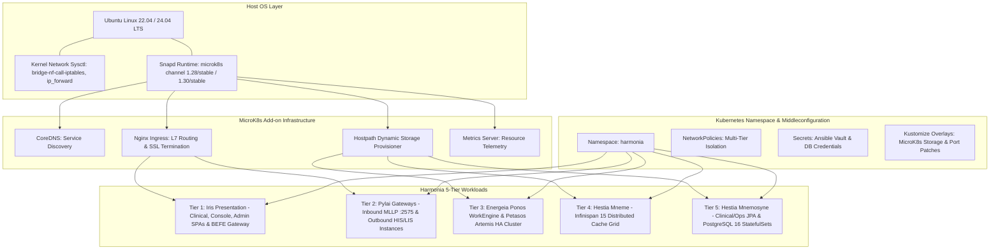

# Requirements

### Overview & Goals
The goal is to maximize operational efficiency, platform reliability, and deployment reproducibility by authoring a comprehensive, authoritative technical appendix in the Harmonia LaTeX documentation suite. This appendix will serve as the single source of truth for platform infrastructure requirements, MicroK8s component architecture, Kubernetes middleconfiguration, middleware runtime parameters, and automated Ansible deployment orchestration.

### Scope
#### In Scope
- **Host Infrastructure & Platform Prerequisites**:
  - Operating system support (Ubuntu Linux 22.04 LTS Jammy / 24.04 LTS Noble on x86_64 and ARM64).
  - Hardware sizing profiles (Minimum Reference, Dev/Test, and High-Throughput Production).
  - Linux kernel parameters and sysctl networking configurations (`net.bridge.bridge-nf-call-iptables`, `net.ipv4.ip_forward`, `fs.inotify.max_user_watches`, swap policies).
  - Host networking, firewall rules, and ingress port matrix (80/tcp, 443/tcp, 2575/tcp, 16443/tcp).
- **MicroK8s Component Architecture & Add-ons**:
  - Snap installation channels (`1.28/stable`, `1.30/stable`), user group permissions, and classic confinement.
  - Authoritative MicroK8s add-on specifications: CoreDNS (`dns`), Nginx Ingress Controller (`ingress`), dynamic local storage provisioner (`hostpath-storage`), and resource telemetry (`metrics-server`).
  - StorageClass parameters (`microk8s-hostpath`), host directory bindings, and reclaim policies.
  - Ingress configuration, proxy buffer sizing, request timeouts, and SSL/TLS termination.
- **Kubernetes Middleconfiguration & Cluster Architecture**:
  - Declarative Kustomize Base and Overlay hierarchy (`deployment/kubernetes/base` and `environments/microk8s/`).
  - Namespace definitions (`harmonia`) and multi-tier NetworkPolicies restricting inter-service traffic.
  - Secret and ConfigMap management using Ansible Vault with `no_log: true` protections.
  - Container health check specifications (`livenessProbe`, `readinessProbe`, `startupProbe`) and CPU/Memory resource allocations.
- **Tier-by-Tier Middleware Configuration Details**:
  - ActiveMQ Artemis 2.33.0 HA dual paired replication (`group-a`, `group-b`), symmetric clustering, load balancing, and failover connection strings.
  - Infinispan 15 data grid clustering, JGroups discovery, Hot Rod protocol, and custom write-behind `NonBlockingStore` SPI.
  - Mnemosyne JPA persistence servers and PostgreSQL 16 StatefulSets.
  - Energeia Ponos WildFly 31 workflow execution engine.
  - Pylai MLLP Inbound and Outbound Gateway configurations.
  - Iris Presentation SPAs and BEFE dual-port gateway (FHIR 8080 / Operations 8090).
- **Ansible Automation & Lifecycle Workflows**:
  - Playbook workflows: `prepare-microk8s.yml`, `deploy-harmonia.yml`, `undeploy-harmonia.yml`, and `decommission-microk8s.yml`.
  - Non-destructive teardown vs. destructive persistent data purging.
  - Rollout verification loops and failure diagnostics.
- **Visual Architecture Model**:
  - Dedicated ArchiMate 3.2 TikZ diagram (`docs/latex/diagrams/fig-microk8s-infrastructure.tex`) and master LaTeX document integration (`docs/latex/main.tex`).

#### Out of Scope
- Modifying underlying Java application code or business logic.
- Hardcoding proprietary credentials or environment-specific IP addresses into documentation examples.
- Documenting unmaintained or non-authoritative third-party Kubernetes distributions.

### User Stories
- **As an Infrastructure Engineer**, I want a rigorous specification of host prerequisites and kernel parameters so that I can provision Ubuntu servers that prevent kernel packet drops, port contention, and I/O bottlenecks.
- **As a DevOps Engineer**, I want a complete blueprint of MicroK8s add-ons, Kustomize overlays, and Ansible playbooks so that I can deploy the 5-tier platform reproducibly in minutes with zero configuration drift.
- **As a Platform Operator**, I want explicit middleware configuration tables (Artemis HA, Infinispan, PostgreSQL, WildFly, Nginx) so that I can optimize resource allocations, tune connection pools, and troubleshoot distributed failures rapidly.
- **As a Systems Auditor**, I want transparent documentation of secret handling and data retention policies so that I can verify compliance with data privacy mandates and prevent accidental loss of clinical records.

### Functional Requirements
- **FR-01 (Master Document Integration)**: The appendix must be integrated into `docs/latex/main.tex` under the appendices section and compile seamlessly into the master document.
- **FR-02 (Infrastructure Sizing & Host Prerequisites)**: Provide unambiguous hardware sizing tables, kernel sysctl settings, and network firewall matrices.
- **FR-03 (MicroK8s Component Blueprint)**: Detail the purpose, configuration parameters, and verification steps for all four core MicroK8s add-ons (`dns`, `ingress`, `hostpath-storage`, `metrics-server`).
- **FR-04 (Middleconfiguration & Declarative Manifests)**: Describe Kustomize base and overlay structures, NetworkPolicy boundaries, and container probe timing.
- **FR-05 (Middleware Configuration Catalog)**: Enumerate exact environment variables, ports, connection URLs, and persistence parameters for Artemis, Infinispan, PostgreSQL, WildFly, and Vue/Nginx across all 5 tiers.
- **FR-06 (Storage Lifecycle Governance)**: Provide clear guidance on persistent storage retention, volume claims, and explicit opt-in data purge mechanisms.
- **FR-07 (ArchiMate Architectural Diagram)**: Render a TikZ-based ArchiMate physical infrastructure diagram modeling the host, MicroK8s runtime, add-ons, and containerized tiers.

### Non-Functional Requirements
- **Completeness & Accuracy**: Every parameter, port, volume mount, and playbook command must match the codebase manifests in `deployment/` exactly.
- **Visual Consistency**: Diagrams and tables must adhere to the formatting, color palettes, and typography established in `harmonia-doc.sty` and `harmonia-archimate.sty`.
- **Maintainability**: LaTeX source must be modular, well-commented, and structured with standardized section and table labels.

# Technical Design

### Current Implementation
The Harmonia documentation suite located under `docs/latex/` contains chapters covering motivation, business layer, application layer, data architecture, technology layer, and physical deployment (`06-deployment-ha.tex`), along with appendices A through G covering Paradeigma, MLLP services, Ergon modules, Praxis workflows, Provider Registry, PHI logging, and Iris user interfaces.
The project contains an automated MicroK8s and Kubernetes deployment framework in `deployment/` (including `deployment/kubernetes/base/`, `deployment/kubernetes/environments/microk8s/`, and `deployment/ansible/`), as well as a markdown reference guide in `docs/deployment-microk8s.md`.
However, there is currently no dedicated LaTeX appendix that formally integrates the full platform infrastructure requirements, MicroK8s add-on architecture, declarative middleconfiguration, and middleware runtime specifications into the authoritative ArchiMate reference manual.

### Key Decisions
1. **Appendix Placement & Title**: Position the new chapter as Appendix H (`\chapter{Platform Infrastructure, MicroK8s \& Middleware Configuration Specification}`, `\label{app:infrastructure_configuration}`) immediately following Appendix G in `docs/latex/main.tex`.
2. **Dedicated ArchiMate Diagram**: Create `docs/latex/diagrams/fig-microk8s-infrastructure.tex` utilizing TikZ and `harmonia-archimate.sty` deployment nodes to represent the physical host, MicroK8s runtime boundary, CoreDNS / HostPath / Ingress add-ons, and the 5-tier containerized deployment topology.
3. **Structured Parameter Matrices**: Format all system parameters, environment variables, port mappings, volume paths, probe timeouts, and resource requests into structured `tabularx` and `longtable` matrices for optimal engineering utility and reference clarity.
4. **Declarative Middleconfiguration Model**: Frame the middleconfiguration around the Kustomize Base + Overlay architecture, highlighting how declarative manifests decouple application runtime containers from platform-specific infrastructure variations.

### Proposed Changes
#### 1. Master LaTeX Document Update
- Update `docs/latex/main.tex` to include:
  ```latex
  \input{chapters/appendix-infrastructure-configuration.tex}
  ```

#### 2. ArchiMate Infrastructure Diagram (`docs/latex/diagrams/fig-microk8s-infrastructure.tex`)
- TikZ diagram depicting:
  - **Host Tier**: Ubuntu 22.04/24.04 LTS OS, Linux Kernel, Host Networking.
  - **Platform Tier**: MicroK8s Snap Runtime (`1.28/stable` / `1.30/stable`), Add-ons (CoreDNS, Nginx Ingress, Hostpath Storage Provisioner, Metrics Server).
  - **Namespace Tier**: `harmonia` namespace and NetworkPolicy envelope.
  - **Workload Tier**: 5-Tier containerized microservices and stateful StatefulSets with isolated PVC mounts.

#### 3. Infrastructure & Middleware Appendix (`docs/latex/chapters/appendix-infrastructure-configuration.tex`)
The chapter will be structured into six comprehensive sections:
1. **Overview & Infrastructure Strategy**: Architectural separation of concerns (Application $\rightarrow$ OCI Container $\rightarrow$ Kustomize Base $\rightarrow$ Environment Overlay $\rightarrow$ Ansible Orchestration), single-node resilience semantics vs. multi-node clustering.
2. **Platform & Host Infrastructure Requirements**: Sizing matrices (vCPU, RAM, NVMe/SSD, IOPS), Linux kernel network parameters (`net.bridge.bridge-nf-call-iptables=1`, `net.ipv4.ip_forward=1`), firewall rules and port exposure matrices.
3. **MicroK8s Component Architecture & Add-on Specification**: Snap confinement, user group setup, CoreDNS upstream resolution, Nginx Ingress Controller (annotations, body limits, proxy timeouts, SSL termination), `hostpath-storage` StorageClass (`/var/snap/microk8s/common/default-storage/`), and `metrics-server` telemetry.
4. **Kubernetes Middleconfiguration & Cluster Architecture**: Kustomize Base and Overlay structure, `harmonia` namespace governance, multi-tier NetworkPolicy egress/ingress firewalling, secret injection workflows via Ansible Vault (`no_log: true`), container health probe configurations (`livenessProbe`, `readinessProbe`, `startupProbe`), and resource request/limit guidelines.
5. **Tier-by-Tier Subsystem Middleware Configuration Detail**:
   - *Petasos Messaging*: ActiveMQ Artemis 2.33.0 HA dual paired replication (`group-a`, `group-b`), server-side clustering (`petasos-cluster`), `ON_DEMAND` load balancing, `redistribution-delay: 0`, and client failover URI specifications.
   - *Hestia Mneme Cache*: Infinispan 15 StatefulSets, Hot Rod protocol (`11222`/`11223`), JGroups discovery (`7800`/`7801`), write-behind `NonBlockingStore` SPI (`FhirRestCacheStore`, `OperationsRestCacheStore`).
   - *Hestia Mnemosyne & PostgreSQL*: Spring Boot 3 / HAPI FHIR JPA REST servers, HikariCP connection pools, PostgreSQL 16 StatefulSets (`postgres-1`, `postgres-2`, `postgres-ops-1`, `postgres-ops-2`), and data volume mounts.
   - *Energeia Ponos*: WildFly 31 Task Sequence Processor, Artemis JMS consumers, and runtime telemetry endpoints.
   - *Pylai Gateway*: WildFly 31 Inbound MLLP gateway (port 2575) and dedicated Outbound MLLP instances (HIS port 8087, LIS port 8088).
   - *Iris Presentation*: WildFly 31 BEFE dual-port gateway (FHIR port 8080, Operations port 8090) and Vue 3 Single Page Applications on Nginx.
6. **Ansible Automation, Storage Lifecycle & Operational Runbooks**: Playbook architectures (`prepare-microk8s.yml`, `deploy-harmonia.yml`, `undeploy-harmonia.yml`, `decommission-microk8s.yml`), non-destructive teardown vs. destructive data purges (`-e harmonia_purge_data=true`), rollout verification polling, health check procedures, and disaster recovery runbooks.

### File Structure Changes
```
docs/latex/
├── main.tex                                         # Add input for new appendix
├── diagrams/
│   └── fig-microk8s-infrastructure.tex              # New ArchiMate TikZ infrastructure diagram
└── chapters/
    └── appendix-infrastructure-configuration.tex    # New comprehensive Appendix H
```

### Architecture Diagram


### Risks & Mitigations
- **Risk**: Discrepancies between documentation parameters and actual YAML manifests in `deployment/`.
  - **Mitigation**: Directly extract and cross-verify all ports, environment variable names, volume paths, probe timings, and resource allocations against `deployment/kubernetes/base/` and `deployment/ansible/`.
- **Risk**: LaTeX compilation errors or missing packages.
  - **Mitigation**: Utilize only established packages and ArchiMate macros defined in `styles/harmonia-doc.sty` and `styles/harmonia-archimate.sty`.
- **Risk**: Confusion regarding single-node availability semantics vs. multi-node clustering.
  - **Mitigation**: Explicitly document that single-node MicroK8s provides pod and process restart resilience while multi-node deployment requires network-attached storage provisioners (CSI) and node anti-affinity rules.

# Delivery Steps

### ✓ Step 1: Create ArchiMate diagram and master LaTeX document bindings
The master LaTeX document binds the new appendix and includes a dedicated ArchiMate 3.2 TikZ physical infrastructure diagram.

- Create `docs/latex/diagrams/fig-microk8s-infrastructure.tex` illustrating Ubuntu host OS, MicroK8s runtime, CNI/Storage/Ingress add-ons, Kubernetes namespace boundaries, and 5-tier Harmonia workload topology using `harmonia-archimate.sty` nodes and relationships.
- Update `docs/latex/main.tex` to register `\input{chapters/appendix-infrastructure-configuration.tex}` in the master document appendices section.
- Create initial template for `docs/latex/chapters/appendix-infrastructure-configuration.tex` with standard chapter headers, metadata labels, and overview introductory sections.

### ✓ Step 2: Document host platform prerequisites and MicroK8s component architecture
The appendix includes exhaustive host operating system specifications, sizing matrices, sysctl tuning, and MicroK8s core add-on configurations.

- Document supported operating systems (Ubuntu 22.04 / 24.04 LTS x86_64 and ARM64) and hardware sizing profiles (Minimum Reference, Dev/Test, High-Throughput Production).
- Detail Linux kernel networking and sysctl configuration (`net.bridge.bridge-nf-call-iptables=1`, `net.bridge.bridge-nf-call-ip6tables=1`, `net.ipv4.ip_forward=1`, `fs.inotify.max_user_watches`).
- Formulate firewall and ingress network port matrices for external and internal traffic (Ports 80, 443, 2575, 16443, CNI subnets).
- Specify MicroK8s installation via Snap (`1.28/stable` / `1.30/stable`), user group permissions (`microk8s`), and detailed configuration for all mandatory add-ons (`dns` CoreDNS, `ingress` Nginx, `hostpath-storage` StorageClass, `metrics-server`).

### ✓ Step 3: Document Kubernetes middleconfiguration and middleware parameters
The appendix provides declarative Kubernetes middleconfiguration specifications, security policies, and subsystem middleware parameters.

- Detail Kustomize Base and Overlay structure (`deployment/kubernetes/base` and `environments/microk8s/`).
- Document namespace isolation (`harmonia`), Pod NetworkPolicies (ingress/egress traffic isolation across presentation, gateway, workflow, cache, messaging, and database tiers).
- Document secret and configuration management (separation of static ConfigMaps from sensitive credentials, Ansible Vault integration with `no_log: true`).
- Detail tier-by-tier runtime middleware configuration:
  - **Petasos (ActiveMQ Artemis 2.33.0)**: Paired HA journal replication (`group-a`, `group-b`), server-side clustering (`petasos-cluster`), `ON_DEMAND` load balancing, `redistribution-delay: 0`, and failover connection URI parameters.
  - **Hestia Mneme (Infinispan 15)**: Clustered StatefulSets (`infinispan-1`, `infinispan-2`), Hot Rod protocol on 11222/11223, JGroups discovery on 7800/7801, write-behind `NonBlockingStore` SPI (`FhirRestCacheStore`, `OperationsRestCacheStore`).
  - **Hestia Mnemosyne & PostgreSQL 16**: JPA REST servers (`mnemosyne-clinical`, `mnemosyne-operations`), HikariCP connection pools, and PostgreSQL 16 StatefulSets (`postgres-1`, `postgres-2`, `postgres-ops-1`, `postgres-ops-2`).
  - **Energeia Ponos**: WildFly 31 Task Sequence Processor, Artemis JMS consumers, and runtime telemetry endpoints.
  - **Pylai Gateways**: Inbound MLLP gateway (port 2575) and dedicated Outbound MLLP gateways (HIS port 8087, LIS port 8088).
  - **Iris Presentation**: BEFE gateway (dual-port 8080/8090) and Vue 3 SPAs (`iris-clinical`, `iris-console`, `iris-administration`) on Nginx.
- Detail container health probe configurations (`livenessProbe`, `readinessProbe`, `startupProbe`) and resource requests/limits across all services.

### ✓ Step 4: Document Ansible automation, storage lifecycle, and validate LaTeX build
The appendix documents end-to-end Ansible automation playbooks, storage lifecycle policies, operational procedures, and compiles cleanly.

- Document Ansible playbooks: `prepare-microk8s.yml`, `deploy-harmonia.yml`, `undeploy-harmonia.yml`, `decommission-microk8s.yml`.
- Specify PersistentVolumeClaim (PVC) lifecycle rules distinguishing safe workload teardown from destructive data purges (`-e harmonia_purge_data=true`).
- Include operational health check runbooks, diagnostic troubleshooting commands, rollout verification loops, and disaster recovery procedures.
- Validate LaTeX syntax, cross-references (`\ref`, `\label`), tables, code listings, and build consistency across the entire documentation suite.