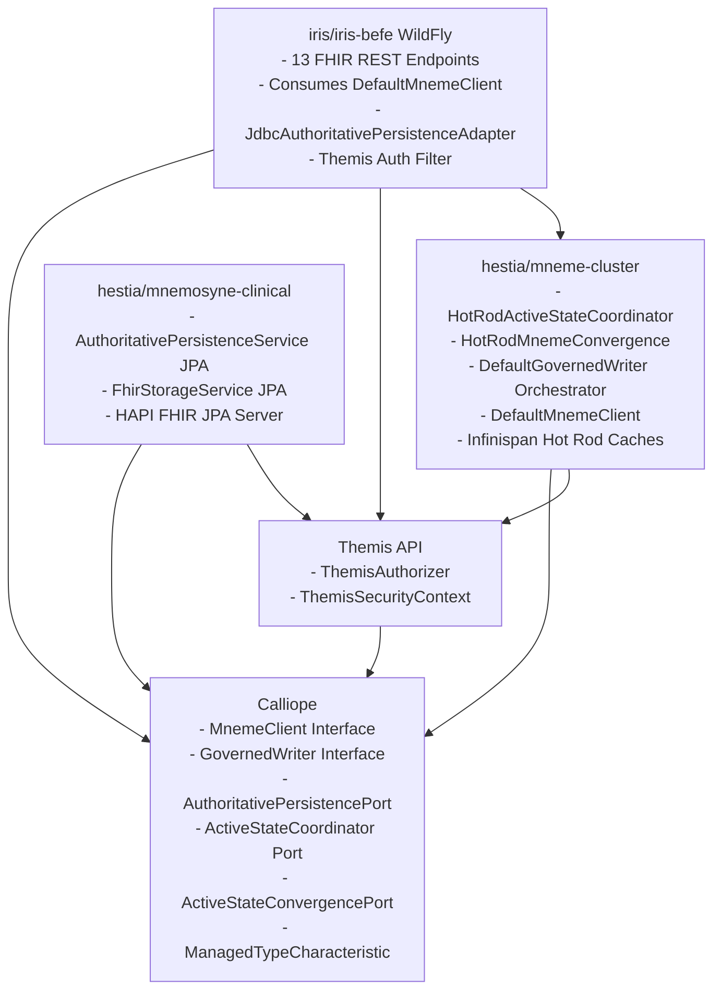

# Requirements

### Overview & Goals
Step 08.05 establishes the unified architectural integration of Harmonia's governed-write pipeline (developed in Steps 08.04A–D) behind **ONE normal Mneme application-facing resource and data-object API**. 

Rather than exposing parallel governed and ungoverned APIs or requiring presentation layers (such as Iris BEFE) to orchestrate security, active-state coordination, and persistence ports, **governance is modeled as a platform-defined characteristic of how Harmonia manages a type**.

The primary systemic objectives are:
1. **Single Application-Facing Mneme API**: Expose one consistent, standard, type-neutral Mneme API across Harmonia. Ordinary clients (such as BEFE) interact with Mneme naturally and remain completely agnostic to whether the underlying resource or data object is governed.
2. **Platform-Level Managed-Type Governance**: Determine governed vs. ungoverned behavior strictly via platform configuration, separating canonical semantic characteristics (in Calliope) from Mneme infrastructure cache mappings (in Mneme), without modifying, subclassing, wrapping, or annotating externally defined HAPI FHIR model classes (`Patient`, `Practitioner`, etc.).
3. **Fail-Closed Type Safety**: Enforce a strict platform invariant where Mneme fails closed (rejects the operation) whenever a resource/data-object presented through its managed API lacks a registered management definition.
4. **Encapsulate 08.04A–D Behind Mneme via Dependency Inversion**: Ensure `GovernedWriter`, `ActiveStateCoordinator`, `ActiveStateConvergencePort`, and `AuthoritativePersistencePort` remain internal engine components behind Mneme. Eliminate any circular module dependencies between `mneme-cluster` and `mnemosyne-clinical`. BEFE shall not call Mnemosyne directly nor compose governance steps.
5. **Preserve HTTP / FHIR Concurrency & Semantics Without Leaking Internal State**: Deterministically map sealed `WriteResult<T>` outcomes to standard HTTP status codes, `OperationOutcome` diagnostics, and `ETag` headers. External callers are never exposed to internal convergence states (e.g. `Committed(DEGRADED)` maps to standard `201 Created` / `200 OK` without internal `Warning: 299` headers).
6. **Enforce ADR-020 Lifecycle Governance**: Prohibit physical deletion across governed clinical resources. Remove physical DELETE from the governed programming model and reject BEFE `@DELETE` requests with HTTP `405 Method Not Allowed` directing clients to governed lifecycle updates.
7. **Explicit Task 09 Boundary & Observation Lifetime**: Reframe Task 09 as an internal enhancement to Mneme's normal read path for governed types, enabling cache-aside point reads and resolving the `GovernedRead` observation context lifetime across READ -> UPDATE while strictly isolating internal Mneme version provenance (`BL-09-01`).

---

### Scope
- **In Scope (Step 08.05A)**:
  - Resolved Mneme / Mnemosyne composition dependency graph via pure Calliope contracts (zero circular dependencies).
  - Clear separation of semantic type governance (Calliope) from Mneme infrastructure cache mappings (Mneme).
  - Explicit managed-type identity mechanism independent of Java simple class names.
  - Type-neutral `MnemeClient` application-facing API facade.
  - Fail-closed type safety for unregistered managed types.
  - Full migration of BEFE clinical `POST / CREATE` operations to `MnemeClient.create(...)`.
  - Removal of physical DELETE from the governed programming model and rejection of BEFE `@DELETE` endpoints with HTTP `405 Method Not Allowed`.
  - Retaining legacy `FhirCacheService.saveResource()` strictly for remaining un-migrated `PUT` paths until Step 08.05B.
  - Clean HTTP/FHIR status mapping with zero external exposure of Mneme internal convergence states.
  - Formalizing Task 09 design questions regarding `GovernedRead` observation lifetime.

- **Out of Scope (Deferred to Task 09 & Step 08.05B)**:
  - Implementation of Task 09 authoritative cache-aside point reads and read repairs.
  - Migration of BEFE clinical `PUT / UPDATE` operations (Step 08.05B, contingent on Task 09).
  - Migration of Pylai MLLP ingress or Ponos workflow pipelines.
  - Physical database deletion or automated background reconciliation daemons.

# Technical Design

### 1. Mneme / Mnemosyne Composition & Dependency Architecture

#### 1.1 Dependency Resolution & Module Decoupling
To eliminate circular dependencies and solve runtime composition across deployables without violating **Invariant 3 (Iris Presentation Decoupling)**, Harmonia uses **dependency inversion through Calliope pure contracts**:

- **`Calliope` (`calliope`)**:
  - Defines the core application contract: `MnemeClient` (type-neutral facade).
  - Defines internal engine contracts: `GovernedWriter`, `ActiveStateCoordinator`, `ActiveStateConvergencePort`.
  - Defines the persistence boundary: `AuthoritativePersistencePort<T>` and result models (`AuthoritativePersistenceResult`, `AuthoritativePreconditionConflict`).
  - Defines data contracts: `ResourceKey`, `GovernedRead<T>`, `WriteResult<T>`, `ConvergenceStatus`, `ManagedTypeCharacteristic`.
  - Has zero dependencies on higher modules.

- **`Mneme Cluster` (`hestia/mneme-cluster`)**:
  - Implements `ActiveStateCoordinator` (`HotRodActiveStateCoordinator`).
  - Implements `ActiveStateConvergencePort` (`HotRodMnemeConvergence`).
  - Implements `GovernedWriter` (`DefaultGovernedWriter`), orchestrating `ThemisAuthorizer`, `ActiveStateCoordinator`, `AuthoritativePersistencePort`, and `ActiveStateConvergencePort` with zero JPA/Hibernate dependencies.
  - Implements `MnemeClient` (`DefaultMnemeClient` / `HotRodMnemeClient`), which accepts injected `GovernedWriter` and `RemoteCacheManager`.
  - Depends **only** on `calliope`, `themis-api`, `infinispan-core`, `infinispan-client-hotrod`.
  - **Does NOT depend on `mnemosyne-clinical`**.

- **`Mnemosyne Clinical` (`hestia/mnemosyne-clinical`)**:
  - Implements `AuthoritativePersistencePort<IBaseResource>` (`AuthoritativePersistenceService`) using Spring Data JPA and PostgreSQL.
  - Acts as a pure persistence provider and HAPI FHIR JPA server.
  - Does **NOT** depend on `mneme-cluster` or active-state cache convergence.

- **`Iris BEFE` (`iris/iris-befe`)**:
  - Depends on `calliope`, `themis-api`, `themis-core`, and `mneme-cluster` (Hot Rod client / `DefaultMnemeClient` / `DefaultGovernedWriter`).
  - Consumes `MnemeClient` directly.
  - Satisfies `AuthoritativePersistencePort` via standard JDBC container DataSource (`AuditDataSourceProducer` / `FHIR_DB_URL` pattern) without bundling Spring Boot, JPA, or Hibernate.
  - Has **zero** dependencies on `mnemosyne-clinical`, fully upholding **Invariant 3 (Iris Decoupling)**.

#### 1.2 Maven & Module Dependency Diagram



*(Zero circular dependencies. Strict unidirectional layering: Calliope -> Themis API -> Mneme Cluster -> Mnemosyne / Iris BEFE).*

---

### 2. Managed-Type Metadata Ownership & Separation of Concerns

The architecture strictly separates **semantic governance metadata** from **Mneme infrastructure configuration**:

#### 2.1 Semantic Governance Characteristic (`Calliope`)
Calliope owns the canonical platform classification of whether a logical type is subject to governed persistence:
```java
package net.fhirfactory.harmonia.model.mneme;

public enum ManagedTypeCharacteristic {
    GOVERNED,
    UNGOVERNED
}
```
Platform registrations in Calliope establish:
- Clinical FHIR types (`Practitioner`, `PractitionerRole`, `Organization`, `Location`, `HealthcareService`, `Person`, `RelatedPerson`, `Group`, `Task`, `Consent`, `Communication`, `DocumentReference`, `Provenance`) -> `GOVERNED`.
- Harmonia internal operational/telemetry objects (`Pragma`, `TaskSequence`) -> `UNGOVERNED`.

#### 2.2 Mneme Infrastructure Mapping (`hestia/mneme-cluster`)
Mneme owns the infrastructure-level mapping from logical managed types to concrete cache configurations:
- Mapping logical type to physical cache name (e.g. `Practitioner` -> `"practitioner-cache"`, `TaskSequence` -> `"tasksequence-cache"`).
- Serialization/deserialization mechanics (HAPI FHIR R5 JSON parser vs Jackson ObjectMapper).
- Cache configuration parameters (TTL, max idle, eviction, sync/async replication).

#### 2.3 Client Ignorance Invariant
Ordinary clients (such as BEFE) remain completely ignorant of:
- Whether the type is `GOVERNED` or `UNGOVERNED`.
- Which Infinispan cache stores the active representation.
- How persistence and convergence are executed.
The caller simply invokes `mnemeClient.create(resource, securityContext)`. Mneme resolves the governance characteristic and infrastructure mapping internally.

---

### 3. Managed-Type Identity Mechanism

To avoid fragile coupling to Java simple class names (`resource.getClass().getSimpleName()`):
1. **FHIR Resources**: Identity is resolved via HAPI's standard model introspection (`resource.fhirType()` or structure definition URI), mapping deterministically to the canonical FHIR resource name (e.g. `"Practitioner"`, `"Task"`).
2. **Non-FHIR Managed Data Objects**: Data objects implement a type descriptor interface or declare an explicit platform-registered type identifier (e.g. via `TypeIdentity` / `ResourceKey.resourceType()`).
3. **Fail-Closed Resolution**:
   - When an object is submitted to `MnemeClient`, Mneme resolves its canonical type identifier.
   - If the type is not registered in the platform governance registry, Mneme **fails closed immediately**:
     - Returns `WriteResult.notCommitted(key, "Unmanaged type: " + typeId)` or throws `UnmanagedTypeException`.
     - It **never** falls back to an ungoverned cache put, default cache, or dynamic registration.

---

### 4. Type-Neutral Mneme Application-Facing API

Mneme facades both FHIR resources and non-FHIR data objects through a clean, type-neutral interface:

```java
package net.fhirfactory.harmonia.model.mneme;

import net.fhirfactory.harmonia.model.governedwrite.ResourceKey;
import net.fhirfactory.harmonia.model.governedwrite.WriteResult;
import net.fhirfactory.harmonia.themis.api.model.ThemisSecurityContext;
import java.util.Optional;

/**
 * Single application-facing API for Mneme managed resources and data objects.
 */
public interface MnemeClient {

    /**
     * Creates a managed resource or data object with explicit key.
     */
    <T> WriteResult<T> create(ResourceKey key, T object, ThemisSecurityContext securityContext);

    /**
     * Creates a self-identifying managed resource (e.g. FHIR resource with embedded type and ID).
     */
    <T> WriteResult<T> create(T object, ThemisSecurityContext securityContext);

    /**
     * Updates an existing managed resource or data object.
     * (Governed types require observation context established via Task 09).
     */
    <T> WriteResult<T> update(ResourceKey key, T object, ThemisSecurityContext securityContext);

    /**
     * Retrieves a managed resource or data object by key.
     */
    <T> Optional<T> get(ResourceKey key, Class<T> expectedType, ThemisSecurityContext securityContext);
}
```

*Note: In compliance with ADR-020, `delete(...)` is deliberately omitted from the application API. Managed clinical information has zero physical delete semantics.*

---

### 5. CREATE Execution Flow (Step 08.05A)

```
HTTP POST /api/fhir/{ResourceType}
  │
  ├── 1. ThemisClinicalAuthorizationFilter validates identity & policy (CREATE)
  ├── 2. BEFE Endpoint parses JSON payload using HAPI R5 parser
  ├── 3. Assign ID if absent (UUID.randomUUID().toString())
  ├── 4. Extract ThemisSecurityContext from ThemisSecurityContextProvider
  ├── 5. Invoke MnemeClient.create(resource, securityContext)
  │        │
  │        ├── a. Mneme resolves ManagedTypeCharacteristic (GOVERNED)
  │        ├── b. Mneme delegates internally to GovernedWriter.create(key, resource, securityContext)
  │        │        ├── Themis policy authorization check
  │        │        ├── AuthoritativePersistencePort.create(key, resource) [PostgreSQL]
  │        │        └── ActiveStateConvergencePort.converge(key, resource, version) [Hot Rod CAS]
  │        └── c. Returns WriteResult<T> (Committed, Conflict, NotCommitted, OutcomeUnknown)
  │
  └── 6. BEFE maps WriteResult<T> to FHIR HTTP Response (201 Created / 409 Conflict / 503 / 403)
```

---

### 6. Elimination of Physical DELETE (ADR-020)

1. **Normative Principle**: Harmonia clinical data models have zero physical DELETE semantics. Clinical lifecycle events (inactivation, entered-in-error, retirement) are represented as domain-appropriate `UPDATE` operations.
2. **BEFE Endpoint Treatment**:
   - All `@DELETE` methods across all 13 BEFE REST endpoints under `net.fhirfactory.harmonia.befe.rest` are updated to return `HTTP 405 Method Not Allowed`.
   - The response includes a structured FHIR `OperationOutcome` explaining that physical deletion is prohibited under Harmonia ADR-020 and instructing clients to submit lifecycle updates via HTTP `PUT`.
3. **Cache Layer**: Direct physical cache eviction (`remoteCache.remove(id)`) in `FhirCacheService.deleteResource()` is removed/disabled for governed types.

---

### 7. External WriteResult to FHIR / HTTP Response Mapping

To protect internal implementation details, **Mneme active-state convergence states are completely isolated from external consumers**:

| `WriteResult<T>` Outcome | HTTP Status | Response Headers | Response Body | OperationOutcome Code | Guidance & Semantics |
| :--- | :--- | :--- | :--- | :--- | :--- |
| **`Committed(CONVERGED)`** *(CREATE)* | `201 Created` | `Location: /api/fhir/{Type}/{id}`<br/>`ETag: W/"{version}"`<br/>`Content-Type: application/fhir+json` | Serialized resource JSON | N/A | Normal successful authoritative creation. |
| **`Committed(DEGRADED)`** *(CREATE)* | `201 Created` | `Location: /api/fhir/{Type}/{id}`<br/>`ETag: W/"{version}"`<br/>`Content-Type: application/fhir+json` | Serialized resource JSON | N/A | **Identical external success semantics**. Internal convergence degradation is logged and tracked via operational telemetry; NO `Warning: 299` header is leaked to client. |
| **`Committed(CONVERGED)`** *(UPDATE)* | `200 OK` | `ETag: W/"{version}"`<br/>`Content-Type: application/fhir+json` | Serialized resource JSON | N/A | Normal successful authoritative update. |
| **`Committed(DEGRADED)`** *(UPDATE)* | `200 OK` | `ETag: W/"{version}"`<br/>`Content-Type: application/fhir+json` | Serialized resource JSON | N/A | **Identical external success semantics**. Durable commit succeeded; no external warning emitted. |
| **`ActiveConflict`** | `409 Conflict` | `Content-Type: application/fhir+json` | `OperationOutcome` (Error) | `conflict` | In-flight active state conflict. Caller should re-read and retry. |
| **`AuthoritativeConflict`**<br/>`RESOURCE_ALREADY_EXISTS` | `409 Conflict` | `Content-Type: application/fhir+json` | `OperationOutcome` (Error) | `duplicate` | Resource with this identifier already exists in authoritative persistence. |
| **`AuthoritativeConflict`**<br/>`EXPECTED_VERSION_MISMATCH` | `409 Conflict`<br/>*(or `412` if If-Match)* | `Content-Type: application/fhir+json` | `OperationOutcome` (Error) | `conflict` | Authoritative predecessor version mismatch. |
| **`NotCommitted`** *(Themis Denied)* | `403 Forbidden` | `Content-Type: application/fhir+json` | `OperationOutcome` (Error) | `forbidden` | Request rejected by Themis authorization policy. |
| **`NotCommitted`** *(Unmanaged Type)* | `422 Unprocessable` | `Content-Type: application/fhir+json` | `OperationOutcome` (Error) | `processing` / `not-supported` | Platform rejected unmanaged type (fail-closed invariant). |
| **`NotCommitted`** *(Coordination Unavailable)* | `503 Service Unavailable` | `Retry-After: 5`<br/>`Content-Type: application/fhir+json` | `OperationOutcome` (Error) | `transient` | Infrastructure coordination failure. |
| **`OutcomeUnknown`** | `503 Service Unavailable` | `Content-Type: application/fhir+json` | `OperationOutcome` (Error) | `transient` / `unknown` | Authoritative commit state is indeterminate. Epistemically UNKNOWN; client MUST NOT blindly retry. |

---

### 8. Task 09 GovernedRead Observation-Lifetime Design Requirements

Step 08.05 formally documents the architectural requirements for Task 09 point reads and UPDATE prerequisites:

1. **The Observation Lifetime Problem**:
   - In a stateless REST interaction:
     - `GET /fhir/Practitioner/100` -> Mneme observes active state -> constructs `GovernedRead` (`ActiveStateToken`, `AuthoritativeVersion`) -> returns resource to client.
     - Per `BL-09-01`, internal cache-management provenance (`http://harmonia.fhirfactory.net/structure/authoritative-version`) is stripped at the read boundary.
     - `PUT /fhir/Practitioner/100` -> client supplies modified resource.
   - **Critical Task 09 Question**: How does Mneme reconstruct or correlate the observation context (`ActiveStateToken` and `AuthoritativeVersion`) for the subsequent `GovernedWriter.update(...)`?
     - Relying solely on `If-Match: W/"{version}"` provides the expected `AuthoritativeVersion`, but does not supply the distributed `ActiveStateToken`.
     - Silently performing an internal `GET` immediately prior to `PUT` creates a concurrency race window if another writer modified state between the client's read and the update.
2. **Task 09 Acceptance Criteria**:
   - Task 09 must explicitly design and validate the observation context lifecycle across READ -> UPDATE.
   - Maintain strict separation across all 4 version domains (`ActiveStateToken`, `AuthoritativeVersion`, `FHIR meta.versionId`, `HTTP ETag / If-Match`).
   - Satisfy `BL-09-01` without compromising concurrency safety.

---

### 9. Revised Implementation Sequencing (08.05A -> Task 09 -> 08.05B)

1. **Step 08.05A (Current Step)**:
   - Introduce type-neutral `MnemeClient` interface and `ManagedTypeCharacteristic` in Calliope.
   - Implement `DefaultMnemeClient` in `hestia/mneme-cluster` with fail-closed unmanaged type rejection and delegation to `GovernedWriter`.
   - Migrate all 13 BEFE REST endpoints from direct `FhirCacheService.saveResource()` to `mnemeClient.create(...)` on `POST / CREATE`.
   - Update BEFE `@DELETE` methods to return `405 Method Not Allowed` with structured `OperationOutcome`.
   - Mark `FhirCacheService.saveResource()` as `@Deprecated` / legacy (retained strictly for remaining `PUT` operations until 08.05B).
2. **Task 09 (Authoritative Cache-Aside Point Reads)**:
   - Implement Mneme authoritative-backed cache-aside point READ for governed types (`mnemeClient.get`).
   - Implement cache warming on miss and active-state read-repair.
   - Enforce `BL-09-01` provenance isolation.
   - Resolve `GovernedRead` observation lifetime across READ -> UPDATE.
3. **Step 08.05B (BEFE UPDATE Migration)**:
   - Migrate BEFE `PUT / UPDATE` endpoints to `mnemeClient.update(...)`.
   - Enforce HTTP `If-Match` / `ETag` validation against `GovernedRead`.
   - Completely remove deprecated legacy write methods from `FhirCacheService`.

---

### 10. Bypass Elimination Catalog & Controlled Retention

| Path / Component | Current Status | 08.05A State | 08.05B (Post-Task 09) State | Final Architecture State |
| :--- | :--- | :--- | :--- | :--- |
| **BEFE Clinical `POST / CREATE`** | Direct `remoteCache.put` via `FhirCacheService` | **Migrated**: `MnemeClient.create()` -> `GovernedWriter` | Governed `MnemeClient` | Governed |
| **BEFE Clinical `DELETE`** | Physical `remoteCache.remove` | **Eliminated**: HTTP `405 Method Not Allowed` (ADR-020) | HTTP `405 Method Not Allowed` | Governed Lifecycle Only |
| **BEFE Clinical `PUT / UPDATE`** | Direct `remoteCache.put` with local version increment | **Controlled Retention**: Temporarily retained via legacy `FhirCacheService` | **Migrated**: `MnemeClient.update()` with valid `GovernedRead` | Governed `MnemeClient` |
| **Pylai Ingress Gateways** | Direct Artemis queue / cache puts | Unchanged | Task 08 Integration | Governed Ingress |
| **Energeia Ponos Workers** | Direct `task-cache` puts | Unchanged | Task 08 Integration | Governed Workflow |
| **Legacy Cache Store SPI** | Asynchronous `FhirRestCacheStore` | Unchanged | Deprecated post-migration | Retired |

# Testing

### Validation Approach
Verification of the managed-resource governance integration uses focused unit, scenario, and ArchUnit architecture tests without requiring live external infrastructure.

### Key Scenarios & Test Coverage
1. **Type-Neutral Mneme CREATE Success**: Asserts that `MnemeClient.create()` resolves governed types, evaluates Themis authorization, persists authoritatively in Mnemosyne, converges active state in Mneme, and returns `Committed(CONVERGED)` mapped to HTTP `201 Created` with `Location` and `ETag`.
2. **Degraded Convergence External Isolation**: Simulates Hot Rod CAS failure during convergence; verifies that `Committed(DEGRADED)` returns standard HTTP `201 Created` and **zero `Warning: 299` headers** are emitted externally.
3. **Fail-Closed Unmanaged Type Rejection**: Asserts that submitting an unregistered type to `MnemeClient` immediately returns `NotCommitted(UNMANAGED_TYPE)` mapped to HTTP `422 Unprocessable Entity` without touching any database or cache.
4. **Duplicate CREATE Rejection**: Verifies that creating an existing resource key returns `AuthoritativeConflict(RESOURCE_ALREADY_EXISTS)` mapped to HTTP `409 Conflict`.
5. **ADR-020 DELETE Rejection**: Asserts that all BEFE clinical `@DELETE` endpoints return HTTP `405 Method Not Allowed` with structured `OperationOutcome` explaining ADR-020 lifecycle update requirements.
6. **No Premature PUT Breakage**: Verifies that legacy `PUT` operations continue functioning through deprecated `FhirCacheService.saveResource()` pending Task 09.
7. **Themis Default-Deny**: Asserts that unauthenticated or unauthorized `POST` requests return `403 Forbidden` with zero persistence side effects.

### Architectural Invariant Verification
- Execute ArchUnit test suite in `paradeigma-test`:
  ```bash
  mvn test -pl paradeigma/paradeigma-test -am -Dtest="*ArchitectureTest"
  ```
- **Rules Verified**:
  - `GovernedWriteCompositionArchitectureTest`: Verifies dependency inversion, zero circular dependencies, and ADR-020 zero DELETE methods on write ports.
  - `IrisDecouplingArchitectureTest`: Asserts that `iris-befe` has zero imports of JPA (`jakarta.persistence..`), Hibernate (`org.hibernate..`), PostgreSQL (`org.postgresql..`), or server-side HAPI JPA (`ca.uhn.fhir.jpa..`).
  - `MnemosyneAuthoritativePersistenceArchitectureTest`: Asserts that Mnemosyne persistence does not depend on Infinispan or Mneme active coordination.