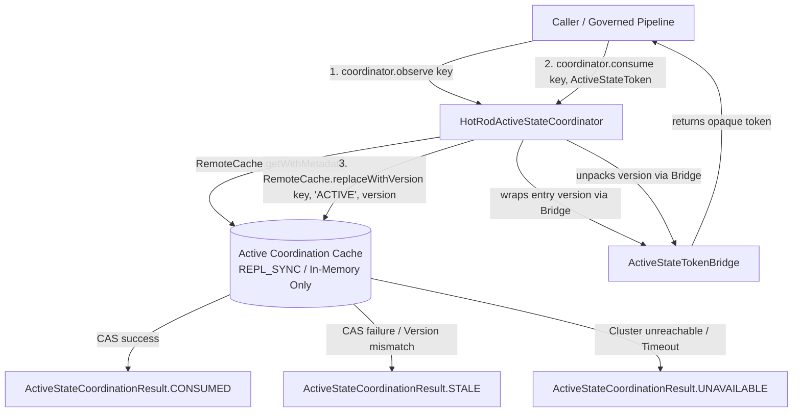

# Requirements

### Overview & Goals
Task 08 Step 08.04B implements the smallest production capability in Mneme (Infinispan / Hot Rod) required to support distributed active-state coordination beneath the governed-write contract established in Step 08.04A. This capability encapsulates native Hot Rod optimistic concurrency (`replaceWithVersion`) into a dedicated, non-authoritative active-state coordinator without introducing resource caching complexity, application version arithmetic, or process-local fallbacks.

### Terminology Correction (from Step 08.04A)
- Rename `ActiveCoordinationToken` to `ActiveStateToken` across all production Java code, unit tests, architecture tests, and documentation.
- **Rationale**: The token strictly identifies *what was observed* (the opaque identity of the Mneme active state associated with a resource observation), rather than prescribing subsequent actions.

### Scope
#### In Scope
- Renaming `ActiveCoordinationToken` -> `ActiveStateToken` with complete removal of legacy aliases.
- Small production `ActiveStateCoordinator` interface with `observe(ResourceKey)` and `consume(ResourceKey, ActiveStateToken)`.
- `ActiveStateCoordinationResult` outcome enum (`CONSUMED`, `STALE`, `UNAVAILABLE`).
- Strict token opacity boundary: `ActiveStateToken` exposes zero public constructors or numeric/raw accessors; an internal bridge (`ActiveStateTokenBridge`) enables Mneme to construct and extract Hot Rod entry versions (`long`).
- Dedicated non-persistent `active-coordination-cache` in Infinispan configuration (`REPL_SYNC`, in-memory only, no `<persistence>` store to Mnemosyne).
- Production `HotRodActiveStateCoordinator` implementing atomic token consumption via `RemoteCache.replaceWithVersion(key, "ACTIVE", version)`.
- Multi-client concurrency tests verifying at-most-one winner invariant (and exactly-one winner under healthy cluster conditions).
- Architecture tests enforcing contract purity, preventing process-local fallback mechanisms, and restricting bridge access to Mneme.
- Design documentation update and completion report in `.junie/reports/`.

#### Out of Scope
- Resource payload observation / retrieval (`ActiveStateObservation<T>` is removed from 08.04B; composition with resource representation and `AuthoritativeVersion` belongs to subsequent governed-read layers).
- Complete `GovernedWriter` implementation (deferred to Step 08.04D).
- Mnemosyne authoritative conditional persistence and SQL adapters (deferred to Step 08.04C).
- Post-commit cache convergence loops.
- Migration of existing production write paths (BEFE, Pylai, Ergon).
- Authoritative database schema changes or JPA `@Version` modifications.
- Distributed locking, leases, heartbeat renewals, application counters, or sequence arithmetic.
- Introduction of new Maven modules or deployable microservices.

### User Stories
- **As an integration service**, I want to observe the current `ActiveStateToken` for a `ResourceKey` from Mneme so that I have a consistent concurrency token for subsequent progression attempts.
- **As a workflow coordinator**, I want competing distributed participants attempting progression from the same observed `ActiveStateToken` to result in at most one successful winner so that concurrent duplicate work is rejected early.
- **As a platform architect**, I want active coordination state to live in an isolated, non-persistent cache so that transient coordination markers never pollute clinical databases.

### Functional Requirements
1. **Token Rename & Strict Opacity**: `ActiveStateToken` represents a real observed Mneme active state. It has no public constructor, no public static factory from primitive/string values, no numeric getters, does not implement `Comparable`, masks `toString()`, and exposes no arithmetic operations.
2. **Internal Token Bridge**: `ActiveStateTokenBridge` allows Mneme infrastructure to create tokens from Hot Rod versions and extract versions for CAS operations, while ArchUnit guardrails restrict its usage exclusively to `net.fhirfactory.harmonia.hestia.mneme..`.
3. **Active-State Observation**: `ActiveStateCoordinator.observe(key)` returns the current `ActiveStateToken` representing the active coordination state for the specified `ResourceKey`.
4. **Atomic Token Consumption**: `ActiveStateCoordinator.consume(key, token)` uses native Hot Rod CAS (`RemoteCache.replaceWithVersion(key, "ACTIVE", version)`) to progress active state.
5. **At-Most-One Winner Guarantee**: For any given `ActiveStateToken`, at most one concurrent participant can receive `CONSUMED`; all other participants receive `STALE`. Under healthy cluster conditions, exactly one winner is produced.
6. **Re-use Rejection**: A previously consumed `ActiveStateToken` cannot be consumed a second time (yields `STALE`).
7. **Boring Coordination State**: Coordination cache values use a fixed marker (`"ACTIVE"`). No UUIDs, counters, or application version arithmetic.
8. **Non-Authoritative Coordination Storage**: Coordination state lives in a dedicated `active-coordination-cache` with zero persistence stores to Mnemosyne.
9. **Visible Failure Without Local Fallback**: If Infinispan or Hot Rod is unreachable, `consume` returns `UNAVAILABLE` without falling back to JVM-local synchronization, CAS, or `ConcurrentHashMap`.

### Non-Functional Requirements
- **Zero Framework Leakage**: Calliope contracts must contain zero dependencies on Infinispan, JPA, or HTTP web frameworks.
- **Complexity Guardrail**: Minimalistic design consisting of one interface, one implementation, one result enum, and one internal token bridge without generic strategy factories or managers.

# Technical Design

### Current Implementation
- `calliope` contains the foundational contract layer (`net.fhirfactory.harmonia.model.governedwrite`), including `ActiveCoordinationToken`, `GovernedRead<T>`, `GovernedWriter`, and `WriteResult<T>`.
- `hestia/mneme-cluster` configures Infinispan clustered caches (`person-cache`, `practitioner-cache`, `task-cache`) with `FhirRestCacheStore` write-through persistence to Mnemosyne.
- `hestia/mneme-cluster/src/test/.../MnemeConcurrencyAndVersionScenarioTest` contains laboratory proof-of-concept tests demonstrating `RemoteCache.getWithMetadata` and `RemoteCache.replaceWithVersion`.

### Key Decisions
1. **Separation of Resource State vs Coordination State**: Step 08.04B implements distributed active-state coordination exclusively. The active coordination cache contains only lightweight coordination markers (`"ACTIVE"`), not resource payloads `T` or FHIR entities. Composition into `GovernedRead<T>` is deferred to higher-level governed-read orchestration.
2. **Vocabulary Rename**: Rename `ActiveCoordinationToken` -> `ActiveStateToken` across the entire codebase to accurately reflect observed active state.
3. **Dedicated Coordination Cache**: Introduce `active-coordination-cache` (`REPL_SYNC`, in-memory only, no `<persistence>` store) to isolate transient coordination markers from clinical persistence stores (`FhirRestCacheStore`).
4. **Token Opacity & Internal Bridge Boundary**: `ActiveStateToken` has package-private constructor and accessor. `ActiveStateTokenBridge` in Calliope provides infrastructure access for Mneme (`create(long)` and `extractVersion(ActiveStateToken)`). ArchUnit rules strictly prohibit application callers, gateways (`pylai`), presentation (`iris`), or workflows (`energeia`) from referencing `ActiveStateTokenBridge`.
5. **Native Hot Rod CAS with Static Marker**: Utilize `RemoteCache.replaceWithVersion(key, "ACTIVE", version)`. Successful CAS advances entry version; failed CAS indicates a stale token. No application-level UUIDs, counters, or generation arithmetic.
6. **No Process-Local Fallback**: Network/cluster failures return `ActiveStateCoordinationResult.UNAVAILABLE`. Silent degradation to `ConcurrentHashMap` or JVM locks is strictly prohibited.

### Architecture Diagram



### Data Models & Contracts

```java
// calliope: net.fhirfactory.harmonia.model.governedwrite.ActiveStateToken
public final class ActiveStateToken implements Serializable {
    private final long version;
    
    // Package-private constructor for internal bridge only
    ActiveStateToken(long version) {
        if (version < 0) {
            throw new IllegalArgumentException("Version must be non-negative");
        }
        this.version = version;
    }
    
    // Package-private accessor for internal bridge only
    long internalVersion() {
        return this.version;
    }
    
    @Override
    public boolean equals(Object o) {
        if (this == o) return true;
        if (o == null || getClass() != o.getClass()) return false;
        ActiveStateToken that = (ActiveStateToken) o;
        return this.version == that.version;
    }
    
    @Override
    public int hashCode() {
        return Long.hashCode(version);
    }
    
    @Override
    public String toString() {
        return "ActiveStateToken[opaque]";
    }
}

// calliope: net.fhirfactory.harmonia.model.governedwrite.ActiveStateTokenBridge
// Infrastructure-only bridge: restricted to Mneme via ArchUnit
public final class ActiveStateTokenBridge {
    private ActiveStateTokenBridge() {}
    
    public static ActiveStateToken create(long version) {
        return new ActiveStateToken(version);
    }
    
    public static long extractVersion(ActiveStateToken token) {
        Objects.requireNonNull(token, "token must not be null");
        return token.internalVersion();
    }
}

// calliope: net.fhirfactory.harmonia.model.governedwrite.ActiveStateCoordinationResult
public enum ActiveStateCoordinationResult {
    CONSUMED,
    STALE,
    UNAVAILABLE
}

// calliope: net.fhirfactory.harmonia.model.governedwrite.ActiveStateCoordinator
public interface ActiveStateCoordinator {
    ActiveStateToken observe(ResourceKey key);
    ActiveStateCoordinationResult consume(ResourceKey key, ActiveStateToken observedToken);
}
```

### Production Implementation (`hestia:mneme-cluster`)

```java
// hestia: net.fhirfactory.harmonia.hestia.mneme.coordination.HotRodActiveStateCoordinator
public class HotRodActiveStateCoordinator implements ActiveStateCoordinator {
    
    private static final String COORDINATION_CACHE_NAME = "active-coordination-cache";
    private static final String COORDINATION_MARKER = "ACTIVE";
    private final RemoteCache<String, String> coordinationCache;

    public HotRodActiveStateCoordinator(RemoteCacheManager cacheManager) {
        this.coordinationCache = cacheManager.getCache(COORDINATION_CACHE_NAME);
    }

    @Override
    public ActiveStateToken observe(ResourceKey key) {
        if (key == null) {
            throw new IllegalArgumentException("ResourceKey must not be null");
        }
        try {
            String cacheKey = key.toQualifiedPath();
            MetadataValue<String> meta = coordinationCache.getWithMetadata(cacheKey);
            if (meta == null) {
                coordinationCache.putIfAbsent(cacheKey, COORDINATION_MARKER);
                meta = coordinationCache.getWithMetadata(cacheKey);
            }
            if (meta == null) {
                throw new IllegalStateException("Failed to observe active coordination state for " + key);
            }
            return ActiveStateTokenBridge.create(meta.getVersion());
        } catch (HotRodClientException | TransportException e) {
            throw new ActiveCoordinationUnavailableException("Coordination cache unavailable", e);
        }
    }

    @Override
    public ActiveStateCoordinationResult consume(ResourceKey key, ActiveStateToken observedToken) {
        if (key == null || observedToken == null) {
            throw new IllegalArgumentException("ResourceKey and observedToken must not be null");
        }
        try {
            long version = ActiveStateTokenBridge.extractVersion(observedToken);
            String cacheKey = key.toQualifiedPath();
            boolean replaced = coordinationCache.replaceWithVersion(cacheKey, COORDINATION_MARKER, version);
            return replaced ? ActiveStateCoordinationResult.CONSUMED : ActiveStateCoordinationResult.STALE;
        } catch (HotRodClientException | TransportException e) {
            return ActiveStateCoordinationResult.UNAVAILABLE;
        }
    }
}
```

### File Structure
- `calliope/src/main/java/net/fhirfactory/harmonia/model/governedwrite/`:
  - `ActiveStateToken.java` (renamed from `ActiveCoordinationToken.java`, opaque representation)
  - `ActiveStateTokenBridge.java` (internal infrastructure bridge for Mneme)
  - `ActiveStateCoordinationResult.java` (outcome enum: CONSUMED, STALE, UNAVAILABLE)
  - `ActiveStateCoordinator.java` (caller-facing coordination interface)
  - `GovernedRead.java` (updated token reference)
- `hestia/mneme-cluster/src/main/resources/infinispan.xml`:
  - Add `active-coordination-cache` definition (`mode="SYNC"`, statistics enabled, zero `<persistence>` stores).
- `hestia/mneme-cluster/src/main/java/net/fhirfactory/harmonia/hestia/mneme/coordination/`:
  - `HotRodActiveStateCoordinator.java`
  - `ActiveCoordinationUnavailableException.java`
- `hestia/mneme-cluster/src/test/java/net/fhirfactory/harmonia/hestia/mneme/coordination/`:
  - `HotRodActiveStateCoordinatorTest.java`
  - `InfinispanActiveStateCoordinatorScenarioTest.java`
- `paradeigma/paradeigma-test/src/test/java/net/fhirfactory/harmonia/paradeigma/test/arch/`:
  - `GovernedWriteContractArchitectureTest.java` (updated with `ActiveStateToken`, token bridge encapsulation rules, and no-local-fallback rules).

### Risks & Mitigations
- **Risk**: Active coordination cache entries might accumulate indefinitely.
  - **Mitigation**: Coordination markers are lightweight entries (`<100 bytes`) with optional lifespan/eviction configuration, and are non-authoritative and reconstructable upon cache restart.
- **Risk**: Accidental write-through to Mnemosyne if misconfigured.
  - **Mitigation**: `active-coordination-cache` strictly omits `<persistence>` blocks in `infinispan.xml` and is validated by scenario and architecture tests.

# Testing

### Validation Approach
Verification combines unit tests in `calliope`, multi-participant clustered scenario tests in `hestia/mneme-cluster` using the in-process `InfinispanLaboratoryServer`, and ArchUnit rules in `paradeigma-test`.

### Key Scenarios
1. **Token Renaming & Strict Opacity (TEST 1 & TEST 8)**:
   - Verify `ActiveStateToken` masks `toString()` to `ActiveStateToken[opaque]`, does not implement `Comparable`, and exposes no public constructors, static `of(...)` factories, or numeric/string getters.
2. **Bridge Encapsulation**:
   - Verify `ActiveStateTokenBridge` allows Mneme to create tokens from `long` versions and extract `long` versions.
   - ArchUnit tests verify that no caller outside `net.fhirfactory.harmonia.hestia.mneme..` (and unit tests) can access `ActiveStateTokenBridge`.
3. **Active-State Observation (TEST 1)**:
   - Verify `ActiveStateCoordinator.observe(key)` returns a valid `ActiveStateToken` corresponding to the active cache version.
4. **Single Consumption & Duplicate Rejection (TEST 3 & TEST 4)**:
   - Verify a single participant can consume an observed token (`ActiveStateCoordinationResult.CONSUMED`).
   - Verify attempting to consume the same token a second time yields `ActiveStateCoordinationResult.STALE`.
5. **At-Most-One Winner Concurrency (TEST 5)**:
   - Run 3 concurrent Hot Rod client participants competing from the same observed `ActiveStateToken`. Under healthy cluster conditions, assert exactly one receives `CONSUMED` and the other two receive `STALE`.
6. **Stale Token Rejection (TEST 6)**:
   - Verify that any token corresponding to an outdated cache version returns `STALE`.
7. **Opaque Progression (TEST 7)**:
   - Verify successful consumption progresses active state via Infinispan's internal versioning without application code assuming generation arithmetic.
8. **Visible Failure Without Local Fallback (TEST 10 & TEST 11)**:
   - Shut down or isolate the Hot Rod server and verify `ActiveStateCoordinator.consume` returns `UNAVAILABLE` rather than degrading to JVM locks or in-memory fallback maps.
9. **No Authoritative Mutation (TEST 12)**:
   - Assert that active-state token consumption does not invoke or mutate Mnemosyne database stores.
10. **Participant Failure Invariance (TEST 13)**:
    - Verify that if a participant consumes a token and crashes before authoritative persistence, the token remains consumed and is not automatically released.

### Architecture Tests
- Verify `calliope` contract package maintains zero dependencies on Infinispan or persistence libraries.
- Verify `GovernedWriter` declares only `create` and `update` (zero DELETE methods).
- Verify `ActiveStateTokenBridge` is restricted to `net.fhirfactory.harmonia.hestia.mneme..`.
- Verify `ActiveStateCoordinator` implementation does not contain JVM-local fallback mechanisms (`ConcurrentHashMap`, `AtomicReference`, `ReentrantLock`).

# Delivery Steps

### ✓ Step 1: Rename ActiveCoordinationToken to ActiveStateToken and establish internal token bridge
Update the Step 08.04A contract vocabulary to reflect observed active-state semantics and establish the token opacity bridge.

- Rename `ActiveCoordinationToken.java` to `ActiveStateToken.java` in `calliope` under `net.fhirfactory.harmonia.model.governedwrite`.
- Enforce strict token opacity: remove public constructor and public `of(...)` factory, retaining only package-private construction and internal version access.
- Implement `ActiveStateTokenBridge.java` in `calliope` under `net.fhirfactory.harmonia.model.governedwrite` to expose `create(long)` and `extractVersion(ActiveStateToken)` for infrastructure use.
- Update all references in `GovernedRead.java`, `GovernedWriter.java`, `WriteResult.java`, and related contract classes.
- Update `GovernedWriteContractTest.java` in `calliope` to verify that `ActiveStateToken` preserves all strict opacity invariants (no public raw getters or factories, not `Comparable`, masked `toString()`, no arithmetic methods).
- Update architecture tests in `paradeigma-test` and design documentation in `docs/design/governed-write-concurrency-contract.md`.
- Execute unit and architecture test suites (`GovernedWriteContractTest`, `GovernedWriteContractArchitectureTest`, `PackageLayeringArchitectureTest`) to ensure a clean baseline before proceeding.

### ✓ Step 2: Define ActiveStateCoordinator API and result taxonomy in Calliope
Establish the caller-facing active-state observation and coordination abstractions.

- Define `ActiveStateCoordinator` interface in `calliope` under `net.fhirfactory.harmonia.model.governedwrite` declaring:
  - `ActiveStateToken observe(ResourceKey key)`
  - `ActiveStateCoordinationResult consume(ResourceKey key, ActiveStateToken observedToken)`
- Define `ActiveStateCoordinationResult` enum (`CONSUMED`, `STALE`, `UNAVAILABLE`) representing atomic CAS progression outcomes.
- Add unit tests in `calliope` validating interface contracts, null-safety preconditions, and result states.

### ✓ Step 3: Configure dedicated coordination cache and implement HotRodActiveStateCoordinator
Configure a dedicated, non-persistent distributed cache in Mneme and implement the Hot Rod CAS active-state coordinator.

- Define `active-coordination-cache` in `hestia/mneme-cluster/src/main/resources/infinispan.xml` as a `REPL_SYNC` cache with zero `<persistence>` stores to prevent pollution of clinical databases.
- Update `InfinispanLaboratoryServer` test fixture to configure and instantiate `active-coordination-cache` across multi-node test topologies.
- Implement `HotRodActiveStateCoordinator` in `hestia/mneme-cluster` utilizing `RemoteCache.getWithMetadata(...)` for observation and `RemoteCache.replaceWithVersion(key, "ACTIVE", version)` for atomic token consumption.
- Enforce strict failure semantics: network or cluster failures return `ActiveStateCoordinationResult.UNAVAILABLE` without falling back to JVM-local CAS or `ConcurrentHashMap`.

### ✓ Step 4: Implement comprehensive test suite and architecture guardrails
Author comprehensive unit, concurrency, multi-participant scenario, and ArchUnit guardrail tests.

- Implement unit tests for `HotRodActiveStateCoordinator` validating parameter validation and error mapping.
- Implement multi-node scenario tests in `hestia/mneme-cluster` verifying: active-state observation, single consumption, duplicate reuse rejection, multi-client race conditions with at-most-one winner (exactly-one in healthy cluster), stale token rejection, and visible failure on cluster unavailability.
- Add ArchUnit guardrails in `GovernedWriteContractArchitectureTest` verifying: zero Infinispan leakage into Calliope contracts, zero DELETE methods, zero process-local fallback mechanisms in the coordination path, and strict restriction of `ActiveStateTokenBridge` to `net.fhirfactory.harmonia.hestia.mneme..`.
- Execute the full test suite across `calliope`, `hestia/mneme-cluster`, and `paradeigma/paradeigma-test`.

### ✓ Step 5: Document active-state coordination and generate Step 08.04B report
Produce the final step documentation and technical review report.

- Update `docs/design/governed-write-concurrency-contract.md` to document the `ActiveStateToken` rename, coordination cache isolation, static marker CAS, and token bridge design.
- Generate the final execution report at `.junie/reports/Harmonia Security - Task 8 - Step 04B - Mneme Active-State Coordination.md`.
- Document implemented types, package structure, test evidence, and explicit confirmations that no authoritative persistence, production write path migration, or new Maven modules were introduced.