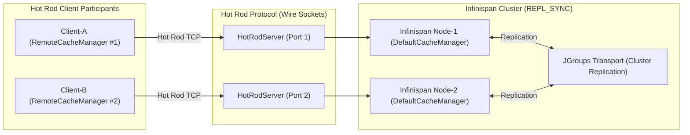

# Requirements

### Overview & Goals
Create an executable learning and architecture-verification laboratory within Harmonia that characterizes, explores, and documents the actual distributed behavior of Mneme (Infinispan data grid and Hot Rod clients) in relation to **ADR-019**. The laboratory serves both as an objective architectural characterization of existing capabilities/gaps and as an educational tool for future developers and architects.

### Scope
- **In Scope**:
  - Implement a real-Infinispan scenario harness in `hestia/mneme-cluster` utilizing genuine clustered `EmbeddedCacheManager` and `HotRodServer` instances with independent `RemoteCacheManager` Hot Rod clients.
  - Implement a lightweight, human-readable test narrator (`MnemeScenarioNarrator`) for structured educational output.
  - Implement 10 focused characterization scenarios:
    1. Distributed Resource Visibility (Client-A write -> Client-B read).
    2. Update Propagation (Client-A update -> immediate Client-B observation).
    3. Uncoordinated Concurrent Update (characterizing current last-writer-wins behavior).
    4. Infinispan Version / Conditional Update (demonstrating `replaceWithVersion` capabilities experimentally).
    5. Participant Failure (resilience of surviving participants).
    6. Cache Loss / Reconstructability (non-authoritative nature of Mneme state).
    7. Read-Dominant / Jittery Access (~10:1 read/write deterministic workload).
    8. Mneme Unavailable (verifying explicit failure semantics without JVM-local fallback).
    9. Required Persistence Failure (verifying store failure semantics).
    10. Recovery After Mneme Availability Returns (clean reconnection without stale local state).
  - Inspect and classify `OperationsAggregatorService.localPragmaStore` under ADR-019.
  - Author comprehensive educational documentation in `hestia/mneme-cluster/docs/mneme-distributed-behaviour.md`.
- **Out of Scope**:
  - Redesigning production Mneme or changing concurrency semantics.
  - Implementing Task 08 authoritative clinical writes, Task 09 cache-aside reads, or Task 10 clinical search.
  - Introducing distributed durability, distributed transactions, or custom synchronization frameworks.
  - Modifying production services unless strictly necessary for test observability.

### User Stories
- As a **Harmonia Architect**, I want an objective, executable laboratory suite characterizing actual Mneme/Infinispan behavior against ADR-019, so that design decisions for subsequent tasks are grounded in verified runtime characteristics.
- As a **Harmonia Developer**, I want human-readable scenario narratives produced during test execution, so that I can quickly learn why Mneme exists, how Infinispan coordinates active state, and how versions are handled.

### Functional Requirements
- **FR-1**: All scenarios must use real Infinispan server and Hot Rod client instances (no Mockito simulation for cache operations).
- **FR-2**: Participant independence between `Client-A` and `Client-B` must be guaranteed via separate `RemoteCacheManager` configurations and connection pools.
- **FR-3**: Output for each scenario must follow the standard narrative format (Purpose, Participants, Initial State, Steps, Final State, Observed Semantics, Mechanism, ADR-019 Assessment).
- **FR-4**: Version dimensions must be explicitly distinguished (FHIR resource version, Infinispan entry version, Mnemosyne durable version).
- **FR-5**: Current concurrency behaviors (e.g., last-writer-wins) must be recorded and asserted as characterization facts without altering production semantics.

### Non-Functional Requirements
- **Performance**: The full laboratory suite must execute fast (under 15 seconds) using in-process embedded Hot Rod servers without requiring an active external Docker daemon.
- **Portability**: Must run consistently across local developer environments and CI runners.
- **Zero Production Pollution**: All test harness, narrator, and laboratory scenario code must reside strictly in test packages.

# Technical Design

### Current Implementation
- `hestia/mneme-cluster` contains the Infinispan cluster configuration (`infinispan.xml`) defining 17 synchronous replicated caches (`CacheMode.REPL_SYNC`) backed by `FhirRestCacheStore` and `OperationsRestCacheStore`.
- Production services (`FhirCacheService`, `DefaultTaskService`, `TaskCacheService`, `PragmaCacheService`, `PraxisService`, `MessageQueueService`) consume Hot Rod `RemoteCache<String, String>` directly via `RemoteCacheManager`.
- Step 03 eliminated all process-local fallback maps (`ConcurrentHashMap`), enforcing fail-explicit semantics on cache unavailability.

### Key Decisions
- **Decision: In-Process Clustered Hot Rod Servers over Docker Containers**
  - *Rationale*: Starting in-process `EmbeddedCacheManager` nodes bound to `HotRodServer` instances on dynamic local ports allows real wire-protocol testing against authentic Infinispan engines with sub-second bootstrap, zero external daemon prerequisites, and deterministic lifecycle control.
- **Decision: Separate Scenario Test Classes by Thematic Grouping**
  - *Rationale*: Grouping scenarios into 4 coherent test classes (`MnemeDistributedVisibilityScenarioTest`, `MnemeConcurrencyAndVersionScenarioTest`, `MnemeFailureAndRecoveryScenarioTest`, `MnemeWorkloadCharacteristicsScenarioTest`) keeps execution clear, focused, and maintainable.
- **Decision: Pure Characterisation Assertions for Existing Concurrency**
  - *Rationale*: Scenarios must record what currently happens (e.g. unconditional PUT overwriting concurrent writes) rather than forcing an idealized behavior that alters production code.

### Architecture Diagram


### Components
- `InfinispanLaboratoryServer`: Manages test-scoped Infinispan cluster nodes and `HotRodServer` instances on dynamic ports.
- `MnemeScenarioNarrator`: Formats and prints structured educational markdown/text narrative blocks for test scenario execution.
- `MnemeDistributedVisibilityScenarioTest`: Exercises Scenarios 01 and 02.
- `MnemeConcurrencyAndVersionScenarioTest`: Exercises Scenarios 03 and 04.
- `MnemeFailureAndRecoveryScenarioTest`: Exercises Scenarios 05, 06, 08, and 10.
- `MnemeWorkloadCharacteristicsScenarioTest`: Exercises Scenarios 07 and 09.

### File Structure
- Added files:
  - `hestia/mneme-cluster/src/test/java/net/fhirfactory/harmonia/infinispan/scenario/support/InfinispanLaboratoryServer.java`
  - `hestia/mneme-cluster/src/test/java/net/fhirfactory/harmonia/infinispan/scenario/support/MnemeScenarioNarrator.java`
  - `hestia/mneme-cluster/src/test/java/net/fhirfactory/harmonia/infinispan/scenario/MnemeDistributedVisibilityScenarioTest.java`
  - `hestia/mneme-cluster/src/test/java/net/fhirfactory/harmonia/infinispan/scenario/MnemeConcurrencyAndVersionScenarioTest.java`
  - `hestia/mneme-cluster/src/test/java/net/fhirfactory/harmonia/infinispan/scenario/MnemeFailureAndRecoveryScenarioTest.java`
  - `hestia/mneme-cluster/src/test/java/net/fhirfactory/harmonia/infinispan/scenario/MnemeWorkloadCharacteristicsScenarioTest.java`
  - `hestia/mneme-cluster/docs/mneme-distributed-behaviour.md`

### Risks & Mitigations
- **Port Conflicts**: Use ephemeral dynamic ports (`127.0.0.1:0`) for `HotRodServer` to prevent socket collisions.
- **JGroups Discovery Collisions**: Use unique cluster names with test UUIDs to ensure isolation between concurrent test runs.

# Testing

### Validation Approach
- Validate all 10 scenarios against real Infinispan servers and independent Hot Rod clients without mocking cache engines.
- Verify that standard assertions validate objective invariants (e.g. key accessibility, version value progression, exception types) while narrator outputs capture qualitative behavior.
- Ensure all repository architecture tests (`*ArchitectureTest`) continue to pass without regression.

### Key Scenarios
1. **Scenario 01 (Distributed Resource Visibility)**: `Client-A` writes a resource; `Client-B` reads and validates identical content over the Hot Rod wire protocol.
2. **Scenario 02 (Update Propagation)**: `Client-A` updates existing key; `Client-B` observes updated value immediately under synchronous replication.
3. **Scenario 03 (Uncoordinated Concurrent Update)**: Both clients read initial state, then write independent updates; verifies last-writer-wins characterization.
4. **Scenario 04 (Infinispan Version / Conditional Update)**: Demonstrates `replaceWithVersion` rejecting stale entry version updates.
5. **Scenario 05 (Participant Failure)**: `Client-A` disconnects; `Client-B` continues reading and writing cluster state without interruption.
6. **Scenario 06 (Cache Loss / Reconstructability)**: Cache cleared; demonstrates that state is lost from Mneme, confirming non-authoritative boundary.
7. **Scenario 07 (Read-Dominant Access)**: Deterministic 10:1 read/write workload, proving cache hits without redundant persistence retrieval.
8. **Scenario 08 (Mneme Unavailable)**: Server stopped; operations fail explicitly with `IllegalStateException` / `HotRodClientException`.
9. **Scenario 09 (Persistence Failure)**: Documents and asserts cache behavior when store write fails.
10. **Scenario 10 (Recovery After Availability Returns)**: Server restarted; clients reconnect and resume normal operations without stale memory artifacts.

### Test Execution Commands
- Targeted laboratory suite:
  ```bash
  mvn test -pl hestia/mneme-cluster -Dtest="Mneme*ScenarioTest" -Dsurefire.failIfNoSpecifiedTests=false
  ```
- Full ArchUnit architectural verification:
  ```bash
  mvn test -pl paradeigma/paradeigma-test -am -Dtest="*ArchitectureTest" -Dsurefire.failIfNoSpecifiedTests=false
  ```

# Delivery Steps

### ✓ Step 1: Implement Laboratory Test Harness and Scenario Narrator
Establish the test support narrator and in-process multi-participant Hot Rod harness in `hestia/mneme-cluster`.

- Create `MnemeScenarioNarrator` utility under `hestia/mneme-cluster/src/test/java/net/fhirfactory/harmonia/infinispan/scenario/support/` with human-readable educational formatting.
- Create `InfinispanLaboratoryServer` test fixture managing clustered `EmbeddedCacheManager` instances bound to dynamic `HotRodServer` endpoints.
- Create factory methods for spinning up independent `RemoteCacheManager` Hot Rod client instances (`Client-A` and `Client-B`).
- Verify the test harness lifecycle with a baseline connectivity scenario.

### ✓ Step 2: Implement Distributed Visibility and Update Propagation Scenarios
Demonstrate inter-participant visibility and real-time update propagation across independent Hot Rod clients.

- Create `MnemeDistributedVisibilityScenarioTest` implementing Scenario 01 (distributed visibility across `Client-A` and `Client-B`).
- Implement Scenario 02 (update propagation and immediate visibility of modified state).
- Capture and narrate the underlying Infinispan replication mechanism (`REPL_SYNC`) and Hot Rod protocol operations.
- Assert baseline invariants while preserving educational narrative output.

### ✓ Step 3: Implement Concurrency and Version Coordination Scenarios
Demonstrate and document current uncoordinated concurrent write semantics and experimentally verify Infinispan conditional replace capabilities.

- Create `MnemeConcurrencyAndVersionScenarioTest`.
- Implement Scenario 03 (uncoordinated concurrent updates from the same starting state, documenting observed last-writer-wins behavior without altering production code).
- Implement Scenario 04 (experimental version-aware conditional update using Infinispan Hot Rod `replaceWithVersion` / `VersionedValue`).
- Distinguish explicitly between FHIR resource version, Infinispan entry version, and Mnemosyne durable version in the narrated output.

### ✓ Step 4: Implement Failure, Cache-Loss, and Recovery Scenarios
Demonstrate client disconnect resilience, cache loss/reconstruction characteristics, explicit failure on server outage, and clean post-outage recovery.

- Create `MnemeFailureAndRecoveryScenarioTest`.
- Implement Scenario 05 (participant failure / disconnect resilience of surviving clients).
- Implement Scenario 06 (cache loss / reconstructability, demonstrating that Mneme state is non-authoritative).
- Implement Scenario 08 (explicit failure semantics when Mneme is unavailable, confirming zero JVM-local fallback).
- Implement Scenario 10 (clean recovery upon server restart without stale local cache state).

### ✓ Step 5: Implement Workload Characteristics and Persistence Failure Scenarios
Demonstrate read-dominant access characteristics and verify required persistence failure semantics.

- Create `MnemeWorkloadCharacteristicsScenarioTest`.
- Implement Scenario 07 (deterministic read-dominant access workload with ~10:1 read/write pattern).
- Implement Scenario 09 (referencing/demonstrating required persistence failure semantics when underlying store operations fail).
- Verify all scenario tests run deterministically within targeted time constraints.

### * Step 6: Author Documentation and Finalise Laboratory Suite
Produce comprehensive educational Markdown documentation and verify full repository test suite and architectural invariants.

- Author `hestia/mneme-cluster/docs/mneme-distributed-behaviour.md` detailing purpose, setup, actions, observed behavior, mechanisms, and ADR-019 assessments for all 10 scenarios.
- Include the final classification of `OperationsAggregatorService.localPragmaStore`.
- Run the full laboratory test suite and ArchUnit architecture tests (`*ArchitectureTest`) to verify zero regressions.
- Compile and deliver the final Task 07 Step 04 characterisation report.