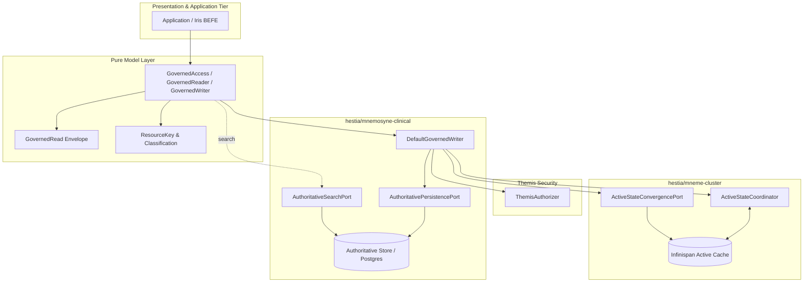

# Requirements

### Overview & Goals
Establish the mechanically enforced application-facing **Mneme** managed-information boundary for active use, while preserving **Mnemosyne** as the sole establisher of authoritative durable state (AX-05).

Applications and presentation tiers must not interact directly with raw infrastructure primitives (Infinispan `RemoteCache`, Hot Rod CAS tokens, PostgreSQL/JPA persistence, HAPI storage machinery). Instead, applications interact exclusively through the Mneme managed-information contract, enabling Harmonia to govern active-state coordination, security authorization, authoritative persistence, and cache convergence.

### Scope
- **In Scope (Goal 1 ONLY)**:
  - Establish the pure domain contracts for the Mneme application-facing managed-information boundary (`GovernedReader`, `GovernedAccess`, `AuthoritativeSearchPort`).
  - Ground managed-type classification in Calliope (`ProviderRegistryConstants`) to ensure fail-closed governance.
  - Formulate the encapsulation of active-state tokens and authoritative version metadata inside `GovernedRead<T>` without destructively modifying domain resources.
  - Add focused unit tests and ArchUnit rules verifying contract purity and fail-closed type validation.
- **Out of Scope**:
  - Modifying presentation endpoints or migrating `iris-befe` (deferred to Goal 2).
  - Implementing cache-aside read execution or concrete search engines (deferred to Goals 3A / 3B).
  - Resolving MAT-06 (custom relational persistence vs HAPI FHIR JPA server).
  - Modifying Kleio audit query mechanisms (deferred to Goal 4).
  - Introducing new network protocols, distributed services, or runtime topology changes.

### User Stories
- **As an Application / Presentation Developer**, I want a unified, typed Mneme access contract for read, write, and search operations so that I do not need to manage Hot Rod tokens, CAS retry loops, cache stores, or database transactions directly.
- **As a Security & Governance Officer**, I want all managed information access to be fail-closed and gated by Themis policy evaluation so that unclassified or unauthorized access cannot bypass platform governance.

### Functional Requirements
1. **Unified Managed-Information Contract**: Provide pure interfaces in Calliope for point READ, CREATE, UPDATE, and SEARCH delegation.
2. **Fail-Closed Type Classification**: Re-use Calliope domain classification (`ProviderRegistryConstants`) so known managed types must undergo governance, and unclassified types cannot silently bypass governance.
3. **Non-Destructive Management Encapsulation**: Encapsulate active-state tokens and authoritative version metadata within `GovernedRead<T>` envelope containers without modifying or stripping business content from domain resource representations.
4. **Lifecycle Governance (ADR-020)**: Expose no physical `delete()`, `remove()`, or `purge()` methods on application-facing or persistence contracts.
5. **Decoupled Domain Outcomes**: Ensure all domain contract return types (`GovernedRead<T>`, `WriteResult<T>`) remain strictly decoupled from HTTP status codes and presentation headers.

# Technical Design

### 1. Existing Contracts & Components to Retain
- **`calliope/model/governedwrite/ResourceKey`**: Pure immutable identifier `(resourceType, id)`.
- **`calliope/model/governedwrite/GovernedRead<T>`**: Immutable record containing `(key, resource, activeToken, authoritativeVersion)`.
- **`calliope/model/governedwrite/ActiveStateToken` & `AuthoritativeVersion`**: Type-safe version and coordination tokens.
- **`calliope/model/governedwrite/ExpectedAuthoritativeVersion`**: Predecessor concurrency token.
- **`calliope/model/governedwrite/WriteResult<T>`**: Sealed algebraic result types (`Committed`, `CommittedDegraded`, `ActiveStateConflict`, `AuthoritativeConflict`, `NotCommitted`, `OutcomeUnknown`).
- **`calliope/model/governedwrite/GovernedWriter`**: Pure domain contract for CREATE and UPDATE.
- **`calliope/model/governedwrite/ActiveStateCoordinator` & `ActiveStateConvergencePort`**: Internal coordination and post-commit cache convergence SPIs.
- **`hestia/mneme-cluster/HotRodActiveStateCoordinator`**: Production Hot Rod token observation and consumption.
- **`hestia/mneme-cluster/HotRodMnemeConvergence`**: Production bounded CAS loop post-commit convergence with newer-version protection.
- **`calliope/model/registry/ProviderRegistryConstants`**: Canonical list of supported resource types and validation codes.

### 2. Existing Contracts & Components to Evolve
- **`GovernedWriter`**: Retain pure write semantics (`create` and `update`), ensuring composition into the broader `GovernedAccess` boundary.
- **`ResourceKey`**: Evolve with explicit validation helpers referencing Calliope's canonical type classification (`ProviderRegistryConstants.isSupportedResourceType`), providing fail-closed validation at construction.

### 3. Genuinely Necessary New Contracts (with Justification)
- **`GovernedReader` (`calliope.model.governedwrite`)**:
  - *Definition*: `<T> Optional<GovernedRead<T>> read(ResourceKey key, ThemisSecurityContext securityContext)`
  - *Justification*: The repository currently defines `GovernedWriter` (CREATE/UPDATE) and `GovernedRead` (data record), but lacks a formal reader interface. `GovernedReader` defines the point-read contract for cache-aside acceleration with authoritative fallback without leaking cache or database mechanics.
- **`GovernedAccess` (`calliope.model.governedwrite`)**:
  - *Definition*: Unified interface combining `GovernedReader` and `GovernedWriter`.
  - *Justification*: Provides a single coherent entry point for application/presentation components while adhering to the Interface Segregation Principle.
- **`AuthoritativeSearchPort` (`calliope.model.governedwrite`)**:
  - *Definition*: Type-neutral query contract defining search delegation from Mneme to Mnemosyne.
  - *Justification*: Prohibits in-memory `remoteCache.values()` scans as search semantics while keeping the concrete search implementation isolated behind the MAT-06 decision boundary.

### 4. Package & Module Ownership
- **`calliope` (`net.fhirfactory.harmonia.model.governedwrite`)**:
  - Owns all pure application-facing and persistence-facing contracts (`ResourceKey`, `GovernedRead`, `GovernedReader`, `GovernedWriter`, `GovernedAccess`, `AuthoritativeSearchPort`, `WriteResult`, `ActiveStateToken`, `AuthoritativeVersion`).
  - Zero dependencies on Infinispan, Spring, JPA, Hibernate, or HTTP frameworks.
- **`calliope` (`net.fhirfactory.harmonia.model.registry`)**:
  - Owns semantic domain type definitions and classification (`ProviderRegistryConstants`).
- **`hestia/mneme-cluster` (`net.fhirfactory.harmonia.hestia.mneme.*`)**:
  - Owns active-state coordination (`HotRodActiveStateCoordinator`) and cache convergence (`HotRodMnemeConvergence`).
- **`hestia/mnemosyne-clinical` (`net.fhirfactory.harmonia.hapifhir.governed` & `persistence`)**:
  - Owns authoritative orchestration (`DefaultGovernedWriter`) and durable persistence (`AuthoritativePersistencePort`).

### 5. Managed-Type Classification Mechanism
- **Authoritative Owner**: Calliope is the sole semantic source of truth via `ProviderRegistryConstants.SUPPORTED_RESOURCE_TYPES` (`Practitioner`, `PractitionerRole`, `Organization`, `Location`, `HealthcareService`, `Endpoint`, `Group`).
- **Operational Consumption**: Mneme consumes this domain classification to determine whether a resource is governed.
- **Fail-Closed Enforcement**:
  - When a `ResourceKey` is created or passed to `GovernedAccess`, `isSupportedResourceType(key.resourceType())` is checked.
  - Unclassified types are rejected fail-closed (`IllegalArgumentException` or `WriteResult.notCommitted`).
  - Application callers cannot select an "ungoverned" API variant for managed types.

### 6. Intended Application-Facing Contract Shape
- **Point READ**:
  ```java
  <T> Optional<GovernedRead<T>> read(ResourceKey key, ThemisSecurityContext securityContext);
  ```
- **CREATE**:
  ```java
  <T> WriteResult<T> create(ResourceKey key, T resource, ThemisSecurityContext securityContext);
  ```
- **UPDATE**:
  ```java
  <T> WriteResult<T> update(GovernedRead<T> current, T proposed, ThemisSecurityContext securityContext);
  ```
- **Lifecycle Transition (ADR-020)**:
  Expressed as an `update()` with domain status change (e.g. `status = inactive`, `entered-in-error`). Zero physical `delete()` methods exist.
- **SEARCH Delegation**:
  ```java
  <T> List<GovernedRead<T>> search(AuthoritativeSearchQuery query, ThemisSecurityContext securityContext);
  ```

### 7. Encapsulation of Management Context without Mutating Domain Info
- In accordance with the semantic correction to the assessment, Mneme does **not** destructively strip metadata from the domain entity on read.
- `GovernedRead<T>` encapsulates `T resource` in its pristine state, while holding `activeToken` (for active CAS coordination) and `authoritativeVersion` (for Mnemosyne optimistic concurrency verification) as companion record components.
- The application caller passes the intact `GovernedRead<T>` to `update(...)`. The plumbing remains encapsulated in the envelope rather than exposed as loose variables or injected into the business payload.

### 8. Architecture Diagram


### 9. Obsolete / Superseded Artefacts
- Assessment guidance stating Mneme should "strip internal management provenance" on READ is superseded by non-destructive envelope encapsulation in `GovernedRead<T>`.
- Direct `RemoteCache` mutations in application tiers (`FhirCacheService.putResourceJson`, `FhirCacheService.deleteResource`) are marked for removal in Goal 2.
- Legacy `FhirRestCacheStore` background store is superseded by explicit synchronous cache-aside and governed write convergence.

### 10. Unresolved Architectural Questions Encountered
- **MAT-06 Boundary**: The choice between custom relational JPA persistence vs HAPI FHIR JPA Server remains strictly isolated and unresolved pending Goal 3B.
- **Kleio Audit Boundary (MAT-05)**: Decoupled service boundary for cross-container audit queries remains isolated for Goal 4.

# Testing

### Validation Approach
Verification of Goal 1 is achieved via pure unit contract tests in `calliope` and automated ArchUnit architecture rules in `paradeigma-test`. No presentation or runtime container changes are introduced in this goal.

### Key Scenarios
1. **Contract Purity & Immortality**: Verify `GovernedReader`, `GovernedWriter`, `GovernedAccess`, and `AuthoritativeSearchPort` define only valid operations (point read, create, update, search) with zero `delete()`, `remove()`, or `purge()` methods.
2. **Management Context Encapsulation**: Verify `GovernedRead<T>` preserves pristine domain objects while maintaining immutable active-state tokens and authoritative version numbers.
3. **Fail-Closed Type Validation**: Verify that `ResourceKey` and `GovernedAccess` validate resource types against `ProviderRegistryConstants.SUPPORTED_RESOURCE_TYPES`, failing closed on null, blank, or unsupported resource type strings.
4. **Decoupling from Presentation Semantics**: Verify that no return type or method parameter in `net.fhirfactory.harmonia.model.governedwrite` references HTTP status codes, headers, or REST framework types.

### Test Changes
- **Unit Tests**:
  - `calliope/src/test/java/net/fhirfactory/harmonia/model/governedwrite/GovernedWriteContractTest.java`: Expand to cover `GovernedReader`, `GovernedAccess`, and fail-closed `ResourceKey` validation.
- **Architecture Tests**:
  - `paradeigma/paradeigma-test/src/test/java/net/fhirfactory/harmonia/paradeigma/test/arch/GovernedWriteContractArchitectureTest.java`: Assert that all new Calliope contracts remain completely free of Infinispan, JPA, Hibernate, and HTTP dependencies.
  - `paradeigma/paradeigma-test/src/test/java/net/fhirfactory/harmonia/paradeigma/test/arch/GovernedWriteCompositionArchitectureTest.java`: Assert zero physical delete methods across the expanded governed contract interfaces.

# Delivery Steps

### ✓ Step 1: Establish Calliope Governed Read and Access Contracts
Establish the read and unified access contracts in `calliope` and enforce fail-closed domain classification.

- Define `GovernedReader` interface in `calliope/src/main/java/net/fhirfactory/harmonia/model/governedwrite/GovernedReader.java` providing `<T> Optional<GovernedRead<T>> read(ResourceKey key, ThemisSecurityContext securityContext)`.
- Define `GovernedAccess` interface in `calliope` composing `GovernedReader` and `GovernedWriter` into a single coherent application-facing boundary.
- Integrate `ProviderRegistryConstants.isSupportedResourceType` validation into `ResourceKey` and contract boundary entry points to enforce fail-closed type governance.
- Add unit tests in `calliope/src/test/java/net/fhirfactory/harmonia/model/governedwrite/` validating contract semantics, token encapsulation in `GovernedRead`, and fail-closed rejection of unclassified types.

### x Step 2: Define Authoritative Search Port and Strengthen Architecture Rules
Establish the search contract abstraction and update architectural conformance tests.

- Define `AuthoritativeSearchPort` interface in `calliope/src/main/java/net/fhirfactory/harmonia/model/governedwrite/AuthoritativeSearchPort.java` establishing type-neutral query contracts while isolating MAT-06.
- Update ArchUnit tests in `paradeigma/paradeigma-test/src/test/java/net/fhirfactory/harmonia/paradeigma/test/arch/GovernedWriteContractArchitectureTest.java` to enforce that `GovernedReader`, `GovernedWriter`, `GovernedAccess`, and `AuthoritativeSearchPort` remain pure domain abstractions free of infrastructure dependencies (Infinispan, JPA, HTTP) and physical delete methods.

### ✓ Step 3: Update / Follow-up
Goal 1 is accepted.

Before closing Goal 1, make one documentation-only correction:

Update GovernedBoundaryValidator Javadoc/comments so that they do not
describe ProviderRegistryConstants as defining managed resource types
universally across Harmonia.

Make it explicit that:

- the current validator applies the existing Provider Registry domain
  classification;
- ProviderRegistryConstants is authoritative for the Provider Registry
  resource types it defines;
- it is not the universal registry of all Harmonia-managed information;
- broader managed-information classification remains a future Calliope
  concern as additional information domains are introduced.

Do not change runtime behaviour, interfaces, classification logic or tests
unless required solely to keep documentation/tests consistent.

Then close Goal 1.

Do NOT proceed automatically to Goal 2.