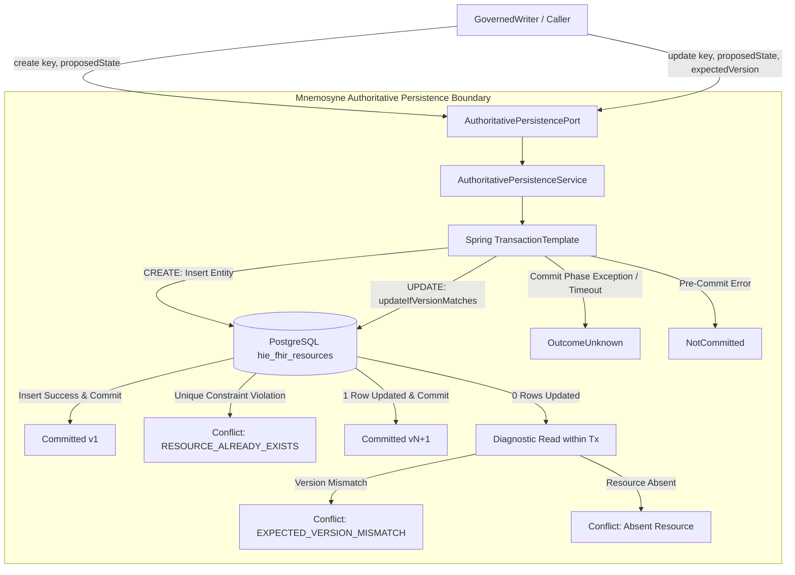

# Requirements

### Overview & Goals
Step 08.04C implements the smallest production capability required to enforce authoritative `CREATE` and `UPDATE` preconditions atomically at the Mnemosyne persistence boundary in `hestia/mnemosyne-clinical`. This establishes the durable database foundation of Harmonia's Strong Hybrid persistence model (ADR-018, ADR-019, ADR-020), ensuring that establishing new authoritative state occurs if and only if the expected predecessor is current, with zero independently observable race windows.

### Scope
- **In Scope**:
  - Implementation of `AuthoritativePersistencePort<T>` and sealed `AuthoritativePersistenceResult<T>` model family in `mnemosyne-clinical`.
  - Programmatic transaction boundary management (using `TransactionTemplate`) ensuring `COMMITTED` is returned only after successful database commit, with truthful `NOT_COMMITTED` and `UNKNOWN` demarcation.
  - Atomic database-enforced conditional `UPDATE` queries matching `(resource_type, fhir_id, version_id, deleted = false)`.
  - Database-enforced uniqueness for `CREATE` (rejecting existing resources via unique constraints without upsert).
  - Strict non-upsert semantics for both `CREATE` and `UPDATE`.
  - Preservation of the three-state commit outcome model (`COMMITTED`, `NOT_COMMITTED`, `UNKNOWN`).
  - Separation and explicit documentation of the 4 version domains (`ActiveStateToken`, `AuthoritativeVersion`, `Resource.meta.versionId`, HTTP ETag) and Mnemosyne's monotonic version policy.
  - Monotonic version generation (`currentVersion + 1`) owned and returned by Mnemosyne.
  - High-concurrency unit and PostgreSQL Testcontainers tests proving atomic predecessor verification ("at most one commits").
  - Architecture guardrails ensuring Mnemosyne persistence does not depend on Mneme/Infinispan or leak JPA into domain contracts.
  - Comprehensive report in `.junie/reports/Harmonia Security - Task 8 - Step 04C - Mnemosyne Atomic Authoritative Persistence.md`.

- **Out of Scope**:
  - Themis policy evaluation at the persistence boundary (Themis authorization is handled exclusively by the upstream GovernedWriter orchestrator).
  - Full `GovernedWriter` composition (composing Themis, Mneme, and Mnemosyne).
  - Post-commit Mneme cache convergence or invalidation (deferred to Step 08.04D).
  - Caller migration (BEFE, Pylai, Ponos, Erga remain on current paths until later steps).
  - Implementation of physical DELETE (strictly forbidden by ADR-020).
  - Creation of new Maven modules, strategy hierarchies, or complex factory patterns.

### User Stories
- **As a Clinical Integration Pipeline**, I want Mnemosyne to atomically verify that my expected predecessor version matches the persisted database record during an update, so that concurrent updates cannot silently overwrite newer clinical data (preventing lost updates).
- **As a System Administrator**, I want Mnemosyne to reject `CREATE` attempts for existing resources with an explicit `RESOURCE_ALREADY_EXISTS` conflict rather than performing a silent upsert, so that resource identity collisions are detected and handled reliably.
- **As a Platform Developer**, I want clear distinctions between `COMMITTED`, `NOT_COMMITTED`, and `UNKNOWN` commit outcomes, so that transient connection dropouts are never conflated with definitive precondition rejections.

### Functional Requirements
1. **Authoritative CREATE**:
   - Precondition: Resource must NOT already exist.
   - Successful insert sets `version_id = 1L` and assigns `Resource.meta.versionId = "1"`.
   - If resource already exists (active or soft-deleted), returns `AuthoritativePersistenceResult.Conflict` containing `AuthoritativePreconditionConflict.resourceAlreadyExists(key)`. Never upserts or updates.
2. **Authoritative UPDATE**:
   - Precondition: `expectedVersion` must be provided, valid/numeric, and match the persisted `version_id` with `deleted == false`.
   - Executes atomic conditional update `WHERE resource_type = :type AND fhir_id = :id AND version_id = :expectedVersion AND is_deleted = false`.
   - If 1 row updated: sets `newVersion = expectedVersion + 1L`, updates `Resource.meta.versionId = String.valueOf(newVersion)`, commits the transaction, and returns `AuthoritativePersistenceResult.Committed`.
   - If 0 rows updated: evaluates whether resource is absent or present with a different version, returning `AuthoritativePersistenceResult.Conflict` with `EXPECTED_VERSION_MISMATCH` and current version diagnostic. Never creates an absent resource.
3. **Commit Outcomes**:
   - `COMMITTED`: The authoritative database transaction completed successfully and the commit was acknowledged by the configured persistence infrastructure.
   - `NOT_COMMITTED`: Precondition check failed, unique constraint violated, or transaction was deterministically aborted before commit.
   - `UNKNOWN`: Transaction commit status could not be verified (e.g. transport/JDBC communication timeout during commit phase).
4. **No Security Policy Evaluation at Persistence Port**:
   - `AuthoritativePersistencePort` is strictly a persistence capability and does not evaluate Themis security policies or require `ThemisSecurityContext`.
5. **No Physical DELETE**:
   - The persistence port does not expose any delete operations (ADR-020).

### Non-Functional Requirements
- **Concurrency Safety Invariant**: Must guarantee that **at most one** participant can commit from the same expected authoritative predecessor version $V$ under PostgreSQL row-level locking.
- **Fail-Fast Version Parsing**: Malformed or non-numeric expected versions must immediately fail preconditions with `AuthoritativePersistenceResult.Conflict` / `NotCommitted` rather than disabling concurrency checks.
- **Zero Framework Leakage**: Domain contracts must remain free of JPA, Hibernate, and Infinispan types.

# Technical Design

### Current Implementation
- `FhirStorageService` in `hestia/mnemosyne-clinical` currently exhibits:
  - `createResource`: Checks `findByResourceTypeAndFhirId`. If found, increments version and overwrites (upsert behavior).
  - `updateResource`: If absent, creates a new record with version 1 (upsert behavior). If present, compares version in Java code, increments version, and calls `repository.save()` (race condition between SELECT and UPDATE).
  - `expectedVersion` checking: Malformed versions triggering `NumberFormatException` are silently ignored in `catch (NumberFormatException ignored) {}`.
  - `version_id`: Managed as an application-level `Long` column in table `hie_fhir_resources`, rather than JPA `@Version`.
- Direct HAPI FHIR providers call `FhirStorageService` directly without governed write semantics.

### Version Domains and Explicit Mappings
Harmonia maintains four conceptually distinct version domains across its architecture:

| Version Domain | Type / Representation | Storage Location | Domain Role & Mapping Rules |
| :--- | :--- | :--- | :--- |
| **1. Mneme Active State** | `ActiveStateToken` / Opaque | Infinispan cluster entry metadata | Distributed active-state coordination and fast-fail stale-state detection (Step 08.04B). Has zero authority over durable persistence. |
| **2. Mnemosyne Authoritative** | `AuthoritativeVersion` / `Long` | PostgreSQL `hie_fhir_resources.version_id` | Durable single source of truth for resource versioning. Monotonically incremented upon authoritative commit. |
| **3. FHIR Metadata** | `Resource.meta.versionId` / `String` | Serialized in `hie_fhir_resources.resource_json` | FHIR R5 standard resource version attribute. Synchronized directly with the authoritative version (`String.valueOf(v)`) upon commit. |
| **4. HTTP Transport** | `ETag: W/"<version>"` / `If-Match` | HTTP REST header | Client-facing transport representation, derived from FHIR `meta.versionId` at the gateway layer. |

#### Mnemosyne Version Generation Policy
- Initial version upon `CREATE` is explicitly assigned as `1L` (`AuthoritativeVersion.of(1L)`).
- Each successful `UPDATE` advances version by incrementing current version by `+1` (`AuthoritativeVersion.of(expectedVersion.version() + 1L)`).
- *Explicit Architecture Note*: Monotonic `+1` arithmetic is Mnemosyne's specific version generation policy, not an inherent mathematical property of optimistic concurrency in general.

#### FHIR `meta.versionId` Synchronization Rationale
- FHIR R5 specification requires `Resource.meta.versionId` to reflect the persisted version of the resource instance.
- Because Mnemosyne is the authoritative source of durable state, Mnemosyne establishes the authoritative version and synchronizes `Resource.meta.versionId` prior to serialization, ensuring downstream FHIR consumers receive an accurate version identifier.

### Key Decisions
1. **Transaction Boundary & Truthful Commit Outcome Demarcation**:
   - *Decision*: Execute persistence operations inside Spring `TransactionTemplate` programmatic blocks. `AuthoritativePersistenceResult.Committed` is constructed and returned **only after** `transactionTemplate.execute(...)` returns successfully.
   - *Rationale*: A SQL `UPDATE` affecting 1 row or a successful JPA `saveAndFlush` does NOT equal a committed transaction. If a connection fails during the commit phase, the transaction outcome is uncertain. Programmatic transaction execution allows wrapping the full commit lifecycle:
     - Normal completion after commit -> `AuthoritativePersistenceResult.Committed<T>`.
     - Known pre-commit constraint violation (e.g. `DataIntegrityViolationException`) or precondition mismatch -> rollback and return `AuthoritativePersistenceResult.Conflict<T>`.
     - Deterministic runtime/persistence exception prior to commit -> rollback and return `AuthoritativePersistenceResult.NotCommitted<T>`.
     - Indeterminate commit-phase exception (e.g. `TransactionSystemException` wrapping a JDBC timeout/communication failure during commit) -> return `AuthoritativePersistenceResult.OutcomeUnknown<T>`.
2. **Conditional JPQL / SQL Update Query over JPA `@Version`**:
   - *Decision*: Use atomic conditional repository update (`UPDATE FhirResourceEntity e SET e.resourceJson = :json, e.versionId = :newVersion, e.updatedAt = :now WHERE e.resourceType = :type AND e.fhirId = :id AND e.versionId = :expectedVersion AND e.deleted = false`) rather than JPA `@Version`.
   - *Rationale*: Harmonia's authoritative version domain is an explicit business and protocol property (`version_id` starting at 1, serialized into FHIR `meta.versionId`). JPA `@Version` introduces a hidden persistence provider version domain that can cause premature optimistic lock exceptions unrelated to business version matching and obscures database query control.
3. **Database-Enforced Uniqueness for CREATE**:
   - *Decision*: Rely on table unique constraint `uk_resource_type_fhir_id (resource_type, fhir_id)` during INSERT.
   - *Rationale*: A Java `SELECT -> IF NOT EXISTS -> INSERT` has a concurrency race window. The unique constraint guarantees atomic single-winner CREATE under concurrent execution.
4. **Port Separation without Security Overhead**:
   - *Decision*: `AuthoritativePersistencePort<T>` accepts only `ResourceKey`, proposed state `T`, and (for update) `ExpectedAuthoritativeVersion`.
   - *Rationale*: Step 08.04C is the persistence boundary. Security policy evaluation (Themis) and cache coordination (Mneme) belong to the outer GovernedWriter orchestrator in subsequent steps.
5. **Type-Safe Sealed Result Hierarchy**:
   - *Decision*: Model `AuthoritativePersistenceResult<T>` as a sealed interface with records `Committed<T>`, `Conflict<T>`, `NotCommitted<T>`, and `OutcomeUnknown<T>`.
   - *Rationale*: Prevents invalid combinations of nullable fields, enforces exhaustive pattern matching, and accurately binds outcomes to the three canonical states (`COMMITTED`, `NOT_COMMITTED`, `UNKNOWN`).

### Proposed Architecture & Data Flow



### Data Models and Signatures

```java
package net.fhirfactory.harmonia.hapifhir.persistence.model;

import net.fhirfactory.harmonia.model.governedwrite.AuthoritativeCommitOutcome;
import net.fhirfactory.harmonia.model.governedwrite.AuthoritativePreconditionConflict;
import net.fhirfactory.harmonia.model.governedwrite.AuthoritativeVersion;

import java.io.Serializable;
import java.util.Objects;

public sealed interface AuthoritativePersistenceResult<T> extends Serializable
        permits AuthoritativePersistenceResult.Committed,
                AuthoritativePersistenceResult.Conflict,
                AuthoritativePersistenceResult.NotCommitted,
                AuthoritativePersistenceResult.OutcomeUnknown {

    AuthoritativeCommitOutcome outcome();

    default boolean isCommitted() {
        return outcome() == AuthoritativeCommitOutcome.COMMITTED;
    }

    record Committed<T>(
            T persistedResource,
            AuthoritativeVersion authoritativeVersion
    ) implements AuthoritativePersistenceResult<T> {
        public Committed {
            Objects.requireNonNull(persistedResource, "persistedResource must not be null");
            Objects.requireNonNull(authoritativeVersion, "authoritativeVersion must not be null");
        }

        @Override
        public AuthoritativeCommitOutcome outcome() {
            return AuthoritativeCommitOutcome.COMMITTED;
        }
    }

    record Conflict<T>(
            AuthoritativePreconditionConflict conflict
    ) implements AuthoritativePersistenceResult<T> {
        public Conflict {
            Objects.requireNonNull(conflict, "conflict must not be null");
        }

        @Override
        public AuthoritativeCommitOutcome outcome() {
            return AuthoritativeCommitOutcome.NOT_COMMITTED;
        }
    }

    record NotCommitted<T>(
            String failureMessage,
            Throwable cause
    ) implements AuthoritativePersistenceResult<T> {
        public NotCommitted {
            Objects.requireNonNull(failureMessage, "failureMessage must not be null");
        }

        @Override
        public AuthoritativeCommitOutcome outcome() {
            return AuthoritativeCommitOutcome.NOT_COMMITTED;
        }
    }

    record OutcomeUnknown<T>(
            String message,
            Throwable cause
    ) implements AuthoritativePersistenceResult<T> {
        public OutcomeUnknown {
            Objects.requireNonNull(message, "message must not be null");
        }

        @Override
        public AuthoritativeCommitOutcome outcome() {
            return AuthoritativeCommitOutcome.UNKNOWN;
        }
    }
}
```

```java
package net.fhirfactory.harmonia.hapifhir.persistence;

import org.hl7.fhir.instance.model.api.IBaseResource;
import net.fhirfactory.harmonia.hapifhir.persistence.model.AuthoritativePersistenceResult;
import net.fhirfactory.harmonia.model.governedwrite.ExpectedAuthoritativeVersion;
import net.fhirfactory.harmonia.model.governedwrite.ResourceKey;

public interface AuthoritativePersistencePort<T extends IBaseResource> {

    AuthoritativePersistenceResult<T> create(ResourceKey key, T proposedState);

    AuthoritativePersistenceResult<T> update(
            ResourceKey key,
            T proposedState,
            ExpectedAuthoritativeVersion expectedVersion);
}
```

### File Structure Changes
- **Modified**:
  - `hestia/mnemosyne-clinical/src/main/java/net/fhirfactory/harmonia/hapifhir/repository/FhirResourceRepository.java`: Add `@Modifying` conditional update query `updateIfVersionMatches`.
- **Added**:
  - `hestia/mnemosyne-clinical/src/main/java/net/fhirfactory/harmonia/hapifhir/persistence/model/AuthoritativePersistenceResult.java`: Type-safe sealed result model family.
  - `hestia/mnemosyne-clinical/src/main/java/net/fhirfactory/harmonia/hapifhir/persistence/AuthoritativePersistencePort.java`: Persistence port interface.
  - `hestia/mnemosyne-clinical/src/main/java/net/fhirfactory/harmonia/hapifhir/persistence/AuthoritativePersistenceService.java`: Implementation of atomic persistence port with `TransactionTemplate` boundary.
  - `hestia/mnemosyne-clinical/src/test/java/net/fhirfactory/harmonia/hapifhir/persistence/AuthoritativePersistenceServiceTest.java`: Unit and functional test suite covering all functional, conflict, and failure paths.
  - `hestia/mnemosyne-clinical/src/test/java/net/fhirfactory/harmonia/hapifhir/persistence/AuthoritativePersistencePostgreSqlConcurrencyTest.java`: PostgreSQL Testcontainers high-concurrency race test.
  - `paradeigma/paradeigma-test/src/test/java/net/fhirfactory/harmonia/paradeigma/test/arch/MnemosyneAuthoritativePersistenceArchitectureTest.java`: ArchUnit isolation rules.
  - `.junie/reports/Harmonia Security - Task 8 - Step 04C - Mnemosyne Atomic Authoritative Persistence.md`: Implementation report.

### Risks and Mitigations
- **Risk**: Database unique constraint violation exception types vary between H2 and PostgreSQL.
  - *Mitigation*: Catch Spring's abstract `DataIntegrityViolationException` which standardizes database duplicate key violations across dialects.
- **Risk**: Indeterminate transaction commit exceptions during network partitions.
  - *Mitigation*: Catch `TransactionSystemException` and `CannotCreateTransactionException` wrapping commit-phase communication failures, returning `AuthoritativePersistenceResult.OutcomeUnknown` without making unwarranted retry assumptions.
- **Risk**: Legacy HAPI provider endpoints might bypass the new port.
  - *Mitigation*: Step 08.04C explicitly focuses on establishing the persistence capability without breaking legacy callers. Caller migration is scheduled in subsequent Task 08 steps.

# Testing

### Validation Approach
Verification combines unit tests (H2 in-memory), integration tests, real PostgreSQL Testcontainers concurrency tests, and ArchUnit architecture tests. Concurrency tests will simulate multi-threaded write contention using `CountDownLatch` and `ExecutorService`.

### Key Scenarios
1. **CREATE on Absent Resource**: Successfully creates resource, assigns version 1, sets `Resource.meta.versionId = "1"`, returns `AuthoritativePersistenceResult.Committed`.
2. **CREATE on Existing Resource**: Rejects with `AuthoritativePersistenceResult.Conflict` containing `RESOURCE_ALREADY_EXISTS`; no overwrite.
3. **Concurrent CREATE Collision**: Multiple threads attempt concurrent CREATE for identical `ResourceKey`. Under healthy PostgreSQL conditions, exactly 1 succeeds (`Committed`), remaining receive `Conflict(RESOURCE_ALREADY_EXISTS)` (satisfying the architectural invariant that **at most one** commit occurs).
4. **UPDATE with Matching Predecessor**: Updates resource, increments version monotonically (`V + 1`), synchronizes `Resource.meta.versionId`, returns `AuthoritativePersistenceResult.Committed`.
5. **UPDATE with Stale Predecessor**: Rejects with `AuthoritativePersistenceResult.Conflict` containing `EXPECTED_VERSION_MISMATCH`; persisted state unchanged.
6. **UPDATE on Absent Resource**: Rejects update without creating an absent resource, returning `AuthoritativePersistenceResult.Conflict`.
7. **Concurrent UPDATE Race**: Multiple threads attempt UPDATE from identical predecessor version $V$. Under healthy PostgreSQL conditions, exactly 1 succeeds (`Committed`), remaining receive `Conflict(EXPECTED_VERSION_MISMATCH)` (satisfying the architectural invariant that **at most one** commit occurs).
8. **Authoritative Persisted Version Origin**: Asserts that returned `AuthoritativeVersion` originates strictly from Mnemosyne.
9. **Malformed Version Fail-Fast**: Malformed version strings (e.g. non-numeric `"abc"`) trigger immediate validation failure / conflict rather than bypassing concurrency checks.
10. **Immutable AuditEvent Guard**: Modification attempts on `AuditEvent` resources are rejected.
11. **Outcome UNKNOWN Preservation**: Simulated commit transport timeout yields `AuthoritativePersistenceResult.OutcomeUnknown`.

### Architecture Guardrails
- ArchUnit test asserts that `AuthoritativePersistencePort` and `AuthoritativePersistenceService` do not import `org.infinispan..` or Hot Rod coordination types.
- ArchUnit test asserts that caller-facing governed-write contracts in `calliope` contain zero JPA/Hibernate dependencies.
- ArchUnit test asserts that `AuthoritativePersistencePort` exposes only `create` and `update` (no `delete` methods, per ADR-020).

# Delivery Steps

### ✓ Step 1: Add atomic conditional queries to FhirResourceRepository
Add atomic conditional update queries and unique constraint validation to the repository layer.

- Update `FhirResourceRepository` in `hestia/mnemosyne-clinical` with `@Modifying` conditional JPQL query `updateIfVersionMatches` matching `resourceType`, `fhirId`, `expectedVersion`, and `deleted = false`.
- Add repository helper methods to distinguish between resource absence and version mismatch upon conditional update failure.
- Ensure `FhirResourceEntity` mapping and table constraint `uk_resource_type_fhir_id` are preserved and leveraged for uniqueness enforcement.

### * Step 2: Define AuthoritativePersistencePort and Sealed Result Model Family
Define the persistence port and sealed result model family adhering to Calliope contracts without external framework leakage.

- Define `AuthoritativePersistenceResult<T>` sealed interface with `Committed<T>`, `Conflict<T>`, `NotCommitted<T>`, and `OutcomeUnknown<T>` records in `net.fhirfactory.harmonia.hapifhir.persistence.model`.
- Define `AuthoritativePersistencePort<T extends IBaseResource>` in `net.fhirfactory.harmonia.hapifhir.persistence` declaring `create(ResourceKey, T)` and `update(ResourceKey, T, ExpectedAuthoritativeVersion)`.
- Ensure zero dependency on Infinispan/Hot Rod, Themis, or JPA types within the public port signature.

###   Step 3: Implement AuthoritativePersistenceService with Transaction Boundary
Implement the authoritative persistence port with programmatic Spring TransactionTemplate management and atomic semantics.

- Implement `AuthoritativePersistenceService` in `hestia/mnemosyne-clinical` implementing `AuthoritativePersistencePort<IBaseResource>`.
- Wrap operations in `TransactionTemplate` programmatic blocks so that `AuthoritativePersistenceResult.Committed` is returned strictly upon verified database transaction commit.
- Implement `create`: enforce initial `versionId = 1L`, update FHIR `meta.versionId = "1"`, perform entity insert, catch `DataIntegrityViolationException` / duplicate key errors to return `AuthoritativePersistenceResult.Conflict(resourceAlreadyExists)`. Never upsert.
- Implement `update`: validate `ExpectedAuthoritativeVersion` non-null and numeric (fail-fast on malformed input), compute `nextVersion = expectedVersion + 1L`, update FHIR `meta.versionId`, execute `updateIfVersionMatches`. If 0 rows updated, perform diagnostic check to return `AuthoritativePersistenceResult.Conflict` with `expectedVersionMismatch` or absent resource conflict. Never upsert.
- Catch indeterminate commit-phase exceptions to return `AuthoritativePersistenceResult.OutcomeUnknown`.

###   Step 4: Implement Concurrency and Failure Test Suite
Validate atomic CREATE and UPDATE preconditions, failure paths, and high-concurrency race conditions against PostgreSQL Testcontainers and H2.

- Implement `AuthoritativePersistenceServiceTest` covering all functional and failure scenarios (precondition checks, malformed version handling, absent resource updates, immutable audit events, outcome UNKNOWN demarcation).
- Implement `AuthoritativePersistencePostgreSqlConcurrencyTest` using Testcontainers (`postgres:16-alpine`) and multi-threaded `CountDownLatch` executing concurrent CREATEs on the same `ResourceKey` (proving at most 1 commits) and concurrent UPDATEs with the same predecessor version (proving at most 1 commits with remainder receiving `EXPECTED_VERSION_MISMATCH`).

###   Step 5: Add Architecture Guardrails and Implementation Report
Enforce architectural boundaries via ArchUnit and document implementation details and test evidence.

- Add ArchUnit rules to `MnemosyneAuthoritativePersistenceArchitectureTest` in `paradeigma-test` asserting that `mnemosyne` authoritative persistence does not depend on Mneme/Hot Rod coordination types, and caller contracts remain free of JPA/JDBC types.
- Generate `.junie/reports/Harmonia Security - Task 8 - Step 04C - Mnemosyne Atomic Authoritative Persistence.md` detailing exploration findings, persistence mechanisms, transaction boundaries, test evidence, remaining legacy bypasses, and deferred items.