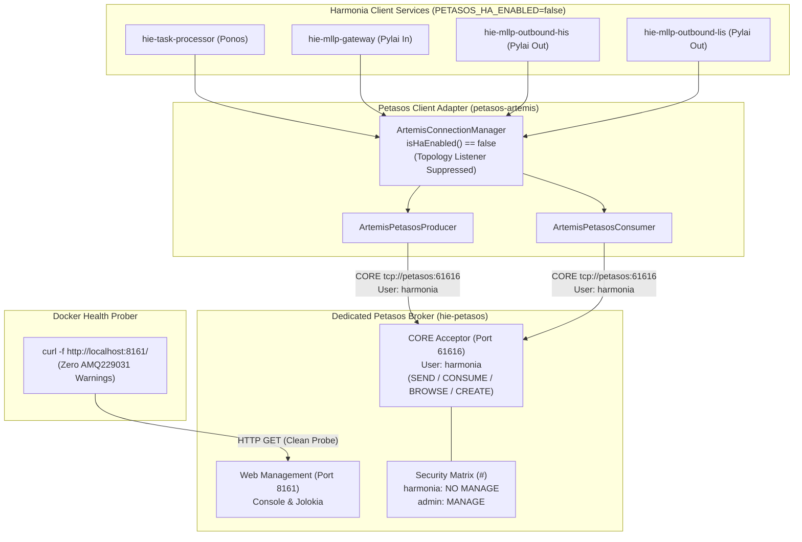

# Requirements

### Overview & Goals
During standalone single-broker deployment of Apache ActiveMQ Artemis (**Petasos**, `hie-petasos`), the messaging runtime logged two recurring security warnings:
1. **`AMQ229032: User: harmonia does not have permission='MANAGE' on address activemq.management`**: Triggered when client applications initialized cluster topology discovery on standalone broker instances.
2. **`AMQ229031: Unable to validate user from /127.0.0.1. Username: null`**: Triggered when Docker healthchecks opened unauthenticated raw TCP connections against CORE port 61616.

This plan implements the approved security remediation:
- **Enforces least privilege**: Preserves the principle of least privilege by strictly denying `MANAGE` permission to the `harmonia` application identity.
- **Fixes standalone topology discovery**: Scopes `ClusterTopologyListener` registration in `ArtemisConnectionManager` to run only when `config.isHaEnabled() == true`.
- **Eliminates unauthenticated TCP health probes**: Replaces raw TCP port 61616 checks with HTTP management healthchecks on port 8161.
- **Verifies end-to-end messaging and resilience**: Validates that zero security errors occur, normal messaging and dynamic queue creation work, and clinical HL7 pipelines execute successfully under live Docker Compose execution.

---

### Scope

#### In Scope
- Conditional scoping of `ClusterTopologyListener` in `ArtemisConnectionManager` based on `config.isHaEnabled()`.
- Explicit configuration of `PETASOS_HA_ENABLED=false` and application credentials (`PETASOS_BROKER_USER=harmonia`, `PETASOS_BROKER_PASSWORD=harmoniaPassword`) across Docker Compose services (`task-processor`, `mllp-gateway`, `mllp-outbound-his`, `mllp-outbound-lis`).
- Alignment of container healthchecks in `docker-compose.yml` and `petasos/deployment/docker-compose.yml` to use HTTP port 8161.
- Preservation of least-privilege security settings across all `broker.xml` definitions (restricting `manage` to `admin`).
- Verification of live clinical message flow (MLLP 2575 -> Petasos -> Ponos -> Petasos -> MLLP 8087/8088), failover reconnection, and ArchUnit architecture rules.

#### Out of Scope
- Granting `MANAGE` permission to `harmonia` or weakening Artemis security configurations.
- Altering the 4-node HA Kubernetes manifests or production HA cluster architecture.
- Redesigning the Iris presentation tier or Iris BEFE operational endpoints.

---

### User Stories
- **As a Security Officer**, I want application services to operate under least privilege without `MANAGE` permissions so that application components cannot modify broker infrastructure or access administrative addresses.
- **As a DevOps Engineer**, I want container healthchecks to verify broker readiness via HTTP without generating unauthenticated socket warnings in production log streams.
- **As an Integration Developer**, I want standalone single-broker development environments to connect cleanly without emitting topology discovery errors, while preserving full HA cluster topology discovery in multi-node Kubernetes deployments.

---

### Functional Requirements
1. **Least-Privilege Enforcement**:
   - `harmonia` role must NOT possess `manage`, `deleteAddress`, or `deleteDurableQueue` permissions.
   - `harmonia` role must retain `createAddress`, `createNonDurableQueue`, `deleteNonDurableQueue`, `createDurableQueue`, `send`, `consume`, and `browse` permissions.
   - `admin` role alone retains `manage` and administrative governance on `#` and `activemq.management`.
2. **Standalone Topology Scoping**:
   - `ArtemisConnectionManager` must register `ClusterTopologyListener` ONLY when `config.isHaEnabled()` evaluates to `true`.
   - Standalone Docker Compose must configure `PETASOS_HA_ENABLED=false`.
   - Clustered Kubernetes environments must configure `PETASOS_HA_ENABLED=true`.
3. **Healthcheck Normalization**:
   - Raw TCP `/dev/tcp/127.0.0.1/61616` or `nc -z localhost 61616` probes must be replaced with `curl -f http://localhost:8161/ || exit 1`.
   - Healthcheck must not generate `AMQ229031` (`Username: null`) warnings.
4. **End-to-End Pipeline & Reconnection**:
   - Live HL7 v2 messages submitted via MLLP port 2575 must traverse `mllp-gateway` -> Petasos -> Ponos -> Petasos -> `mllp-outbound-his` (8087) and `mllp-outbound-lis` (8088).
   - Stopping and restarting `hie-petasos` must result in automatic client reconnection with zero message loss on durable queues.
   - Restarting `task-processor` must have zero impact on the Petasos broker runtime.

---

### Non-Functional Requirements
- **Security & Governance (`AGENTS.md` Invariant 6)**: Strict default-deny and least-privilege security model across broker and application identities.
- **Zero-PHI Diagnostic Logging (`AGENTS.md` Invariant 7)**: Diagnostic logs must remain clean of false-positive connection errors (`AMQ229031`, `AMQ229032`).
- **Petasos API Abstraction (`AGENTS.md` Invariant 2)**: Client facade in `petasos-api` remains completely free of JMS and ActiveMQ Artemis runtime classes.
- **Dual-Write Safety (`AGENTS.md` Invariant 4)**: Inbound MLLP ACK emission remains bound to confirmed Petasos publishing.

# Technical Design

### Current Implementation
- `ArtemisConnectionManager` in `petasos-artemis` attaches a `ClusterTopologyListener` to the ActiveMQ Artemis `ServerLocator`. When initialized in standalone single-broker mode with `haEnabled=true` (default), the client issues topology discovery requests to `activemq.management`. Because `harmonia` lacks `manage` permission, Artemis emits `AMQ229032`.
- In `docker-compose.yml`, service `petasos` defines a healthcheck probe. When raw TCP socket probing is used against port 61616 without completing a protocol handshake, Netty accepts the connection and immediately logs `AMQ229031: Unable to validate user from /127.0.0.1. Username: null`.
- Standalone service definitions in `docker-compose.yml` (`task-processor`, `mllp-gateway`, `mllp-outbound-his`, `mllp-outbound-lis`) did not explicitly define `PETASOS_HA_ENABLED=false` or uniformly specify `PETASOS_BROKER_USER=harmonia`.

---

### Key Decisions
1. **Retain Least-Privilege Security Model**:
   - *Decision*: Do NOT grant `manage` permission to `harmonia` on `#` or `activemq.management`.
   - *Rationale*: Standard application components only need permissions to send, consume, browse, and create dynamic queues. Administrative management remains isolated to `admin`.
2. **Conditional Cluster Topology Discovery**:
   - *Decision*: Gate `locator.addClusterTopologyListener(...)` in `ArtemisConnectionManager` behind `if (config.isHaEnabled())`.
   - *Rationale*: Single-broker standalone deployments do not participate in multi-broker clusters; bypassing topology listener registration completely prevents requests to `activemq.management`.
3. **HTTP Web Management Healthcheck (Port 8161)**:
   - *Decision*: Implement `curl -f http://localhost:8161/ || exit 1` as the container healthcheck probe.
   - *Rationale*: Port 8161 provides an authenticated/web readiness endpoint that confirms the Artemis broker runtime is active and healthy without opening unauthenticated raw TCP sockets on the CORE messaging acceptor (port 61616).
4. **Explicit Environment Parameterization in Standalone Compose**:
   - *Decision*: Inject `PETASOS_HA_ENABLED: "false"`, `PETASOS_BROKER_USER: ${PETASOS_BROKER_USER:-harmonia}`, and `PETASOS_BROKER_PASSWORD: ${PETASOS_BROKER_PASSWORD:-harmoniaPassword}` across all client services in `docker-compose.yml`.
   - *Rationale*: Ensures deterministic client configuration matching the intended least-privilege deployment topology.

---

### Security & Permission Configuration Matrix

| Address Match | Role | Effective Permissions | Denied Permissions | Purpose |
| :--- | :--- | :--- | :--- | :--- |
| **`#`** | `admin` | `createAddress`, `deleteAddress`, `createNonDurableQueue`, `deleteNonDurableQueue`, `createDurableQueue`, `deleteDurableQueue`, `send`, `consume`, `browse`, `manage` | None | Full administrative broker governance. |
| **`#`** | `harmonia` | `createAddress`, `createNonDurableQueue`, `deleteNonDurableQueue`, `createDurableQueue`, `send`, `consume`, `browse` | `deleteAddress`, `deleteDurableQueue`, `manage` | Least-privilege application messaging & dynamic queue creation. |
| **`activemq.management`** | `admin` | All management operations (`manage`) | None | Administrative JMX and management address. |
| **`activemq.management`** | `harmonia` | None | `manage` | Normal application identities cannot execute management queries. |

---

### Healthcheck Mechanism Evaluation

| Mechanism | Pros | Cons | Verdict |
| :--- | :--- | :--- | :--- |
| **Raw TCP (`nc -z localhost 61616`)** | Simple, no dependencies | Opens socket without protocol handshake, triggering `AMQ229031 (Username: null)` every 5s | **Rejected** (Violates Zero-PHI / clean logging) |
| **Artemis CLI (`artemis check node`)** | Validates internal broker state | Executes JMX management queries requiring `MANAGE` permission; fails with `AMQ229032` if run as `harmonia` | **Rejected** (Requires administrative privileges) |
| **HTTP Management (`curl -f http://localhost:8161/`)** | Verifies broker runtime readiness, no unauthenticated CORE socket errors, no `MANAGE` requirement | Probes web management server rather than CORE protocol frame negotiation directly | **Selected** (Clean, robust, zero log noise) |

---

### Architecture Diagram



---

### Components & File Structure

| Component | File Path | Nature of Change |
| :--- | :--- | :--- |
| **Petasos Connection Manager** | `petasos/petasos-artemis/src/main/java/net/fhirfactory/harmonia/petasos/artemis/connection/ArtemisConnectionManager.java` | Ensure `locator.addClusterTopologyListener` is gated behind `if (config.isHaEnabled())`. |
| **Petasos Configuration** | `petasos/petasos-api/src/main/java/net/fhirfactory/harmonia/petasos/api/config/PetasosConfig.java` | Validate environment resolution of `PETASOS_HA_ENABLED`. |
| **Root Compose Manifest** | `docker-compose.yml` | Set HTTP 8161 healthcheck on `petasos`; set `PETASOS_HA_ENABLED=false`, `PETASOS_BROKER_USER=harmonia`, `PETASOS_BROKER_PASSWORD=harmoniaPassword` on clients. |
| **Petasos Deployment Compose** | `petasos/deployment/docker-compose.yml` | Update broker healthcheck definitions to HTTP port 8161. |
| **Standalone Broker Config** | `petasos/deployment/artemis/standalone/broker.xml` | Confirm security settings restrict `manage` to `admin`. |
| **Connection Manager Unit Test** | `petasos/petasos-artemis/src/test/java/net/fhirfactory/harmonia/petasos/artemis/connection/ArtemisConnectionManagerTest.java` | Assert topology listener registration behavior across `haEnabled=false` and `haEnabled=true`. |
| **Security Integration Test** | `petasos/petasos-artemis/src/test/java/net/fhirfactory/harmonia/petasos/artemis/connection/ArtemisHarmoniaSecurityIntegrationTest.java` | Validate that `harmonia` role sends, receives, and queries health without `MANAGE`. |

---

### Risks & Mitigations
- **Risk**: Setting `PETASOS_HA_ENABLED=false` in Docker Compose might accidentally affect multi-node Kubernetes deployments.
  - *Mitigation*: Kubernetes manifests explicitly set `PETASOS_HA_ENABLED=true` (or default to true in `PetasosConfig.Builder`), preserving full cluster topology discovery in production HA clusters.
- **Risk**: HTTP healthcheck on port 8161 could mark container healthy before CORE port 61616 is ready.
  - *Mitigation*: In Artemis, Netty CORE acceptors initialize prior to web server completion during startup; HTTP readiness guarantees the messaging engine is active.
- **Risk**: Dynamic queues created by Ponos/Pylai fail authorization under `harmonia` user.
  - *Mitigation*: `broker.xml` grants `createAddress`, `createDurableQueue`, and `createNonDurableQueue` to role `harmonia`, ensuring dynamic destination creation succeeds without administrative rights.

# Testing

### Validation Approach
Verification follows a multi-tiered approach:
1. **Unit & Isolation Tests**: Validate configuration parsing, URL building, failover state machine transitions, and conditional topology listener registration in `petasos-artemis`.
2. **Architecture Test Suite**: Execute ArchUnit tests in `paradeigma-test` to enforce module isolation, package layering, and security boundaries.
3. **Live Container & Security Validation**: Start the complete Docker Compose stack and verify broker health, zero error log occurrences, dynamic queue creation, and unprivileged execution.
4. **End-to-End Clinical Pipeline Test**: Submit live HL7 messages through MLLP ingress to Ponos praxis execution and outbound delivery.
5. **Component Resilience & Reconnection**: Validate broker restart resilience and Ponos restart isolation.

---

### Key Scenarios

#### Scenario 1: Standalone Topology Listener Scoping
- Initialize `ArtemisConnectionManager` with `haEnabled=false`.
- Connect to Artemis broker using `harmonia` user credentials.
- Verify connection succeeds, health status evaluates to `UP`, and `discoveredNodes` remains empty without querying `activemq.management`.
- Verify broker logs show **0 occurrences of `AMQ229032`**.

#### Scenario 2: Container Healthcheck Probing
- Run `docker compose up -d petasos`.
- Monitor broker logs over 60 seconds (covering multiple 5s probe intervals).
- Verify healthcheck evaluates to `healthy`.
- Verify broker logs show **0 occurrences of `AMQ229031` (Username: null)**.

#### Scenario 3: Harmonia Role Least-Privilege Messaging & Dynamic Queue Creation
- Authenticate client as `harmonia` (`PETASOS_BROKER_USER=harmonia`, `PETASOS_BROKER_PASSWORD=harmoniaPassword`).
- Publish persistent message to dynamic queue `task.event.queue.security-validation-*`.
- Consume and acknowledge the message using asynchronous and synchronous consumers.
- Verify message payload integrity and successful queue auto-creation without requiring `manage` privileges.

#### Scenario 4: End-to-End Clinical MLLP Flow
- Submit an HL7 v2.4 ADT^A01 message to `mllp-gateway` on port 2575.
- Verify `mllp-gateway` receives message, publishes task event to Petasos, and returns an `AA` acknowledgment.
- Verify `task-processor` (Ponos) consumes ingress event, executes `AdtDistributionErgon`, and publishes destination events to Petasos.
- Verify `mllp-outbound-his` (port 8087) and `mllp-outbound-lis` (port 8088) receive and process egress messages.

#### Scenario 5: Broker Restart & Client Reconnection
- While client containers are running, execute `docker compose restart petasos`.
- Verify clients log connection loss and enter reconnecting state.
- Verify clients successfully reconnect once Petasos becomes healthy, with zero lost messages on durable queues.

#### Scenario 6: Ponos Restart Isolation
- Execute `docker compose restart task-processor`.
- Verify `hie-petasos` remains unaffected, port 61616 remains active, and connected Pylai gateways remain operational.

---

### Edge Cases
- **Broker temporarily unreachable at startup**: Clients must retry connection with exponential backoff without crashing.
- **HA Clustered Topology Activation**: When `PETASOS_HA_ENABLED=true` is supplied, `ClusterTopologyListener` must register and discover cluster member nodes dynamically.
- **Invalid Credentials**: Attempting connection with invalid credentials must fail with authentication error, asserting security is enforced.

---

### Test Commands
- **Run Connection & Security Unit Tests**:
  ```bash
  mvn test -pl petasos/petasos-artemis -Dtest=ArtemisConnectionManagerTest,ArtemisHarmoniaSecurityIntegrationTest -Dsurefire.failIfNoSpecifiedTests=false
  ```
- **Run Full Architecture Test Suite**:
  ```bash
  mvn test -pl paradeigma/paradeigma-test -am -Dtest="*ArchitectureTest" -Dsurefire.failIfNoSpecifiedTests=false
  ```
- **Run Full Repository Test Suite**:
  ```bash
  mvn test
  ```

# Delivery Steps

### ✓ Step 1: Enforce Conditional Topology Discovery and Least Privilege in Petasos Client
`ArtemisConnectionManager` registers `ClusterTopologyListener` exclusively when `config.isHaEnabled()` is true, preventing unneeded management queries in standalone environments while preserving least-privilege access for the `harmonia` application role.

- Verify and enforce in `ArtemisConnectionManager.java` that `locator.addClusterTopologyListener(...)` is guarded strictly by `if (config.isHaEnabled())`.
- Verify property and environment variable resolution for `PETASOS_HA_ENABLED` (`ENV_PETASOS_HA_ENABLED`) and `petasos.ha.enabled` in `PetasosConfig.java` and `PetasosPropertyResolver.java`.
- Ensure `broker.xml` security settings across standalone and clustered deployments (`petasos/deployment/artemis/*/broker.xml`) restrict `manage`, `deleteAddress`, and `deleteDurableQueue` exclusively to the `admin` role, leaving `harmonia` with standard messaging permissions (`send`, `consume`, `browse`, `createDurableQueue`, `createNonDurableQueue`, `createAddress`).
- Update unit tests in `ArtemisConnectionManagerTest.java` to assert that topology listeners are bypassed when `haEnabled=false` and enabled when `haEnabled=true`.
- Run unit test suite: `mvn test -pl petasos/petasos-api,petasos/petasos-artemis -Dtest=ArtemisConnectionManagerTest -Dsurefire.failIfNoSpecifiedTests=false`.

### ✓ Step 2: Standardize Compose and Gateway Configurations with Authenticated Application Roles and HTTP Healthchecks
All standalone Docker Compose services connecting to Petasos use the unprivileged `harmonia` application identity with HA disabled, and broker healthchecks use clean HTTP management probes.

- In root `docker-compose.yml`, update service `petasos` to use the HTTP 8161 management healthcheck (`curl -f http://localhost:8161/ || exit 1`), eliminating raw unauthenticated CORE TCP socket probes that cause `AMQ229031` warnings.
- In root `docker-compose.yml`, configure `PETASOS_HA_ENABLED: "false"` and set `PETASOS_BROKER_USER: ${PETASOS_BROKER_USER:-harmonia}` and `PETASOS_BROKER_PASSWORD: ${PETASOS_BROKER_PASSWORD:-harmoniaPassword}` for `task-processor`, `mllp-gateway`, `mllp-outbound-his`, and `mllp-outbound-lis`.
- In `petasos/deployment/docker-compose.yml`, align healthchecks across primary and backup broker containers to use the HTTP 8161 management endpoint.
- Verify `petasos/deployment/artemis/standalone/docker-entrypoint.sh` correctly provisions JAAS credentials and role mappings for both `admin` and `harmonia` at runtime without embedded secrets.

### ✓ Step 3: Validate Standalone Security, E2E Message Flow, and Resilient Reconnection in Docker Compose
The full Docker Compose environment runs cleanly with zero `AMQ229031`/`AMQ229032` errors, passes end-to-end clinical message processing, and demonstrates seamless reconnection during component restarts.

- Start the full 18-container Docker Compose environment (`docker compose up -d`) and verify that `hie-petasos` achieves `healthy` status within the configured interval.
- Inspect `hie-petasos` logs (`docker compose logs petasos`) and assert that occurrences of `AMQ229031` (unauthenticated connection) and `AMQ229032` (missing MANAGE permission) are exactly 0.
- Verify through security inspection that `harmonia` does NOT possess `manage` permission on `#` or `activemq.management`.
- Execute live integration test `ArtemisHarmoniaSecurityIntegrationTest` against the live standalone broker to verify send, consume, and health checking using `harmonia` credentials.
- Transmit a live HL7 v2.4 ADT message to MLLP ingress port 2575 (`mllp-gateway`) and verify end-to-end processing through Petasos, Ponos task execution, and dispatch to outbound MLLP endpoints (`mllp-outbound-his` on 8087, `mllp-outbound-lis` on 8088).
- Restart `hie-petasos` (`docker compose restart petasos`) and confirm that connected client services (`task-processor`, `mllp-gateway`, `mllp-outbound-*`) automatically reconnect without fatal crashes.
- Restart `task-processor` (`docker compose restart task-processor`) and confirm that `hie-petasos` remains unaffected and healthy.

### ✓ Step 4: Verify HA Topology Discovery and Execute Full Architecture Test Suite
Clustered HA topology discovery remains functional when `PETASOS_HA_ENABLED=true` without compromising the application security model, and all repository architecture tests pass.

- Verify via test inspection in `ArtemisConnectionManagerTest` that setting `haEnabled=true` registers `ClusterTopologyListener` and preserves multi-broker cluster URL formatting with `ha=true`.
- Execute the complete ArchUnit architecture test suite (`mvn test -pl paradeigma/paradeigma-test -am -Dtest="*ArchitectureTest" -Dsurefire.failIfNoSpecifiedTests=false`) to ensure compliance with all `AGENTS.md` invariants (Petasos API isolation, Paradeigma isolation, Iris decoupling, Package layering, Security enforcement).
- Compile the final remediation report summarizing changed files, selected healthcheck mechanism, permission matrices, topology behaviors, test results, and live runtime verification logs.