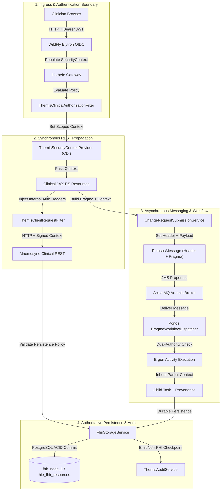

# Requirements

### Overview & Goals
The goal of Harmonia Security Task 04 is to establish an end-to-end architectural framework for propagating authenticated and authorized principal identity and security context from external Harmonia ingress boundaries (such as Iris BEFE WildFly/Elytron OIDC and Pylai FHIR REST) through all synchronous and asynchronous downstream processing tiers (Iris BEFE, Pylai, Ponos, Artemis, Ergon, Mneme, and Mnemosyne).

Tasks 01–03 established the Clinical inbound security boundary:
```
WildFly / Elytron OIDC ──► Jakarta SecurityContext ──► ThemisClinicalAuthorizationFilter ──► ThemisAuthorizationRequest ──► DeterministicPolicyEvaluator ──► ALLOW / DENY
```
Task 04 ensures that once an authenticated `HUMAN` principal is authorized at the Iris BEFE boundary, their identity, security domain, effective authorities, correlation ID, and causation chain are not dropped or replaced when processing transitions across:
1. **Synchronous In-Process & Inter-Service Calls** (BEFE JAX-RS Resource -> Service Layer -> Mnemosyne REST / Storage).
2. **Asynchronous Messaging Boundaries** (Petasos -> ActiveMQ Artemis Broker -> Ponos Worker).
3. **Workflow Activity Boundaries** (Ponos Dispatcher -> Praxis Workflow -> Ergon Activity Units -> Child Task Generation).
4. **Durable Persistence & Recovery** (Infinispan Mneme Caching -> PostgreSQL Mnemosyne JPA Persistence -> Restart / Retry / Replay).

---

### Scope

#### In Scope
- Preservation and propagation of initiating `ThemisPrincipal` (HUMAN) across all downstream tiers.
- Context lifecycle management across synchronous HTTP/REST, asynchronous Petasos/Artemis messaging, and Ergon task activities.
- Distinction between **Initiating Principal** (e.g., HUMAN clinician) and **Executing Principal** (e.g., `process:ponos-engine` or `service:mnemosyne`).
- Propagation of distributed tracing attributes (`correlationId`, `causationId`, `timestamp`).
- Hardening of the trust boundary against spoofed caller-controlled headers on internal interfaces.
- Design of child-task security context inheritance and FHIR `Provenance` attribution.
- Preservation of context during broker recovery, message retry, and cache write-behind.

#### Out of Scope
- Redesign of WildFly Elytron OIDC container authentication (completed in Tasks 01–02).
- Modification of Themis authorization policy logic or clinical permission matrix (completed in Task 03).
- AuditEvent WORM immutability and PostgreSQL audit storage design (reserved for Task 06).
- Clinical persistence remediation (e.g., eliminating in-JVM fallback, query pushdown, which are covered in Tasks 07–10).
- Direct modification of production source files during this exploration phase.

---

### User & System Stories
- **US-SEC-01 (Clinical Traceability):** As a Clinical System Auditor, I want every persisted clinical resource and downstream workflow task to record the identity of the human clinician who initiated the request, so that access provenance is unquestionable.
- **US-SEC-02 (Dual-Principal Execution):** As a Workflow Engine (`Ponos`), I want to execute automated processing under my own system authority while retaining and asserting the initiating clinician's identity and authorities, so that both initiator permissions and system execution constraints are evaluated.
- **US-SEC-03 (Asynchronous Resilience):** As an Asynchronous Worker consuming messages from ActiveMQ Artemis, I want to reconstruct the exact security context established at the HTTP ingress gateway, so that background operations are never executed under an anonymous or unverified context.
- **US-SEC-04 (Anti-Spoofing & Trust Boundary):** As a Platform Security Architect, I want downstream internal endpoints to accept security context only from trusted internal Harmonia channels, preventing external callers from forging identity via arbitrary request headers.

---

### Functional Requirements

#### 1. Canonical Security Context Lifecycle
- **FR-01:** Harmonia must represent security context using `ThemisSecurityContext` across all modules.
- **FR-02:** `ThemisSecurityContext` must encapsulate:
  - `requestingPrincipal` / `originatingPrincipal` (`ThemisPrincipal` with `principalId`, `PrincipalType`, `sourceDomain`, `attributes`).
  - `executingPrincipal` (`ThemisPrincipal` representing the active service or worker process).
  - `correlationId` (UUID linking all downstream actions to the root ingress request).
  - `causationId` (ID of the immediate parent message, task, or HTTP request).
  - `securityDomain` (e.g., `CLINICAL`, `PROVIDER_REGISTRY`, `OPERATIONS`).
  - `authorities` (Set of `ThemisAuthority` granted at ingress).
  - `requestedAt` (`Instant` timestamp of ingress initiation).

#### 2. Synchronous Context Propagation (Iris BEFE -> Mnemosyne)
- **FR-03:** `ThemisClinicalAuthorizationFilter` must store the resolved `ThemisSecurityContext` in a request-scoped CDI context accessible to JAX-RS resources.
- **FR-04:** JAX-RS Resource classes (`PersonResource`, `TaskResource`, etc.) and `FhirCacheService` must pass this context to downstream storage clients.
- **FR-05:** Outbound synchronous REST requests from BEFE to `mnemosyne-clinical` must transmit trusted security context using internal gateway headers signed or isolated to the internal network.

#### 3. Asynchronous Messaging Propagation (Petasos / Artemis)
- **FR-06:** `PetasosMessage` must provide first-class fields or metadata properties for `ThemisSecurityContext` and `originatingPrincipal`.
- **FR-07:** `ArtemisMessageConverter` must map the security context to ActiveMQ Artemis JMS message properties upon send, and reconstruct it upon consume.
- **FR-08:** `Pragma` domain envelopes and FHIR `Task` resources must embed the originating security context in their payload extensions (`http://example.org/hie/security/principal-id`, etc.) for durable tracking.

#### 4. Workflow Task Context Inheritance & Provenance (Ponos & Ergon)
- **FR-09:** `PragmaWorkflowDispatcher` in Ponos must evaluate dual authority: verifying that the initiating `ThemisPrincipal` (HUMAN) has submission rights, and the executing `ThemisPrincipal` (PROCESS) has processing rights.
- **FR-10:** When an Ergon activity generates child tasks (e.g., `ErgonBase.createOutgoingTasks`), the child task must inherit the parent task's `originatingPrincipal`, `correlationId`, and security labels, with `causationId` set to the parent task's ID.
- **FR-11:** `ErgonBase.createProvenance` must record the initiating user as `Provenance.agent[role=initiator]` and the processing device/ergon as `Provenance.agent[role=assembler]`.

#### 5. Persistence & Recovery Context Preservation
- **FR-12:** `FhirStorageService` in Mnemosyne Clinical must receive the propagating `ThemisSecurityContext` and evaluate persistence authorization against the initiating and executing principals.
- **FR-13:** When queued messages or cached Pragmas are replayed after broker or server restart, the reconstructed security context must be identical to the original ingress context.

#### 6. Trust Boundary & Anti-Spoofing
- **FR-14:** External edge endpoints (BEFE `/api/fhir/*`) must strictly ignore caller-supplied `X-Harmonia-*` or `X-Principal-*` headers, resolving identity exclusively from the validated container `SecurityContext` (Elytron OIDC).
- **FR-15:** Internal service-to-service endpoints must validate an internal trust token or mTLS identity before accepting propagated internal security headers.

---

### Non-Functional Requirements
- **NFR-01 (Zero-PHI Compliance - Invariant 7):** Security context models, Petasos message headers, and log events must never contain unmasked Protected Health Information (PHI). Only opaque IDs and security domains may be logged.
- **NFR-02 (Default-Deny & Fail-Closed - Invariant 6):** If a downstream component receives a message or request with a missing or malformed security context, it must default to `DENY` or reject the message with an `OperationOutcome` error.
- **NFR-03 (Architecture Test Isolation - Invariants 1-3, 8):** Context propagation must strictly adhere to subproject hierarchy: `Themis API` has zero dependencies on engine/storage; `Petasos API` has zero dependencies on JMS/Artemis; `Iris` has zero dependencies on JPA/PostgreSQL; `Paradeigma` is completely isolated from production code.

# Technical Design

### 1. Existing Security & Principal Context Abstractions

The Harmonia codebase already contains well-structured security and workflow models that must be unified:

| Subproject / Module | Class / Interface | Responsibility & Structure |
| :--- | :--- | :--- |
| `themis/themis-api` | `ThemisPrincipal` | Immutable record representing authenticated identity: `principalId`, `PrincipalType` (`HUMAN`, `SYSTEM`, `SERVICE`, `PROCESS`), `sourceDomain`, `attributes`. |
| `themis/themis-api` | `PrincipalType` | Enum categorizing principals: `HUMAN`, `SYSTEM`, `SERVICE`, `PROCESS`. |
| `themis/themis-api` | `ThemisAuthority` | Granular permission representation: `authority` (e.g., `clinical.read`, `clinical.create`). |
| `themis/themis-api` | `ThemisSecurityContext` | Immutable record: `requestingPrincipal`, `correlationId`, `causationId`, `tenantId`, `clientIp`, `requestedAt`, `attributes`. |
| `themis/themis-api` | `ThemisResource` | Target descriptor: `resourceType`, `resourceId`, `securityDomain`, `securityLabels`. |
| `themis/themis-api` | `ThemisAuthorizationRequest` | Evaluation contract: `principal`, `authorities`, `action`, `target`, `context`. |
| `themis/themis-audit` | `ThemisAuditEvent` | Immutable security audit record: `decision`, `reason`, `policyId`, `principalId`, `principalType`, `sourceDomain`, `action`, `correlationId`, `causationId`. |
| `themis/themis-core` | `HarmoniaServiceIdentities` | Controlled system/service identities: `service:pylai`, `service:petasos`, `service:ponos`, `service:mnemosyne`, `service:themis`. |
| `calliope/calliope-models` | `Pragma` | Work envelope: `pragmaId`, `initiatingUser`, `originatingPrincipal` (`ThemisPrincipal`), `originatingAuthorities`, `originatingSecurityContext`, `correlationId`, `causationId`. |
| `calliope/calliope-models` | `PragmaSecurityContext` | Domain security context record matching Themis attributes. |
| `calliope/calliope-models` | `FhirSecurityTagManager` | Applies canonical FHIR security labels (`CLINICAL`, `PROVIDER_REGISTRY`, `INTERNAL`) to resources. |
| `petasos/petasos-api` | `PetasosMessage` | Resilient message envelope: `messageId`, `correlationId`, `causationId`, `source`, `destination`, `payload`, `metadata`. |
| `energeia/erga` | `ErgonBase` | Activity execution base: handles `Task` lifecycle, child task creation, and `Provenance` resource generation. |
| `energeia/ponos` | `PragmaWorkflowDispatcher` | Dual-authority evaluation: checks both `originatingPrincipal` (HUMAN) and `executionPrincipal` (`process:ponos-engine`). |

---

### 2. Current Clinical Execution Path

The execution flow starting from an authenticated Iris Clinical HTTP request is:
```
1. Client HTTP Request (with Bearer JWT)
   │
   ▼
2. WildFly / Elytron OIDC Ingress Layer
   - Validates JWT signature, claims, and expiry.
   - Populates Jakarta SecurityContext with PrincipalType.HUMAN.
   │
   ▼
3. Iris BEFE ThemisClinicalAuthorizationFilter
   - Extracts ThemisPrincipal (HUMAN) and ThemisAuthority set.
   - Evaluates ThemisAuthorizer.authorize(authRequest) -> ALLOW.
   - Stores attributes in requestContext: ATTR_THEMIS_PRINCIPAL, ATTR_THEMIS_CONTEXT, etc.
   │
   ▼
4. Iris BEFE JAX-RS Resource (e.g., PersonResource.create(payload))
   - Parses FHIR Person from JSON payload.
   │
   ▼ [CONTEXT DROP POINT 1: Security attributes in requestContext are NEVER read or passed to service]
   │
5. FhirCacheService.saveResource(person)
   - Applies FhirSecurityTagManager.applyDefaultSecurityTag(person).
   - Stamps versionId and lastUpdated in Resource.meta.
   │
   ▼ [CONTEXT DROP POINT 2: Infinispan Hot Rod cache write / REST call has no principal metadata]
   │
6. Infinispan RemoteCache.put(id, json) / (Target) Mnemosyne Clinical REST API
   │
   ▼ [CONTEXT DROP POINT 3: Mnemosyne defaults persistence principal to service:mnemosyne]
   │
7. Mnemosyne FhirStorageService.saveResource(entity)
   - Evaluates Themis persistence authorization using fallback identity (service:mnemosyne).
   - Writes to PostgreSQL (hie_fhir_resources table).
```

---

### 3. Context-Loss Points (Root Cause Analysis)

| Context Loss Point | Exact Code Location | Architectural Description |
| :--- | :--- | :--- |
| **Point 1: BEFE Resource Layer** | `iris-befe/src/main/java/.../rest/*Resource.java` (all 14 endpoints) | JAX-RS resource methods (e.g. `PersonResource.create`, `update`, `delete`) do not inject `ContainerRequestContext` or read `ATTR_THEMIS_PRINCIPAL` / `ATTR_THEMIS_CONTEXT`. They call `cacheService.saveResource(resource)` without passing security context. |
| **Point 2: BEFE Service Layer** | `iris-befe/src/main/java/.../service/FhirCacheService.java:138-171` | `saveResource` constructs FHIR JSON and writes to Infinispan Hot Rod or in-JVM fallback without attaching principal or correlation headers. |
| **Point 3: Petasos Message Envelope** | `petasos/petasos-api/.../model/PetasosMessage.java` & `ArtemisMessageConverter.java` | `PetasosMessage` has `correlationId` and `causationId`, but lacks a first-class `ThemisSecurityContext` or `originatingPrincipal` field. If not packed inside payload JSON, context is dropped at the broker boundary. |
| **Point 4: Ergon Child Task Creation** | `energeia/erga/.../base/ErgonBase.java:638-666` | When `ErgonBase.createOutgoingTasks` creates discrete child tasks (`Task-out-1`), it copies `contained`, `for`, and `focus`, but does not copy `originatingPrincipal` extensions or `securityContext` from the parent task/Pragma. |
| **Point 5: Mnemosyne Persistence Authorization** | `hestia/mnemosyne-clinical/.../service/FhirStorageService.java:125-135` | `authorizePersistence` defaults to `HarmoniaServiceIdentities.PRINCIPAL_MNEMOSYNE` (`service:mnemosyne`) whenever the caller does not pass an explicit principal. |
| **Point 6: PostgreSQL Entity Storage** | `hestia/mnemosyne-clinical/.../model/FhirResourceEntity.java` | The `hie_fhir_resources` relational table stores `resource_type`, `fhir_id`, `version_id`, `resource_json`, `is_deleted`, `last_updated`. Initiating principal and correlation ID are not indexed in relational columns (they exist only if embedded in FHIR `resource_json`). |

---

### 4. Synchronous vs Asynchronous vs Persistence Propagation Analysis

#### A. Synchronous In-Process & Inter-Service Calls
- **Current State:** Identity survives up to `ThemisClinicalAuthorizationFilter`'s `requestContext.setProperty()`. It is dropped immediately at the JAX-RS Resource -> `FhirCacheService` boundary because method signatures accept only FHIR resource objects (`Person`, `Task`).
- **Target Design:** A CDI `@RequestScoped` `ThemisSecurityContextProvider` will hold the active `ThemisSecurityContext` for the duration of the HTTP thread. Outbound REST clients (BEFE -> Mnemosyne) will use a JAX-RS `ClientRequestFilter` to attach signed internal headers (`X-Harmonia-Internal-Principal`, `X-Harmonia-Correlation-Id`, `X-Harmonia-Security-Context-Token`).

#### B. Asynchronous Messaging (Petasos / ActiveMQ Artemis)
- **Current State:** `ChangeRequestSubmissionService` embeds `originatingPrincipal` into `Pragma` and converts it to FHIR `Task` extensions. `PetasosMessage` serializes this into the message payload. However, broker-level filtering and non-Pragma messages lose the security context because `PetasosMessage` has no transport-level security context header.
- **Target Design (Hybrid Dual-Layer):**
  1. **Transport Layer:** `PetasosMessage` exposes `ThemisSecurityContext`. `ArtemisMessageConverter` serializes this to standardized JMS message properties (`harmonia_initiating_principal`, `harmonia_security_domain`, `harmonia_correlation_id`).
  2. **Domain Envelope Layer:** The `Pragma` / FHIR `Task` payload retains full `PragmaSecurityContext` in its canonical JSON structure for durable business tracking.

#### C. Persistence, Restart, Retry, and Replay
- **Current State:** Pragmas cached in Infinispan retain `originatingPrincipal`. However, when Mnemosyne persists resources to PostgreSQL, or when messages are re-read from Artemis Dead Letter Queues (DLQ), execution occurs under `service:mnemosyne` or `service:ponos` without re-verifying the initiating human context.
- **Target Design:** During replay or recovery, the consumer deserializes `ThemisSecurityContext` directly from the `PetasosMessage` / `Pragma` envelope, restoring the exact initiating `HUMAN` identity and original `correlationId`.

---

### 5. HUMAN versus SYSTEM Identity Model

A critical requirement is distinguishing **Initiating Identity** from **Executing Identity**:

```
[HUMAN: Dr. Mark Hunter] ──(initiates request)──► [Iris BEFE Gateway]
                                                         │
                                                         ▼
                                                [Petasos / Artemis]
                                                         │
                                                         ▼
                                            [PROCESS: Ponos Dispatcher]
                                                         │ (executes on behalf of Dr. Mark)
                                                         ▼
                                            [SERVICE: Mnemosyne JPA]
                                                         │ (persists mutation)
                                                         ▼
                                            [PostgreSQL / Provenance]
                                            - Initiator: Dr. Mark Hunter (HUMAN)
                                            - Executor: Ponos Engine (PROCESS)
                                            - Storage: Mnemosyne Service (SERVICE)
```

- **Dual-Principal Representation:**
  - `ThemisSecurityContext.requestingPrincipal()`: The initiating `ThemisPrincipal` (`PrincipalType.HUMAN`).
  - `ThemisSecurityContext.executingPrincipal()`: The active executing `ThemisPrincipal` (`PrincipalType.PROCESS` or `PrincipalType.SERVICE`).
- **Authorization Dual-Gate:**
  - Ingress evaluates `initiatingPrincipal` against domain permissions (e.g. `clinical.create`).
  - Ponos / Ergon evaluates `executingPrincipal` against system processing permissions (e.g. `provider.change.process`), while verifying that `initiatingPrincipal` is authorized for the underlying operation.

---

### 6. Trust Boundary & Anti-Spoofing Analysis

#### Anti-Spoofing Rules:
1. **External Boundary (Iris BEFE `/api/fhir/*`):**
   - External callers MUST NOT be allowed to establish or alter identity via headers (`X-Principal-Id`, `X-Harmonia-User`, `X-User-Roles`).
   - `ThemisClinicalAuthorizationFilter` correctly extracts identity exclusively from `requestContext.getSecurityContext()` (populated by Elytron OIDC) and ignores caller headers.
2. **Pylai Ingress Interceptor (`FhirSecurityInterceptor`):**
   - **Vulnerability Identified:** `FhirSecurityInterceptor.java:162-207` extracts principal and authorities directly from raw HTTP headers (`X-Requester`, `X-Principal-Id`, `X-User-Roles`).
   - **Mitigation:** In production, Pylai must validate an upstream API Gateway signature (e.g., HMAC or JWT Bearer) before accepting these headers, or reject them when exposed to external callers.
3. **Internal Subsystem Propagation:**
   - Inter-service REST calls between BEFE, Pylai, and Mnemosyne must pass a mutually trusted internal token (`X-Harmonia-Internal-Auth`) to verify that the forwarded `ThemisSecurityContext` was produced by a trusted Harmonia boundary.

---

### 7. End-to-End Architecture Diagrams

#### Target Architecture: Hybrid Security Context Propagation


---

### 8. Affected Files & Modules Matrix

| Module | Component / File | Nature of Required Enhancement |
| :--- | :--- | :--- |
| `themis/themis-api` | `ThemisSecurityContext.java` | Add `executingPrincipal`, `securityDomain`, `authorities` fields and builders. |
| `calliope/calliope-models` | `PragmaSecurityContext.java` | Align fields with canonical `ThemisSecurityContext`. |
| `calliope/calliope-models` | `Pragma.java` | Add helper methods for initiating vs executing principal accessors. |
| `petasos/petasos-api` | `PetasosMessage.java` | Add `securityContext` and `originatingPrincipal` fields and builders. |
| `petasos/petasos-artemis` | `ArtemisMessageConverter.java` | Map `ThemisSecurityContext` to/from JMS message properties. |
| `iris/iris-befe` | `ThemisClinicalAuthorizationFilter.java` | Store `ThemisSecurityContext` in CDI request scope. |
| `iris/iris-befe` | `ThemisSecurityContextProvider.java` | New CDI bean holding active request security context. |
| `iris/iris-befe` | `rest/*Resource.java` (14 classes) | Inject security context provider and pass to service layer. |
| `iris/iris-befe` | `service/FhirCacheService.java` | Accept security context; pass to outbound Mnemosyne REST client. |
| `pylai/pylai-fhir-registry` | `FhirSecurityInterceptor.java` | Distinguish trusted internal headers from untrusted external headers. |
| `energeia/erga` | `base/ErgonBase.java` | Propagate security context to child tasks and record dual agents in `Provenance`. |
| `energeia/ponos` | `PragmaWorkflowDispatcher.java` | Preserve initiating HUMAN principal during dual-authority checks. |
| `hestia/mnemosyne-clinical` | `service/FhirStorageService.java` | Accept `ThemisSecurityContext` for persistence authorization. |

# Testing

### Validation Approach
Verification of security context propagation must prove that:
1. An initiating `HUMAN` principal is never dropped, anonymized, or overwritten as requests traverse synchronous and asynchronous boundaries.
2. Both initiating (`HUMAN`) and executing (`PROCESS`/`SERVICE`) identities are accurately captured at workflow and persistence stages.
3. External untrusted headers cannot forge or override security context.
4. ActiveMQ Artemis broker message retry and recovery retain complete context without degradation.
5. All ArchUnit architectural guardrails (Invariants 1-8) pass without violation.

---

### Key Scenarios

#### Scenario 1: Synchronous Clinical Mutation Context Propagation
- **Flow:** User authenticates via OIDC (`dr.smith`, `CLINICIAN`) -> POST `/api/fhir/Person` -> `ThemisClinicalAuthorizationFilter` -> `PersonResource` -> `FhirCacheService` -> `Mnemosyne REST` -> PostgreSQL.
- **Verification:**
  - `ThemisClinicalAuthorizationFilter` grants `CREATE` for `dr.smith`.
  - Outbound HTTP call to Mnemosyne includes valid `X-Harmonia-Internal-Principal: dr.smith`.
  - `FhirStorageService.authorizePersistence` logs and audits `principalId=dr.smith`, `principalType=HUMAN`, `securityDomain=CLINICAL`.
  - Stored resource metadata reflects version increment without dropping initiator context.

#### Scenario 2: Asynchronous Pragma/Task Workflow & Dual Authority
- **Flow:** Provider Registry change submitted -> `ChangeRequestSubmissionService` -> `PetasosMessage` -> ActiveMQ Artemis -> `PragmaWorkflowDispatcher` -> `ErgonBase`.
- **Verification:**
  - `PetasosMessage` JMS properties contain `harmonia_initiating_principal=dr.smith`.
  - `PragmaWorkflowDispatcher` evaluates `origAuthReq` for `dr.smith` (`HUMAN`) and `execAuthReq` for `process:ponos-engine` (`PROCESS`).
  - `ErgonBase.createOutgoingTasks` creates `Task-out-1` containing parent `dr.smith` security extensions.
  - `ErgonBase.createProvenance` outputs a `Provenance` resource where `agent[initiator]=dr.smith` and `agent[assembler]=Device/ergon-id`.

#### Scenario 3: Broker Recovery & Replay Context Resilience
- **Flow:** Artemis broker queues messages; broker is restarted or consumer is paused; messages are consumed after restart.
- **Verification:**
  - Reconstructed `ThemisSecurityContext` on consumer matches the original ingress context exactly.
  - Correlation ID and causation ID are identical.
  - Retried messages do not synthesize new anonymous principals.

#### Scenario 4: Trust Boundary & Anti-Spoofing Defense
- **Flow:** External client sends HTTP request to `/api/fhir/Person` with spoofed headers `X-Harmonia-User: admin`, `X-Principal-Id: root`, `X-User-Roles: SYS_ADM`.
- **Verification:**
  - `ThemisClinicalAuthorizationFilter` ignores all spoofed headers.
  - Principal is resolved strictly from Elytron OIDC token.
  - If token is missing, request is rejected with `401 Unauthorized`.
  - If token lacks `SYS_ADM`, request is rejected with `403 Forbidden`.

---

### Architectural Test Suite
The following ArchUnit tests in `paradeigma/paradeigma-test/src/test/java/.../arch/` must execute and pass:
- `SecurityEnforcementArchitectureTest`: Asserts Themis policy contracts and security context immutability.
- `PetasosApiIsolationArchitectureTest`: Asserts zero JMS or Artemis API dependencies in `petasos-api`.
- `IrisDecouplingArchitectureTest`: Asserts zero direct JPA/PostgreSQL dependencies in Iris BEFE.
- `AgoraIsolationArchitectureTest`: Asserts Ponos decoupling and Themis default-deny governance for Agora.
- `ParadeigmaIsolationArchitectureTest`: Asserts zero production dependencies on simulation modules.
- `PackageLayeringArchitectureTest`: Asserts strict unidirectional dependency layering across all 9 subprojects.

# Delivery Steps

### ✓ Step 1: Canonical Security Context & Inter-Service Contract Alignment
Establish canonical security context models across Themis, Calliope, and Petasos, ensuring immutable representation of initiating and executing identities.

- Enhance `ThemisSecurityContext` in `themis-api` to fully encapsulate initiating principal (`HUMAN`), executing/delegated principal (`SYSTEM`/`SERVICE`), security domain, granted authorities, correlation ID, causation ID, and timestamp.
- Align `PragmaSecurityContext` in `calliope-models` to match `ThemisSecurityContext` attributes, ensuring zero impedance mismatch between domain envelopes and security evaluations.
- Add first-class `securityContext` and `originatingPrincipal` properties to `PetasosMessage` in `petasos-api` without introducing any JMS or Artemis dependencies (preserving Invariant 2).
- Update `ArtemisMessageConverter` in `petasos-artemis` to map `ThemisSecurityContext` to standardized, signed JMS message headers (`harmonia_initiating_principal`, `harmonia_security_domain`, `harmonia_correlation_id`).
- Add unit tests validating serialization, deserialization, and immutability across Themis, Calliope, and Petasos modules.

### ✓ Step 2: Synchronous Context Propagation in Iris BEFE & REST Clients
Implement CDI request-scoped security context holding in Iris BEFE and propagate trusted identity headers to downstream REST services.

- Create `ThemisSecurityContextProvider` (CDI `@RequestScoped` / `@ApplicationScoped`) in `iris-befe` to hold `ThemisSecurityContext` extracted by `ThemisClinicalAuthorizationFilter`.
- Update JAX-RS clinical resources (`PersonResource`, `TaskResource`, `PractitionerResource`, etc.) and `FhirCacheService` to access and propagate the authenticated security context.
- Implement `ThemisClientRequestFilter` for outbound REST clients connecting BEFE to `mnemosyne-clinical`, injecting trusted internal headers (`X-Harmonia-Internal-Principal`, `X-Harmonia-Correlation-Id`, `X-Harmonia-Security-Context`) signed or gated by container trust.
- Update `FhirSecurityInterceptor` in `pylai-fhir-registry` and `mnemosyne-clinical` to distinguish between external untrusted caller headers and trusted internal gateway context.
- Add integration tests verifying synchronous identity propagation across BEFE to Mnemosyne REST boundaries.

###   Step 3: Hybrid Asynchronous Propagation via Petasos Message & Artemis Adapter
Propagate security context across Petasos messaging queues and ActiveMQ Artemis message brokers.

- Update `ChangeRequestSubmissionService` in `pylai-fhir-registry` to populate both `PetasosMessage.securityContext` transport header and the underlying `Pragma`/`Task` FHIR extension payload.
- Update `ArtemisProducerService` and `ArtemisConsumerService` in `petasos-artemis` to serialize and reconstruct `ThemisSecurityContext` upon message delivery.
- Ensure message retry and dead-letter queue handlers in Petasos retain originating principal and causation metadata intact without corruption.
- Add tests verifying context preservation across ActiveMQ Artemis message enqueue, dequeue, and retry cycles.

###   Step 4: Workflow Task Context Inheritance & Provenance in Ponos and Ergon
Ensure Ponos worker dispatchers and Ergon activity processing preserve initiating principal and generate accurate execution provenance.

- Update `PragmaWorkflowDispatcher` in `energeia-ponos` to extract `ThemisSecurityContext` from `PetasosMessage` and validate that `originatingPrincipal` (HUMAN) is preserved alongside `executionPrincipal` (`process:ponos-engine`).
- Update `ErgonBase` in `energeia-erga` (`processIngress`, `processErgon`, `processEgress`) to propagate `ThemisSecurityContext` into child tasks generated by Ergon activities.
- Update `ErgonBase.createProvenance` to record both the initiating user (`ThemisPrincipal.HUMAN`) and executing worker device/service (`ThemisPrincipal.SERVICE`) in generated FHIR `Provenance` resources.
- Add unit and workflow integration tests asserting dual-authority tracking and child task context inheritance.

###   Step 5: Persistence & Recovery Context Support in Mnemosyne and End-to-End Verification
Enable durable persistence and recovery of security context in Mnemosyne and verify end-to-end propagation.

- Update `FhirStorageService` in `hestia/mnemosyne-clinical` to accept `ThemisSecurityContext` from callers and pass it to `FhirStorageService.authorizePersistence` rather than falling back to default service identity.
- Update `PragmaCacheService` and `FhirRestCacheStore` in `hestia/mneme-persistence` to persist security context attributes during offline cache write-behind and recovery replay.
- Extend `SecurityEnforcementArchitectureTest` in `paradeigma-test` to assert end-to-end security context immutability and anti-spoofing across all Harmonia modules.
- Run full repository test suite including ArchUnit architecture tests to verify Invariants 1-8 are strictly preserved.