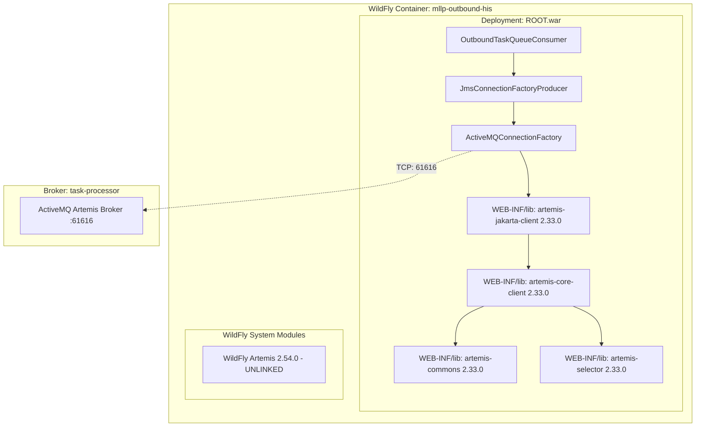

# Requirements

### Overview & Goals
During end-to-end verification of the Harmonia Health Integration Environment (HIE), an independent runtime failure occurred in the Outbound MLLP Gateway containers (`hie-mllp-outbound-his` and `hie-mllp-outbound-lis`):
```text
Could not create ActiveMQConnectionFactory for [tcp://127.0.0.1:61616]: java.lang.NoSuchMethodError: 'void org.apache.activemq.artemis.utils.uri.BeanSupport.setData(java.net.URI, java.util.HashMap, java.util.Set, java.util.Map, java.util.Map)'
```
The goal of this task is to perform a comprehensive dependency convergence and runtime classpath investigation across `pylai-mllp-base` and `pylai-mllp-out`, identify the precise root causes, apply the minimal dependency-convergence and packaging corrections, rebuild and verify the outbound MLLP containers with active Artemis broker connectivity, run the complete Docker Compose topology, and identify the next first independent runtime failure (if any).

### Scope
- **In Scope**:
  - Investigation of all 7 diagnostic questions required prior to modifying dependencies.
  - Maven dependency convergence for ActiveMQ Artemis dependencies across `pylai-mllp-base` and `pylai-mllp-out` aligned with the `petasos` broker/client version strategy (2.33.0).
  - Runtime packaging correction in `pylai-mllp-out/pom.xml` (`maven-war-plugin` manifest entries) to eliminate WildFly system module classpath pollution.
  - Verification via Maven dependency tree and focused module tests.
  - Docker artifact and image rebuild (`--no-cache`).
  - Runtime validation of Artemis client connection in `hie-mllp-outbound-his` and `hie-mllp-outbound-lis`.
  - Full Docker Compose execution and identification of the next independent runtime failure.
- **Out of Scope**:
  - Re-opening or modifying the resolved CDI/WildFly regression in `energeia/ponos`.
  - Broad Artemis version upgrades across the repository beyond converging on the established 2.33.0 strategy.
  - Iris presentation tier or UI modifications.
  - Modifications to Synthetic Simulation (`paradeigma`).

### User Stories
- **As an Integration Platform Operator**, I want the outbound MLLP gateway instances (`mllp-outbound-his` and `mllp-outbound-lis`) to start up reliably and establish connections to the Petasos Artemis task broker so that queued clinical outbound events (ADT, ORU, ORM, MFN) are dispatched to external hospital systems without startup crashes.
- **As a Developer**, I want clean Maven dependency convergence across all Artemis client modules so that transitive libraries (`artemis-core-client`, `artemis-commons`, `artemis-selector`) match the client library version and avoid conflicting WildFly server modules.

### Functional Requirements
- **FR-1**: Outbound MLLP gateway instances must instantiate `ActiveMQConnectionFactory` and connect to the Artemis broker at `TASK_PROCESSOR_BROKER_URL` (`tcp://task-processor:61616`) without encountering `NoSuchMethodError` or class linkage errors.
- **FR-2**: All Artemis libraries packaged in `ROOT.war` for `pylai-mllp-out` must converge on version 2.33.0 matching `petasos-artemis` and `energeia/ponos`.
- **FR-3**: The outbound MLLP WAR deployment must load Artemis classes strictly from `WEB-INF/lib` and not link WildFly's internal `org.apache.activemq.artemis` system module.
- **FR-4**: Full stack Docker Compose deployment must bring up PostgreSQL, Infinispan, Ponos, MLLP Inbound, MLLP Outbound, and Iris BEFE with diagnostic log inspection to detect the next runtime obstacle.

### Non-Functional Requirements
- **NFR-1 (Architectural Guardrails)**: Adhere to `AGENTS.md` Invariant 1 (Paradeigma isolation), Invariant 2 (Petasos abstraction), and Invariant 3 (Iris decoupling).
- **NFR-2 (Minimal Touch)**: Smallest possible dependency correction avoiding blanket upgrades or unnecessary file alterations.

# Technical Design

### Current Implementation & Investigation Findings

#### 1. Complete NoSuchMethodError Details
- **Exception**: `java.lang.NoSuchMethodError`
- **Declaring Class**: `org.apache.activemq.artemis.utils.uri.BeanSupport`
- **Expected Method Signature**:
  ```java
  public static void setData(URI uri, HashMap<String, Object> data, Set<String> disallowedProperties, Map<String, Object> defaults, Map<String, Object> ignored)
  ```
  Bytecode descriptor: `(Ljava/net/URI;Ljava/util/HashMap;Ljava/util/Set;Ljava/util/Map;Ljava/util/Map;)V`
- **Caller Stack Trace & Caller**:
  The call originates from `org.apache.activemq.artemis.uri.schema.connector.TCPTransportConfigurationSchema.internalNewObject(URI, Map, String)` (invoked at bytecode offsets 25, 195, and 218).
  This in turn is invoked during `ActiveMQConnectionFactory` instantiation:
  - `org.apache.activemq.artemis.jms.client.ActiveMQConnectionFactory.<init>(brokerUrl, user, pass)`
  - `org.apache.activemq.artemis.uri.ConnectionFactoryParser.newObject(URI, Map, String)`
  - Caller in application code:
    `net.fhirfactory.harmonia.mllpgateway.messaging.JmsConnectionFactoryProducer.produceConnectionFactory()` line 49
    and `net.fhirfactory.harmonia.mllpout.consumer.OutboundTaskQueueConsumer.start()` line 99.

#### 2. Exact JAR Supplying BeanSupport at Runtime
- In container `hie-mllp-outbound-his` / `hie-mllp-outbound-lis`, `BeanSupport` was supplied by WildFly's internal system module:
  `/opt/jboss/wildfly/modules/system/layers/base/org/apache/activemq/artemis/commons/main/artemis-commons-2.54.0.jar`
- In this Artemis 2.54.0 JAR, `setData` signature was modernized to:
  `public static void setData(URI uri, Map<String, Object> data, Set<String> disallowedProperties, Map<String, Object> defaults, Map<String, Object> ignored)` (descriptor `(Ljava/net/URI;Ljava/util/Map;Ljava/util/Set;Ljava/util/Map;Ljava/util/Map;)V`).

#### 3. Exact JAR/Version Against Which Calling Code Was Compiled
- `TCPTransportConfigurationSchema` was compiled against `artemis-commons` 2.31.2 / 2.33.0 where parameter 2 is specifically `java.util.HashMap` (`Ljava/util/HashMap;`).

#### 4. Maven Dependency Tree & Transitive Paths
- In `pylai/pylai-mllp-base` and `pylai/pylai-mllp-out`:
  ```text
  +- org.apache.activemq:artemis-jakarta-client:jar:2.33.0:compile
  |  +- org.apache.activemq:artemis-core-client:jar:2.31.2:compile
  |  +- org.apache.activemq:artemis-commons:jar:2.31.2:compile
  |  \- org.apache.activemq:artemis-selector:jar:2.31.2:compile
  ```
- **Transitive Path**: Root `pom.xml` imports `spring-boot-dependencies:3.2.5` BOM. That BOM defines `<dependencyManagement>` for Artemis artifacts at version `2.31.2`. Because `pylai-mllp-base` and `pylai-mllp-out` declare an explicit dependency only on `artemis-jakarta-client:2.33.0`, its transitive dependencies (`artemis-core-client`, `artemis-commons`, `artemis-selector`) are overridden by `spring-boot-dependencies` to `2.31.2`.

#### 5. Container Runtime Classpath & JAR Contents
- In container `ROOT.war` (`/opt/jboss/wildfly/standalone/deployments/ROOT.war`):
  `WEB-INF/lib` contained:
  - `artemis-jakarta-client-2.33.0.jar`
  - `artemis-core-client-2.31.2.jar`
  - `artemis-commons-2.31.2.jar`
  - `artemis-selector-2.31.2.jar`
- In `ROOT.war/META-INF/MANIFEST.MF`:
  ```manifest
  Dependencies: org.infinispan.client.hotrod, org.infinispan.commons, org.apache.activemq.artemis
  ```
- WildFly's JBoss Modules hierarchy gives system module dependencies declared in `Dependencies` higher classloading precedence over `WEB-INF/lib`. Consequently, WildFly linked its internal `org.apache.activemq.artemis` module (which exports `org.apache.activemq.artemis.commons` containing `artemis-commons-2.54.0.jar`), causing `BeanSupport` to be loaded from Artemis 2.54.0 instead of `WEB-INF/lib`.

#### 6. Determination of Root Cause
The runtime failure is caused by a compound issue:
1. **Deployment Manifest Pollution**: `pylai/pylai-mllp-out/pom.xml` explicitly included `org.apache.activemq.artemis` in `manifestEntries.Dependencies`. This instructed WildFly to load WildFly's internal Artemis 2.54.0 classes into the deployment classloader, which hid the `WEB-INF/lib` JARs and broke bytecode compatibility.
2. **DependencyManagement Mismatch**: Root `pom.xml` imports `spring-boot-dependencies:3.2.5` without importing `artemis-bom:2.33.0` first. This created a split classpath in Maven where `artemis-jakarta-client` was 2.33.0 while its transitive dependencies were forced to 2.31.2.

#### 7. Comparison with Petasos Artemis Strategy
- In `petasos/pom.xml`:
  ```xml
  <dependencyManagement>
      <dependencies>
          <dependency>
              <groupId>org.apache.activemq</groupId>
              <artifactId>artemis-bom</artifactId>
              <version>${artemis.version}</version>
              <type>pom</type>
              <scope>import</scope>
          </dependency>
      </dependencies>
  </dependencyManagement>
  ```
  `petasos` imports `artemis-bom:2.33.0` so all Artemis artifacts converge on 2.33.0. Furthermore, neither `petasos`, `energeia/ponos`, nor `pylai-mllp-in` declares `org.apache.activemq.artemis` in their deployment manifests; they rely on isolated packaging in `WEB-INF/lib` or application modules.

---

### Key Decisions
1. **Import `artemis-bom` in Root `pom.xml` `dependencyManagement`**:
   - *Chosen Approach*: Add `org.apache.activemq:artemis-bom:${artemis.version}` (2.33.0) to root `pom.xml` under `<dependencyManagement><dependencies>` before `spring-boot-dependencies`.
   - *Rationale*: In Maven dependency management, the first declared BOM wins for any overlapping dependencies. This guarantees repository-wide convergence on 2.33.0 for all Artemis artifacts (`artemis-core-client`, `artemis-commons`, `artemis-selector`, `artemis-jakarta-client`) without upgrading Artemis broadly.
2. **Remove `org.apache.activemq.artemis` from `pylai-mllp-out/pom.xml` Manifest**:
   - *Chosen Approach*: Remove `org.apache.activemq.artemis` from `manifestEntries.Dependencies` in `pylai/pylai-mllp-out/pom.xml`, leaving only `org.infinispan.client.hotrod, org.infinispan.commons`.
   - *Rationale*: Eliminates WildFly module pollution and allows the WAR to load its verified, converged 2.33.0 Artemis client libraries from `WEB-INF/lib`. Matches the working architecture of `pylai-mllp-in`.

---

### Proposed Changes

#### 1. Root `pom.xml`
Add `artemis-bom` import before `spring-boot-dependencies`:
```xml
            <!-- Apache ActiveMQ Artemis BOM (Convergence with Petasos strategy) -->
            <dependency>
                <groupId>org.apache.activemq</groupId>
                <artifactId>artemis-bom</artifactId>
                <version>${artemis.version}</version>
                <type>pom</type>
                <scope>import</scope>
            </dependency>

            <!-- Spring Boot Dependencies -->
            <dependency>
                <groupId>org.springframework.boot</groupId>
                <artifactId>spring-boot-dependencies</artifactId>
                <version>${spring-boot.version}</version>
                <type>pom</type>
                <scope>import</scope>
            </dependency>
```

#### 2. `pylai/pylai-mllp-out/pom.xml`
Update `maven-war-plugin` configuration:
```xml
            <plugin>
                <groupId>org.apache.maven.plugins</groupId>
                <artifactId>maven-war-plugin</artifactId>
                <configuration>
                    <archive>
                        <manifestEntries>
                            <Dependencies>org.infinispan.client.hotrod, org.infinispan.commons</Dependencies>
                        </manifestEntries>
                    </archive>
                </configuration>
            </plugin>
```

---

### Architecture Diagram


---

### File Structure
- `pom.xml`: Root POM defining `<dependencyManagement>`.
- `pylai/pylai-mllp-out/pom.xml`: Outbound MLLP WAR packaging configuration.

### Risks & Mitigations
- **Risk**: WildFly may fail to provide required Netty or logging dependencies if excluded from manifest.
  - *Mitigation*: Artemis client JARs in `WEB-INF/lib` package their own transitive Netty transport dependencies, and `pylai-mllp-in` runs successfully under identical configuration.
- **Risk**: Other Spring Boot dependencies might be affected by `artemis-bom`.
  - *Mitigation*: `artemis-bom` strictly manages `org.apache.activemq` group artifacts and aligns them directly with the repo's existing `${artemis.version}` (2.33.0).

# Testing

### Validation Approach
Verification will follow a strict five-tier validation pipeline:
1. **Dependency Convergence Check**: Confirm via Maven dependency plugin that all Artemis artifacts in `pylai-mllp-base` and `pylai-mllp-out` resolve to `2.33.0`.
2. **Local Unit & Integration Tests**: Run existing test suites for `pylai-mllp-base` and `pylai-mllp-out`.
3. **Artifact Inspection**: Inspect the generated `mllp-gateway-out.war` MANIFEST.MF and `WEB-INF/lib` contents.
4. **Targeted Container Execution**: Build the Docker image with `--no-cache` and verify `mllp-outbound-his` starts and connects to `task-processor:61616`.
5. **Full Topology Run**: Execute `docker compose up -d` across the full multi-tier architecture to discover the next independent runtime failure.

### Key Scenarios
- **Scenario 1: Dependency Convergence**
  - Command: `mvn dependency:tree -pl pylai/pylai-mllp-base,pylai/pylai-mllp-out -am | grep artemis`
  - Expected Outcome: Zero occurrences of `2.31.2`; all artifacts (`artemis-jakarta-client`, `artemis-core-client`, `artemis-commons`, `artemis-selector`) are `2.33.0`.
- **Scenario 2: Outbound Gateway Startup & JMS Connection**
  - Command: `docker logs hie-mllp-outbound-his`
  - Expected Outcome:
    - Log line: `Initializing ActiveMQConnectionFactory for MLLP Gateway connecting to tcp://task-processor:61616`
    - Log line: `Starting OutboundTaskQueueConsumer on dedicated queue [petasos.queue.mllp.outbound.HIS_NORTH] for instance [mllp-sender-his]`
    - Absence of `NoSuchMethodError: BeanSupport.setData`.
- **Scenario 3: Docker Compose Health & Next Runtime Failure Triage**
  - Command: `docker compose ps` and `docker compose logs`
  - Expected Outcome: Identify and document any subsequent failures across PostgreSQL, Infinispan, Ponos, and Iris.

### Edge Cases
- **Broker Connection Retries**: If the Artemis broker container (`task-processor`) is still initializing, verify that `OutboundTaskQueueConsumer` handles transient delays gracefully without throwing unrecoverable runtime errors.
- **Dedicated Queue Initialization**: Verify that each instance (`mllp-sender-his` on port 8087, `mllp-sender-lis` on port 8088) connects to its respective queue.

# Delivery Steps

### ✓ Step 1: Correct Artemis Dependency Management and Manifest Configuration
Harmonia Maven dependency management and Pylai outbound deployment manifest are updated to eliminate Artemis classpath conflicts and enforce version convergence.

- Add `org.apache.activemq:artemis-bom:${artemis.version}` (version 2.33.0) to `dependencyManagement` in root `pom.xml` preceding `spring-boot-dependencies` to ensure all transitive Artemis artifacts (`artemis-core-client`, `artemis-commons`, `artemis-selector`) converge cleanly to 2.33.0.
- Update `pylai/pylai-mllp-out/pom.xml` `maven-war-plugin` configuration to remove `org.apache.activemq.artemis` from `manifestEntries.Dependencies`, preserving only `org.infinispan.client.hotrod, org.infinispan.commons`.
- Ensure `pylai/pylai-mllp-base/pom.xml` and `pylai/pylai-mllp-out/pom.xml` rely on the managed Artemis BOM versioning without divergent transitive dependencies.

### ✓ Step 2: Verify Dependency Convergence and Module Test Suites
Maven build, dependency trees, and unit/integration tests for Pylai and Petasos modules pass without dependency divergence.

- Run `mvn dependency:tree -pl pylai/pylai-mllp-base,pylai/pylai-mllp-out -am` and verify that all Artemis client artifacts (`artemis-jakarta-client`, `artemis-core-client`, `artemis-commons`, `artemis-selector`) converge strictly on version 2.33.0 with no 2.31.2 artifacts present.
- Execute unit and integration tests for `pylai-mllp-base` and `pylai-mllp-out` (`mvn test -pl pylai/pylai-mllp-base,pylai/pylai-mllp-out -am`).
- Run architecture tests (`mvn test -pl paradeigma/paradeigma-test -am -Dtest="*ArchitectureTest"`) to verify that no architectural boundaries or isolation rules are violated.

### ✓ Step 3: Rebuild Container Images and Verify Outbound MLLP Runtime Connection
The outbound MLLP container images are rebuilt with no cache and verified to establish an active Artemis connection without NoSuchMethodError.

- Package the outbound MLLP WAR artifact (`mvn clean package -pl pylai/pylai-mllp-out -am -DskipTests`).
- Inspect the generated WAR archive (`target/mllp-gateway-out.war`) to verify that `META-INF/MANIFEST.MF` no longer includes `org.apache.activemq.artemis` and that `WEB-INF/lib` contains converged 2.33.0 Artemis JARs.
- Rebuild the outbound MLLP container image using `docker compose build --no-cache mllp-outbound-his mllp-outbound-lis`.
- Start the supporting services (`postgres-ops-1`, `infinispan-1`, `task-processor`) and launch `mllp-outbound-his`.
- Inspect container startup logs to confirm successful initialization of `ActiveMQConnectionFactory`, verification of Artemis broker connectivity on port 61616, and absence of `NoSuchMethodError`.

### ✓ Step 4: Execute Full Docker Compose Topology and Triage Next Runtime Failure
The full multi-tier Docker Compose environment is brought up and monitored to identify any subsequent runtime failures.

- Launch the complete container environment using `docker compose up -d`.
- Monitor container statuses and healthchecks across Tier 5 (PostgreSQL), Tier 4 (Infinispan nodes), Tier 3 (Ponos task processor), Tier 2 (WildFly BEFE and MLLP Gateways), and Tier 1 (Iris SPAs).
- Inspect container log streams for all active services to verify inter-service communication and record the next first independent runtime failure, if any emerges.