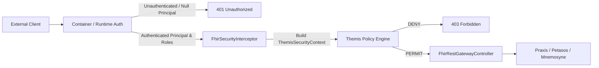

# Requirements

### Overview & Goals
The purpose of this plan is to resolve the **MAT-08** architectural finding identified in the Harmonia Architectural Axiom Conformance Assessment. 

Currently, `FhirSecurityInterceptor` within `pylai-fhir-registry` instantiates `ThemisPrincipal` and grants `ThemisAuthority` permissions directly from caller-controlled HTTP headers (`X-Principal-Id`, `X-Requester`, `X-User-Roles`, `X-Security-Scopes`), including wildcard role escalations (`*`, `ROLE_ADMIN`, `system/*.*` granting `SYS_ADM`). This violates the foundational security axiom **AX-07** (*"Security Is Intrinsic to Managed Operations"*), **AX-13** (*"Harmonia Management Has an Explicit Boundary"*), **ADR-005** (*"Themis Owns Security Policy Decisions"*), and **AGENTS.md** Invariant 6 (*"Default-Deny Security Governance"*).

This change establishes trusted caller identity at the Pylai ingress boundary prior to creating any governed Harmonia operation. It ensures identity and authority claims are sourced strictly from verified container/runtime authentication, separating authentication from Themis authorization policy evaluation, and failing closed when trusted identity is absent.

### Scope
- **In Scope:**
  - `pylai/pylai-fhir-registry/src/main/java/net/fhirfactory/harmonia/pylai/fhir/security/FhirSecurityInterceptor.java`: Replace header-based identity/authority extraction with container/servlet authenticated security context (`HttpServletRequest.getUserPrincipal()`, `request.isUserInRole(...)`). Remove application-level bearer token parsing hacks.
  - `pylai/pylai-fhir-registry/src/main/java/net/fhirfactory/harmonia/pylai/fhir/controller/FhirRestGatewayController.java`: Ensure controller endpoints handle container-authenticated security attributes and fail closed on unauthenticated requests.
  - `pylai/pylai-fhir-registry/src/main/java/net/fhirfactory/harmonia/pylai/fhir/controller/FhirGatewayExceptionHandler.java`: Ensure `AuthenticationException` maps to HTTP 401 Unauthorized with standard `OperationOutcome`.
  - Supporting unit and integration tests in `FhirSecurityInterceptorTest.java` and `FhirRestGatewayControllerTest.java`.
- **Out of Scope:**
  - Egress projection/sanitization changes (MAT-03).
  - Persistence port or caching modifications (MAT-01, MAT-06).
  - Redesigning Themis authorization policies in `themis-core`.
  - Inventing new authentication protocols, identity providers, or custom token parsing mechanisms (upstream container/reverse-proxy authentication wiring remains external).

### User Stories
- **As a Security & Governance Officer**, I want all incoming FHIR REST requests at the Pylai ingress boundary to require verified container identity, so that external callers cannot spoof user identities or self-assert administrative roles via arbitrary HTTP headers.
- **As a System Integrator**, I want unauthenticated or unauthorized requests to fail closed with standardized FHIR `OperationOutcome` diagnostics (HTTP 401 / 403), so that security enforcement is reliable and predictable.
- **As an Activity Orchestrator (Energeia/Ponos)**, I want workflow envelopes (`Pragma`) to carry only authentic, container-validated `ThemisSecurityContext` metadata, so that downstream asynchronous execution is governed by legitimate credentials.

### Functional Requirements
1. **Trusted Identity Extraction:**
   - Identity (`ThemisPrincipal`) SHALL be extracted strictly from the runtime/container security context (`request.getUserPrincipal()`), using the authenticated principal name.
   - Caller-controlled headers (`X-Principal-Id`, `X-Requester`, `X-Principal-Type`) SHALL NOT be used to establish caller identity.
2. **Trusted Authority Mapping:**
   - Permissions and roles (`ThemisAuthority`) SHALL be resolved strictly from container-authenticated role claims (`request.isUserInRole(...)`), mapping verified Harmonia role codes (e.g. `PRV_RDR`, `PRV_SUB`, `PRV_ADM`) to their corresponding `ThemisAuthority` sets.
   - Caller-controlled headers (`X-User-Roles`, `X-Security-Scopes`) SHALL NOT grant or elevate authorities.
   - Wildcard strings in headers (`*`, `ROLE_ADMIN`, `system/*.*`) SHALL NOT grant `SYS_ADM` authorities.
3. **Fail-Closed Authentication:**
   - If an incoming request lacks an authenticated principal (i.e. `request.getUserPrincipal() == null` or unauthenticated), `FhirSecurityInterceptor.authorize(...)` SHALL throw `AuthenticationException("Trusted caller identity not established")` resulting in HTTP 401 Unauthorized.
4. **Themis Authorization Evaluation:**
   - `ThemisSecurityContext` SHALL be constructed from the verified principal and passed to `ThemisService.authorize(...)`.
   - If Themis authorization is denied (`ThemisDecision.DENY`), the interceptor SHALL throw `ForbiddenOperationException` resulting in HTTP 403 Forbidden.
5. **Separation of Authentication and Authorization:**
   - Container authentication establishes caller identity and role claims; Themis evaluates authorization policy to determine if the operation is permitted.
   - Pylai SHALL NOT implement custom token validation or cryptography; token validity is established upstream by the container/runtime.
6. **Intentional Metadata Conformance Discovery:**
   - `GET /metadata` and `GET /fhir/metadata` SHALL remain accessible without authentication strictly to satisfy the HL7 FHIR R5 specification requiring unauthenticated `CapabilityStatement` discovery so clients can discover supported endpoints and security requirements.
7. **Non-Authoritative Transport Metadata:**
   - `X-Correlation-Id` MAY be retained solely as non-authoritative operational correlation metadata (generated if missing).
   - `X-Source-System` and `X-Source-Domain` MAY be retained as transport-origin metadata, but SHALL NOT confer authority or bypass security checks.
8. **No Security Context Ingestion into Clinical Resources:**
   - Transient credentials and operational security tokens SHALL NOT be persisted into FHIR clinical resources (`meta.security` retains only domain clinical confidentiality labels).

### Non-Functional Requirements
- **Security & Default-Deny:** Adhere strictly to Invariant 6 (`Themis` Default-Deny Security Governance) and AX-07.
- **Performance:** Context extraction from the native servlet `Principal` incurs zero additional network hops or heavy cryptographic overhead within the gateway interceptor.
- **Standards Compliance:** Errors return valid HL7 FHIR R5 `OperationOutcome` representations with appropriate HTTP 401 / 403 status codes.

# Technical Design

### Current Implementation
In `pylai/pylai-fhir-registry`:
- `FhirSecurityInterceptor.extractPrincipal(request)` reads `X-Principal-Id`, `X-Requester`, and `X-Principal-Type` headers directly. If blank, it checks `request.getUserPrincipal()`, falling back to `"system:anonymous"`.
- `FhirSecurityInterceptor.extractAuthorities(request)` parses comma-delimited strings from `X-User-Roles` and `X-Security-Scopes` headers, mapping tokens to `HarmoniaRoleEnum`, `HarmoniaAuthorityEnum`, and checking for `"*"`, `"ROLE_ADMIN"`, and `"system/*.*"` to grant full `HarmoniaRoleEnum.SYS_ADM.getThemisAuthorities()`.
- An application-level check `if ("Bearer invalid-token".equals(authHeader))` is used as a placeholder token validation hack.
- `FhirRestGatewayController` calls `securityInterceptor.authorize(resourceType, interaction, request)`, which constructs a `ThemisSecurityContext` and checks `themisService.authorize(...)`.
- This pattern allows an untrusted external HTTP client to bypass security simply by attaching `X-User-Roles: ROLE_ADMIN` or `X-Requester: admin`.

### Runtime Authentication Inspection & Assessment
- **Deployment Analysis:** Inspection of `pylai-fhir-registry` and the deployment configurations (`docker-compose.yml`, `deployment/kubernetes/base/`) reveals that `pylai-fhir-registry` is packaged as a component library/module (`jar`) and currently has **no configured runtime authentication provider** (e.g. no Spring Security `SecurityFilterChain`, no WildFly Elytron `oidc.json`/`web.xml`, and no reverse-proxy header authentication filter). In contrast, `iris-befe` is packaged as a WildFly WAR with `elytron-oidc-client` configured in `web.xml`.
- **Architectural Boundary:** In accordance with MAT-08 constraints and AX-07/AX-13, Pylai gateway components consume standard Java Servlet authentication contracts (`HttpServletRequest.getUserPrincipal()` and `HttpServletRequest.isUserInRole(...)`). Authentication boundary provisioning belongs to the hosting container/runtime or reverse proxy; Pylai must not hand-roll a new authentication protocol, JWT validator, or identity provider.
- **Trusted Claims vs Themis Authorization:** `HarmoniaRoleEnum` (e.g. `PRV_RDR`, `PRV_SUB`, `PRV_ADM`) represents canonical role claims asserted by the container/IDP and verified via `request.isUserInRole(...)`. The interceptor maps these verified claims to granular `ThemisAuthority` permissions, while `ThemisService` remains strictly responsible for evaluating authorization policies against the requested resource and action.
- **Intentional Anonymous Metadata Access:** `CapabilityStatementProvider` and `/metadata` endpoints are intentionally unauthenticated per the HL7 FHIR R5 core specification to enable clients to discover supported profiles, interactions, and security requirements prior to authentication.

### Key Decisions
1. **Container/Servlet Principal as Authoritative Source of Identity:**
   - *Decision:* Utilize `HttpServletRequest.getUserPrincipal()` as the sole source of caller identity.
   - *Rationale:* Conforms to AX-07 and ADR-005. Pylai relies on container-level authentication (e.g. mTLS, OAuth2/OIDC filter, reverse proxy authentication) to authenticate the connection prior to servlet dispatch.
2. **Container Role Checking for Authority Resolution:**
   - *Decision:* Map authorities by checking `request.isUserInRole(roleCode)` against defined `HarmoniaRoleEnum` values (e.g. `PRV_RDR`, `PRV_SUB`, `PRV_ADM`).
   - *Rationale:* Avoids custom unverified header parsing and leverages container-verified role assignments.
3. **Immediate Fail-Closed on Unauthenticated Ingress:**
   - *Decision:* Reject unauthenticated requests immediately with `AuthenticationException` (HTTP 401) before invoking Themis, reserving `ForbiddenOperationException` (HTTP 403) for authenticated callers lacking policy permissions.
   - *Rationale:* Strictly enforces the distinction between authentication (identity establishment) and authorization (policy evaluation).
4. **Removal of Custom Bearer Token Parsing Hacks:**
   - *Decision:* Completely remove the placeholder `"Bearer invalid-token"` check from `FhirSecurityInterceptor`.
   - *Rationale:* Pylai does not own bearer token authentication; bearer token validity is established upstream by the container/runtime.
5. **Header Deprecation for Authority:**
   - *Decision:* Completely ignore `X-User-Roles` and `X-Security-Scopes` for authorization; retain `X-Correlation-Id` and `X-Source-System` as non-authoritative diagnostics only.

### Architecture Diagram


### Proposed Changes
1. **`FhirSecurityInterceptor.java`:**
   - Update `extractPrincipal(HttpServletRequest request)`:
     ```java
     Principal userPrincipal = request != null ? request.getUserPrincipal() : null;
     if (userPrincipal == null || StringUtils.isBlank(userPrincipal.getName()) || "system:anonymous".equalsIgnoreCase(userPrincipal.getName())) {
         return null; // Signals unauthenticated caller
     }
     String principalId = userPrincipal.getName().trim();
     PrincipalType principalType = resolvePrincipalType(principalId);
     String sourceDomain = "pylai";
     return ThemisPrincipal.of(principalId, principalType, sourceDomain);
     ```
   - Update `extractAuthorities(HttpServletRequest request, ThemisPrincipal principal)`:
     ```java
     Set<ThemisAuthority> authorities = new HashSet<>();
     if (request != null && principal != null) {
         for (HarmoniaRoleEnum role : HarmoniaRoleEnum.values()) {
             if (request.isUserInRole(role.getRoleCode()) || request.isUserInRole("ROLE_" + role.getRoleCode())) {
                 authorities.addAll(role.getThemisAuthorities());
             }
         }
     }
     return Collections.unmodifiableSet(authorities);
     ```
   - In `authorize(String resourceType, String interaction, HttpServletRequest request)`:
     - Check if request is for `/metadata` or `CapabilityStatement`; allow unauthenticated discovery.
     - Extract `ThemisPrincipal principal = extractPrincipal(request);`
     - If `principal == null`, throw `new AuthenticationException("Trusted caller identity not established");`
     - Remove `Bearer invalid-token` literal check.
     - Extract authorities via container role checks (`request.isUserInRole`).
     - Build `ThemisSecurityContext` and evaluate with `themisService.authorize(...)`.
     - Throw `ForbiddenOperationException` if decision is `DENY`.
2. **`FhirGatewayExceptionHandler.java`:**
   - Ensure exception handler maps `ca.uhn.fhir.rest.server.exceptions.AuthenticationException` to HTTP 401 Unauthorized with standard `OperationOutcome`.
3. **`FhirRestGatewayController.java`:**
   - Ensure `request.getAttribute(FhirSecurityInterceptor.ATTR_THEMIS_CONTEXT)` is retrieved and propagated cleanly to `ChangeRequestSubmissionService`.

### Components Affected
- `pylai-fhir-registry`:
  - `FhirSecurityInterceptor`: Core security boundary interceptor.
  - `FhirRestGatewayController`: REST endpoints and request attribute consumption.
  - `FhirGatewayExceptionHandler`: Error response translation to FHIR `OperationOutcome`.
  - `ChangeRequestSubmissionService`: Asynchronous change request submission context propagation.

### File Structure
- `pylai/pylai-fhir-registry/src/main/java/net/fhirfactory/harmonia/pylai/fhir/security/FhirSecurityInterceptor.java` (Modified)
- `pylai/pylai-fhir-registry/src/main/java/net/fhirfactory/harmonia/pylai/fhir/controller/FhirGatewayExceptionHandler.java` (Modified)
- `pylai/pylai-fhir-registry/src/main/java/net/fhirfactory/harmonia/pylai/fhir/controller/FhirRestGatewayController.java` (Modified)
- `pylai/pylai-fhir-registry/src/test/java/net/fhirfactory/harmonia/pylai/fhir/security/FhirSecurityInterceptorTest.java` (Modified)
- `pylai/pylai-fhir-registry/src/test/java/net/fhirfactory/harmonia/pylai/fhir/controller/FhirRestGatewayControllerTest.java` (Modified)

### Risks & Mitigations
- **Risk:** Existing unit tests that relied on `X-User-Roles` or `X-Requester` headers will fail if container principals are not mocked.
  - *Mitigation:* Update tests to configure `request.setUserPrincipal(new Principal() { ... })` and `request.addUserRole("PRV_RDR")` on `MockHttpServletRequest`.
- **Risk:** Unauthenticated integration endpoints (e.g. metadata) might be blocked.
  - *Mitigation:* Maintain explicit bypass in `FhirSecurityInterceptor` for `metadata` / `CapabilityStatement` per FHIR R5 specification.

### Architectural Boundaries
- *Runtime Authentication Independence:* Pylai defines standard servlet security integration (`getUserPrincipal`, `isUserInRole`), maintaining decoupling from specific identity providers or token formats.
- *Boundary Check:* No new subsystems or network services are created. The change is strictly localized to Pylai ingress.

# Testing

### Validation Approach
Verification will be conducted via automated unit tests in `pylai-fhir-registry`, gateway mock MVC tests, and ArchUnit architectural invariant assertions.

### Key Scenarios
1. **Unauthenticated Ingress Rejection (Fail-Closed):**
   - Request to `/Practitioner/123` with no `Principal` on `HttpServletRequest` throws `AuthenticationException` and returns HTTP 401 Unauthorized.
2. **Header Spoofing Prevention:**
   - Request with `X-Principal-Id: admin`, `X-Requester: superuser`, and `X-User-Roles: ROLE_ADMIN` / `*` but without container authentication throws `AuthenticationException` and returns HTTP 401 Unauthorized.
   - Request with authenticated principal `dr-smith` (having role `PRV_RDR`) and spoofed header `X-User-Roles: SYS_ADM` is evaluated solely with `PRV_RDR` authorities and denied `POST /Practitioner` (HTTP 403 Forbidden).
3. **Authorized Read/Search Execution:**
   - Request with container authenticated principal `dr-smith` and role `PRV_RDR` (via `request.addUserRole("PRV_RDR")`) is granted access to `GET /Practitioner/{id}` and `GET /Practitioner`.
4. **Authorized Governed Change Submission:**
   - Request with container authenticated principal `steward-jane` and role `PRV_SUB` (via `request.addUserRole("PRV_SUB")`) is granted access to `POST /Practitioner` and `PUT /Practitioner/{id}`, correctly attaching the trusted `ThemisSecurityContext` to the created `Pragma`.
5. **Metadata Accessibility:**
   - `GET /metadata` and `GET /fhir/metadata` succeed without authentication.

### Edge Cases
- **Anonymous Principal Injection:** Request with `userPrincipal.getName() == "system:anonymous"` or blank name fails closed with `AuthenticationException`.
- **Missing Correlation ID:** Gateway generates a secure UUID correlation ID and attaches it to `ThemisSecurityContext`.

### Test Changes
- **`FhirSecurityInterceptorTest.java`:**
  - Update all test cases to configure `MockHttpServletRequest.setUserPrincipal(...)` and `request.addUserRole(...)`.
  - Remove obsolete tests asserting application-level bearer token string parsing.
  - Add explicit test `testHeaderSpoofingRejectedWithoutContainerPrincipal()`.
  - Add explicit test `testRoleHeaderInjectionIgnored()`.
  - Add explicit test `testUnauthenticatedFailsClosed()`.
- **`FhirRestGatewayControllerTest.java`:**
  - Update MockMvc requests to include mock principals and roles via `.principal(...)` or mock servlet configuration.
  - Verify HTTP 401 on unauthenticated endpoints and HTTP 403 on role-insufficient endpoints.
- **Architecture Test Suite:**
  - Run `SecurityEnforcementArchitectureTest` and `ParadeigmaIsolationArchitectureTest` to verify system-wide compliance.

# Delivery Steps

### ✓ Step 1: Refactor Pylai Ingress Interceptor for Container-Authenticated Identity
The Pylai FHIR security interceptor extracts identity and roles strictly from container-authenticated principals and container role checks, eliminating self-asserted identity and authority spoofing.

- Refactor `FhirSecurityInterceptor.java` (`extractPrincipal` and `extractAuthorities`) to read `HttpServletRequest.getUserPrincipal()` and `HttpServletRequest.isUserInRole(...)` instead of untrusted HTTP headers (`X-Principal-Id`, `X-Requester`, `X-User-Roles`, `X-Security-Scopes`).
- Remove wildcard privilege escalations (`*`, `ROLE_ADMIN`, `system/*.*`) that previously granted `SYS_ADM` from header tokens.
- Remove application-level placeholder bearer token parsing hacks (`Bearer invalid-token`).
- Implement strict fail-closed authentication in `FhirSecurityInterceptor.authorize(...)`, throwing `AuthenticationException` (401 Unauthorized) when the request has no authenticated principal, and `ForbiddenOperationException` (403 Forbidden) when Themis authorization evaluation denies access.
- Retain unauthenticated access strictly for `GET /metadata` and `GET /fhir/metadata` per the HL7 FHIR R5 specification for CapabilityStatement discovery.
- Retain non-authoritative transport metadata (`X-Correlation-Id`, `X-Source-System`) strictly as contextual tracing information without conferring authority.

### ✓ Step 2: Align Gateway Controller and Exception Handler with Trusted Context
The Pylai REST controller propagates the trusted container-backed `ThemisSecurityContext` to downstream services and maps authentication failures to standards-compliant HTTP status codes.

- Update `FhirRestGatewayController.java` to extract `ThemisPrincipal`, `ThemisAuthority`, and `ThemisSecurityContext` attributes populated by the container-backed interceptor.
- Ensure `FhirGatewayExceptionHandler.java` maps `AuthenticationException` to HTTP 401 Unauthorized with standard `OperationOutcome` error issues and preserves HTTP 403 Forbidden for `ForbiddenOperationException`.
- Verify that `ChangeRequestSubmissionService.java` receives trusted container-authenticated context for embedding into internal `Pragma` envelopes without persisting credentials into clinical FHIR resources.

### ✓ Step 3: Update Unit, Security, and Gateway Integration Tests
A comprehensive test suite verifies fail-closed security and proves that external callers cannot spoof identity or escalate privileges via HTTP headers.

- Update `FhirSecurityInterceptorTest.java` with test cases verifying rejection of unauthenticated requests, rejection of untrusted identity headers (`X-Principal-Id`, `X-Requester`), rejection of role injection headers (`X-User-Roles`, `X-Security-Scopes`), and successful authorization for mock authenticated container principals with valid roles (`PRV_RDR`, `PRV_SUB`).
- Update `FhirRestGatewayControllerTest.java` to test REST endpoints against authenticated and unauthenticated mock requests, asserting 401 Unauthorized for missing credentials and 403 Forbidden for insufficient permissions.
- Execute full subsystem tests (`mvn test -pl pylai/pylai-fhir-registry`) and ArchUnit architecture tests (`mvn test -pl paradeigma/paradeigma-test -am -Dtest="*ArchitectureTest"`) to guarantee zero architectural regression.